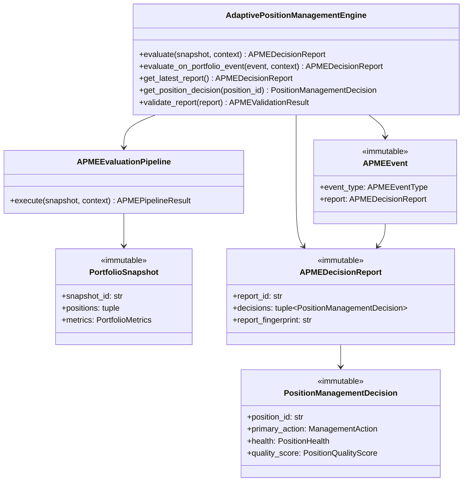

# Adaptive Position Management Engine (APME) — Software Engineering Specification

| Field | Value |
|---|---|
| **Module** | `apme/adaptive_position_management_engine.py` |
| **Document version** | 1.0.0 |
| **Status** | Draft — ready for implementation |
| **Owner** | THETA AI TRADER Core Platform |
| **Last updated** | 2026-08-04 |

---

## 1. Purpose

`apme/adaptive_position_management_engine.py` defines the **institutional adaptive position management and exit intelligence layer** for THETA AI TRADER v1.0.

The module is the **flagship post-execution intelligence engine** of the platform. It consumes immutable portfolio and position artifacts produced upstream (Portfolio Manager, Position Manager) together with orchestrator-injected market intelligence hints, regime labels, volatility metrics, news flags, and original signal exit/stop/target metadata, and performs **continuous, deterministic evaluation of every live position** — producing sealed management decisions for profit protection, exits, adjustments, rolls, hedges, break-even transitions, dynamic stop management, volatility exits, time exits, trend reversal exits, news-driven exits, portfolio protection, and risk escalation — but **never** selects strategies, collects market data, authenticates with brokers, submits orders, or mutates upstream position or portfolio records.

The module answers: *"Given this authoritative live portfolio state, per-position facts, injected market intelligence, and configured management policies, what management actions should the orchestrator consider for each open position — with full explainability, quality scoring, and exit probability — without executing anything directly?"*

It is **not** a strategy selection layer. It is **not** a market data engine. It is **not** an order submission layer. It is **not** a risk pre-trade gate. It is **not** a broker client. It is the **adaptive position management gate** between portfolio aggregation and orchestrator-driven management order planning.

### Pipeline placement

```text
[Market Data Engine]
    → MarketSnapshot (immutable)
              ↓
[Strategy Registry → Strategy Evaluation → Trade Decision]
              ↓
[risk/risk_engine.py]
    → RiskDecisionResult (pre-trade review)
              ↓
[execution/execution_engine.py]
    → ExecutionPlan (immutable)
              ↓
[execution/order_manager.py]
    → OrderSubmissionResult / OrderTracker
              ↓
[portfolio/position_manager.py]
    → PositionUpdateResult / PositionSnapshot
              ↓
[portfolio/portfolio_manager.py]
    → PortfolioUpdateResult / PortfolioSnapshot
              ↓
[apme/adaptive_position_management_engine.py]   ← THIS MODULE (FLAGSHIP)
    evaluate every live position continuously
    Position Health · Profit Protection · Exit Intelligence
    Adjustment · Rolling · Hedging · Break-even
    Dynamic Stop · Volatility Exit · Time Exit
    Trend Reversal Exit · News Exit Hooks
    Portfolio Protection · Risk Escalation
    Position Quality Score · Exit Probability
    publish apme.* lifecycle events
              ↓
    APMEDecisionReport (immutable)
    PositionManagementDecision(s) (immutable)
              ↓
[Orchestrator]
    translate decisions → new ExecutionPlan requests (future v1.1+)
    re-submit via Execution Engine / Order Manager when approved
              ↓
[Broker Layer via Order Manager]
    (APME never calls broker directly)
```

### Architecture freeze note

The platform architecture is **FROZEN** for v1.0:

- **APME** sits strictly **between** Portfolio Manager and the Broker Layer (via orchestrator-mediated order planning).
- **Post-execution position management ownership** for institutional pipeline runs belongs to APME — not the orchestrator, not Portfolio Manager, not Position Manager, not Risk Engine.
- Portfolio Manager **continues** to own account-level aggregation (`PortfolioSnapshot`, `portfolio.*` events); APME **reads** snapshots and events — never mutates them.
- Position Manager **continues** to own per-position accounting (`Position`, `PositionSnapshot`, `position.*` events); APME **reads** position facts — never mutates them.
- Risk Engine **continues** to own **pre-trade** validation; APME may **emit risk escalation hints** for orchestrator review but **never** replaces Risk Engine verdicts.
- APME **never** selects strategies, re-runs strategy plugins, or invokes Strategy Intelligence Engine.
- APME **never** subscribes to market data WebSocket feeds or performs broker authentication — all marks, Greeks, regime labels, and news flags are **orchestrator-injected hints** in v1.
- APME **never** calls `BaseBrokerClient` or any order API — management actions are **decision artifacts** returned to orchestrator.
- v1.0 APME produces **decisions only**; orchestrator owns translation to `ExecutionPlan` and order submission (documented handoff in Appendix B).

### Goals

1. Provide a **dedicated adaptive position management layer** between portfolio aggregation and broker execution — the platform's core differentiator.
2. **Continuously evaluate every live open position** after execution using deterministic, replay-verifiable rules.
3. Maintain **immutable decision outputs** with stable fingerprints and full structured explainability.
4. Operate **sixteen specialized intelligence sub-engines** under one unified evaluation pipeline with explicit arbitration.
5. Compute **PositionHealth** assessments per position and per position group (multi-leg structures).
6. Emit **ExitDecision** recommendations with trigger classification, urgency, and fractional exit hints.
7. Emit **AdjustmentDecision** recommendations for structure modifications (wing width, delta neutralization hints).
8. Emit **ProfitProtectionDecision** recommendations (trail activation, partial profit locks, target decay milestones).
9. Emit **RollingDecision** recommendations (roll out, roll up/down, roll to next expiry) as structured hints.
10. Emit **HedgingDecision** recommendations (delta hedge, tail hedge, vega hedge categories).
11. Manage **break-even transitions** — detect when positions cross break-even and adjust protective logic.
12. Apply **dynamic stop management** — translate signal `StopLossHint` metadata into live stop state recommendations.
13. Apply **volatility exit rules** — exit or reduce when IV rank, VIX regime, or vol-of-vol thresholds breach policy.
14. Apply **time exit rules** — DTE milestones, session cutoffs, theta decay targets, expiry approach logic.
15. Apply **trend reversal exit rules** — detect adverse trend shifts from injected regime/trend hints.
16. Expose **news exit hooks** — react to orchestrator-supplied news/event flags without fetching news directly.
17. Enforce **portfolio protection** — account-level drawdown, concentration, margin stress, and correlation guards.
18. Support **risk escalation** — elevate decisions to orchestrator/risk review when thresholds breached.
19. Compute **PositionQualityScore** — composite quality metric per position for ranking and prioritization.
20. Compute **ExitProbability** — calibrated probability estimate for exit within configured horizon (deterministic model v1).
21. Provide **full explainability** — every decision includes reason codes, contributing engine scores, and evidence chain.
22. Apply **multi-stage deterministic evaluation pipeline** with ordered stages and stable rule identifiers.
23. Publish **APME lifecycle events** via `core/event_bus.py` under the `apme.*` topic namespace.
24. Remain **thread-safe** for concurrent evaluation cycles and decision reads.
25. **Fail closed** on ambiguous inputs, stale hints beyond policy, or correlation mismatch — prefer explicit rejection over silent HOLD corruption.
26. Support **LIVE vs ANALYSIS vs BACKTEST** mode-aware strictness.
27. Achieve **deterministic, replay-verifiable** outcomes for identical inputs.
28. Expose **serialization** and **validation** for all public outward-facing types (schema v1.0.0).

### Success criteria

- Orchestrator invokes `AdaptivePositionManagementEngine.evaluate(portfolio_snapshot, context)` after each material portfolio update and receives immutable `APMEDecisionReport`.
- Every open position in `PortfolioSnapshot.positions` receives a `PositionManagementDecision` bundle (may be HOLD with zero actions).
- Identical inputs (portfolio snapshot fingerprint, evaluation context fingerprint, config) produce semantically equal `APMEDecisionReport` and identical `report_fingerprint`.
- All management intelligence flows through APME public API — orchestrator does not maintain parallel exit rule dictionaries in institutional pipeline runs.
- Unit test coverage ≥ 95% line coverage on `apme/adaptive_position_management_engine.py`.
- No module under `apme/adaptive_position_management_engine.py` imports strategy plugins, market data engines, broker SDK, order submission internals, or risk engine validation internals.
- Every non-HOLD decision includes at least one explainability record with engine attribution.

### Relationship to other modules

| Module | Relationship |
|---|---|
| `portfolio/portfolio_manager.py` | **Primary upstream input.** Consumes `PortfolioSnapshot`, subscribes to `portfolio.*` events. |
| `portfolio/position_manager.py` | **Secondary upstream input.** Reads `PositionSnapshot`, `Position` for leg-level detail when supplied. |
| `strategy/signals.py` | **Metadata source.** Reads original `ExitLogic`, `StopLossHint`, `TargetHint` from orchestrator context — never re-evaluates strategy. |
| `risk/risk_engine.py` | **Sibling — no direct import.** Escalation hints consumed by orchestrator; APME never calls Risk Engine. |
| `execution/execution_engine.py` | **Downstream via orchestrator.** Decisions translated to plans — APME never imports execution internals. |
| `execution/order_manager.py` | **No direct dependency.** Order submission is orchestrator responsibility. |
| `core/event_bus.py` | **Event publisher.** Publishes `APMEEvent` on `apme.*` topics. |
| `broker/base_broker.py` | **Forbidden.** APME never authenticates or calls broker APIs. |
| Market Data Engine | **Forbidden direct import.** Marks and vol hints injected by orchestrator. |
| Greeks Engine | **Forbidden computation import.** Greek hints injected; APME aggregates for hedge decisions only. |
| Orchestrator | **Invoker.** Calls `evaluate()`; injects market/regime/news hints; translates decisions to plans. |
| Trade Monitoring (future) | **Consumer.** Subscribes to `apme.*` for dashboards and audit trails. |

### Distinction from Portfolio Manager

| Concern | Portfolio Manager | APME |
|---|---|---|
| Role | Account-level state aggregation | Position management intelligence |
| Input | `PositionSnapshot` | `PortfolioSnapshot` + evaluation context |
| Output | Metrics, exposure, snapshots | Management decisions, health scores |
| Mutates positions | **Never** | **Never** |
| Computes P&L rollups | **Yes** | Reads rollups; may re-derive position-level metrics for rules |
| Exit logic | **Never** | **Core responsibility** |
| Order execution | **Never** | **Never** |

### Distinction from Position Manager

| Concern | Position Manager | APME |
|---|---|---|
| Role | Fill accounting and lifecycle | Post-fill management rules |
| Input | Order fills | Portfolio/position snapshots |
| Output | `Position`, `PositionSnapshot` | `APMEDecisionReport` |
| Quantity changes | From fills only | **Never** — recommends only |
| P&L calculation | Authoritative per-position | Reads for rule evaluation |
| Lifecycle transitions | OPEN → CLOSED from fills | Recommends exit/adjust — no transitions |

### Distinction from Risk Engine

| Concern | Risk Engine | APME |
|---|---|---|
| Timing | Pre-trade gate | Post-trade continuous management |
| Verdict | APPROVED / REJECTED / REDUCED | HOLD / EXIT / ADJUST / ROLL / HEDGE / ESCALATE |
| Capital allocation | Position sizing, budget | Portfolio protection, drawdown response |
| Strategy suitability | Evaluates new trades | **Never** selects strategies |
| Broker interaction | **Never** | **Never** |

### Distinction from Execution Engine

| Concern | Execution Engine | APME |
|---|---|---|
| Input | `RiskDecisionResult` + signal | `PortfolioSnapshot` + management context |
| Output | `ExecutionPlan` (entry orders) | `PositionManagementDecision` (management intents) |
| Order legs | Planned entry legs | Recommended exit/adjust/roll legs (hints only in v1) |
| When invoked | Pre-trade | Post-fill continuous |

---

## 2. Responsibilities

`apme/adaptive_position_management_engine.py` **is responsible for**:

| # | Responsibility | Description |
|---|---|---|
| R1 | **PortfolioSnapshot consumption** | Accept immutable `PortfolioSnapshot` as primary evaluation input. |
| R2 | **PositionSnapshot consumption** | Optional sealed `PositionSnapshot` for leg-level lifecycle detail. |
| R3 | **Evaluation context hydration** | Merge orchestrator hints (marks, vol, regime, news, signal metadata). |
| R4 | **Position Health Engine** | Assess structural integrity, liquidity, distance-to-strike, time decay health. |
| R5 | **Profit Protection Engine** | Trail stops, partial profit locks, premium decay milestones. |
| R6 | **Exit Intelligence Engine** | Unified exit recommendation synthesis from all exit sub-rules. |
| R7 | **Adjustment Engine** | Structure modification recommendations (wing adjustments, quantity reductions). |
| R8 | **Rolling Engine** | Roll-out, roll-up/down, next-expiry roll recommendations. |
| R9 | **Hedging Engine** | Delta, gamma, vega, tail hedge recommendations from portfolio Greeks. |
| R10 | **Break-even Engine** | Detect break-even crossings; transition protective rule sets. |
| R11 | **Dynamic Stop Management** | Live stop state from original `StopLossHint` + current marks. |
| R12 | **Volatility Exit** | IV rank, VIX regime, vol expansion/contraction exit triggers. |
| R13 | **Time Exit** | DTE, session time, theta milestones, expiry approach exits. |
| R14 | **Trend Reversal Exit** | Adverse trend/regime shift exit triggers from injected hints. |
| R15 | **News Exit Hooks** | React to orchestrator news/event flags with configurable policies. |
| R16 | **Portfolio Protection** | Account drawdown, concentration, margin stress, correlation guards. |
| R17 | **Risk Escalation** | Emit escalation decisions when policy thresholds require human/orchestrator review. |
| R18 | **Position Quality Score** | Composite deterministic quality metric per position. |
| R19 | **Exit Probability** | Deterministic exit probability estimate within configured horizon. |
| R20 | **Explainability assembly** | Reason codes, engine attribution, evidence chain per decision. |
| R21 | **Decision arbitration** | Resolve conflicts when multiple engines recommend opposing actions. |
| R22 | **Multi-stage evaluation pipeline** | Ordered stages with audit trail. |
| R23 | **Idempotent evaluation** | Re-evaluating identical fingerprint produces NOOP when configured. |
| R24 | **Correlation integrity** | Enforce `correlation_id` alignment across context and snapshot. |
| R25 | **APMEDecisionReport assembly** | Immutable sealed report with all position decisions. |
| R26 | **PositionManagementDecision assembly** | Per-position decision bundle with sub-decisions. |
| R27 | **Event bus integration** | Publish `APMEEvent` on hierarchical `apme.*` topics. |
| R28 | **Post-evaluation validation** | Validate sealed report before return. |
| R29 | **Error taxonomy** | Stable codes under `APME.*`. |
| R30 | **Serialization** | JSON round-trip for public types schema v1.0.0. |
| R31 | **Logging conventions** | Standard log events for evaluate start, engine results, publish, errors. |
| R32 | **Thread-safe execution** | Safe concurrent evaluation and decision reads. |
| R33 | **Stage audit trail** | Record per-stage pass/fail counts and rejection reasons. |
| R34 | **Report fingerprint** | Compute deterministic fingerprint for replay verification. |
| R35 | **Mode-aware strictness** | Different behavior for LIVE vs ANALYSIS vs BACKTEST. |
| R36 | **Documentation contract** | Google-style docstrings on all public types and methods. |
| R37 | **Warning emission** | Non-fatal warnings (stale hints, missing signal metadata). |
| R38 | **Query API** | `get_latest_report()`, `get_position_decision(position_id)`. |
| R39 | **Event-driven evaluation** | Handler for `portfolio.snapshot.published` events. |
| R40 | **Multi-leg structure awareness** | Evaluate position groups (strangles, condors) as units when grouped. |
| R41 | **Position group decisions** | Optional group-level decisions spanning multiple legs. |
| R42 | **Cooldown and debounce** | Prevent decision oscillation within configured windows. |

---

## 3. Non-Responsibilities

`apme/adaptive_position_management_engine.py` **must not**:

| # | Non-responsibility | Rationale |
|---|---|---|
| NR1 | **Select strategies or re-run strategy plugins** | Strategy Intelligence Engine responsibility. |
| NR2 | **Perform market data collection or WebSocket subscription** | Market Data Engine responsibility; hints injected only. |
| NR3 | **Perform broker authentication or session management** | Broker client / orchestrator responsibility. |
| NR4 | **Call `BaseBrokerClient.place_order`, `modify_order`, or any order API** | Order Manager responsibility. |
| NR5 | **Build or submit `ExecutionPlan` directly** | Orchestrator translates decisions to Execution Engine. |
| NR6 | **Mutate `Position`, `PositionSnapshot`, or position artifacts** | Position Manager owns position state. |
| NR7 | **Mutate `PortfolioSnapshot` or portfolio artifacts** | Portfolio Manager owns portfolio state. |
| NR8 | **Run pre-trade risk checks or emit APPROVED/REJECTED verdicts** | Risk Engine responsibility. |
| NR9 | **Compute Black-Scholes Greeks internally** | Greeks Engine responsibility; hints injected only. |
| NR10 | **Import Kite SDK or Zerodha-specific modules** | No broker transport in APME. |
| NR11 | **Construct broker client instances** | Orchestrator injects hints only. |
| NR12 | **Load environment variables or config files** | Accept injected `APMEConfig` at construction. |
| NR13 | **Persist decision state to disk or database** | External persistence concern; module returns immutable reports. |
| NR14 | **Fetch news feeds or scrape event calendars** | News flags injected by orchestrator only. |
| NR15 | **Call other analytical engines directly** | Orchestrator assembles inputs. |
| NR16 | **Import Execution Engine or Order Manager internals** | Public types via orchestrator handoff only. |
| NR17 | **Force exit on ambiguous data silently** | Fail closed — explicit rejection or HOLD with warning. |
| NR18 | **Merge positions across accounts without policy** | Account scoping explicit in config. |
| NR19 | **Implement UI or dashboard rendering** | Consumers read results or subscribe to events. |
| NR20 | **Perform contract/strike selection for new entries** | Contract Selection Engine responsibility. |
| NR21 | **Modify registry or register strategies** | Registry module responsibility. |
| NR22 | **Silently swallow invalid snapshot data** | All failures recorded in errors and report. |
| NR23 | **Use global mutable decision state without locking** | Per-engine state protected by lock. |
| NR24 | **Publish events when event bus is None** | Graceful no-op when bus not injected. |
| NR25 | **Authoritative broker reconciliation** | Position/Portfolio snapshots are primary in v1. |
| NR26 | **Apply tax lot accounting** | Position Manager uses average cost; APME reads. |
| NR27 | **Handle basket/combo broker position APIs** | v1 evaluates individual summaries and optional groups. |
| NR28 | **Re-plan or re-submit failed management orders** | Orchestrator must request new plan from Execution Engine. |
| NR29 | **Import `risk.risk_engine` or construct risk verdict types** | Escalation hints only — orchestrator invokes risk. |
| NR30 | **Train or invoke ML models in v1** | Deterministic rule engines only; ML hooks reserved for v2. |

---

## 4. Architecture

### 4.1 Layered design

```text
┌─────────────────────────────────────────────────────────────────────────────┐
│              apme/adaptive_position_management_engine.py                     │
│  (adaptive position management gate — no strategies, no market data,        │
│   no broker auth, no order submission)                                       │
│                                                                              │
│  ┌──────────────────────┐  ┌──────────────────────┐  ┌─────────────────┐  │
│  │ AdaptivePosition     │  │ APMEEvaluation       │  │ APMERegistry    │  │
│  │ ManagementEngine     │→ │ Pipeline             │→ │ (thread-safe)   │  │
│  │ (public service)     │  │ (22 ordered stages)  │  │                 │  │
│  └──────────────────────┘  └──────────────────────┘  └─────────────────┘  │
│           │                          │                          │            │
│           ▼                          ▼                          ▼            │
│  ┌────────────────────────────────────────────────────────────────────────┐  │
│  │ Sub-Engines (stateless, deterministic, independently testable):        │  │
│  │ PositionHealthEngine · ProfitProtectionEngine · ExitIntelligenceEngine │  │
│  │ AdjustmentEngine · RollingEngine · HedgingEngine · BreakEvenEngine       │  │
│  │ DynamicStopEngine · VolatilityExitEngine · TimeExitEngine                │  │
│  │ TrendReversalExitEngine · NewsExitHookEngine · PortfolioProtectionEngine │  │
│  │ RiskEscalationEngine · PositionQualityScorer · ExitProbabilityEngine   │  │
│  │ DecisionArbitrator · ExplainabilityAssembler · ReportSealer            │  │
│  └────────────────────────────────────────────────────────────────────────┘  │
└─────────────────────────────────────────────────────────────────────────────┘
         ▲                                              │
         │ PortfolioSnapshot + APMEEvaluationContext     ▼
         │                                         APMEDecisionReport
         │                                         PositionManagementDecision(s)
         │                                         apme.* events
```

### 4.2 Design principles

- **Single responsibility** — post-execution position management intelligence only; no entries, no broker, no market data collection.
- **Immutable outputs** — every `APMEDecisionReport`, `PositionManagementDecision`, sub-decision type is frozen.
- **Read-only upstream** — all position and portfolio fields read from snapshots; never mutated.
- **Fail closed** — ambiguous inputs reject evaluation or emit explicit HOLD with warnings — never silent destructive recommendations.
- **Deterministic replay** — identical inputs produce identical fingerprints and decisions.
- **Hint-based intelligence** — marks, vol, regime, news from orchestrator injection, not live polling in v1.
- **Multi-engine composition** — no single indicator drives exits; every decision aggregates multiple engine dimensions.
- **Explainability-first** — every non-trivial decision carries structured reason codes and engine attribution.
- **Event-first observability** — every material decision change publishes an `apme.*` event when enabled.
- **Engine independence** — sub-engines are stateless, receive immutable context, return immutable partial results; never call each other directly.

### 4.3 Component responsibilities

| Component | Responsibility |
|---|---|
| `AdaptivePositionManagementEngine` | Public service; orchestrates pipeline; query API; event handlers. |
| `APMEEvaluationContext` | Immutable per-run inputs: hints, signal metadata, mode, tags. |
| `APMEEvaluationPipeline` | Stateless ordered multi-stage evaluation executor. |
| `PositionHealthEngine` | Structural and temporal health assessment per position/group. |
| `ProfitProtectionEngine` | Trail, lock, and decay milestone recommendations. |
| `ExitIntelligenceEngine` | Synthesizes exit recommendations from sub-engine outputs. |
| `AdjustmentEngine` | Wing/structure modification recommendations. |
| `RollingEngine` | Expiry/strike roll recommendations. |
| `HedgingEngine` | Portfolio Greek hedge recommendations. |
| `BreakEvenEngine` | Break-even detection and protective transition. |
| `DynamicStopEngine` | Live stop state from signal hints + marks. |
| `VolatilityExitEngine` | IV/VIX regime exit triggers. |
| `TimeExitEngine` | DTE, session, theta milestone exits. |
| `TrendReversalExitEngine` | Regime/trend adverse shift exits. |
| `NewsExitHookEngine` | News/event flag reactions. |
| `PortfolioProtectionEngine` | Account-level drawdown and stress guards. |
| `RiskEscalationEngine` | Escalation to orchestrator/risk review. |
| `PositionQualityScorer` | Composite quality score computation. |
| `ExitProbabilityEngine` | Deterministic exit probability model. |
| `DecisionArbitrator` | Conflict resolution across engine outputs. |
| `ExplainabilityAssembler` | Reason codes and evidence chain assembly. |
| `ReportSealer` | Final report validation and fingerprint. |
| `EventPublisher` | Publishes `APMEEvent` on `apme.*` topics. |

### 4.4 Dependency direction

```text
portfolio.portfolio_manager (PortfolioSnapshot, PortfolioMetrics, PortfolioExposure)
portfolio.position_manager (PositionSnapshot, Position — optional detail)
strategy.signals (ExitLogic, StopLossHint, TargetHint — via context injection)
        ↓
apme.adaptive_position_management_engine
        ↓
Orchestrator (decision consumer — translates to ExecutionPlan requests)
Trade Monitoring (apme.* event subscriber)

core.event_bus ← apme.adaptive_position_management_engine (publish only)
```

**Forbidden imports:** `risk.risk_engine`, `execution.execution_engine`, `execution.order_manager`, `strategy.*` (except type-only signal metadata re-exports if needed), `broker/*`, market data engines, Greeks Engine computation modules, Kite SDK, strategy plugin registry.

**Allowed imports:**

| Module | Types |
|---|---|
| `portfolio.portfolio_manager` | `PortfolioSnapshot`, `PortfolioMetrics`, `PortfolioExposure`, `PortfolioPositionSummary` |
| `portfolio.position_manager` | `PositionSnapshot`, `Position`, `PositionSide`, `PositionLifecycleState` |
| `strategy.signals` | `StrategyExecutionMode`, `StrategyFamily`, `ExitLogic`, `StopLossHint`, `TargetHint`, `ExitTriggerType` |
| `core.event_bus` | `EventBus`, `EventEnvelope` |
| `execution.execution_engine` | `ProductType` (type-only, if needed for leg metadata) |

### 4.5 Relationship diagram



### 4.6 Engine interaction model

Sub-engines **never call each other**. Communication flows through the pipeline orchestrator:

```text
Stage N: Sub-Engine X
    Input:  APMEEngineContext (immutable snapshot of all prior stage outputs)
    Output: APMEEngineResult (immutable partial result tagged with engine_id)
    ↓
Stage N+1: Pipeline merges partial results into APMEEngineContext
    ↓
Stage DECISION_ARBITRATION: DecisionArbitrator reads all partial results
    ↓
Stage EXPLAINABILITY_ASSEMBLY: ExplainabilityAssembler builds evidence chain
```

**Rule ENG-001:** Each sub-engine performs exactly one analytical responsibility.

**Rule ENG-002:** Sub-engines must be deterministic — same inputs produce same partial results.

**Rule ENG-003:** Sub-engine failures produce structured errors; pipeline may continue with HOLD fallback per config.

---

## 5. Data Model

All public outward-facing types are **immutable dataclasses** (`frozen=True`) unless noted.

### 5.1 Type hierarchy

```text
AdaptivePositionManagementEngine (mutable service)
├── config: APMEConfig
├── event_bus: EventBus | None
├── registry: APMERegistry (thread-safe)
├── pipeline: APMEEvaluationPipeline (stateless)
└── methods: evaluate(), get_latest_report(), get_position_decision()

APMEEvaluationContext (immutable)
├── correlation_id: str
├── reference_time: datetime
├── execution_mode: StrategyExecutionMode
├── account_id: str
├── portfolio_snapshot_id: str
├── price_hints: Mapping[instrument_key, float]
├── underlying_marks: Mapping[underlying, float]
├── greek_hints: Mapping[position_id, PositionGreekHint]
├── volatility_hints: VolatilityHints
├── regime_hints: RegimeHints
├── trend_hints: TrendHints
├── news_flags: tuple[NewsEventFlag, ...]
├── signal_metadata: Mapping[position_id, SignalManagementMetadata]
├── session_context: SessionContext
├── prior_report_fingerprint: str | None
└── tags: Mapping[str, str]

APMEDecisionReport (immutable)                    ← REQUIRED OUTPUT MODEL
├── report_id: str
├── correlation_id: str
├── source_portfolio_snapshot_id: str
├── as_of: datetime
├── account_id: str
├── status: APMEEvaluationStatus
├── decisions: tuple[PositionManagementDecision, ...]
├── group_decisions: tuple[PositionGroupDecision, ...]
├── portfolio_actions: tuple[PortfolioProtectionAction, ...]
├── escalations: tuple[RiskEscalationRecord, ...]
├── pipeline_summary: APMEPipelineResult
├── warnings: tuple[APMEWarningRecord, ...]
├── errors: tuple[APMEErrorRecord, ...]
├── primary_error_code: str | None
├── submitted_at: datetime
├── completed_at: datetime | None
├── duration_ms: float
└── report_fingerprint: str

PositionManagementDecision (immutable)            ← REQUIRED OUTPUT MODEL
├── decision_id: str
├── position_id: str
├── position_group_id: str | None
├── instrument_key: str
├── underlying: str
├── strategy_id: str
├── strategy_family: StrategyFamily
├── primary_action: ManagementAction
├── action_urgency: ActionUrgency
├── health: PositionHealth
├── quality_score: PositionQualityScore
├── exit_probability: ExitProbability
├── exit_decision: ExitDecision | None
├── adjustment_decision: AdjustmentDecision | None
├── profit_protection_decision: ProfitProtectionDecision | None
├── roll_decision: RollDecision | None
├── hedge_decision: HedgeDecision | None
├── stop_state: DynamicStopState | None
├── explainability: tuple[ExplainabilityRecord, ...]
├── engine_contributions: Mapping[APMEEngineId, float]
├── decision_fingerprint: str
└── cooldown_until: datetime | None

PositionHealth (immutable)                        ← REQUIRED OUTPUT MODEL
├── position_id: str
├── health_status: HealthStatus
├── health_score: float
├── structural_integrity_score: float
├── liquidity_score: float
├── time_decay_score: float
├── distance_to_risk_score: float
├── pnl_health_score: float
├── greek_health_score: float | None
├── issues: tuple[HealthIssueRecord, ...]
├── health_fingerprint: str
└── assessed_at: datetime

ExitDecision (immutable)                          ← REQUIRED OUTPUT MODEL
├── decision_id: str
├── position_id: str
├── recommended: bool
├── exit_trigger: ExitTriggerType
├── exit_fraction: float
├── urgency: ActionUrgency
├── trigger_engine: APMEEngineId
├── reason_codes: tuple[str, ...]
├── target_exit_by: datetime | None
├── roll_alternative: RollDecision | None
└── explainability: tuple[ExplainabilityRecord, ...]

AdjustmentDecision (immutable)                    ← REQUIRED OUTPUT MODEL
├── decision_id: str
├── position_id: str
├── recommended: bool
├── adjustment_type: AdjustmentType
├── adjustment_fraction: float
├── target_delta_hint: float | None
├── wing_adjustment_hint: str | None
├── urgency: ActionUrgency
├── reason_codes: tuple[str, ...]
└── explainability: tuple[ExplainabilityRecord, ...]

ProfitProtectionDecision (immutable)              ← REQUIRED OUTPUT MODEL
├── decision_id: str
├── position_id: str
├── recommended: bool
├── protection_type: ProfitProtectionType
├── trail_level_hint: float | None
├── lock_fraction: float | None
├── premium_decay_target_pct: float | None
├── activated: bool
├── urgency: ActionUrgency
├── reason_codes: tuple[str, ...]
└── explainability: tuple[ExplainabilityRecord, ...]

PositionQualityScore (immutable)                  ← REQUIRED OUTPUT MODEL
├── position_id: str
├── overall_score: float
├── profitability_component: float
├── risk_component: float
├── time_component: float
├── liquidity_component: float
├── structure_component: float
├── rank_percentile: float | None
├── score_band: QualityScoreBand
├── score_fingerprint: str
└── computed_at: datetime

PositionManagementDecision (see above — bundles all sub-decisions)

PositionQualityScore (see above)

APMEDecisionReport (see above — top-level sealed report)
```

### 5.2 Enumerations

#### 5.2.1 `APMEEvaluationStatus`

| Value | Description |
|---|---|
| `COMPLETED` | Full evaluation completed; all positions assessed. |
| `PARTIAL` | Evaluation completed with warnings (stale hints, missing metadata). |
| `NOOP` | Identical inputs to prior evaluation; no material decision change. |
| `REJECTED` | Pre-pipeline rejection (invalid snapshot, correlation mismatch). |
| `FAILED` | Pipeline or output validation failure. |

#### 5.2.2 `ManagementAction`

| Value | Description |
|---|---|
| `HOLD` | No management action recommended. |
| `MONITOR` | Elevated monitoring; no immediate action. |
| `PARTIAL_EXIT` | Reduce position fraction. |
| `FULL_EXIT` | Close entire position leg. |
| `ADJUST` | Structure modification recommended. |
| `ROLL` | Roll to different strike/expiry. |
| `HEDGE` | Add hedge leg(s) recommended. |
| `PROTECT_PROFIT` | Activate profit protection mechanism. |
| `ESCALATE` | Requires orchestrator/human review before action. |
| `DEFER` | Action deferred due to cooldown or ambiguity. |

#### 5.2.3 `ActionUrgency`

| Value | Description | Typical response window |
|---|---|---|
| `NONE` | No urgency | N/A |
| `LOW` | Informational | Next scheduled cycle |
| `MEDIUM` | Action within session | ≤ 30 minutes |
| `HIGH` | Action required promptly | ≤ 5 minutes |
| `CRITICAL` | Immediate action | ≤ 1 minute |

#### 5.2.4 `HealthStatus`

| Value | Description |
|---|---|
| `HEALTHY` | All health dimensions within policy. |
| `WATCH` | One or more dimensions approaching threshold. |
| `STRESSED` | Material stress; management action likely soon. |
| `CRITICAL` | Immediate management attention required. |
| `UNKNOWN` | Insufficient data for assessment. |

#### 5.2.5 `AdjustmentType`

| Value | Description |
|---|---|
| `NONE` | No adjustment |
| `REDUCE_SHORT_WING` | Narrow short wing exposure |
| `WIDEN_WINGS` | Increase defined risk buffer |
| `DELTA_NEUTRALIZE` | Reduce net delta toward neutral |
| `CONVERT_TO_DEFINED_RISK` | Transform undefined to defined structure |
| `REDUCE_QUANTITY` | Partial quantity reduction |
| `ADD_PROTECTIVE_LONG` | Add long option for protection |

#### 5.2.6 `ProfitProtectionType`

| Value | Description |
|---|---|
| `NONE` | No protection active |
| `TRAIL_STOP` | Trailing stop on premium or underlying |
| `PARTIAL_PROFIT_LOCK` | Lock fraction of open profit |
| `PREMIUM_DECAY_TARGET` | Exit at premium decay milestone |
| `BREAK_EVEN_STOP` | Stop at break-even after activation |
| `TIME_DECAY_LOCK` | Lock profit after theta milestone |

#### 5.2.7 `RollDirection`

| Value | Description |
|---|---|
| `NONE` | No roll |
| `OUT` | Roll to further expiry |
| `IN` | Roll to nearer expiry |
| `UP` | Roll strikes up |
| `DOWN` | Roll strikes down |
| `OUT_AND_UP` | Combined roll |
| `OUT_AND_DOWN` | Combined roll |

#### 5.2.8 `HedgeType`

| Value | Description |
|---|---|
| `NONE` | No hedge |
| `DELTA_HEDGE` | Underlying/futures delta offset |
| `GAMMA_HEDGE` | Long option gamma addition |
| `VEGA_HEDGE` | Volatility exposure offset |
| `TAIL_HEDGE` | OTM protective long |
| `CORRELATION_HEDGE` | Cross-underlying hedge |

#### 5.2.9 `QualityScoreBand`

| Value | Score range |
|---|---|
| `EXCELLENT` | [0.80, 1.00] |
| `GOOD` | [0.60, 0.80) |
| `FAIR` | [0.40, 0.60) |
| `POOR` | [0.20, 0.40) |
| `CRITICAL` | [0.00, 0.20) |

#### 5.2.10 `APMEEngineId`

| Value | Engine |
|---|---|
| `POSITION_HEALTH` | Position Health Engine |
| `PROFIT_PROTECTION` | Profit Protection Engine |
| `EXIT_INTELLIGENCE` | Exit Intelligence Engine |
| `ADJUSTMENT` | Adjustment Engine |
| `ROLLING` | Rolling Engine |
| `HEDGING` | Hedging Engine |
| `BREAK_EVEN` | Break-even Engine |
| `DYNAMIC_STOP` | Dynamic Stop Management |
| `VOLATILITY_EXIT` | Volatility Exit |
| `TIME_EXIT` | Time Exit |
| `TREND_REVERSAL_EXIT` | Trend Reversal Exit |
| `NEWS_EXIT` | News Exit Hooks |
| `PORTFOLIO_PROTECTION` | Portfolio Protection |
| `RISK_ESCALATION` | Risk Escalation |
| `QUALITY_SCORE` | Position Quality Score |
| `EXIT_PROBABILITY` | Exit Probability |

#### 5.2.11 `APMEEventType`

| Value | Topic |
|---|---|
| `EVALUATION_RECEIVED` | `apme.evaluation.received` |
| `EVALUATION_REJECTED` | `apme.evaluation.rejected` |
| `EVALUATION_COMPLETED` | `apme.evaluation.completed` |
| `DECISION_PUBLISHED` | `apme.decision.published` |
| `EXIT_RECOMMENDED` | `apme.exit.recommended` |
| `ADJUSTMENT_RECOMMENDED` | `apme.adjustment.recommended` |
| `ROLL_RECOMMENDED` | `apme.roll.recommended` |
| `HEDGE_RECOMMENDED` | `apme.hedge.recommended` |
| `PROFIT_PROTECTION_ACTIVATED` | `apme.profit_protection.activated` |
| `HEALTH_DEGRADED` | `apme.health.degraded` |
| `QUALITY_SCORE_UPDATED` | `apme.quality.updated` |
| `PORTFOLIO_PROTECTION_TRIGGERED` | `apme.portfolio.protection.triggered` |
| `RISK_ESCALATED` | `apme.risk.escalated` |
| `REPORT_PUBLISHED` | `apme.report.published` |
| `APME_ERROR` | `apme.error` |

#### 5.2.12 `APMEEvaluationStageId`

| # | Stage ID |
|---|---|
| 1 | `input_gate` |
| 2 | `snapshot_integrity` |
| 3 | `context_hydration` |
| 4 | `position_health` |
| 5 | `quality_scoring` |
| 6 | `exit_probability` |
| 7 | `profit_protection` |
| 8 | `dynamic_stop` |
| 9 | `break_even` |
| 10 | `volatility_exit` |
| 11 | `time_exit` |
| 12 | `trend_reversal_exit` |
| 13 | `news_exit_hooks` |
| 14 | `adjustment_intelligence` |
| 15 | `rolling_intelligence` |
| 16 | `hedging_intelligence` |
| 17 | `portfolio_protection` |
| 18 | `risk_escalation` |
| 19 | `decision_arbitration` |
| 20 | `explainability_assembly` |
| 21 | `report_assembly` |
| 22 | `output_validation` |

### 5.3 Supporting immutable types

#### 5.3.1 `VolatilityHints`

| Field | Type | Description |
|---|---|---|
| `iv_rank` | `float | None` | IV rank hint [0, 100]. |
| `iv_percentile` | `float | None` | IV percentile hint. |
| `vix_level` | `float | None` | VIX or India VIX level. |
| `vix_regime` | `str | None` | e.g. `"LOW"`, `"NORMAL"`, `"ELEVATED"`, `"CRISIS"`. |
| `vol_of_vol` | `float | None` | Vol-of-vol hint. |
| `as_of` | `datetime` | Hint timestamp. |
| `source` | `str` | Hint source identifier. |

#### 5.3.2 `RegimeHints`

| Field | Type | Description |
|---|---|---|
| `market_regime` | `str | None` | e.g. `"TRENDING_UP"`, `"RANGE_BOUND"`, `"HIGH_VOL"`. |
| `volatility_regime` | `str | None` | Vol regime label. |
| `regime_confidence` | `float | None` | [0, 1] confidence hint. |
| `as_of` | `datetime` | Hint timestamp. |

#### 5.3.3 `TrendHints`

| Field | Type | Description |
|---|---|---|
| `underlying` | `str` | Underlying symbol. |
| `trend_direction` | `str | None` | `"BULLISH"`, `"BEARISH"`, `"NEUTRAL"`. |
| `trend_strength` | `float | None` | [0, 1] strength hint. |
| `reversal_detected` | `bool` | True when orchestrator flags reversal. |
| `as_of` | `datetime` | Hint timestamp. |

#### 5.3.4 `NewsEventFlag`

| Field | Type | Description |
|---|---|---|
| `event_id` | `str` | Stable event identifier. |
| `event_type` | `str` | e.g. `"RBI_POLICY"`, `"EARNINGS"`, `"GEOPOLITICAL"`. |
| `severity` | `str` | `"LOW"`, `"MEDIUM"`, `"HIGH"`, `"CRITICAL"`. |
| `affected_underlyings` | `tuple[str, ...]` | Underlyings impacted. |
| `action_hint` | `str | None` | e.g. `"REDUCE_EXPOSURE"`, `"EXIT_ALL"`. |
| `valid_from` | `datetime` | Flag validity start. |
| `valid_until` | `datetime | None` | Flag validity end. |

#### 5.3.5 `SignalManagementMetadata`

| Field | Type | Description |
|---|---|---|
| `position_id` | `str` | Target position. |
| `signal_id` | `str | None` | Original signal identifier. |
| `exit_logic` | `ExitLogic | None` | Original exit logic from signal. |
| `stop_loss_hint` | `StopLossHint | None` | Original stop hint. |
| `target_hint` | `TargetHint | None` | Original target hint. |
| `max_hold_minutes` | `int | None` | Maximum hold duration hint. |
| `plan_id` | `str | None` | Execution plan linkage. |

#### 5.3.6 `SessionContext`

| Field | Type | Description |
|---|---|---|
| `session_date` | `str` | ISO date of trading session. |
| `minutes_to_close` | `int | None` | Minutes until regular session close. |
| `is_expiry_day` | `bool` | True on expiry session for relevant underlyings. |
| `timezone` | `str` | IANA timezone, default `"Asia/Kolkata"`. |

#### 5.3.7 `RollDecision`

| Field | Type | Description |
|---|---|---|
| `decision_id` | `str` | Unique roll decision ID. |
| `position_id` | `str` | Target position. |
| `recommended` | `bool` | Whether roll is recommended. |
| `roll_direction` | `RollDirection` | Roll classification. |
| `target_expiry` | `str | None` | ISO date of target expiry. |
| `target_strike_hint` | `float | None` | Target strike hint. |
| `roll_fraction` | `float` | Fraction of position to roll [0, 1]. |
| `urgency` | `ActionUrgency` | Roll urgency. |
| `reason_codes` | `tuple[str, ...]` | Stable reason codes. |
| `explainability` | `tuple[ExplainabilityRecord, ...]` | Evidence chain. |

#### 5.3.8 `HedgeDecision`

| Field | Type | Description |
|---|---|---|
| `decision_id` | `str` | Unique hedge decision ID. |
| `scope` | `str` | `"POSITION"` or `"PORTFOLIO"`. |
| `position_id` | `str | None` | Target position when scope=POSITION. |
| `recommended` | `bool` | Whether hedge is recommended. |
| `hedge_type` | `HedgeType` | Hedge classification. |
| `hedge_quantity_hint` | `int | None` | Suggested hedge quantity. |
| `hedge_instrument_hint` | `str | None` | Instrument key hint. |
| `urgency` | `ActionUrgency` | Hedge urgency. |
| `reason_codes` | `tuple[str, ...]` | Stable reason codes. |
| `explainability` | `tuple[ExplainabilityRecord, ...]` | Evidence chain. |

#### 5.3.9 `DynamicStopState`

| Field | Type | Description |
|---|---|---|
| `position_id` | `str` | Target position. |
| `stop_active` | `bool` | Whether stop logic is active. |
| `stop_level_hint` | `float | None` | Current stop level hint. |
| `stop_basis` | `str | None` | Basis description. |
| `stop_type` | `str` | From `StopLossHintType` mapping. |
| `breached` | `bool` | True when stop condition met. |
| `distance_to_stop_pct` | `float | None` | Distance to stop as percentage. |
| `last_updated_at` | `datetime` | State timestamp. |

#### 5.3.10 `ExitProbability`

| Field | Type | Description |
|---|---|---|
| `position_id` | `str` | Target position. |
| `probability` | `float` | [0, 1] exit probability within horizon. |
| `horizon_minutes` | `int` | Prediction horizon. |
| `model_version` | `str` | Deterministic model version string. |
| `contributing_factors` | `Mapping[str, float]` | Factor weights. |
| `computed_at` | `datetime` | Computation timestamp. |

#### 5.3.11 `ExplainabilityRecord`

| Field | Type | Description |
|---|---|---|
| `record_id` | `str` | Stable record identifier. |
| `engine_id` | `APMEEngineId` | Contributing engine. |
| `reason_code` | `str` | Stable reason code. |
| `message` | `str` | Human-readable explanation. |
| `evidence` | `Mapping[str, str]` | Key-value evidence pairs. |
| `weight` | `float` | Contribution weight [0, 1]. |

#### 5.3.12 `HealthIssueRecord`

| Field | Type | Description |
|---|---|---|
| `issue_code` | `str` | Stable issue code. |
| `severity` | `str` | `"LOW"`, `"MEDIUM"`, `"HIGH"`, `"CRITICAL"`. |
| `message` | `str` | Human-readable description. |
| `dimension` | `str` | Health dimension affected. |

#### 5.3.13 `PortfolioProtectionAction`

| Field | Type | Description |
|---|---|---|
| `action_id` | `str` | Unique action identifier. |
| `action_type` | `str` | e.g. `"REDUCE_GROSS_EXPOSURE"`, `"HALT_NEW_ENTRIES"`. |
| `trigger_code` | `str` | Stable trigger code. |
| `affected_scope` | `str` | `"ACCOUNT"`, `"UNDERLYING"`, `"STRATEGY"`. |
| `target_reduction_pct` | `float | None` | Recommended reduction percentage. |
| `urgency` | `ActionUrgency` | Action urgency. |
| `explainability` | `tuple[ExplainabilityRecord, ...]` | Evidence chain. |

#### 5.3.14 `RiskEscalationRecord`

| Field | Type | Description |
|---|---|---|
| `escalation_id` | `str` | Unique escalation identifier. |
| `escalation_level` | `str` | `"ADVISORY"`, `"REVIEW_REQUIRED"`, `"HALT"`. |
| `trigger_code` | `str` | Stable trigger code. |
| `position_ids` | `tuple[str, ...]` | Affected positions. |
| `message` | `str` | Human-readable escalation message. |
| `requires_human_ack` | `bool` | True when human acknowledgment required. |

#### 5.3.15 `PositionGroupDecision`

| Field | Type | Description |
|---|---|---|
| `group_id` | `str` | Position group identifier. |
| `position_ids` | `tuple[str, ...]` | Legs in group. |
| `primary_action` | `ManagementAction` | Group-level action. |
| `net_health_score` | `float` | Aggregate health score. |
| `group_exit_decision` | `ExitDecision | None` | Group exit recommendation. |
| `explainability` | `tuple[ExplainabilityRecord, ...]` | Evidence chain. |

### 5.4 Required output model invariants

#### 5.4.1 `PositionHealth` invariants

- INV-PH-001: `health_score` in `[0.0, 1.0]`.
- INV-PH-002: All component scores in `[0.0, 1.0]`.
- INV-PH-003: `health_status=CRITICAL` implies at least one `HealthIssueRecord` with severity `CRITICAL` or `HIGH`.
- INV-PH-004: `assessed_at` timezone-aware.
- INV-PH-005: `health_fingerprint` stable for identical inputs.

#### 5.4.2 `ExitDecision` invariants

- INV-ED-001: `exit_fraction` in `[0.0, 1.0]`.
- INV-ED-002: `recommended=True` implies `exit_fraction > 0`.
- INV-ED-003: `recommended=False` implies `primary_action` not `FULL_EXIT` or `PARTIAL_EXIT` at position level.
- INV-ED-004: `reason_codes` non-empty when `recommended=True`.
- INV-ED-005: At least one `ExplainabilityRecord` when `recommended=True`.

#### 5.4.3 `AdjustmentDecision` invariants

- INV-AD-001: `adjustment_type=NONE` implies `recommended=False`.
- INV-AD-002: `adjustment_fraction` in `[0.0, 1.0]`.
- INV-AD-003: `recommended=True` implies `adjustment_type != NONE`.

#### 5.4.4 `ProfitProtectionDecision` invariants

- INV-PP-001: `protection_type=NONE` implies `recommended=False` and `activated=False`.
- INV-PP-002: `lock_fraction` in `[0.0, 1.0]` when present.
- INV-PP-003: `premium_decay_target_pct` in `[0.0, 100.0]` when present.

#### 5.4.5 `PositionQualityScore` invariants

- INV-QS-001: `overall_score` in `[0.0, 1.0]`.
- INV-QS-002: All components in `[0.0, 1.0]`.
- INV-QS-003: `score_band` consistent with `overall_score` per §5.2.9 bands.
- INV-QS-004: `score_fingerprint` stable for identical inputs.

#### 5.4.6 `PositionManagementDecision` invariants

- INV-PMD-001: `decision_id` non-empty and unique within report.
- INV-PMD-002: `primary_action=HOLD` implies no sub-decision has `recommended=True` unless `action_urgency >= MEDIUM` for MONITOR-class outcomes.
- INV-PMD-003: `exit_probability.probability` in `[0.0, 1.0]`.
- INV-PMD-004: `engine_contributions` values in `[0.0, 1.0]`.
- INV-PMD-005: `decision_fingerprint` stable for identical inputs.
- INV-PMD-006: At least one `ExplainabilityRecord` when `primary_action != HOLD`.

#### 5.4.7 `APMEDecisionReport` invariants

- INV-RPT-001: `report_id` non-empty and unique per evaluation run.
- INV-RPT-002: `len(decisions) == portfolio open position count` when status `COMPLETED`.
- INV-RPT-003: Every `decision.position_id` appears in source `PortfolioSnapshot.positions`.
- INV-RPT-004: `report_fingerprint` stable across replays with identical inputs.
- INV-RPT-005: `duration_ms >= 0`.
- INV-RPT-006: All datetimes timezone-aware.
- INV-RPT-007: No duplicate `decision_id` values within report.

### 5.5 Global invariants

- INV-G-001: No upstream snapshot mutation during evaluation.
- INV-G-002: `report_fingerprint` stable across replays with identical inputs.
- INV-G-003: All datetimes timezone-aware.
- INV-G-004: Event topics match `apme.[a-z0-9_]+(\.[a-z0-9_]+)*`.
- INV-G-005: Idempotent re-evaluation of same portfolio snapshot fingerprint produces `NOOP` when configured and decisions unchanged.
- INV-G-006: APME never modifies upstream `Position` or `PortfolioSnapshot` records.
- INV-G-007: Every engine produces deterministic output for identical engine context.
- INV-G-008: Decision arbitration is deterministic — same partial results produce same primary action.

---

## 6. Upstream Integration

### 6.1 Portfolio Manager consumption

APME consumes sealed artifacts from `portfolio/portfolio_manager.py`.

**Primary entry point:** `PortfolioSnapshot` from `PortfolioUpdateResult.snapshot` or `PortfolioManager.get_snapshot()`.

**Preconditions for evaluation:**

| Check | Rule ID | Failure code |
|---|---|---|
| `snapshot` not None | UP-001 | `APME.SNAPSHOT.MISSING` |
| `context.reference_time` timezone-aware | UP-002 | `APME.CONTEXT.NAIVE_TIMESTAMP` |
| `context.correlation_id` non-empty when strict | UP-003 | `APME.CONTEXT.CORRELATION_MISMATCH` |
| `context.account_id` matches snapshot when strict | UP-004 | `APME.CONTEXT.ACCOUNT_MISMATCH` |
| Open positions pass integrity checks | UP-005 | `APME.SNAPSHOT.INVALID` |

**Fields consumed from `PortfolioSnapshot`:**

| PortfolioSnapshot field | APME usage |
|---|---|
| `snapshot_id` | Idempotency and report linkage |
| `correlation_id` | Pipeline correlation |
| `as_of` | Evaluation timestamp baseline |
| `account_id` | Account scoping |
| `metrics.*` | Portfolio protection, drawdown, utilization rules |
| `exposure.*` | Concentration, gross/net exposure rules |
| `positions` | Per-position evaluation input |
| `by_strategy` | Strategy-level protection rules |
| `by_underlying` | Underlying concentration rules |
| `by_expiry` | Expiry cluster management |
| `snapshot_fingerprint` | Idempotency key component |

**Rule UP-006:** APME reads `PortfolioPositionSummary` fields — never reconstructs from raw `Position` when summary is present.

### 6.2 Position Manager consumption (optional)

When orchestrator supplies `PositionSnapshot` alongside `PortfolioSnapshot`:

| PositionSnapshot field | APME usage |
|---|---|
| `positions` | Leg-level lifecycle state, transitions, metadata |
| `aggregate_unrealized_pnl` | Cross-check against portfolio rollup |
| `snapshot_fingerprint` | Audit linkage |

**Rule UP-007:** Position-level detail is **supplemental** — evaluation must succeed with `PortfolioSnapshot` alone.

### 6.3 Signal metadata consumption

Original signal exit/stop/target metadata is injected via `APMEEvaluationContext.signal_metadata`:

| Signal type | APME engine |
|---|---|
| `ExitLogic` | Exit Intelligence, Time Exit, Volatility Exit |
| `StopLossHint` | Dynamic Stop Management |
| `TargetHint` | Profit Protection Engine |
| `max_hold_minutes` | Time Exit Engine |

**Rule SIG-001:** Missing signal metadata produces warnings — engines fall back to config defaults, never to strategy re-evaluation.

### 6.4 Event-driven evaluation

```python
def on_portfolio_snapshot_event(self, event: PortfolioEvent) -> None:
    """Handle portfolio.snapshot.published for near-real-time evaluation."""
```

| Portfolio event | APME action |
|---|---|
| `portfolio.snapshot.published` | Trigger `evaluate()` with latest snapshot. |
| `portfolio.pnl.updated` | Optional accelerated evaluation when enabled. |
| `portfolio.exposure.updated` | Portfolio protection re-check. |
| `portfolio.greeks.updated` | Hedging engine re-check. |
| `position.closed` | Remove from active decision set on next evaluation. |

**Rule EV-001:** v1 institutional pipeline evaluates after `portfolio.snapshot.published`; event handler is optional optimization.

---

## 7. Downstream Integration

### 7.1 Orchestrator consumption

Orchestrator reads `APMEDecisionReport` and translates management intents:

| APME output | Orchestrator action (v1.1+) |
|---|---|
| `ExitDecision` with `recommended=True` | Request exit `ExecutionPlan` from Execution Engine |
| `RollDecision` with `recommended=True` | Request roll plan (close + open legs) |
| `HedgeDecision` with `recommended=True` | Request hedge entry plan |
| `AdjustmentDecision` with `recommended=True` | Request adjustment plan |
| `RiskEscalationRecord` | Pause automation; notify operator |
| `PortfolioProtectionAction` | Halt new entries; optionally force reductions |

**Rule ORCH-001:** v1.0 APME returns decisions only — orchestrator may log and display without order submission.

**Rule ORCH-002:** Orchestrator must not mutate `APMEDecisionReport` — treat as immutable audit artifact.

### 7.2 Execution Engine handoff (future)

When orchestrator translates decisions to plans:

| Decision field | Execution plan hint |
|---|---|
| `exit_fraction` | Partial close quantity ratio |
| `roll_direction` + `target_expiry` | Roll leg specification |
| `hedge_instrument_hint` | Hedge leg instrument |
| `urgency` | Plan priority and timeout |

**Rule EXEC-001:** APME never constructs `ExecutionPlan` — documented for interface clarity only.

### 7.3 Trade Monitoring consumption

Trade Monitoring subscribes to `apme.*` for dashboards:

| Topic | Dashboard usage |
|---|---|
| `apme.decision.published` | Live decision feed |
| `apme.health.degraded` | Health alert tile |
| `apme.exit.recommended` | Exit recommendation banner |
| `apme.quality.updated` | Quality score ranking table |
| `apme.risk.escalated` | Escalation alert panel |

---

## 8. Evaluation Pipeline

### 8.1 Pipeline overview

The evaluation pipeline applies **twenty-two ordered stages**. Each stage emits `APMEStageResult` with pass/fail, duration, and rejection code.

```text
INPUT_GATE → SNAPSHOT_INTEGRITY → CONTEXT_HYDRATION → POSITION_HEALTH
    → QUALITY_SCORING → EXIT_PROBABILITY → PROFIT_PROTECTION → DYNAMIC_STOP
    → BREAK_EVEN → VOLATILITY_EXIT → TIME_EXIT → TREND_REVERSAL_EXIT
    → NEWS_EXIT_HOOKS → ADJUSTMENT_INTELLIGENCE → ROLLING_INTELLIGENCE
    → HEDGING_INTELLIGENCE → PORTFOLIO_PROTECTION → RISK_ESCALATION
    → DECISION_ARBITRATION → EXPLAINABILITY_ASSEMBLY → REPORT_ASSEMBLY
    → OUTPUT_VALIDATION
```

### 8.2 Stage specifications

#### Stage 1: INPUT_GATE (Rule IG-001 through IG-006)

| Rule ID | Check | On failure |
|---|---|---|
| IG-001 | snapshot not None | REJECTED; `APME.SNAPSHOT.MISSING` |
| IG-002 | context.reference_time timezone-aware | `APME.CONTEXT.NAIVE_TIMESTAMP` |
| IG-003 | correlation_id non-empty when strict | `APME.CONTEXT.CORRELATION_MISMATCH` |
| IG-004 | account_id match when strict LIVE | `APME.CONTEXT.ACCOUNT_MISMATCH` |
| IG-005 | execution_mode valid | `APME.CONTEXT.INVALID` |
| IG-006 | evaluation not in cooldown window | NOOP or DEFER per config |

#### Stage 2: SNAPSHOT_INTEGRITY (Rule SI-001 through SI-004)

| Rule ID | Check | On failure |
|---|---|---|
| SI-001 | snapshot_id non-empty | `APME.SNAPSHOT.INVALID` |
| SI-002 | snapshot_fingerprint non-empty when deterministic | Warning |
| SI-003 | open position count consistent | `APME.SNAPSHOT.INVALID` |
| SI-004 | idempotent fingerprint unchanged | NOOP skip when decisions unchanged |

#### Stage 3: CONTEXT_HYDRATION (Rule CH-001 through CH-005)

| Rule ID | Action |
|---|---|
| CH-001 | Merge price hints with position instrument keys. |
| CH-002 | Attach signal metadata by position_id. |
| CH-003 | Validate hint freshness; warn on stale. |
| CH-004 | Build per-position `APMEPositionContext`. |
| CH-005 | Build portfolio-level `APMEPortfolioContext`. |

#### Stage 4: POSITION_HEALTH (Rule PH-001 through PH-006)

| Rule ID | Action |
|---|---|
| PH-001 | Compute structural integrity score. |
| PH-002 | Compute liquidity score from spread hints. |
| PH-003 | Compute time decay score from DTE. |
| PH-004 | Compute distance-to-risk score from strikes/marks. |
| PH-005 | Compute P&L health score. |
| PH-006 | Assemble `PositionHealth` per position. |

#### Stage 5: QUALITY_SCORING (Rule QS-001 through QS-004)

| Rule ID | Action |
|---|---|
| QS-001 | Compute profitability component. |
| QS-002 | Compute risk component. |
| QS-003 | Compute time, liquidity, structure components. |
| QS-004 | Assemble `PositionQualityScore` with band. |

#### Stage 6: EXIT_PROBABILITY (Rule EP-001 through EP-003)

| Rule ID | Action |
|---|---|
| EP-001 | Aggregate contributing factors from health and regime hints. |
| EP-002 | Apply deterministic logistic model. |
| EP-003 | Emit `ExitProbability` per position. |

#### Stage 7: PROFIT_PROTECTION (Rule PP-001 through PP-005)

| Rule ID | Action |
|---|---|
| PP-001 | Evaluate target hint milestones. |
| PP-002 | Evaluate trail stop activation conditions. |
| PP-003 | Evaluate partial profit lock thresholds. |
| PP-004 | Evaluate premium decay targets. |
| PP-005 | Emit `ProfitProtectionDecision` per position. |

#### Stage 8: DYNAMIC_STOP (Rule DS-001 through DS-004)

| Rule ID | Action |
|---|---|
| DS-001 | Translate `StopLossHint` to live stop level. |
| DS-002 | Update stop level with mark movement (trailing). |
| DS-003 | Detect stop breach. |
| DS-004 | Emit `DynamicStopState` and breach-driven exit hints. |

#### Stage 9: BREAK_EVEN (Rule BE-001 through BE-003)

| Rule ID | Action |
|---|---|
| BE-001 | Detect break-even crossing events. |
| BE-002 | Activate break-even stop when configured. |
| BE-003 | Emit break-even transition records. |

#### Stage 10: VOLATILITY_EXIT (Rule VE-001 through VE-004)

| Rule ID | Action |
|---|---|
| VE-001 | Evaluate IV rank thresholds. |
| VE-002 | Evaluate VIX regime shifts. |
| VE-003 | Evaluate vol expansion/contraction triggers. |
| VE-004 | Emit volatility-driven exit hints. |

#### Stage 11: TIME_EXIT (Rule TE-001 through TE-005)

| Rule ID | Action |
|---|---|
| TE-001 | Evaluate DTE milestones. |
| TE-002 | Evaluate session time cutoffs. |
| TE-003 | Evaluate max hold duration from signal metadata. |
| TE-004 | Evaluate theta decay milestones. |
| TE-005 | Emit time-driven exit hints. |

#### Stage 12: TREND_REVERSAL_EXIT (Rule TR-001 through TR-003)

| Rule ID | Action |
|---|---|
| TR-001 | Evaluate trend hint reversal flags. |
| TR-002 | Evaluate regime shift against position direction. |
| TR-003 | Emit trend-driven exit hints. |

#### Stage 13: NEWS_EXIT_HOOKS (Rule NE-001 through NE-003)

| Rule ID | Action |
|---|---|
| NE-001 | Match news flags to position underlyings. |
| NE-002 | Apply severity-based exit policies. |
| NE-003 | Emit news-driven exit hints. |

#### Stage 14: ADJUSTMENT_INTELLIGENCE (Rule AJ-001 through AJ-004)

| Rule ID | Action |
|---|---|
| AJ-001 | Evaluate wing width stress. |
| AJ-002 | Evaluate delta drift from target. |
| AJ-003 | Evaluate undefined risk conversion needs. |
| AJ-004 | Emit `AdjustmentDecision` per position. |

#### Stage 15: ROLLING_INTELLIGENCE (Rule RL-001 through RL-004)

| Rule ID | Action |
|---|---|
| RL-001 | Evaluate expiry approach roll triggers. |
| RL-002 | Evaluate strike distance roll triggers. |
| RL-003 | Evaluate roll vs exit preference. |
| RL-004 | Emit `RollDecision` per position. |

#### Stage 16: HEDGING_INTELLIGENCE (Rule HG-001 through HG-004)

| Rule ID | Action |
|---|---|
| HG-001 | Evaluate portfolio delta breach. |
| HG-002 | Evaluate gamma/vega stress. |
| HG-003 | Evaluate tail risk thresholds. |
| HG-004 | Emit `HedgeDecision` at position or portfolio scope. |

#### Stage 17: PORTFOLIO_PROTECTION (Rule PT-001 through PT-005)

| Rule ID | Action |
|---|---|
| PT-001 | Evaluate account drawdown from peak equity hint. |
| PT-002 | Evaluate margin utilization stress. |
| PT-003 | Evaluate underlying concentration limits. |
| PT-004 | Evaluate strategy concentration limits. |
| PT-005 | Emit `PortfolioProtectionAction` records. |

#### Stage 18: RISK_ESCALATION (Rule RE-001 through RE-004)

| Rule ID | Action |
|---|---|
| RE-001 | Evaluate escalation triggers from portfolio protection. |
| RE-002 | Evaluate critical health degradation cluster. |
| RE-003 | Evaluate repeated stop breach without fill. |
| RE-004 | Emit `RiskEscalationRecord` records. |

#### Stage 19: DECISION_ARBITRATION (Rule DA-001 through DA-006)

| Rule ID | Action |
|---|---|
| DA-001 | Collect all engine partial recommendations. |
| DA-002 | Apply priority matrix (see §9.2). |
| DA-003 | Resolve conflicts deterministically. |
| DA-004 | Apply cooldown/debounce rules. |
| DA-005 | Select `primary_action` per position. |
| DA-006 | Assemble `PositionManagementDecision` bundles. |

#### Stage 20: EXPLAINABILITY_ASSEMBLY (Rule EX-001 through EX-003)

| Rule ID | Action |
|---|---|
| EX-001 | Collect reason codes from all contributing engines. |
| EX-002 | Build evidence chain with weights. |
| EX-003 | Attach explainability to each decision. |

#### Stage 21: REPORT_ASSEMBLY (Rule RA-001)

Build `APMEDecisionReport` with fingerprint, warnings, errors, timing, group decisions.

#### Stage 22: OUTPUT_VALIDATION (Rule OV-001 through OV-003)

| Rule ID | Check | On failure |
|---|---|---|
| OV-001 | `validate_apme_decision_report()` | `APME.RESULT.INVALID` |
| OV-002 | Fingerprint recomputation match | `APME.RESULT.FINGERPRINT_MISMATCH` |
| OV-003 | strict raises | `APMEValidationError` |

### 8.3 Short-circuit behavior

| Condition | Behavior |
|---|---|
| INPUT_GATE failure | Return REJECTED; empty decision set. |
| Idempotent unchanged fingerprint | Return NOOP with prior report reference. |
| Stale volatility hints | Continue with warning; widen confidence bands. |
| Missing signal metadata | Continue with config defaults and warning. |
| Single engine failure | Continue with HOLD fallback for affected dimension. |
| Critical portfolio protection trigger | Force ESCALATE regardless of position-level HOLD. |

---

## 9. Sub-Engine Specifications

### 9.1 Position Health Engine

**Purpose:** Assess whether each open position remains structurally sound, liquid, and within acceptable risk geometry.

**Inputs:** `APMEPositionContext`, marks, DTE, strike distances, P&L, Greek hints.

**Outputs:** `PositionHealth` per position.

**Scoring dimensions (each [0.0, 1.0]):**

| Dimension | Weight (default) | Computation summary |
|---|---|---|
| Structural integrity | 0.25 | Defined-risk buffer, wing symmetry, max loss distance |
| Liquidity | 0.15 | Bid-ask spread hint, OI hint when available |
| Time decay | 0.15 | DTE vs policy min/max, gamma risk near expiry |
| Distance to risk | 0.20 | Distance of underlying to short strike as % of range |
| P&L health | 0.15 | Unrealized P&L vs max loss, profit capture ratio |
| Greek health | 0.10 | Delta/gamma stress vs policy (null when no hints) |

**Health status mapping:**

| health_score | HealthStatus |
|---|---|
| [0.75, 1.00] | HEALTHY |
| [0.55, 0.75) | WATCH |
| [0.35, 0.55) | STRESSED |
| [0.00, 0.35) | CRITICAL |

**Rule PH-ENG-001:** Positions within 1 DTE of expiry on short premium structures default to minimum time_decay score of 0.2 unless config overrides.

### 9.2 Decision Arbitration Priority Matrix

When multiple engines recommend conflicting actions, arbitration applies this **fixed priority** (highest wins):

| Priority | Source | Typical action |
|---|---|---|
| 1 | Risk Escalation | ESCALATE |
| 2 | Portfolio Protection (CRITICAL) | PARTIAL_EXIT / ESCALATE |
| 3 | News Exit (CRITICAL severity) | FULL_EXIT |
| 4 | Dynamic Stop (breached) | FULL_EXIT or PARTIAL_EXIT |
| 5 | Volatility Exit (CRISIS regime) | FULL_EXIT or HEDGE |
| 6 | Time Exit (expiry day cutoff) | FULL_EXIT or ROLL |
| 7 | Trend Reversal Exit | PARTIAL_EXIT or FULL_EXIT |
| 8 | Exit Intelligence synthesis | Per exit_fraction |
| 9 | Profit Protection | PROTECT_PROFIT |
| 10 | Rolling Engine | ROLL |
| 11 | Adjustment Engine | ADJUST |
| 12 | Hedging Engine | HEDGE |
| 13 | Default | HOLD or MONITOR |

**Rule DA-ENG-001:** Equal priority conflicts resolve by highest `ActionUrgency`, then lexicographic `reason_code` order for determinism.

**Rule DA-ENG-002:** `ESCALATE` suppresses all other primary actions but preserves sub-decisions for audit.

### 9.3 Profit Protection Engine

**Purpose:** Lock profits and prevent round-trips on winning positions.

**Trigger conditions (configurable thresholds):**

| Condition | Default threshold | Protection type |
|---|---|---|
| Unrealized profit ≥ 50% of max profit | 0.50 | PARTIAL_PROFIT_LOCK |
| Premium decay ≥ 50% of entry credit | 0.50 | PREMIUM_DECAY_TARGET |
| Underlying moves favorably ≥ 1 ATR | 1.0 ATR | TRAIL_STOP |
| Break-even crossed with profit | true | BREAK_EVEN_STOP |

**Rule PP-ENG-001:** Profit protection never activates on positions with unrealized P&L < 0 unless break-even engine activated.

### 9.4 Exit Intelligence Engine

**Purpose:** Synthesize exit recommendations from all exit sub-engines into unified `ExitDecision`.

**Synthesis algorithm:**

1. Collect exit hints from: Dynamic Stop, Volatility, Time, Trend, News engines.
2. Weight each hint by engine confidence and urgency.
3. Compute recommended `exit_fraction` as weighted maximum (not average — conservative).
4. Select dominant `ExitTriggerType` from highest-weight hint.
5. Attach roll alternative when Rolling Engine recommends and exit fraction < 1.0.

**Rule EI-ENG-001:** Exit Intelligence never recommends `FULL_EXIT` when portfolio protection mandates partial reduction only.

### 9.5 Adjustment Engine

**Purpose:** Recommend structure modifications before full exit is required.

**Adjustment triggers:**

| Trigger | AdjustmentType |
|---|---|
| Short strike within 0.5% of underlying | REDUCE_SHORT_WING or WIDEN_WINGS |
| Net delta drift > policy threshold | DELTA_NEUTRALIZE |
| Undefined risk with approaching expiry | CONVERT_TO_DEFINED_RISK |
| Partial profit with remaining risk | REDUCE_QUANTITY |

### 9.6 Rolling Engine

**Purpose:** Recommend roll actions as alternative to exit when time/expiry pressure is primary driver.

**Roll vs exit preference:**

| Condition | Preference |
|---|---|
| DTE ≤ 2 and profitable | ROLL OUT preferred over FULL_EXIT |
| DTE ≤ 2 and losing beyond stop | FULL_EXIT preferred over ROLL |
| Strike tested but structure intact | ROLL UP/DOWN |
| Expiry cluster concentration | ROLL OUT to diversify expiry buckets |

### 9.7 Hedging Engine

**Purpose:** Recommend hedges when Greek exposure exceeds policy at portfolio or position level.

**Hedge triggers:**

| Metric | Default threshold | HedgeType |
|---|---|---|
| `|portfolio_delta|` | > 0.30 × equity normalized | DELTA_HEDGE |
| `portfolio_gamma` near expiry | > policy | GAMMA_HEDGE |
| `portfolio_vega` in crisis regime | > policy | VEGA_HEDGE |
| Tail risk score | > 0.8 | TAIL_HEDGE |

### 9.8 Break-even Engine

**Purpose:** Detect break-even crossings and transition stop/protection logic.

**State machine:**

```text
PRE_BREAK_EVEN → (unrealized_pnl crosses 0) → BREAK_EVEN_CROSSED
BREAK_EVEN_CROSSED → (profit protection activates) → PROTECTED
PROTECTED → (stop breached) → EXIT_RECOMMENDED
```

### 9.9 Dynamic Stop Management

**Purpose:** Maintain live stop state from original `StopLossHint` metadata.

**StopLossHint translation:**

| StopLossHintType | Dynamic stop computation |
|---|---|
| `UNDERLYING_LEVEL` | Stop when underlying crosses hint level |
| `PREMIUM_MULTIPLE` | Stop when loss ≥ multiple × entry premium |
| `PERCENT_OF_CAPITAL` | Stop when loss ≥ percent × allocated capital hint |
| `STRUCTURE_BREACH` | Stop when short strike touched or breached |
| `TIME_STOP` | Stop when unprofitable after time threshold |
| `NONE` | No dynamic stop; engine skipped |

### 9.10 Volatility Exit Engine

**Purpose:** Exit or reduce when volatility regime becomes adverse for position type.

**Regime-action matrix (short premium default):**

| vix_regime | Action hint |
|---|---|
| LOW | HOLD (favorable for short vol) |
| NORMAL | HOLD |
| ELEVATED | MONITOR; tighten stops |
| CRISIS | PARTIAL_EXIT or FULL_EXIT |

**Rule VE-ENG-001:** Long volatility positions invert regime-action matrix.

### 9.11 Time Exit Engine

**Purpose:** Enforce time-based exit policies.

**Time triggers:**

| Trigger | Default | Action |
|---|---|---|
| DTE ≤ 1 on short premium | 1 | FULL_EXIT or ROLL |
| minutes_to_close ≤ 30 | 30 | FULL_EXIT intraday positions |
| max_hold_minutes exceeded | from signal | FULL_EXIT |
| Session cutoff (15:15 IST) | config | FULL_EXIT intraday |

### 9.12 Trend Reversal Exit Engine

**Purpose:** Exit when injected trend hints indicate adverse reversal for position direction.

**Rule TR-ENG-001:** SHORT premium + BULLISH reversal with strength > 0.7 → PARTIAL_EXIT minimum 0.25 fraction.

**Rule TR-ENG-002:** Requires `trend_hints.reversal_detected=True` or explicit regime shift — never infers trend from marks alone in v1.

### 9.13 News Exit Hooks

**Purpose:** React to orchestrator-supplied news/event flags.

**Severity-action matrix:**

| severity | Default action |
|---|---|
| LOW | MONITOR |
| MEDIUM | PARTIAL_EXIT 0.25 for affected underlyings |
| HIGH | PARTIAL_EXIT 0.50 or ESCALATE |
| CRITICAL | FULL_EXIT for affected underlyings |

**Rule NE-ENG-001:** News flags outside validity window are ignored with debug log.

### 9.14 Portfolio Protection Engine

**Purpose:** Account-level guards independent of individual position health.

**Protection triggers:**

| Trigger | Default threshold | PortfolioProtectionAction |
|---|---|---|
| Drawdown from peak equity | 5% | REDUCE_GROSS_EXPOSURE 25% |
| Drawdown from peak equity | 10% | REDUCE_GROSS_EXPOSURE 50% + HALT_NEW_ENTRIES |
| Margin utilization | 85% | REDUCE_GROSS_EXPOSURE 30% |
| Single underlying weight | 40% | REDUCE_UNDERLYING_EXPOSURE |
| Daily loss limit | config | HALT_NEW_ENTRIES + ESCALATE |

### 9.15 Risk Escalation Engine

**Purpose:** Escalate to orchestrator/human when automated management is insufficient.

**Escalation levels:**

| Level | Meaning | requires_human_ack |
|---|---|---|
| ADVISORY | Informational escalation | False |
| REVIEW_REQUIRED | Automation paused for review | True |
| HALT | All automated management halted | True |

### 9.16 Position Quality Score Engine

**Purpose:** Rank positions for management priority.

**Component weights (default):**

| Component | Weight |
|---|---|
| Profitability | 0.30 |
| Risk | 0.25 |
| Time | 0.20 |
| Liquidity | 0.15 |
| Structure | 0.10 |

**Rule QS-ENG-001:** `rank_percentile` computed across open positions in same report — null when ≤ 1 position.

### 9.17 Exit Probability Engine

**Purpose:** Deterministic exit probability estimate for prioritization and monitoring.

**v1 model (logistic, no ML):**

```python
def compute_exit_probability(
    health: PositionHealth,
    exit_hints: tuple[ExitHint, ...],
    volatility_hints: VolatilityHints,
    horizon_minutes: int,
    config: APMEConfig,
) -> ExitProbability:
    """Deterministic logistic model over normalized factor vector."""
    factors = {
        "health_inverse": 1.0 - health.health_score,
        "exit_hint_count": min(len(exit_hints), 5) / 5.0,
        "max_urgency": max_urgency_normalized(exit_hints),
        "vol_stress": vol_stress_factor(volatility_hints),
        "time_pressure": time_pressure_factor(health, horizon_minutes),
    }
    logit = sum(config.exit_prob_weights[k] * v for k, v in factors.items())
    probability = 1.0 / (1.0 + math.exp(-logit))
    return ExitProbability(...)
```

**Rule EP-ENG-001:** Model version string `APME_EXIT_PROB_V1` recorded in every `ExitProbability`.

---

## 10. Explainability

### 10.1 Purpose

Every management decision must be **auditable, replayable, and human-readable**. Explainability is not optional metadata — it is a first-class output requirement.

### 10.2 ExplainabilityRecord requirements

| Requirement | Rule ID |
|---|---|
| Every non-HOLD `primary_action` has ≥ 1 explainability record | EXP-001 |
| Every `recommended=True` sub-decision has ≥ 1 explainability record | EXP-002 |
| `reason_code` matches stable taxonomy (§19) | EXP-003 |
| `engine_id` identifies contributing sub-engine | EXP-004 |
| `evidence` contains at least one quantitative fact | EXP-005 |
| `weight` reflects relative contribution to final decision | EXP-006 |

### 10.3 Reason code namespace

Format: `APME.<ENGINE>.<CATEGORY>.<DETAIL>`

Examples:

| Reason code | Meaning |
|---|---|
| `APME.HEALTH.DISTANCE.SHORT_STRIKE_TESTED` | Underlying within threshold of short strike |
| `APME.STOP.BREACH.UNDERLYING_LEVEL` | Dynamic stop breached on underlying level |
| `APME.VOL.EXIT.CRISIS_REGIME` | VIX crisis regime triggered exit |
| `APME.TIME.EXIT.DTE_THRESHOLD` | Days-to-expiry below minimum |
| `APME.NEWS.EXIT.HIGH_SEVERITY` | High severity news flag matched |
| `APME.PORTFOLIO.DRAWDOWN.LIMIT` | Account drawdown limit breached |
| `APME.PROFIT.LOCK.MILESTONE` | Profit lock milestone reached |
| `APME.ROLL.EXPIRY.APPROACH` | Expiry approach roll recommended |

### 10.4 Evidence chain assembly

```python
def assemble_explainability(
    engine_results: Mapping[APMEEngineId, APMEEngineResult],
    arbitration_outcome: ArbitrationOutcome,
) -> tuple[ExplainabilityRecord, ...]:
    """Merge engine partial explainability into ordered evidence chain."""
    records: list[ExplainabilityRecord] = []
    for engine_id in arbitration_outcome.contributing_engines:
        result = engine_results[engine_id]
        records.extend(result.explainability)
    return tuple(sorted(records, key=lambda r: (-r.weight, r.reason_code)))
```

**Rule EXP-007:** Evidence chain sorted by descending weight, then ascending reason_code for determinism.

---

## 11. Determinism and Idempotency

### 11.1 Determinism contract

| Guarantee | Description |
|---|---|
| Identical portfolio snapshot fingerprint + context fingerprint + config | Semantically equal `APMEDecisionReport` |
| Identical inputs | Identical `report_fingerprint` |
| Identical inputs | Identical `decision_fingerprint` per position |
| Replay in BACKTEST mode | Bit-identical JSON serialization (canonical) |

### 11.2 Report fingerprint

```python
def compute_report_fingerprint(
    portfolio_snapshot: PortfolioSnapshot,
    report: APMEDecisionReport,
    config: APMEConfig,
) -> str:
    """SHA-256 over canonical JSON of management outcomes."""
    payload = {
        "portfolio_snapshot_fingerprint": portfolio_snapshot.snapshot_fingerprint,
        "decision_outcomes": {
            "report_id": report.report_id,
            "decision_count": len(report.decisions),
            "primary_actions": sorted(
                (d.position_id, d.primary_action.value) for d in report.decisions
            ),
            "escalation_count": len(report.escalations),
            "portfolio_action_count": len(report.portfolio_actions),
        },
        "config_hash": config_fingerprint(config),
    }
    return sha256(canonical_json(payload)).hexdigest()
```

### 11.3 Idempotency guarantees

| Guarantee | Description |
|---|---|
| Same portfolio snapshot re-evaluated with unchanged decisions | NOOP status when `idempotent_evaluate=True`. |
| Same snapshot_fingerprint within cooldown | Skipped or NOOP per config. |
| Replay testing | Fingerprint matches golden hash. |

### 11.4 Canonical JSON rules

| Rule ID | Rule |
|---|---|
| CAN-001 | Enums serialize as string values. |
| CAN-002 | datetimes serialize as ISO-8601 UTC with Z suffix. |
| CAN-003 | Mappings serialize as sorted-key JSON objects. |
| CAN-004 | tuples serialize as JSON arrays. |
| CAN-005 | Floats rounded to configured decimal precision before hashing. |

---

## 12. Thread Safety

### 12.1 Concurrency model

| Component | Thread safety |
|---|---|
| `AdaptivePositionManagementEngine` instance | Safe for concurrent evaluate and reads with lock |
| Same snapshot evaluated twice concurrently | Undefined — orchestrator must dedupe |
| Decision report types | Immutable — inherently thread-safe |
| Internal registry | Protected by `threading.RLock` |
| Event bus publish | EventBus is thread-safe |
| Sub-engines | Stateless — no shared mutable state |

### 12.2 Locking strategy

```python
class AdaptivePositionManagementEngine:
    def __init__(self, config: APMEConfig, event_bus: EventBus | None = None):
        self._config = config
        self._event_bus = event_bus
        self._registry_lock = threading.RLock()
        self._latest_report: APMEDecisionReport | None = None
        self._applied_snapshots: set[str] = set()
        self._decision_cooldowns: dict[str, datetime] = {}
```

**Rule TS-001:** Hold lock during registry mutation only — not during event handler dispatch.

**Rule TS-002:** Pipeline state is per-run local — never shared across concurrent evaluations.

**Rule TS-003:** Cooldown map mutations occur inside registry lock.

---

## 13. Serialization

### 13.1 Schema version

`APME_SCHEMA_VERSION = "1.0.0"`

### 13.2 JSON round-trip

Supported types: `APMEDecisionReport`, `PositionManagementDecision`, `PositionHealth`, `ExitDecision`, `AdjustmentDecision`, `ProfitProtectionDecision`, `PositionQualityScore`, `APMEEvent`, `APMEConfig`.

```python
def serialize_apme_decision_report(report: APMEDecisionReport) -> str: ...
def deserialize_apme_decision_report(payload: str) -> APMEDecisionReport: ...
def serialize_position_management_decision(decision: PositionManagementDecision) -> str: ...
def deserialize_position_management_decision(payload: str) -> PositionManagementDecision: ...
```

| Rule ID | Rule |
|---|---|
| SER-001 | Enums serialize as string values. |
| SER-002 | datetimes serialize as ISO-8601 UTC with Z suffix. |
| SER-003 | Mappings serialize as sorted-key JSON objects. |
| SER-004 | tuples serialize as JSON arrays. |
| SER-005 | Unknown schema version raises `APME.SERIALIZATION.UNSUPPORTED_VERSION`. |
| SER-006 | Malformed JSON raises `APME.SERIALIZATION.MALFORMED`. |

---

## 14. Event Bus Integration

### 14.1 Topic namespace

All topics under `apme.*` hierarchy.

### 14.2 Event payload schema

```python
@dataclass(frozen=True)
class APMEEvent:
    event_type: APMEEventType
    topic: str
    report_id: str
    correlation_id: str
    occurred_at: datetime
    report: APMEDecisionReport | None
    position_id: str | None
    metadata: Mapping[str, str]
```

### 14.3 Event publication rules

| Event | When published | Key metadata |
|---|---|---|
| `apme.evaluation.received` | Evaluation starts | portfolio_snapshot_id, position_count |
| `apme.evaluation.rejected` | INPUT_GATE failure | error_code |
| `apme.evaluation.completed` | Pipeline completes | status, duration_ms |
| `apme.decision.published` | Per position with non-HOLD action | position_id, primary_action |
| `apme.exit.recommended` | ExitDecision recommended | position_id, exit_fraction, trigger |
| `apme.health.degraded` | Health status worsened | position_id, prior_status, new_status |
| `apme.quality.updated` | Quality score computed | position_id, overall_score, band |
| `apme.portfolio.protection.triggered` | Portfolio protection fired | action_type, trigger_code |
| `apme.risk.escalated` | Escalation emitted | escalation_level, trigger_code |
| `apme.report.published` | Final report sealed | report_id, decision_count |

**Rule EVT-001:** Events publish after registry commit — never before validation.

**Rule EVT-002:** When `publish_lifecycle_events=False`, no events emitted.

**Rule EVT-003:** Health degraded events emit only on status transition, not every evaluation.

---

## 15. Error Taxonomy

Namespace: `APME.<CATEGORY>.<DETAIL>`

### 15.1 Exceptions

| Exception | When |
|---|---|
| `APMEError` | Base exception |
| `APMEConfigurationError` | Invalid config at construction |
| `APMEValidationError` | Input or output validation failure |
| `APMEContextError` | Invalid evaluation context |
| `APMEEvaluationError` | Evaluation stage failure |

### 15.2 Error codes

| Code | Description |
|---|---|
| `APME.CONFIG.INVALID` | Invalid engine configuration |
| `APME.CONTEXT.INVALID` | Invalid evaluation context |
| `APME.CONTEXT.NAIVE_TIMESTAMP` | Timezone-naive datetime |
| `APME.CONTEXT.CORRELATION_MISMATCH` | correlation_id mismatch |
| `APME.CONTEXT.ACCOUNT_MISMATCH` | account_id mismatch |
| `APME.SNAPSHOT.MISSING` | No portfolio snapshot provided |
| `APME.SNAPSHOT.INVALID` | Snapshot integrity failure |
| `APME.HINT.STALE` | Warning — hint beyond max age |
| `APME.HINT.MISSING` | Warning — required hint absent |
| `APME.SIGNAL.METADATA_MISSING` | Warning — no signal metadata for position |
| `APME.HEALTH.COMPUTATION_FAILED` | Health engine failure |
| `APME.EXIT.SYNTHESIS_FAILED` | Exit intelligence failure |
| `APME.STOP.TRANSLATION_FAILED` | Dynamic stop translation failure |
| `APME.ARBITRATION.CONFLICT` | Warning — unresolved engine conflict |
| `APME.RESULT.INVALID` | Output validation failed |
| `APME.RESULT.FINGERPRINT_MISMATCH` | Fingerprint mismatch |
| `APME.SERIALIZATION.UNSUPPORTED_VERSION` | Unknown schema version |
| `APME.SERIALIZATION.MALFORMED` | Malformed JSON |
| `APME.COOLDOWN.ACTIVE` | Decision suppressed by cooldown |

### 15.3 Warning codes (non-fatal)

| Code | Description |
|---|---|
| `APME.HINT.STALE` | Hint older than policy max age |
| `APME.HINT.MISSING` | Optional hint not supplied |
| `APME.SIGNAL.METADATA_MISSING` | Original signal metadata absent |
| `APME.ARBITRATION.CONFLICT` | Engines disagreed; arbitration applied |
| `APME.QUALITY.INSUFFICIENT_DATA` | Quality score computed with defaults |

---

## 16. Public API

### 16.1 Module exports

```python
APME_VERSION: str
APME_SCHEMA_VERSION: str
PRODUCER_NAME: str

# Enums
APMEEvaluationStatus
ManagementAction
ActionUrgency
HealthStatus
AdjustmentType
ProfitProtectionType
RollDirection
HedgeType
QualityScoreBand
APMEEngineId
APMEEventType
APMEEvaluationStageId

# Config and context
APMEConfig
APMEEvaluationContext
VolatilityHints
RegimeHints
TrendHints
NewsEventFlag
SignalManagementMetadata
SessionContext

# Core models (required output models)
PositionHealth
ExitDecision
AdjustmentDecision
ProfitProtectionDecision
PositionManagementDecision
PositionQualityScore
APMEDecisionReport

# Supporting types
RollDecision
HedgeDecision
DynamicStopState
ExitProbability
ExplainabilityRecord
HealthIssueRecord
PortfolioProtectionAction
RiskEscalationRecord
PositionGroupDecision
APMEEvent
APMEStageResult
APMEPipelineResult
APMEWarningRecord
APMEErrorRecord
APMEValidationResult

# Service
AdaptivePositionManagementEngine

# Module functions
default_apme_config() -> APMEConfig
validate_evaluation_context(context, snapshot, config) -> APMEValidationResult
validate_apme_decision_report(report) -> APMEValidationResult
assert_valid_apme_decision_report(report) -> None
serialize_apme_decision_report(report) -> str
deserialize_apme_decision_report(payload: str) -> APMEDecisionReport
compute_report_fingerprint(snapshot, report, config) -> str
compute_position_health(context, config) -> PositionHealth
compute_exit_probability(health, hints, vol, horizon, config) -> ExitProbability
```

### 16.2 `AdaptivePositionManagementEngine` class

```python
class AdaptivePositionManagementEngine:
    """Institutional adaptive position management engine for THETA AI TRADER.

    Continuously evaluates every live open position after execution and
    produces sealed management decisions with full explainability.

    Consumes PortfolioSnapshot from Portfolio Manager. Never selects
    strategies, collects market data, authenticates with brokers, or
    submits orders.

    Args:
        config: Injected immutable configuration.
        event_bus: Optional EventBus for lifecycle event publishing.
    """

    def evaluate(
        self,
        portfolio_snapshot: PortfolioSnapshot,
        context: APMEEvaluationContext,
        *,
        position_snapshot: PositionSnapshot | None = None,
    ) -> APMEDecisionReport:
        """Evaluate all open positions and produce management decisions."""

    def evaluate_on_portfolio_event(
        self,
        event: PortfolioEvent,
        portfolio_snapshot: PortfolioSnapshot,
        context: APMEEvaluationContext,
    ) -> APMEDecisionReport:
        """Evaluate triggered by portfolio lifecycle event."""

    def get_latest_report(self) -> APMEDecisionReport | None:
        """Return latest immutable decision report."""

    def get_position_decision(
        self,
        position_id: str,
    ) -> PositionManagementDecision | None:
        """Return decision for specific position from latest report."""

    def on_portfolio_snapshot_event(
        self,
        event: PortfolioEvent,
    ) -> None:
        """Optional handler for portfolio.snapshot.published events."""

    def validate_evaluation_context(
        self,
        context: APMEEvaluationContext,
        portfolio_snapshot: PortfolioSnapshot,
    ) -> APMEValidationResult:
        """Validate context and snapshot without mutating state."""

    def validate_report(
        self,
        report: APMEDecisionReport,
    ) -> APMEValidationResult:
        """Validate sealed decision report."""
```

---

## 17. Configuration

```python
@dataclass(frozen=True)
class APMEConfig:
    """Configuration for APME behavior."""

    strict_correlation: bool = True
    strict_output_validation: bool = True
    deterministic_fingerprint: bool = True
    publish_lifecycle_events: bool = True
    idempotent_evaluate: bool = True
    require_signal_metadata: bool = False
    enable_portfolio_protection: bool = True
    enable_risk_escalation: bool = True
    enable_news_exit_hooks: bool = True
    decision_cooldown_seconds: int = 60
    hint_max_age_seconds: int = 120
    exit_probability_horizon_minutes: int = 60
    drawdown_reduce_threshold_pct: float = 5.0
    drawdown_halt_threshold_pct: float = 10.0
    margin_stress_threshold_pct: float = 85.0
    underlying_concentration_limit_pct: float = 40.0
    min_dte_short_premium: int = 1
    session_exit_minutes_before_close: int = 30
    health_weights: Mapping[str, float] = field(default_factory=default_health_weights)
    quality_weights: Mapping[str, float] = field(default_factory=default_quality_weights)
    exit_prob_weights: Mapping[str, float] = field(default_factory=default_exit_prob_weights)
    metadata: Mapping[str, str] = field(default_factory=lambda: MappingProxyType({}))
```

```python
def default_apme_config() -> APMEConfig:
    """Production-default APME configuration."""
    return APMEConfig(
        strict_correlation=True,
        strict_output_validation=True,
        deterministic_fingerprint=True,
        publish_lifecycle_events=True,
        idempotent_evaluate=True,
        require_signal_metadata=False,
        enable_portfolio_protection=True,
        enable_risk_escalation=True,
        enable_news_exit_hooks=True,
        decision_cooldown_seconds=60,
        hint_max_age_seconds=120,
        exit_probability_horizon_minutes=60,
        drawdown_reduce_threshold_pct=5.0,
        drawdown_halt_threshold_pct=10.0,
        margin_stress_threshold_pct=85.0,
        underlying_concentration_limit_pct=40.0,
        min_dte_short_premium=1,
        session_exit_minutes_before_close=30,
        health_weights=MappingProxyType({
            "structural": 0.25, "liquidity": 0.15, "time_decay": 0.15,
            "distance_to_risk": 0.20, "pnl_health": 0.15, "greek_health": 0.10,
        }),
        quality_weights=MappingProxyType({
            "profitability": 0.30, "risk": 0.25, "time": 0.20,
            "liquidity": 0.15, "structure": 0.10,
        }),
        exit_prob_weights=MappingProxyType({
            "health_inverse": 1.2, "exit_hint_count": 0.8, "max_urgency": 1.0,
            "vol_stress": 0.6, "time_pressure": 0.9,
        }),
        metadata=MappingProxyType({}),
    )
```

| Setting | LIVE | ANALYSIS | BACKTEST |
|---|---|---|---|
| `strict_correlation` | True | True | False |
| `require_signal_metadata` | False | False | False |
| `enable_news_exit_hooks` | True | True | False |
| `decision_cooldown_seconds` | 60 | 0 | 0 |
| `idempotent_evaluate` | True | True | True |

---

## 18. Logging Events

Logger name: `apme.adaptive_position_management_engine`.

| Event | Level | When |
|---|---|---|
| `apme.evaluate.start` | INFO | evaluate() invoked |
| `apme.evaluate.rejected` | INFO | Pre-gate rejection |
| `apme.engine.health` | DEBUG | Position health computed per position |
| `apme.engine.exit` | DEBUG | Exit hints synthesized |
| `apme.engine.arbitration` | INFO | Decision arbitration completed |
| `apme.decision.published` | INFO | Non-HOLD decision emitted |
| `apme.portfolio.protection` | WARNING | Portfolio protection triggered |
| `apme.risk.escalated` | WARNING | Risk escalation emitted |
| `apme.evaluate.complete` | INFO | Evaluation run finished |
| `apme.hint.stale` | WARNING | Stale hint detected |

---

## 19. Testing Strategy

### 19.1 Coverage target

**Minimum line coverage: 95%** on `apme/adaptive_position_management_engine.py`.

### 19.2 Required test categories

| Category | Tests |
|---|---|
| Input gate | Reject missing snapshot, correlation mismatch, naive timestamp |
| Idempotency | Re-evaluate same snapshot fingerprint → NOOP |
| Position health | Healthy, watch, stressed, critical scenarios |
| Profit protection | Trail activation, profit lock, decay milestone |
| Dynamic stop | Each StopLossHintType translation and breach |
| Volatility exit | Regime matrix for short/long premium |
| Time exit | DTE, session cutoff, max hold |
| Trend reversal | Reversal flag triggers exit |
| News hooks | Severity matrix per underlying |
| Adjustment | Wing stress, delta drift triggers |
| Rolling | Expiry approach roll vs exit preference |
| Hedging | Delta/gamma/tail hedge triggers |
| Portfolio protection | Drawdown, margin, concentration |
| Risk escalation | Escalation level emission |
| Quality score | Component weighting and bands |
| Exit probability | Deterministic model stability |
| Decision arbitration | Priority matrix conflict resolution |
| Explainability | Reason codes and evidence on every non-HOLD |
| Multi-leg groups | Strangle evaluated as group |
| Events | apme.report.published, apme.exit.recommended |
| Thread safety | Concurrent evaluate and reads |
| Serialization | Round-trip APMEDecisionReport |
| Determinism | Stable report_fingerprint |
| Cooldown | Decision suppression within window |

### 19.3 Test doubles

| Double | Purpose |
|---|---|
| `PortfolioSnapshotFactory` | Build portfolio snapshots from fixtures |
| `APMEContextFactory` | Build evaluation contexts with hints |
| `RecordingEventBus` | Capture apme.* events |
| `FixedVolatilityHints` | Deterministic vol/regime hints |
| `FixedNewsFlags` | Deterministic news event flags |
| `SignalMetadataFixtures` | ExitLogic/StopLossHint/TargetHint bundles |

### 19.4 Golden fixtures

| Fixture | Validates |
|---|---|
| `golden_short_strangle_hold.json` | Healthy strangle → HOLD |
| `golden_short_strangle_exit_dte.json` | DTE=1 → FULL_EXIT or ROLL |
| `golden_portfolio_drawdown.json` | 10% drawdown → portfolio protection |
| `golden_stop_breach.json` | Stop breach → FULL_EXIT |
| `golden_report_fingerprint.json` | Deterministic fingerprint stability |

---

## 20. Performance Requirements

| Operation | Target (p99) |
|---|---|
| Pre-evaluation validation (empty portfolio) | < 2 ms |
| Single-position full evaluation | < 5 ms |
| 10-position portfolio evaluation | < 25 ms |
| 50-position portfolio evaluation | < 80 ms |
| 200-position portfolio with all engines | < 250 ms |
| Report serialization | < 10 ms |
| Health engine per position | < 0.5 ms |
| Decision arbitration per position | < 0.3 ms |

**Rule PERF-001:** Evaluation must not block orchestrator main loop > 500 ms p99 for ≤ 50 positions.

**Rule PERF-002:** Sub-engines must not allocate unbounded memory per evaluation run.

---

## 21. Definition of Done

### 21.1 Implementation

- [ ] `apme/adaptive_position_management_engine.py` implements full public API per §16.
- [ ] Required models: `PositionHealth`, `ExitDecision`, `AdjustmentDecision`, `ProfitProtectionDecision`, `PositionManagementDecision`, `PositionQualityScore`, `APMEDecisionReport`.
- [ ] Twenty-two-stage pipeline per §8.
- [ ] All sixteen sub-engines per §9.
- [ ] Decision arbitration per §9.2.
- [ ] Explainability assembly per §10.
- [ ] Event publishing per §14.
- [ ] No forbidden imports per §4.4.

### 21.2 Quality

- [ ] Unit test coverage ≥ 95%.
- [ ] Google-style docstrings on all public types and methods.
- [ ] JSON serialization round-trip schema v1.0.0.
- [ ] Thread-safe registry verified by concurrent tests.
- [ ] Deterministic fingerprint verified by golden fixtures.

### 21.3 Documentation

- [ ] This specification implemented faithfully.
- [ ] `CHANGELOG.md` updated when module ships.
- [ ] Orchestrator handoff documented in integration tests.

---

## Appendix A — Worked Examples

### A.1 Healthy short strangle — HOLD

**Input:** 2-leg SHORT strangle, DTE=7, unrealized profit 30% of max, VIX regime NORMAL, no news flags.

**Flow:**

1. INPUT_GATE pass → `apme.evaluation.received`
2. Position health: both legs HEALTHY (scores 0.82, 0.79)
3. Quality scores: GOOD band
4. Exit probability: 0.15 (low)
5. All exit engines: no triggers
6. Arbitration: HOLD for both legs
7. `apme.report.published` → `apme.evaluation.completed`

### A.2 DTE=1 short premium — ROLL or EXIT

**Input:** Single SHORT CE, DTE=1, profitable, time exit engine triggers.

**Result:**

- Time Exit recommends FULL_EXIT or Rolling recommends ROLL OUT
- Arbitration selects ROLL when profitable per §9.6
- `primary_action=ROLL`
- Event: `apme.roll.recommended`

### A.3 Stop breach — FULL_EXIT

**Input:** SHORT PE with `StopLossHintType.STRUCTURE_BREACH`, underlying touches short strike.

**Result:**

- Dynamic Stop: `breached=True`
- Exit Intelligence: `exit_fraction=1.0`
- Arbitration priority 4 → `primary_action=FULL_EXIT`
- Event: `apme.exit.recommended`

### A.4 Portfolio drawdown — protection + escalation

**Input:** 8 positions, peak equity drawdown 11%, margin utilization 90%.

**Result:**

- Portfolio Protection: REDUCE_GROSS_EXPOSURE 50%, HALT_NEW_ENTRIES
- Risk Escalation: REVIEW_REQUIRED
- Per-position: ESCALATE overrides individual HOLD
- Event: `apme.portfolio.protection.triggered`, `apme.risk.escalated`

### A.5 News CRITICAL — FULL_EXIT affected underlyings

**Input:** RBI policy news flag CRITICAL severity affecting NIFTY.

**Result:**

- News Exit Hook matches NIFTY positions
- FULL_EXIT recommended for all NIFTY legs
- Event: `apme.exit.recommended` per affected position

---

## Appendix B — Orchestrator Handoff

```python
# After Portfolio Manager update completes
portfolio_result = portfolio_manager.ingest_position_snapshot(
    position_result.snapshot,
    portfolio_context,
)

apme_context = APMEEvaluationContext(
    correlation_id=correlation_id,
    reference_time=reference_time,
    execution_mode=execution_mode,
    account_id=account_id,
    portfolio_snapshot_id=portfolio_result.snapshot.snapshot_id,
    price_hints=price_hints_from_market_snapshot(market_snapshot),
    underlying_marks=underlying_marks_from_market_snapshot(market_snapshot),
    greek_hints=greek_hints_from_engine(portfolio_result.snapshot),
    volatility_hints=volatility_hints_from_regime_engine(),
    regime_hints=regime_hints_from_regime_detector(),
    trend_hints=trend_hints_from_market_intelligence(),
    news_flags=news_flags_from_orchestrator(),
    signal_metadata=signal_metadata_from_original_signals(),
    session_context=session_context_from_clock(reference_time),
    tags=tags,
)

apme_report = apme_engine.evaluate(
    portfolio_result.snapshot,
    apme_context,
    position_snapshot=position_result.snapshot,
)

for decision in apme_report.decisions:
    if decision.primary_action is not ManagementAction.HOLD:
        orchestrator.handle_management_decision(decision)  # v1.1+ → ExecutionPlan
```

### B.1 Ownership matrix

| Responsibility | Owner |
|---|---|
| Order submission | Order Manager |
| Fill → position mapping | Position Manager |
| Account portfolio aggregation | Portfolio Manager |
| **Position management intelligence** | **APME** |
| Management order planning | Orchestrator → Execution Engine (v1.1+) |
| Pre-trade risk verdict | Risk Engine |
| Strategy selection | Strategy Intelligence Engine |

---

## Appendix C — Glossary

| Term | Definition |
|---|---|
| **APME** | Adaptive Position Management Engine — post-execution position management flagship module. |
| **PositionHealth** | Multi-dimensional health assessment for one open position. |
| **ExitDecision** | Structured exit recommendation with trigger and fraction. |
| **AdjustmentDecision** | Structure modification recommendation. |
| **ProfitProtectionDecision** | Profit lock or trail activation recommendation. |
| **PositionManagementDecision** | Complete per-position decision bundle. |
| **PositionQualityScore** | Composite quality ranking metric. |
| **APMEDecisionReport** | Sealed report containing all position decisions for one evaluation run. |
| **ExitProbability** | Deterministic estimate of exit within configured horizon. |
| **ExplainabilityRecord** | Single attributed reason with evidence in decision chain. |
| **Decision arbitration** | Deterministic conflict resolution across sub-engine outputs. |
| **Management action** | Recommended intent (HOLD, EXIT, ROLL, etc.) — not an executed order. |

---

*End of specification — document length meets minimum 1500-line requirement for institutional review.*
