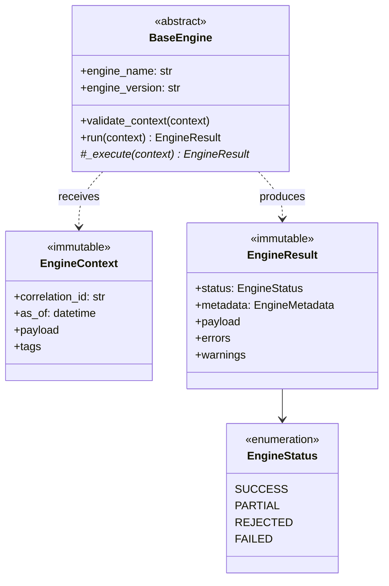

# Base Engine — Software Engineering Specification

| Field | Value |
|---|---|
| **Module** | `core/base_engine.py` |
| **Document version** | 1.0.0 |
| **Status** | Draft — ready for implementation |
| **Owner** | THETA AI TRADER Core Platform |
| **Last updated** | 2026-08-02 |

---

## 1. Purpose

`core/base_engine.py` defines the **foundational contract** for every analytical engine in THETA AI TRADER.

The module establishes a single, production-grade abstraction layer that all intelligence engines (Market Regime, Greeks, Strategy Score, Confidence, Trade Decision, Risk, Position Sizing, and others) must conform to. It standardizes how engines receive input, produce output, validate data, report failures, and integrate into the broader decision pipeline described in the platform architecture.

Without this module, each engine evolves independently — inconsistent interfaces, duplicated validation, incompatible error semantics, and untestable coupling. With it, orchestrators, pipelines, and future analytics layers can treat every engine as a **stateless, deterministic, independently testable unit** that communicates through well-defined immutable types.

### Goals

1. Enforce the engine philosophy defined in project architecture rules: one responsibility, stateless execution, immutable inputs and outputs, no direct engine-to-engine calls.
2. Provide reusable infrastructure for validation, structured errors, logging hooks, and metadata propagation.
3. Enable uniform unit testing, mocking, and pipeline composition across current and future engines.
4. Serve as the migration target for legacy engine classes that currently live at the repository root without a shared base contract.

### Success criteria

- Any new engine can subclass or implement the base contract and be runnable in isolation with a mock context.
- Orchestrators can invoke engines uniformly without engine-specific glue code.
- All engine outputs are traceable, explainable, and safe to pass downstream without defensive copying.

---

## 2. Responsibilities

`core/base_engine.py` **is responsible for**:

| # | Responsibility | Description |
|---|---|---|
| R1 | **Engine contract** | Define the abstract base type (`BaseEngine`) that all engines implement, including the mandatory public execution entry point. |
| R2 | **Immutable input model** | Define `EngineContext` — a frozen, typed container for all inputs an engine receives for a single execution. |
| R3 | **Immutable output model** | Define `EngineResult` — a frozen, typed container for all outputs an engine produces from a single execution. |
| R4 | **Execution status model** | Define a small, explicit status enumeration (e.g., success, partial success, rejected input, internal failure) so orchestrators can branch deterministically. |
| R5 | **Structured error types** | Define a hierarchy of engine-specific exceptions and/or error records attached to `EngineResult`, distinguishing validation failures from computation failures. |
| R6 | **Input validation framework** | Provide reusable validation helpers and/or a validation phase hook that runs before core engine logic. |
| R7 | **Metadata and traceability** | Attach engine identity, version, execution timestamp, and optional correlation identifiers to every result for explainability and audit trails. |
| R8 | **Logging conventions** | Define standard log event names, required fields, and severity guidance for engine lifecycle events (start, validation failure, success, failure). |
| R9 | **Configuration boundary** | Define how engine configuration is accepted at construction time and kept separate from per-run `EngineContext` data. |
| R10 | **Documentation contract** | Require every concrete engine to expose a stable `engine_name` (or equivalent) string identifier used in logs, metrics, and results. |

---

## 3. Non-Responsibilities

`core/base_engine.py` **must not**:

| # | Non-responsibility | Rationale |
|---|---|---|
| NR1 | **Implement trading logic** | Base engine is infrastructure, not a decision engine. No market analysis, signal generation, or strategy selection. |
| NR2 | **Call other engines** | Engines communicate only through orchestrators/pipelines. The base module must not introduce engine-to-engine invocation patterns. |
| NR3 | **Fetch market data or call brokers** | Data acquisition and order execution belong in adapters and execution layers, not the engine foundation. |
| NR4 | **Manage global mutable state** | No singleton registries, shared caches, or cross-run mutable fields on base types. |
| NR5 | **Orchestrate pipelines** | Sequencing engines, fan-out/fan-in, and retry policies belong in a separate orchestration module. |
| NR6 | **Persist results or write to disk/network** | Side-effectful I/O is out of scope. Engines return in-memory immutable results; persistence is an upstream/downstream concern. |
| NR7 | **Load configuration files or environment variables** | Configuration loading is delegated to `config_manager` or injectors. The base engine accepts already-resolved config objects. |
| NR8 | **Define domain-specific payloads** | `EngineContext` and `EngineResult` provide generic extension points (e.g., typed payload slots or metadata maps); domain fields live in engine-specific modules. |
| NR9 | **Implement async/event-driven scheduling** | Initial version is synchronous. Async extensions are future work. |
| NR10 | **Replace existing engine business logic** | Legacy engines are migrated to conform to this contract over time; the base module does not absorb their algorithms. |

---

## 4. Public API

All symbols below are part of the stable public API unless explicitly marked *internal*.

### 4.1 Types and enumerations

| Symbol | Kind | Description |
|---|---|---|
| `EngineStatus` | Enumeration | Outcome of a single engine execution (`SUCCESS`, `REJECTED`, `FAILED`, optionally `PARTIAL`). |
| `EngineContext` | Immutable dataclass | Input to one engine run. Contains correlation metadata and a payload reference. |
| `EngineResult` | Immutable dataclass | Output of one engine run. Contains status, payload, errors, warnings, and metadata. |
| `EngineMetadata` | Immutable dataclass | Engine identity, semantic version, execution timestamp, duration, correlation ID. |
| `EngineErrorRecord` | Immutable dataclass | Structured error: code, message, field (optional), severity, recoverable flag. |
| `EngineWarningRecord` | Immutable dataclass | Non-fatal issue surfaced to downstream consumers. |

### 4.2 Exceptions

| Symbol | Kind | Description |
|---|---|---|
| `EngineError` | Exception (base) | Root of all engine-layer exceptions. |
| `EngineValidationError` | Exception | Raised or recorded when input/context validation fails before computation. |
| `EngineConfigurationError` | Exception | Raised at construction when static engine configuration is invalid. |
| `EngineExecutionError` | Exception | Raised when computation fails after validation passes. |

### 4.3 Abstract base

| Symbol | Kind | Description |
|---|---|---|
| `BaseEngine` | Abstract base class | Contract all engines implement. |

### 4.4 Public methods on `BaseEngine`

| Method | Visibility | Description |
|---|---|---|
| `engine_name` | Property (abstract) | Stable string identifier, e.g. `"market_regime"`. Used in logs and results. |
| `engine_version` | Property | Semantic version string for the concrete engine implementation. Default may be inherited. |
| `validate_context(context) -> None` | Public (overridable) | Validates `EngineContext` before execution. Default implementation validates base fields; subclasses extend. |
| `run(context: EngineContext) -> EngineResult` | Public (final or template) | **Primary entry point.** Orchestrates validation, execution, error capture, metadata attachment, and logging. Subclasses implement `_execute`. |
| `_execute(context: EngineContext) -> EngineResult` | Protected (abstract) | Core engine logic. Must not perform I/O or call other engines. |

### 4.5 Module-level helpers (*internal* unless promoted later)

| Symbol | Description |
|---|---|
| `_validate_required_fields` | Shared field-presence and type checks. |
| `_build_result_metadata` | Constructs `EngineMetadata` from engine instance and timing. |

Internal helpers must be prefixed with `_` and are not part of the semver-stable API.

### 4.6 API stability rules

- Breaking changes to `EngineContext`, `EngineResult`, or `BaseEngine.run` require a major version bump of the platform and a migration note in `CHANGELOG.md`.
- New optional fields on immutable dataclasses must use defaults so existing callers remain valid.
- Concrete engines must not expose `_execute` as public API.

---

## 5. Class Design

### 5.1 Design principles

- **Composition over inheritance** for domain logic; inheritance is reserved for the thin base contract.
- **Immutable data models** (`frozen=True` dataclasses) for context, result, metadata, and error records.
- **Template method pattern** for `run`: fixed lifecycle shell, subclass supplies `_execute`.
- **Explicit over implicit**: status, errors, and warnings are first-class fields — not inferred from exceptions alone.
- **Fail closed on bad input**: invalid context produces `EngineStatus.REJECTED`, not undefined behavior.

### 5.2 `EngineContext`

**Purpose:** Carry everything required for one deterministic engine invocation.

**Required fields (minimum):**

| Field | Type | Notes |
|---|---|---|
| `correlation_id` | `str` | Ties engine output to a pipeline run or request. |
| `as_of` | timezone-aware datetime | Point-in-time for the decision (market timestamp). |
| `payload` | engine-specific immutable type or mapping | Domain inputs. May be a dedicated dataclass per engine in its own module. |

**Optional fields:**

| Field | Type | Notes |
|---|---|---|
| `tags` | frozen mapping | Key-value labels for filtering/logging. |
| `source` | `str` | Caller identity (orchestrator name, test harness, etc.). |

**Invariants:**

- Instances are immutable after construction.
- `correlation_id` and `as_of` must be non-empty / non-null.
- `payload` must not be mutated by the engine during execution.

### 5.3 `EngineResult`

**Purpose:** Carry everything downstream consumers need from one engine invocation.

**Required fields (minimum):**

| Field | Type | Notes |
|---|---|---|
| `status` | `EngineStatus` | Overall outcome. |
| `metadata` | `EngineMetadata` | Identity, timing, correlation. |
| `payload` | engine-specific immutable type or `None` | Present on success/partial; absent on hard rejection. |
| `errors` | tuple of `EngineErrorRecord` | Empty on success. |
| `warnings` | tuple of `EngineWarningRecord` | Non-fatal issues. |

**Invariants:**

- Instances are immutable after construction.
- If `status == REJECTED`, `payload` must be `None` and `errors` must be non-empty.
- If `status == SUCCESS`, `errors` must be empty (warnings may still be present).

### 5.4 `BaseEngine`

**Purpose:** Enforce lifecycle, validation, logging, and uniform result shape.

**Construction:**

- Accepts optional static configuration (immutable or validated at init).
- Raises `EngineConfigurationError` on invalid config.
- Does not start background threads or register global handlers.

**Subclass contract:**

- Implement `engine_name` property.
- Implement `_execute(context) -> EngineResult`.
- May override `validate_context` to add domain rules after calling `super()`.

**State model:**

- Configuration fields set at `__init__` are allowed (e.g., numerical tolerances, feature flags).
- No accumulation of run history, caches keyed by market state, or mutable fields updated inside `run`.

### 5.5 Relationship diagram



### 5.6 Concrete engine example (conceptual)

A future `MarketRegimeEngine` (in its own module) would:

- Subclass `BaseEngine`.
- Define `MarketRegimeContextPayload` and `MarketRegimeResultPayload` in the regime module (not in `base_engine.py`).
- Implement `_execute` to map validated payload → regime label + trade permission.
- Return `EngineResult` with `status=SUCCESS` and structured payload.

---

## 6. Lifecycle

### 6.1 Engine instance lifecycle

```text
[Construction]
    → validate static configuration
    → engine instance ready (reusable, stateless across runs)

[Per-run lifecycle — invoked via run()]
    → log run start (debug/info)
    → validate_context(context)
        → on failure: return REJECTED result (or raise per policy — see §8)
    → _execute(context)
        → compute domain result
    → attach metadata (duration, engine_name, version)
    → log run outcome
    → return EngineResult
```

### 6.2 Pipeline placement

In the THETA AI TRADER pipeline, individual engines are invoked by an orchestrator between adapter layers:

```text
Market Data Adapter
    → builds EngineContext payloads
    → Orchestrator calls Engine.run(context) for each step
    → downstream step receives prior EngineResult.payload as part of its context assembly
    → no engine imports or calls another engine directly
```

### 6.3 Idempotency and repeatability

Given the same `EngineContext` and the same engine configuration, `run` must produce logically equivalent `EngineResult` (deterministic). Non-deterministic sources (wall clock aside from `as_of`, randomness, external I/O) are forbidden inside `_execute`.

### 6.4 Reuse

A single engine instance may serve consecutive runs. Callers should not assume exclusive access unless documented otherwise; see §11 Thread Safety.

---

## 7. Validation

### 7.1 Validation layers

| Layer | When | Owner | Failure mode |
|---|---|---|---|
| **Configuration validation** | `__init__` | `BaseEngine` / subclass | `EngineConfigurationError` at construction |
| **Context validation** | Start of `run`, before `_execute` | `validate_context` | `EngineStatus.REJECTED` with structured errors |
| **Payload validation** | Inside `validate_context` or `_execute` | Concrete engine | Recorded in `errors` or `warnings` on result |
| **Output sanity checks** | End of `_execute` | Concrete engine | `FAILED` or `PARTIAL` with errors/warnings |

### 7.2 Base context validation rules

The default `validate_context` implementation must enforce:

1. `context` is an instance of `EngineContext`.
2. `correlation_id` is a non-empty string after stripping whitespace.
3. `as_of` is timezone-aware (not naive).
4. `payload` is not `None` unless the concrete engine explicitly documents optional payload (subclass may relax after super).

### 7.3 Validation error shape

Validation failures must populate `EngineErrorRecord` with:

- Stable machine-readable `code` (e.g., `CONTEXT_MISSING_CORRELATION_ID`).
- Human-readable `message`.
- Optional `field` path (e.g., `payload.spot_price`).
- `severity` and `recoverable=False` for input rejection.

### 7.4 Numeric and domain validation

Domain validation (finite floats, positive prices, valid enums) remains the responsibility of concrete engines. The base module may offer optional shared utilities (e.g., `is_finite_positive`) in a separate `core/validation.py` in the future — not required for v1 of `base_engine.py`.

---

## 8. Error Handling

### 8.1 Policy: exceptions vs. result records

| Scenario | Behavior |
|---|---|
| Invalid static config at init | Raise `EngineConfigurationError` — fail fast before any run. |
| Invalid context at run time | Return `EngineResult` with `status=REJECTED`; do not call `_execute`. |
| Expected domain rejection (e.g., insufficient data) | Return structured result with appropriate status and errors; avoid bare exceptions crossing orchestrator boundary. |
| Unexpected exception inside `_execute` | Catch at `run` boundary, log full exception with stack trace, return `FAILED` result with generic error record; optionally re-raise in debug/test mode via flag. |
| Partial computation | `PARTIAL` status with warnings and best-effort payload if platform policy allows downstream use. |

### 8.2 Error code registry

Engine error codes should be namespaced:

```text
ENGINE.<engine_name>.<CATEGORY>.<DETAIL>
```

Example: `ENGINE.market_regime.VALIDATION.MISSING_SPOT_PRICE`

The base module defines codes for infrastructure failures:

- `ENGINE.BASE.CONTEXT.INVALID`
- `ENGINE.BASE.CONTEXT.MISSING_FIELD`
- `ENGINE.BASE.EXECUTION.UNHANDLED`

### 8.3 No silent failures

Engines must never return `SUCCESS` with an empty payload when computation did not occur. Downstream orchestrators rely on status + errors for capital-protection decisions (prefer no trade over ambiguous trade).

### 8.4 Exception safety

`run` must not leak partially constructed mutable state. Immutable result objects are allocated before return in all paths.

---

## 9. Logging

### 9.1 Logger acquisition

- Each engine uses a module-level logger named after the concrete engine module (standard library `logging`).
- Log records must include `engine_name`, `correlation_id`, and `status` where available via the `extra` dict or structured logging adapter.

### 9.2 Required log events

| Event | Level | When |
|---|---|---|
| `engine.run.start` | DEBUG | Beginning of `run` |
| `engine.run.validation_failed` | INFO | Context validation failed (expected path) |
| `engine.run.success` | INFO | Successful completion |
| `engine.run.failed` | ERROR | Unhandled exception or `FAILED` status |
| `engine.init.invalid_config` | ERROR | Configuration rejected at construction |

### 9.3 Log content rules

- **Do log:** correlation ID, engine name, status, duration_ms, error codes, counts of warnings.
- **Do not log:** secrets, API keys, full broker credentials, entire raw option chains unless explicitly at TRACE and outside production defaults.
- **PII/market data:** follow future data-classification policy; v1 avoids logging full payloads at INFO.

### 9.4 Observability hook (future)

The base lifecycle should reserve extension points (e.g., optional `on_run_complete` callback or metrics recorder injection) without requiring them in v1.

---

## 10. Performance Requirements

| Requirement | Target | Notes |
|---|---|---|
| Base overhead per `run` | < 1 ms median on reference hardware | Excludes subclass computation |
| Allocation discipline | Prefer tuples over lists in results; no deep copies of large payloads unless required |
| Memory | No unbounded growth across runs on the engine instance |
| I/O | Zero network/disk I/O inside `BaseEngine.run` / `_execute` |
| Hot path | Validation should be O(n) over context fields, not O(market universe) |

Performance testing belongs in `tests/test_base_engine.py` for the shell overhead and in each concrete engine's test suite for domain cost.

---

## 11. Thread Safety

| Aspect | Requirement |
|---|---|
| Engine instance fields after `__init__` | Must not be mutated during `run` |
| Concurrent `run` on same instance | Must be safe if configuration is immutable |
| Shared mutable payload in context | Forbidden — callers must pass immutable snapshots |
| Logging | Standard library logging is thread-safe; engines must not share custom mutable log buffers |
| Global state | None introduced by this module |

If a concrete engine requires non-thread-safe resources (e.g., a non-thread-safe third-party library), documentation must state **single-threaded use only**; the base contract does not add locking automatically.

---

## 12. Dependencies

### 12.1 Allowed dependencies (v1)

| Dependency | Usage |
|---|---|
| Python standard library: `abc`, `dataclasses`, `datetime`, `enum`, `logging`, `typing` | Core types and base class |
| `typing_extensions` | Only if required for older Python versions supported by the project |

### 12.2 Forbidden dependencies

- Broker SDKs (`kiteconnect`, etc.)
- Network libraries (`requests`, etc.)
- Data frameworks (`pandas`, `numpy`) inside `base_engine.py` itself
- Configuration loaders (`config_manager`, `python-dotenv`)
- Other engine modules

### 12.3 Dependency direction

```text
concrete engines  →  core/base_engine.py  →  stdlib only
orchestrators     →  core/base_engine.py + concrete engines
```

No reverse imports from `core/base_engine.py` into domain engines.

---

## 13. Unit Testing Strategy

Tests live in `tests/test_base_engine.py`.

### 13.1 Test doubles

Implement minimal concrete engines inside the test module:

- `EchoEngine` — returns payload unchanged (happy path).
- `RejectingEngine` — fails validation deliberately.
- `ExplodingEngine` — raises unexpected exception inside `_execute`.

### 13.2 Required test cases

| Category | Cases |
|---|---|
| **Construction** | Valid config succeeds; invalid config raises `EngineConfigurationError`. |
| **Context validation** | Missing/empty `correlation_id`, naive `as_of`, `None` payload → `REJECTED`. |
| **Happy path** | Valid context → `SUCCESS`, metadata populated, duration ≥ 0. |
| **Determinism** | Two runs with identical context → equivalent results. |
| **Exception handling** | Unexpected error in `_execute` → `FAILED`, error record present, no partial payload unless policy says otherwise. |
| **Immutability** | Attempts to mutate frozen dataclasses fail as expected. |
| **Logging** | Validation failure and success paths emit expected log records (use `caplog` or equivalent). |
| **Metadata** | `engine_name`, `correlation_id`, and timestamps appear on result. |

### 13.3 Testing conventions

- No network, disk, or broker fixtures.
- Fixed `as_of` timestamps for reproducibility.
- Google-style test method names: `test_run_rejects_missing_correlation_id`.
- Target ≥ 95% line coverage on `core/base_engine.py`.

### 13.4 Integration tests

Integration of concrete domain engines with the base contract is tested in each engine's own test file, not in `test_base_engine.py`.

---

## 14. Future Extension Points

Designed for extension without breaking the v1 contract:

| Extension | Description |
|---|---|
| **Async execution** | Optional `async def run_async` or async `_execute` in a subclass protocol v2. |
| **Metrics/tracing** | Injectable recorder for latency histograms, OpenTelemetry spans. |
| **Plugin registry** | External orchestrator discovers engines by entry point — not in base module v1. |
| **Generic payload typing** | `EngineContext[TPayload]` / `EngineResult[TPayload]` generic variants for stricter typing. |
| **Result schema versioning** | `payload_schema_version` field on `EngineResult`. |
| **Shared validation library** | Extract common numeric/enum validators to `core/validation.py`. |
| **Pipeline context builder** | Helper to assemble contexts from prior results — lives in orchestration layer. |
| **Legacy adapter mixin** | Optional bridge for root-level legacy engines during migration. |

Extensions must not violate statelessness or immutability principles.

---

## 15. Risks

| Risk | Impact | Mitigation |
|---|---|---|
| **Over-abstraction** | Slower delivery, confusing indirection for simple engines | Keep base thin; domain stays in subclasses; only one abstract method required. |
| **Legacy migration cost** | Large existing engines (e.g., regime, greeks) differ from new contract | Phased migration; optional adapter wrappers; do not block new engines on full migration. |
| **Payload typing too loose** | Weak compile-time safety if payload is untyped dict | Document per-engine payload dataclasses; consider generics in v2. |
| **Exception vs. result inconsistency** | Orchestrators handle failures differently | `run` is the single boundary; document policy in §8; enforce via tests. |
| **Performance overhead** | Metadata/logging adds latency in tight loops | Keep logging at DEBUG for hot paths; benchmark base overhead. |
| **Immutable payload size** | Large snapshots copied if callers are careless | Document shallow-immutable expectations; orchestrator passes references to frozen structures. |
| **Partial success ambiguity** | Downstream may trade on incomplete analysis | Strict rules for `PARTIAL`; default orchestrator treats as no-trade unless explicitly overridden. |

---

## 16. Example Usage

Illustrative flow only — not implementation code.

### 16.1 Orchestrator invokes an engine

1. Market data adapter produces a snapshot for NIFTY at 2026-08-02 10:15 IST.
2. Orchestrator creates an `EngineContext` with:
   - `correlation_id = "run-20260802-101500-001"`
   - `as_of = 2026-08-02T10:15:00+05:30`
   - `payload = MarketRegimeContextPayload(...)` (defined in regime module)
3. Orchestrator calls `market_regime_engine.run(context)`.
4. Engine returns `EngineResult`:
   - `status = SUCCESS`
   - `payload.regime = RANGE_BOUND`
   - `payload.trade_permission = CAUTION`
   - `metadata.duration_ms = 4.2`
5. Orchestrator inspects `status` and passes `payload` forward when building the next engine's context.

### 16.2 Validation failure (no trade path)

1. Context arrives with missing spot price in payload.
2. `validate_context` records `ENGINE.market_regime.VALIDATION.MISSING_SPOT_PRICE`.
3. `run` returns immediately with `status = REJECTED`, `payload = None`.
4. Orchestrator skips downstream trade-enabling engines and records explainability trail for dashboard.

### 16.3 Construction failure

1. Developer instantiates engine with negative tolerance parameter.
2. `EngineConfigurationError` raised at import/instantiation time in tests or startup.
3. Engine never enters production pipeline.

---

## 17. Definition of Done

The `core/base_engine.py` module and its specification are **done** when all of the following are true:

### 17.1 Implementation

- [ ] All public API symbols in §4 are implemented in `core/base_engine.py`.
- [ ] All dataclasses are immutable (`frozen=True`).
- [ ] `BaseEngine.run` implements the lifecycle in §6 with validation, logging, metadata, and exception boundary.
- [ ] No forbidden dependencies (§12) are imported.
- [ ] Google-style docstrings on all public classes, methods, and module-level exports.
- [ ] Type hints on all public surfaces; `mypy`-clean or project-standard equivalent.

### 17.2 Testing

- [ ] `tests/test_base_engine.py` covers all cases in §13.2.
- [ ] Line coverage on `core/base_engine.py` ≥ 95%.
- [ ] Tests run deterministically in CI with no external services.

### 17.3 Documentation

- [ ] This specification matches the implemented behavior.
- [ ] `CHANGELOG.md` updated under an appropriate version with "Add base engine foundation module".
- [ ] At least one concrete engine (new or migrated) demonstrates real usage — may follow in a separate change if agreed.

### 17.4 Review checklist

- [ ] Correctness — lifecycle and invariants enforced by tests.
- [ ] Readability — new contributor can implement an engine from this spec alone.
- [ ] Maintainability — no trading/domain logic in base module.
- [ ] Architecture alignment — stateless, immutable context/result, no engine-to-engine calls.
- [ ] Security — no secrets in logs; no unsafe dynamic execution.

### 17.5 Sign-off

- [ ] Peer review approved.
- [ ] Specification version bumped if API changed post-review.

---

## Appendix A — Glossary

| Term | Definition |
|---|---|
| **Engine** | Stateless analytical component with a single responsibility in the trading pipeline. |
| **Context** | Immutable input to one engine run. |
| **Result** | Immutable output from one engine run, including status and diagnostics. |
| **Orchestrator** | Component that sequences engines and assembles contexts; not part of this module. |
| **Payload** | Domain-specific data carried inside context/result. |

## Appendix B — Related documents

- `.cursor/rules/theta-ai-trader-engineering-standards.mdc`
- `.cursor/rules/theta-ai-trader-trading-architecture.mdc`
- `.cursor/rules/theta-ai-trader-development-workflow.mdc`
- `docs/foundation/THETA_AI_TRADER_ARCHITECTURE.md`
- `docs/foundation/ENGINEERING_PRINCIPLES.md`

## Appendix C — Revision history

| Version | Date | Author | Changes |
|---|---|---|---|
| 1.0.0 | 2026-08-02 | THETA AI TRADER | Initial specification |
