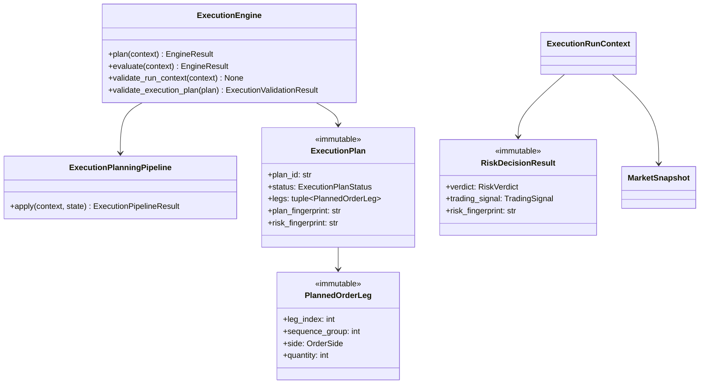

# Execution Engine — Software Engineering Specification

| Field | Value |
|---|---|
| **Module** | `execution/execution_engine.py` |
| **Document version** | 1.0.0 |
| **Status** | Draft — ready for implementation |
| **Owner** | THETA AI TRADER Core Platform |
| **Last updated** | 2026-08-03 |

---

## 1. Purpose

`execution/execution_engine.py` defines the **institutional execution planning engine** for THETA AI TRADER v1.0.

The engine consumes an immutable `RiskDecisionResult` produced by the Risk Engine together with orchestrator-supplied `MarketSnapshot`, optional `ContractSelectionResult` tags, and `PositionSizingHint` quantities, and produces a **single authoritative execution plan** expressed as immutable `ExecutionPlan` with status `READY`, `SKIPPED`, `NO_PLAN`, or `REJECTED`. It converts approved `TradingSignal` intent into broker-neutral planned order legs with sequencing, retry policies, timeout policies, and slippage limits — but **never** places orders, communicates with brokers, manages open positions, or applies APME logic.

The engine answers: *"Given this risk-approved trade signal, market snapshot, contract selection output, and sizing hints, what is the deterministic, broker-neutral execution plan the orchestrator should submit to the Broker Layer?"*

It is **not** a risk manager. It is **not** a broker client. It is **not** a position manager. It is the **execution intelligence gate** between risk authorization and broker order submission.

### Pipeline placement

```text
[Market Data Engine]
    → MarketSnapshot (immutable)
              ↓
[Strategy Registry]
    → RegistrySnapshot
              ↓
[strategy/strategy_evaluation_engine.py]
    evaluate enabled plugins
    rank StrategyEvaluationReport instances
              ↓
    StrategyEvaluationBundle (immutable)
              ↓
[decision/trade_decision_engine.py]
    filter reports by policy + preferences
    validate trading window + capital hints
    select strategy (autonomous or manual)
              ↓
    TradeDecisionResult (immutable)
    primary payload: selected TradingSignal | abstain signal
              ↓
[Contract Selection Engine] (optional upstream)
    resolve strikes / instrument keys from StructureHint
              ↓
    ContractSelectionResult (tags / orchestrator payload)
              ↓
[Position Sizing Engine] (optional upstream)
    compute PositionSizingHint quantities
              ↓
[risk/risk_engine.py]
    validate capital, margin (heuristic), exposure
    enforce portfolio, daily loss, drawdown limits
    validate position sizing hints
              ↓
    RiskDecisionResult (immutable)
    verdict: APPROVED | REJECTED | SKIPPED
              ↓
[execution/execution_engine.py]          ← THIS MODULE
    validate risk verdict + signal integrity
    apply execution policies
    build multi-leg PlannedOrderLeg sequence
    attach retry, timeout, slippage policies
    validate plan against market snapshot
              ↓
    ExecutionPlan (immutable)
    status: READY | SKIPPED | NO_PLAN | REJECTED
              ↓
[Orchestrator / Broker Layer]
    map ExecutionPlan → PlaceOrderRequest[]
    invoke BaseBrokerClient.place_order (outside this module)
              ↓
[Broker Execution]
              ↓
[Adaptive Position Management Engine (APME)]
    (downstream — not invoked by Execution Engine)
```

### Goals

1. Provide a **dedicated execution planning layer** between risk authorization and broker submission — separate from risk enforcement, separate from broker APIs, separate from position management.
2. Consume **immutable upstream artifacts** (`RiskDecisionResult`, `TradingSignal`, `MarketSnapshot`) without re-running risk or strategy plugins.
3. Apply **multi-stage deterministic execution planning** with ordered pipeline stages and stable rule identifiers.
4. Convert approved signals into **broker-neutral planned legs** compatible with `PlaceOrderRequest` mapping — without importing broker types.
5. Enforce **execution policies** — order type, product type, sequencing mode, retry, timeout, slippage — per configuration and execution mode.
6. Support **multi-leg strategies** (iron condor, strangle, spreads, butterflies) with simultaneous or sequential leg groups.
7. Generate **deterministic idempotency keys** from `correlation_id + plan_id + leg_index` for broker deduplication downstream.
8. Compute **deterministic plan fingerprints** for replay verification and audit trails.
9. Handle **SKIPPED/REJECTED risk verdicts** cleanly — emit `ExecutionPlanStatus.SKIPPED` or `NO_PLAN` without unhandled errors.
10. Integrate cleanly with `BaseEngine`, `EngineContext`, `EngineResult`, `RiskDecisionResult`, and `TradingSignal` without broker dependencies.
11. Remain **thread-safe** for concurrent planning runs on independent contexts.
12. **Fail closed** on ambiguous strike/instrument resolution — prefer `REJECTED` plan over incomplete legs when policy requires explicit contract selection.
13. Provide **full explainability** via `ExecutionReason`, `ExecutionFactor`, and structured rejection templates.
14. Support **LIVE vs ANALYSIS vs BACKTEST** mode-aware planning strictness.

### Success criteria

- Orchestrator invokes `ExecutionEngine.plan(context)` with `ExecutionRunContext` and receives immutable `ExecutionPlan`.
- `READY` emitted **only** when `RiskVerdict.APPROVED`, signal valid, legs fully resolved, and all planning stages pass.
- `SKIPPED` or `NO_PLAN` emitted for `RiskVerdict.SKIPPED` or `RiskVerdict.REJECTED` — no unhandled exceptions.
- Identical inputs (risk fingerprint, snapshot fingerprint, config, reference time, contract tags) produce semantically equal plans and identical `plan_fingerprint`.
- Broker Layer maps `ExecutionPlan.legs` to `PlaceOrderRequest` without Execution Engine importing `BaseBrokerClient`.
- No module under `execution/execution_engine.py` imports broker clients, APME modules, or legacy execution helpers.
- Strike selection **not performed** when contract selection output absent and policy forbids structure-hint heuristics.
- Idempotency keys stable across replays for identical planning inputs.

### Relationship to other modules

| Module | Relationship |
|---|---|
| `risk/risk_engine.py` | **Primary upstream input.** Engine consumes `RiskDecisionResult`. |
| `decision/trade_decision_engine.py` | **Indirect upstream.** Reads `decision_fingerprint` from risk result. |
| `strategy/signals.py` | **Signal contract.** Validates and reads `TradingSignal`, `StructureHint`, `EntryLogic`. |
| `market_data/market_snapshot.py` | **Market reference.** Price bands, option chain metadata for limit hints. |
| `core/base_engine.py` | **Foundation.** `ExecutionEngine` extends `BaseEngine`. |
| `core/engine_context.py` | **Input wrapper.** Orchestrator passes `ExecutionRunContext` via `EngineContext`. |
| `core/engine_result.py` | **Output wrapper.** Plan returned inside `EngineResult.payload`. |
| `docs/specifications/risk_engine.md` | **Upstream contract.** §24 Execution Engine Interface; Appendix B handoff. |
| `docs/specifications/trading_signal.md` | **Signal contract.** `StructureHint`, `EntryLogic`, `TradingSignal`. |
| `docs/specifications/broker_client.md` | **Downstream contract.** `PlaceOrderRequest` mapping — logical only, no import. |
| Contract Selection Engine (future) | **Optional upstream.** Supplies resolved strikes via tags / `ContractSelectionResult`. |
| Position Sizing Engine (future) | **Sibling upstream.** Supplies `PositionSizingHint` quantities validated by risk. |
| Broker Layer | **Primary downstream consumer.** Maps plan to orders; Execution Engine never calls it. |
| APME (future) | **Downstream.** Position management after fills — out of scope. |
| Legacy root execution helpers | **Not a dependency.** Institutional module is independent rewrite. |

### Distinction from Risk Engine

| Concern | Risk Engine | Execution Engine |
|---|---|---|
| Primary output | **Risk verdict** APPROVED/REJECTED/SKIPPED | **Execution plan** READY/SKIPPED/NO_PLAN/REJECTED |
| Capital enforcement | **Authoritative** | Out of scope — consumes approved budget reference |
| Order construction | Out of scope | **In scope** — planned legs, sequencing, policies |
| Broker communication | Out of scope | Out of scope — plan only |
| Strike selection | Out of scope | Consumes upstream selection; heuristics only when policy allows |
| Position sizing | Validates hints | Consumes hint quantities for leg sizing |
| Margin | Heuristic validation | May attach margin hints to plan metadata only |
| Abstain handling | SKIPPED verdict | SKIPPED/NO_PLAN plan without error |

Both modules coexist in sequence: Risk Engine authorizes capital deployment; Execution Engine converts authorization into executable plan artifacts.

### Distinction from Broker Layer

| Concern | Execution Engine | Broker Layer |
|---|---|---|
| Primary output | `ExecutionPlan` (logical) | `PlaceOrderResult` (broker-assigned IDs) |
| Broker SDK | **Never imported** | Implements vendor adapters |
| Order submission | **Never** | `place_order`, `modify_order`, `cancel_order` |
| Retry execution | Defines retry **policy** on plan | Performs actual retries |
| Slippage enforcement | Defines limits on plan | May reject at broker if exceeded |
| Idempotency | Generates keys on plan | Dedupes at broker when supported |

---

## 2. Responsibilities

`execution/execution_engine.py` **is responsible for**:

| # | Responsibility | Description |
|---|---|---|
| R1 | **Risk decision consumption** | Accept immutable `RiskDecisionResult` as primary gate input. |
| R2 | **Risk verdict gating** | Branch on APPROVED vs REJECTED vs SKIPPED before full planning. |
| R3 | **TradingSignal consumption** | Read approved signal from risk result; validate integrity. |
| R4 | **MarketSnapshot consumption** | Accept immutable snapshot for price bands and chain metadata. |
| R5 | **Contract selection consumption** | Read optional `ContractSelectionResult` from context tags. |
| R6 | **Position sizing hint consumption** | Apply orchestrator quantities to planned legs. |
| R7 | **Execution planning** | Build complete multi-leg `ExecutionPlan` for approved trades. |
| R8 | **Execution policy application** | Apply `ExecutionPolicy`, order type, product type rules. |
| R9 | **Multi-leg sequencing** | Assign `sequence_group` and ordering for simultaneous vs sequential legs. |
| R10 | **Retry policy attachment** | Attach per-leg and per-plan `RetryPolicy` metadata. |
| R11 | **Timeout policy attachment** | Attach stage timeouts and plan validity window. |
| R12 | **Slippage limit attachment** | Attach max slippage bps, price bands, limit offset rules. |
| R13 | **Pre-plan validation** | Validate `ExecutionRunContext` before pipeline stages. |
| R14 | **Post-plan validation** | Validate sealed `ExecutionPlan` before return. |
| R15 | **Multi-stage planning pipeline** | Apply ordered planning stages with audit trail. |
| R16 | **Deterministic planning** | Pure planning algorithm; identical inputs → identical plan. |
| R17 | **Structure hint interpretation** | Map `StructureHint` to leg layout when contracts not pre-selected. |
| R18 | **Entry logic interpretation** | Translate `EntryLogic` into order type and timing hints. |
| R19 | **Limit price hint computation** | Derive limit/trigger hints from snapshot mid/bid/ask — no broker quotes. |
| R20 | **Idempotency key generation** | Deterministic keys from correlation_id + plan_id + leg_index. |
| R21 | **Plan fingerprint** | Compute deterministic `plan_fingerprint` for replay verification. |
| R22 | **ExecutionPlan assembly** | Immutable result wrapping status, legs, policies, metadata. |
| R23 | **ExecutionPlanSummary** | Human-readable summary for logs and dashboard. |
| R24 | **Skip path handling** | SKIPPED/REJECTED risk → SKIPPED/NO_PLAN without exception. |
| R25 | **Rejection path handling** | Planning failures → REJECTED plan with primary rejection code. |
| R26 | **EngineResult integration** | Return `EngineResult` with structured status, errors, warnings, payload. |
| R27 | **Error taxonomy** | Stable codes under `EXECUTION.*`. |
| R28 | **Serialization** | JSON round-trip for `ExecutionPlan` schema version 1.0.0. |
| R29 | **Logging conventions** | Standard log events for plan start, stage results, ready/reject/skip. |
| R30 | **Thread-safe execution** | Safe concurrent `plan()` on independent contexts. |
| R31 | **Stage audit trail** | Record per-stage pass/fail counts and rejection reasons. |
| R32 | **Signal freshness re-check** | Reject expired signals at reference time on APPROVED path. |
| R33 | **Documentation contract** | Google-style docstrings on all public types and methods. |
| R34 | **Downstream contract documentation** | Document logical Broker Layer mapping without importing broker types. |
| R35 | **Mode-aware policy** | Different strictness for LIVE vs ANALYSIS vs BACKTEST. |
| R36 | **Approved risk budget reference** | Propagate `approved_risk_budget` into plan metadata for audit. |
| R37 | **Correlation integrity** | Enforce correlation_id alignment across risk, snapshot, context. |
| R38 | **Leg side resolution** | Map strategy family + structure to BUY/SELL per leg. |
| R39 | **Product type resolution** | Map execution mode and strategy to NRML/MIS/CNC per policy. |
| R40 | **Plan validity window** | Compute `valid_until` from signal validity and timeout policy. |

---

## 3. Non-Responsibilities

`execution/execution_engine.py` **must not**:

| # | Non-responsibility | Rationale |
|---|---|---|
| NR1 | **Place, modify, or cancel orders** | Broker Layer responsibility. |
| NR2 | **Import `BaseBrokerClient` or broker SDKs** | No Zerodha, Kite, or vendor-specific types. |
| NR3 | **Call broker margin APIs** | Orchestrator may preview margin; not execution planning scope. |
| NR4 | **Manage open positions or APME logic** | Adaptive Position Management Engine is separate. |
| NR5 | **Re-run Risk Engine validation** | Consumes sealed `RiskDecisionResult`; may re-check signal freshness only. |
| NR6 | **Re-run Trade Decision Engine** | Decision fingerprint is audit reference only. |
| NR7 | **Run strategy plugins or invoke `BaseStrategy.run()`** | Strategy Evaluation Engine responsibility. |
| NR8 | **Mutate `RiskDecisionResult`, `TradingSignal`, or `MarketSnapshot`** | All inputs read-only. |
| NR9 | **Override Risk Engine REJECTED verdict** | Cannot produce READY plan when risk rejected. |
| NR10 | **Compute position sizes from scratch** | Consumes `PositionSizingHint`; no lot computation in v1. |
| NR11 | **Perform authoritative strike selection when contracts missing** | Fail or use structure heuristics only when policy explicitly allows. |
| NR12 | **Persist plans to disk or database** | External persistence concern. |
| NR13 | **Load environment variables or config files** | Accept injected `ExecutionEngineConfig` at construction. |
| NR14 | **Call other analytical engines directly** | Orchestrator assembles inputs; no peer engine imports. |
| NR15 | **Import APME modules** | Position management is downstream of fills. |
| NR16 | **Import Risk Engine implementation for side effects** | May import result **types** from `risk/risk_engine.py`. |
| NR17 | **Subscribe to market data feeds** | Snapshot reference only. |
| NR18 | **Implement UI or dashboard rendering** | Consumers read `EngineResult` or subscribe to events. |
| NR19 | **Force READY when planning incomplete** | Fail closed — prefer REJECTED over partial plans in LIVE. |
| NR20 | **Execute retry loops** | Defines retry policy; orchestrator/broker executor performs retries. |
| NR21 | **Poll order status or handle fills** | Trade monitoring is orchestrator/broker concern. |
| NR22 | **Modify registry or register strategies** | Registry module responsibility. |
| NR23 | **Perform Monte Carlo or slippage simulation** | Out of scope for v1 deterministic planning. |
| NR24 | **Communicate with ConfigManager directly** | Config injected at construction. |
| NR25 | **Aggregate conflicting signals** | Single risk-approved signal per plan run. |
| NR26 | **Validate portfolio exposure limits** | Risk Engine already enforced; execution trusts APPROVED gate. |
| NR27 | **Compute exact broker P&L or settlement** | Requires broker APIs; out of scope. |
| NR28 | **Select among multiple approved signals** | One `RiskDecisionResult` per plan invocation. |
| NR29 | **Implement contract selection algorithms** | Contract Selection Engine upstream responsibility. |
| NR30 | **Store secrets or API keys** | Orchestrator/broker layer concern. |

---

## 4. Architecture

### 4.1 Layered design

```text
┌─────────────────────────────────────────────────────────────────────────┐
│                   execution/execution_engine.py                            │
│  (execution planning gate — no broker, no APME, no position mgmt)     │
│                                                                          │
│  ┌────────────────────┐  ┌────────────────────┐  ┌──────────────────┐  │
│  │ ExecutionEngine    │  │ ExecutionPlanning  │  │ ExecutionPlan    │  │
│  │ (extends BaseEngine│→ │ Pipeline           │→ │ Builder          │  │
│  │                    │  │ (ordered stages)   │  │ (legs + policies)│  │
│  └─────────┬──────────┘  └─────────┬──────────┘  └────────┬─────────┘  │
│            │                       │                        │            │
│  ┌─────────▼───────────────────────▼────────────────────────▼─────────┐  │
│  │ Validators · RiskVerdictGate · SignalValidator · ContractResolver   │  │
│  │ LegBuilder · SequencingEngine · PolicyApplier · SlippageCalculator  │  │
│  │ RetryPolicyAttacher · TimeoutPolicyAttacher · IdempotencyKeyGen     │  │
│  │ ExplanationBuilder · ResultSealer · PlanFingerprint                 │  │
│  └────────────────────────────────────────────────────────────────────┘  │
└──────────────────────────────┬──────────────────────────────────────────┘
                               │
    RiskDecisionResult + MarketSnapshot + PositionSizingHint + ContractSelectionResult
                               │
                               ▼
              ExecutionPlan (immutable, READY | SKIPPED | NO_PLAN | REJECTED)
                               │
                               ▼
                    Orchestrator → Broker Layer (PlaceOrderRequest mapping)
```

### 4.2 Design principles

- **Single responsibility** — convert risk-approved signal into broker-neutral execution plan; nothing else.
- **Immutable I/O** — all inputs and outputs are frozen dataclasses.
- **Deterministic planning** — identical inputs produce identical plan content and fingerprint.
- **Fail closed in LIVE** — prefer REJECTED plan over READY with unresolved instruments.
- **Broker-neutral outputs** — planned legs map logically to `PlaceOrderRequest` without broker imports.
- **Policy-driven behavior** — order type, product, sequencing, retry, timeout, slippage from config.
- **Orchestrator-supplied contracts** — prefer explicit contract selection over heuristic strike picking.
- **Explainability first** — every plan outcome (including SKIPPED) has reasons and factors.
- **Thread-safe service** — engine instance safe for concurrent planning on independent contexts.
- **No hidden globals** — config and policies injected at construction.
- **Audit-grade fingerprints** — plan fingerprint covers risk fingerprint, signal fingerprint, legs, policies.
- **Idempotency by design** — deterministic idempotency keys for downstream broker deduplication.

### 4.3 Component responsibilities

| Component | Role |
|---|---|
| `ExecutionEngine` | Public `BaseEngine` implementation; orchestrates full planning run. |
| `ExecutionEngineConfig` | Frozen policy: execution policies, slippage, retry, timeout, mode behavior. |
| `ExecutionRunContext` | Immutable per-run inputs: risk result, snapshot, sizing hint, contract selection. |
| `ExecutionPlanningPipeline` | Ordered multi-stage planner applying pass/fail rules. |
| `RiskVerdictGate` | Short-circuit SKIPPED/NO_PLAN for non-APPROVED risk verdicts. |
| `SignalIntegrityValidator` | Validates signal schema, freshness, action consistency. |
| `ContractResolver` | Resolves instrument keys from contract selection tags or structure hints. |
| `LegBuilder` | Constructs `PlannedOrderLeg` instances with side, quantity, prices. |
| `SequencingEngine` | Assigns `sequence_group` and leg ordering for multi-leg strategies. |
| `ExecutionPolicyApplier` | Applies order type, product type, variety rules per leg. |
| `SlippageCalculator` | Computes limit offsets and max slippage bps per leg. |
| `RetryPolicyAttacher` | Attaches retry metadata per leg and plan-level defaults. |
| `TimeoutPolicyAttacher` | Attaches stage timeouts and plan validity window. |
| `IdempotencyKeyGenerator` | Deterministic key generation from correlation + plan + leg index. |
| `ExecutionExplanationBuilder` | Assembles reasons, factors, stage audit trail. |
| `ExecutionPlan` | Immutable planning outcome with status, legs, policies, metadata. |
| `ExecutionValidator` | Validates run inputs and sealed plans. |

### 4.4 Dependency direction

```text
orchestrator                         →  execution/execution_engine.py
Broker Layer (orchestrator)          →  execution/execution_engine.py (reads plan types)
execution/execution_engine.py        →  risk/risk_engine.py (RiskDecisionResult, RiskVerdict)
execution/execution_engine.py        →  strategy/signals.py (TradingSignal, StructureHint)
execution/execution_engine.py        →  market_data/market_snapshot.py (MarketSnapshot types)
execution/execution_engine.py        →  core/base_engine.py
execution/execution_engine.py        →  stdlib
```

**Forbidden imports:** broker clients, `base_broker.py`, APME modules, legacy execution helpers, `BaseStrategy` plugins, live ConfigManager, Contract Selection Engine implementation (tags only).

### 4.5 Relationship diagram



---

## 5. Data Model

All public outward-facing types are **immutable dataclasses** (`frozen=True`) unless noted.

### 5.1 Type hierarchy

```text
ExecutionEngine (mutable service, extends BaseEngine)
├── config: ExecutionEngineConfig
├── pipeline: ExecutionPlanningPipeline (stateless)
└── methods: plan(), evaluate(), validate_*

ExecutionRunContext (immutable)
├── risk_decision: RiskDecisionResult
├── market_snapshot: MarketSnapshot
├── position_sizing_hint: PositionSizingHint | None
├── contract_selection: ContractSelectionResult | None
└── tags: Mapping[str, str]

ExecutionPlan (immutable)
├── legs: tuple[PlannedOrderLeg, ...]
├── retry_policy: RetryPolicy
├── timeout_policy: TimeoutPolicy
├── slippage_policy: SlippagePolicy
├── summary: ExecutionPlanSummary
└── plan_fingerprint: str

PlannedOrderLeg (immutable)
├── leg_index: int
├── sequence_group: int
├── instrument_key: str
├── side: OrderSide
├── order_type: OrderType
├── product: ProductType
└── idempotency_key: str
```

### 5.2 Enumerations

#### 5.2.1 `ExecutionPlanStatus`

| Value | Description |
|---|---|
| `READY` | Plan complete; orchestrator may map to broker orders. |
| `SKIPPED` | Expected non-plan outcome (risk SKIPPED or orchestrator skip). |
| `NO_PLAN` | Risk REJECTED or planning not attempted — informational empty plan. |
| `REJECTED` | Planning attempted but failed validation or policy checks. |
| `INVALID` | Output failed post-plan validation — should not occur in production path. |

#### 5.2.2 `ExecutionStageId`

| Value | Description |
|---|---|
| `RISK_VERDICT_GATE` | Branch on risk verdict before full planning. |
| `INPUT_INTEGRITY` | Correlation, fingerprint, context consistency. |
| `SIGNAL_VALIDATION` | TradingSignal schema and freshness. |
| `CONTRACT_RESOLUTION` | Resolve instrument keys per leg. |
| `LEG_CONSTRUCTION` | Build planned legs from signal + contracts + sizing. |
| `SEQUENCING` | Assign sequence groups and ordering. |
| `POLICY_APPLICATION` | Apply execution, order type, product policies. |
| `SLIPPAGE_COMPUTATION` | Compute limit offsets and slippage bands. |
| `RETRY_ATTACHMENT` | Attach retry policy metadata. |
| `TIMEOUT_ATTACHMENT` | Attach timeout and validity window. |
| `PRE_PLAN_VALIDATION` | Final checks before plan seal. |
| `PLAN_ASSEMBLY` | Assemble ExecutionPlan and fingerprint. |

#### 5.2.3 `OrderSide` (logical — mirrors broker_client.md)

| Value | Description |
|---|---|
| `BUY` | Buy to open or close short. |
| `SELL` | Sell to open or close long. |

#### 5.2.4 `OrderType` (logical)

| Value | Description |
|---|---|
| `MARKET` | Market order — subject to slippage policy. |
| `LIMIT` | Limit order with computed limit price hint. |
| `SL` | Stop-loss order with trigger price hint. |
| `SL_M` | Stop-loss market. |

#### 5.2.5 `ProductType` (logical)

| Value | Description |
|---|---|
| `NRML` | Normal overnight margin product. |
| `MIS` | Intraday margin product. |
| `CNC` | Cash and carry delivery. |

#### 5.2.6 `LegSequenceMode`

| Value | Description |
|---|---|
| `SIMULTANEOUS` | All legs in group submitted together. |
| `SEQUENTIAL` | Legs in group submitted in leg_index order. |
| `HEDGED_FIRST` | Protective legs before short premium legs. |

#### 5.2.7 `ExecutionSkipReasonCode`

| Value | Description |
|---|---|
| `RISK_SKIPPED` | Risk verdict was SKIPPED. |
| `RISK_REJECTED` | Risk verdict was REJECTED — NO_PLAN. |
| `ORCHESTRATOR_SKIP` | Context `force_skip=True`. |
| `ANALYSIS_MODE_SKIP` | Analysis mode short-circuit per config. |
| `NO_TRADE_SIGNAL` | Signal action NO_TRADE or ABSTAIN on approved path (integrity). |

#### 5.2.8 `ContractResolutionSource`

| Value | Description |
|---|---|
| `CONTRACT_SELECTION` | Explicit ContractSelectionResult tags. |
| `STRUCTURE_HINT_HEURISTIC` | Derived from StructureHint when policy allows. |
| `TAGS_INLINE` | Inline instrument keys in context tags. |
| `UNRESOLVED` | Resolution failed — triggers rejection in LIVE. |

### 5.3 `ExecutionRunContext` fields

| Field | Type | Required | Description |
|---|---|---|---|
| `correlation_id` | `str` | Yes | Pipeline correlation identifier. |
| `as_of` | `datetime` | Yes | Planning timestamp (timezone-aware). |
| `risk_decision` | `RiskDecisionResult` | Yes | Sealed risk review outcome. |
| `market_snapshot` | `MarketSnapshot` | Yes | Market data reference for price hints. |
| `position_sizing_hint` | `PositionSizingHint | None` | No | Orchestrator sizing quantities. |
| `contract_selection` | `ContractSelectionResult | None` | No | Resolved strikes/instruments from upstream. |
| `execution_mode` | `StrategyExecutionMode | None` | No | Override; default from risk result. |
| `reference_time` | `datetime | None` | No | Freshness/window reference; default `as_of`. |
| `force_skip` | `bool` | No | Orchestrator short-circuit skip. |
| `tags` | `Mapping[str, str]` | No | Opaque orchestrator tags (audit only). |

**Invariants:**

- `correlation_id` must match `risk_decision.correlation_id` when strict mode enabled.
- `as_of` must be timezone-aware (UTC or exchange-local with offset).
- `risk_decision` must be sealed — fingerprints present.

### 5.4 `ContractSelectionResult` fields (logical contract)

Contract Selection Engine is upstream; Execution Engine defines consumption shape only.

| Field | Type | Required | Description |
|---|---|---|---|
| `selection_id` | `str` | Yes | Unique selection run identifier. |
| `correlation_id` | `str` | Yes | Must align with run context. |
| `underlying` | `str` | Yes | e.g. `NIFTY`, `BANKNIFTY`. |
| `expiry` | `date` | Yes | Option expiry date. |
| `legs` | `tuple[SelectedContractLeg, ...]` | Yes | One entry per planned leg. |
| `selection_fingerprint` | `str` | Yes | Deterministic selection hash. |
| `metadata` | `Mapping[str, str]` | No | Audit tags. |

#### `SelectedContractLeg`

| Field | Type | Required | Description |
|---|---|---|---|
| `leg_index` | `int` | Yes | Zero-based leg index matching structure. |
| `instrument_key` | `str` | Yes | Fully qualified tradingsymbol key for broker mapping. |
| `strike` | `float | None` | No | Strike price for options. |
| `option_type` | `OptionType | None` | No | CE/PE when applicable. |
| `exchange` | `str` | No | e.g. `NFO`. |
| `lot_size` | `int | None` | No | Exchange lot size hint. |

### 5.5 `PositionSizingHint` consumption (from risk module)

Execution Engine reads validated hint from `ExecutionRunContext` — same type as `risk/risk_engine.py`:

| Field | Usage in planning |
|---|---|
| `proposed_units_hint` | Primary quantity source per leg when present. |
| `proposed_risk_amount` | Audit metadata on plan — not recomputed. |
| `proposed_risk_pct` | Audit metadata on plan. |
| `proposed_notional` | Optional summary field. |
| `metadata` | May contain per-leg quantity overrides via keyed tags. |

**Rule EXEC-SIZE-001:** When `require_sizing_hint_in_live=True` and hint missing on APPROVED path → REJECTED with `EXECUTION.SIZING.HINT_REQUIRED`.

**Rule EXEC-SIZE-002:** Quantity per leg = `floor(proposed_units_hint)` when single-leg; multi-leg uses equal split or per-leg metadata keys `leg_{index}_quantity`.

### 5.6 `PlannedOrderLeg` fields

| Field | Type | Required | Description |
|---|---|---|---|
| `leg_index` | `int` | Yes | Zero-based leg order within plan. |
| `sequence_group` | `int` | Yes | Legs with same group share sequencing mode. |
| `instrument_key` | `str` | Yes | Broker-neutral qualified symbol key. |
| `side` | `OrderSide` | Yes | BUY or SELL. |
| `order_type` | `OrderType` | Yes | MARKET, LIMIT, SL, SL_M. |
| `product` | `ProductType` | Yes | NRML, MIS, CNC. |
| `quantity` | `int` | Yes | Positive integer lots/units. |
| `limit_price_hint` | `float | None` | No | Required when order_type=LIMIT. |
| `trigger_price_hint` | `float | None` | No | Required when order_type in {SL, SL_M}. |
| `variety` | `str` | No | Default `REGULAR`. |
| `validity` | `str` | No | Default `DAY`. |
| `tag` | `str | None` | No | Strategy audit tag — no logic here. |
| `idempotency_key` | `str` | Yes | Deterministic dedupe key. |
| `max_slippage_bps` | `float | None` | No | Per-leg slippage cap from policy. |
| `resolution_source` | `ContractResolutionSource` | Yes | How instrument_key was resolved. |
| `metadata` | `Mapping[str, str]` | No | Leg-level audit tags. |

**Invariants:**

- `quantity > 0`.
- `leg_index` unique within plan.
- LIMIT legs must have `limit_price_hint` finite and > 0.
- `idempotency_key` non-empty and unique per leg within plan.

### 5.7 `LegSequence` fields

| Field | Type | Description |
|---|---|---|
| `sequence_group` | `int` | Group identifier. |
| `mode` | `LegSequenceMode` | SIMULTANEOUS, SEQUENTIAL, or HEDGED_FIRST. |
| `leg_indices` | `tuple[int, ...]` | Ordered leg indices in this group. |
| `inter_leg_delay_ms` | `int` | Delay between sequential legs (orchestrator hint). |
| `abort_on_leg_failure` | `bool` | Whether subsequent legs skipped on failure. |

### 5.8 `RetryPolicy` fields

| Field | Type | Default | Description |
|---|---|---|---|
| `max_attempts` | `int` | `3` | Maximum submission attempts per leg. |
| `initial_backoff_ms` | `int` | `500` | First retry delay. |
| `backoff_multiplier` | `float` | `2.0` | Exponential backoff factor. |
| `max_backoff_ms` | `int` | `8000` | Backoff ceiling. |
| `retryable_error_codes` | `frozenset[str]` | broker transient set | Orchestrator maps broker errors. |
| `idempotency_regenerate_on_retry` | `bool` | `False` | v1: same key across retries. |

### 5.9 `TimeoutPolicy` fields

| Field | Type | Default | Description |
|---|---|---|---|
| `plan_validity_seconds` | `int` | `120` | Plan expires after this duration from `planned_at`. |
| `leg_submission_timeout_ms` | `int` | `30000` | Per-leg broker submission timeout hint. |
| `sequential_group_timeout_ms` | `int` | `120000` | Entire sequence group timeout. |
| `stage_timeout_ms` | `Mapping[ExecutionStageId, int]` | defaults | Internal stage watchdog (logging). |

### 5.10 `SlippagePolicy` fields

| Field | Type | Default | Description |
|---|---|---|---|
| `max_slippage_bps` | `float` | `50.0` | Default max slippage in basis points. |
| `limit_offset_ticks` | `int` | `1` | Ticks from mid for limit price hint. |
| `use_bid_ask_for_limits` | `bool` | `True` | Use bid for sells, ask for buys when snapshot available. |
| `price_band_pct` | `float` | `0.02` | Reject limit hints outside ±2% of reference price. |
| `per_underlying_overrides` | `Mapping[str, float]` | `{}` | Underlying-specific slippage bps. |

### 5.11 `ExecutionPolicy` fields

| Field | Type | Description |
|---|---|---|
| `default_order_type` | `OrderType` | Default when EntryLogic silent. |
| `default_product` | `ProductType` | Default product type. |
| `allow_market_orders_live` | `bool` | Whether MARKET allowed in LIVE. |
| `prefer_limit_orders` | `bool` | Prefer LIMIT over MARKET when both valid. |
| `sequencing_mode` | `LegSequenceMode` | Default multi-leg sequencing. |
| `structure_type_overrides` | `Mapping[str, ExecutionStructureOverride]` | Per-structure-type rules. |

### 5.12 `OrderTypePolicy` fields

| Field | Type | Description |
|---|---|---|
| `live_allowed_types` | `frozenset[OrderType]` | Allowed in LIVE mode. |
| `analysis_allowed_types` | `frozenset[OrderType]` | Allowed in ANALYSIS mode. |
| `backtest_allowed_types` | `frozenset[OrderType]` | Allowed in BACKTEST mode. |
| `force_limit_for_short_premium` | `bool` | Short option legs use LIMIT in LIVE. |

### 5.13 `ProductTypePolicy` fields

| Field | Type | Description |
|---|---|---|
| `default_product` | `ProductType` | Fallback product. |
| `intraday_only_strategies` | `frozenset[str]` | Strategy IDs forced to MIS. |
| `overnight_strategies` | `frozenset[str]` | Strategy IDs forced to NRML. |
| `live_product_map` | `Mapping[StrategyFamily, ProductType]` | Family → product mapping. |

### 5.14 `ExecutionPlan` fields

| Field | Type | Required | Description |
|---|---|---|---|
| `plan_id` | `str` | Yes | Unique plan identifier. |
| `correlation_id` | `str` | Yes | Pipeline correlation. |
| `risk_id` | `str` | Yes | Source risk decision ID. |
| `decision_fingerprint` | `str` | Yes | Upstream decision replay reference. |
| `risk_fingerprint` | `str` | Yes | Source risk fingerprint. |
| `signal_fingerprint` | `str` | Yes | Trading signal fingerprint. |
| `snapshot_id` | `str` | Yes | Market snapshot reference. |
| `status` | `ExecutionPlanStatus` | Yes | READY, SKIPPED, NO_PLAN, REJECTED. |
| `trading_signal` | `TradingSignal` | Yes | Signal reference (even for SKIPPED). |
| `execution_mode` | `StrategyExecutionMode` | Yes | LIVE, ANALYSIS, BACKTEST. |
| `legs` | `tuple[PlannedOrderLeg, ...]` | Yes | Empty when not READY. |
| `sequences` | `tuple[LegSequence, ...]` | Yes | Sequencing metadata. |
| `retry_policy` | `RetryPolicy` | Yes | Plan-level retry defaults. |
| `timeout_policy` | `TimeoutPolicy` | Yes | Validity and timeout metadata. |
| `slippage_policy` | `SlippagePolicy` | Yes | Slippage limits applied. |
| `execution_policy` | `ExecutionPolicy` | Yes | Policy snapshot used. |
| `summary` | `ExecutionPlanSummary` | Yes | Human-readable summary. |
| `reasons` | `tuple[ExecutionReason, ...]` | Yes | Explanation bullets. |
| `factors` | `tuple[ExecutionFactor, ...]` | Yes | Machine-readable audit. |
| `pipeline_summary` | `ExecutionPipelineResult` | Yes | Stage audit trail. |
| `planned_at` | `datetime` | Yes | Plan creation timestamp. |
| `valid_until` | `datetime | None` | No | Plan expiry from timeout policy. |
| `duration_ms` | `float` | Yes | Planning duration. |
| `plan_fingerprint` | `str` | Yes | Deterministic plan hash. |
| `primary_rejection_code` | `str | None` | No | Set when status=REJECTED. |
| `skip_reason_code` | `ExecutionSkipReasonCode | None` | No | Set when status=SKIPPED or NO_PLAN. |
| `approved_risk_budget` | `float | None` | No | Propagated from risk result. |
| `warnings` | `tuple[ExecutionWarningRecord, ...]` | Yes | Non-fatal warnings. |
| `errors` | `tuple[ExecutionErrorRecord, ...]` | Yes | Structured errors. |
| `metadata` | `Mapping[str, str]` | No | Opaque audit tags. |

### 5.15 `ExecutionPlanSummary` fields

| Field | Type | Description |
|---|---|---|
| `strategy_id` | `str` | From trading signal. |
| `strategy_family` | `StrategyFamily` | From trading signal. |
| `underlying` | `str` | Resolved underlying. |
| `leg_count` | `int` | Number of planned legs. |
| `total_quantity` | `int` | Sum of leg quantities (absolute). |
| `sequence_mode` | `LegSequenceMode` | Primary sequencing mode. |
| `primary_order_type` | `OrderType` | Dominant order type across legs. |
| `estimated_notional_hint` | `float | None` | Informational — not broker authoritative. |

### 5.16 Supporting record types

#### `ExecutionReason`

| Field | Type | Description |
|---|---|---|
| `code` | `str` | Stable reason code. |
| `message` | `str` | Human-readable message. |
| `severity` | `str` | INFO, WARNING, ERROR. |
| `stage_id` | `ExecutionStageId | None` | Originating stage. |

#### `ExecutionFactor`

| Field | Type | Description |
|---|---|---|
| `factor_id` | `str` | Machine-readable factor ID. |
| `label` | `str` | Display label. |
| `weight` | `float` | Relative importance. |
| `raw_value` | `float` | Raw metric. |
| `normalized_value` | `float` | Normalized metric. |
| `stage_id` | `ExecutionStageId | None` | Originating stage. |

#### `ExecutionStageResult`

| Field | Type | Description |
|---|---|---|
| `stage_id` | `ExecutionStageId` | Stage identifier. |
| `passed` | `bool` | Pass/fail. |
| `rejection_code` | `str | None` | Failure code. |
| `message` | `str | None` | Stage message. |
| `duration_ms` | `float` | Stage duration. |
| `details` | `Mapping[str, object]` | Stage-specific details. |

#### `ExecutionPipelineResult`

| Field | Type | Description |
|---|---|---|
| `total_stages` | `int` | Stages executed. |
| `passed_stages` | `int` | Stages passed. |
| `failed_stage_id` | `ExecutionStageId | None` | First failure. |
| `stages` | `tuple[ExecutionStageResult, ...]` | Full trail. |
| `short_circuited` | `bool` | Whether pipeline short-circuited. |

#### `ExecutionWarningRecord` / `ExecutionErrorRecord`

Same shape as risk module warning/error records: `code`, `message`, `severity`/`field`, optional `stage_id`.

#### `ExecutionValidationResult`

| Field | Type | Description |
|---|---|---|
| `errors` | `tuple[ExecutionErrorRecord, ...]` | Validation errors. |
| `warnings` | `tuple[ExecutionWarningRecord, ...]` | Validation warnings. |
| `is_valid` | property | True when no errors. |

### 5.17 Global invariants

| Rule ID | Invariant |
|---|---|
| INV-001 | `ExecutionPlan` instances are frozen — no mutation after seal. |
| INV-002 | READY plans have ≥ 1 leg with all instrument keys resolved. |
| INV-003 | SKIPPED/NO_PLAN plans have empty legs tuple. |
| INV-004 | REJECTED plans have non-empty `primary_rejection_code`. |
| INV-005 | All datetimes timezone-aware. |
| INV-006 | `plan_fingerprint` recomputable from canonical content. |
| INV-007 | Idempotency keys unique per leg within a plan. |
| INV-008 | `valid_until >= planned_at` when set. |
| INV-009 | APPROVED risk verdict required for READY status. |
| INV-010 | No broker-specific fields on public types — neutral naming only. |

---

## 6. Execution Planning Lifecycle

### 6.1 High-level flow

```text
Orchestrator invokes ExecutionEngine.plan(EngineContext)
              │
              ▼
    validate_run_context(ExecutionRunContext)
              │
              ▼
    RiskVerdictGate — branch on verdict
              │
     ┌────────┼────────┐
     │        │        │
 SKIPPED  REJECTED  APPROVED
     │        │        │
     ▼        ▼        ▼
  SKIPPED  NO_PLAN   Full pipeline
  plan     plan         │
                         ▼
              ExecutionPlanningPipeline.apply()
                         │
              ┌──────────┴──────────┐
              │                     │
           all pass              any fail
              │                     │
              ▼                     ▼
           READY                 REJECTED
              │                     │
              └──────────┬──────────┘
                         ▼
              validate_execution_plan()
                         ▼
              EngineResult(payload=ExecutionPlan)
```

### 6.2 State machine — `ExecutionPlanStatus`

```text
                    ┌─────────────┐
                    │   START     │
                    └──────┬──────┘
                           │
              ┌────────────┼────────────┐
              │            │            │
         force_skip   risk SKIPPED  risk REJECTED
              │            │            │
              ▼            ▼            ▼
          SKIPPED      SKIPPED      NO_PLAN
              │            │            │
              └────────────┴────────────┘
                           │
                    risk APPROVED
                           │
                           ▼
                    ┌─────────────┐
                    │  PLANNING   │
                    └──────┬──────┘
                           │
              ┌────────────┴────────────┐
              │                         │
         pipeline pass            pipeline fail
              │                         │
              ▼                         ▼
           READY                    REJECTED
```

### 6.3 Idempotency rules

| Operation | Idempotent when |
|---|---|
| `plan()` same context twice | Produces semantically equal plan (timestamps may differ unless clock injected) |
| Pipeline stage handlers | Pure functions of context + config + snapshot |
| Idempotency key generation | Pure function of correlation_id + plan_id + leg_index |
| Fingerprint computation | Pure function of canonical content |
| Contract resolution | Pure function of contract selection + structure hint + snapshot |

### 6.4 ANALYSIS mode behavior

When `execution_mode=ANALYSIS`:

- Default: full pipeline executes; plan computed normally for audit.
- When `ExecutionEngineConfig.skip_planning_in_analysis=True`: short-circuit `SKIPPED` with `ANALYSIS_MODE_SKIP` unless `force_plan_in_analysis=True` in context tags.
- Unresolved contracts may produce READY with `resolution_source=STRUCTURE_HINT_HEURISTIC` when `allow_heuristic_contracts_in_analysis=True`.
- MARKET orders may be allowed when `allow_market_orders_live=False` but analysis policy permits.

### 6.5 BACKTEST mode behavior

When `execution_mode=BACKTEST`:

- Full pipeline executes with relaxed broker constraints.
- Limit price hints required but not validated against live bid/ask freshness.
- Plan validity window may be extended via `backtest_plan_validity_seconds`.
- Idempotency keys still generated for replay consistency.

### 6.6 Clock injection

All timestamps timezone-aware. Engine accepts injected `clock: Callable[[], datetime]` for test determinism (default: UTC now).

---

## 7. Upstream Integration

### 7.1 RiskDecisionResult consumption

The engine **does not** re-run risk review. It consumes the sealed `RiskDecisionResult` from Risk Engine per `docs/specifications/risk_engine.md` §24 and Appendix B.

#### Required fields read

| Field | Usage |
|---|---|
| `verdict` | Primary gate — must be `APPROVED` for READY plan. |
| `trading_signal` | Primary trade intent for leg construction. |
| `risk_fingerprint` | Audit correlation and plan fingerprint input. |
| `decision_fingerprint` | Upstream decision replay reference. |
| `approved_risk_budget` | Propagated to plan metadata. |
| `approved_risk_pct` | Audit reference on plan. |
| `execution_mode` | Mode-aware policy selection. |
| `evaluation_report` | Optional structure hints via embedded signal. |
| `warnings` | Non-fatal issues execution may surface in output. |
| `pipeline_summary` | Explainability context for approved plans. |
| `risk_id` | Plan cross-reference. |

#### Verdict branching rules

| RiskVerdict | Execution Engine action | ExecutionPlanStatus |
|---|---|---|
| `APPROVED` | Full planning pipeline | `READY` on success, `REJECTED` on failure |
| `REJECTED` | No planning — informational empty plan | `NO_PLAN` |
| `SKIPPED` | No planning — expected skip | `SKIPPED` |

**Rule EXEC-RISK-001:** Never produce `READY` when `verdict != APPROVED`.

**Rule EXEC-RISK-002:** REJECTED/ SKIPPED risk verdicts return `EngineStatus.SUCCESS` — expected outcomes, not errors.

**Rule EXEC-RISK-003:** When `force_skip=True` on context, produce `SKIPPED` regardless of risk verdict (after logging warning if verdict was APPROVED).

### 7.2 Fields NOT trusted without validation

| Field | Trust level |
|---|---|
| `trading_signal.structure_hint` | Guide only — contracts must be resolved explicitly in LIVE |
| `approved_risk_budget` | Informational on plan — risk already enforced |
| `verdict=APPROVED` | Triggers planning — not guarantee of READY plan |
| `evaluation_report` capital estimates | Not used for quantity — sizing hint required |
| Contract tags without fingerprint | Re-validated in INPUT_INTEGRITY stage |

### 7.3 TradingSignal validation

Before pipeline stages on APPROVED path, engine validates `trading_signal` via `validate_trading_signal` from `strategy/signals.py`:

- Reject planning with `EXECUTION.SIGNAL.INVALID` if validation fails in LIVE mode.
- WARN and continue in ANALYSIS when `allow_invalid_signal_in_analysis=True`.
- Re-check freshness via `is_signal_expired` at reference time — reject with `EXECUTION.SIGNAL.EXPIRED`.

### 7.4 StructureHint consumption

When `contract_selection` absent:

| Policy | Behavior |
|---|---|
| `require_contract_selection_in_live=True` (default) | REJECTED with `EXECUTION.CONTRACT.MISSING` |
| `allow_structure_hint_heuristics=True` | Attempt heuristic resolution from `StructureHint` + `MarketSnapshot` |
| `structure_hint absent` | REJECTED with `EXECUTION.STRUCTURE.MISSING` for multi-leg strategies |

Heuristic resolution **does not** perform full strike selection — it uses snapshot ATM strike, `target_delta` hints, and `strikes_each_side` to propose instrument keys when chain metadata available in snapshot tags. If chain metadata insufficient → REJECTED.

### 7.5 EntryLogic consumption

`EntryLogic` fields inform order type and timing hints:

| EntryLogic field | Planning effect |
|---|---|
| `preferred_order_type` | Override default order type when allowed by policy |
| `max_entry_slippage_bps` | Override slippage policy for this plan |
| `entry_window_start/end` | Validates reference_time within window — reject if outside |
| `trigger_condition` | Informational only in v1 — not evaluated against live ticks |

### 7.6 MarketSnapshot consumption

| Snapshot field / tag | Usage |
|---|---|
| `snapshot_id` | Plan reference and fingerprint |
| `underlying` | Validation against signal market context |
| `spot_price` / chain metadata | Limit price hint computation |
| Bid/ask in option chain entries | Slippage band calculation when `use_bid_ask_for_limits=True` |
| `snapshot_fingerprint` | Integrity check when strict mode enabled |

### 7.7 PositionSizingHint integration

Validated upstream by Risk Engine — Execution Engine **consumes** quantities:

```python
def resolve_leg_quantity(
    leg_index: int,
    leg_count: int,
    hint: PositionSizingHint | None,
    *,
    config: ExecutionEngineConfig,
) -> int:
    """Resolve quantity for a single leg from sizing hint."""
    if hint is None:
        if config.require_sizing_hint_in_live:
            raise ExecutionPlanningError(
                "Position sizing hint required in LIVE mode.",
                code=ERROR_SIZING_HINT_REQUIRED,
            )
        return config.default_quantity_fallback  # analysis/backtest only

    meta_key = f"leg_{leg_index}_quantity"
    if meta_key in hint.metadata:
        return int(hint.metadata[meta_key])

    if hint.proposed_units_hint is not None:
        total = int(hint.proposed_units_hint)
        if config.split_quantity_equally_across_legs:
            base, remainder = divmod(total, leg_count)
            return base + (1 if leg_index < remainder else 0)
        return total  # same quantity per leg (typical for spreads)

    raise ExecutionPlanningError(
        "Sizing hint missing proposed_units_hint.",
        code=ERROR_SIZING_INVALID_HINT,
    )
```

---

## 8. Multi-Stage Execution Planning Pipeline

### 8.1 Stage ordering

Stages execute in **fixed order**. First hard failure short-circuits remaining stages when `short_circuit_on_failure=True` (default).

| Order | Stage ID | Rule prefix |
|---|---|---|
| 1 | `RISK_VERDICT_GATE` | `EXEC-GATE-*` |
| 2 | `INPUT_INTEGRITY` | `EXEC-IN-*` |
| 3 | `SIGNAL_VALIDATION` | `EXEC-SIG-*` |
| 4 | `CONTRACT_RESOLUTION` | `EXEC-CTR-*` |
| 5 | `LEG_CONSTRUCTION` | `EXEC-LEG-*` |
| 6 | `SEQUENCING` | `EXEC-SEQ-*` |
| 7 | `POLICY_APPLICATION` | `EXEC-POL-*` |
| 8 | `SLIPPAGE_COMPUTATION` | `EXEC-SLP-*` |
| 9 | `RETRY_ATTACHMENT` | `EXEC-RTY-*` |
| 10 | `TIMEOUT_ATTACHMENT` | `EXEC-TMO-*` |
| 11 | `PRE_PLAN_VALIDATION` | `EXEC-PRE-*` |
| 12 | `PLAN_ASSEMBLY` | `EXEC-ASM-*` |

### 8.2 Pipeline pseudocode

```python
def apply(
    self,
    run_context: ExecutionRunContext,
    *,
    config: ExecutionEngineConfig,
    state: ExecutionPipelineState,
) -> ExecutionPipelineResult:
    """Apply ordered execution planning stages."""
    stages: list[ExecutionStageResult] = []

    for stage_id in STAGE_ORDER:
        handler = self._handlers[stage_id]
        started = time.perf_counter()
        outcome = handler.evaluate(state, config)
        duration_ms = (time.perf_counter() - started) * 1000.0

        stage_result = ExecutionStageResult(
            stage_id=stage_id,
            passed=outcome.passed,
            rejection_code=outcome.rejection_code,
            message=outcome.message,
            duration_ms=duration_ms,
            details=outcome.details,
        )
        stages.append(stage_result)
        state = state.with_stage_outcome(stage_id, outcome)

        if not outcome.passed and config.short_circuit_on_failure:
            break

    passed_count = sum(1 for s in stages if s.passed)
    failed_stage = next((s.stage_id for s in stages if not s.passed), None)

    return ExecutionPipelineResult(
        total_stages=len(stages),
        passed_stages=passed_count,
        failed_stage_id=failed_stage,
        stages=tuple(stages),
        short_circuited=failed_stage is not None and config.short_circuit_on_failure,
    )
```

### 8.3 Stage rule catalog (summary)

| Rule ID | Stage | Condition | Result |
|---|---|---|---|
| EXEC-GATE-001 | RISK_VERDICT_GATE | `verdict=SKIPPED` | Short-circuit SKIPPED plan |
| EXEC-GATE-002 | RISK_VERDICT_GATE | `verdict=REJECTED` | Short-circuit NO_PLAN |
| EXEC-GATE-003 | RISK_VERDICT_GATE | `verdict=APPROVED` | Continue pipeline |
| EXEC-GATE-004 | RISK_VERDICT_GATE | `force_skip=True` | SKIPPED regardless |
| EXEC-IN-001 | INPUT_INTEGRITY | correlation_id mismatch | REJECT |
| EXEC-IN-002 | INPUT_INTEGRITY | risk_fingerprint drift (strict) | REJECT |
| EXEC-IN-003 | INPUT_INTEGRITY | snapshot_id empty | REJECT |
| EXEC-IN-004 | INPUT_INTEGRITY | naive datetime | REJECT |
| EXEC-SIG-001 | SIGNAL_VALIDATION | validate_trading_signal fails | REJECT |
| EXEC-SIG-002 | SIGNAL_VALIDATION | signal expired | REJECT |
| EXEC-SIG-003 | SIGNAL_VALIDATION | action NO_TRADE/ABSTAIN | REJECT (integrity) |
| EXEC-CTR-001 | CONTRACT_RESOLUTION | selection present + valid | RESOLVED |
| EXEC-CTR-002 | CONTRACT_RESOLUTION | selection missing + live strict | REJECT |
| EXEC-CTR-003 | CONTRACT_RESOLUTION | heuristics allowed + resolvable | HEURISTIC |
| EXEC-CTR-004 | CONTRACT_RESOLUTION | leg count mismatch | REJECT |
| EXEC-LEG-001 | LEG_CONSTRUCTION | quantity resolved per leg | continue |
| EXEC-LEG-002 | LEG_CONSTRUCTION | quantity zero or negative | REJECT |
| EXEC-LEG-003 | LEG_CONSTRUCTION | side resolved per structure | continue |
| EXEC-SEQ-001 | SEQUENCING | sequence groups assigned | continue |
| EXEC-SEQ-002 | SEQUENCING | HEDGED_FIRST ordering applied | continue |
| EXEC-POL-001 | POLICY_APPLICATION | order type allowed for mode | continue |
| EXEC-POL-002 | POLICY_APPLICATION | product type resolved | continue |
| EXEC-POL-003 | POLICY_APPLICATION | MARKET disallowed in LIVE | REJECT or downgrade to LIMIT |
| EXEC-SLP-001 | SLIPPAGE_COMPUTATION | limit hints within price band | continue |
| EXEC-SLP-002 | SLIPPAGE_COMPUTATION | slippage bps attached | continue |
| EXEC-RTY-001 | RETRY_ATTACHMENT | retry policy sealed | continue |
| EXEC-TMO-001 | TIMEOUT_ATTACHMENT | valid_until computed | continue |
| EXEC-PRE-001 | PRE_PLAN_VALIDATION | all legs have idempotency keys | continue |
| EXEC-PRE-002 | PRE_PLAN_VALIDATION | duplicate idempotency keys | REJECT |
| EXEC-ASM-001 | PLAN_ASSEMBLY | fingerprint computed | READY |

### 8.4 Stage details — CONTRACT_RESOLUTION

```python
def resolve_contracts(
    signal: TradingSignal,
    contract_selection: ContractSelectionResult | None,
    snapshot: MarketSnapshot,
    *,
    config: ExecutionEngineConfig,
) -> tuple[ResolvedLegContract, ...]:
    """Resolve instrument keys for each leg."""
    structure = signal.structure_hint
    expected_leg_count = (
        contract_selection.legs.__len__()
        if contract_selection
        else (structure.leg_count if structure else 1)
    )

    if contract_selection is not None:
        _validate_selection_alignment(contract_selection, signal, snapshot)
        return tuple(
            ResolvedLegContract(
                leg_index=leg.leg_index,
                instrument_key=leg.instrument_key,
                resolution_source=ContractResolutionSource.CONTRACT_SELECTION,
            )
            for leg in sorted(contract_selection.legs, key=lambda x: x.leg_index)
        )

    if config.require_contract_selection_in_live and config.execution_mode_is_live:
        raise ExecutionPlanningError(
            "Contract selection required in LIVE mode.",
            code=ERROR_CONTRACT_MISSING,
        )

    if not config.allow_structure_hint_heuristics or structure is None:
        raise ExecutionPlanningError(
            "Cannot resolve contracts without selection or structure hint.",
            code=ERROR_STRUCTURE_MISSING,
        )

    return _resolve_from_structure_hint_heuristic(signal, snapshot, config)
```

### 8.5 Stage details — LEG_CONSTRUCTION

Leg sides derived from strategy family and structure type:

| StrategyFamily | Structure type | Typical leg sides |
|---|---|---|
| `IRON_CONDOR` | IRON_CONDOR | SELL put spread + SELL call spread (4 legs) |
| `SHORT_STRANGLE` | STRANGLE | SELL CE, SELL PE |
| `BULL_PUT_SPREAD` | VERTICAL | SELL PE (higher strike), BUY PE (lower strike) |
| `BEAR_CALL_SPREAD` | VERTICAL | SELL CE (lower strike), BUY CE (higher strike) |
| `JADE_LIZARD` | JADE_LIZARD | SELL CE, SELL PE, BUY further OTM CE |
| `LONG_VOLATILITY` | STRADDLE/STRANGLE | BUY CE, BUY PE |

Side assignment uses deterministic rules keyed by `structure_type` + `leg_index` — documented in `ExecutionStructureOverride` config.

---

## 9. Execution Policies

### 9.1 `ExecutionPolicy` application

Applied during `POLICY_APPLICATION` stage after legs constructed with provisional order types.

```python
def apply_execution_policy(
    legs: list[PlannedOrderLeg],
    signal: TradingSignal,
    *,
    policy: ExecutionPolicy,
    order_type_policy: OrderTypePolicy,
    product_policy: ProductTypePolicy,
    execution_mode: StrategyExecutionMode,
) -> list[PlannedOrderLeg]:
    """Apply execution policies to planned legs."""
    updated: list[PlannedOrderLeg] = []
    override = policy.structure_type_overrides.get(
        signal.structure_hint.structure_type if signal.structure_hint else "",
    )

    for leg in legs:
        order_type = _resolve_order_type(
            leg, signal, policy, order_type_policy, execution_mode, override
        )
        product = _resolve_product_type(
            leg, signal, product_policy, execution_mode
        )
        updated.append(
            replace(leg, order_type=order_type, product=product)
        )
    return updated
```

### 9.2 Order type resolution rules

| Rule ID | Condition | Result |
|---|---|---|
| EXEC-OT-001 | LIVE + `allow_market_orders_live=False` | LIMIT only |
| EXEC-OT-002 | Short premium leg + `force_limit_for_short_premium=True` | LIMIT |
| EXEC-OT-003 | EntryLogic.preferred_order_type set + allowed | Use preferred |
| EXEC-OT-004 | `prefer_limit_orders=True` | LIMIT over MARKET |
| EXEC-OT-005 | BACKTEST | All types allowed per backtest policy |

### 9.3 Product type resolution rules

| Rule ID | Condition | Result |
|---|---|---|
| EXEC-PT-001 | Strategy in `intraday_only_strategies` | MIS |
| EXEC-PT-002 | Strategy in `overnight_strategies` | NRML |
| EXEC-PT-003 | `live_product_map` has family entry | Mapped product |
| EXEC-PT-004 | Default | `product_policy.default_product` |

### 9.4 Structure type overrides

`ExecutionStructureOverride` per structure type:

| Field | Description |
|---|---|
| `sequencing_mode` | Override default sequencing for this structure |
| `default_order_type` | Override order type for all legs |
| `hedge_legs_first` | Enable HEDGED_FIRST for defined-risk structures |
| `max_legs_per_group` | Split into multiple sequence groups when exceeded |

---

## 10. Multi-Leg Sequencing

### 10.1 Sequencing concepts

Multi-leg option strategies require explicit **sequence groups** controlling submission order:

- **SIMULTANEOUS** — all legs in group submitted in parallel (orchestrator batch).
- **SEQUENTIAL** — legs submitted one at a time in `leg_index` order.
- **HEDGED_FIRST** — long/protective legs before short premium legs.

### 10.2 Default sequencing by strategy

| StrategyFamily | Default mode | Rationale |
|---|---|---|
| `IRON_CONDOR` | SIMULTANEOUS | Defined risk — all legs needed for structure |
| `SHORT_STRANGLE` | HEDGED_FIRST or SIMULTANEOUS | Configurable — some brokers prefer simultaneous |
| `BULL_PUT_SPREAD` | SIMULTANEOUS | Spread — atomic submission preferred |
| `LONG_VOLATILITY` | SIMULTANEOUS | Entry legs together |

### 10.3 `PlannedOrderLeg.sequence_group`

| Rule ID | Rule |
|---|---|
| SEQ-001 | Legs in same group share `sequence_group` integer. |
| SEQ-002 | Groups ordered by ascending `sequence_group` value. |
| SEQ-003 | Within SEQUENTIAL group, submit in ascending `leg_index`. |
| SEQ-004 | HEDGED_FIRST assigns protective legs to lower group number. |
| SEQ-005 | Single-leg plans use `sequence_group=0`. |

### 10.4 Sequencing pseudocode

```python
def build_sequences(
    legs: tuple[PlannedOrderLeg, ...],
    signal: TradingSignal,
    *,
    config: ExecutionEngineConfig,
) -> tuple[LegSequence, ...]:
    """Build leg sequence metadata from planned legs."""
    mode = _resolve_sequencing_mode(signal, config)
    if len(legs) <= 1:
        return (
            LegSequence(
                sequence_group=0,
                mode=LegSequenceMode.SIMULTANEOUS,
                leg_indices=(0,),
                inter_leg_delay_ms=0,
                abort_on_leg_failure=True,
            ),
        )

    if mode is LegSequenceMode.HEDGED_FIRST:
        hedge_indices = _identify_hedge_leg_indices(legs, signal)
        short_indices = tuple(i for i in range(len(legs)) if i not in hedge_indices)
        return (
            LegSequence(
                sequence_group=0,
                mode=LegSequenceMode.SEQUENTIAL,
                leg_indices=hedge_indices,
                inter_leg_delay_ms=config.sequential_inter_leg_delay_ms,
                abort_on_leg_failure=True,
            ),
            LegSequence(
                sequence_group=1,
                mode=LegSequenceMode.SIMULTANEOUS,
                leg_indices=short_indices,
                inter_leg_delay_ms=0,
                abort_on_leg_failure=True,
            ),
        )

    group = LegSequence(
        sequence_group=0,
        mode=mode,
        leg_indices=tuple(leg.leg_index for leg in sorted(legs, key=lambda x: x.leg_index)),
        inter_leg_delay_ms=config.sequential_inter_leg_delay_ms if mode is LegSequenceMode.SEQUENTIAL else 0,
        abort_on_leg_failure=config.abort_on_leg_failure,
    )
    return (group,)
```

### 10.5 Inter-leg delay

`inter_leg_delay_ms` is an **orchestrator hint** — Execution Engine does not sleep. Orchestrator respects delay between sequential submissions.

---

## 11. Retry Policies

### 11.1 Design intent

Execution Engine defines **retry policy metadata** on the plan. The orchestrator or broker executor performs actual retry loops — this module never resubmits orders.

### 11.2 `RetryPolicy` semantics

| Field | Orchestrator behavior |
|---|---|
| `max_attempts` | Stop retrying after N attempts per leg |
| `initial_backoff_ms` | Wait before first retry |
| `backoff_multiplier` | Exponential backoff between attempts |
| `max_backoff_ms` | Cap backoff duration |
| `retryable_error_codes` | Only retry when broker error code in set |
| `idempotency_regenerate_on_retry` | v1: `False` — same idempotency key |

### 11.3 Default retryable error codes (logical)

Orchestrator maps broker errors to these stable codes:

| Code | Description |
|---|---|
| `BROKER.TRANSIENT.TIMEOUT` | Submission timeout |
| `BROKER.TRANSIENT.RATE_LIMIT` | Rate limit exceeded |
| `BROKER.TRANSIENT.GATEWAY` | Gateway error |
| `BROKER.TRANSIENT.CONNECTION` | Connection reset |

Non-retryable (orchestrator must not retry):

| Code | Description |
|---|---|
| `BROKER.ORDER.REJECTED` | Hard rejection — insufficient margin |
| `BROKER.ORDER.INVALID_SYMBOL` | Bad instrument key |
| `BROKER.ORDER.MARKET_CLOSED` | Session closed |

### 11.4 Per-leg vs plan-level retry

| Scope | v1 behavior |
|---|---|
| Plan-level `RetryPolicy` | Default for all legs |
| Per-leg override | Via `PlannedOrderLeg.metadata["max_attempts"]` when set |
| Sequential groups | Retry failed leg before advancing when `abort_on_leg_failure=True` |

### 11.5 Retry policy rules

| Rule ID | Rule |
|---|---|
| RTY-001 | `max_attempts >= 1`. |
| RTY-002 | `initial_backoff_ms >= 0`. |
| RTY-003 | `backoff_multiplier >= 1.0`. |
| RTY-004 | LIVE default `max_attempts=3`; ANALYSIS may use `1`. |
| RTY-005 | Retry policy attached even for SKIPPED plans (defaults for audit). |

### 11.6 Idempotency and retries

When `idempotency_regenerate_on_retry=False` (v1 default):

- Same `idempotency_key` used across all retry attempts for a leg.
- Broker implementations dedupe duplicate submissions when supported.
- Orchestrator logs each attempt with same key for audit trail.

---

## 12. Timeout Policies

### 12.1 Plan validity window

Every READY plan includes `valid_until` computed as:

```python
def compute_valid_until(
    planned_at: datetime,
    signal: TradingSignal,
    timeout_policy: TimeoutPolicy,
) -> datetime:
    """Compute plan validity expiry."""
    policy_expiry = planned_at + timedelta(seconds=timeout_policy.plan_validity_seconds)
    if signal.valid_until is not None:
        return min(policy_expiry, signal.valid_until)
    return policy_expiry
```

**Rule TMO-001:** Orchestrator must not submit orders after `valid_until` without re-planning.

**Rule TMO-002:** Expired plans return `EXECUTION.PLAN.EXPIRED` when orchestrator validates before submission.

### 12.2 Stage timeouts

Internal stage watchdog for logging — does not interrupt planning in v1 unless `enforce_stage_timeouts=True`:

| Stage | Default timeout ms |
|---|---|
| CONTRACT_RESOLUTION | 500 |
| SLIPPAGE_COMPUTATION | 200 |
| Full pipeline | 5000 |

When exceeded, log `execution.plan.stage_timeout` at WARNING; continue unless enforced.

### 12.3 Leg submission timeout

`leg_submission_timeout_ms` hint for orchestrator — max wait for broker acknowledgement per leg.

### 12.4 Sequential group timeout

`sequential_group_timeout_ms` — max wall time for entire sequence group including inter-leg delays and retries.

### 12.5 Timeout policy rules

| Rule ID | Rule |
|---|---|
| TMO-003 | `plan_validity_seconds > 0`. |
| TMO-004 | `valid_until > planned_at`. |
| TMO-005 | BACKTEST may use extended `backtest_plan_validity_seconds`. |
| TMO-006 | Near expiry of validity emits warning `EXECUTION.PLAN.NEAR_EXPIRY` when within 15 seconds. |

---

## 13. Slippage Limits

### 13.1 Design intent

Slippage limits protect against adverse fills. Execution Engine computes **limit price hints** and **max slippage bps** — broker layer enforces at submission when configured.

### 13.2 Max slippage basis points

Default `max_slippage_bps=50.0` (0.50%) applied per leg unless overridden:

| Source | Override |
|---|---|
| `SlippagePolicy.max_slippage_bps` | Default |
| `SlippagePolicy.per_underlying_overrides[underlying]` | Per-underlying |
| `EntryLogic.max_entry_slippage_bps` | Per-plan from signal |
| Short premium legs | May use tighter cap via config |

### 13.3 Limit price hint computation

```python
def compute_limit_price_hint(
    leg: PlannedOrderLeg,
    snapshot: MarketSnapshot,
    *,
    slippage_policy: SlippagePolicy,
) -> float:
    """Compute limit price hint from snapshot reference prices."""
    ref_price = _reference_price_for_leg(leg, snapshot, slippage_policy)
    tick_size = _tick_size_for_instrument(leg.instrument_key, snapshot)
    offset = slippage_policy.limit_offset_ticks * tick_size

    if leg.side is OrderSide.BUY:
        if slippage_policy.use_bid_ask_for_limits:
            base = _ask_price(leg, snapshot) or ref_price
        else:
            base = ref_price
        return base + offset

    # SELL
    if slippage_policy.use_bid_ask_for_limits:
        base = _bid_price(leg, snapshot) or ref_price
    else:
        base = ref_price
    return max(tick_size, base - offset)
```

### 13.4 Price bands

Before sealing leg, validate limit hint within price band:

```python
def validate_price_band(
    limit_price: float,
    reference_price: float,
    price_band_pct: float,
) -> bool:
    """Return True when limit within ±price_band_pct of reference."""
    lower = reference_price * (1.0 - price_band_pct)
    upper = reference_price * (1.0 + price_band_pct)
    return lower <= limit_price <= upper
```

Failure → REJECTED with `EXECUTION.SLIPPAGE.PRICE_BAND_EXCEEDED`.

### 13.5 MARKET orders and slippage

When order type is MARKET:

- `max_slippage_bps` still attached for orchestrator fill quality checks.
- No `limit_price_hint` on leg.
- LIVE mode may reject MARKET entirely per `allow_market_orders_live=False`.

### 13.6 Slippage rules catalog

| Rule ID | Rule |
|---|---|
| SLP-001 | LIMIT legs must have limit price hint in READY plans. |
| SLP-002 | Limit hint must be positive finite. |
| SLP-003 | Limit hint must pass price band validation. |
| SLP-004 | `max_slippage_bps >= 0`. |
| SLP-005 | Tick size from snapshot metadata — fallback to 0.05 for index options. |

---

## 14. Execution Validation

### 14.1 Pre-plan validation (`validate_run_context`)

Executed before pipeline stages.

| Rule ID | Condition | Action |
|---|---|---|
| PRE-IN-001 | Missing risk_decision | raise `EXECUTION.CONTEXT.RISK_MISSING` |
| PRE-IN-002 | Missing market_snapshot | raise `EXECUTION.CONTEXT.SNAPSHOT_MISSING` |
| PRE-IN-003 | Empty correlation_id | raise |
| PRE-IN-004 | Naive datetime on as_of | raise |
| PRE-IN-005 | correlation_id != risk_decision.correlation_id (strict) | raise |
| PRE-IN-006 | contract_selection correlation mismatch | raise |
| PRE-IN-007 | snapshot underlying != signal underlying (warn or reject) | configurable |

```python
def validate_run_context(context: ExecutionRunContext, *, config: ExecutionEngineConfig) -> None:
    """Validate execution run context before planning."""
    if not context.correlation_id:
        raise ExecutionContextError(
            "correlation_id is required.",
            code=ERROR_CONTEXT_INVALID,
            field="correlation_id",
        )
    if context.risk_decision is None:
        raise ExecutionContextError(
            "risk_decision is required.",
            code=ERROR_CONTEXT_RISK_MISSING,
            field="risk_decision",
        )
    if context.market_snapshot is None:
        raise ExecutionContextError(
            "market_snapshot is required.",
            code=ERROR_CONTEXT_SNAPSHOT_MISSING,
            field="market_snapshot",
        )
    if not _is_timezone_aware(context.as_of):
        raise ExecutionContextError(
            "as_of must be timezone-aware.",
            code=ERROR_CONTEXT_NAIVE_TIMESTAMP,
            field="as_of",
        )
    if config.strict_correlation and context.correlation_id != context.risk_decision.correlation_id:
        raise ExecutionContextError(
            "correlation_id mismatch with risk_decision.",
            code=ERROR_CONTEXT_CORRELATION_MISMATCH,
            field="correlation_id",
        )
```

### 14.2 Post-plan validation (`validate_execution_plan`)

| Rule ID | Condition | Action |
|---|---|---|
| OUT-001 | READY with empty legs | error |
| OUT-002 | READY with unresolved instrument_key | error |
| OUT-003 | REJECTED without primary_rejection_code | error |
| OUT-004 | SKIPPED/NO_PLAN without skip_reason_code | error |
| OUT-005 | plan_fingerprint mismatch on recompute | error |
| OUT-006 | Duplicate idempotency keys | error |
| OUT-007 | READY with verdict != APPROVED in source risk | error |
| OUT-008 | LIMIT leg missing limit_price_hint | error |
| OUT-009 | quantity <= 0 on any leg | error |
| OUT-010 | valid_until < planned_at | error |

```python
def validate_execution_plan(plan: ExecutionPlan) -> ExecutionValidationResult:
    """Validate sealed execution plan."""
    errors: list[ExecutionErrorRecord] = []
    warnings: list[ExecutionWarningRecord] = []

    if plan.status is ExecutionPlanStatus.READY:
        if not plan.legs:
            errors.append(_error(ERROR_RESULT_READY_NO_LEGS, "READY plan must have legs."))
        for leg in plan.legs:
            if not leg.instrument_key:
                errors.append(_error(ERROR_RESULT_UNRESOLVED_INSTRUMENT, f"Leg {leg.leg_index} unresolved."))
            if leg.order_type is OrderType.LIMIT and leg.limit_price_hint is None:
                errors.append(_error(ERROR_RESULT_MISSING_LIMIT, f"Leg {leg.leg_index} missing limit."))
            if leg.quantity <= 0:
                errors.append(_error(ERROR_RESULT_INVALID_QUANTITY, f"Leg {leg.leg_index} invalid quantity."))

    if plan.status is ExecutionPlanStatus.REJECTED and not plan.primary_rejection_code:
        errors.append(_error(ERROR_RESULT_REJECTED_NO_CODE, "REJECTED plan missing rejection code."))

    if plan.status in (ExecutionPlanStatus.SKIPPED, ExecutionPlanStatus.NO_PLAN):
        if plan.skip_reason_code is None:
            errors.append(_error(ERROR_RESULT_SKIP_NO_CODE, "SKIPPED/NO_PLAN missing skip reason."))

    recomputed = plan_fingerprint(plan)
    if recomputed != plan.plan_fingerprint:
        errors.append(_error(ERROR_RESULT_FINGERPRINT_MISMATCH, "plan_fingerprint mismatch."))

    keys = [leg.idempotency_key for leg in plan.legs]
    if len(keys) != len(set(keys)):
        errors.append(_error(ERROR_RESULT_DUPLICATE_IDEMPOTENCY, "Duplicate idempotency keys."))

    return ExecutionValidationResult(errors=tuple(errors), warnings=tuple(warnings))
```

### 14.3 Pre-plan validation inside pipeline (`PRE_PLAN_VALIDATION` stage)

Additional checks before assembly:

- All legs have unique `leg_index` values.
- Sequence groups reference valid leg indices.
- Order types allowed for execution mode.
- Total quantity within sizing hint bounds when metadata specifies max.

---

## 15. Deterministic Planning Algorithm

### 15.1 Determinism requirements

| Requirement | Implementation |
|---|---|
| Stable leg ordering | Sort by `leg_index` ascending |
| Stable fingerprint | Canonical JSON with sorted keys |
| Stable idempotency keys | Hash of deterministic inputs — no UUID randomness |
| Stable limit prices | Round to tick size with fixed precision |
| No wall-clock in fingerprint | Exclude `planned_at`, `duration_ms` when `deterministic_fingerprint=True` |
| Injected clock | Tests use fixed clock for timestamp fields |

### 15.2 Planning algorithm overview

```python
def plan_trade(self, run_context: ExecutionRunContext) -> ExecutionPlan:
    """Deterministic execution planning core."""
    config = self._config
    reference_time = run_context.reference_time or run_context.as_of
    risk = run_context.risk_decision
    signal = risk.trading_signal

    # Gate on risk verdict
    if run_context.force_skip:
        return self._build_skipped_plan(run_context, ExecutionSkipReasonCode.ORCHESTRATOR_SKIP)
    if risk.verdict is RiskVerdict.SKIPPED:
        return self._build_skipped_plan(run_context, ExecutionSkipReasonCode.RISK_SKIPPED)
    if risk.verdict is RiskVerdict.REJECTED:
        return self._build_no_plan(run_context, ExecutionSkipReasonCode.RISK_REJECTED)

    # APPROVED path
    state = ExecutionPipelineState.initial(run_context, reference_time)
    pipeline_result = self._pipeline.apply(run_context, config=config, state=state)

    if pipeline_result.failed_stage_id is not None:
        return self._build_rejected_plan(run_context, state, pipeline_result)

    legs = state.resolved_legs
    sequences = build_sequences(legs, signal, config=config)
    retry_policy = config.default_retry_policy
    timeout_policy = config.default_timeout_policy
    slippage_policy = config.default_slippage_policy
    planned_at = self._clock()

    plan_id = _generate_plan_id(run_context.correlation_id, risk.risk_fingerprint)
    legs_with_keys = _attach_idempotency_keys(legs, run_context.correlation_id, plan_id)

    plan = ExecutionPlan(
        plan_id=plan_id,
        correlation_id=run_context.correlation_id,
        risk_id=risk.risk_id,
        decision_fingerprint=risk.decision_fingerprint,
        risk_fingerprint=risk.risk_fingerprint,
        signal_fingerprint=signal_fingerprint(signal),
        snapshot_id=run_context.market_snapshot.snapshot_id,
        status=ExecutionPlanStatus.READY,
        trading_signal=signal,
        execution_mode=risk.execution_mode,
        legs=legs_with_keys,
        sequences=sequences,
        retry_policy=retry_policy,
        timeout_policy=timeout_policy,
        slippage_policy=slippage_policy,
        execution_policy=config.execution_policy,
        summary=_build_summary(signal, legs_with_keys, sequences),
        reasons=state.reasons,
        factors=state.factors,
        pipeline_summary=pipeline_result,
        planned_at=planned_at,
        valid_until=compute_valid_until(planned_at, signal, timeout_policy),
        duration_ms=state.elapsed_ms,
        plan_fingerprint="",  # filled after construction
        approved_risk_budget=risk.approved_risk_budget,
        warnings=state.warnings,
        errors=(),
        metadata=MappingProxyType(dict(run_context.tags)),
    )
    fingerprint = plan_fingerprint(plan)
    return replace(plan, plan_fingerprint=fingerprint)
```

### 15.3 Idempotency key generation

```python
def generate_idempotency_key(
    correlation_id: str,
    plan_id: str,
    leg_index: int,
) -> str:
    """Generate deterministic idempotency key for a planned leg."""
    payload = f"{correlation_id}|{plan_id}|{leg_index}"
    digest = hashlib.sha256(payload.encode("utf-8")).hexdigest()[:32]
    return f"exec-{digest}"


def _attach_idempotency_keys(
    legs: tuple[PlannedOrderLeg, ...],
    correlation_id: str,
    plan_id: str,
) -> tuple[PlannedOrderLeg, ...]:
    """Attach deterministic idempotency keys to all legs."""
    return tuple(
        replace(
            leg,
            idempotency_key=generate_idempotency_key(correlation_id, plan_id, leg.leg_index),
        )
        for leg in legs
    )
```

### 15.4 Plan ID generation

```python
def _generate_plan_id(correlation_id: str, risk_fingerprint: str) -> str:
    """Generate deterministic plan identifier."""
    payload = f"{correlation_id}|{risk_fingerprint}|plan"
    digest = hashlib.sha256(payload.encode("utf-8")).hexdigest()[:16]
    return f"plan-{digest}"
```

### 15.5 Tie-breakers and ordering

When multiple valid limit prices exist within band, choose **mid-price rounded down to tick** for BUY and **mid-price rounded up to tick** for SELL — deterministic side-specific rounding.

---

## 16. Output Model

### 16.1 `ExecutionPlan` status semantics

| Status | legs | Orchestrator action |
|---|---|---|
| `READY` | Non-empty | Map to PlaceOrderRequest and submit |
| `SKIPPED` | Empty | Log skip; do not submit |
| `NO_PLAN` | Empty | Log risk rejection path; do not submit |
| `REJECTED` | Empty | Log planning failure; do not submit |
| `INVALID` | Any | Internal error — treat as REJECTED |

### 16.2 `ExecutionPlanSummary` example

```json
{
  "strategy_id": "iron_condor",
  "strategy_family": "iron_condor",
  "underlying": "NIFTY",
  "leg_count": 4,
  "total_quantity": 4,
  "sequence_mode": "simultaneous",
  "primary_order_type": "limit",
  "estimated_notional_hint": 125000.0
}
```

### 16.3 EngineResult mapping

| Plan status | EngineStatus | Notes |
|---|---|---|
| READY | SUCCESS | Payload contains READY plan |
| SKIPPED | SUCCESS | Expected skip |
| NO_PLAN | SUCCESS | Expected no-plan after risk rejection |
| REJECTED | SUCCESS or REJECTED | SUCCESS when planning rejection is business outcome; REJECTED when input validation failed before planning |
| Validation exception | REJECTED | Input context invalid |

---

## 17. Broker Layer Interface

### 17.1 Purpose

Documents **logical downstream contract** with Broker Layer. Execution Engine **must not import** `BaseBrokerClient` or broker types.

### 17.2 Handoff flow

```text
ExecutionEngine.plan(context)
    → EngineResult(payload=ExecutionPlan)
              ↓
Orchestrator inspects plan.status
    → if READY:
          for leg in plan.legs (respecting plan.sequences):
              request = map_leg_to_place_order_request(leg, plan)
              broker_client.place_order(request)
    → if SKIPPED | NO_PLAN | REJECTED:
          do not invoke broker
```

### 17.3 Mapping `PlannedOrderLeg` → `PlaceOrderRequest` (logical)

Documented in Appendix D. Orchestrator implements mapping:

| PlannedOrderLeg field | PlaceOrderRequest field |
|---|---|
| `instrument_key` | `instrument_key` |
| `side` | `side` |
| `order_type` | `order_type` |
| `product` | `product` |
| `quantity` | `quantity` |
| `limit_price_hint` | `price` (when LIMIT) |
| `trigger_price_hint` | `trigger_price` (when SL) |
| `variety` | `variety` |
| `validity` | `validity` |
| `tag` | `tag` |
| `idempotency_key` | `idempotency_key` |
| `plan.correlation_id` | `correlation_id` |

### 17.4 Broker Layer must NOT assume

- Execution Engine verified broker margin — it did not.
- READY implies broker will accept all legs — broker may reject.
- Limit price hints are still valid — orchestrator should check `valid_until`.
- Heuristic contract resolution is broker-valid — verify symbol exists at submission.
- Retry policy is executed by Execution Engine — orchestrator executes retries.

### 17.5 Logical mapping function (orchestrator — NOT in execution module)

```python
# Documented in broker handoff — NOT imported by execution_engine.py
def map_leg_to_place_order_request(
    leg: PlannedOrderLeg,
    plan: ExecutionPlan,
) -> PlaceOrderRequest:
    """Map planned leg to broker-neutral order request."""
    return PlaceOrderRequest(
        instrument_key=leg.instrument_key,
        side=leg.side,
        order_type=leg.order_type,
        product=leg.product,
        quantity=leg.quantity,
        price=leg.limit_price_hint,
        trigger_price=leg.trigger_price_hint,
        variety=leg.variety or "REGULAR",
        validity=leg.validity or "DAY",
        tag=leg.tag or plan.summary.strategy_id,
        idempotency_key=leg.idempotency_key,
        correlation_id=plan.correlation_id,
    )
```

---

## 18. Error Taxonomy

Namespace: `EXECUTION.<CATEGORY>.<DETAIL>`

### 18.1 Exceptions

| Exception | When |
|---|---|
| `ExecutionEngineError` | Base execution exception |
| `ExecutionEngineConfigurationError` | Invalid engine config at construction |
| `ExecutionEngineValidationError` | Input or output validation failure |
| `ExecutionEngineContextError` | Invalid `ExecutionRunContext` |
| `ExecutionPlanningError` | Planning stage failure |

All exceptions carry `code`, `message`, optional `strategy_id`, optional `field`.

### 18.2 Error codes

| Code | Description |
|---|---|
| `EXECUTION.CONFIG.INVALID` | Invalid engine configuration |
| `EXECUTION.CONTEXT.INVALID` | Invalid run context |
| `EXECUTION.CONTEXT.RISK_MISSING` | Missing risk decision |
| `EXECUTION.CONTEXT.SNAPSHOT_MISSING` | Missing market snapshot |
| `EXECUTION.CONTEXT.CORRELATION_MISMATCH` | correlation_id mismatch |
| `EXECUTION.CONTEXT.NAIVE_TIMESTAMP` | Timezone-naive datetime |
| `EXECUTION.CONTEXT.INTEGRITY_FAILED` | Fingerprint or ID drift |
| `EXECUTION.RISK.NOT_APPROVED` | Planning attempted without APPROVED verdict |
| `EXECUTION.SIGNAL.INVALID` | Signal validation failed |
| `EXECUTION.SIGNAL.EXPIRED` | Signal expired at reference time |
| `EXECUTION.SIGNAL.ACTION_INVALID` | NO_TRADE/ABSTAIN on approved path |
| `EXECUTION.CONTRACT.MISSING` | Contract selection required but absent |
| `EXECUTION.CONTRACT.MISMATCH` | Selection leg count mismatch |
| `EXECUTION.CONTRACT.INVALID` | Invalid contract selection payload |
| `EXECUTION.STRUCTURE.MISSING` | Structure hint required but absent |
| `EXECUTION.STRUCTURE.UNSUPPORTED` | Unknown structure type |
| `EXECUTION.SIZING.HINT_REQUIRED` | Sizing hint required in LIVE |
| `EXECUTION.SIZING.INVALID_HINT` | Invalid sizing hint values |
| `EXECUTION.LEG.CONSTRUCTION_FAILED` | Leg builder failure |
| `EXECUTION.LEG.SIDE_UNKNOWN` | Cannot resolve leg side |
| `EXECUTION.SEQUENCE.INVALID` | Invalid sequence group |
| `EXECUTION.POLICY.ORDER_TYPE_BLOCKED` | Order type not allowed for mode |
| `EXECUTION.POLICY.PRODUCT_BLOCKED` | Product type not allowed |
| `EXECUTION.SLIPPAGE.PRICE_BAND_EXCEEDED` | Limit outside price band |
| `EXECUTION.SLIPPAGE.MISSING_REFERENCE` | No reference price in snapshot |
| `EXECUTION.PLAN.EXPIRED` | Plan past valid_until at submission |
| `EXECUTION.RESULT.INVALID` | Output validation failed |
| `EXECUTION.RESULT.FINGERPRINT_MISMATCH` | Fingerprint recomputation mismatch |
| `EXECUTION.SERIALIZATION.UNSUPPORTED_VERSION` | Unsupported schema version |
| `EXECUTION.SERIALIZATION.MALFORMED` | Malformed JSON |

### 18.3 Warning codes

| Code | Description |
|---|---|
| `EXECUTION.SIGNAL.NEAR_EXPIRY` | Signal valid_until within 30 seconds |
| `EXECUTION.PLAN.NEAR_EXPIRY` | Plan valid_until within 15 seconds |
| `EXECUTION.CONTRACT.HEURISTIC_USED` | Structure hint heuristic resolution |
| `EXECUTION.SLIPPAGE.WIDE_BAND` | Price band near limit |
| `EXECUTION.POLICY.MARKET_DOWNGRADED` | MARKET downgraded to LIMIT |
| `EXECUTION.SIZING.SPLIT_APPLIED` | Quantity split across legs |
| `EXECUTION.SNAPSHOT.STALE` | Snapshot older than max_age policy |
| `EXECUTION.RISK.APPROVED_FORCE_SKIP` | APPROVED but force_skip set |

---

## 19. Warnings

Warnings are **non-fatal**. They never alone convert REJECTED to READY or vice versa. Attached to `ExecutionPlan.warnings` and propagated to `EngineResult.warnings`.

### 19.1 Warning severity

| Severity | Usage |
|---|---|
| `INFO` | Informational audit notes |
| `WARNING` | Attention warranted — plan still READY when applicable |
| `ERROR` | Reserved for validation records — not used for warnings |

### 19.2 Warning propagation

| Source | Propagation |
|---|---|
| Risk Engine warnings | Copied to plan warnings on APPROVED path (reference only) |
| Planning stages | Stage-specific warnings appended |
| Slippage computation | NEAR band warnings |
| Contract heuristic | HEURISTIC_USED warning mandatory |

---

## 20. Validation

### 20.1 Input validation summary

See §14.1 for full rule catalog. Input validation raises exceptions — does not produce REJECTED plans except when caught and converted by `ExecutionEngine.plan()` error handler.

### 20.2 Output validation summary

See §14.2 for full rule catalog. Output validation returns `ExecutionValidationResult` — `ExecutionEngine.plan()` calls `assert_valid_execution_plan` before return in strict mode.

### 20.3 Validation API

```python
def validate_run_context(self, context: ExecutionRunContext) -> None: ...
def validate_execution_plan(self, plan: ExecutionPlan) -> ExecutionValidationResult: ...
def assert_valid_execution_plan(self, plan: ExecutionPlan) -> None: ...
```

### 20.4 Configuration validation

Construction raises `ExecutionEngineConfigurationError` when:

- `max_slippage_bps < 0`
- `plan_validity_seconds <= 0`
- `max_attempts < 1`
- Empty allowed order types for LIVE mode
- Invalid sequencing mode enum
- `default_quantity_fallback <= 0` when set

### 20.5 Validation rules

| Rule ID | Rule |
|---|---|
| VAL-001 | All validation errors carry stable `EXECUTION.*` codes. |
| VAL-002 | Validation is pure — no I/O side effects. |
| VAL-003 | Strict mode enabled by default in LIVE. |
| VAL-004 | ANALYSIS may warn instead of raise for selected rules. |

---

## 21. Thread Safety

| Aspect | Requirement |
|---|---|
| Engine instance config | Immutable after construction |
| Concurrent `plan()` | Safe on same engine instance with independent `ExecutionRunContext` |
| Internal run state | No shared mutable run state between concurrent planning runs |
| Pipeline handlers | Stateless — thread-safe |
| Clock injection | Must be thread-safe if shared |
| Fingerprint computation | Pure — thread-safe |

### 21.1 Stress test requirements

- 4 concurrent `plan()` calls with distinct contexts on shared engine instance.
- 16 threads computing `plan_fingerprint` concurrently on distinct plans.
- Concurrent planning with identical inputs produces identical fingerprints (excluding timestamps when non-deterministic clock).

### 21.2 Shared config updates

Orchestrator updates policy by replacing `ExecutionEngineConfig` with new frozen instance and constructing new engine — no hot mutable config in v1.

---

## 22. Serialization

Serialization supports audit trails and orchestrator transport. Live market feeds and broker state are **not** embedded — references and fingerprints only where possible.

### 22.1 Schema version

```python
EXECUTION_ENGINE_VERSION = "1.0.0"
EXECUTION_ENGINE_SCHEMA_VERSION = "1.0.0"
```

### 22.2 Serializable types

| Type | Serialized |
|---|---|
| `ExecutionPlan` | Yes |
| `ExecutionPipelineResult` | Yes |
| `ExecutionValidationResult` | Yes |
| `PlannedOrderLeg` | Yes |
| `LegSequence` | Yes |
| `RetryPolicy` | Yes |
| `TimeoutPolicy` | Yes |
| `SlippagePolicy` | Yes |
| `ExecutionPolicy` | Yes |
| `RiskDecisionResult` | Via risk module helpers |
| `TradingSignal` | Via `strategy.signals` helpers |
| `MarketSnapshot` | Via market_data module helpers |

### 22.3 API

| Function | Description |
|---|---|
| `plan_to_dict` / `plan_from_dict` | Single plan round-trip |
| `plan_to_json` / `plan_from_json` | JSON round-trip |
| `plan_fingerprint` | Deterministic plan hash |
| `leg_to_dict` / `leg_from_dict` | Single leg round-trip |

### 22.4 JSON root schema — `ExecutionPlan`

```json
{
  "schema_version": "1.0.0",
  "plan_id": "plan-a1b2c3d4e5f67890",
  "correlation_id": "corr-20260803-001",
  "risk_id": "risk-20260803-101530-b2c3",
  "decision_fingerprint": "abc123...",
  "risk_fingerprint": "def456...",
  "signal_fingerprint": "ghi789...",
  "snapshot_id": "snap-20260803-101525",
  "status": "ready",
  "execution_mode": "live",
  "primary_rejection_code": null,
  "skip_reason_code": null,
  "approved_risk_budget": 15000.0,
  "plan_fingerprint": "jkl012...",
  "planned_at": "2026-08-03T10:15:30+05:30",
  "valid_until": "2026-08-03T10:17:30+05:30",
  "duration_ms": 4.25,
  "legs": [
    {
      "leg_index": 0,
      "sequence_group": 0,
      "instrument_key": "NFO:NIFTY2580724300PE",
      "side": "sell",
      "order_type": "limit",
      "product": "nrml",
      "quantity": 1,
      "limit_price_hint": 125.50,
      "trigger_price_hint": null,
      "variety": "REGULAR",
      "validity": "DAY",
      "tag": "iron_condor",
      "idempotency_key": "exec-8f3a2b1c4d5e6f70918273645564738",
      "max_slippage_bps": 50.0,
      "resolution_source": "contract_selection"
    }
  ],
  "sequences": [
    {
      "sequence_group": 0,
      "mode": "simultaneous",
      "leg_indices": [0, 1, 2, 3],
      "inter_leg_delay_ms": 0,
      "abort_on_leg_failure": true
    }
  ],
  "retry_policy": {
    "max_attempts": 3,
    "initial_backoff_ms": 500,
    "backoff_multiplier": 2.0,
    "max_backoff_ms": 8000
  },
  "timeout_policy": {
    "plan_validity_seconds": 120,
    "leg_submission_timeout_ms": 30000
  },
  "summary": {
    "strategy_id": "iron_condor",
    "strategy_family": "iron_condor",
    "underlying": "NIFTY",
    "leg_count": 4,
    "total_quantity": 4,
    "sequence_mode": "simultaneous",
    "primary_order_type": "limit"
  },
  "reasons": [
    {
      "code": "EXECUTION.PLAN.READY",
      "message": "All 12 planning stages passed.",
      "severity": "INFO"
    }
  ],
  "trading_signal": {}
}
```

### 22.5 Fingerprint algorithm

```python
def plan_fingerprint(plan: ExecutionPlan) -> str:
    """Compute deterministic SHA-256 fingerprint for ExecutionPlan."""
    payload = {
        "schema_version": EXECUTION_ENGINE_SCHEMA_VERSION,
        "correlation_id": plan.correlation_id,
        "risk_fingerprint": plan.risk_fingerprint,
        "decision_fingerprint": plan.decision_fingerprint,
        "signal_fingerprint": plan.signal_fingerprint,
        "snapshot_id": plan.snapshot_id,
        "status": plan.status.value,
        "primary_rejection_code": plan.primary_rejection_code,
        "skip_reason_code": plan.skip_reason_code.value if plan.skip_reason_code else None,
        "execution_mode": plan.execution_mode.value,
        "approved_risk_budget": round(plan.approved_risk_budget, 2) if plan.approved_risk_budget else None,
        "legs": [
            {
                "leg_index": leg.leg_index,
                "sequence_group": leg.sequence_group,
                "instrument_key": leg.instrument_key,
                "side": leg.side.value,
                "order_type": leg.order_type.value,
                "product": leg.product.value,
                "quantity": leg.quantity,
                "limit_price_hint": round(leg.limit_price_hint, 2) if leg.limit_price_hint else None,
                "idempotency_key": leg.idempotency_key,
            }
            for leg in plan.legs
        ],
        "sequences": [
            {
                "sequence_group": seq.sequence_group,
                "mode": seq.mode.value,
                "leg_indices": list(seq.leg_indices),
            }
            for seq in plan.sequences
        ],
        "pipeline_passed": plan.pipeline_summary.passed_stages,
        "pipeline_failed_stage": (
            plan.pipeline_summary.failed_stage_id.value
            if plan.pipeline_summary.failed_stage_id
            else None
        ),
    }
    canonical = json.dumps(payload, sort_keys=True, separators=(",", ":"))
    return hashlib.sha256(canonical.encode("utf-8")).hexdigest()
```

Excludes `planned_at`, `duration_ms`, and `plan_id` when `deterministic_fingerprint=True` in config.

### 22.6 JSON helpers

```python
def plan_to_json(plan: ExecutionPlan, *, indent: int | None = None) -> str:
    """Serialize ExecutionPlan to JSON string."""
    return json.dumps(plan_to_dict(plan), indent=indent, sort_keys=True)


def plan_to_dict(plan: ExecutionPlan) -> dict[str, Any]:
    """Convert ExecutionPlan to JSON-serializable dict."""
    return {
        "schema_version": EXECUTION_ENGINE_SCHEMA_VERSION,
        "plan_id": plan.plan_id,
        "correlation_id": plan.correlation_id,
        "risk_id": plan.risk_id,
        "decision_fingerprint": plan.decision_fingerprint,
        "risk_fingerprint": plan.risk_fingerprint,
        "signal_fingerprint": plan.signal_fingerprint,
        "snapshot_id": plan.snapshot_id,
        "status": plan.status.value,
        "execution_mode": plan.execution_mode.value,
        "primary_rejection_code": plan.primary_rejection_code,
        "skip_reason_code": plan.skip_reason_code.value if plan.skip_reason_code else None,
        "approved_risk_budget": plan.approved_risk_budget,
        "plan_fingerprint": plan.plan_fingerprint,
        "planned_at": plan.planned_at.isoformat(),
        "valid_until": plan.valid_until.isoformat() if plan.valid_until else None,
        "duration_ms": plan.duration_ms,
        "legs": [_leg_to_dict(leg) for leg in plan.legs],
        "sequences": [_sequence_to_dict(seq) for seq in plan.sequences],
        "retry_policy": _retry_policy_to_dict(plan.retry_policy),
        "timeout_policy": _timeout_policy_to_dict(plan.timeout_policy),
        "slippage_policy": _slippage_policy_to_dict(plan.slippage_policy),
        "summary": _summary_to_dict(plan.summary),
        "reasons": [_reason_to_dict(r) for r in plan.reasons],
        "factors": [_factor_to_dict(f) for f in plan.factors],
        "pipeline_summary": _pipeline_to_dict(plan.pipeline_summary),
        "trading_signal": signal_to_dict(plan.trading_signal),
        "warnings": [_warning_to_dict(w) for w in plan.warnings],
        "errors": [_error_to_dict(e) for e in plan.errors],
        "metadata": dict(plan.metadata),
    }
```

### 22.7 Serialization rules

1. Timestamps as ISO 8601 with timezone.
2. Enums as lowercase string values.
3. Deserialization validates schema version.
4. Import is audit/replay oriented — does not reconstruct live market feeds.
5. Unknown JSON fields ignored with debug log recommendation.
6. Floats rounded to 2 decimal places in fingerprint payload.

---

## 23. Public API

### 23.1 Constants

| Symbol | Value | Description |
|---|---|---|
| `EXECUTION_ENGINE_VERSION` | `"1.0.0"` | Module semantic version |
| `EXECUTION_ENGINE_SCHEMA_VERSION` | `"1.0.0"` | Serialization schema version |
| `EXECUTION_PRICE_EPSILON` | `1e-9` | Float comparison epsilon |
| `DEFAULT_MAX_SLIPPAGE_BPS` | `50.0` | Default slippage cap |
| `DEFAULT_PLAN_VALIDITY_SECONDS` | `120` | Default plan validity window |
| `DEFAULT_RETRY_MAX_ATTEMPTS` | `3` | Default retry attempts |
| `DEFAULT_LIMIT_OFFSET_TICKS` | `1` | Default tick offset for limits |
| `DEFAULT_PRICE_BAND_PCT` | `0.02` | Default ±2% price band |
| `DEFAULT_SEQUENTIAL_INTER_LEG_DELAY_MS` | `250` | Default delay between sequential legs |

### 23.2 Primary class — `ExecutionEngine`

```python
class ExecutionEngine(BaseEngine):
    """Institutional execution planning engine for THETA AI TRADER v1.0."""

    def __init__(
        self,
        config: ExecutionEngineConfig,
        *,
        clock: Callable[[], datetime] | None = None,
        metadata: EngineMetadata | None = None,
    ) -> None:
        """Initialize execution engine with frozen configuration."""

    def evaluate(self, context: EngineContext) -> EngineResult:
        """BaseEngine entry point — delegates to plan()."""

    def plan(self, context: EngineContext) -> EngineResult:
        """Plan execution from EngineContext wrapping ExecutionRunContext."""

    def plan_from_run_context(self, run_context: ExecutionRunContext) -> ExecutionPlan:
        """Core planning API — returns sealed ExecutionPlan directly."""

    def validate_run_context(self, context: ExecutionRunContext) -> None:
        """Validate run context — raises on failure."""

    def validate_execution_plan(self, plan: ExecutionPlan) -> ExecutionValidationResult:
        """Validate sealed plan."""

    def assert_valid_execution_plan(self, plan: ExecutionPlan) -> None:
        """Raise when plan validation fails."""
```

### 23.3 `ExecutionEngine.plan()` pseudocode

```python
def plan(self, context: EngineContext) -> EngineResult:
    """Plan execution from engine context."""
    started = time.perf_counter()
    errors: list[EngineErrorRecord] = []
    warnings: list[EngineWarningRecord] = []

    try:
        if not isinstance(context.payload, ExecutionRunContext):
            raise ExecutionContextError(
                "EngineContext.payload must be ExecutionRunContext.",
                code=ERROR_CONTEXT_INVALID,
            )

        run_context: ExecutionRunContext = context.payload
        self.validate_run_context(run_context)

        _logger.info(
            "execution.plan.start",
            extra={
                "correlation_id": run_context.correlation_id,
                "risk_verdict": run_context.risk_decision.verdict.value,
                "risk_fingerprint": run_context.risk_decision.risk_fingerprint,
            },
        )

        execution_plan = self.plan_from_run_context(run_context)
        validation = self.validate_execution_plan(execution_plan)

        if not validation.is_valid:
            if self._config.strict_output_validation:
                raise ExecutionEngineValidationError(
                    "Execution plan validation failed.",
                    code=ERROR_RESULT_INVALID,
                )
            errors.extend(
                EngineErrorRecord(code=e.code, message=e.message, field=e.field)
                for e in validation.errors
            )

        warnings.extend(
            EngineWarningRecord(code=w.code, message=w.message)
            for w in validation.warnings
        )
        warnings.extend(
            EngineWarningRecord(code=w.code, message=w.message)
            for w in execution_plan.warnings
        )

        duration_ms = (time.perf_counter() - started) * 1000.0
        status = _map_plan_status_to_engine_status(execution_plan.status, errors)

        _logger.info(
            "execution.plan.complete",
            extra={
                "correlation_id": run_context.correlation_id,
                "plan_id": execution_plan.plan_id,
                "plan_status": execution_plan.status.value,
                "plan_fingerprint": execution_plan.plan_fingerprint,
                "leg_count": len(execution_plan.legs),
                "duration_ms": duration_ms,
            },
        )

        return EngineResult(
            status=status,
            payload=execution_plan,
            errors=tuple(errors),
            warnings=tuple(warnings),
            duration_ms=duration_ms,
            metadata=self.metadata,
        )

    except ExecutionEngineError as exc:
        duration_ms = (time.perf_counter() - started) * 1000.0
        _logger.error(
            "execution.plan.failed",
            extra={"correlation_id": context.correlation_id, "code": exc.code},
        )
        return EngineResult(
            status=EngineStatus.REJECTED,
            payload=None,
            errors=(EngineErrorRecord(code=exc.code, message=str(exc), field=exc.field),),
            warnings=tuple(warnings),
            duration_ms=duration_ms,
            metadata=self.metadata,
        )
```

### 23.4 `ExecutionEngine.evaluate()` pseudocode

```python
def evaluate(self, context: EngineContext) -> EngineResult:
    """BaseEngine-compatible evaluate — alias for plan()."""
    return self.plan(context)
```

### 23.5 Module-level functions

| Function | Description |
|---|---|
| `plan_fingerprint(plan)` | Deterministic SHA-256 fingerprint |
| `plan_to_dict` / `plan_from_dict` | Serialization round-trip |
| `plan_to_json` / `plan_from_json` | JSON round-trip |
| `generate_idempotency_key(...)` | Deterministic idempotency key |
| `validate_planned_order_leg(leg)` | Single leg validation |
| `default_execution_engine_config()` | Conservative v1 defaults |

### 23.6 Exported symbols

`ExecutionEngine`, `ExecutionEngineConfig`, `ExecutionRunContext`, `ExecutionPlan`, `ExecutionPlanStatus`, `ExecutionPlanSummary`, `PlannedOrderLeg`, `LegSequence`, `LegSequenceMode`, `ExecutionPolicy`, `OrderTypePolicy`, `ProductTypePolicy`, `RetryPolicy`, `TimeoutPolicy`, `SlippagePolicy`, `ExecutionStageId`, `ExecutionSkipReasonCode`, `ContractSelectionResult`, `SelectedContractLeg`, `ContractResolutionSource`, `OrderSide`, `OrderType`, `ProductType`, `ExecutionReason`, `ExecutionFactor`, `ExecutionPipelineResult`, `ExecutionStageResult`, `ExecutionValidationResult`, `ExecutionWarningRecord`, `ExecutionErrorRecord`, `ExecutionEngineError`, `ExecutionEngineConfigurationError`, `ExecutionEngineValidationError`, `ExecutionEngineContextError`, `ExecutionPlanningError`.

---

## 24. Configuration

### 24.1 `ExecutionEngineConfig`

| Field | Type | Default | Description |
|---|---|---|---|
| `execution_policy` | `ExecutionPolicy` | conservative | Core execution behavior |
| `order_type_policy` | `OrderTypePolicy` | LIVE=LIMIT | Mode-specific order types |
| `product_type_policy` | `ProductTypePolicy` | NRML default | Product resolution |
| `default_retry_policy` | `RetryPolicy` | 3 attempts | Plan-level retry defaults |
| `default_timeout_policy` | `TimeoutPolicy` | 120s validity | Timeout defaults |
| `default_slippage_policy` | `SlippagePolicy` | 50 bps | Slippage defaults |
| `require_contract_selection_in_live` | `bool` | `True` | Require explicit contracts in LIVE |
| `allow_structure_hint_heuristics` | `bool` | `False` | Allow heuristic resolution |
| `require_sizing_hint_in_live` | `bool` | `True` | Require PositionSizingHint in LIVE |
| `allow_market_orders_live` | `bool` | `False` | Allow MARKET in LIVE |
| `split_quantity_equally_across_legs` | `bool` | `True` | Split units across legs |
| `default_quantity_fallback` | `int` | `1` | ANALYSIS/BACKTEST fallback only |
| `short_circuit_on_failure` | `bool` | `True` | Stop pipeline on first failure |
| `strict_correlation` | `bool` | `True` | Enforce correlation_id match |
| `strict_output_validation` | `bool` | `True` | Raise on output validation failure |
| `deterministic_fingerprint` | `bool` | `True` | Exclude timestamps from fingerprint |
| `skip_planning_in_analysis` | `bool` | `False` | Short-circuit analysis mode |
| `allow_invalid_signal_in_analysis` | `bool` | `False` | Warn vs reject invalid signal |
| `sequential_inter_leg_delay_ms` | `int` | `250` | Sequential delay hint |
| `abort_on_leg_failure` | `bool` | `True` | Abort sequence on leg failure |
| `max_snapshot_age_seconds` | `int | None` | `300` | Snapshot staleness warning threshold |
| `backtest_plan_validity_seconds` | `int` | `3600` | Extended validity for backtest |
| `metadata` | `Mapping[str, str]` | `{}` | Config audit tags |

### 24.2 Default execution policy

```python
def default_execution_engine_config() -> ExecutionEngineConfig:
    """Return conservative default execution engine configuration."""
    return ExecutionEngineConfig(
        execution_policy=ExecutionPolicy(
            default_order_type=OrderType.LIMIT,
            default_product=ProductType.NRML,
            allow_market_orders_live=False,
            prefer_limit_orders=True,
            sequencing_mode=LegSequenceMode.SIMULTANEOUS,
            structure_type_overrides=MappingProxyType({}),
        ),
        order_type_policy=OrderTypePolicy(
            live_allowed_types=frozenset({OrderType.LIMIT}),
            analysis_allowed_types=frozenset({OrderType.LIMIT, OrderType.MARKET}),
            backtest_allowed_types=frozenset({OrderType.LIMIT, OrderType.MARKET}),
            force_limit_for_short_premium=True,
        ),
        product_type_policy=ProductTypePolicy(
            default_product=ProductType.NRML,
            intraday_only_strategies=frozenset(),
            overnight_strategies=frozenset(),
            live_product_map=MappingProxyType({}),
        ),
        default_retry_policy=RetryPolicy(),
        default_timeout_policy=TimeoutPolicy(),
        default_slippage_policy=SlippagePolicy(),
    )
```

### 24.3 Configuration validation

Construction raises `ExecutionEngineConfigurationError` when:

- Invalid enum values in policies
- `default_quantity_fallback <= 0`
- `plan_validity_seconds <= 0` in timeout policy
- Empty `live_allowed_types` when LIVE planning enabled
- `max_slippage_bps < 0`

### 24.4 Configuration rules

| Rule ID | Rule |
|---|---|
| CFG-001 | Config objects are frozen at construction. |
| CFG-002 | No environment variable loading inside engine module. |
| CFG-003 | Orchestrator may compose config from external config manager. |
| CFG-004 | Policy changes require new engine instance or explicit config replace. |

---

## 25. Logging Events

| Event | Level | When |
|---|---|---|
| `execution.plan.start` | INFO | Planning run begins |
| `execution.plan.gate.skip` | INFO | Risk SKIPPED/REJECTED short-circuit |
| `execution.plan.stage` | DEBUG | Each pipeline stage completes |
| `execution.plan.stage_timeout` | WARNING | Stage exceeded watchdog threshold |
| `execution.plan.ready` | INFO | READY plan sealed |
| `execution.plan.rejected` | INFO | REJECTED plan sealed |
| `execution.plan.skipped` | INFO | SKIPPED plan sealed |
| `execution.plan.no_plan` | INFO | NO_PLAN sealed |
| `execution.plan.complete` | INFO | Planning run succeeds |
| `execution.plan.failed` | ERROR | Unhandled exception or validation failure |
| `execution.contract.heuristic` | WARNING | Heuristic contract resolution used |
| `execution.policy.downgrade` | WARNING | Order type downgraded |

Required structured fields: `correlation_id`, `plan_id`, `plan_status`, `risk_fingerprint`, `plan_fingerprint`, `risk_verdict`, `leg_count`, `duration_ms`, `pipeline_passed_stages`, `execution_mode`.

---

## 26. Testing Strategy

Tests live in `tests/test_execution_engine.py`.

### 26.1 Test doubles

| Double | Description |
|---|---|
| `make_risk_decision_approved()` | Factory for APPROVED RiskDecisionResult |
| `make_risk_decision_rejected()` | Factory for REJECTED result |
| `make_risk_decision_skipped()` | Factory for SKIPPED result |
| `make_execution_run_context()` | Factory for valid run context |
| `make_contract_selection()` | Factory for 4-leg iron condor selection |
| `make_market_snapshot()` | Factory with option chain metadata |
| `make_position_sizing_hint()` | Factory with proposed_units_hint |
| `FixedClock` | Deterministic timestamps |
| `IronCondorSignal` | TradingSignal with structure hint |

### 26.2 Required test cases

| Category | Cases |
|---|---|
| **Construction** | Valid/invalid config |
| **Context validation** | Missing risk, missing snapshot, naive datetime, correlation mismatch |
| **Risk SKIPPED** | SKIPPED plan without error |
| **Risk REJECTED** | NO_PLAN without error |
| **Risk APPROVED happy path** | READY plan with legs |
| **Iron condor 4-leg** | All legs resolved, simultaneous sequence |
| **Short strangle 2-leg** | HEDGED_FIRST sequencing when configured |
| **Contract selection required** | LIVE rejects without selection |
| **Structure heuristic** | ANALYSIS with heuristics enabled |
| **Sizing hint required** | LIVE rejects without hint |
| **Quantity split** | Equal split across legs |
| **Per-leg quantity metadata** | leg_N_quantity override |
| **Signal expired** | REJECTED on approved path |
| **Signal invalid** | REJECTED in LIVE |
| **Slippage price band** | REJECTED when limit outside band |
| **MARKET downgrade** | MARKET → LIMIT when disallowed |
| **Idempotency keys** | Stable across replays |
| **Fingerprint stability** | Identical inputs → identical fingerprint |
| **Serialization** | JSON round-trip |
| **EngineResult mapping** | SUCCESS for READY/SKIPPED/NO_PLAN |
| **force_skip** | SKIPPED even when APPROVED |
| **Thread safety** | Concurrent plan stress |
| **Performance smoke** | 4-leg plan under threshold |
| **Retry policy attachment** | Defaults present on READY plan |
| **Timeout validity** | valid_until computed correctly |
| **Post-plan validation** | Detects fingerprint mismatch |

### 26.3 Coverage target

≥ 95% line coverage on `execution/execution_engine.py`.

### 26.4 Performance smoke

- Full planning 4-leg iron condor: < 8 ms median.
- Pipeline alone: < 4 ms median.
- Fingerprint: < 2 ms.
- SKIPPED/NO_PLAN short-circuit: < 1 ms.

---

## 27. Performance Requirements

| Requirement | Target | Notes |
|---|---|---|
| Full planning run (4-leg) | < 8 ms median | Excludes upstream risk |
| SKIPPED/NO_PLAN short-circuit | < 1 ms median | Gate only |
| Pipeline (12 stages, 4 legs) | < 4 ms median | Pure in-memory |
| Slippage computation (4 legs) | < 1 ms median | Snapshot lookup |
| Plan fingerprint | < 2 ms | SHA-256 canonical JSON |
| Memory per plan overhead | ≤ 16 KB | Excluding signal/snapshot references |
| BaseEngine overhead | < 1 ms | Per base_engine spec |

### 27.1 Complexity

| Operation | Complexity |
|---|---|
| plan (full pipeline) | O(l × s) where l = legs, s = stages |
| contract resolution | O(l) |
| sequencing | O(l log l) |
| fingerprint | O(l) |
| validate plan | O(l) |

### 27.2 Allocation discipline

- Reuse immutable tuples; avoid intermediate mutable lists in outward API.
- Do not deep-copy entire risk result — share reference.
- Shallow-copy legs via `dataclasses.replace` for policy application only.

---

## 28. Security Considerations

| Concern | Mitigation |
|---|---|
| **Untrusted risk JSON** | Validate risk result schema on import; reject fingerprint drift |
| **Broker field injection via signals** | Delegate to `validate_trading_signal` on input |
| **Instrument key injection** | Regex validate instrument_key format; reject control characters |
| **Secrets in tags/metadata** | Document forbidden keys; validation rejects known patterns |
| **Log leakage** | Do not log full plan payloads at INFO in production |
| **Denial via oversized leg count** | Orchestrator limits leg count; engine O(l) documented |
| **Plan replay tampering** | Fingerprint covers legs, policies, upstream fingerprints |
| **Idempotency key predictability** | Acceptable — keys scoped to correlation_id; not authentication tokens |

---

## 29. Definition of Done

### 29.1 Implementation

- [ ] All public API symbols in §23 implemented in `execution/execution_engine.py`.
- [ ] `ExecutionEngine` extends `BaseEngine` and implements `evaluate` / `plan`.
- [ ] Consumes `RiskDecisionResult` without re-running risk review.
- [ ] Multi-stage `ExecutionPlanningPipeline` with ordered stages per §8.
- [ ] Execution policies per §9 — order type, product, sequencing.
- [ ] Multi-leg sequencing per §10 — simultaneous, sequential, hedged-first.
- [ ] Retry and timeout policies attached per §11–§12.
- [ ] Slippage limits and limit price hints per §13.
- [ ] Pre-plan and post-plan validation per §14.
- [ ] Deterministic planning and idempotency keys per §15.
- [ ] Immutable `ExecutionPlan` (`frozen=True`).
- [ ] SKIPPED/NO_PLAN for non-APPROVED risk without unhandled errors.
- [ ] Thread-safe concurrent planning paths.
- [ ] Stable error codes under `EXECUTION.*`.
- [ ] Serialization helpers implemented per §22.
- [ ] No broker, APME, or position management logic.
- [ ] No imports of `BaseBrokerClient` or broker SDKs.
- [ ] Google-style docstrings; Python 3.12 type hints throughout.

### 29.2 Testing

- [ ] `tests/test_execution_engine.py` covers §26.2.
- [ ] Line coverage ≥ 95%.
- [ ] Fingerprint and idempotency determinism tests pass.
- [ ] Performance smoke targets met.

### 29.3 Integration

- [ ] Orchestrator example: risk approval → execution plan → broker mapping.
- [ ] Cross-reference in `risk_engine.md` §24 updated.
- [ ] `CHANGELOG.md` updated.

### 29.4 Documentation

- [ ] Cross-links in `trading_signal.md`, `broker_client.md`, `base_engine.md`, `risk_engine.md`.
- [ ] This specification matches implemented behaviour.

### 29.5 Review checklist

- [ ] Correctness, readability, maintainability, architecture alignment, security.

---

## Appendix A — Worked Examples

### A.1 Iron condor — READY plan (APPROVED risk)

**Input:**

- `RiskVerdict.APPROVED`
- `TradingSignal`: strategy_id=`iron_condor`, structure_hint leg_count=4
- `ContractSelectionResult`: 4 legs with instrument keys
- `PositionSizingHint`: proposed_units_hint=1
- `MarketSnapshot`: NIFTY option chain with bid/ask
- `execution_mode=LIVE`

**Pipeline:**

1. RISK_VERDICT_GATE: APPROVED → continue
2. INPUT_INTEGRITY: pass
3. SIGNAL_VALIDATION: pass
4. CONTRACT_RESOLUTION: 4 legs from selection
5. LEG_CONSTRUCTION: quantity=1 per leg, sides assigned (SELL short strikes, BUY long strikes)
6. SEQUENCING: SIMULTANEOUS group 0
7. POLICY_APPLICATION: LIMIT + NRML (force_limit_for_short_premium)
8. SLIPPAGE_COMPUTATION: limit hints from bid/ask
9. RETRY/TIMEOUT: policies attached
10. PRE_PLAN_VALIDATION: pass
11. PLAN_ASSEMBLY: READY

**Output:**

- `status=READY`
- `legs`: 4 `PlannedOrderLeg` instances
- `sequences`: 1 simultaneous group
- `plan_fingerprint`: stable across replays
- Idempotency keys: `exec-{hash(correlation|plan_id|0)}` through leg 3

**Sample leg (leg 0 — short put):**

```json
{
  "leg_index": 0,
  "sequence_group": 0,
  "instrument_key": "NFO:NIFTY2580724150PE",
  "side": "sell",
  "order_type": "limit",
  "product": "nrml",
  "quantity": 1,
  "limit_price_hint": 98.25,
  "max_slippage_bps": 50.0,
  "resolution_source": "contract_selection",
  "idempotency_key": "exec-..."
}
```

### A.2 Risk REJECTED — NO_PLAN path

**Input:**

- `RiskVerdict.REJECTED`
- `primary_rejection_code=RISK.EXPOSURE.LIMIT_EXCEEDED`

**Pipeline:**

1. RISK_VERDICT_GATE: REJECTED → short-circuit

**Output:**

- `status=NO_PLAN`
- `skip_reason_code=RISK_REJECTED`
- `legs=()`
- `EngineStatus.SUCCESS`
- Reasons reference upstream risk rejection code

### A.3 Risk SKIPPED — SKIPPED path

**Input:**

- `RiskVerdict.SKIPPED`
- `skip_reason_code=DECISION_ABSTAIN` on risk result

**Output:**

- `status=SKIPPED`
- `skip_reason_code=RISK_SKIPPED`
- `legs=()`
- No unhandled exception

### A.4 APPROVED but contract selection missing in LIVE

**Input:**

- `RiskVerdict.APPROVED`
- `contract_selection=None`
- `require_contract_selection_in_live=True`

**Pipeline:**

1. Gate pass
2. CONTRACT_RESOLUTION fails at EXEC-CTR-002

**Output:**

- `status=REJECTED`
- `primary_rejection_code=EXECUTION.CONTRACT.MISSING`
- `legs=()`

### A.5 APPROVED with structure heuristic in ANALYSIS

**Input:**

- `execution_mode=ANALYSIS`
- `allow_structure_hint_heuristics=True`
- `StructureHint`: STRANGLE, leg_count=2, target_delta=0.16
- Snapshot contains ATM and chain metadata

**Output:**

- `status=READY` (when chain resolvable)
- Warning `EXECUTION.CONTRACT.HEURISTIC_USED`
- `resolution_source=STRUCTURE_HINT_HEURISTIC`

### A.6 Signal expired on APPROVED path

**Input:**

- `RiskVerdict.APPROVED`
- `signal.valid_until` before reference_time

**Output:**

- `status=REJECTED`
- `primary_rejection_code=EXECUTION.SIGNAL.EXPIRED`

---

## Appendix B — Orchestrator Handoff

### B.1 End-to-end pseudocode

```python
# 1. Strategy evaluation
eval_result = strategy_evaluation_engine.evaluate(eval_context)
bundle = eval_result.payload

# 2. Trade decision
decision_context = DecisionRunContext(
    correlation_id=correlation_id,
    as_of=as_of,
    bundle=bundle,
    mode=DecisionMode.AUTONOMOUS,
    preferences=user_preferences,
    reference_time=reference_time,
)
decision_result = trade_decision_engine.decide(decision_context)

# 3. Portfolio snapshot
portfolio = portfolio_service.build_snapshot(
    account_id=account_id,
    as_of=as_of,
    correlation_id=correlation_id,
)

# 4. Position sizing hint
sizing_hint = position_sizing_engine.compute_hint(
    decision=decision_result,
    portfolio=portfolio,
    profile=user_risk_profile,
) if decision_result.decision_status is DecisionStatus.SELECTED else None

# 5. Risk review
risk_run_context = RiskRunContext(
    correlation_id=correlation_id,
    as_of=as_of,
    trade_decision=decision_result,
    portfolio=portfolio,
    user_risk_profile=user_risk_profile,
    position_sizing_hint=sizing_hint,
    execution_mode=decision_result.execution_mode,
    reference_time=reference_time,
    tags=tags,
)
risk_engine_result = risk_engine.evaluate(
    EngineContext(correlation_id=correlation_id, as_of=as_of, payload=risk_run_context)
)
risk_decision: RiskDecisionResult = risk_engine_result.payload

# 6. Optional contract selection (when strategy requires strikes)
contract_selection = None
if risk_decision.verdict is RiskVerdict.APPROVED:
    contract_selection = contract_selection_engine.select(
        signal=risk_decision.trading_signal,
        snapshot=market_snapshot,
        correlation_id=correlation_id,
    )

# 7. Execution planning
execution_run_context = ExecutionRunContext(
    correlation_id=correlation_id,
    as_of=as_of,
    risk_decision=risk_decision,
    market_snapshot=market_snapshot,
    position_sizing_hint=sizing_hint,
    contract_selection=contract_selection,
    execution_mode=risk_decision.execution_mode,
    reference_time=reference_time,
    tags=tags,
)
execution_engine_result = execution_engine.plan(
    EngineContext(correlation_id=correlation_id, as_of=as_of, payload=execution_run_context)
)
execution_plan: ExecutionPlan = execution_engine_result.payload

# 8. Branch on plan status
if execution_plan.status is ExecutionPlanStatus.READY:
    if reference_time >= execution_plan.valid_until:
        log_plan_expired(execution_plan)
    else:
        for sequence in sorted(execution_plan.sequences, key=lambda s: s.sequence_group):
            submit_sequence_group(execution_plan, sequence, broker_client)
elif execution_plan.status is ExecutionPlanStatus.SKIPPED:
    log_execution_skip(execution_plan)
elif execution_plan.status is ExecutionPlanStatus.NO_PLAN:
    log_no_plan_after_risk_rejection(execution_plan)
else:
    log_execution_rejection(execution_plan)


def submit_sequence_group(
    plan: ExecutionPlan,
    sequence: LegSequence,
    broker_client: BaseBrokerClient,
) -> None:
    """Submit legs respecting sequence mode — orchestrator responsibility."""
    legs_by_index = {leg.leg_index: leg for leg in plan.legs}
    ordered_indices = sequence.leg_indices

    if sequence.mode is LegSequenceMode.SIMULTANEOUS:
        for idx in ordered_indices:
            request = map_leg_to_place_order_request(legs_by_index[idx], plan)
            broker_client.place_order(request)
        return

    for idx in ordered_indices:
        request = map_leg_to_place_order_request(legs_by_index[idx], plan)
        result = broker_client.place_order(request)
        if sequence.abort_on_leg_failure and not result.success:
            break
        if sequence.inter_leg_delay_ms > 0:
            time.sleep(sequence.inter_leg_delay_ms / 1000.0)
```

### B.2 Ownership matrix

| Responsibility | Owner |
|---|---|
| Risk approval | Risk Engine |
| Contract/strike selection | Contract Selection Engine |
| Position sizing | Position Sizing Engine |
| Execution planning | Execution Engine |
| Plan → PlaceOrderRequest mapping | Orchestrator |
| Order submission + retries | Orchestrator + Broker Layer |
| Fill handling + APME | Orchestrator + APME |

### B.3 Fields Execution Engine must not trust without validation

| Field | Trust level |
|---|---|
| `RiskDecisionResult.verdict=APPROVED` | Triggers planning — not READY guarantee |
| `ContractSelectionResult` | Validated for leg count and correlation |
| `PositionSizingHint` | Assumed risk-validated — quantity sanity checked |
| `MarketSnapshot` bid/ask | Used for hints — staleness warned |
| `TradingSignal.structure_hint` | Heuristic only when policy allows |

---

## Appendix C — Comparison with Risk Engine

| Dimension | Risk Engine | Execution Engine |
|---|---|---|
| Module | `risk/risk_engine.py` | `execution/execution_engine.py` |
| Input | `TradeDecisionResult` + portfolio | `RiskDecisionResult` + snapshot + contracts |
| Primary output | `RiskVerdict` | `ExecutionPlanStatus` |
| Capital enforcement | Authoritative | Out of scope |
| Order construction | Out of scope | **In scope** |
| Broker communication | Out of scope | Out of scope |
| Strike selection | Out of scope | Consumes upstream selection |
| Position sizing | Validates hints | Consumes hint quantities |
| Margin | Heuristic validation | Not validated |
| Multi-leg sequencing | Out of scope | **In scope** |
| Retry/timeout/slippage | Out of scope | **Policy attachment in scope** |
| Primary consumer | Execution Engine | Broker Layer (via orchestrator) |
| Skip semantics | SKIPPED verdict | SKIPPED/NO_PLAN plan |

---

## Appendix D — Broker Mapping Contract

### D.1 Field mapping table

| ExecutionPlan / PlannedOrderLeg | PlaceOrderRequest | Notes |
|---|---|---|
| `leg.instrument_key` | `instrument_key` | Required |
| `leg.side` | `side` | BUY/SELL enum mapping |
| `leg.order_type` | `order_type` | MARKET/LIMIT/SL/SL_M |
| `leg.product` | `product` | NRML/MIS/CNC |
| `leg.quantity` | `quantity` | Positive integer |
| `leg.limit_price_hint` | `price` | Required for LIMIT |
| `leg.trigger_price_hint` | `trigger_price` | Required for SL types |
| `leg.variety` | `variety` | Default REGULAR |
| `leg.validity` | `validity` | Default DAY |
| `leg.tag` | `tag` | Audit only |
| `leg.idempotency_key` | `idempotency_key` | Dedupe when supported |
| `plan.correlation_id` | `correlation_id` | Log correlation |

### D.2 Fields NOT mapped (orchestrator-only)

| Field | Reason |
|---|---|
| `plan.plan_fingerprint` | Audit — not sent to broker |
| `plan.retry_policy` | Orchestrator implements retries |
| `plan.timeout_policy` | Orchestrator enforces validity |
| `leg.max_slippage_bps` | Orchestrator fill quality check |
| `plan.sequences` | Orchestrator submission ordering |

### D.3 Multi-leg basket submission

v1 does not define broker basket API — orchestrator submits legs per `LegSequence` rules. Future v1.1 may add `ExecutionBasket` DTO without changing Execution Engine core plan model.

### D.4 Mapping validation before submission

Orchestrator should verify before each `place_order`:

1. `plan.status is READY`
2. `reference_time < plan.valid_until`
3. `leg.limit_price_hint` present when LIMIT
4. `leg.quantity > 0`
5. Instrument key non-empty

---

## Appendix E — Glossary

| Term | Definition |
|---|---|
| **Execution plan** | Broker-neutral multi-leg order blueprint produced by Execution Engine. |
| **Planned order leg** | Single leg within a plan with side, quantity, price hints, idempotency key. |
| **Sequence group** | Set of legs sharing submission timing mode. |
| **Plan fingerprint** | Deterministic hash for replay verification. |
| **Idempotency key** | Deterministic dedupe key for broker submission retries. |
| **Contract selection** | Upstream strike/instrument resolution — preferred over heuristics. |
| **Structure hint heuristic** | Fallback instrument resolution from StructureHint — ANALYSIS only by default. |
| **Limit price hint** | Suggested limit — not guaranteed fill price. |
| **Plan validity window** | Time window during which orchestrator should submit plan. |
| **NO_PLAN** | Expected empty outcome when risk rejected — not an error. |
| **Fail closed** | Prefer REJECTED plan over READY with unresolved instruments in LIVE. |
| **Retry policy** | Metadata defining retry behavior — executed by orchestrator. |

---

## Appendix F — Related Documents

- `docs/specifications/risk_engine.md`
- `docs/specifications/trade_decision_engine.md`
- `docs/specifications/trading_signal.md`
- `docs/specifications/broker_client.md`
- `docs/specifications/base_engine.md`
- `docs/specifications/market_snapshot.md`
- `docs/foundation/THETA_AI_TRADER_ARCHITECTURE.md`
- `.cursor/rules/theta-ai-trader-trading-architecture.mdc`
- `.cursor/rules/theta-ai-trader-engineering-standards.mdc`
- `.cursor/rules/theta-ai-trader-development-workflow.mdc`

---

## Appendix G — Revision History

| Version | Date | Author | Changes |
|---|---|---|---|
| 1.0.0 | 2026-08-03 | THETA AI TRADER | Initial specification |

---
