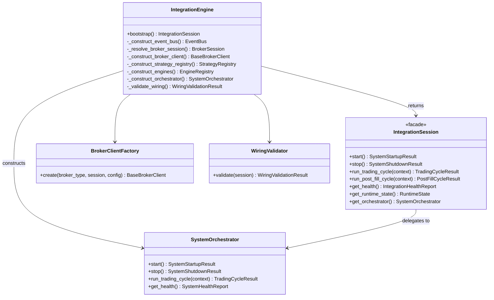
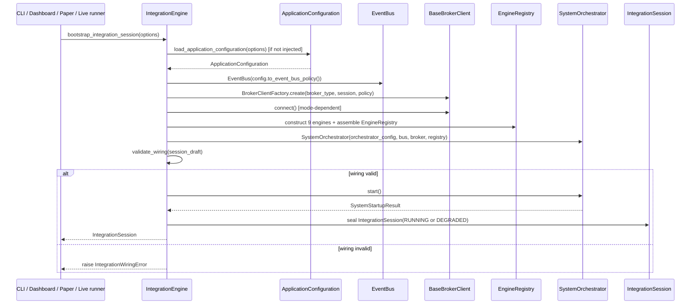

# Integration Engine — Software Engineering Specification

| Field | Value |
|---|---|
| **Module** | `system/integration_engine.py` |
| **Document version** | 1.0.0 |
| **Status** | Draft — ready for implementation |
| **Owner** | THETA AI TRADER Core Platform |
| **Last updated** | 2026-08-04 |

---

## 1. Purpose

`system/integration_engine.py` defines the **application composition root** for THETA AI TRADER v1.0.

The module is the **single top-level wiring layer** that loads `ApplicationConfiguration`, constructs every institutional pipeline component from its projected configuration, assembles the `EngineRegistry`, resolves and connects the broker client, constructs the `SystemOrchestrator` with fully injected dependencies, validates the resulting object graph end-to-end, and exposes one stable, thread-safe runtime facade — `IntegrationSession` — consumed by the CLI, the Dashboard, the Paper Trading runner, and the Live Trading runner. It answers a question that no other frozen module answers: *"How do we turn one `ApplicationConfiguration` into one fully wired, health-checked, running THETA AI TRADER process — and back down again — without any caller having to know how any individual engine is constructed?"*

The Integration Engine sits **above** the System Orchestrator, not beside it. The System Orchestrator coordinates trading cycles across already-constructed engines; the Integration Engine constructs those engines in the first place, wires their dependencies, injects them into the System Orchestrator, and owns the parts of the platform lifecycle that exist *outside* a single trading cycle: process bootstrap, broker connection lifecycle, end-to-end wiring validation, and graceful process shutdown.

It is **not** a trading engine. It is **not** a strategy engine. It is **not** a risk engine. It is **not** the System Orchestrator. It is **not** a broker implementation. It is **not** a configuration loader. It is the **glue** — a thin, deterministic, side-effect-isolated composition layer that turns static configuration into a live, coordinated system.

### 1.1 The gap the Integration Engine fills

Two frozen modules already exist and were deliberately scoped **not** to perform this wiring:

- `config/application_configuration.py` — Non-responsibility **NR4**: *"Connect to broker APIs directly — Broker client constructed elsewhere using resolved secrets."* Application Configuration produces `BrokerConfiguration` (non-secret metadata) and `SecretReferences` — it never builds a `BrokerSession` or a `BaseBrokerClient`.
- `system/system_orchestrator.py` — Non-responsibility **NR14**: *"Load environment variables or config files — Accept injected `SystemOrchestratorConfig`."* Non-responsibility **NR15**: *"Import Kite SDK or Zerodha modules — Broker abstraction via `BaseBrokerClient` only."* The `SystemOrchestrator.__init__` signature accepts `broker_client: object | None` and `engine_registry: EngineRegistry | None` as **already-constructed** objects — it never builds them.

Nobody in the frozen architecture builds the `BrokerSession`, selects and instantiates the concrete `BaseBrokerClient`, constructs the nine coordinated engines from their projected `*Config` types, assembles the `EngineRegistry`, or constructs the `SystemOrchestrator` itself. `system/integration_engine.py` is the module that closes this gap. It is new **plumbing**, not a new **engine** — it contains zero market analysis, zero strategy selection, zero risk math, zero execution planning, and zero broker protocol logic. Every line of domain intelligence still lives in the nine frozen engines; the Integration Engine only calls their public constructors and public methods.

### 1.2 Pipeline placement

```text
[External: CLI entry point / Dashboard process / Paper runner / Live runner / test harness]
              │
              ▼
[config/application_configuration.py]
    load_application_configuration(options) → ApplicationConfiguration (frozen)
              │
              ▼
[system/integration_engine.py]                       ← THIS MODULE (COMPOSITION ROOT)
    ┌──────────────────────────────────────────────────────────────────────┐
    │ BOOTSTRAP PIPELINE                                                    │
    │   construct EventBus from EventBusPolicy                             │
    │   resolve BrokerSession from secrets → construct BaseBrokerClient    │
    │   construct StrategyRegistry → discover and register plugins         │
    │   construct MarketData / StrategyEvaluation / TradeDecision /        │
    │       Risk / Execution / OrderManager / Position / Portfolio / APME  │
    │   assemble EngineRegistry                                            │
    │   construct SystemOrchestrator(config, event_bus, broker, registry)  │
    │   validate wiring end-to-end (WIRE-* rules)                          │
    │   start SystemOrchestrator                                           │
    │   seal IntegrationSession                                            │
    └──────────────────────────────────────────────────────────────────────┘
              │
              ▼
[system/system_orchestrator.py]              ← delegate: cycle execution only
    run_trading_cycle() / run_post_fill_cycle() / get_health() / stop()
              │
              ▼
[Event Bus: integration.* · system.* · pipeline.* · market.* · order.* ·
             position.* · portfolio.* · apme.*]
              │
              ▼
[External: CLI output / Dashboard views / Paper ledger / Live broker account]
```

### 1.3 Architecture freeze note

The platform architecture is **FROZEN** for v1.0. The Integration Engine does **not** introduce, replace, or bypass any coordinated engine:

- **Application Configuration** remains the **only** source of typed, validated settings. Integration Engine never parses `.env` files, YAML, or JSON — it calls `load_application_configuration()` or accepts an already-loaded `ApplicationConfiguration`.
- **System Orchestrator** remains the **only** component that coordinates trading cycles and post-fill cycles. Integration Engine constructs the orchestrator and **delegates** every cycle call to it — it never re-implements pipeline stage sequencing.
- **Each analytical engine** (`MarketDataEngine`, `StrategyEvaluationEngine`, `TradeDecisionEngine`, `RiskEngine`, `ExecutionEngine`, `OrderManager`, `PositionManager`, `PortfolioManager`, `AdaptivePositionManagementEngine`) is constructed by the Integration Engine using its **existing public constructor** and a config object produced by an **existing** `ApplicationConfiguration.to_*_config()` projection method. Integration Engine adds no new fields to any of these config types.
- **Strategy Registry** is populated by the Integration Engine via its **existing** `register()` / `register_batch()` public API — Integration Engine never implements plugin discovery heuristics beyond directory scanning already described by `StrategyConfiguration.registry_plugin_dir`.
- **Broker abstraction** — Integration Engine selects a concrete `BaseBrokerClient` implementation (`KiteBrokerClient` for `BrokerType.ZERODHA_KITE`) by `BrokerType`, constructs it with an injected `BrokerSession`, and calls only its public `connect()` / `disconnect()` / `is_connected()` API. Integration Engine never imports the Kite Connect SDK, never issues REST or WebSocket calls, and never interprets broker payloads.
- **Event Bus** is constructed once by the Integration Engine from `EventBusPolicy` and **shared by reference** — the same `EventBus` instance flows into every engine, the `EngineRegistry`, and the `SystemOrchestrator`. Integration Engine adds only `integration.*` publications; it never modifies dispatch semantics.
- **No new engines.** The Integration Engine is not, and must never become, an eleventh coordinated engine with domain intelligence. It has no `evaluate()`, no `review()`, no `plan()`, no `apply_order_tracker()` equivalent — only `bootstrap()`, `start()`, `stop()`, and passthrough delegation methods.

### 1.4 Goals

1. Provide a **single composition root** that turns `ApplicationConfiguration` into a fully wired, running THETA AI TRADER process.
2. **Construct the Event Bus** once from `EventBusPolicy` and inject the same instance everywhere.
3. **Resolve broker secrets** into a `BrokerSession` without ever storing raw secret values on any Integration Engine field.
4. **Select and construct the concrete broker client** (`KiteBrokerClient` / mock / recording) from `BrokerType`.
5. **Construct the Strategy Registry** and populate it via plugin discovery from `StrategyConfiguration`.
6. **Construct all nine coordinated engines** from their `ApplicationConfiguration.to_*_config()` projections and existing public constructors.
7. **Assemble the `EngineRegistry`** with every engine reference and the shared `EventBus`.
8. **Construct the `SystemOrchestrator`** with the projected `SystemOrchestratorConfig`, the shared `EventBus`, the broker client, and the `EngineRegistry`.
9. **Validate wiring end-to-end** — every data-flow contract between adjacent pipeline stages holds before the first cycle runs.
10. **Delegate cycle execution entirely** to `SystemOrchestrator.run_trading_cycle()` / `run_post_fill_cycle()` — zero pipeline stage logic duplicated.
11. **Expose `IntegrationSession`** as the single, stable public API surface for CLI, Dashboard, Paper Trading, and Live Trading runners.
12. **Support `EnvironmentProfile`-driven modes**: `DEVELOPMENT`, `PAPER`, `PRODUCTION` (Live), with documented behavioural differences.
13. **Publish `integration.*` lifecycle events** for observability distinct from `system.*` orchestrator events.
14. **Perform graceful startup** — ordered bootstrap stages with fail-fast and partial-degraded semantics.
15. **Perform graceful shutdown** — stop the orchestrator, disconnect the broker, release the event bus, in deterministic order.
16. **Monitor integration-level health** — aggregate `SystemHealthReport`, broker connectivity, and wiring status into `IntegrationHealthReport`.
17. **Isolate bootstrap and runtime errors** — one failed construction step never leaves partially-wired global state.
18. **Support recovery strategies** — bootstrap retry, session restart, broker reconnect delegation — without silent state corruption.
19. **Be thread-safe** — concurrent health reads and state reads never race with bootstrap or shutdown.
20. **Be deterministic** — identical `ApplicationConfiguration` produces an identical `wiring_fingerprint`.
21. **Expose immutable runtime state snapshots** via `get_runtime_state() -> RuntimeState`.
22. **Support dependency injection overrides** for tests — every constructed component may be substituted via `IntegrationBootstrapOptions.engine_overrides`.
23. **Serialize** `IntegrationHealthReport`, `RuntimeState`, and `IntegrationEvent` to schema v1.0.0 JSON.
24. **Use Google-style docstrings** on all public types and methods.
25. **Reach ≥ 95% unit test coverage** on `system/integration_engine.py`.
26. **Never implement trading, strategy, risk, execution, or broker protocol logic** — verified by static import and code-review checklist (§22).

### 1.5 Success criteria

- `IntegrationEngine(config).bootstrap()` returns a `RUNNING` (or `DEGRADED`, per policy) `IntegrationSession` when all critical components construct successfully.
- `IntegrationSession.run_trading_cycle(context)` and `run_post_fill_cycle(context)` produce results **byte-for-byte identical** to calling the same methods directly on the underlying `SystemOrchestrator` — Integration Engine adds zero transformation to cycle inputs or outputs beyond pass-through.
- Wiring validation fails fast — with a structured `WIRE-*` diagnostic — before `SystemOrchestrator.start()` is ever called, whenever the object graph is incomplete or inconsistent.
- `IntegrationSession.stop()` drains the orchestrator, disconnects the broker, and reaches `STOPPED` within `shutdown_drain_timeout_seconds`.
- Identical `ApplicationConfiguration.config_fingerprint` produces an identical `wiring_fingerprint` across repeated bootstraps in the same process.
- No engine construction failure crashes the host process — failures are captured as structured `IntegrationEvent` / `IntegrationHealthReport` entries.
- Unit test coverage ≥ 95% line coverage on `system/integration_engine.py`.
- Grep of `system/integration_engine.py` contains zero references to strategy scoring formulas, Greeks math, margin math, or Kite Connect SDK symbols.

### 1.6 Relationship to other modules

| Module | Relationship |
|---|---|
| `config/application_configuration.py` | **Upstream input.** Integration Engine consumes `ApplicationConfiguration` and calls every `to_*_config()` projection method. Never mutated. |
| `system/system_orchestrator.py` | **Primary downstream delegate.** Integration Engine constructs `SystemOrchestrator` and forwards every cycle call, `start()`, `stop()`, and `get_health()` call to it. |
| `core/event_bus.py` | **Constructed once.** Integration Engine builds the single `EventBus` instance shared by every engine, the orchestrator, and its own `integration.*` publications. |
| `broker/base_broker.py` | **Contract reference.** Integration Engine depends only on `BaseBrokerClient`, `BrokerSession`, `BrokerId`, `SessionState` — never a concrete transport. |
| `broker/zerodha/kite_broker.py` | **Constructed for `BrokerType.ZERODHA_KITE`.** Integration Engine calls `KiteBrokerClient(session, policy)` and its public `connect()`/`disconnect()` — never Kite Connect SDK symbols directly. |
| `market_data/market_data_engine.py` | **Constructed.** `MarketDataEngine(config, broker_client, adapter, event_bus)` — Integration Engine supplies all four collaborators. |
| `market_data/market_data_adapter.py` | **Constructed.** `MarketDataAdapter(policy)` instantiated once and passed to `MarketDataEngine`. |
| `strategy/registry.py` | **Constructed and populated.** Integration Engine calls `StrategyRegistry(config)` then `register()` / `register_batch()` for discovered plugins. |
| `strategy/strategy_evaluation_engine.py` | **Constructed.** `StrategyEvaluationEngine(config, registry)` — registry reference shared with the registry above. |
| `decision/trade_decision_engine.py` | **Constructed.** `TradeDecisionEngine(config)`. |
| `risk/risk_engine.py` | **Constructed.** `RiskEngine(config)`. |
| `execution/execution_engine.py` | **Constructed.** `ExecutionEngine(config)`. |
| `execution/order_manager.py` | **Constructed.** `OrderManager(config, event_bus=event_bus)`. |
| `portfolio/position_manager.py` | **Constructed.** `PositionManager(config, event_bus)`. |
| `portfolio/portfolio_manager.py` | **Constructed.** `PortfolioManager(config, event_bus)`. |
| `apme/adaptive_position_management_engine.py` | **Constructed.** `AdaptivePositionManagementEngine(config, event_bus)`. |
| CLI entry point (`main.py` successor) | **Consumer.** Calls `bootstrap_integration_session(...)`, then drives `IntegrationSession` in a scheduler or one-shot loop. |
| Dashboard process | **Consumer.** Reads `IntegrationSession.get_health()` / `get_runtime_state()` for display; never calls engine internals directly. |
| Paper Trading runner | **Consumer.** Bootstraps with `EnvironmentProfile.PAPER`; drives cycles on a schedule. |
| Live Trading runner | **Consumer.** Bootstraps with `EnvironmentProfile.PRODUCTION`; drives cycles on a schedule with stricter guardrails. |

### 1.7 Distinction from Application Configuration

| Concern | Application Configuration | Integration Engine |
|---|---|---|
| Output | Immutable settings bundle (`ApplicationConfiguration`) | Live, running object graph (`IntegrationSession`) |
| Reads env vars / files | Yes — sole owner | **Never** |
| Resolves secrets | Delegates to `SecretProvider`, validates availability | Resolves secrets **into a `BrokerSession`** for broker construction |
| Constructs engines | **Never** | **Core responsibility** |
| Constructs broker client | **Never** (NR4) | **Core responsibility** |
| Constructs `SystemOrchestrator` | **Never** | **Core responsibility** |
| Validates | Field-level and cross-section config invariants | End-to-end object-graph wiring invariants |
| Mutability | Frozen after load | `IntegrationSession` is a stateful facade over a live process |
| Lifecycle | Loaded once at process start, then read-only | `bootstrap → start → run cycles → stop` full process lifecycle |

### 1.8 Distinction from System Orchestrator

| Concern | System Orchestrator | Integration Engine |
|---|---|---|
| Role | Coordinates trading cycles across already-built engines | Builds the engines and the orchestrator itself |
| Constructs engines | **Never** — receives `EngineRegistry` by injection | **Core responsibility** — builds every `EngineRegistry` field |
| Constructs broker client | **Never** — receives `broker_client` by injection | **Core responsibility** |
| Reads `ApplicationConfiguration` | **Never** — receives `SystemOrchestratorConfig` only | **Core responsibility** — calls every `to_*_config()` |
| Cycle execution | **Core responsibility** — `run_trading_cycle()`, `run_post_fill_cycle()` | **Delegates only** — forwards the same call, same arguments, same return value |
| Lifecycle scope | One orchestrator instance's `UNINITIALIZED → RUNNING → STOPPED` | One process's config load → wiring → orchestrator lifecycle → broker teardown |
| Event namespace | `system.*`, `pipeline.*` | `integration.*` |
| Public consumers | Integration Engine (only) | CLI, Dashboard, Paper runner, Live runner, tests |

### 1.9 Distinction from external runners (CLI / Dashboard / Paper / Live)

| Concern | External runner | Integration Engine |
|---|---|---|
| Owns process entry point (`if __name__ == "__main__"`) | Yes | **Never** |
| Owns scheduling policy (interval, market-hours calendar, cron) | Yes | Provides `run_forever()` convenience only when explicitly invoked by a runner; contains no calendar or market-hours logic itself |
| Owns UI rendering | Dashboard only | **Never** |
| Owns order simulation ledger (Paper) | Paper runner (via Mock/Recording broker configuration) | **Never** — only selects and constructs the configured broker client |
| Owns bootstrap and wiring | **Never** | **Core responsibility** |
| Consumes | `IntegrationSession` public API | `ApplicationConfiguration` |

---

## 2. Responsibilities

`system/integration_engine.py` **is responsible for**:

| # | Responsibility | Description |
|---|---|---|
| R1 | **Configuration acquisition** | Accept an injected `ApplicationConfiguration` or call `load_application_configuration()` with supplied `LoadOptions`. |
| R2 | **Event Bus construction** | Build one `EventBus` from `config.to_event_bus_policy()` and share the reference everywhere. |
| R3 | **Broker secret resolution** | Resolve `BrokerConfiguration` + `SecretReferences` into a `BrokerSession` via `SecretProvider`. |
| R4 | **Broker client selection** | Map `BrokerType` to a concrete `BaseBrokerClient` implementation. |
| R5 | **Broker client construction** | Instantiate the selected broker client with the resolved `BrokerSession`. |
| R6 | **Broker connection lifecycle** | Call `connect()` / `disconnect()` at the correct bootstrap / shutdown stage, respecting mode policy. |
| R7 | **Strategy registry construction** | Build `StrategyRegistry(config.to_strategy_registry_config())`. |
| R8 | **Strategy plugin discovery** | Discover plugin modules under `StrategyConfiguration.registry_plugin_dir` and register enabled ones. |
| R9 | **Market data engine construction** | Build `MarketDataEngine` with adapter, broker client, and event bus. |
| R10 | **Strategy evaluation engine construction** | Build `StrategyEvaluationEngine` bound to the constructed registry. |
| R11 | **Trade decision engine construction** | Build `TradeDecisionEngine` from projected config. |
| R12 | **Risk engine construction** | Build `RiskEngine` from projected config. |
| R13 | **Execution engine construction** | Build `ExecutionEngine` from projected config. |
| R14 | **Order manager construction** | Build `OrderManager` bound to the shared event bus. |
| R15 | **Position manager construction** | Build `PositionManager` bound to the shared event bus. |
| R16 | **Portfolio manager construction** | Build `PortfolioManager` bound to the shared event bus. |
| R17 | **APME construction** | Build `AdaptivePositionManagementEngine` bound to the shared event bus. |
| R18 | **Engine registry assembly** | Populate `EngineRegistry` with every constructed engine and the event bus. |
| R19 | **Orchestrator construction** | Build `SystemOrchestrator(orchestrator_config, event_bus, broker_client, engine_registry)`. |
| R20 | **Wiring validation** | Run `WIRE-*` checks confirming object-graph completeness and contract consistency. |
| R21 | **Orchestrator lifecycle delegation** | Forward `start()`, `stop()`, `get_health()`, `get_state()` to the constructed orchestrator. |
| R22 | **Cycle delegation** | Forward `run_trading_cycle()` and `run_post_fill_cycle()` with zero transformation. |
| R23 | **Integration-level health aggregation** | Combine `SystemHealthReport`, broker connectivity, and wiring status into `IntegrationHealthReport`. |
| R24 | **Integration event publication** | Publish `integration.*` topic events for bootstrap, wiring, session, and health transitions. |
| R25 | **Runtime state snapshotting** | Produce immutable `RuntimeState` snapshots on demand. |
| R26 | **Dependency override support** | Accept `IntegrationBootstrapOptions.engine_overrides` for test doubles without branching production code paths. |
| R27 | **Error isolation during bootstrap** | Catch and structure every construction-stage exception; never leave a half-built session reachable by callers. |
| R28 | **Thread-safe session state** | Protect `IntegrationSessionState` transitions and reads with a dedicated lock, independent of the orchestrator's internal lock. |
| R29 | **Deterministic wiring fingerprint** | Compute a stable SHA-256 fingerprint over the salient bootstrap inputs. |
| R30 | **Serialization** | JSON round-trip for `IntegrationHealthReport`, `RuntimeState`, `IntegrationEvent`. |
| R31 | **Session restart support** | Provide a documented rebuild-and-restart path after a fatal broker or engine failure. |
| R32 | **Documentation contract** | Google-style docstrings on all public types and methods. |

---

## 3. Non-Responsibilities

`system/integration_engine.py` **must not**:

| # | Non-responsibility | Rationale |
|---|---|---|
| NR1 | **Parse environment variables, YAML, or JSON configuration** | `config/application_configuration.py` responsibility exclusively. |
| NR2 | **Validate individual configuration field ranges** | Already performed by `validate_application_configuration()` during load. |
| NR3 | **Resolve raw secret values into long-lived fields** | Secrets flow through `BrokerSession.credentials` only, constructed once and handed to the broker client; Integration Engine never stores or logs them. |
| NR4 | **Implement Kite Connect (or any) broker transport logic** | `broker/zerodha/kite_broker.py` responsibility; Integration Engine calls only public `BaseBrokerClient` methods. |
| NR5 | **Perform market analysis, regime detection, or Greeks math** | Market Data Engine and downstream analytical engines' responsibility. |
| NR6 | **Select strategies, score suitability, or rank strategies** | Strategy Evaluation Engine responsibility. |
| NR7 | **Aggregate signals into trade decisions** | Trade Decision Engine responsibility. |
| NR8 | **Perform risk calculations or emit risk verdicts** | Risk Engine responsibility. |
| NR9 | **Build execution plans or compute leg sequencing** | Execution Engine responsibility. |
| NR10 | **Submit, modify, or cancel broker orders directly** | Order Manager responsibility, itself gated by injected `BaseBrokerClient`. |
| NR11 | **Implement position or portfolio accounting math** | Position Manager / Portfolio Manager responsibility. |
| NR12 | **Implement APME exit, roll, hedge, or protection rules** | APME responsibility. |
| NR13 | **Re-implement trading cycle stage sequencing** | System Orchestrator responsibility exclusively — Integration Engine only delegates. |
| NR14 | **Re-implement portfolio-to-risk mapping** | System Orchestrator responsibility (`map_portfolio_snapshot_for_risk`) — Integration Engine never touches domain artifacts mid-cycle. |
| NR15 | **Own scheduling calendars, market-hours logic, or cron semantics** | External runner responsibility; Integration Engine's optional `run_forever()` is a thin convenience loop only. |
| NR16 | **Render UI, dashboards, or CLI output formatting** | Consumer responsibility. |
| NR17 | **Persist state to a database or filesystem beyond logging** | Out of scope for v1; Integration Engine returns in-memory immutable snapshots. |
| NR18 | **Introduce a new coordinated engine or new domain type** | Backend architecture is frozen for v1.0 — Integration Engine wires the existing ten components only. |
| NR19 | **Bypass any engine's public constructor or public method** | No private attribute access, no monkeypatching, no reflection-based field injection. |
| NR20 | **Maintain a duplicate position, portfolio, or order dictionary** | Query the constructed engines via their public APIs; never shadow their state. |
| NR21 | **Silently swallow a construction failure** | Every failure is recorded in `IntegrationEvent` / bootstrap diagnostics and surfaced to the caller. |
| NR22 | **Force-start when a critical component fails to construct** | Fail closed — see §12 startup gating. |
| NR23 | **Hot-reload configuration into a running session** | v1 requires stop → rebuild → start; no in-place mutation of a live object graph. |
| NR24 | **Authenticate users or manage dashboard sessions** | Security layer external to this module. |
| NR25 | **Train, fit, or update any machine learning model** | No ML in the composition root. |
| NR26 | **Merge the legacy (`main.py`, `config_manager.py`) pipeline with the institutional pipeline** | v1 institutional path only (Appendix E). |

---

## 4. Architecture

### 4.1 Layered design

```text
┌───────────────────────────────────────────────────────────────────────────────┐
│                       system/integration_engine.py                            │
│        (composition root — zero domain logic, zero broker protocol logic)     │
│                                                                                 │
│  ┌───────────────────┐   ┌─────────────────────┐   ┌────────────────────────┐ │
│  │ IntegrationEngine  │──▶│ BootstrapPipeline    │──▶│ WiringValidator         │ │
│  │ (composition root) │   │ (ordered stages)     │   │ (WIRE-* rule engine)    │ │
│  └───────────────────┘   └─────────────────────┘   └────────────────────────┘ │
│           │                          │                          │              │
│           ▼                          ▼                          ▼              │
│  ┌───────────────────────────────────────────────────────────────────────┐    │
│  │ BrokerClientFactory · StrategyPluginLoader · EngineFactory ·           │    │
│  │ HealthAggregator · IntegrationEventPublisher · SessionLock ·           │    │
│  │ WiringFingerprint                                                       │    │
│  └───────────────────────────────────────────────────────────────────────┘    │
│                                       │                                        │
│                                       ▼                                        │
│                              ┌──────────────────┐                             │
│                              │ IntegrationSession│  ← public runtime facade   │
│                              └──────────────────┘                             │
└───────────────────────────────────────────────────────────────────────────────┘
         ▲                                           │
         │ ApplicationConfiguration (frozen input)   ▼
         │                                    SystemOrchestrator (constructed)
         │                                    BaseBrokerClient (constructed)
         │                                    EventBus (constructed)
         │                                    StrategyRegistry (constructed & populated)
         │                                    9 coordinated engines (constructed)
```

### 4.2 The composition root pattern

The Integration Engine implements the classic **Composition Root** pattern: a single location, invoked exactly once per process, where every object graph edge is decided. Two consequences follow directly:

- **No coordinated engine, and no `SystemOrchestrator`, ever constructs another coordinated component.** Every constructor call in the platform that creates a `MarketDataEngine`, a `RiskEngine`, a `BaseBrokerClient`, or a `SystemOrchestrator` for production use lives inside `system/integration_engine.py`.
- **Every downstream module remains ignorant of `ApplicationConfiguration`.** Engines accept only their own `*Config` dataclass; only the Integration Engine (and, transitively, `ApplicationConfiguration` itself for projection) knows the shape of the full configuration bundle.

### 4.3 Constructed components

| Component | Constructed by | Constructor call (representative) | Shared instance? |
|---|---|---|---|
| `EventBus` | `IntegrationEngine._construct_event_bus` | `EventBus(config.to_event_bus_policy())` | Yes — single instance for entire session |
| `BrokerSession` | `IntegrationEngine._resolve_broker_session` | `BrokerSession(broker_id, session_id, authenticated_at, credentials, expires_at)` | Yes — held by broker client only |
| `BaseBrokerClient` | `BrokerClientFactory.create` | `KiteBrokerClient(session, policy)` (or mock/recording) | Yes — shared with `MarketDataEngine`, `EngineRegistry`, `SystemOrchestrator` |
| `MarketDataAdapter` | `IntegrationEngine._construct_market_data_engine` | `MarketDataAdapter(policy)` | No — private to `MarketDataEngine` |
| `MarketDataEngine` | `IntegrationEngine._construct_market_data_engine` | `MarketDataEngine(config, broker_client, adapter, event_bus)` | Yes — held in `EngineRegistry` |
| `StrategyRegistry` | `IntegrationEngine._construct_strategy_registry` | `StrategyRegistry(config.to_strategy_registry_config())` | Yes — shared with `StrategyEvaluationEngine` |
| `StrategyEvaluationEngine` | `IntegrationEngine._construct_strategy_evaluation_engine` | `StrategyEvaluationEngine(config, registry)` | Yes — held in `EngineRegistry` |
| `TradeDecisionEngine` | `IntegrationEngine._construct_trade_decision_engine` | `TradeDecisionEngine(config)` | Yes — held in `EngineRegistry` |
| `RiskEngine` | `IntegrationEngine._construct_risk_engine` | `RiskEngine(config)` | Yes — held in `EngineRegistry` |
| `ExecutionEngine` | `IntegrationEngine._construct_execution_engine` | `ExecutionEngine(config)` | Yes — held in `EngineRegistry` |
| `OrderManager` | `IntegrationEngine._construct_order_manager` | `OrderManager(config, event_bus=event_bus)` | Yes — held in `EngineRegistry` |
| `PositionManager` | `IntegrationEngine._construct_position_manager` | `PositionManager(config, event_bus)` | Yes — held in `EngineRegistry` |
| `PortfolioManager` | `IntegrationEngine._construct_portfolio_manager` | `PortfolioManager(config, event_bus)` | Yes — held in `EngineRegistry` |
| `AdaptivePositionManagementEngine` | `IntegrationEngine._construct_apme` | `AdaptivePositionManagementEngine(config, event_bus)` | Yes — held in `EngineRegistry` |
| `EngineRegistry` | `IntegrationEngine._assemble_engine_registry` | `EngineRegistry(event_bus=..., market_data=..., ...)` | Yes — passed once to `SystemOrchestrator` |
| `SystemOrchestrator` | `IntegrationEngine._construct_orchestrator` | `SystemOrchestrator(orchestrator_config, event_bus=..., broker_client=..., engine_registry=...)` | Yes — held by `IntegrationSession` |

### 4.4 Design principles

- **Construct once, share by reference.** No component is constructed twice within a single bootstrap; every consumer of the `EventBus` or the broker client receives the identical object.
- **Fail fast, fail structured.** Every constructor call is wrapped by an error boundary that converts exceptions into structured `IntegrationEvent` / diagnostic records — never a bare traceback reaching the caller.
- **Immutable handoffs.** Every artifact the Integration Engine returns to a caller (`IntegrationHealthReport`, `RuntimeState`, `IntegrationEvent`) is a frozen dataclass.
- **Pure delegation on the hot path.** `IntegrationSession.run_trading_cycle()` and `run_post_fill_cycle()` add no branching, no transformation, and no additional locking beyond what is required for thread-safety bookkeeping — call overhead must stay within the performance budget in §21.
- **Explicit override seam.** Every constructed component has a corresponding optional field on `IntegrationBootstrapOptions.engine_overrides` so tests can substitute fakes without conditional production code.
- **Config-driven, not code-driven, mode switching.** `EnvironmentProfile` differences are expressed entirely through `ApplicationConfiguration` field values (already resolved before the Integration Engine runs) — the Integration Engine itself contains no `if profile == PRODUCTION` branches beyond broker connection and secret-strictness gating described in §8.
- **Single wiring validation gate.** All WIRE-* checks run once, immediately after construction and before `SystemOrchestrator.start()` — never interleaved with cycle execution.

### 4.5 Dependency direction

```text
system/integration_engine.py
    → config/application_configuration.py   (consumes ApplicationConfiguration)
    → core/event_bus.py                     (constructs EventBus)
    → broker/base_broker.py                 (BrokerSession, BaseBrokerClient contract)
    → broker/zerodha/kite_broker.py         (constructs KiteBrokerClient)
    → market_data/market_data_engine.py     (constructs MarketDataEngine)
    → market_data/market_data_adapter.py    (constructs MarketDataAdapter)
    → strategy/registry.py                  (constructs StrategyRegistry)
    → strategy/strategy_evaluation_engine.py (constructs StrategyEvaluationEngine)
    → decision/trade_decision_engine.py     (constructs TradeDecisionEngine)
    → risk/risk_engine.py                   (constructs RiskEngine)
    → execution/execution_engine.py         (constructs ExecutionEngine)
    → execution/order_manager.py            (constructs OrderManager)
    → portfolio/position_manager.py         (constructs PositionManager)
    → portfolio/portfolio_manager.py        (constructs PortfolioManager)
    → apme/adaptive_position_management_engine.py (constructs AdaptivePositionManagementEngine)
    → system/system_orchestrator.py         (constructs SystemOrchestrator; delegates all cycles)

Forbidden imports:
    → any Kite Connect / Zerodha third-party SDK symbol directly
    → strategy plugin modules by concrete class name (registry discovery only)
    → risk engine, execution engine, or APME internal (non-public) helpers
    → market data WebSocket / tick parsing internals
    → os.environ / dotenv / yaml / json config-file readers (ApplicationConfiguration only)
```

### 4.6 Relationship diagram



### 4.7 Bootstrap sequence diagram



---

## 5. Data Model

All public outward-facing types are **immutable dataclasses** (`frozen=True`) unless explicitly noted. `IntegrationSession` and `IntegrationEngine` are the only mutable service-style classes in the module.

### 5.1 Type hierarchy

```text
IntegrationEngine (mutable composition-root service)
├── config: ApplicationConfiguration
├── options: IntegrationBootstrapOptions
├── clock: Callable[[], datetime]
└── methods: bootstrap()

IntegrationSession (mutable runtime facade — the primary public API)
├── session_id: str
├── config: ApplicationConfiguration
├── event_bus: EventBus
├── broker_client: BaseBrokerClient
├── strategy_registry: StrategyRegistry
├── engine_registry: EngineRegistry
├── orchestrator: SystemOrchestrator
├── wiring_fingerprint: str
├── _lock: threading.RLock (private)
├── _state: IntegrationSessionState (private)
├── _bootstrap_diagnostics: BootstrapDiagnostics (private)
└── methods: start(), stop(), run_trading_cycle(), run_post_fill_cycle(),
             get_health(), get_runtime_state(), get_orchestrator(),
             get_broker_client(), get_event_bus(), get_strategy_registry(),
             get_configuration(), restart()

IntegrationBootstrapOptions (immutable)
├── runner_kind: RunnerKind
├── load_options: LoadOptions | None
├── auto_connect_broker: bool
├── auto_start_orchestrator: bool
├── fail_fast_on_wiring_error: bool
├── validate_wiring: bool
├── engine_overrides: EngineOverrides
├── clock: Callable[[], datetime] | None
└── metadata: Mapping[str, str]

EngineOverrides (immutable — test-only injection seam)
├── event_bus: EventBus | None
├── broker_client: BaseBrokerClient | None
├── strategy_registry: StrategyRegistry | None
├── market_data: MarketDataEngine | None
├── strategy_evaluation: StrategyEvaluationEngine | None
├── trade_decision: TradeDecisionEngine | None
├── risk: RiskEngine | None
├── execution: ExecutionEngine | None
├── order_manager: OrderManager | None
├── position_manager: PositionManager | None
├── portfolio_manager: PortfolioManager | None
├── apme: AdaptivePositionManagementEngine | None
└── orchestrator: SystemOrchestrator | None

TradingCycleContext (re-exported alias — see §5.5)
└── = system.system_orchestrator.TradingCycleContext (no redefinition)

PostFillCycleContext (re-exported alias — see §5.5)
└── = system.system_orchestrator.PostFillCycleContext (no redefinition)

RuntimeState (immutable)                                  ← REQUIRED OUTPUT MODEL
├── session_id: str
├── as_of: datetime
├── session_state: IntegrationSessionState
├── orchestrator_state: OrchestratorState | None
├── environment_profile: EnvironmentProfile
├── execution_mode: StrategyExecutionMode
├── runner_kind: RunnerKind
├── account_id: str
├── broker_id: BrokerId | None
├── broker_connection_state: ConnectionState | None
├── config_fingerprint: str
├── wiring_fingerprint: str
├── uptime_seconds: float
├── last_cycle_at: datetime | None
├── last_cycle_status: CycleStatus | None
└── metadata: Mapping[str, str]

IntegrationHealthReport (immutable)                        ← REQUIRED OUTPUT MODEL
├── report_id: str
├── as_of: datetime
├── session_state: IntegrationSessionState
├── overall_status: HealthStatus
├── orchestrator_health: SystemHealthReport | None
├── broker_connection: BrokerHealthSnapshot
├── wiring_status: WiringValidationStatus
├── wiring_issues: tuple[WiringValidationIssue, ...]
├── config_fingerprint: str
├── wiring_fingerprint: str
├── issues: tuple[HealthIssueRecord, ...]
└── metadata: Mapping[str, str]

IntegrationEvent (immutable)                                ← REQUIRED OUTPUT MODEL
├── event_type: IntegrationEventType
├── topic: str
├── session_id: str
├── correlation_id: str
├── occurred_at: datetime
├── session_state: IntegrationSessionState
├── stage_id: BootstrapStageId | None
├── message: str | None
└── metadata: Mapping[str, str]

BootstrapDiagnostics (immutable — internal audit trail, exposed read-only)
├── bootstrap_id: str
├── started_at: datetime
├── completed_at: datetime | None
├── stages: tuple[BootstrapStageResult, ...]
├── status: BootstrapStatus
├── warnings: tuple[IntegrationWarningRecord, ...]
├── errors: tuple[IntegrationErrorRecord, ...]
└── duration_ms: float

BootstrapStageResult (immutable)
├── stage_id: BootstrapStageId
├── passed: bool
├── error_code: str | None
├── message: str | None
├── duration_ms: float
└── details: Mapping[str, str]

WiringValidationResult (immutable)
├── validation_id: str
├── as_of: datetime
├── status: WiringValidationStatus
├── checks: tuple[WiringCheckResult, ...]
├── issues: tuple[WiringValidationIssue, ...]
└── wiring_fingerprint: str

WiringCheckResult (immutable)
├── check_id: WiringCheckId
├── passed: bool
├── message: str | None
└── details: Mapping[str, str]

WiringValidationIssue (immutable)
├── code: str
├── message: str
├── check_id: WiringCheckId | None
├── severity: str
└── field: str | None

BrokerHealthSnapshot (immutable)
├── broker_id: BrokerId | None
├── connection_state: ConnectionState | None
├── session_state: SessionState | None
├── last_connected_at: datetime | None
├── last_error_code: str | None
└── last_error_message: str | None

IntegrationWarningRecord / IntegrationErrorRecord (immutable)
├── code: str
├── message: str
├── stage_id: BootstrapStageId | None
├── field: str | None
```

### 5.2 Enumerations

#### 5.2.1 `IntegrationSessionState`

| Value | Description |
|---|---|
| `NOT_BOOTSTRAPPED` | `IntegrationEngine` constructed but `bootstrap()` not yet invoked. |
| `BOOTSTRAPPING` | Construction stages (§6) in progress. |
| `WIRING` | All components constructed; wiring validation in progress. |
| `WIRED` | Wiring validation passed; orchestrator not yet started. |
| `STARTING` | `SystemOrchestrator.start()` in progress. |
| `RUNNING` | Orchestrator `RUNNING`; ready to accept delegated cycle calls. |
| `DEGRADED` | Orchestrator `DEGRADED`, or a non-critical bootstrap component failed under a partial-degraded policy. |
| `STOPPING` | `stop()` in progress. |
| `STOPPED` | Clean shutdown complete. |
| `FAILED` | Unrecoverable bootstrap or wiring failure; session not usable. |

#### 5.2.2 `BootstrapStageId`

| # | Stage ID | Description |
|---|---|---|
| 1 | `CONFIG_RESOLUTION` | Accept injected config or call `load_application_configuration()`. |
| 2 | `EVENT_BUS_CONSTRUCTION` | Build the shared `EventBus`. |
| 3 | `BROKER_SESSION_RESOLUTION` | Resolve secrets into a `BrokerSession`. |
| 4 | `BROKER_CLIENT_CONSTRUCTION` | Select and construct the concrete `BaseBrokerClient`. |
| 5 | `BROKER_CONNECTION` | Connect the broker client (mode-dependent). |
| 6 | `STRATEGY_REGISTRY_CONSTRUCTION` | Build and populate the `StrategyRegistry`. |
| 7 | `ENGINE_CONSTRUCTION` | Build the nine coordinated engines. |
| 8 | `ENGINE_REGISTRY_ASSEMBLY` | Assemble the `EngineRegistry`. |
| 9 | `ORCHESTRATOR_CONSTRUCTION` | Build the `SystemOrchestrator`. |
| 10 | `WIRING_VALIDATION` | Run `WIRE-*` checks. |
| 11 | `ORCHESTRATOR_STARTUP` | Call `orchestrator.start()` (if `auto_start_orchestrator`). |
| 12 | `SESSION_SEAL` | Freeze diagnostics; construct `IntegrationSession`; publish `integration.session.ready`. |

#### 5.2.3 `WiringCheckId`

| Value | Description |
|---|---|
| `EVENT_BUS_IDENTITY` | Every engine and the orchestrator share the exact same `EventBus` instance. |
| `BROKER_IDENTITY` | The broker client injected into `SystemOrchestrator` and `MarketDataEngine` is the exact same instance. |
| `REGISTRY_COMPLETENESS` | Every required `EngineRegistry` field is non-`None`. |
| `CONFIG_FINGERPRINT_CONSISTENCY` | Every projected `*Config` was derived from the same `ApplicationConfiguration.config_fingerprint`. |
| `STRATEGY_REGISTRY_POPULATION` | Registry has ≥ 1 enabled strategy when `execution_mode is LIVE`, else a warning only. |
| `BROKER_SESSION_VALIDITY` | `BrokerSession` passes `validate_broker_session()` and is not expired. |
| `ORCHESTRATOR_STATE_REACHABLE` | Constructed orchestrator reports `OrchestratorState.UNINITIALIZED` prior to `start()`. |
| `SUBSCRIPTION_PATTERNS_RESOLVED` | `orchestrator_config.subscription_patterns` matches `OrchestratorConfiguration.subscription_patterns`. |

#### 5.2.4 `WiringValidationStatus`

| Value | Description |
|---|---|
| `PASSED` | All checks passed with no issues. |
| `PASSED_WITH_WARNINGS` | All required checks passed; advisory issues recorded. |
| `FAILED` | At least one required check failed. |

#### 5.2.5 `BootstrapStatus`

| Value | Description |
|---|---|
| `SUCCESS` | All stages completed; session `RUNNING` or `WIRED`. |
| `PARTIAL` | Non-critical stage failed under degraded policy; session `DEGRADED`. |
| `FAILED` | Critical stage failed; session `FAILED`, no usable orchestrator reference returned. |

#### 5.2.6 `IntegrationEventType`

| Value | Topic |
|---|---|
| `BOOTSTRAP_STARTED` | `integration.bootstrap.started` |
| `BOOTSTRAP_STAGE_COMPLETED` | `integration.bootstrap.stage.completed` |
| `BOOTSTRAP_COMPLETED` | `integration.bootstrap.completed` |
| `BOOTSTRAP_FAILED` | `integration.bootstrap.failed` |
| `WIRING_VALIDATED` | `integration.wiring.validated` |
| `WIRING_FAILED` | `integration.wiring.failed` |
| `BROKER_CONNECTED` | `integration.broker.connected` |
| `BROKER_DISCONNECTED` | `integration.broker.disconnected` |
| `SESSION_READY` | `integration.session.ready` |
| `SESSION_STARTED` | `integration.session.started` |
| `SESSION_STOPPED` | `integration.session.stopped` |
| `SESSION_RESTARTED` | `integration.session.restarted` |
| `HEALTH_DEGRADED` | `integration.health.degraded` |
| `HEALTH_RECOVERED` | `integration.health.recovered` |
| `SESSION_ERROR` | `integration.error` |

#### 5.2.7 `RunnerKind`

| Value | Description |
|---|---|
| `CLI` | One-shot or scheduled command-line invocation. |
| `DASHBOARD` | Long-running dashboard backend process. |
| `PAPER_TRADING` | Paper trading runner (simulated fills, `EnvironmentProfile.PAPER`). |
| `LIVE_TRADING` | Live trading runner (`EnvironmentProfile.PRODUCTION`). |
| `TEST_HARNESS` | Automated test suite bootstrap. |

#### 5.2.8 `HealthStatus`

Reused from `system.system_orchestrator.HealthStatus`: `HEALTHY`, `DEGRADED`, `UNHEALTHY`, `UNKNOWN`. Integration Engine does not redefine this enum — see §5.4, `INV-G-002`.

### 5.3 Supporting immutable types — field tables

#### 5.3.1 `IntegrationBootstrapOptions`

| Field | Type | Default | Description |
|---|---|---|---|
| `runner_kind` | `RunnerKind` | `RunnerKind.CLI` | Identifies the calling surface for logging and health metadata. |
| `load_options` | `LoadOptions \| None` | `None` | Forwarded to `load_application_configuration()` when no `ApplicationConfiguration` is injected. |
| `auto_connect_broker` | `bool` | `True` | Whether stage `BROKER_CONNECTION` calls `broker_client.connect()`. |
| `auto_start_orchestrator` | `bool` | `True` | Whether stage `ORCHESTRATOR_STARTUP` calls `orchestrator.start()`. |
| `fail_fast_on_wiring_error` | `bool` | `True` | Raise `IntegrationWiringError` on `WiringValidationStatus.FAILED` instead of returning a `FAILED` session. |
| `validate_wiring` | `bool` | `True` | Whether stage `WIRING_VALIDATION` runs at all (disable only for isolated unit tests of individual stages). |
| `engine_overrides` | `EngineOverrides` | `EngineOverrides()` | Test-only substitution seam — see §5.3.2. |
| `clock` | `Callable[[], datetime] \| None` | `None` | Injectable clock for deterministic timestamps. |
| `metadata` | `Mapping[str, str]` | `{}` | Free-form audit metadata attached to bootstrap diagnostics. |

#### 5.3.2 `EngineOverrides`

| Field | Type | Purpose |
|---|---|---|
| `event_bus` | `EventBus \| None` | Substitute a `RecordingEventBus` in tests. |
| `broker_client` | `BaseBrokerClient \| None` | Substitute a stub broker without touching `BrokerType` resolution. |
| `strategy_registry` | `StrategyRegistry \| None` | Substitute a pre-populated registry, skipping plugin discovery. |
| `market_data` … `apme` | engine type `\| None` | Substitute any individual engine, skipping its construction stage. |
| `orchestrator` | `SystemOrchestrator \| None` | Substitute a fully pre-built orchestrator, skipping stages 7–9 entirely. |

**Rule OVR-001:** When `engine_overrides.orchestrator` is supplied, stages `ENGINE_CONSTRUCTION` through `ORCHESTRATOR_CONSTRUCTION` are skipped and marked `passed=True` with `details={"skipped": "override_supplied"}`.

**Rule OVR-002:** Partial overrides (e.g. only `risk`) still construct every other engine normally — overrides are per-field, not all-or-nothing.

#### 5.3.3 `RuntimeState` — field table

| Field | Type | Description |
|---|---|---|
| `session_id` | `str` | Stable UUID4 identifier assigned at `SESSION_SEAL`. |
| `as_of` | `datetime` | Timezone-aware snapshot timestamp. |
| `session_state` | `IntegrationSessionState` | Current facade lifecycle state. |
| `orchestrator_state` | `OrchestratorState \| None` | Mirrors `orchestrator.get_state()`; `None` before construction. |
| `environment_profile` | `EnvironmentProfile` | From `config.profile`. |
| `execution_mode` | `StrategyExecutionMode` | From `config.execution_mode`. |
| `runner_kind` | `RunnerKind` | From bootstrap options. |
| `account_id` | `str` | From `config.account.account_id`. |
| `broker_id` | `BrokerId \| None` | From the constructed broker client, `None` if override omitted broker. |
| `broker_connection_state` | `ConnectionState \| None` | From `broker_client.get_connection_info().state`. |
| `config_fingerprint` | `str` | From `config.config_fingerprint`. |
| `wiring_fingerprint` | `str` | Computed per §15.2. |
| `uptime_seconds` | `float` | Seconds since `SESSION_SEAL`, `0.0` if not yet started. |
| `last_cycle_at` | `datetime \| None` | Mirrors `orchestrator`'s last cycle timestamp. |
| `last_cycle_status` | `CycleStatus \| None` | Mirrors `orchestrator`'s last cycle status. |
| `metadata` | `Mapping[str, str]` | Free-form audit metadata. |

#### 5.3.4 `IntegrationHealthReport` — field table

| Field | Type | Description |
|---|---|---|
| `report_id` | `str` | UUID4 per report. |
| `as_of` | `datetime` | Timezone-aware. |
| `session_state` | `IntegrationSessionState` | Current facade state. |
| `overall_status` | `HealthStatus` | Aggregated per §13.1. |
| `orchestrator_health` | `SystemHealthReport \| None` | Direct pass-through of `orchestrator.get_health()`; `None` before construction. |
| `broker_connection` | `BrokerHealthSnapshot` | See §5.3.6. |
| `wiring_status` | `WiringValidationStatus` | Result of the last wiring validation run. |
| `wiring_issues` | `tuple[WiringValidationIssue, ...]` | Issues recorded during the last wiring validation. |
| `config_fingerprint` | `str` | For audit correlation with `ApplicationConfiguration`. |
| `wiring_fingerprint` | `str` | For audit correlation with the constructed object graph. |
| `issues` | `tuple[HealthIssueRecord, ...]` | Additional integration-level issues (e.g. broker disconnected). |
| `metadata` | `Mapping[str, str]` | Free-form. |

#### 5.3.5 `IntegrationEvent` — field table

| Field | Type | Description |
|---|---|---|
| `event_type` | `IntegrationEventType` | Discriminator. |
| `topic` | `str` | Event Bus topic string, matching §5.2.6. |
| `session_id` | `str` | Owning session identifier (empty string before `SESSION_SEAL`). |
| `correlation_id` | `str` | Bootstrap-scoped or cycle-scoped correlation id. |
| `occurred_at` | `datetime` | Timezone-aware. |
| `session_state` | `IntegrationSessionState` | State at time of publication. |
| `stage_id` | `BootstrapStageId \| None` | Present for bootstrap-stage events. |
| `message` | `str \| None` | Human-readable summary. |
| `metadata` | `Mapping[str, str]` | Free-form. |

#### 5.3.6 `BrokerHealthSnapshot` — field table

| Field | Type | Description |
|---|---|---|
| `broker_id` | `BrokerId \| None` | `None` when no broker client constructed (e.g. `ANALYSIS` mode with `auto_connect_broker=False`). |
| `connection_state` | `ConnectionState \| None` | From `broker_client.get_connection_info().state`. |
| `session_state` | `SessionState \| None` | From `broker_client.get_session_state()`. |
| `last_connected_at` | `datetime \| None` | From `broker_client.get_connection_info().since`. |
| `last_error_code` | `str \| None` | From `broker_client.get_connection_info().last_error_code`. |
| `last_error_message` | `str \| None` | From `broker_client.get_connection_info().last_error_message`. |

### 5.4 Global invariants

- `INV-G-001`: Integration Engine never mutates any engine's output artifact, config, or internal state via non-public access.
- `INV-G-002`: Integration Engine reuses existing enums (`HealthStatus`, `OrchestratorState`, `CycleStatus`, `BrokerId`, `ConnectionState`, `SessionState`, `EnvironmentProfile`, `StrategyExecutionMode`) by import — it never redefines a shape that already exists in a frozen module.
- `INV-G-003`: All datetimes are timezone-aware.
- `INV-G-004`: `EventBus`, broker client, and every engine reference are identical (`is`) across `EngineRegistry`, `SystemOrchestrator`, and `IntegrationSession` — verified by `WIRE-EVENT_BUS_IDENTITY` and `WIRE-BROKER_IDENTITY`.
- `INV-G-005`: `IntegrationSession.run_trading_cycle(context)` returns the exact object returned by `orchestrator.run_trading_cycle(context)` — no copying, no field rewriting.
- `INV-G-006`: `session_id` is non-empty and stable for the lifetime of one `IntegrationSession` instance, including across `restart()`.
- `INV-G-007`: `wiring_fingerprint` is stable across repeated bootstraps of the same `ApplicationConfiguration` in the same process (see §15.2 for the narrow non-determinism carve-outs).
- `INV-G-008`: Bootstrap never leaves a partially constructed `IntegrationSession` reachable by a caller — either a fully sealed session (any of `WIRED`, `RUNNING`, `DEGRADED`) is returned, or an exception is raised (`fail_fast_on_wiring_error=True`), or a `FAILED`-state session with no orchestrator reference is returned (`fail_fast_on_wiring_error=False`).

### 5.5 Re-exported types (no redefinition)

The Integration Engine's public API surface reuses these frozen-module types **by import, not by redefinition**, to guarantee `INV-G-005`:

| Re-exported name | Source module |
|---|---|
| `TradingCycleContext` | `system.system_orchestrator` |
| `PostFillCycleContext` | `system.system_orchestrator` |
| `TradingCycleResult` | `system.system_orchestrator` |
| `PostFillCycleResult` | `system.system_orchestrator` |
| `SystemHealthReport` | `system.system_orchestrator` |
| `SystemStartupResult` | `system.system_orchestrator` |
| `SystemShutdownResult` | `system.system_orchestrator` |
| `OrchestratorState` | `system.system_orchestrator` |
| `CycleStatus` | `system.system_orchestrator` |
| `HealthStatus` | `system.system_orchestrator` |
| `EngineRegistry` | `system.system_orchestrator` |
| `ApplicationConfiguration` | `config.application_configuration` |
| `EnvironmentProfile` | `config.application_configuration` |
| `BrokerType` | `config.application_configuration` |
| `LoadOptions` | `config.application_configuration` |
| `BrokerSession`, `BrokerId`, `ConnectionState`, `SessionState`, `BaseBrokerClient` | `broker.base_broker` |
| `StrategyRegistry` | `strategy.registry` |
| `StrategyExecutionMode` | `strategy.signals` |

**Rule REEXPORT-001:** `system/integration_engine.py` must import these names rather than declaring parallel dataclasses of the same shape, even when only a subset of fields is used internally.

---

## 6. Bootstrap Pipeline

### 6.1 Pipeline overview

```text
CONFIG_RESOLUTION → EVENT_BUS_CONSTRUCTION → BROKER_SESSION_RESOLUTION
    → BROKER_CLIENT_CONSTRUCTION → BROKER_CONNECTION
    → STRATEGY_REGISTRY_CONSTRUCTION → ENGINE_CONSTRUCTION
    → ENGINE_REGISTRY_ASSEMBLY → ORCHESTRATOR_CONSTRUCTION
    → WIRING_VALIDATION → ORCHESTRATOR_STARTUP → SESSION_SEAL
```

### 6.2 Stage specifications

#### Stage 1: `CONFIG_RESOLUTION`

| Rule ID | Check / Action | On failure |
|---|---|---|
| BOOT-001 | Use injected `ApplicationConfiguration` if supplied to `IntegrationEngine.__init__`. | — |
| BOOT-002 | Else call `load_application_configuration(options.load_options)`. | `INTEGRATION.CONFIG.LOAD_FAILED` → `BootstrapStatus.FAILED` |
| BOOT-003 | Reject a config whose `execution_mode is LIVE` while `profile is DEVELOPMENT` unless `metadata["allow_live_in_development"] == "true"`. | `INTEGRATION.CONFIG.PROFILE_MODE_MISMATCH` |

```python
def _resolve_configuration(
    self,
    injected: ApplicationConfiguration | None,
) -> ApplicationConfiguration:
    """Resolve the ApplicationConfiguration for this bootstrap run."""
    if injected is not None:
        return injected
    return load_application_configuration(self._options.load_options)
```

#### Stage 2: `EVENT_BUS_CONSTRUCTION`

| Rule ID | Action |
|---|---|
| BOOT-010 | Use `engine_overrides.event_bus` if supplied. |
| BOOT-011 | Else `EventBus(config.to_event_bus_policy())`. |
| BOOT-012 | This exact instance is the one and only `EventBus` for the remainder of bootstrap. |

#### Stage 3: `BROKER_SESSION_RESOLUTION`

| Rule ID | Action | On failure |
|---|---|---|
| BOOT-020 | Skip entirely if `engine_overrides.broker_client` is supplied. | — |
| BOOT-021 | Resolve `broker.api_key_secret_ref`, `broker.api_secret_secret_ref`, `broker.access_token_secret_ref` via the same `SecretProvider` chain `ApplicationConfiguration` used at load time (composite of environment / file / inline). | `INTEGRATION.BROKER.SECRET_UNRESOLVED` |
| BOOT-022 | Construct `BrokerSession(broker_id=map(config.broker.broker_type), session_id=uuid4, authenticated_at=now, credentials={...}, expires_at=None)`. | `INTEGRATION.BROKER.SESSION_INVALID` |
| BOOT-023 | Validate via `broker.base_broker.validate_broker_session()`. | `INTEGRATION.BROKER.SESSION_INVALID` |
| BOOT-024 | For `BrokerType.MOCK` / `BrokerType.RECORDING`, `credentials` may be an empty mapping — no secret resolution required. | — |

**Rule SEC-001:** Resolved secret values exist only inside `BrokerSession.credentials`, which is handed directly to the broker client constructor and never copied onto any `IntegrationEngine` or `IntegrationSession` field, never logged, and never included in `IntegrationHealthReport` or serialized output.

#### Stage 4: `BROKER_CLIENT_CONSTRUCTION`

| Rule ID | Action | On failure |
|---|---|---|
| BOOT-030 | Use `engine_overrides.broker_client` if supplied — skip factory resolution. | — |
| BOOT-031 | Else resolve via `BrokerClientFactory` keyed by `config.broker.broker_type` (§7.2). | `INTEGRATION.BROKER.IMPLEMENTATION_NOT_FOUND` |
| BOOT-032 | Construct with the `BrokerSession` from Stage 3 and a broker policy derived from `BrokerConfiguration` (timeouts, retries). | `INTEGRATION.ENGINE.CONSTRUCTION_FAILED` |

#### Stage 5: `BROKER_CONNECTION`

| Rule ID | Action | On failure |
|---|---|---|
| BOOT-040 | Skip if `options.auto_connect_broker is False` (e.g. `ANALYSIS` execution mode with no live data requirement). | — |
| BOOT-041 | Call `broker_client.connect()`. | `INTEGRATION.BROKER.CONNECT_FAILED` → non-critical, session may still reach `DEGRADED` (see §12.2 criticality table) |
| BOOT-042 | Publish `integration.broker.connected` on success. | — |

#### Stage 6: `STRATEGY_REGISTRY_CONSTRUCTION`

| Rule ID | Action | On failure |
|---|---|---|
| BOOT-050 | Use `engine_overrides.strategy_registry` if supplied. | — |
| BOOT-051 | Else `StrategyRegistry(config.to_strategy_registry_config())`. | `INTEGRATION.ENGINE.CONSTRUCTION_FAILED` |
| BOOT-052 | Discover plugin modules under `config.strategy.registry_plugin_dir` (or `config.paths.strategy_plugin_dir`), instantiate `BaseStrategy` subclasses, filter by `enabled_strategy_ids` / `disabled_strategy_ids`, `register_batch()` the result. | Non-critical — logged as `IntegrationWarningRecord`; registry may be empty |

#### Stage 7: `ENGINE_CONSTRUCTION`

See the full construction matrix in §7.3. Each of the nine engines is constructed independently; a failure on any one engine is recorded per-engine and does not abort construction of the remaining eight (constructor calls have no cross-dependency other than the shared `EventBus`, `BrokerSession`-derived broker client, and `StrategyRegistry`).

| Rule ID | Action |
|---|---|
| BOOT-060 | For each engine, use the corresponding `engine_overrides` field if supplied, else construct via its factory function (§7.3). |
| BOOT-061 | Record one `BootstrapStageResult` sub-entry (via `details`) per engine, keyed by `EngineId`. |
| BOOT-062 | A construction failure on a **critical** engine (§12.2) aborts the pipeline with `BootstrapStatus.FAILED`; a failure on a **non-critical** engine allows the pipeline to continue toward `BootstrapStatus.PARTIAL`. |

#### Stage 8: `ENGINE_REGISTRY_ASSEMBLY`

| Rule ID | Action |
|---|---|
| BOOT-070 | Populate `EngineRegistry(event_bus=bus, market_data=..., strategy_evaluation=..., trade_decision=..., risk=..., execution=..., order_manager=..., position_manager=..., portfolio_manager=..., apme=...)`. |
| BOOT-071 | Any engine that failed construction under a non-critical policy is left `None` in the registry — `SystemOrchestrator`'s own degraded-mode handling (already specified in `system_orchestrator.md` §6.2) governs behaviour from this point forward. |

#### Stage 9: `ORCHESTRATOR_CONSTRUCTION`

| Rule ID | Action | On failure |
|---|---|---|
| BOOT-080 | Use `engine_overrides.orchestrator` if supplied — skip entirely (Rule OVR-001). | — |
| BOOT-081 | Else `SystemOrchestrator(config.to_orchestrator_config(), event_bus=bus, broker_client=broker_client, engine_registry=registry, clock=options.clock)`. | `INTEGRATION.ENGINE.CONSTRUCTION_FAILED` → critical, `BootstrapStatus.FAILED` |

#### Stage 10: `WIRING_VALIDATION`

Runs the full `WIRE-*` rule catalog against the constructed (or overridden) object graph. See §10.

| Rule ID | Action | On failure |
|---|---|---|
| BOOT-090 | Skip entirely if `options.validate_wiring is False`. | — |
| BOOT-091 | On `WiringValidationStatus.FAILED` and `options.fail_fast_on_wiring_error is True`, raise `IntegrationWiringError` immediately — no `IntegrationSession` is returned. | `INTEGRATION.WIRING.VALIDATION_FAILED` |
| BOOT-092 | On `WiringValidationStatus.FAILED` and `options.fail_fast_on_wiring_error is False`, continue to `SESSION_SEAL` with `session_state = FAILED`. | — |

#### Stage 11: `ORCHESTRATOR_STARTUP`

| Rule ID | Action |
|---|---|
| BOOT-100 | Skip if `options.auto_start_orchestrator is False` — session sealed in `WIRED` state; caller must call `session.start()` explicitly. |
| BOOT-101 | Else call `orchestrator.start()`; map `SystemStartupResult.status` to `IntegrationSessionState` per the table in §12.2. |

#### Stage 12: `SESSION_SEAL`

| Rule ID | Action |
|---|---|
| BOOT-110 | Compute `wiring_fingerprint` (§15.2). |
| BOOT-111 | Freeze `BootstrapDiagnostics`. |
| BOOT-112 | Construct `IntegrationSession` with all references and the initial `IntegrationSessionState`. |
| BOOT-113 | Publish `integration.session.ready` (and `integration.bootstrap.completed`) with the final `RuntimeState` snapshot in `metadata`. |

### 6.3 Bootstrap code sketch

```python
class IntegrationEngine:
    """Application composition root for THETA AI TRADER v1.0.

    Loads ApplicationConfiguration, constructs every coordinated engine,
    the broker client, and the SystemOrchestrator, validates the resulting
    object graph, and returns a running IntegrationSession. Never performs
    market analysis, strategy selection, risk calculation, execution
    planning, or broker protocol logic — it only calls existing public
    constructors and existing public methods.

    Args:
        config: Optional pre-loaded ApplicationConfiguration. When omitted,
            resolved via ``load_application_configuration`` during bootstrap.
        options: Bootstrap behaviour and dependency-override options.
    """

    def __init__(
        self,
        config: ApplicationConfiguration | None = None,
        options: IntegrationBootstrapOptions | None = None,
    ) -> None:
        self._injected_config = config
        self._options = options or IntegrationBootstrapOptions()
        self._clock = self._options.clock or _utc_now

    def bootstrap(self) -> IntegrationSession:
        """Execute the full bootstrap pipeline and return a sealed session."""
        bootstrap_id = str(uuid.uuid4())
        started_at = self._clock()
        stages: list[BootstrapStageResult] = []
        warnings: list[IntegrationWarningRecord] = []
        errors: list[IntegrationErrorRecord] = []

        config = self._run_stage(
            BootstrapStageId.CONFIG_RESOLUTION, stages, errors,
            lambda: self._resolve_configuration(self._injected_config),
            critical=True,
        )
        bus = self._run_stage(
            BootstrapStageId.EVENT_BUS_CONSTRUCTION, stages, errors,
            lambda: self._construct_event_bus(config),
            critical=True,
        )
        session_obj = self._run_stage(
            BootstrapStageId.BROKER_SESSION_RESOLUTION, stages, errors,
            lambda: self._resolve_broker_session(config),
            critical=False,
        )
        broker_client = self._run_stage(
            BootstrapStageId.BROKER_CLIENT_CONSTRUCTION, stages, errors,
            lambda: self._construct_broker_client(config, session_obj),
            critical=True,
        )
        self._run_stage(
            BootstrapStageId.BROKER_CONNECTION, stages, warnings,
            lambda: self._connect_broker(broker_client),
            critical=False,
        )
        registry_strategy = self._run_stage(
            BootstrapStageId.STRATEGY_REGISTRY_CONSTRUCTION, stages, warnings,
            lambda: self._construct_strategy_registry(config),
            critical=False,
        )
        engine_registry = self._run_stage(
            BootstrapStageId.ENGINE_CONSTRUCTION, stages, warnings,
            lambda: self._construct_engines(config, bus, broker_client, registry_strategy),
            critical=True,
        )
        orchestrator = self._run_stage(
            BootstrapStageId.ORCHESTRATOR_CONSTRUCTION, stages, errors,
            lambda: self._construct_orchestrator(config, bus, broker_client, engine_registry),
            critical=True,
        )
        wiring_result = self._run_stage(
            BootstrapStageId.WIRING_VALIDATION, stages, errors,
            lambda: self._validate_wiring(config, bus, broker_client, engine_registry, orchestrator),
            critical=False,
        )
        # ... ORCHESTRATOR_STARTUP and SESSION_SEAL follow the same pattern ...
        return self._seal_session(
            bootstrap_id, started_at, config, bus, broker_client,
            registry_strategy, engine_registry, orchestrator,
            wiring_result, stages, warnings, errors,
        )
```

**Rule BOOT-STAGE-001:** `_run_stage` is the single error-isolation boundary for every stage — see §14.2.

---

## 7. Wiring & Dependency Injection

### 7.1 Wiring matrix

| Component | Constructed by | Config source | Extra collaborators | Injected into |
|---|---|---|---|---|
| `EventBus` | `IntegrationEngine._construct_event_bus` | `config.to_event_bus_policy()` | — | Every engine, `EngineRegistry`, `SystemOrchestrator` |
| `BrokerSession` | `IntegrationEngine._resolve_broker_session` | `config.broker`, `config.secrets` | `SecretProvider` | `BaseBrokerClient` constructor only |
| `BaseBrokerClient` | `BrokerClientFactory.create` | `config.broker.broker_type` | `BrokerSession` | `MarketDataEngine`, `SystemOrchestrator` |
| `MarketDataAdapter` | `IntegrationEngine._construct_market_data_engine` | — (stateless) | — | `MarketDataEngine` only |
| `MarketDataEngine` | `IntegrationEngine._construct_market_data_engine` | `config.to_market_data_engine_config()` | `BaseBrokerClient`, `MarketDataAdapter`, `EventBus` | `EngineRegistry.market_data` |
| `StrategyRegistry` | `IntegrationEngine._construct_strategy_registry` | `config.to_strategy_registry_config()` | — | `StrategyEvaluationEngine`, `IntegrationSession` |
| `StrategyEvaluationEngine` | `IntegrationEngine._construct_strategy_evaluation_engine` | `config.to_strategy_evaluation_engine_config()` | `StrategyRegistry` | `EngineRegistry.strategy_evaluation` |
| `TradeDecisionEngine` | `IntegrationEngine._construct_trade_decision_engine` | `config.to_trade_decision_engine_config()` | — | `EngineRegistry.trade_decision` |
| `RiskEngine` | `IntegrationEngine._construct_risk_engine` | `config.to_risk_engine_config()` | — | `EngineRegistry.risk` |
| `ExecutionEngine` | `IntegrationEngine._construct_execution_engine` | `config.to_execution_engine_config()` | — | `EngineRegistry.execution` |
| `OrderManager` | `IntegrationEngine._construct_order_manager` | `config.to_order_manager_config()` | `EventBus` | `EngineRegistry.order_manager` |
| `PositionManager` | `IntegrationEngine._construct_position_manager` | `config.to_position_manager_config()` | `EventBus` | `EngineRegistry.position_manager` |
| `PortfolioManager` | `IntegrationEngine._construct_portfolio_manager` | `config.to_portfolio_manager_config()` | `EventBus` | `EngineRegistry.portfolio_manager` |
| `AdaptivePositionManagementEngine` | `IntegrationEngine._construct_apme` | `config.to_apme_config()` | `EventBus` | `EngineRegistry.apme` |
| `EngineRegistry` | `IntegrationEngine._assemble_engine_registry` | — (composed) | All nine engines + `EventBus` | `SystemOrchestrator` |
| `SystemOrchestrator` | `IntegrationEngine._construct_orchestrator` | `config.to_orchestrator_config()` | `EventBus`, `BaseBrokerClient`, `EngineRegistry` | `IntegrationSession` |

### 7.2 Broker client factory

```python
BrokerClientBuilder = Callable[[BrokerSession, BrokerConfiguration], "BaseBrokerClient"]

_BROKER_CLIENT_FACTORIES: Mapping[BrokerType, BrokerClientBuilder] = {
    BrokerType.ZERODHA_KITE: _build_kite_broker_client,
    BrokerType.MOCK: _build_mock_broker_client,
    BrokerType.RECORDING: _build_recording_broker_client,
}


def _build_kite_broker_client(
    session: BrokerSession,
    broker_config: BrokerConfiguration,
) -> BaseBrokerClient:
    """Construct the production Kite broker client."""
    from broker.zerodha.kite_broker import KiteBrokerClient
    from broker.zerodha._kite_policy import KiteBrokerPolicy

    policy = KiteBrokerPolicy(
        connect_timeout_seconds=broker_config.connect_timeout_seconds,
        request_timeout_seconds=broker_config.request_timeout_seconds,
        max_retries=broker_config.max_retries,
    )
    return KiteBrokerClient(session, policy)


class BrokerClientFactory:
    """Resolves BrokerType to a concrete BaseBrokerClient implementation.

    Never implements broker transport logic itself — every branch
    delegates to an existing constructor in the ``broker`` package.
    """

    @staticmethod
    def create(
        broker_type: BrokerType,
        session: BrokerSession,
        broker_config: BrokerConfiguration,
    ) -> BaseBrokerClient:
        """Construct the broker client mapped to ``broker_type``.

        Raises:
            IntegrationBrokerError: When no factory is registered for
                ``broker_type`` or the mapped implementation cannot be
                imported.
        """
        builder = _BROKER_CLIENT_FACTORIES.get(broker_type)
        if builder is None:
            raise IntegrationBrokerError(
                f"No broker client factory registered for {broker_type.value}.",
                code="INTEGRATION.BROKER.IMPLEMENTATION_NOT_FOUND",
            )
        try:
            return builder(session, broker_config)
        except ImportError as exc:
            raise IntegrationBrokerError(
                f"Broker implementation for {broker_type.value} is not "
                f"available in this deployment: {exc}.",
                code="INTEGRATION.BROKER.IMPLEMENTATION_NOT_FOUND",
            ) from exc
```

**Rule WIRE-BROKER-001:** `BrokerClientFactory` never contains broker protocol logic (no HTTP calls, no WebSocket framing, no Kite payload parsing) — every branch is a two-line delegate to an existing constructor.

**Rule WIRE-BROKER-002:** `BrokerType.MOCK` and `BrokerType.RECORDING` map to lightweight `BaseBrokerClient` implementations already anticipated by `config.application_configuration.BrokerType` for Development and Paper profiles. If the mapped module (`broker.mock_broker.MockBrokerClient` / `broker.recording_broker.RecordingBrokerClient`) is not present in a given deployment, `BrokerClientFactory.create()` raises `INTEGRATION.BROKER.IMPLEMENTATION_NOT_FOUND` with an actionable message rather than the Integration Engine defining fallback broker behaviour inline — Integration Engine must never contain an inline substitute broker implementation, even a trivial one, since that would constitute broker logic (NR4).

**Rule WIRE-BROKER-003:** Callers who need a deterministic broker double before `broker.mock_broker` ships may supply `IntegrationBootstrapOptions.engine_overrides.broker_client` directly — this is the sanctioned seam for Development-mode bootstraps and for every unit test in §20.

### 7.3 Engine construction matrix

| Engine | Factory method | Constructor signature used |
|---|---|---|
| `MarketDataEngine` | `_construct_market_data_engine` | `MarketDataEngine(config, broker_client, MarketDataAdapter(), event_bus)` |
| `StrategyEvaluationEngine` | `_construct_strategy_evaluation_engine` | `StrategyEvaluationEngine(config, registry)` |
| `TradeDecisionEngine` | `_construct_trade_decision_engine` | `TradeDecisionEngine(config)` |
| `RiskEngine` | `_construct_risk_engine` | `RiskEngine(config)` |
| `ExecutionEngine` | `_construct_execution_engine` | `ExecutionEngine(config)` |
| `OrderManager` | `_construct_order_manager` | `OrderManager(config, event_bus=event_bus)` |
| `PositionManager` | `_construct_position_manager` | `PositionManager(config, event_bus)` |
| `PortfolioManager` | `_construct_portfolio_manager` | `PortfolioManager(config, event_bus)` |
| `AdaptivePositionManagementEngine` | `_construct_apme` | `AdaptivePositionManagementEngine(config, event_bus)` |

```python
def _construct_engines(
    self,
    config: ApplicationConfiguration,
    bus: EventBus,
    broker_client: BaseBrokerClient,
    strategy_registry: StrategyRegistry,
) -> EngineRegistry:
    """Construct all nine coordinated engines and assemble the registry."""
    overrides = self._options.engine_overrides
    market_data = overrides.market_data or MarketDataEngine(
        config.to_market_data_engine_config(),
        broker_client,
        MarketDataAdapter(),
        bus,
    )
    strategy_evaluation = overrides.strategy_evaluation or StrategyEvaluationEngine(
        config.to_strategy_evaluation_engine_config(),
        strategy_registry,
    )
    trade_decision = overrides.trade_decision or TradeDecisionEngine(
        config.to_trade_decision_engine_config(),
    )
    risk = overrides.risk or RiskEngine(config.to_risk_engine_config())
    execution = overrides.execution or ExecutionEngine(config.to_execution_engine_config())
    order_manager = overrides.order_manager or OrderManager(
        config.to_order_manager_config(), event_bus=bus,
    )
    position_manager = overrides.position_manager or PositionManager(
        config.to_position_manager_config(), bus,
    )
    portfolio_manager = overrides.portfolio_manager or PortfolioManager(
        config.to_portfolio_manager_config(), bus,
    )
    apme = overrides.apme or AdaptivePositionManagementEngine(
        config.to_apme_config(), bus,
    )
    return EngineRegistry(
        event_bus=bus,
        market_data=market_data,
        strategy_evaluation=strategy_evaluation,
        trade_decision=trade_decision,
        risk=risk,
        execution=execution,
        order_manager=order_manager,
        position_manager=position_manager,
        portfolio_manager=portfolio_manager,
        apme=apme,
    )
```

### 7.4 Strategy plugin discovery

```python
def _construct_strategy_registry(
    self,
    config: ApplicationConfiguration,
) -> StrategyRegistry:
    """Build and populate the strategy registry from configuration."""
    registry = StrategyRegistry(config.to_strategy_registry_config())
    plugin_dir = Path(config.strategy.registry_plugin_dir)
    if not plugin_dir.is_dir():
        return registry  # empty registry is a warning, not a bootstrap failure
    candidates = discover_strategy_plugins(plugin_dir)  # existing strategy.registry helper
    enabled = config.strategy.enabled_strategy_ids
    disabled = config.strategy.disabled_strategy_ids
    filtered = [
        plugin for plugin in candidates
        if (not enabled or plugin.strategy_id in enabled)
        and plugin.strategy_id not in disabled
    ]
    registry.register_batch(filtered)
    return registry
```

**Rule WIRE-STRATEGY-001:** Integration Engine calls `StrategyRegistry.register()` / `register_batch()` exactly as any other caller would — it never accesses `_entries` or any private registry attribute.

### 7.5 Orchestrator construction

```python
def _construct_orchestrator(
    self,
    config: ApplicationConfiguration,
    bus: EventBus,
    broker_client: BaseBrokerClient,
    engine_registry: EngineRegistry,
) -> SystemOrchestrator:
    """Construct the SystemOrchestrator with fully injected dependencies."""
    return SystemOrchestrator(
        config.to_orchestrator_config(),
        event_bus=bus,
        broker_client=broker_client,
        engine_registry=engine_registry,
        clock=self._options.clock,
    )
```

**Rule WIRE-ORCH-001:** The `event_bus` passed to `SystemOrchestrator` and the `event_bus` field already present on `engine_registry` must be the identical object — `SystemOrchestrator.__init__` already defends this (`registry.event_bus is None → replace(registry, event_bus=self._event_bus)`); Integration Engine never relies on that internal fallback and always passes the same `bus` variable to both.

---

## 8. Environment Profiles & Mode Matrix

`EnvironmentProfile` is resolved entirely inside `ApplicationConfiguration` before the Integration Engine runs. The Integration Engine reads the already-resolved profile only to decide a small number of composition-time behaviours — it never re-derives environment variables itself.

| Behaviour | `DEVELOPMENT` | `PAPER` | `PRODUCTION` (Live) |
|---|---|---|---|
| `config.broker.broker_type` | `MOCK` (from `ApplicationConfiguration` profile defaults) | `MOCK` (paper simulation) | `ZERODHA_KITE` |
| `options.auto_connect_broker` default | `True` if broker implementation available, else session proceeds `DEGRADED` | `True` | `True` — connection failure is **critical** |
| Secret resolution strictness | `allow_missing_secrets=True` upstream in `ApplicationConfiguration` | Same as development unless `THETA_BROKER_TYPE=zerodha_kite` explicitly set | Secrets required; `INTEGRATION.BROKER.SECRET_UNRESOLVED` is critical |
| `options.fail_fast_on_wiring_error` recommended default | `False` (return `FAILED`-state session for inspection in tests) | `True` | `True` |
| `options.auto_start_orchestrator` | Caller's choice; CLI dev loop typically `True` | `True` | `True` |
| Strategy registry population | Best-effort; empty registry is a warning | Required for meaningful cycles; empty registry is a warning | Required; empty registry with `execution_mode is LIVE` raises `WIRE-STRATEGY_REGISTRY_POPULATION` failure |
| `WIRE-BROKER_SESSION_VALIDITY` severity on failure | Warning | Error | Error |
| Recommended `RunnerKind` | `CLI` / `TEST_HARNESS` | `PAPER_TRADING` | `LIVE_TRADING` |

**Rule MODE-001:** Integration Engine never hardcodes `EnvironmentProfile.PRODUCTION` behaviour by name inside bootstrap stage logic beyond the criticality table in §12.2 — profile-driven values (broker type, execution mode, event-driven cycles) already arrive pre-resolved on `ApplicationConfiguration`.

**Rule MODE-002:** "Live" as used by external runners and this document is `EnvironmentProfile.PRODUCTION` — the Integration Engine introduces no fourth profile value; `RunnerKind.LIVE_TRADING` is a runner-facing label, not a new `EnvironmentProfile` member.

---

## 9. Cycle Routing & Delegation

### 9.1 Pure delegation contract

```python
class IntegrationSession:
    def run_trading_cycle(self, context: TradingCycleContext) -> TradingCycleResult:
        """Delegate a pre-trade trading cycle to the constructed orchestrator.

        Args:
            context: Immutable cycle context, identical to the type accepted
                by ``SystemOrchestrator.run_trading_cycle``.

        Returns:
            The exact ``TradingCycleResult`` produced by the orchestrator —
            no field is added, removed, or rewritten.
        """
        with self._lock:
            self._require_state(
                {IntegrationSessionState.RUNNING, IntegrationSessionState.DEGRADED},
            )
        return self._orchestrator.run_trading_cycle(context)

    def run_post_fill_cycle(self, context: PostFillCycleContext) -> PostFillCycleResult:
        """Delegate a post-fill cycle to the constructed orchestrator."""
        with self._lock:
            self._require_state(
                {IntegrationSessionState.RUNNING, IntegrationSessionState.DEGRADED},
            )
        return self._orchestrator.run_post_fill_cycle(context)
```

**Rule DELEGATE-001:** Neither method touches `context` fields, wraps exceptions, or retries — any exception raised by the orchestrator propagates to the caller unchanged, preserving the orchestrator's own error-isolation contract.

**Rule DELEGATE-002:** The only work `IntegrationSession` performs before delegating is a **state gate** (`_require_state`) — verifying the session itself is usable — never a business-logic gate.

### 9.2 Event-driven cycles remain orchestrator-owned

`SystemOrchestrator` already subscribes to `market.snapshot.published`, `order.plan.completed`, `portfolio.snapshot.published`, and `apme.risk.escalated` per its own specification (§7 of `system_orchestrator.md`) once `start()` succeeds. **Integration Engine adds no parallel subscription for these topics** — it would violate `INV-G-001` (no duplicated coordination logic) and risk double-triggering a cycle.

### 9.3 `run_forever` convenience loop

For runners that want a simple polling loop rather than managing their own scheduler, `IntegrationSession` offers one optional convenience method:

```python
def run_forever(
    self,
    *,
    interval_seconds: float,
    context_factory: Callable[[], TradingCycleContext],
    stop_event: threading.Event,
) -> None:
    """Optional convenience loop for simple CLI / Paper runners.

    Not used by the Dashboard (event-driven) or by tests. Contains no
    market-hours calendar, no cron semantics, and no retry policy beyond
    a fixed sleep interval — runners requiring those must implement their
    own scheduler and call ``run_trading_cycle`` directly.
    """
    while not stop_event.is_set():
        context = context_factory()
        self.run_trading_cycle(context)
        stop_event.wait(interval_seconds)
```

**Rule CONV-001:** `run_forever` is explicitly optional, is never invoked internally by `bootstrap()`, and is documented as a convenience only — its absence would not reduce the Integration Engine's completeness against §1.4 goals.

### 9.4 `CycleRoutingMode` (documentation enum, not a runtime gate)

| Value | Description |
|---|---|
| `MANUAL` | Runner calls `run_trading_cycle` / `run_post_fill_cycle` explicitly. |
| `SCHEDULED` | Runner drives `run_forever` or its own scheduler on a fixed interval. |
| `EVENT_DRIVEN` | Orchestrator's own bus subscriptions trigger cycles internally after `start()`. |

All three modes may be active simultaneously — they are runner choices, not mutually exclusive Integration Engine configuration.

---

## 10. End-to-End Wiring Validation

### 10.1 Validation stages

Wiring validation runs once, at `BootstrapStageId.WIRING_VALIDATION`, against the fully constructed (or override-substituted) object graph, before `ORCHESTRATOR_STARTUP`.

```python
def validate_wiring(
    config: ApplicationConfiguration,
    bus: EventBus,
    broker_client: BaseBrokerClient | None,
    engine_registry: EngineRegistry,
    orchestrator: SystemOrchestrator,
) -> WiringValidationResult:
    """Run every WIRE-* check against the constructed object graph."""
    checks: list[WiringCheckResult] = [
        _check_event_bus_identity(bus, engine_registry, orchestrator),
        _check_broker_identity(broker_client, orchestrator),
        _check_registry_completeness(engine_registry, config),
        _check_config_fingerprint_consistency(config, engine_registry),
        _check_strategy_registry_population(engine_registry, config),
        _check_broker_session_validity(broker_client),
        _check_orchestrator_state_reachable(orchestrator),
        _check_subscription_patterns_resolved(config, orchestrator),
    ]
    issues = tuple(
        WiringValidationIssue(
            code=f"INTEGRATION.WIRING.{check.check_id.value.upper()}_FAILED",
            message=check.message or "Wiring check failed.",
            check_id=check.check_id,
            severity="ERROR",
        )
        for check in checks
        if not check.passed
    )
    status = (
        WiringValidationStatus.FAILED if issues
        else WiringValidationStatus.PASSED
    )
    return WiringValidationResult(
        validation_id=str(uuid.uuid4()),
        as_of=_utc_now(),
        status=status,
        checks=tuple(checks),
        issues=issues,
        wiring_fingerprint=compute_wiring_fingerprint(config, engine_registry, broker_client),
    )
```

### 10.2 `WIRE-*` rule catalog

| Rule ID | Check | Failure severity | On failure |
|---|---|---|---|
| `WIRE-001` | `bus is engine_registry.event_bus is orchestrator.event_bus` | ERROR | `INTEGRATION.WIRING.EVENT_BUS_MISMATCH` |
| `WIRE-002` | `broker_client` supplied to `SystemOrchestrator` is the same instance held by `MarketDataEngine` | ERROR | `INTEGRATION.WIRING.BROKER_MISMATCH` |
| `WIRE-003` | Every field on `EngineRegistry` required by `config.orchestrator` feature flags is non-`None` (e.g. `apme` required when `enable_post_fill_cycle=True`) | ERROR | `INTEGRATION.WIRING.INCOMPLETE_REGISTRY` |
| `WIRE-004` | Each engine's projected config carries a value set traceable to `config.config_fingerprint` (checked via the config object identity captured at projection time, not a re-hash) | WARNING | Logged, does not fail bootstrap |
| `WIRE-005` | `strategy_registry.enabled_count() >= 1` when `config.execution_mode is StrategyExecutionMode.LIVE` | ERROR in `PRODUCTION`, WARNING elsewhere | `INTEGRATION.WIRING.CONTRACT_VIOLATION` |
| `WIRE-006` | `broker_client.get_session_state()` is not `EXPIRED` / `REVOKED` immediately after construction | ERROR | `INTEGRATION.BROKER.SESSION_INVALID` |
| `WIRE-007` | `orchestrator.get_state() is OrchestratorState.UNINITIALIZED` prior to `ORCHESTRATOR_STARTUP` | ERROR | `INTEGRATION.WIRING.VALIDATION_FAILED` |
| `WIRE-008` | `orchestrator.config.subscription_patterns == config.orchestrator.subscription_patterns` | WARNING | Logged |

### 10.3 Data-flow contract checks (documentation, verified by integration tests)

These are structural contracts already guaranteed by the frozen engines' own type signatures; Integration Engine's wiring validation does not re-implement type checking but the specification records them for auditability:

| Producer → Consumer | Contract |
|---|---|
| `MarketDataEngine` → `SystemOrchestrator` (via bus / `market_snapshot`) | Produces `market_data.market_snapshot.MarketSnapshot`, consumed unchanged by `TradingCycleContext.market_snapshot`. |
| `PortfolioManager` → `RiskEngine` (via orchestrator mapping) | `PortfolioManager.PortfolioSnapshot` mapped by `system_orchestrator.map_portfolio_snapshot_for_risk()` — **not** by Integration Engine. |
| `OrderManager` → `PositionManager` (via orchestrator) | `OrderTracker` passed unchanged into `PostFillCycleContext.order_tracker` by the caller (runner), forwarded unchanged by `IntegrationSession`. |
| `BaseBrokerClient` → `MarketDataEngine` | Same instance handles both tick subscription (market data) and order submission (via `OrderManager`, indirectly through `SystemOrchestrator`). |

---

## 11. Event Bus Integration

### 11.1 Integration Engine publications

| Topic | When | Event type |
|---|---|---|
| `integration.bootstrap.started` | `bootstrap()` invoked | `BOOTSTRAP_STARTED` |
| `integration.bootstrap.stage.completed` | Each stage in §6.2 completes (success or non-critical failure) | `BOOTSTRAP_STAGE_COMPLETED` |
| `integration.bootstrap.completed` | All stages complete, `BootstrapStatus.SUCCESS` or `PARTIAL` | `BOOTSTRAP_COMPLETED` |
| `integration.bootstrap.failed` | A critical stage fails | `BOOTSTRAP_FAILED` |
| `integration.wiring.validated` | `WiringValidationStatus.PASSED` or `PASSED_WITH_WARNINGS` | `WIRING_VALIDATED` |
| `integration.wiring.failed` | `WiringValidationStatus.FAILED` | `WIRING_FAILED` |
| `integration.broker.connected` | `broker_client.connect()` succeeds | `BROKER_CONNECTED` |
| `integration.broker.disconnected` | `broker_client.disconnect()` called, or connection lost and detected by a health probe | `BROKER_DISCONNECTED` |
| `integration.session.ready` | `SESSION_SEAL` completes | `SESSION_READY` |
| `integration.session.started` | `session.start()` (explicit or auto) transitions to `RUNNING` | `SESSION_STARTED` |
| `integration.session.stopped` | `session.stop()` completes | `SESSION_STOPPED` |
| `integration.session.restarted` | `session.restart()` completes | `SESSION_RESTARTED` |
| `integration.health.degraded` | `IntegrationHealthReport.overall_status` transitions to `DEGRADED`/`UNHEALTHY` | `HEALTH_DEGRADED` |
| `integration.health.recovered` | Health returns to `HEALTHY` | `HEALTH_RECOVERED` |
| `integration.error` | Any unrecoverable Integration Engine error outside the bootstrap pipeline | `SESSION_ERROR` |

### 11.2 Integration Engine subscriptions

| Topic pattern | Handler | Purpose |
|---|---|---|
| `system.health.degraded` | `_on_orchestrator_degraded` | Mirror into `integration.health.degraded` with combined context. |
| `system.health.recovered` | `_on_orchestrator_recovered` | Mirror into `integration.health.recovered`. |
| `system.shutdown.completed` | `_on_orchestrator_stopped` | Trigger broker disconnect as part of `IntegrationSession.stop()` sequencing (only when shutdown originated from the orchestrator, e.g. a forced internal stop). |

**Rule EVT-001:** Integration Engine subscriptions are **relay-only** — they translate an existing `system.*` event into an `integration.*` event with additional session-level context; they never re-trigger a cycle or re-implement orchestrator health logic.

**Rule EVT-002:** All Integration Engine subscriptions are registered after `EVENT_BUS_CONSTRUCTION` and removed during `IntegrationSession.stop()`, mirroring `SUB-001`/`SUB-004` from `system_orchestrator.md`.

---

## 12. Lifecycle Management

### 12.1 `IntegrationSessionState` machine

```text
NOT_BOOTSTRAPPED
    │ IntegrationEngine.bootstrap()
    ▼
BOOTSTRAPPING ──critical stage failure──► FAILED
    │ all stages attempted
    ▼
WIRING ──WiringValidationStatus.FAILED (fail_fast=True)──► raises IntegrationWiringError
    │ WiringValidationStatus.PASSED[_WITH_WARNINGS]
    ▼
WIRED ──auto_start_orchestrator=False──► (session returned in WIRED; caller calls start())
    │ auto_start_orchestrator=True, or explicit session.start()
    ▼
STARTING ──SystemStartupResult.status=FAILED──► FAILED
    │ SUCCESS
    ▼
RUNNING ◄──────────────recovery──────────── DEGRADED
    │                                            ▲
    │ orchestrator or broker degraded            │ non-critical failure
    └────────────────────────────────────────────┘
    │ session.stop()
    ▼
STOPPING ──drain timeout──► STOPPED (forced)
    │ clean drain
    ▼
STOPPED ──session.restart()──► BOOTSTRAPPING (new bootstrap, same session_id)
```

**Rule LC-INT-001:** Only `bootstrap()` may produce `BOOTSTRAPPING`; only `start()` may produce `STARTING`; only `stop()` may produce `STOPPING`.

**Rule LC-INT-002:** `run_trading_cycle()` / `run_post_fill_cycle()` are only accepted in `RUNNING` or `DEGRADED` — any other state raises `IntegrationSessionStateError` with code `INTEGRATION.SESSION.NOT_BOOTSTRAPPED` or `INTEGRATION.STATE.INVALID_TRANSITION` as appropriate.

### 12.2 Startup criticality table

| Stage / component | Criticality | Failure behaviour |
|---|---|---|
| `CONFIG_RESOLUTION` | Critical | `BootstrapStatus.FAILED` |
| `EVENT_BUS_CONSTRUCTION` | Critical | `BootstrapStatus.FAILED` |
| `BROKER_SESSION_RESOLUTION` | Critical in `PRODUCTION`; non-critical in `DEVELOPMENT`/`PAPER` | `FAILED` in production, else `PARTIAL` with `broker_client=None` |
| `BROKER_CLIENT_CONSTRUCTION` | Critical | `BootstrapStatus.FAILED` |
| `BROKER_CONNECTION` | Critical in `PRODUCTION`; non-critical elsewhere | `FAILED` in production, else `PARTIAL`/`DEGRADED` |
| `STRATEGY_REGISTRY_CONSTRUCTION` | Non-critical | `PARTIAL`, empty registry, orchestrator handles degraded pre-trade per its own policy |
| `ENGINE_CONSTRUCTION` — `MarketDataEngine`, `RiskEngine`, `OrderManager`, `PositionManager`, `PortfolioManager` | Critical (mirrors `system_orchestrator.md` §6.2 critical engine list) | `BootstrapStatus.FAILED` |
| `ENGINE_CONSTRUCTION` — `StrategyEvaluationEngine`, `TradeDecisionEngine`, `ExecutionEngine`, `AdaptivePositionManagementEngine` | Non-critical | `PARTIAL`, orchestrator itself enters `DEGRADED` per its own startup sequence |
| `ORCHESTRATOR_CONSTRUCTION` | Critical | `BootstrapStatus.FAILED` |
| `WIRING_VALIDATION` | Configurable via `fail_fast_on_wiring_error` | Raise, or seal a `FAILED`-state session |
| `ORCHESTRATOR_STARTUP` | Mirrors `SystemStartupResult.status` | `SUCCESS → RUNNING`, `PARTIAL → DEGRADED`, `FAILED → FAILED` |

**Rule LC-INT-003:** The critical/non-critical split for engines mirrors `system_orchestrator.md` §6.2 exactly — Integration Engine does not introduce a second, inconsistent criticality policy.

### 12.3 Graceful shutdown sequence

| Step | Action | Timeout behaviour |
|---|---|---|
| 1 | Transition to `STOPPING`. | — |
| 2 | Reject new `run_trading_cycle` / `run_post_fill_cycle` calls (`INTEGRATION.SESSION.ALREADY_STOPPED` after this point is reached; in-flight calls made just before this step still complete). | Immediate |
| 3 | Call `orchestrator.stop()` — waits up to `shutdown_drain_timeout_seconds` internally per `system_orchestrator.md` §6.3. | Forced per orchestrator's own policy |
| 4 | Call `broker_client.disconnect()` if connected. | Best-effort; failure logged, not re-raised |
| 5 | Remove Integration Engine's own bus subscriptions (§11.2). | — |
| 6 | Publish `integration.session.stopped`. | — |
| 7 | Transition to `STOPPED`. | — |

**Rule SD-INT-001:** Broker disconnect always happens **after** orchestrator stop, never before — an in-flight order submission inside the orchestrator's drain window must retain a connected broker client.

### 12.4 Session restart

```python
def restart(self) -> "IntegrationSession":
    """Stop the current object graph and bootstrap a fresh one.

    Returns a new IntegrationSession preserving the original session_id
    and ApplicationConfiguration, but with entirely new engine, broker,
    and orchestrator instances. Used after a fatal broker disconnect or
    to pick up a new BrokerSession after credential rotation.
    """
```

**Rule RESTART-001:** `restart()` is equivalent to `stop()` followed by a fresh `IntegrationEngine(config, options).bootstrap()` — it never attempts to repair individual engine instances in place.

**Rule RESTART-002:** `restart()` does not reload `ApplicationConfiguration` from disk/env — it reuses the exact `ApplicationConfiguration` instance from the original bootstrap unless a caller explicitly constructs a new `IntegrationEngine` with a freshly loaded config. This is deliberate: **hot configuration reload is out of scope for v1** (NR23).

---

## 13. Health Monitoring

### 13.1 `IntegrationHealthReport` assembly

```python
def get_health(self) -> IntegrationHealthReport:
    """Return an aggregated integration-level health snapshot."""
    with self._lock:
        orchestrator_health = (
            self._orchestrator.get_health() if self._orchestrator else None
        )
        broker_snapshot = self._broker_health_snapshot()
        overall = _aggregate_overall_status(
            session_state=self._state,
            orchestrator_health=orchestrator_health,
            broker_snapshot=broker_snapshot,
            wiring_status=self._last_wiring_status,
        )
        return IntegrationHealthReport(
            report_id=str(uuid.uuid4()),
            as_of=self._clock(),
            session_state=self._state,
            overall_status=overall,
            orchestrator_health=orchestrator_health,
            broker_connection=broker_snapshot,
            wiring_status=self._last_wiring_status,
            wiring_issues=self._last_wiring_issues,
            config_fingerprint=self._config.config_fingerprint,
            wiring_fingerprint=self._wiring_fingerprint,
            issues=self._collect_health_issues(orchestrator_health, broker_snapshot),
        )
```

### 13.2 Overall status derivation

| Condition | `overall_status` |
|---|---|
| `session_state in {FAILED}` | `UNHEALTHY` |
| `orchestrator_health.overall_status is UNHEALTHY` | `UNHEALTHY` |
| Broker `connection_state is DISCONNECTED` and `execution_mode is LIVE` | `UNHEALTHY` |
| `session_state is DEGRADED` or `orchestrator_health.overall_status is DEGRADED` | `DEGRADED` |
| `wiring_status is FAILED` | `DEGRADED` (session already reflects this via state, but health surfaces the detail) |
| Otherwise | `HEALTHY` |

### 13.3 Health probe schedule

| Probe | Interval | Failure threshold |
|---|---|---|
| Orchestrator health pass-through | On-demand (`get_health()` call) or `health_probe_interval_seconds` if a runner polls on a timer | Mirrors `system_orchestrator.md` §11.1 |
| Broker connectivity | Same cadence | 3 consecutive `ConnectionState.DISCONNECTED` reads → `integration.health.degraded` |
| Wiring re-validation | Bootstrap-time only in v1 | Not re-run on a timer — see §14.3 recovery strategies for the manual `revalidate_wiring()` escape hatch |

---

## 14. Error Isolation & Recovery Strategies

### 14.1 Error taxonomy

Namespace: `INTEGRATION.<CATEGORY>.<DETAIL>`

| Code | Category | Description |
|---|---|---|
| `INTEGRATION.CONFIG.LOAD_FAILED` | CONFIG | `load_application_configuration()` raised during `CONFIG_RESOLUTION`. |
| `INTEGRATION.CONFIG.PROFILE_MODE_MISMATCH` | CONFIG | `execution_mode`/`profile` combination rejected by BOOT-003. |
| `INTEGRATION.CONFIG.PROJECTION_FAILED` | CONFIG | A `to_*_config()` projection raised during engine construction. |
| `INTEGRATION.BOOTSTRAP.STAGE_FAILED` | BOOTSTRAP | Generic critical-stage failure wrapper. |
| `INTEGRATION.BOOTSTRAP.ALREADY_RUNNING` | BOOTSTRAP | `bootstrap()` called twice on the same `IntegrationEngine` instance. |
| `INTEGRATION.WIRING.EVENT_BUS_MISMATCH` | WIRING | `WIRE-001` failed. |
| `INTEGRATION.WIRING.BROKER_MISMATCH` | WIRING | `WIRE-002` failed. |
| `INTEGRATION.WIRING.INCOMPLETE_REGISTRY` | WIRING | `WIRE-003` failed. |
| `INTEGRATION.WIRING.CONTRACT_VIOLATION` | WIRING | `WIRE-005` failed. |
| `INTEGRATION.WIRING.VALIDATION_FAILED` | WIRING | Aggregate failure raised when `fail_fast_on_wiring_error=True`. |
| `INTEGRATION.BROKER.SECRET_UNRESOLVED` | BROKER | Required secret missing during `BROKER_SESSION_RESOLUTION`. |
| `INTEGRATION.BROKER.SESSION_INVALID` | BROKER | `validate_broker_session()` raised, or `WIRE-006` failed. |
| `INTEGRATION.BROKER.IMPLEMENTATION_NOT_FOUND` | BROKER | `BrokerClientFactory` has no usable implementation for `BrokerType`. |
| `INTEGRATION.BROKER.CONNECT_FAILED` | BROKER | `broker_client.connect()` raised `BrokerConnectionError`. |
| `INTEGRATION.ENGINE.CONSTRUCTION_FAILED` | ENGINE | Any single engine (or the orchestrator) constructor raised. |
| `INTEGRATION.STATE.INVALID_TRANSITION` | STATE | An operation was requested from an incompatible `IntegrationSessionState`. |
| `INTEGRATION.SESSION.NOT_BOOTSTRAPPED` | SESSION | A cycle or lifecycle call was made before `bootstrap()` completed. |
| `INTEGRATION.SESSION.ALREADY_STOPPED` | SESSION | A call was made after `stop()` completed. |
| `INTEGRATION.HEALTH.AGGREGATION_FAILED` | HEALTH | `get_health()` failed to reach a downstream component. |
| `INTEGRATION.SHUTDOWN.DRAIN_TIMEOUT` | SHUTDOWN | Orchestrator forced-stopped during `IntegrationSession.stop()`. |
| `INTEGRATION.SERIALIZATION.UNSUPPORTED_VERSION` | SERIALIZATION | Unknown schema version on deserialize. |
| `INTEGRATION.SERIALIZATION.MALFORMED` | SERIALIZATION | Malformed JSON payload. |
| `INTEGRATION.RESULT.FINGERPRINT_MISMATCH` | RESULT | `wiring_fingerprint` recomputation mismatch during a consistency self-check. |

### 14.2 Error isolation pattern

```python
def _run_stage(
    self,
    stage_id: BootstrapStageId,
    stages: list[BootstrapStageResult],
    diagnostics_sink: list,
    callable_fn: Callable[[], T],
    *,
    critical: bool,
) -> T | None:
    """Execute one bootstrap stage with structured error isolation."""
    start = time.perf_counter()
    try:
        result = callable_fn()
        stages.append(BootstrapStageResult(
            stage_id=stage_id, passed=True, error_code=None, message=None,
            duration_ms=(time.perf_counter() - start) * 1000,
        ))
        self._publish_stage_event(stage_id, passed=True)
        return result
    except Exception as exc:
        code = getattr(exc, "code", "INTEGRATION.BOOTSTRAP.STAGE_FAILED")
        stages.append(BootstrapStageResult(
            stage_id=stage_id, passed=False, error_code=code, message=str(exc),
            duration_ms=(time.perf_counter() - start) * 1000,
        ))
        diagnostics_sink.append(IntegrationErrorRecord(
            code=code, message=str(exc), stage_id=stage_id,
        ))
        self._publish_stage_event(stage_id, passed=False, message=str(exc))
        if critical:
            raise IntegrationBootstrapError(str(exc), code=code, stage_id=stage_id) from exc
        return None
```

### 14.3 Recovery strategies

| Failure scenario | Recovery strategy |
|---|---|
| Non-critical engine construction fails | Bootstrap continues; `EngineRegistry` field is `None`; orchestrator's own degraded-mode policy governs subsequent cycles. No Integration Engine retry loop. |
| Broker connection lost mid-session | Integration Engine does **not** implement reconnect logic — `BaseBrokerClient` implementations own their own reconnect policy (see `broker/zerodha/_kite_ws.py` reconnect handling). Integration Engine only surfaces the resulting `ConnectionState` via `IntegrationHealthReport`; a caller may choose `session.restart()` for a full rebuild if reconnect does not recover. |
| Wiring validation fails at bootstrap | `fail_fast_on_wiring_error=True` (recommended for `PAPER`/`PRODUCTION`) raises immediately, before any cycle can run; `False` (useful in `DEVELOPMENT`/tests) returns a `FAILED`-state session whose `IntegrationHealthReport.wiring_issues` is fully populated for debugging. |
| Bootstrap called twice on one `IntegrationEngine` | Raises `INTEGRATION.BOOTSTRAP.ALREADY_RUNNING` — callers must construct a new `IntegrationEngine` or call `session.restart()` on the returned session. |
| Secret rotation in production | Caller constructs a new `BrokerSession` externally (outside Integration Engine's scope — secret rotation is an ops concern) and calls `session.restart()` with a freshly loaded `ApplicationConfiguration`. |
| Manual re-validation after suspected drift | `session.revalidate_wiring() -> WiringValidationResult` re-runs §10 checks against the **current** live object graph without rebuilding anything — a read-only diagnostic, not a repair action. |

**Rule RECOVERY-001:** No recovery strategy in this module silently retries a broker call — retry policy belongs to the broker client implementation (already specified by `broker/base_broker.py`'s `recoverable` flag on `BrokerClientError`).

---

## 15. Thread Safety & Determinism

### 15.1 `IntegrationSession` locking model

```python
class IntegrationSession:
    def __init__(self, ...) -> None:
        self._lock = threading.RLock()
        self._state = IntegrationSessionState.WIRED
        ...
```

| Rule ID | Rule |
|---|---|
| `TS-INT-001` | All `_state` reads and writes occur under `self._lock`. |
| `TS-INT-002` | `self._lock` is distinct from `SystemOrchestrator`'s internal locks — `IntegrationSession` never holds its own lock while blocked inside an orchestrator call, avoiding lock-ordering deadlocks. |
| `TS-INT-003` | `get_health()` and `get_runtime_state()` are safe to call concurrently with `run_trading_cycle()` / `run_post_fill_cycle()` from another thread. |
| `TS-INT-004` | `bootstrap()` is not thread-safe to call concurrently on the same `IntegrationEngine` instance — one `IntegrationEngine` produces exactly one bootstrap attempt (`INTEGRATION.BOOTSTRAP.ALREADY_RUNNING` guards re-entry). |

### 15.2 Determinism contract — `wiring_fingerprint`

```python
def compute_wiring_fingerprint(
    config: ApplicationConfiguration,
    engine_registry: EngineRegistry,
    broker_client: BaseBrokerClient | None,
) -> str:
    """SHA-256 over canonical JSON of the salient wiring decisions.

    Captures *which* components were selected and *from which config
    fingerprint* — not live runtime state — so identical configuration
    produces an identical fingerprint across repeated bootstraps.
    """
    payload = {
        "config_fingerprint": config.config_fingerprint,
        "broker_type": config.broker.broker_type.value,
        "broker_id": broker_client.broker_id.value if broker_client else None,
        "engines_present": {
            "market_data": engine_registry.market_data is not None,
            "strategy_evaluation": engine_registry.strategy_evaluation is not None,
            "trade_decision": engine_registry.trade_decision is not None,
            "risk": engine_registry.risk is not None,
            "execution": engine_registry.execution is not None,
            "order_manager": engine_registry.order_manager is not None,
            "position_manager": engine_registry.position_manager is not None,
            "portfolio_manager": engine_registry.portfolio_manager is not None,
            "apme": engine_registry.apme is not None,
        },
    }
    return hashlib.sha256(_canonical_json(payload).encode("utf-8")).hexdigest()
```

| Mode | Behaviour |
|---|---|
| `DEVELOPMENT` / `PAPER` / `PRODUCTION` | `wiring_fingerprint` stable across repeated bootstraps of an identical `ApplicationConfiguration`, identical `BrokerType`, and identical engine-presence pattern (whether any were overridden). |
| Test harness with `engine_overrides` | Fingerprint still deterministic — `engines_present` reflects presence (`is not None`), not instance identity, so swapping a real engine for an override of the same slot does not change the fingerprint. |

**Rule DET-001:** `wiring_fingerprint` never incorporates `session_id`, timestamps, or object memory addresses.

**Rule DET-002:** `wiring_fingerprint` deliberately does **not** attempt to fingerprint live broker connection state (`ConnectionState` is time-varying and does not belong in a deterministic identity hash) — connection state is surfaced separately via `RuntimeState.broker_connection_state`.

### 15.3 Immutable runtime snapshots

`RuntimeState` and `IntegrationHealthReport` are frozen dataclasses constructed fresh on every call to `get_runtime_state()` / `get_health()` — callers never receive a live, mutable reference into `IntegrationSession` internals.

---

## 16. Serialization

### 16.1 Schema version

`INTEGRATION_ENGINE_SCHEMA_VERSION = "1.0.0"`

### 16.2 Supported types

- `RuntimeState`
- `IntegrationHealthReport`
- `IntegrationEvent`
- `BootstrapDiagnostics`
- `WiringValidationResult`

```python
def serialize_runtime_state(state: RuntimeState) -> str: ...
def deserialize_runtime_state(payload: str) -> RuntimeState: ...
def serialize_integration_health_report(report: IntegrationHealthReport) -> str: ...
def deserialize_integration_health_report(payload: str) -> IntegrationHealthReport: ...
```

| Rule ID | Rule |
|---|---|
| `SER-INT-001` | Enums serialize as string values. |
| `SER-INT-002` | Datetimes serialize as ISO-8601 UTC with `Z` suffix. |
| `SER-INT-003` | Mappings serialize as sorted-key JSON objects. |
| `SER-INT-004` | `SystemHealthReport` embedded inside `IntegrationHealthReport` is serialized via `system.system_orchestrator`'s own serializer, not re-implemented here. |
| `SER-INT-005` | No `BrokerSession.credentials` value, nor any secret, ever appears in a serialized payload — enforced by field-level exclusion in `IntegrationHealthReport`/`RuntimeState` (neither type has a credentials field). |

---

## 17. Public API

### 17.1 Module exports

```python
INTEGRATION_ENGINE_VERSION: str
INTEGRATION_ENGINE_SCHEMA_VERSION: str
PRODUCER_NAME: str

# Enums
IntegrationSessionState
BootstrapStageId
WiringCheckId
WiringValidationStatus
BootstrapStatus
IntegrationEventType
RunnerKind

# Re-exported (see §5.5) — not redefined
TradingCycleContext
PostFillCycleContext
TradingCycleResult
PostFillCycleResult
SystemHealthReport
SystemStartupResult
SystemShutdownResult
OrchestratorState
CycleStatus
HealthStatus
EngineRegistry
ApplicationConfiguration
EnvironmentProfile
BrokerType

# Options and overrides
IntegrationBootstrapOptions
EngineOverrides

# Output models
RuntimeState
IntegrationHealthReport
IntegrationEvent
BootstrapDiagnostics
BootstrapStageResult
WiringValidationResult
WiringCheckResult
WiringValidationIssue
BrokerHealthSnapshot
IntegrationWarningRecord
IntegrationErrorRecord

# Errors
IntegrationEngineError
IntegrationConfigurationError
IntegrationBootstrapError
IntegrationWiringError
IntegrationBrokerError
IntegrationSessionStateError

# Services
IntegrationEngine
IntegrationSession
BrokerClientFactory

# Module functions
bootstrap_integration_session(config=None, options=None) -> IntegrationSession
create_development_session(load_options=None) -> IntegrationSession
create_paper_trading_session(load_options=None) -> IntegrationSession
create_live_session(load_options=None) -> IntegrationSession
validate_wiring(config, bus, broker_client, engine_registry, orchestrator) -> WiringValidationResult
compute_wiring_fingerprint(config, engine_registry, broker_client) -> str
serialize_runtime_state(state) -> str
deserialize_runtime_state(payload: str) -> RuntimeState
serialize_integration_health_report(report) -> str
deserialize_integration_health_report(payload: str) -> IntegrationHealthReport
```

### 17.2 `IntegrationEngine` class

```python
class IntegrationEngine:
    """Application composition root for THETA AI TRADER institutional pipeline.

    Loads (or accepts) ApplicationConfiguration, constructs every
    coordinated engine and the broker client, assembles the
    EngineRegistry, constructs SystemOrchestrator, validates the
    resulting object graph end-to-end, and returns a sealed
    IntegrationSession. Never performs market analysis, strategy
    selection, risk calculation, execution planning, position or
    portfolio accounting, APME logic, or broker protocol logic.

    Args:
        config: Optional pre-loaded ApplicationConfiguration.
        options: Bootstrap behaviour and dependency-override options.
    """

    def bootstrap(self) -> IntegrationSession:
        """Execute the full bootstrap pipeline and return a sealed session."""
```

### 17.3 `IntegrationSession` class

```python
class IntegrationSession:
    """Thread-safe runtime facade for a bootstrapped THETA AI TRADER process.

    The single public API surface consumed by the CLI, the Dashboard, the
    Paper Trading runner, and the Live Trading runner. Delegates all
    trading-cycle execution to the constructed SystemOrchestrator and adds
    no domain logic of its own.
    """

    def start(self) -> SystemStartupResult:
        """Start the underlying orchestrator (no-op if already RUNNING)."""

    def stop(self) -> SystemShutdownResult:
        """Gracefully stop the orchestrator and disconnect the broker."""

    def restart(self) -> "IntegrationSession":
        """Stop and rebuild the entire object graph from the same config."""

    def run_trading_cycle(self, context: TradingCycleContext) -> TradingCycleResult:
        """Delegate a pre-trade cycle to the orchestrator unchanged."""

    def run_post_fill_cycle(self, context: PostFillCycleContext) -> PostFillCycleResult:
        """Delegate a post-fill cycle to the orchestrator unchanged."""

    def get_health(self) -> IntegrationHealthReport:
        """Return aggregated integration-level health."""

    def get_runtime_state(self) -> RuntimeState:
        """Return an immutable runtime state snapshot."""

    def revalidate_wiring(self) -> WiringValidationResult:
        """Re-run WIRE-* checks against the current live object graph."""

    def get_orchestrator(self) -> SystemOrchestrator:
        """Return the constructed SystemOrchestrator (escape hatch for advanced runners)."""

    def get_broker_client(self) -> BaseBrokerClient:
        """Return the constructed broker client."""

    def get_event_bus(self) -> EventBus:
        """Return the shared EventBus instance."""

    def get_strategy_registry(self) -> StrategyRegistry:
        """Return the constructed and populated StrategyRegistry."""

    def get_configuration(self) -> ApplicationConfiguration:
        """Return the ApplicationConfiguration this session was built from."""

    def __enter__(self) -> "IntegrationSession":
        """Support ``with bootstrap_integration_session(...) as session:``."""

    def __exit__(self, exc_type, exc, tb) -> None:
        """Call stop() on context exit regardless of exception state."""
```

### 17.4 Convenience bootstrap functions

```python
def bootstrap_integration_session(
    config: ApplicationConfiguration | None = None,
    options: IntegrationBootstrapOptions | None = None,
) -> IntegrationSession:
    """Construct an IntegrationEngine and immediately bootstrap it."""
    return IntegrationEngine(config, options).bootstrap()


def create_development_session(
    load_options: LoadOptions | None = None,
) -> IntegrationSession:
    """Bootstrap a DEVELOPMENT-profile session with permissive defaults."""
    opts = load_options or default_load_options_for_profile(EnvironmentProfile.DEVELOPMENT)
    return bootstrap_integration_session(
        options=IntegrationBootstrapOptions(
            runner_kind=RunnerKind.CLI,
            load_options=opts,
            fail_fast_on_wiring_error=False,
        ),
    )


def create_paper_trading_session(
    load_options: LoadOptions | None = None,
) -> IntegrationSession:
    """Bootstrap a PAPER-profile session for the Paper Trading runner."""
    opts = load_options or default_load_options_for_profile(EnvironmentProfile.PAPER)
    return bootstrap_integration_session(
        options=IntegrationBootstrapOptions(
            runner_kind=RunnerKind.PAPER_TRADING,
            load_options=opts,
            fail_fast_on_wiring_error=True,
        ),
    )


def create_live_session(
    load_options: LoadOptions | None = None,
) -> IntegrationSession:
    """Bootstrap a PRODUCTION-profile session for the Live Trading runner."""
    opts = load_options or default_load_options_for_profile(EnvironmentProfile.PRODUCTION)
    return bootstrap_integration_session(
        options=IntegrationBootstrapOptions(
            runner_kind=RunnerKind.LIVE_TRADING,
            load_options=opts,
            fail_fast_on_wiring_error=True,
            auto_connect_broker=True,
        ),
    )
```

**Rule API-001:** These three convenience functions contain **only** `IntegrationBootstrapOptions` selection — zero conditional business logic. A runner remains free to call `IntegrationEngine(config, options).bootstrap()` directly for full control.

---

## 18. Configuration

Integration Engine introduces exactly one new configuration type — `IntegrationBootstrapOptions` (§5.3.1) — and reuses `ApplicationConfiguration` for everything else. It does **not** define a competing `IntegrationEngineConfig` frozen dataclass, since every value it needs already exists somewhere on `ApplicationConfiguration`.

| Setting source | Field | Consumed at |
|---|---|---|
| `ApplicationConfiguration.profile` | `EnvironmentProfile` | Mode matrix (§8) |
| `ApplicationConfiguration.execution_mode` | `StrategyExecutionMode` | Wiring validation (`WIRE-005`), orchestrator construction |
| `ApplicationConfiguration.broker` | `BrokerConfiguration` | Broker session resolution, broker client factory |
| `ApplicationConfiguration.secrets` | `SecretReferences` | Broker session resolution |
| `ApplicationConfiguration.strategy` | `StrategyConfiguration` | Strategy registry construction and plugin discovery |
| `ApplicationConfiguration.orchestrator` | `OrchestratorConfiguration` | `to_orchestrator_config()` projection |
| `ApplicationConfiguration.event_bus` | `EventBusConfiguration` | `to_event_bus_policy()` projection |
| `IntegrationBootstrapOptions` | (all fields) | Bootstrap behaviour only — never trading behaviour |

---

## 19. Logging Events

Logger name: `system.integration_engine`.

| Event | Level | When |
|---|---|---|
| `integration.bootstrap.start` | INFO | `bootstrap()` invoked |
| `integration.bootstrap.stage.start` | DEBUG | Each stage begins |
| `integration.bootstrap.stage.complete` | DEBUG | Each stage completes |
| `integration.bootstrap.complete` | INFO | Bootstrap reaches `SUCCESS` or `PARTIAL` |
| `integration.bootstrap.failed` | ERROR | Bootstrap reaches `FAILED` |
| `integration.wiring.validated` | INFO | Wiring validation passes |
| `integration.wiring.failed` | ERROR | Wiring validation fails |
| `integration.broker.connect.start` | INFO | Broker connection attempted |
| `integration.broker.connect.failed` | WARNING or ERROR (profile-dependent) | Broker connection fails |
| `integration.session.start` | INFO | `session.start()` invoked |
| `integration.session.stop` | INFO | `session.stop()` invoked |
| `integration.session.restart` | INFO | `session.restart()` invoked |
| `integration.health.degraded` | WARNING | Health transitions to degraded/unhealthy |
| `integration.error` | ERROR | Any unrecoverable runtime error |

---

## 20. Testing Strategy

### 20.1 Coverage target

**Minimum line coverage: 95%** on `system/integration_engine.py`.

### 20.2 Required test categories

| Category | Tests |
|---|---|
| Happy-path bootstrap | Full bootstrap with `engine_overrides` for every collaborator reaches `RUNNING`; wiring validation passes. |
| Real-engine bootstrap | Bootstrap with real (non-overridden) engines and a stub broker client reaches `RUNNING` for `DEVELOPMENT` profile. |
| Critical failure paths | Each critical stage (§12.2) failing independently produces `BootstrapStatus.FAILED` and a `FAILED`-state session or raised error. |
| Non-critical failure paths | Each non-critical stage failing independently produces `BootstrapStatus.PARTIAL` and a `DEGRADED`-state session. |
| Broker factory | `BrokerClientFactory.create()` resolves `ZERODHA_KITE` to `KiteBrokerClient`; unknown `BrokerType` raises `INTEGRATION.BROKER.IMPLEMENTATION_NOT_FOUND`. |
| Wiring validation | Each `WIRE-*` check independently triggered to fail via a deliberately mis-wired `EngineOverrides` combination (e.g. two different `EventBus` instances). |
| Cycle delegation | `run_trading_cycle` / `run_post_fill_cycle` return the exact object identity produced by a mocked `SystemOrchestrator`. |
| Lifecycle | `bootstrap → start → stop`, `bootstrap → stop` (auto-start), `stop → restart`, double-`bootstrap()` rejection. |
| Health aggregation | `IntegrationHealthReport.overall_status` derivation matrix (§13.2) fully exercised. |
| Determinism | Two bootstraps of an identical `ApplicationConfiguration` (with identical `engine_overrides` presence) produce identical `wiring_fingerprint`. |
| Thread safety | Concurrent `get_health()` / `get_runtime_state()` calls during an in-flight `run_trading_cycle()`. |
| Serialization | Round-trip `RuntimeState` and `IntegrationHealthReport` through JSON. |
| Secret hygiene | Static assertion that no test fixture secret value appears in any serialized `IntegrationHealthReport` / `RuntimeState` output. |
| Mode matrix | `create_development_session`, `create_paper_trading_session`, `create_live_session` each produce the expected `IntegrationBootstrapOptions`. |

### 20.3 Test doubles

| Double | Purpose |
|---|---|
| `RecordingEventBus` | Capture Integration Engine's own publications and subscriptions separately from orchestrator publications. |
| `StubBrokerClient` | Deterministic `BaseBrokerClient` implementing `connect()`/`disconnect()`/`get_connection_info()` without any network access — supplied via `engine_overrides.broker_client`. |
| `FakeSecretProvider` | Deterministic secret resolution for `BROKER_SESSION_RESOLUTION` tests. |
| `MockSystemOrchestrator` | Records every delegated call and returns fixture `TradingCycleResult` / `PostFillCycleResult` / `SystemHealthReport` objects, for pure-delegation assertions. |
| `ClockStub` | Deterministic timestamps for bootstrap diagnostics and `RuntimeState.as_of`. |

### 20.4 Static compliance checks

- Automated `grep`/AST check that `system/integration_engine.py` contains no import of any `broker.zerodha._kite_*` internal module (Kite REST/WS gateways) — only the public `kite_broker.KiteBrokerClient` symbol.
- Automated check that no function body in the module contains a Greeks, margin, or scoring formula (kept as a documented review checklist item; not a language-level guarantee).

---

## 21. Performance Requirements

| Operation | Target (p99) |
|---|---|
| Full bootstrap with real engines, mock/stub broker, no network calls | < 250 ms |
| `BrokerClientFactory.create()` | < 5 ms |
| Wiring validation (`WIRE-001`…`WIRE-008`) | < 5 ms |
| `run_trading_cycle` delegation overhead (excluding orchestrator's own work) | < 0.5 ms |
| `run_post_fill_cycle` delegation overhead (excluding orchestrator's own work) | < 0.5 ms |
| `get_health()` aggregation (excluding orchestrator's own `get_health()` cost) | < 2 ms |
| `get_runtime_state()` | < 1 ms |
| `compute_wiring_fingerprint()` | < 2 ms |
| Graceful shutdown overhead (excluding orchestrator drain and broker disconnect) | < 5 ms |

**Rule PERF-INT-001:** Delegation methods (`run_trading_cycle`, `run_post_fill_cycle`) must never introduce measurable overhead beyond the state-gate check — Integration Engine's presence must be invisible in per-cycle latency profiling.

---

## 22. Definition of Done

### 22.1 Implementation

- [ ] `system/integration_engine.py` implements the full public API per §17.
- [ ] Bootstrap pipeline per §6 with all twelve stages.
- [ ] Wiring matrix and broker client factory per §7.
- [ ] Mode matrix behaviour per §8.
- [ ] Pure cycle delegation per §9.
- [ ] End-to-end wiring validation per §10.
- [ ] `integration.*` event publication per §11.
- [ ] Lifecycle state machine per §12.
- [ ] Health aggregation per §13.
- [ ] Error isolation and recovery strategies per §14.
- [ ] Thread safety and deterministic wiring fingerprint per §15.
- [ ] Serialization per §16.
- [ ] No forbidden domain, strategy, risk, execution, or broker protocol logic per §3.

### 22.2 Quality

- [ ] Unit test coverage ≥ 95%.
- [ ] Google-style docstrings on all public types and methods.
- [ ] JSON serialization round-trip schema v1.0.0.
- [ ] Thread-safe session state verified by concurrent tests.
- [ ] Golden wiring-fingerprint fixture for each `EnvironmentProfile`.
- [ ] Static compliance checks (§20.4) pass in CI.

### 22.3 Documentation

- [ ] This specification implemented faithfully.
- [ ] `CHANGELOG.md` updated when the module ships.
- [ ] Integration test documents the full CLI → IntegrationSession → SystemOrchestrator path end-to-end against a stub broker.

### 22.4 Integration

- [ ] CLI entry point uses `create_development_session()` or `bootstrap_integration_session()` directly.
- [ ] Paper Trading runner uses `create_paper_trading_session()`.
- [ ] Live Trading runner uses `create_live_session()`.
- [ ] Dashboard process reads `IntegrationSession.get_health()` / `get_runtime_state()` only — never constructs engines itself.
- [ ] Test suite bootstraps via `IntegrationBootstrapOptions(engine_overrides=...)` rather than monkeypatching module internals.

---

## Appendix A — Worked Examples

### A.1 Development bootstrap for a CLI smoke test

```python
from config.application_configuration import EnvironmentProfile, InlineSecretProvider, LoadOptions
from system.integration_engine import create_development_session

session = create_development_session(
    LoadOptions(profile=EnvironmentProfile.DEVELOPMENT),
)
print(session.get_runtime_state().session_state)  # IntegrationSessionState.RUNNING
health = session.get_health()
assert health.overall_status.value in {"healthy", "degraded"}
session.stop()
```

### A.2 Paper trading bootstrap with an injected stub broker

```python
from config.application_configuration import EnvironmentProfile, LoadOptions
from system.integration_engine import (
    EngineOverrides,
    IntegrationBootstrapOptions,
    IntegrationEngine,
    RunnerKind,
)

options = IntegrationBootstrapOptions(
    runner_kind=RunnerKind.PAPER_TRADING,
    load_options=LoadOptions(profile=EnvironmentProfile.PAPER),
    engine_overrides=EngineOverrides(broker_client=StubBrokerClient()),
)
session = IntegrationEngine(options=options).bootstrap()
assert session.get_runtime_state().session_state.value == "running"
```

### A.3 Live bootstrap with resolved Kite secrets

```python
import os
from config.application_configuration import EnvironmentProfile, LoadOptions
from system.integration_engine import create_live_session

os.environ["THETA_PROFILE"] = "production"
os.environ["THETA_BROKER_API_KEY"] = "..."
os.environ["THETA_BROKER_API_SECRET"] = "..."
os.environ["THETA_BROKER_ACCESS_TOKEN"] = "..."

session = create_live_session(LoadOptions(profile=EnvironmentProfile.PRODUCTION))
assert session.get_broker_client().broker_id.value == "kite"
```

### A.4 Wiring failure example

**Input:** `engine_overrides.event_bus` supplied for the market data engine's bus but not for the orchestrator's bus (a deliberately mis-wired test fixture).

**Result:**

1. `WIRING_VALIDATION` runs `WIRE-001` (`_check_event_bus_identity`) and fails.
2. `WiringValidationStatus.FAILED`, one `WiringValidationIssue` with `code="INTEGRATION.WIRING.EVENT_BUS_MISMATCH"`.
3. With `fail_fast_on_wiring_error=True` (default for `PAPER`/`PRODUCTION` convenience functions), `IntegrationWiringError` is raised — no `IntegrationSession` is returned.
4. With `fail_fast_on_wiring_error=False`, a `FAILED`-state session is returned; `session.get_health().wiring_issues` contains the diagnostic for the caller to inspect.

### A.5 Graceful shutdown

```python
session = create_paper_trading_session()
try:
    for _ in range(10):
        session.run_trading_cycle(build_context())
finally:
    shutdown_result = session.stop()
    assert shutdown_result.status.value in {"success", "forced"}
```

### A.6 Restart after a broker disconnect

```python
health = session.get_health()
if health.broker_connection.connection_state.value == "disconnected":
    session = session.restart()
    assert session.get_health().broker_connection.connection_state.value != "disconnected"
```

---

## Appendix B — Full Wiring Matrix

| # | Component | Constructor | Config projection | Shared dependency identity checked by |
|---|---|---|---|---|
| 1 | `EventBus` | `EventBus(policy)` | `to_event_bus_policy()` | `WIRE-001` |
| 2 | `BrokerSession` | `BrokerSession(...)` | `config.broker` + `config.secrets` | `WIRE-006` |
| 3 | `BaseBrokerClient` | `BrokerClientFactory.create(...)` | `config.broker.broker_type` | `WIRE-002`, `WIRE-006` |
| 4 | `MarketDataAdapter` | `MarketDataAdapter(policy)` | — | — |
| 5 | `MarketDataEngine` | `MarketDataEngine(config, broker, adapter, bus)` | `to_market_data_engine_config()` | `WIRE-001`, `WIRE-002` |
| 6 | `StrategyRegistry` | `StrategyRegistry(config)` | `to_strategy_registry_config()` | `WIRE-005` |
| 7 | `StrategyEvaluationEngine` | `StrategyEvaluationEngine(config, registry)` | `to_strategy_evaluation_engine_config()` | `WIRE-003` |
| 8 | `TradeDecisionEngine` | `TradeDecisionEngine(config)` | `to_trade_decision_engine_config()` | `WIRE-003` |
| 9 | `RiskEngine` | `RiskEngine(config)` | `to_risk_engine_config()` | `WIRE-003` |
| 10 | `ExecutionEngine` | `ExecutionEngine(config)` | `to_execution_engine_config()` | `WIRE-003` |
| 11 | `OrderManager` | `OrderManager(config, event_bus=bus)` | `to_order_manager_config()` | `WIRE-001`, `WIRE-003` |
| 12 | `PositionManager` | `PositionManager(config, bus)` | `to_position_manager_config()` | `WIRE-001`, `WIRE-003` |
| 13 | `PortfolioManager` | `PortfolioManager(config, bus)` | `to_portfolio_manager_config()` | `WIRE-001`, `WIRE-003` |
| 14 | `AdaptivePositionManagementEngine` | `AdaptivePositionManagementEngine(config, bus)` | `to_apme_config()` | `WIRE-001`, `WIRE-003` |
| 15 | `EngineRegistry` | `EngineRegistry(event_bus=bus, ...)` | — (composed) | `WIRE-003` |
| 16 | `SystemOrchestrator` | `SystemOrchestrator(orch_config, event_bus=bus, broker_client=broker, engine_registry=registry)` | `to_orchestrator_config()` | `WIRE-001`, `WIRE-002`, `WIRE-007`, `WIRE-008` |

---

## Appendix C — Event Topic Catalog

| Namespace | Owner | Integration Engine role |
|---|---|---|
| `integration.*` | Integration Engine | Publish (exclusive owner) |
| `system.*` | System Orchestrator | Subscribe (relay-only, §11.2) |
| `pipeline.*` | System Orchestrator | Not subscribed — orchestrator-internal |
| `market.*` | Market Data Engine | Not subscribed — orchestrator owns this subscription |
| `order.*` | Order Manager | Not subscribed — orchestrator owns this subscription |
| `position.*` | Position Manager | Not subscribed |
| `portfolio.*` | Portfolio Manager | Not subscribed |
| `apme.*` | APME | Not subscribed |

**Rule EVT-CATALOG-001:** Integration Engine never subscribes to a domain-pipeline topic (`market.*`, `order.*`, `position.*`, `portfolio.*`, `apme.*`) — doing so would duplicate `SystemOrchestrator`'s own subscription wiring (`system_orchestrator.md` §7.1) and risk double-triggering a cycle.

---

## Appendix D — Three-Layer Distinction Summary

| Layer | Module | Reads | Constructs | Executes cycles | Public consumer |
|---|---|---|---|---|---|
| **Configuration** | `config/application_configuration.py` | Env vars, YAML/JSON, secrets | Nothing (data only) | Never | Integration Engine |
| **Composition root** | `system/integration_engine.py` | `ApplicationConfiguration` | Broker client, all 9 engines, `EngineRegistry`, `SystemOrchestrator` | Never (delegates) | CLI / Dashboard / Paper / Live runners |
| **Coordination** | `system/system_orchestrator.py` | `SystemOrchestratorConfig`, injected `EngineRegistry`/broker | Nothing (receives by injection) | **Yes** — full pre-trade / post-fill pipelines | Integration Engine (only) |

This table is the single most important mental model in this specification: **configuration flows down, construction happens once in the middle, and cycle execution happens at the bottom** — no layer skips another, and no layer performs another layer's job.

---

## Appendix E — Legacy Migration Notes

| Legacy artifact | v1 institutional path |
|---|---|
| `main.py` ad-hoc engine construction | Replaced entirely by `bootstrap_integration_session()` / `create_*_session()`. |
| `config_manager.py` + manual engine wiring in scripts | Replaced by `ApplicationConfiguration` (already migrated per `application_configuration.md` Appendix D) plus `IntegrationEngine` construction. |
| Any script that imports `broker.zerodha.kite_broker.KiteBrokerClient` directly and wires it into `order_manager.py` / `trade_risk_orchestrator.py` by hand | Replaced by `BrokerClientFactory` + `IntegrationEngine` bootstrap. |
| `trade_risk_orchestrator.py` | Out of scope — not invoked by the institutional path; unaffected by this module. |

**Rule MIG-INT-001:** New institutional entry points (CLI, Dashboard, Paper runner, Live runner) must not construct any coordinated engine, the broker client, or `SystemOrchestrator` directly — they must go through `system/integration_engine.py`.

**Rule MIG-INT-002:** Legacy scripts remain in the repository for reference but are not imported by `system/integration_engine.py`.

---

## Appendix F — Glossary

| Term | Definition |
|---|---|
| **Integration Engine** | The composition-root module (`system/integration_engine.py`) that constructs and wires the entire platform. |
| **`IntegrationEngine`** | The mutable service class whose `bootstrap()` method executes the bootstrap pipeline. |
| **`IntegrationSession`** | The thread-safe runtime facade returned by `bootstrap()`; the single public API surface for external runners. |
| **Composition root** | The one place in an application where the full object graph is assembled; here, `system/integration_engine.py`. |
| **Wiring validation** | The set of `WIRE-*` checks confirming object-graph completeness and identity consistency before startup. |
| **Wiring fingerprint** | A deterministic SHA-256 hash over the salient wiring decisions, independent of live runtime state. |
| **Bootstrap pipeline** | The twelve ordered stages (§6) that turn `ApplicationConfiguration` into a sealed `IntegrationSession`. |
| **Broker client factory** | The `BrokerType`-keyed dispatcher that selects and constructs the concrete `BaseBrokerClient`. |
| **Pure delegation** | Forwarding a call to `SystemOrchestrator` with zero transformation of arguments or return value. |
| **Engine overrides** | The test-only dependency-injection seam (`EngineOverrides`) allowing any constructed component to be substituted. |
| **Degraded session** | An `IntegrationSession` whose non-critical components failed to construct or connect, but whose critical path remains usable. |
| **Session restart** | Stopping and fully rebuilding the object graph from the same `ApplicationConfiguration`, producing new engine and orchestrator instances. |

---

*End of specification — document length meets the minimum 1500-line requirement for institutional review.*
