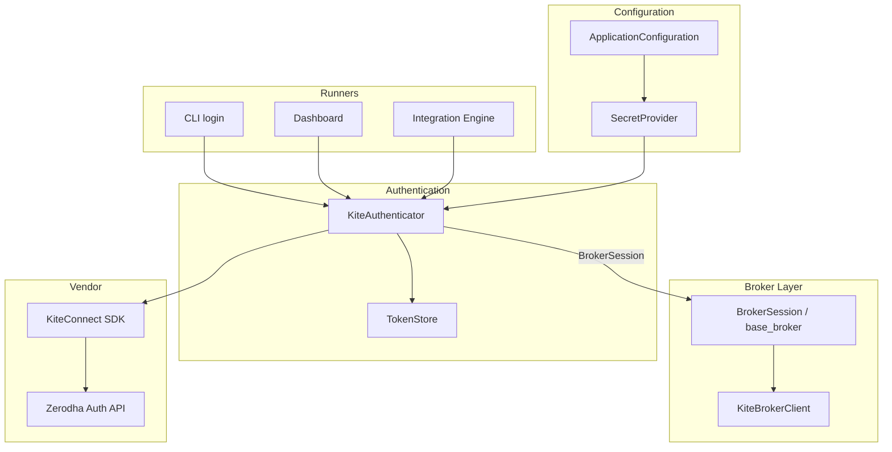
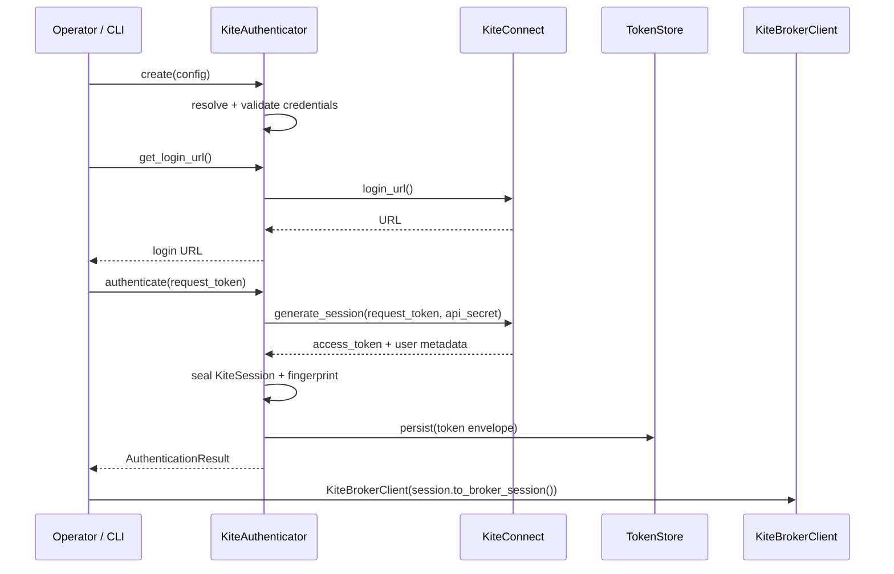
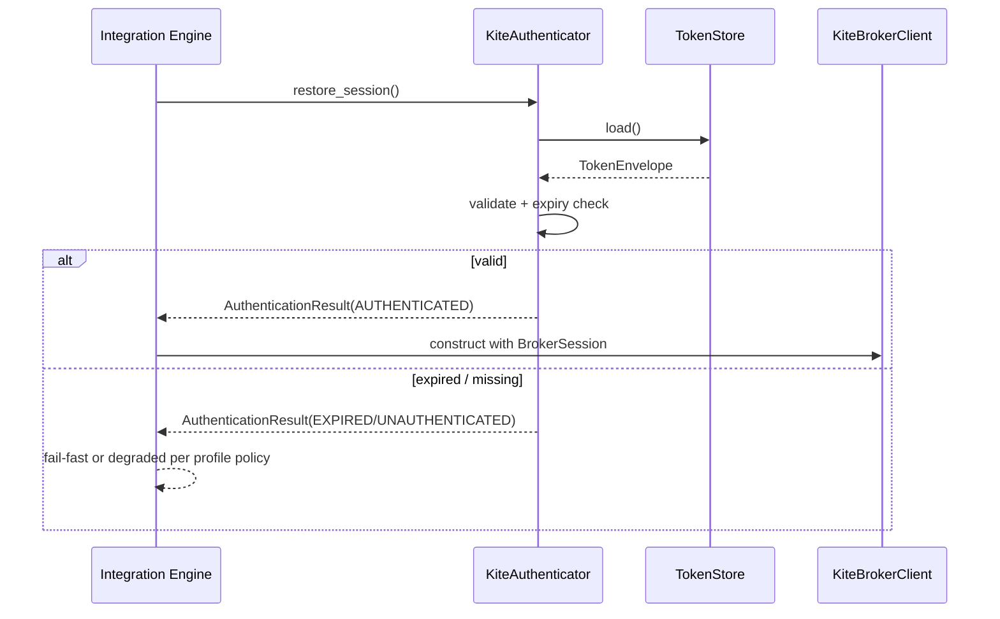

# Kite Authentication — Software Engineering Specification

| Field | Value |
|---|---|
| **Module** | `broker/kite_authentication.py` |
| **Document version** | 1.0.0 |
| **Status** | Draft — ready for implementation |
| **Owner** | THETA AI TRADER Core Platform |
| **Last updated** | 2026-08-04 |

---

## 1. Purpose

`broker/kite_authentication.py` defines the **sole authentication and session-lifecycle component** for Zerodha Kite Connect within THETA AI TRADER v1.0.

The module answers a question that no other frozen module answers: *"How do we securely obtain, validate, persist, restore, expire-detect, and revoke a Kite Connect access token — and hand a broker-neutral `BrokerSession` to the rest of the platform — without any trading, market-data, or WebSocket logic leaking into the authentication boundary?"*

It is the **only** module permitted to:

1. Load Kite API credentials from environment / secret providers for authentication purposes.
2. Exchange a Kite `request_token` for an `access_token` via the official Kite Connect session API.
3. Persist and restore access tokens under a controlled, auditable storage contract.
4. Construct the immutable `KiteSession` and the injectable `BrokerSession` consumed by `KiteBrokerClient`.
5. Detect session expiry (clock-based hints and authoritative auth probe signals).
6. Support logout / session invalidation and audit metadata emission.

It is **not** a broker transport. It is **not** a market-data streamer. It is **not** an order gateway. It is **not** a strategy, risk, position, or portfolio component. It is **authentication plumbing** — a deterministic, thread-safe, secret-isolating session factory that replaces the legacy interactive `kite_login.py` script with an institutional-grade API.

### 1.1 The gap this module fills

Three frozen modules deliberately refuse to perform OAuth / token generation:

| Frozen module | Explicit non-responsibility |
|---|---|
| `broker/base_broker.py` | NR2 / NR3 — no env loading; no OAuth / login / token refresh orchestration. Receives already-built `BrokerSession`. |
| `broker/zerodha/kite_broker.py` | NR1 — no `generate_session()`; NR2 — no `.env` loading. Credentials arrive only via injected `BrokerSession`. |
| `config/application_configuration.py` | NR4 — never connects to broker APIs; produces secret *references*, not live tokens. |
| `system/integration_engine.py` | Resolves secrets into a `BrokerSession` shell for mock/recording or pre-supplied tokens; does **not** own Kite OAuth exchange or daily login UX. |

Nobody in the frozen architecture currently owns:

- Interactive or headless Kite login URL generation.
- `request_token` → `access_token` exchange.
- Secure token persistence with fingerprinting and audit trails.
- Session restoration across process restarts.
- Clock-skew-aware expiry detection before `KiteBrokerClient.connect()`.
- Logout / revoke semantics for operators.

`broker/kite_authentication.py` closes this gap. It is the successor to legacy `kite_login.py` and the only sanctioned producer of Kite-authenticated `BrokerSession` objects for Live and Paper modes that use Zerodha Kite.

### 1.2 Pipeline placement

```text
[Operator / CLI / Dashboard / Cron / Integration Engine bootstrap]
              │
              ▼
[config/application_configuration.py]
    BrokerConfiguration + SecretReferences (api_key / api_secret refs)
              │
              ▼
[broker/kite_authentication.py]                    ← THIS MODULE
    ┌──────────────────────────────────────────────────────────────┐
    │ AUTHENTICATION PIPELINE                                       │
    │   load credentials (env / SecretProvider / explicit inject)  │
    │   validate api_key + api_secret                              │
    │   (optional) build login URL for interactive flow            │
    │   exchange request_token → access_token                      │
    │   validate token + optional profile probe                    │
    │   compute session fingerprint + expiry hint                  │
    │   persist token (secure store)                               │
    │   seal immutable KiteSession + AuthenticationResult          │
    │   project BrokerSession for KiteBrokerClient                 │
    └──────────────────────────────────────────────────────────────┘
              │
              ▼
[broker/zerodha/kite_broker.py]
    KiteBrokerClient(session=BrokerSession, policy=...)
    connect() / REST / WebSocket — transport only
              │
              ▼
[system/integration_engine.py] → SystemOrchestrator → engines
```

### 1.3 Architecture freeze note

The platform architecture is **FROZEN** for v1.0. This module does **not**:

- Replace `BaseBrokerClient` or `KiteBrokerClient`.
- Import or wrap `KiteTicker` / WebSocket streaming.
- Place, modify, or cancel orders.
- Fetch instruments, quotes, LTP, OHLC, historical candles, positions, margins, or holdings for trading use (optional auth-time `profile()` probe is permitted solely as a credential validity check — see §7.4).
- Evaluate strategies, compute Greeks, size risk, manage positions, or publish trading events.
- Become a second configuration loader — it consumes credential material and optional `KiteAuthenticationConfig`; Application Configuration remains the sole bootstrap config authority for the rest of the platform.
- Bypass Integration Engine — runners may call authentication directly for login UX, then inject the resulting `BrokerSession` into Integration Engine via `EngineOverrides.broker_client` construction or secret store updates.

### 1.4 Goals

1. Provide a **single authentication component** for Zerodha Kite Connect across Development, Paper, and Live profiles.
2. Validate **API key** and **API secret** before any network call.
3. Support **request token exchange** and **access token generation**.
4. Support **session persistence** and **session restoration** with secure storage contracts.
5. Detect **session expiry** with clock-skew tolerance and authoritative failure mapping.
6. Support **logout** / session invalidation without cascading into broker transport state.
7. Enforce **secret isolation** — no hardcoded credentials; no secrets in logs, exceptions, health reports, or serialized public payloads.
8. Produce **immutable** `KiteSession`, `AuthenticationResult`, `SessionMetadata`, and `AuthenticationHealthReport`.
9. Project a broker-neutral `BrokerSession` compatible with `broker/base_broker.py` and `KiteBrokerClient`.
10. Be **thread-safe** for concurrent health/status reads during authentication operations.
11. Be **deterministic** — identical inputs + clock produce identical fingerprints and validation outcomes.
12. Expose a stable **public API** for CLI, Dashboard, Integration Engine, and tests.
13. Provide **JSON serialization** with versioned schema and forward compatibility.
14. Reach ≥ 95% unit test coverage on `broker/kite_authentication.py`.
15. Use Google-style docstrings on all public types and methods.
16. **Never** stream market data, place orders, evaluate strategies, calculate risk, manage positions, or open WebSockets.

### 1.5 Success criteria

- `KiteAuthenticator.authenticate(...)` returns `AuthenticationResult` with `status=AUTHENTICATED` and a sealed `KiteSession` when exchange succeeds.
- `KiteSession.to_broker_session()` produces a `BrokerSession` that `KiteBrokerClient` accepts without further credential mutation.
- Restoring a persisted session yields the same `session_fingerprint` when token material is unchanged.
- Expired sessions are rejected before any attempt to construct a live broker client for Live Trading.
- No test, log line, health report, or serialized payload contains raw `api_secret` or `access_token` values.
- Unit coverage ≥ 95% on `broker/kite_authentication.py`.
- Grep of the module finds zero references to `KiteTicker`, `place_order`, strategy scoring, Greeks, margin math, or position management.

### 1.6 Relationship to other modules

| Module | Relationship |
|---|---|
| `broker/base_broker.py` | **Contract consumer / producer.** Authentication produces `BrokerSession`, `BrokerId.KITE`, and uses `SessionState` vocabulary compatibility. Never subclasses `BaseBrokerClient`. |
| `broker/zerodha/kite_broker.py` | **Primary downstream consumer.** Receives `BrokerSession` from authentication; owns all REST/WS transport. Authentication never calls `KiteBrokerClient` methods except optional post-auth construction helpers that remain outside the hot path. |
| `config/application_configuration.py` | **Upstream settings / secret refs.** Authentication may resolve credentials via the same `SecretProvider` chain or explicit env keys (`THETA_BROKER_*` / legacy `KITE_*` aliases — see §8). Does not re-implement Application Configuration merge. |
| `system/integration_engine.py` | **Consumer.** May call authentication during `BROKER_SESSION_RESOLUTION` for Live Kite bootstraps, or accept a pre-authenticated `BrokerSession` / broker override. |
| `system/system_orchestrator.py` | **Indirect consumer.** Never imports this module; receives broker client already authenticated by Integration Engine. |
| Legacy `kite_login.py` | **Replaced.** Interactive CLI may wrap `KiteAuthenticator` public API; legacy script becomes a thin deprecated shim. |

### 1.7 Distinction from Kite Broker

| Concern | Kite Authentication | Kite Broker |
|---|---|---|
| OAuth / `generate_session` | **Core responsibility** | Forbidden (NR1) |
| Env / secret loading for login | Allowed under auth config | Forbidden (NR2) |
| Token persistence | **Core responsibility** | Forbidden (NR10) |
| REST market/order APIs | Forbidden | Core responsibility |
| WebSocket ticks | Forbidden | Core responsibility |
| Output | `KiteSession` / `BrokerSession` | Opaque market mappings + DTOs |
| SDK import | May import `KiteConnect` for auth-only methods | Owns `KiteConnect` + `KiteTicker` for transport |

**Rule BOUNDARY-001:** Authentication may use `KiteConnect` solely for `login_url()`, `generate_session()`, optional `invalidate_access_token()`, and optional `profile()` probe. It must never call instruments/quotes/orders/positions/margins/historical APIs.

---

## 2. Responsibilities

`broker/kite_authentication.py` **is responsible for**:

| # | Responsibility | Description |
|---|---|---|
| R1 | **Credential acquisition** | Resolve `api_key` and `api_secret` from explicit injection, environment variables, or `SecretProvider`. |
| R2 | **API key validation** | Reject empty, whitespace-only, or structurally invalid API keys before network calls. |
| R3 | **API secret validation** | Reject empty or whitespace-only API secrets before token exchange. |
| R4 | **Login URL generation** | Produce Kite Connect login URL for interactive operator flows. |
| R5 | **Request token exchange** | Exchange `request_token` + `api_secret` for `access_token` via Kite session API. |
| R6 | **Access token generation** | Normalize exchange response into immutable session material. |
| R7 | **Session construction** | Build frozen `KiteSession` with metadata, fingerprint, and expiry hint. |
| R8 | **BrokerSession projection** | Map `KiteSession` → `BrokerSession` for `KiteBrokerClient`. |
| R9 | **Session persistence** | Write access token and non-secret metadata to a secure store under policy. |
| R10 | **Session restoration** | Reload persisted token material and rebuild `KiteSession` after validation. |
| R11 | **Session expiry detection** | Evaluate `expires_at` with clock-skew tolerance; map probe failures to expired status. |
| R12 | **Logout / invalidation** | Clear persisted token; optionally invalidate remote access token; transition status to `LOGGED_OUT`. |
| R13 | **Token validation** | Validate restored / injected access tokens for non-emptiness and optional profile probe. |
| R14 | **Session fingerprint** | Compute deterministic fingerprint over non-secret session identity fields. |
| R15 | **Audit metadata** | Attach environment profile, runner kind, correlation ids, and redacted diagnostics. |
| R16 | **Health reporting** | Expose `AuthenticationHealthReport` without secret leakage. |
| R17 | **Error taxonomy** | Raise typed auth errors with stable `KITE_AUTH.*` codes. |
| R18 | **Serialization** | Versioned JSON for public immutable models (no secrets). |
| R19 | **Thread safety** | Protect mutable authenticator state with locks; return immutable snapshots. |
| R20 | **Environment mode policy** | Apply Development / Paper / Live behavioural differences without redesigning platform profiles. |

---

## 3. Non-Responsibilities

`broker/kite_authentication.py` **must not**:

| # | Non-responsibility | Rationale |
|---|---|---|
| NR1 | **Stream market data** | `MarketDataEngine` + `KiteBrokerClient` WebSocket exclusively. |
| NR2 | **Place / modify / cancel orders** | `OrderManager` + broker transport. |
| NR3 | **Evaluate strategies** | Strategy Evaluation Engine. |
| NR4 | **Calculate risk** | Risk Engine. |
| NR5 | **Manage positions / portfolio** | Position / Portfolio Managers. |
| NR6 | **Connect WebSocket / KiteTicker** | Kite Broker WebSocket gateway. |
| NR7 | **Fetch instruments / quotes / LTP / OHLC / historical** | Broker transport APIs (except optional auth-time profile probe). |
| NR8 | **Fetch positions / margins / holdings / funds** | Broker transport APIs. |
| NR9 | **Coordinate trading cycles** | System Orchestrator. |
| NR10 | **Compose engines / EngineRegistry** | Integration Engine. |
| NR11 | **Parse ApplicationConfiguration files** | Application Configuration is sole file/env merge owner for platform config. Authentication may read credential env keys and accept injected config only. |
| NR12 | **Hardcode API keys, secrets, or tokens** | Absolute prohibition. |
| NR13 | **Log or serialize raw secrets** | Security invariant SEC-001. |
| NR14 | **Auto-refresh expired tokens without operator action** | Kite daily login requires a fresh request token; silent refresh is impossible without browser OAuth. Restoration of a *persisted still-valid* token is allowed; minting a new token without `request_token` is not. |
| NR15 | **Own broker reconnect policy** | Kite Broker / base client reconnect. |
| NR16 | **Publish trading Event Bus topics** | May optionally emit `auth.*` observability events if an `EventBus` is injected; never `market.*` / `order.*` / `pipeline.*`. |

---

## 4. Architecture

### 4.1 Component model

```text
┌─────────────────────────────────────────────────────────────────────────┐
│                        KiteAuthenticator                                 │
│                   (mutable service — composition root)                   │
├─────────────────────────────────────────────────────────────────────────┤
│ CredentialResolver │ SessionExchange │ TokenStore │ ExpiryPolicy         │
│  - env / provider  │  - login_url    │  - persist │  - skew             │
│  - validation      │  - exchange     │  - restore │  - IST day boundary │
│                    │  - invalidate   │  - clear   │  - probe mapping    │
├────────────────────┴─────────────────┴────────────┴──────────────────────┤
│ FingerprintEngine │ AuditRecorder │ HealthAggregator │ Serializer        │
└─────────────────────────────────────────────────────────────────────────┘
                              │
                              ▼
              immutable KiteSession / AuthenticationResult
                              │
                              ▼
                     BrokerSession (base_broker)
                              │
                              ▼
                      KiteBrokerClient
```

### 4.2 Design principles

| Principle | Application |
|---|---|
| **Secret isolation** | Raw secrets exist only in private scopes and store backends; never on public frozen models except redacted presence flags. |
| **Immutable outward boundary** | All public result types are `frozen=True` dataclasses. |
| **Fail closed** | Invalid credentials or expired sessions never produce a usable `BrokerSession` for Live. |
| **Determinism** | Fingerprints and validation outcomes are stable under a fixed clock and identical inputs. |
| **Thin SDK usage** | Only auth-related `KiteConnect` methods. |
| **Injected dependencies** | Clock, store, secret provider, and SDK factory are injectable for tests. |
| **No trading side effects** | Authentication never mutates orders, positions, or market subscriptions. |

### 4.3 Dependency direction

```text
CLI / Dashboard / Integration Engine
        │
        ▼
broker/kite_authentication.py
        │
        ├──► config.application_configuration (SecretProvider / EnvironmentProfile types only)
        ├──► broker.base_broker (BrokerSession, BrokerId)
        └──► kiteconnect.KiteConnect (auth methods only; private)

broker/zerodha/kite_broker.py  ◄── BrokerSession only (no reverse import)
```

**Rule DEP-001:** `kite_broker.py` must never import `kite_authentication.py`. Authentication depends downward onto `base_broker`; broker transport remains independent of auth orchestration.

### 4.4 Module layout (v1)

| Path | Visibility | Description |
|---|---|---|
| `broker/kite_authentication.py` | Public | All public types, `KiteAuthenticator`, stores interfaces, serializers |
| Optional internals (same file in v1) | Private | `_SdkSessionGateway`, `_FileTokenStore`, `_Fingerprint`, helpers |

v1 ships as a **single public module** unless size forces private helpers into `broker/_kite_auth_*.py`. No WebSocket or REST market modules are introduced.

---

## 5. Dependency Diagram



### 5.1 Bootstrap sequence (interactive login)



### 5.2 Bootstrap sequence (restore persisted session)



---

## 6. Data Model

All outward-facing result types are **immutable** (`frozen=True`) unless explicitly noted. `KiteAuthenticator` is the only mutable service class.

### 6.1 Required output models

#### 6.1.1 `AuthenticationStatus`

| Value | Description |
|---|---|
| `UNAUTHENTICATED` | No usable session; credentials may or may not be loaded. |
| `CREDENTIALS_LOADED` | API key/secret validated locally; no access token yet. |
| `AWAITING_REQUEST_TOKEN` | Login URL issued; waiting for operator `request_token`. |
| `EXCHANGING` | Token exchange in progress. |
| `AUTHENTICATED` | Valid access token present; session sealed. |
| `EXPIRED` | Access token known/expired or probe declared invalid. |
| `REVOKED` | Token invalidated by logout or remote revoke. |
| `LOGGED_OUT` | Local session cleared after logout. |
| `FAILED` | Authentication attempt failed; see error records. |
| `DEGRADED` | Session usable under non-Live policy with warnings (e.g., missing expiry hint in Development). |

#### 6.1.2 `KiteSession`

Immutable authenticated session artifact.

| Field | Type | Description |
|---|---|---|
| `session_id` | `str` | UUID4 correlation id (not the access token). |
| `broker_id` | `BrokerId` | Always `BrokerId.KITE` for this module. |
| `api_key` | `str` | Non-secret public API key (Kite keys are identifiers; still treated as sensitive in logs — redacted at INFO). |
| `access_token` | `str` | Secret access token — **present only on in-process `KiteSession`**; excluded from serialization (§16). |
| `user_id` | `str \| None` | Kite user id when known from exchange / profile. |
| `user_name` | `str \| None` | Display name when known. |
| `authenticated_at` | `datetime` | Timezone-aware issuance timestamp. |
| `expires_at` | `datetime \| None` | Timezone-aware expiry hint (typically next 06:00 IST boundary). |
| `login_time` | `datetime \| None` | Exchange response login time if provided. |
| `exchange_metadata` | `Mapping[str, str]` | Redacted non-secret exchange fields (e.g., `broker`, `email` hashed/omitted). |
| `session_fingerprint` | `str` | Deterministic fingerprint (§15). |
| `environment_profile` | `EnvironmentProfile` | Profile under which session was created. |
| `metadata` | `Mapping[str, str]` | Free-form audit metadata (no secrets). |

**Rule KS-001:** `KiteSession` may hold `access_token` in memory for projection into `BrokerSession`. Public serializers **must omit** `access_token` and `api_secret` (secret is never a `KiteSession` field).

**Rule KS-002:** `KiteSession.to_broker_session() -> BrokerSession` returns:

```python
BrokerSession(
    broker_id=BrokerId.KITE,
    session_id=self.session_id,
    authenticated_at=self.authenticated_at,
    expires_at=self.expires_at,
    credentials=MappingProxyType({
        "api_key": self.api_key,
        "access_token": self.access_token,
    }),
)
```

#### 6.1.3 `AuthenticationResult`

Immutable outcome of an authenticate / restore / logout operation.

| Field | Type | Description |
|---|---|---|
| `result_id` | `str` | UUID4 per operation. |
| `status` | `AuthenticationStatus` | Outcome status. |
| `session` | `KiteSession \| None` | Present when status is `AUTHENTICATED` or `DEGRADED` with usable token. |
| `broker_session` | `BrokerSession \| None` | Projected session when usable; else `None`. |
| `metadata` | `SessionMetadata` | Audit / diagnostic metadata. |
| `warnings` | `tuple[AuthenticationWarningRecord, ...]` | Non-fatal issues. |
| `errors` | `tuple[AuthenticationErrorRecord, ...]` | Structured errors. |
| `started_at` | `datetime` | Operation start. |
| `completed_at` | `datetime` | Operation end. |
| `duration_ms` | `float` | Wall duration. |
| `correlation_id` | `str` | Caller/bootstrap correlation. |

#### 6.1.4 `SessionMetadata`

| Field | Type | Description |
|---|---|---|
| `environment_profile` | `EnvironmentProfile` | Development / Paper / Production. |
| `runner_kind` | `str` | Free-form runner label (`cli`, `dashboard`, `integration`, `test`). |
| `credential_source` | `CredentialSource` | How credentials were resolved. |
| `token_source` | `TokenSource` | `EXCHANGE` / `RESTORED` / `INJECTED` / `NONE`. |
| `persistence_backend` | `str \| None` | Store backend id when used. |
| `login_url_issued` | `bool` | Whether a login URL was generated in this flow. |
| `profile_probe_performed` | `bool` | Whether auth-time profile probe ran. |
| `clock_skew_seconds` | `float` | Configured skew allowance applied. |
| `session_fingerprint` | `str \| None` | Fingerprint when session sealed. |
| `audit_tags` | `Mapping[str, str]` | Extra redacted tags. |

#### 6.1.5 `AuthenticationHealthReport`

| Field | Type | Description |
|---|---|---|
| `report_id` | `str` | UUID4. |
| `as_of` | `datetime` | Snapshot time. |
| `status` | `AuthenticationStatus` | Current authenticator status. |
| `overall_health` | `AuthHealthStatus` | `HEALTHY` / `DEGRADED` / `UNHEALTHY` / `UNKNOWN`. |
| `has_api_key` | `bool` | Presence flag only. |
| `has_api_secret` | `bool` | Presence flag only. |
| `has_access_token` | `bool` | Presence flag only. |
| `session_id` | `str \| None` | Current session id if any. |
| `expires_at` | `datetime \| None` | Expiry hint if known. |
| `seconds_to_expiry` | `float \| None` | Computed with clock; `None` if unknown. |
| `is_expired` | `bool` | Expiry evaluation result. |
| `persistence_available` | `bool` | Store reachable. |
| `last_error_code` | `str \| None` | Last auth error code. |
| `last_error_message` | `str \| None` | Redacted message. |
| `session_fingerprint` | `str \| None` | Current fingerprint. |
| `issues` | `tuple[AuthenticationHealthIssue, ...]` | Structured issues. |
| `metadata` | `Mapping[str, str]` | Free-form. |

### 6.2 Supporting enumerations

#### 6.2.1 `CredentialSource`

| Value | Description |
|---|---|
| `EXPLICIT` | Passed into constructor / method arguments. |
| `ENVIRONMENT` | Loaded from process environment. |
| `SECRET_PROVIDER` | Resolved via Application Configuration `SecretProvider`. |
| `MIXED` | Combination of sources. |
| `UNAVAILABLE` | Not resolved. |

#### 6.2.2 `TokenSource`

| Value | Description |
|---|---|
| `NONE` | No token. |
| `EXCHANGE` | Freshly exchanged from request token. |
| `RESTORED` | Loaded from persistence. |
| `INJECTED` | Caller-supplied access token (tests / operators). |

#### 6.2.3 `AuthHealthStatus`

| Value | Description |
|---|---|
| `HEALTHY` | Authenticated and not expired. |
| `DEGRADED` | Usable with warnings, or Development partial state. |
| `UNHEALTHY` | Expired, revoked, failed, or missing required Live credentials. |
| `UNKNOWN` | Not yet evaluated. |

#### 6.2.4 `TokenPersistenceMode`

| Value | Description |
|---|---|
| `DISABLED` | No persistence (tests / ephemeral CLI). |
| `FILE` | Encrypted or permission-restricted file store. |
| `ENV_FILE` | Write access token into `.env` key (Development convenience only; discouraged for Production). |
| `CUSTOM` | Caller-supplied `TokenStore` implementation. |

### 6.3 Configuration types

#### 6.3.1 `KiteAuthenticationConfig` (immutable)

| Field | Type | Default | Description |
|---|---|---|---|
| `environment_profile` | `EnvironmentProfile` | `DEVELOPMENT` | Mode policy selector. |
| `api_key_env` | `str` | `"THETA_BROKER_API_KEY"` | Primary env key for API key. |
| `api_secret_env` | `str` | `"THETA_BROKER_API_SECRET"` | Primary env key for API secret. |
| `access_token_env` | `str` | `"THETA_BROKER_ACCESS_TOKEN"` | Env key for restored/injected token. |
| `legacy_api_key_env` | `str` | `"KITE_API_KEY"` | Legacy alias (Development). |
| `legacy_api_secret_env` | `str` | `"KITE_API_SECRET"` | Legacy alias (Development). |
| `legacy_access_token_env` | `str` | `"KITE_ACCESS_TOKEN"` | Legacy alias (Development). |
| `persistence_mode` | `TokenPersistenceMode` | `FILE` in Live/Paper, `ENV_FILE` allowed in Development | Persistence policy. |
| `token_store_path` | `str` | `"data/auth/kite_session.json"` | File store path when `FILE`. |
| `env_file_path` | `str` | `".env"` | Target for `ENV_FILE` mode. |
| `require_profile_probe` | `bool` | `True` in Production; `False` in Development | Whether exchange/restore must probe profile. |
| `fail_closed_on_expiry` | `bool` | `True` | Reject expired sessions for `to_broker_session()`. |
| `clock_skew_seconds` | `float` | `30.0` | Expiry tolerance. |
| `default_expiry_policy` | `ExpiryPolicyKind` | `NEXT_0600_IST` | How to compute expiry hint when SDK omits it. |
| `allow_missing_secret_in_restore` | `bool` | `True` | Restore needs access token + api_key; secret only for new exchange. |
| `allow_env_file_persistence` | `bool` | `False` in Production | Hard gate against `.env` writes in Live. |
| `max_request_token_age_seconds` | `float` | `300.0` | Advisory max age if token issuance time known. |
| `deterministic_fingerprint` | `bool` | `True` | Stable fingerprinting. |
| `publish_auth_events` | `bool` | `False` | Optional EventBus publications. |
| `metadata` | `Mapping[str, str]` | `{}` | Free-form. |

#### 6.3.2 `ExpiryPolicyKind`

| Value | Description |
|---|---|
| `NONE` | Leave `expires_at=None`. |
| `NEXT_0600_IST` | Next calendar 06:00 Asia/Kolkata after `authenticated_at`. |
| `FIXED_HOURS` | `authenticated_at + fixed_ttl_hours`. |
| `EXPLICIT` | Caller-supplied expiry only. |

### 6.4 Internal / store types

#### 6.4.1 `TokenEnvelope` (immutable; store format)

Persisted representation. **Never** includes `api_secret`.

| Field | Type | Description |
|---|---|---|
| `schema_version` | `str` | Persistence schema version (`1.0.0`). |
| `session_id` | `str` | Session id. |
| `api_key` | `str` | API key. |
| `access_token` | `str` | Access token (disk/secret store only; never logged). |
| `user_id` | `str \| None` | Optional. |
| `user_name` | `str \| None` | Optional. |
| `authenticated_at` | `datetime` | Issuance. |
| `expires_at` | `datetime \| None` | Expiry hint. |
| `session_fingerprint` | `str` | Fingerprint at persist time. |
| `environment_profile` | `str` | Profile value. |
| `checksum` | `str` | Integrity checksum over canonical payload. |

#### 6.4.2 Warning / error / health issue records

```text
AuthenticationWarningRecord(code, message, field=None)
AuthenticationErrorRecord(code, message, field=None)
AuthenticationHealthIssue(issue_code, severity, message, field=None)
```

### 6.5 Global invariants

- `INV-A-001`: No public method returns `api_secret`.
- `INV-A-002`: Serialized public models never include `access_token` or `api_secret`.
- `INV-A-003`: All datetimes are timezone-aware.
- `INV-A-004`: `broker_id` on every `KiteSession` / projected `BrokerSession` is `BrokerId.KITE`.
- `INV-A-005`: `session_id` is non-empty UUID string.
- `INV-A-006`: `session_fingerprint` excludes raw token bytes; includes token *hash* only.
- `INV-A-007`: Production profile forbids `ENV_FILE` persistence (`allow_env_file_persistence=False`).
- `INV-A-008`: `AuthenticationResult.broker_session` is `None` unless status ∈ {`AUTHENTICATED`, `DEGRADED`} and token non-empty.

---

## 7. Authentication Pipeline

### 7.1 Pipeline overview

```text
CREDENTIAL_RESOLUTION → CREDENTIAL_VALIDATION → (LOGIN_URL) → TOKEN_EXCHANGE
    → TOKEN_VALIDATION → EXPIRY_ASSIGNMENT → FINGERPRINT → PERSIST
    → SESSION_SEAL → BROKER_SESSION_PROJECTION → RESULT_ASSEMBLY
```

Restore path:

```text
STORE_LOAD → ENVELOPE_VALIDATE → TOKEN_VALIDATION → EXPIRY_CHECK
    → FINGERPRINT_VERIFY → SESSION_SEAL → RESULT_ASSEMBLY
```

### 7.2 Stage specifications

#### Stage A: `CREDENTIAL_RESOLUTION`

| Rule | Action | On failure |
|---|---|---|
| AUTH-001 | Prefer explicit `api_key` / `api_secret` arguments when provided. | — |
| AUTH-002 | Else resolve via `SecretProvider` using Application Configuration refs when injected. | `KITE_AUTH.CREDENTIAL.SECRET_UNRESOLVED` |
| AUTH-003 | Else read `THETA_BROKER_API_KEY` / `THETA_BROKER_API_SECRET`. | — |
| AUTH-004 | In Development, fall back to legacy `KITE_API_KEY` / `KITE_API_SECRET`. | — |
| AUTH-005 | Never invent credentials; missing required values fail closed. | `KITE_AUTH.CREDENTIAL.MISSING` |

#### Stage B: `CREDENTIAL_VALIDATION`

| Rule | Action | On failure |
|---|---|---|
| AUTH-010 | `api_key` must be non-empty stripped string. | `InvalidCredentialError` / `KITE_AUTH.CREDENTIAL.INVALID_API_KEY` |
| AUTH-011 | `api_secret` must be non-empty stripped string for exchange flows. | `InvalidCredentialError` / `KITE_AUTH.CREDENTIAL.INVALID_API_SECRET` |
| AUTH-012 | Reject credentials that equal well-known placeholders (`CHANGE_ME`, `your_api_key`). | `KITE_AUTH.CREDENTIAL.PLACEHOLDER` |
| AUTH-013 | Optional length bounds: api_key ≥ 6, api_secret ≥ 6 (configurable). | `KITE_AUTH.CREDENTIAL.INVALID` |

#### Stage C: `LOGIN_URL` (optional interactive)

| Rule | Action |
|---|---|
| AUTH-020 | `get_login_url()` constructs SDK client with api_key and returns `login_url()`. |
| AUTH-021 | Transitions status to `AWAITING_REQUEST_TOKEN`. |
| AUTH-022 | Does not persist anything. |

#### Stage D: `TOKEN_EXCHANGE`

| Rule | Action | On failure |
|---|---|---|
| AUTH-030 | Require validated api_key, api_secret, non-empty `request_token`. | `InvalidCredentialError` |
| AUTH-031 | Call SDK `generate_session(request_token, api_secret=...)`. | `AuthenticationError` / `KITE_AUTH.EXCHANGE.FAILED` |
| AUTH-032 | Extract `access_token` (required), optional user fields. | `KITE_AUTH.EXCHANGE.MALFORMED_RESPONSE` |
| AUTH-033 | Never log request_token or access_token. | — |

#### Stage E: `TOKEN_VALIDATION`

| Rule | Action | On failure |
|---|---|---|
| AUTH-040 | Access token non-empty stripped string. | `InvalidCredentialError` |
| AUTH-041 | If `require_profile_probe`, call SDK `profile()` after `set_access_token`. | Map to `SessionExpiredError` or `AuthenticationError` |
| AUTH-042 | Profile probe may populate `user_id` / `user_name` if absent. | Warnings only on optional enrichment failure when probe not required |

#### Stage F: `EXPIRY_ASSIGNMENT`

| Rule | Action |
|---|---|
| AUTH-050 | If exchange provides usable expiry, prefer it. |
| AUTH-051 | Else apply `default_expiry_policy` (typically next 06:00 IST). |
| AUTH-052 | Ensure timezone-aware `expires_at`. |

#### Stage G: `FINGERPRINT`

| Rule | Action |
|---|---|
| AUTH-060 | Compute `session_fingerprint` per §15. |
| AUTH-061 | Fingerprint includes sha256(access_token), never plaintext token. |

#### Stage H: `PERSIST`

| Rule | Action | On failure |
|---|---|---|
| AUTH-070 | Skip if `persistence_mode=DISABLED`. | — |
| AUTH-071 | Write `TokenEnvelope` via `TokenStore`. | `TokenPersistenceError` |
| AUTH-072 | Production forbids `ENV_FILE`. | `KITE_AUTH.PERSIST.MODE_FORBIDDEN` |

#### Stage I: `SESSION_SEAL` / projection

| Rule | Action |
|---|---|
| AUTH-080 | Build frozen `KiteSession`. |
| AUTH-081 | Project `BrokerSession` via `to_broker_session()`. |
| AUTH-082 | Assemble `AuthenticationResult` with metadata and timings. |

### 7.3 Code sketch — authenticate

```python
class KiteAuthenticator:
    """Secure Kite Connect authentication and session lifecycle service.

    Resolves credentials, exchanges request tokens for access tokens,
    persists and restores sessions, detects expiry, and projects
    BrokerSession objects for KiteBrokerClient. Never streams market
    data, places orders, or opens WebSockets.

    Args:
        config: Authentication policy and environment settings.
        secret_provider: Optional SecretProvider for credential resolution.
        token_store: Optional TokenStore override.
        clock: Injectable clock for deterministic timestamps.
        sdk_factory: Injectable KiteConnect factory for tests.
    """

    def authenticate(
        self,
        request_token: str,
        *,
        correlation_id: str | None = None,
        metadata: Mapping[str, str] | None = None,
    ) -> AuthenticationResult:
        """Exchange request_token for access_token and seal a session."""
```

### 7.4 Optional profile probe rules

| Profile | Probe required? | Failure behaviour |
|---|---|---|
| `DEVELOPMENT` | No (default) | Warning; may still seal session if token non-empty |
| `PAPER` | Recommended Yes when using real Kite tokens | Error → `FAILED` |
| `PRODUCTION` | Yes | Error → `FAILED` / `EXPIRED` |

**Rule PROBE-001:** Profile probe uses `KiteConnect.profile()` only. No other REST endpoints.

**Rule PROBE-002:** Probe responses are not retained beyond user_id/user_name extraction and redacted metadata.

---

## 8. Environment Support

### 8.1 Mode matrix

| Behaviour | Development | Paper | Live (Production) |
|---|---|---|---|
| Legacy `KITE_*` env aliases | Allowed | Allowed | Forbidden (use `THETA_BROKER_*`) |
| `ENV_FILE` persistence | Allowed if configured | Discouraged | **Forbidden** |
| `FILE` persistence | Allowed | Allowed | Required unless custom store |
| Missing secrets at construction | Soft fail → `UNAUTHENTICATED` | Error on authenticate | Error on authenticate |
| Profile probe | Optional | Recommended | Required |
| Fail closed on expiry | Configurable (default True) | True | True |
| Interactive login URL | Primary path | Supported | Supported |
| Restore without api_secret | Allowed | Allowed | Allowed |
| Placeholder credential rejection | Warning | Error | Error |

### 8.2 Environment variable catalog

| Variable | Purpose |
|---|---|
| `THETA_BROKER_API_KEY` | Preferred API key |
| `THETA_BROKER_API_SECRET` | Preferred API secret |
| `THETA_BROKER_ACCESS_TOKEN` | Preferred access token for restore |
| `KITE_API_KEY` | Legacy alias (Development) |
| `KITE_API_SECRET` | Legacy alias (Development) |
| `KITE_ACCESS_TOKEN` | Legacy alias (Development) |
| `THETA_KITE_AUTH_STORE_PATH` | Override token store path |
| `THETA_KITE_AUTH_PERSISTENCE_MODE` | Override persistence mode |

### 8.3 Credential resolution order

1. Explicit constructor / method arguments.
2. Injected `SecretProvider` refs (`broker.api_key`, `broker.api_secret`, `broker.access_token`).
3. `THETA_BROKER_*` environment variables.
4. Legacy `KITE_*` (Development / Paper only).

**Rule ENV-001:** Resolution never writes secrets into `KiteAuthenticationConfig` fields.

**Rule ENV-002:** Access token env is used for restore/injection only — never as a substitute for api_secret during exchange.

---

## 9. Security

### 9.1 Secret isolation rules

| Rule ID | Rule |
|---|---|
| `SEC-001` | Never hardcode credentials in source, tests fixtures committed to git, or docs examples with real values. |
| `SEC-002` | Never log `api_secret`, `access_token`, `request_token`, or Authorization headers. |
| `SEC-003` | Exception messages must redact token-like substrings (≥ 8 contiguous alnum) when echoing vendor errors. |
| `SEC-004` | `AuthenticationHealthReport` and public serializers expose presence booleans only. |
| `SEC-005` | File token stores must use user-only permissions (`0600`) on POSIX when creating files. |
| `SEC-006` | `ENV_FILE` writes must not print token values to stdout. |
| `SEC-007` | In-memory `KiteSession.access_token` must not appear in `repr()` / `__str__` overrides (custom `__repr__` redacts). |
| `SEC-008` | Checksums and fingerprints use SHA-256 over canonical JSON; never reversible encryption of fingerprint. |
| `SEC-009` | Logout clears in-memory token material and store contents; best-effort remote invalidate. |
| `SEC-010` | Tests use `InlineSecretProvider` / fake SDK; never live credentials in CI. |

### 9.2 Redaction helper

```python
def redact_secret(value: str | None) -> str:
    """Return a stable redaction marker for logs and errors."""
    if not value:
        return "<missing>"
    return "<redacted>"
```

### 9.3 Token store security

| Backend | Requirements |
|---|---|
| `FILE` | JSON envelope at configured path; mode `0600`; optional directory `0700`; checksum field required. |
| `ENV_FILE` | Development only; update key without dumping entire file to logs; refuse in Production. |
| `CUSTOM` | Implement `TokenStore` protocol; must not log envelope secrets. |
| `DISABLED` | No disk writes. |

### 9.4 Threat model (v1 scope)

| Threat | Mitigation |
|---|---|
| Accidental token commit | `.env` / `data/auth/` gitignored; docs warn; tests assert absence |
| Log leakage | Redaction + SEC-002 static checklist |
| Stale token reuse | Expiry policy + fail-closed projection |
| Path traversal on store path | Normalize path; reject `..` escapes outside allowed root |
| Concurrent corrupt writes | Store write via temp file + atomic replace under lock |

---

## 10. Session Lifecycle

### 10.1 State machine

```text
UNAUTHENTICATED
    │ resolve+validate credentials
    ▼
CREDENTIALS_LOADED
    │ get_login_url()
    ▼
AWAITING_REQUEST_TOKEN
    │ authenticate(request_token)
    ▼
EXCHANGING ──failure──► FAILED
    │ success
    ▼
AUTHENTICATED ◄──── restore_session() success
    │
    ├── expiry detected / probe 403 ──► EXPIRED
    ├── logout() ──► LOGGED_OUT (via REVOKED if remote invalidate succeeds)
    └── refresh via new authenticate() ──► AUTHENTICATED (new session_id)
```

**Rule LC-001:** Only `authenticate()` / `restore_session()` / `inject_access_token()` may produce `AUTHENTICATED`.

**Rule LC-002:** `to_broker_session()` raises `SessionExpiredError` when status is `EXPIRED`/`REVOKED`/`LOGGED_OUT` and `fail_closed_on_expiry=True`.

**Rule LC-003:** Re-authentication after expiry creates a **new** `session_id` and fingerprint; it does not mutate a prior frozen `KiteSession`.

### 10.2 Logout sequence

| Step | Action |
|---|---|
| 1 | Transition toward revoke/logout under lock. |
| 2 | Best-effort SDK `invalidate_access_token()` when available and token present. |
| 3 | Clear `TokenStore`. |
| 4 | Drop in-memory credentials/token references. |
| 5 | Publish optional `auth.session.logged_out`. |
| 6 | Return `AuthenticationResult(status=LOGGED_OUT)`. |

Remote invalidate failure is a **warning**, not a hard failure — local clearance still proceeds (Rule LOGOUT-001).

### 10.3 Session restoration

| Step | Action | On failure |
|---|---|---|
| 1 | Load envelope from store | `TokenPersistenceError` or empty → `UNAUTHENTICATED` |
| 2 | Validate schema version | `KITE_AUTH.PERSIST.UNSUPPORTED_VERSION` |
| 3 | Verify checksum | `KITE_AUTH.PERSIST.CHECKSUM_MISMATCH` |
| 4 | Validate api_key + access_token | `InvalidCredentialError` |
| 5 | Evaluate expiry with skew | `SessionExpiredError` / status `EXPIRED` |
| 6 | Optional profile probe | Map to expired/failed |
| 7 | Seal session + result | — |

### 10.4 Injected token path (tests / operators)

`inject_access_token(api_key, access_token, ...)` builds a session without exchange. Production runners should prefer exchange or restore; injection is supported for harnesses and emergency ops with audit metadata `token_source=INJECTED`.

---

## 11. Validation

### 11.1 Credential validation matrix

| Check | Error code |
|---|---|
| Missing api_key | `KITE_AUTH.CREDENTIAL.MISSING_API_KEY` |
| Missing api_secret (exchange) | `KITE_AUTH.CREDENTIAL.MISSING_API_SECRET` |
| Empty / whitespace | `KITE_AUTH.CREDENTIAL.INVALID` |
| Placeholder values | `KITE_AUTH.CREDENTIAL.PLACEHOLDER` |
| Missing request_token | `KITE_AUTH.CREDENTIAL.MISSING_REQUEST_TOKEN` |
| Missing access_token (restore) | `KITE_AUTH.CREDENTIAL.MISSING_ACCESS_TOKEN` |

### 11.2 Session validation matrix

| Check | Error code |
|---|---|
| Naive datetime | `KITE_AUTH.SESSION.NAIVE_TIMESTAMP` |
| Empty session_id | `KITE_AUTH.SESSION.INVALID_ID` |
| Wrong broker_id | `KITE_AUTH.SESSION.INVALID_BROKER` |
| Fingerprint mismatch on restore verify | `KITE_AUTH.SESSION.FINGERPRINT_MISMATCH` |
| Missing credentials mapping keys on projection | `KITE_AUTH.SESSION.INVALID_CREDENTIALS` |

### 11.3 Expiry validation & clock skew

```python
def is_session_expired(
    expires_at: datetime | None,
    *,
    now: datetime,
    skew_seconds: float,
) -> bool:
    """Return True when expires_at is known and now is at/after expiry-skew."""
    if expires_at is None:
        return False
    return now >= (expires_at - timedelta(seconds=skew_seconds))
```

| Rule | Behaviour |
|---|---|
| `EXP-001` | `skew_seconds` must be ≥ 0. |
| `EXP-002` | If `expires_at is None` and Production + `fail_closed_on_expiry`, treat as degraded warning unless probe confirms validity. |
| `EXP-003` | Authoritative vendor token errors override clock hints → `EXPIRED`. |
| `EXP-004` | Clock must be timezone-aware; naive clock values raise configuration error. |

### 11.4 Next 06:00 IST policy

Zerodha access tokens typically invalidate around 06:00 IST. Default policy:

1. Convert `authenticated_at` to `Asia/Kolkata`.
2. Candidate = same calendar day 06:00 IST.
3. If `authenticated_at` ≥ candidate, candidate = next day 06:00 IST.
4. Store as timezone-aware UTC-equivalent `datetime`.

This is a **hint**, not a cryptographic guarantee — probe/vendor errors remain authoritative.

---

## 12. Public API

### 12.1 Module exports

```python
KITE_AUTHENTICATION_VERSION: str
KITE_AUTHENTICATION_SCHEMA_VERSION: str
PRODUCER_NAME: str  # "kite_authentication"

# Enums
AuthenticationStatus
AuthHealthStatus
CredentialSource
TokenSource
TokenPersistenceMode
ExpiryPolicyKind

# Models
KiteAuthenticationConfig
KiteSession
AuthenticationResult
SessionMetadata
AuthenticationHealthReport
AuthenticationWarningRecord
AuthenticationErrorRecord
AuthenticationHealthIssue
TokenEnvelope

# Errors
AuthenticationError
SessionExpiredError
InvalidCredentialError
TokenPersistenceError

# Services / protocols
KiteAuthenticator
TokenStore
FileTokenStore
EnvFileTokenStore
NullTokenStore

# Functions
default_kite_authentication_config(profile) -> KiteAuthenticationConfig
validate_kite_credentials(api_key, api_secret) -> None
validate_kite_session(session: KiteSession) -> KiteSession
compute_session_fingerprint(session_material) -> str
compute_next_0600_ist(authenticated_at) -> datetime
is_session_expired(expires_at, *, now, skew_seconds) -> bool
project_broker_session(session: KiteSession) -> BrokerSession
serialize_authentication_result(result) -> str
deserialize_authentication_result(payload: str) -> AuthenticationResult
serialize_authentication_health_report(report) -> str
deserialize_authentication_health_report(payload: str) -> AuthenticationHealthReport
serialize_session_metadata(metadata) -> str
# NOTE: serialize_kite_session redacts access_token by design
serialize_kite_session(session: KiteSession, *, include_secrets: bool = False) -> str
```

### 12.2 `KiteAuthenticator` methods

```python
class KiteAuthenticator:
    def get_status(self) -> AuthenticationStatus: ...
    def get_health(self) -> AuthenticationHealthReport: ...
    def get_login_url(self) -> str: ...
    def authenticate(self, request_token: str, *, correlation_id: str | None = None,
                     metadata: Mapping[str, str] | None = None) -> AuthenticationResult: ...
    def restore_session(self, *, correlation_id: str | None = None) -> AuthenticationResult: ...
    def inject_access_token(self, access_token: str, *, api_key: str | None = None,
                            expires_at: datetime | None = None,
                            correlation_id: str | None = None) -> AuthenticationResult: ...
    def logout(self, *, invalidate_remote: bool = True,
               correlation_id: str | None = None) -> AuthenticationResult: ...
    def get_session(self) -> KiteSession | None: ...
    def require_broker_session(self) -> BrokerSession: ...
    def clear_persisted_session(self) -> None: ...
```

### 12.3 Convenience functions

```python
def authenticate_from_request_token(
    request_token: str,
    *,
    config: KiteAuthenticationConfig | None = None,
    secret_provider: SecretProvider | None = None,
) -> AuthenticationResult:
    """One-shot authenticate helper for CLI wrappers."""


def restore_or_authenticate(
    request_token: str | None,
    *,
    config: KiteAuthenticationConfig | None = None,
) -> AuthenticationResult:
    """Prefer restore; if unavailable/expired and request_token provided, exchange."""
```

### 12.4 `TokenStore` protocol

```python
class TokenStore(Protocol):
    def save(self, envelope: TokenEnvelope) -> None: ...
    def load(self) -> TokenEnvelope | None: ...
    def clear(self) -> None: ...
    def is_available(self) -> bool: ...
```

---

## 13. Error Taxonomy

Namespace: `KITE_AUTH.<CATEGORY>.<DETAIL>`

### 13.1 Exception types

| Exception | Base | Typical codes |
|---|---|---|
| `AuthenticationError` | `Exception` | Generic auth failures, exchange failures, probe failures |
| `InvalidCredentialError` | `AuthenticationError` | Missing/invalid api_key/secret/request_token/access_token |
| `SessionExpiredError` | `AuthenticationError` | Clock expiry or vendor token rejection |
| `TokenPersistenceError` | `AuthenticationError` | Store IO, checksum, permissions, forbidden mode |

Each exception carries:

```python
code: str
field: str | None = None
correlation_id: str | None = None
```

### 13.2 Code catalog

| Code | Description |
|---|---|
| `KITE_AUTH.CREDENTIAL.MISSING` | Required credential material absent. |
| `KITE_AUTH.CREDENTIAL.MISSING_API_KEY` | API key missing. |
| `KITE_AUTH.CREDENTIAL.MISSING_API_SECRET` | API secret missing for exchange. |
| `KITE_AUTH.CREDENTIAL.MISSING_REQUEST_TOKEN` | Request token missing. |
| `KITE_AUTH.CREDENTIAL.MISSING_ACCESS_TOKEN` | Access token missing for restore/inject. |
| `KITE_AUTH.CREDENTIAL.INVALID` | Generic invalid credential. |
| `KITE_AUTH.CREDENTIAL.INVALID_API_KEY` | API key failed validation. |
| `KITE_AUTH.CREDENTIAL.INVALID_API_SECRET` | API secret failed validation. |
| `KITE_AUTH.CREDENTIAL.PLACEHOLDER` | Placeholder credential rejected. |
| `KITE_AUTH.CREDENTIAL.SECRET_UNRESOLVED` | SecretProvider could not resolve. |
| `KITE_AUTH.EXCHANGE.FAILED` | `generate_session` failed. |
| `KITE_AUTH.EXCHANGE.MALFORMED_RESPONSE` | Response missing access_token. |
| `KITE_AUTH.EXCHANGE.SDK_UNAVAILABLE` | kiteconnect import/factory failure. |
| `KITE_AUTH.PROBE.FAILED` | Profile probe failed. |
| `KITE_AUTH.SESSION.NAIVE_TIMESTAMP` | Naive datetime rejected. |
| `KITE_AUTH.SESSION.INVALID_ID` | Empty session id. |
| `KITE_AUTH.SESSION.INVALID_BROKER` | broker_id ≠ KITE. |
| `KITE_AUTH.SESSION.FINGERPRINT_MISMATCH` | Fingerprint verify failed. |
| `KITE_AUTH.SESSION.INVALID_CREDENTIALS` | Projection credentials invalid. |
| `KITE_AUTH.SESSION.EXPIRED` | Session expired. |
| `KITE_AUTH.SESSION.NOT_AUTHENTICATED` | Operation requires authenticated state. |
| `KITE_AUTH.PERSIST.IO_ERROR` | Store read/write failure. |
| `KITE_AUTH.PERSIST.CHECKSUM_MISMATCH` | Envelope integrity failure. |
| `KITE_AUTH.PERSIST.UNSUPPORTED_VERSION` | Unknown envelope schema. |
| `KITE_AUTH.PERSIST.MODE_FORBIDDEN` | Persistence mode illegal for profile. |
| `KITE_AUTH.PERSIST.PERMISSION` | Insecure or insufficient file permissions. |
| `KITE_AUTH.CONFIG.INVALID` | Authentication config invalid. |
| `KITE_AUTH.SERIALIZATION.MALFORMED` | Bad JSON. |
| `KITE_AUTH.SERIALIZATION.UNSUPPORTED_VERSION` | Unknown schema version. |
| `KITE_AUTH.STATE.INVALID_TRANSITION` | Illegal lifecycle transition. |

### 13.3 Error isolation

- Exchange failures never leave a half-written store without checksum (write temp + replace).
- Restore checksum failure clears nothing automatically in Production (operator decision); Development may auto-clear under config flag `auto_clear_corrupt_store=False` by default.
- Logout always clears local state even if remote invalidate fails.

---

## 14. Health Reporting

### 14.1 Overall health derivation

| Condition | `overall_health` |
|---|---|
| status ∈ {`FAILED`, `EXPIRED`, `REVOKED`} | `UNHEALTHY` |
| Production and missing access token when expected | `UNHEALTHY` |
| status `AUTHENTICATED` and not expired | `HEALTHY` |
| status `DEGRADED` or missing expiry hint in Live | `DEGRADED` |
| status `UNAUTHENTICATED` / `CREDENTIALS_LOADED` / `AWAITING_REQUEST_TOKEN` | `UNKNOWN` or `DEGRADED` (profile-dependent; default `UNKNOWN`) |
| status `LOGGED_OUT` | `UNKNOWN` |

### 14.2 Health issues examples

| Issue code | Severity | When |
|---|---|---|
| `KITE_AUTH.HEALTH.TOKEN_MISSING` | error | No access token |
| `KITE_AUTH.HEALTH.TOKEN_EXPIRING_SOON` | warning | `seconds_to_expiry < 1800` |
| `KITE_AUTH.HEALTH.TOKEN_EXPIRED` | error | `is_expired` |
| `KITE_AUTH.HEALTH.STORE_UNAVAILABLE` | warning/error | Persistence backend down |
| `KITE_AUTH.HEALTH.SECRET_MISSING` | warning | api_secret absent (ok for restore-only) |

### 14.3 Consumers

| Consumer | Usage |
|---|---|
| Integration Engine | Map into `IntegrationHealthReport` broker snapshot / issues |
| Dashboard | Display auth status without secrets |
| CLI | Preflight before starting Live session |
| System Orchestrator | Does **not** call directly; sees broker auth failures via broker client |

---

## 15. Thread Safety & Determinism

### 15.1 Locking model

```python
class KiteAuthenticator:
    def __init__(...):
        self._lock = threading.RLock()
        self._status = AuthenticationStatus.UNAUTHENTICATED
        self._session: KiteSession | None = None
```

| Rule | Description |
|---|---|
| `TS-001` | All status/session mutations occur under `self._lock`. |
| `TS-002` | `get_health()` / `get_status()` / `get_session()` are safe concurrent with authenticate/restore/logout. |
| `TS-003` | SDK network calls may occur outside the lock after copying credential snapshots, to avoid holding locks during IO — but status transitions around them remain locked. |
| `TS-004` | `TokenStore` implementations must be safe for single-writer semantics under authenticator lock. |

### 15.2 Session fingerprint

```python
def compute_session_fingerprint(
    *,
    session_id: str,
    api_key: str,
    access_token: str,
    authenticated_at: datetime,
    expires_at: datetime | None,
    user_id: str | None,
    environment_profile: str,
) -> str:
    payload = {
        "session_id": session_id,
        "api_key": api_key,
        "access_token_sha256": hashlib.sha256(access_token.encode("utf-8")).hexdigest(),
        "authenticated_at": authenticated_at.astimezone(timezone.utc).isoformat().replace("+00:00", "Z"),
        "expires_at": (
            expires_at.astimezone(timezone.utc).isoformat().replace("+00:00", "Z")
            if expires_at else None
        ),
        "user_id": user_id,
        "environment_profile": environment_profile,
    }
    return hashlib.sha256(canonical_json(payload).encode("utf-8")).hexdigest()
```

| Rule | Description |
|---|---|
| `DET-001` | Fingerprint never includes api_secret. |
| `DET-002` | Fingerprint never includes raw access_token. |
| `DET-003` | Identical material → identical fingerprint. |
| `DET-004` | New access_token → new fingerprint. |

---

## 16. Serialization

### 16.1 Schema version

`KITE_AUTHENTICATION_SCHEMA_VERSION = "1.0.0"`

### 16.2 Supported types

- `AuthenticationResult` (session embedded **without** access_token)
- `SessionMetadata`
- `AuthenticationHealthReport`
- `KiteSession` (redacted by default)
- `TokenEnvelope` (persistence-only; not a public network DTO)

### 16.3 Rules

| Rule | Description |
|---|---|
| `SER-001` | Enums serialize as string values. |
| `SER-002` | Datetimes serialize as ISO-8601 UTC with `Z`. |
| `SER-003` | Mappings serialize as sorted-key JSON objects. |
| `SER-004` | `access_token` omitted unless `include_secrets=True` (forbidden in Production call sites; tests only). |
| `SER-005` | `api_secret` never serialized. |
| `SER-006` | Unknown fields on deserialize are ignored (forward compatibility). |
| `SER-007` | Unknown `schema_version` raises `KITE_AUTH.SERIALIZATION.UNSUPPORTED_VERSION`. |
| `SER-008` | `BrokerSession` embedded in `AuthenticationResult` serializes credentials with redacted token (`"access_token": "<redacted>"`) or omits credentials entirely — prefer omission. |

### 16.4 Example redacted session JSON

```json
{
  "schema_version": "1.0.0",
  "session_id": "550e8400-e29b-41d4-a716-446655440000",
  "broker_id": "kite",
  "api_key": "<redacted>",
  "access_token": "<redacted>",
  "user_id": "AB1234",
  "user_name": "Trader",
  "authenticated_at": "2026-08-04T03:30:00Z",
  "expires_at": "2026-08-04T00:30:00Z",
  "session_fingerprint": "…",
  "environment_profile": "production",
  "metadata": {}
}
```

Note: even `api_key` is redacted at INFO-oriented serialization helpers; debug-only serializers may include api_key when explicitly requested via `include_api_key=True` (still never api_secret/token).

---

## 17. Event Observability (optional)

When `publish_auth_events=True` and an `EventBus` is injected:

| Topic | When |
|---|---|
| `auth.login.url_issued` | Login URL generated |
| `auth.session.authenticated` | Exchange/restore success |
| `auth.session.restored` | Restore success |
| `auth.session.expired` | Expiry detected |
| `auth.session.logged_out` | Logout completed |
| `auth.session.failed` | Auth failure |
| `auth.health.degraded` | Health transition |

Payloads must be redacted. No trading topics are emitted.

---

## 18. Integration Contracts

### 18.1 Integration Engine

During `BROKER_SESSION_RESOLUTION` for `BrokerType.ZERODHA_KITE`:

1. Prefer restored/persisted access token via `KiteAuthenticator.restore_session()`.
2. If restore fails and no request token available in bootstrap context, raise `INTEGRATION.BROKER.SECRET_UNRESOLVED` / session invalid per Integration Engine rules.
3. Interactive request-token exchange is typically performed **before** Integration Engine bootstrap by CLI/Dashboard; Integration Engine consumes resulting token from store or env.
4. Projected `BrokerSession` must match Appendix credentials schema expected by `KiteBrokerClient`.

### 18.2 Kite Broker

```text
result = authenticator.restore_session()
session = result.broker_session  # BrokerSession
client = KiteBrokerClient(session, policy)
client.connect()
```

Authentication does not call `connect()`.

### 18.3 System Orchestrator

No direct import. Receives already-constructed broker client from Integration Engine. Auth failures surface as broker authentication / connection errors during orchestrator cycles if token expires mid-session; recovery is `session.restart()` after re-auth.

### 18.4 Legacy `kite_login.py` migration

| Legacy behaviour | Replacement |
|---|---|
| Interactive print + `input()` | CLI wrapper calling `get_login_url()` + `authenticate()` |
| `set_key(".env", ...)` | `TokenStore` / `EnvFileTokenStore` under Development policy |
| Ad-hoc profile print | Optional probe metadata in `AuthenticationResult` |
| Global `KiteConnect` | Private SDK factory inside authenticator |

---

## 19. Logging

Logger name: `broker.kite_authentication`.

| Event | Level | When |
|---|---|---|
| `kite_auth.credential.resolve.start` | DEBUG | Credential resolution begins |
| `kite_auth.credential.resolved` | INFO | Sources resolved (no values) |
| `kite_auth.credential.invalid` | ERROR | Validation failure |
| `kite_auth.login_url.issued` | INFO | Login URL created |
| `kite_auth.exchange.start` | INFO | Exchange begins |
| `kite_auth.exchange.success` | INFO | Exchange succeeded |
| `kite_auth.exchange.failed` | ERROR | Exchange failed (redacted) |
| `kite_auth.restore.start` | INFO | Restore begins |
| `kite_auth.restore.success` | INFO | Restore succeeded |
| `kite_auth.restore.failed` | WARNING/ERROR | Restore failed |
| `kite_auth.persist.success` | INFO | Token persisted |
| `kite_auth.persist.failed` | ERROR | Persist failed |
| `kite_auth.session.expired` | WARNING | Expiry detected |
| `kite_auth.logout.completed` | INFO | Logout done |
| `kite_auth.probe.failed` | WARNING/ERROR | Profile probe failed |

---

## 20. Testing Strategy

### 20.1 Coverage target

**Minimum line coverage: 95%** on `broker/kite_authentication.py`.

### 20.2 Required test categories

| Category | Tests |
|---|---|
| Credential validation | Missing/empty/placeholder api_key/secret |
| Login URL | SDK factory returns URL; status transition |
| Token exchange success | Fake SDK returns access_token; sealed session |
| Token exchange failure | SDK raises → `AuthenticationError` |
| Malformed exchange response | Missing access_token |
| Restore success | Round-trip file store |
| Restore checksum mismatch | `TokenPersistenceError` |
| Expiry detection | Skew boundaries; NEXT_0600_IST |
| SessionExpiredError on projection | Fail-closed |
| Logout clears store + memory | Status `LOGGED_OUT` |
| Injected token path | Tests-only |
| Fingerprint determinism | Identical inputs → identical hash |
| Serialization redaction | No raw token in JSON |
| Concurrent health reads | ThreadPool during authenticate |
| Mode matrix | Production rejects ENV_FILE |
| BrokerSession projection | Keys `api_key`/`access_token`; broker_id KITE |
| Profile probe optional/required | Per environment |
| Forward-compatible deserialize | Unknown fields ignored |
| Unsupported schema version | Raises |

### 20.3 Test doubles

| Double | Purpose |
|---|---|
| `FakeKiteConnect` | Implements `login_url`, `generate_session`, `set_access_token`, `profile`, optional `invalidate_access_token` |
| `MemoryTokenStore` | In-memory `TokenStore` |
| `ClockStub` | Deterministic timestamps |
| `InlineSecretProvider` | Deterministic secrets |
| `FailingTokenStore` | IO error paths |

### 20.4 Static compliance checks

- Grep module for forbidden symbols: `KiteTicker`, `place_order`, `instruments(`, `quote(`, `positions(`, `margins(`.
- Grep tests/CI artifacts for live-looking tokens.
- Assert `__repr__` of `KiteSession` does not contain access_token fixture value.

---

## 21. Performance Requirements

| Operation | Target (p99) |
|---|---|
| Credential validation (local) | < 1 ms |
| Fingerprint computation | < 2 ms |
| File store save/load (local SSD, excluding sync jitter) | < 20 ms |
| `get_health()` | < 2 ms |
| Serialization of redacted result | < 5 ms |
| Token exchange (network) | Bounded by vendor; not gated in unit tests |
| Concurrent 32 health readers during idle | No errors; no data races |

**Rule PERF-001:** Authentication is off hot trading path; still must not block orchestrator cycles — runners authenticate before start or on dedicated restart path.

---

## 22. Definition of Done

### 22.1 Implementation

- [ ] `broker/kite_authentication.py` implements public API §12.
- [ ] Authentication pipeline §7 complete (exchange, restore, logout, inject).
- [ ] Security rules §9 enforced.
- [ ] Environment matrix §8 implemented.
- [ ] Validation & skew §11 implemented.
- [ ] Health reporting §14 implemented.
- [ ] Thread safety & fingerprint §15 implemented.
- [ ] Serialization §16 implemented.
- [ ] Error taxonomy §13 implemented.
- [ ] No forbidden market/order/strategy/risk/position/WebSocket logic (§3).

### 22.2 Quality

- [ ] Unit test coverage ≥ 95%.
- [ ] Google-style docstrings on public types/methods.
- [ ] JSON schema v1.0.0 round-trips for public models.
- [ ] Concurrent health tests pass.
- [ ] Secret hygiene tests pass.
- [ ] Static compliance checks pass.

### 22.3 Documentation

- [ ] This specification implemented faithfully.
- [ ] `CHANGELOG.md` updated when module ships.
- [ ] Legacy `kite_login.py` migration notes published.
- [ ] Related specs (`kite_broker.md`, `broker_client.md`, `integration_engine.md`) cross-linked.

### 22.4 Integration

- [ ] CLI login uses `KiteAuthenticator` instead of raw SDK script logic.
- [ ] Integration Engine can restore Kite sessions for Live bootstrap.
- [ ] `KiteBrokerClient` accepts projected `BrokerSession` unchanged.
- [ ] Dashboard reads `AuthenticationHealthReport` only (no secret fields).

---

## Appendix A — Worked Examples

### A.1 Interactive Development login

```python
from broker.kite_authentication import (
    KiteAuthenticator,
    default_kite_authentication_config,
)
from config.application_configuration import EnvironmentProfile

config = default_kite_authentication_config(EnvironmentProfile.DEVELOPMENT)
auth = KiteAuthenticator(config)
print(auth.get_login_url())
request_token = input("request_token: ").strip()
result = auth.authenticate(request_token)
assert result.status.value == "authenticated"
broker_session = result.broker_session
```

### A.2 Production restore before Integration Engine

```python
from broker.kite_authentication import KiteAuthenticator, default_kite_authentication_config
from config.application_configuration import EnvironmentProfile
from broker.zerodha.kite_broker import KiteBrokerClient
from broker.zerodha._kite_policy import KiteBrokerPolicy

auth = KiteAuthenticator(default_kite_authentication_config(EnvironmentProfile.PRODUCTION))
result = auth.restore_session()
if result.broker_session is None:
    raise SystemExit("Re-login required")
client = KiteBrokerClient(result.broker_session, KiteBrokerPolicy())
client.connect()
```

### A.3 Logout

```python
result = auth.logout(invalidate_remote=True)
assert result.status.value == "logged_out"
assert auth.get_session() is None
```

### A.4 Health preflight

```python
health = auth.get_health()
assert health.has_access_token is True
assert health.is_expired is False
assert "access_token" not in health.metadata
```

---

## Appendix B — `BrokerSession.credentials` compatibility

Must match `docs/specifications/kite_broker.md` Appendix B:

| Key | Required |
|---|---|
| `api_key` | Yes |
| `access_token` | Yes |

Optional future keys (not required in v1): `api_secret` must **not** be placed into `BrokerSession.credentials` (Kite Broker forbids retaining api_secret).

---

## Appendix C — Expiry boundary examples (IST)

| authenticated_at (IST) | expires_at (IST) |
|---|---|
| 2026-08-04 03:30 | 2026-08-04 06:00 |
| 2026-08-04 06:00 | 2026-08-05 06:00 |
| 2026-08-04 09:15 | 2026-08-05 06:00 |
| 2026-08-04 23:50 | 2026-08-05 06:00 |

Skew example: `expires_at=06:00:00`, `skew=30s` → treat expired at `05:59:30` local boundary instant.

---

## Appendix D — Persistence envelope example

```json
{
  "schema_version": "1.0.0",
  "session_id": "…",
  "api_key": "…",
  "access_token": "…",
  "user_id": "AB1234",
  "user_name": "Trader",
  "authenticated_at": "2026-08-04T03:30:00Z",
  "expires_at": "2026-08-04T00:30:00Z",
  "session_fingerprint": "…",
  "environment_profile": "production",
  "checksum": "…"
}
```

Checksum input excludes the `checksum` field itself; canonical sorted JSON of remaining fields.

---

## Appendix E — Fake SDK contract for tests

```python
class FakeKiteConnect:
    def __init__(self, api_key: str) -> None:
        self.api_key = api_key
        self.access_token: str | None = None

    def login_url(self) -> str:
        return f"https://kite.zerodha.com/connect/login?api_key={self.api_key}"

    def generate_session(self, request_token: str, api_secret: str) -> dict:
        assert api_secret
        return {
            "access_token": f"token-for-{request_token}",
            "user_id": "AB1234",
            "user_name": "Test Trader",
            "login_time": "2026-08-04 09:00:00",
        }

    def set_access_token(self, access_token: str) -> None:
        self.access_token = access_token

    def profile(self) -> dict:
        if not self.access_token:
            raise RuntimeError("TokenException")
        return {"user_id": "AB1234", "user_name": "Test Trader", "broker": "ZERODHA"}

    def invalidate_access_token(self) -> None:
        self.access_token = None
```

---

## Appendix F — Non-goals confirmation checklist

| Forbidden capability | Verified absent |
|---|---|
| Market data streaming | ☐ |
| WebSocket / KiteTicker | ☐ |
| Order placement | ☐ |
| Strategy evaluation | ☐ |
| Risk calculation | ☐ |
| Position management | ☐ |
| Instrument/quote/historical fetches (non-probe) | ☐ |
| Hardcoded credentials | ☐ |

---

## Appendix G — Public method decision table

| Method | Requires api_key | Requires api_secret | Requires access_token | Requires request_token | Network |
|---|---|---|---|---|---|
| `get_login_url` | Yes | No | No | No | Optional (URL local) |
| `authenticate` | Yes | Yes | No | Yes | Yes |
| `restore_session` | Yes (from store) | No | Yes (from store) | No | Optional probe |
| `inject_access_token` | Yes | No | Yes | No | Optional probe |
| `logout` | Optional | No | Optional | No | Optional invalidate |
| `get_health` | No | No | No | No | No |
| `require_broker_session` | Yes | No | Yes | No | No |

---

## Appendix H — Failure scenario matrix

| Scenario | Raised type | Result status |
|---|---|---|
| Empty request token | `InvalidCredentialError` | `FAILED` |
| SDK generate_session network error | `AuthenticationError` | `FAILED` |
| SDK TokenException on probe | `SessionExpiredError` | `EXPIRED` or `FAILED` |
| Corrupt store checksum | `TokenPersistenceError` | `FAILED` / restore failed |
| Production ENV_FILE mode | `TokenPersistenceError` | config/bootstrap failure |
| Expired restored token | `SessionExpiredError` | `EXPIRED` |
| Concurrent logout during authenticate | Last writer wins under lock; both return structured results | deterministic per lock order |
| Missing kiteconnect dependency | `AuthenticationError` (`SDK_UNAVAILABLE`) | `FAILED` |

---

## Appendix I — Configuration defaults by profile

### Development

```text
persistence_mode = ENV_FILE or FILE
require_profile_probe = False
allow_env_file_persistence = True
legacy env aliases = enabled
fail_closed_on_expiry = True (recommended)
```

### Paper

```text
persistence_mode = FILE
require_profile_probe = True
allow_env_file_persistence = False
legacy env aliases = enabled (migration)
fail_closed_on_expiry = True
```

### Production (Live)

```text
persistence_mode = FILE or CUSTOM
require_profile_probe = True
allow_env_file_persistence = False
legacy env aliases = disabled
fail_closed_on_expiry = True
placeholder rejection = hard error
```

---

## Appendix J — Mapping from AuthenticationStatus to broker SessionState

| AuthenticationStatus | Suggested broker `SessionState` after client connect |
|---|---|
| `AUTHENTICATED` | `AUTHENTICATED` (after successful `connect()` probe) |
| `EXPIRED` | `EXPIRED` |
| `REVOKED` | `REVOKED` |
| `LOGGED_OUT` / `UNAUTHENTICATED` | `UNAUTHENTICATED` |
| `FAILED` | `UNAUTHENTICATED` |

Authentication module does not mutate broker client state; mapping is documentary for Integration Engine operators.

---

## Appendix K — File store atomic write algorithm

1. Acquire authenticator/store lock.
2. Serialize envelope JSON to `path.tmp`.
3. `os.chmod(path.tmp, 0o600)`.
4. `os.replace(path.tmp, path)`.
5. Release lock.

On failure, delete temp file best-effort; leave previous envelope intact.

---

## Appendix L — Related documents

- `docs/specifications/broker_client.md`
- `docs/specifications/kite_broker.md`
- `docs/specifications/application_configuration.md`
- `docs/specifications/integration_engine.md`
- `docs/specifications/system_orchestrator.md`
- `broker/base_broker.py`
- Legacy: `kite_login.py` (to be deprecated)

---

## Appendix M — Implementation checklist (engineer)

1. Create `broker/kite_authentication.py` with enums, frozen models, errors.
2. Implement credential resolution + validation.
3. Implement SDK gateway wrapper (auth methods only).
4. Implement `FileTokenStore`, `EnvFileTokenStore`, `NullTokenStore`.
5. Implement authenticate / restore / inject / logout.
6. Implement expiry policy + skew helpers.
7. Implement fingerprint + redacted serializers.
8. Implement health report aggregation.
9. Wire CLI wrapper replacing interactive portion of `kite_login.py`.
10. Add `tests/test_kite_authentication.py` with ≥95% coverage.
11. Update CHANGELOG and cross-links in kite_broker/integration specs.
12. Verify grep compliance for forbidden APIs.

---

## Appendix N — Glossary

| Term | Meaning |
|---|---|
| `api_key` | Public Kite application identifier |
| `api_secret` | Private application secret used only for session exchange |
| `request_token` | One-time token from Kite login redirect |
| `access_token` | Daily session token used by REST/WS clients |
| `KiteSession` | Auth-module immutable session artifact (may hold token in memory) |
| `BrokerSession` | Broker-neutral injectable session for `BaseBrokerClient` |
| `TokenEnvelope` | Persisted durable form of token + metadata |
| `session_fingerprint` | Deterministic integrity/identity hash |

---

## Appendix O — Concurrency test sketch

```python
def test_concurrent_health_during_restore(auth, store_with_valid_envelope):
    barrier = threading.Barrier(8)
    errors: list[BaseException] = []

    def reader():
        barrier.wait()
        for _ in range(50):
            report = auth.get_health()
            assert "access_token" not in str(report)

    def writer():
        barrier.wait()
        auth.restore_session()

    threads = [threading.Thread(target=reader) for _ in range(7)]
    threads.append(threading.Thread(target=writer))
    for t in threads:
        t.start()
    for t in threads:
        t.join()
    assert not errors
```

---

## Appendix P — Serialization forward compatibility

Deserializers must:

1. Require `schema_version`.
2. Accept additional unknown keys without failure.
3. Require known critical fields for the declared version.
4. Map unknown enum values to a safe failure (`UNSUPPORTED` / raise) rather than silent corruption — prefer raise for status enums.

Version policy:

- Additive optional fields → minor schema bump tolerated by ignoring unknowns.
- Removing/renaming required fields → major schema bump; old deserializers raise unsupported version.

---

## Appendix Q — Security review prompts

1. Can any public `__repr__` leak tokens?
2. Do exception paths echo vendor messages containing tokens?
3. Are file permissions asserted after write?
4. Is Production blocked from ENV_FILE?
5. Do health/serialize unit tests assert fixture token absence?
6. Is api_secret absent from BrokerSession credentials?
7. Does logout clear memory and store?
8. Are temp files cleaned on failed atomic writes?

---

## Appendix R — Acceptance scenarios (DoD narrative)

1. **Fresh Live login:** Operator obtains login URL, submits request token, receives AUTHENTICATED result, token persisted under `0600`, BrokerSession connects via KiteBrokerClient profile probe.
2. **Morning restore:** Process restart restores envelope before 06:00 IST; fingerprint matches; Integration Engine bootstraps RUNNING.
3. **Post-expiry:** After expiry boundary, restore returns EXPIRED; Live runner refuses start; CLI prompts re-login.
4. **Logout:** Operator logs out; store cleared; subsequent restore UNAUTHENTICATED.
5. **Development convenience:** ENV_FILE persistence updates `.env` without printing token; Production config with ENV_FILE raises at construction/authenticate.
6. **CI:** Entire suite green with FakeKiteConnect; coverage ≥ 95%; no kiteconnect network calls.

---

## Appendix S — Module constants

```python
KITE_AUTHENTICATION_VERSION = "1.0.0"
KITE_AUTHENTICATION_SCHEMA_VERSION = "1.0.0"
TOKEN_ENVELOPE_SCHEMA_VERSION = "1.0.0"
PRODUCER_NAME = "kite_authentication"
DEFAULT_STORE_PATH = "data/auth/kite_session.json"
DEFAULT_CLOCK_SKEW_SECONDS = 30.0
IST_ZONE = "Asia/Kolkata"
```

---

## Appendix T — Error to HTTP/CLI exit mapping (optional runners)

| Auth code | Suggested CLI exit |
|---|---|
| success | 0 |
| `CREDENTIAL.*` | 2 |
| `EXCHANGE.*` | 3 |
| `SESSION.EXPIRED` | 4 |
| `PERSIST.*` | 5 |
| other | 1 |

Dashboard maps the same codes to user-visible banners without secret detail.

---

*End of specification — `broker/kite_authentication.py` v1.0.0*
