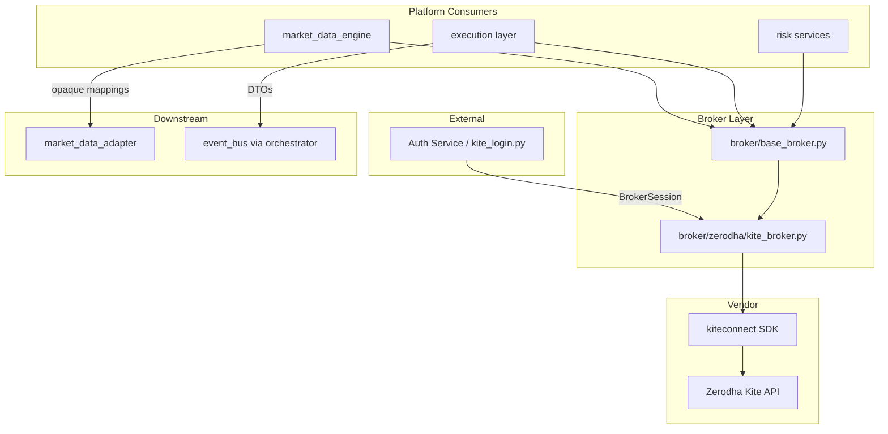

# Kite Broker — Software Engineering Specification

| Field | Value |
|---|---|
| **Module** | `broker/zerodha/kite_broker.py` |
| **Document version** | 1.0.0 |
| **Status** | Draft — ready for implementation |
| **Owner** | THETA AI TRADER Core Platform |
| **Last updated** | 2026-08-03 |

---

## 1. Purpose

`broker/zerodha/kite_broker.py` is the **production concrete implementation** of `BaseBrokerClient` for **Zerodha Kite Connect v3**.

It is the **only module in the platform** permitted to import and invoke the official `kiteconnect` Python SDK (`KiteConnect`, `KiteTicker`). Every other module — market data engine, adapter, orchestrators, execution services, intelligence engines — interacts with Zerodha exclusively through the broker-neutral contract defined in `broker/base_broker.py`.

The module's mission is **transport and mapping only**:

1. Accept an injected `BrokerSession` with Kite credentials (already obtained by external auth).
2. Execute Kite REST and WebSocket operations behind `BaseBrokerClient` methods.
3. Return **opaque immutable mappings** for market-data payloads (adapter normalizes field shapes).
4. Return **broker-neutral frozen DTOs** for orders, positions, margin, and account data.
5. Map all Kite failures to stable `BROKER_CLIENT.*` exceptions.
6. Enforce rate limits, retries, session expiry detection, and thread-safe WebSocket delivery.

### Goals

1. **Eliminate direct `kiteconnect` imports** from legacy scripts and engines.
2. **Implement `BaseBrokerClient` exactly** — no extra public surface without spec revision.
3. **Contain all Kite SDK types** — no `KiteConnect`, `KiteTicker`, or SDK response objects cross module boundaries.
4. Enable **`market_data/market_data_engine.py`** to run against injectable `KiteBrokerClient` + `FakeBrokerClient` interchangeably.
5. Enable **execution and risk layers** to place orders and query positions/margin without vendor coupling.

### Success criteria

- Grep across repository (excluding `broker/zerodha/**` and legacy migration shims) finds zero `kiteconnect` imports.
- `MarketDataEngine.start()` succeeds with injected `KiteBrokerClient` in sandbox/integration tests.
- Unit tests run with mocked SDK — no live credentials in CI.
- All order/position/margin/account outputs are `base_broker` DTOs.
- All market-data outputs are plain immutable mappings suitable for `market_data_adapter.py`.
- Token values never appear in INFO logs or exception messages.

### Pipeline placement

```text
[External Auth — kite_login.py, token vault]
    OAuth / request_token → access_token
              ↓
    BrokerSession(broker_id=KITE, credentials={api_key, access_token})
              ↓
[broker/zerodha/kite_broker.py]
    KiteConnect REST + KiteTicker WebSocket
              ↓
┌─────────────────────────────────────────────────────────────┐
│ market_data_engine  → opaque quote/tick/instrument mappings │
│ execution (future)  → PlaceOrderResult / OrderRecord DTOs   │
│ risk (future)       → PositionRecord / MarginSnapshot DTOs  │
└─────────────────────────────────────────────────────────────┘
              ↓                              ↓
[market_data_adapter.py]            [orchestrator → event_bus]
              ↓
[MarketSnapshot → engines]
```

---

## 2. Responsibilities

`broker/zerodha/kite_broker.py` **is responsible for**:

| # | Responsibility | Description |
|---|---|---|
| R1 | **`BaseBrokerClient` implementation** | Satisfy every abstract method and optional hook defined in `broker/base_broker.py`. |
| R2 | **Kite SDK encapsulation** | Own all `kiteconnect` imports; SDK objects remain private instance fields. |
| R3 | **Session credential interpretation** | Read `api_key` and `access_token` from injected `BrokerSession.credentials`. |
| R4 | **REST transport** | Wrap `KiteConnect` methods for instruments, quotes, LTP, OHLC, historical, orders, positions, holdings, margins, profile. |
| R5 | **WebSocket transport** | Wrap `KiteTicker` for subscribe/unsubscribe and tick streaming. |
| R6 | **Market-data boundary copies** | Deep-copy Kite dict/list responses into immutable `MappingProxyType` trees before return. |
| R7 | **DTO mapping** | Map Kite order/position/margin/account responses to `base_broker` frozen dataclasses. |
| R8 | **Error translation** | Map Kite exceptions and HTTP error semantics to `BrokerClientError` hierarchy. |
| R9 | **Rate limiting** | Enforce conservative request pacing for REST calls. |
| R10 | **Retry policy** | Retry idempotent read operations on transient failures within policy bounds. |
| R11 | **Session expiry detection** | Detect token invalidation; transition to `SessionState.EXPIRED`. |
| R12 | **Connection lifecycle** | Implement connect/disconnect, connection state, WebSocket state tracking. |
| R13 | **Handler dispatch** | Invoke registered tick/error/connection handlers on appropriate threads with isolation. |
| R14 | **Thread safety** | Protect shared state with locks; document callback threading model. |
| R15 | **Logging and metrics** | Standard structured log events and optional metrics hooks. |
| R16 | **Configuration policy** | Accept `KiteBrokerPolicy` at construction — no env loading in module. |

---

## 3. Non-Responsibilities

`broker/zerodha/kite_broker.py` **must not**:

| # | Non-responsibility | Rationale |
|---|---|---|
| NR1 | **OAuth / login / token generation** | External auth produces `BrokerSession`; no `generate_session()` in this module. |
| NR2 | **Load `.env` or environment variables** | Credentials injected only via `BrokerSession`. |
| NR3 | **Normalize to `MarketSnapshot`** | Exclusive responsibility of `market_data/market_data_adapter.py`. |
| NR4 | **Parse Kite field semantics for engines** | Adapter interprets `last_price`, `instrument_type`, etc. |
| NR5 | **Strategy or signal logic** | Decision engines only. |
| NR6 | **Market intelligence** | Regime, Greeks, confidence engines. |
| NR7 | **Risk scoring or position sizing** | Risk layer via orchestrator. |
| NR8 | **Publish to `EventBus`** | Orchestrators publish connection/order events. |
| NR9 | **Filter option chains by strike window** | Engine/adapter universe logic. |
| NR10 | **Persist tokens, orders, or ticks** | External persistence layers. |
| NR11 | **Schedule snapshot cadence** | `MarketDataEngine` responsibility. |
| NR12 | **Expose `KiteConnect` / `KiteTicker` publicly** | No escape of SDK types. |
| NR13 | **Implement multi-broker routing** | Single broker implementation. |

---

## 4. Architecture

### 4.1 Component model

```text
┌─────────────────────────────────────────────────────────────────┐
│                      KiteBrokerClient                            │
│                   (extends BaseBrokerClient)                     │
├─────────────────────────────────────────────────────────────────┤
│  KiteRestGateway          │  KiteWebSocketGateway                │
│  - KiteConnect wrapper    │  - KiteTicker wrapper               │
│  - rate limiter           │  - subscription registry            │
│  - retry executor         │  - tick dispatch                    │
├───────────────────────────┴───────────────────────────────────┤
│  KiteResponseCopier   │  KiteDtoMapper   │  KiteErrorMapper     │
│  (immutable dict copy)  │  (order/pos/    │  (SDK → BrokerClient│
│                         │   margin DTOs)  │   Error)            │
└─────────────────────────────────────────────────────────────────┘
                              │
                              ▼
                    kiteconnect SDK (private)
```

### 4.2 Module layout (v1)

| Path | Visibility | Description |
|---|---|---|
| `broker/zerodha/kite_broker.py` | Public | `KiteBrokerClient`, policy types, factory helpers |
| `broker/zerodha/_kite_rest.py` | Internal | REST gateway, batching, rate limit |
| `broker/zerodha/_kite_ws.py` | Internal | WebSocket gateway, subscription state |
| `broker/zerodha/_kite_mappers.py` | Internal | DTO mapping tables |
| `broker/zerodha/_kite_errors.py` | Internal | Exception translation |
| `broker/zerodha/_kite_copy.py` | Internal | Immutable response copying |

All internal modules prefixed with `_`; only `KiteBrokerClient` and policy types are public.

Alternatively, v1 may ship as a **single file** if under ~1,500 lines; submodules preferred for maintainability.

### 4.3 Design principles

| Principle | Application |
|---|---|
| **SDK firewall** | `kiteconnect` import statements exist only under `broker/zerodha/`. |
| **Immutable outward boundary** | Every return value is frozen dataclass or `MappingProxyType`. |
| **Fail closed** | Disconnected or expired session → typed error on mutating calls. |
| **Thin mapping** | No business rules in mappers — field translation only. |
| **Deterministic errors** | Same Kite failure class → same `BROKER_CLIENT.*` code. |
| **Injected policy** | Rate limits, retries, batch sizes configurable without env vars. |

### 4.4 Dependency direction

```text
market_data_engine  →  broker/zerodha/kite_broker.py  →  broker/base_broker.py
execution (future)  →  broker/zerodha/kite_broker.py
broker/zerodha/*    →  kiteconnect (third-party)
```

No imports from `market_data`, `core`, or analytical engine packages.

---

## 5. Dependency Diagram



---

## 6. Authentication Lifecycle

### 6.1 External auth boundary

Authentication orchestration remains **outside** this module:

```text
[User / Cron / Auth Service]
    generate_session(request_token, api_secret)  ← NOT in kite_broker.py
              ↓
    build BrokerSession:
        broker_id = BrokerId.KITE
        session_id = uuid (for logs)
        authenticated_at = now(UTC)
        expires_at = next 06:00 IST (optional hint)
        credentials = MappingProxyType({
            "api_key": "...",
            "access_token": "...",
        })
              ↓
KiteBrokerClient(session, policy)
```

### 6.2 Required credential keys

| Key | Required | Description |
|---|---|---|
| `api_key` | Yes | Kite Connect API key |
| `access_token` | Yes | Valid daily access token |

Missing keys at construction → `BrokerConfigurationError` (`BROKER_CLIENT.CONFIG.INVALID`).

`api_secret` is **not** stored in `KiteBrokerClient` — used only during external token generation.

### 6.3 Construction-time validation

1. `session.broker_id` must be `BrokerId.KITE`.
2. `validate_broker_session()` from base module runs in `BaseBrokerClient.__init__`.
3. Credential keys validated; values must be non-empty strings.
4. No network call at construction.

### 6.4 Connect-time authentication probe

On `connect()`:

1. Instantiate private `KiteConnect(api_key=...)`.
2. Call `set_access_token(access_token)`.
3. Invoke `profile()` as lightweight auth probe.
4. On success: `SessionState.AUTHENTICATED`, `ConnectionState.CONNECTED`.
5. On `TokenException` / 403: `SessionState.EXPIRED`, raise `BrokerAuthenticationError`.

### 6.5 `update_session()`

Inherited from `BaseBrokerClient`. When external auth refreshes token:

1. Caller invokes `client.update_session(new_session)`.
2. If connected, optionally re-probe with `profile()` (implementation choice).
3. WebSocket must reconnect with new token if active.

---

## 7. Access Token Lifecycle

### 7.1 Token model

Kite access tokens are **daily** — valid until ~6:00 AM IST next trading day (Zerodha policy; exact boundary documented in runbook, not enforced by guessing in code).

### 7.2 Expiry hints

| Source | Usage |
|---|---|
| `BrokerSession.expires_at` | Optional external hint; if present and past, fail closed before REST calls |
| Kite API 403 / `TokenException` | Authoritative runtime signal → `SessionState.EXPIRED` |
| `profile()` failure on connect | Treat as invalid/expired token |

### 7.3 State transitions

```text
[Construction]
    → SessionState.UNAUTHENTICATED
[connect() + profile() OK]
    → SessionState.AUTHENTICATED
[TokenException on any call]
    → SessionState.EXPIRED
[manual revoke / invalid token]
    → SessionState.REVOKED (when distinguishable)
[disconnect()]
    → connection down; session state unchanged (may still be AUTHENTICATED but disconnected)
```

### 7.4 Fail-closed rules

| Condition | Behaviour |
|---|---|
| `expires_at` in past (if set) | Raise `BrokerAuthenticationError` before REST/WS mutating calls |
| `TokenException` | Set `EXPIRED`; raise `BrokerAuthenticationError`; do not auto-refresh |
| Expired session | `connect()` raises until `update_session()` with fresh token |

### 7.5 No automatic refresh

This module **never** calls `generate_session()`. Token refresh is exclusively external.

---

## 8. REST API Mapping

### 8.1 `BaseBrokerClient` → Kite Connect REST

| BaseBrokerClient method | KiteConnect method | Notes |
|---|---|---|
| `connect()` (probe) | `profile()` | Auth validation |
| `fetch_instruments` | `instruments(exchange)` | Exchange string mapped from `Exchange` enum |
| `fetch_quotes` | `quote(keys)` | Batch per policy |
| `fetch_ltp` | `ltp(keys)` | Batch per policy |
| `fetch_ohlc` | `ohlc(keys)` | Optional capability `ohlc_batch=True` |
| `fetch_historical` | `historical_data(token, from, to, interval, continuous)` | Requires instrument token resolution |
| `place_order` | `place_order(...)` | Mapped from `PlaceOrderRequest` |
| `modify_order` | `modify_order(...)` | |
| `cancel_order` | `cancel_order(...)` | |
| `fetch_orders` | `orders()` / filter | |
| `fetch_positions` | `positions()` | Net + day merged to DTO list |
| `fetch_holdings` | `holdings()` | Optional capability |
| `fetch_margins` | `margins()` | Equity segment default |
| `preview_margin` | `order_margins(...)` | Optional capability |
| `fetch_profile` | `profile()` | |
| `fetch_funds` | `margins()` subset | Optional; map equity/commodity available |

### 8.2 Exchange enum mapping

| `Exchange` | Kite exchange string |
|---|---|
| `NSE` | `"NSE"` |
| `BSE` | `"BSE"` |
| `NFO` | `"NFO"` |
| `BFO` | `"BFO"` |
| `MCX` | `"MCX"` |
| `CDS` | `"CDS"` |

### 8.3 Instrument key format

Kite instrument keys: `"EXCHANGE:TRADINGSYMBOL"` (e.g., `"NSE:NIFTY 50"`, `"NFO:NIFTY24AUG25000CE"`).

Passed through unchanged in `QuoteRequest.instrument_keys`.

### 8.4 Historical data token resolution

Kite `historical_data` requires numeric `instrument_token`, not tradingsymbol key.

Resolution strategy (transport only, no chain logic):

1. Accept `HistoricalRequest.instrument_key`.
2. Look up token from in-memory instrument cache populated by prior `fetch_instruments` call.
3. If cache miss → `BrokerRequestError` (`BROKER_CLIENT.REQUEST.INVALID`) with message indicating cache miss.
4. Cache is **per client instance**; engine responsible for prefetching instruments.

### 8.5 Response copying

All Kite dict/list responses pass through `copy_to_immutable_mapping()` before return from REST gateway. Nested structures recursively frozen.

---

## 9. WebSocket Lifecycle

### 9.1 SDK component

Uses `kiteconnect.KiteTicker` with `api_key` and `access_token` from session.

### 9.2 Connection sequence

```text
connect()
    1. REST auth probe (profile)
    2. Construct KiteTicker(api_key, access_token)
    3. Register SDK callbacks → internal handlers
    4. ticker.connect(threaded=True)
    5. WebSocketState.OPENING → OPEN
    6. Invoke connection_handler(ConnectionInfo)
```

### 9.3 Disconnect sequence

```text
disconnect()
    1. WebSocketState.CLOSING
    2. ticker.close()
    3. Clear subscription registry
    4. WebSocketState.CLOSED
    5. ConnectionState.DISCONNECTED
    6. connection_handler notification
```

### 9.4 SDK callback mapping

| KiteTicker callback | Internal action |
|---|---|
| `on_ticks(ticks)` | Copy each tick dict → invoke `TickHandler` |
| `on_connect` | Set WS OPEN; connection_handler |
| `on_close` | Set WS CLOSED; optional error_handler |
| `on_error` | Map to `BrokerClientError` → error_handler |
| `on_reconnect` | Set ConnectionState.RECONNECTING; connection_handler |
| `on_noreconnect` | Set DEGRADED/ERROR; error_handler |

### 9.5 Threading model

- `KiteTicker.connect(threaded=True)` — SDK owns background thread.
- Tick handlers invoked on SDK thread; must return quickly.
- Handler exceptions caught and logged; never crash SDK thread.

### 9.6 Reconnection

KiteTicker has built-in reconnect. This module:

- Surfaces state via `ConnectionInfo` and `get_connection_info()`.
- Does **not** implement separate reconnect orchestration (owned by `MarketDataEngine` for resubscribe policy).
- On `on_noreconnect`, mark `ConnectionState.DEGRADED` and emit error.

---

## 10. Subscription Management

### 10.1 API mapping

| BaseBrokerClient | KiteTicker |
|---|---|
| `subscribe(tokens)` | `subscribe(tokens)` + `set_mode(QUOTE)` or `FULL` per policy |
| `unsubscribe(tokens)` | `unsubscribe(tokens)` |
| `get_subscribed_tokens()` | Internal registry snapshot |

### 10.2 Subscription registry

- Thread-safe `set[int]` of active tokens.
- Updated only after successful SDK subscribe/unsubscribe call.
- On disconnect, registry cleared.

### 10.3 Mode policy

| `KiteBrokerPolicy.ws_tick_mode` | Kite constant | Use case |
|---|---|---|
| `FULL` (default) | `KiteTicker.MODE_FULL` | Market data engine — depth + OI |
| `QUOTE` | `KiteTicker.MODE_QUOTE` | LTP-only consumers |

Mode applied via `set_mode(mode, tokens)` after subscribe batch.

### 10.4 Limits

| Limit | Value | Source |
|---|---|---|
| Max instruments per WS connection | 3000 | Kite docs (configurable guard below limit) |
| Default engine universe | ~42–200 | Engine config |

Exceeding policy max → `BrokerRequestError` (`BROKER_CLIENT.REQUEST.BATCH_TOO_LARGE`).

### 10.5 Fail-closed

`subscribe()` requires `is_connected()` and `is_authenticated()`. Raises `BrokerConnectionError` or `BrokerAuthenticationError` otherwise.

---

## 11. Quote Retrieval

### 11.1 `fetch_quotes`

| Aspect | Specification |
|---|---|
| Input | `QuoteRequest(instrument_keys)` |
| Kite call | `quote(list(keys))` |
| Output | `Mapping[str, Mapping[str, object]]` — immutable copies |
| Batch size | Default 100 keys per request; split larger batches sequentially |
| Missing keys | Omitted from result (Kite behaviour); engine treats as stale |
| Empty keys | `BrokerRequestError` via `validate_quote_request()` |

### 11.2 `fetch_ltp`

Same batching rules; calls `ltp(keys)`.

Typical keys: `"NSE:NIFTY 50"`, `"NSE:INDIA VIX"`.

### 11.3 `fetch_ohlc`

Enabled when `BrokerCapabilities.ohlc_batch=True`. Calls `ohlc(keys)`.

### 11.4 Rate limiting

All quote/LTP/OHLC batches pass through rate limiter (§20).

### 11.5 Logging

Log key **count** and duration at DEBUG; never log full quote payloads at INFO.

---

## 12. Option Chain Retrieval

### 12.1 Scope boundary

**Option chain assembly is not implemented in this module.** Strike filtering, ATM selection, and pair completeness belong to `MarketDataEngine` + `MarketDataAdapter`.

### 12.2 Transport support pattern

Option chain data is obtained by composing base APIs:

```text
1. fetch_instruments(InstrumentRequest(exchange=NFO))
       → full NFO instrument master (opaque dicts)
2. Engine filters tokens for target underlying/expiry window
3. fetch_quotes(QuoteRequest(instrument_keys=tuple(...)))
       → quote payloads for selected contracts
4. subscribe(instrument_tokens) for live ticks
```

### 12.3 Kite-specific notes (for implementors)

- Instrument master entries include: `instrument_token`, `tradingsymbol`, `name`, `expiry`, `strike`, `instrument_type`, `lot_size`, `tick_size`.
- Adapter maps these fields — `KiteBrokerClient` returns raw copies only.
- Typical NFO master size: tens of thousands of rows; engine caches with TTL.

### 12.4 No convenience method in v1

No public `fetch_option_chain()` on `KiteBrokerClient`. Adding one requires spec amendment — keeps module aligned with `BaseBrokerClient` exactly.

---

## 13. Historical Data Retrieval

### 13.1 `fetch_historical`

| Field | Mapping |
|---|---|
| `instrument_key` | Resolved to `instrument_token` via cache |
| `interval` | Passed to Kite: `minute`, `3minute`, `5minute`, `10minute`, `15minute`, `30minute`, `60minute`, `day` |
| `from_ts` / `to_ts` | Timezone-aware → Kite datetime |
| `continuous` | Passed as Kite `continuous` flag |

Returns `tuple[Mapping[str, object], ...]` — one immutable dict per candle.

### 13.2 Candle field preservation

Copy Kite candle fields verbatim: `date`, `open`, `high`, `low`, `close`, `volume`, `oi` (if present).

### 13.3 Capability gate

Requires `BrokerCapabilities.historical_candles=True` (default for Kite).

### 13.4 Errors

| Condition | Error |
|---|---|
| Token not in cache | `BrokerRequestError` |
| Kite `InputException` | `BrokerRequestError` |
| Date range invalid | `BrokerRequestError` |

---

## 14. Order Management

### 14.1 Request → Kite parameter mapping

| PlaceOrderRequest | Kite place_order param |
|---|---|
| `instrument_key` | Split to `exchange`, `tradingsymbol` |
| `side` | `transaction_type`: BUY→`BUY`, SELL→`SELL` |
| `order_type` | `order_type`: MARKET→`MARKET`, LIMIT→`LIMIT`, SL→`SL`, SL_M→`SL-M` |
| `product` | `product`: CNC/NRML/MIS/MTF |
| `quantity` | `quantity` |
| `price` | `price` |
| `trigger_price` | `trigger_price` |
| `variety` | `variety`: regular/amo/co/iceberg |
| `validity` | `validity` (DAY/IOC/...) |
| `tag` | `tag` (max 20 chars enforced by Kite) |

### 14.2 Response → DTO mapping

| Kite response | PlaceOrderResult |
|---|---|
| `order_id` | `order_id`, `broker_order_id` |
| — | `status=OPEN` or `PENDING` |
| — | `message="order placed"` |
| Full response | `raw` immutable copy |

### 14.3 Modify / cancel

| Request | Kite API |
|---|---|
| `ModifyOrderRequest` | `modify_order(variety, order_id, ...)` |
| `CancelOrderRequest` | `cancel_order(variety, order_id)` |

Returns `OrderRecord` DTOs via `KiteDtoMapper`.

### 14.4 Order status normalization

| Kite status | OrderStatus |
|---|---|
| `OPEN` | `OPEN` |
| `COMPLETE` | `COMPLETE` |
| `CANCELLED` | `CANCELLED` |
| `REJECTED` | `REJECTED` |
| `TRIGGER PENDING` | `PENDING` |
| Unknown | `UNKNOWN` |

### 14.5 Idempotency

When `PlaceOrderRequest.idempotency_key` provided, maintain in-memory dedupe cache (TTL 24h) mapping key → `PlaceOrderResult` to prevent duplicate submission on caller retry. Cache is per client instance.

### 14.6 Fail-closed

Kite `OrderException` → `BrokerOrderError` (`BROKER_CLIENT.ORDER.REJECTED`) with broker message.

---

## 15. Position Management

### 15.1 `fetch_positions`

Calls `KiteConnect.positions()` returning `{"net": [...], "day": [...]}`.

### 15.2 DTO mapping

Each Kite position dict → `PositionRecord`:

| Kite field | PositionRecord |
|---|---|
| `tradingsymbol` + `exchange` | `instrument_key` = `f"{exchange}:{tradingsymbol}"` |
| `product` | `ProductType` enum |
| `quantity` | `quantity` (signed) |
| `average_price` | `average_price` |
| `last_price` | `last_price` |
| `pnl` | `pnl` |
| `exchange` | `Exchange` enum |
| Full dict | `raw` immutable copy |

Merge strategy: return **net** positions by default; include day positions when net quantity zero (document in mapper).

### 15.3 Read-only

No position mutation APIs — closing positions uses order APIs.

---

## 16. Holdings

### 16.1 Capability

`BrokerCapabilities.holdings=True` for Kite v1.

### 16.2 API

`KiteConnect.holdings()` → list of dicts → `tuple[HoldingRecord, ...]`.

### 16.3 DTO mapping

| Kite field | HoldingRecord |
|---|---|
| `tradingsymbol` + `exchange` | `instrument_key` |
| `quantity` | `quantity` |
| `average_price` | `average_price` |
| `collateral_quantity` | `collateral_quantity` |
| `collateral_type` | `collateral_type` |
| Full dict | `raw` |

---

## 17. Margin APIs

### 17.1 `fetch_margins`

Calls `KiteConnect.margins()` → map equity segment to `MarginSnapshot`:

| Kite path | MarginSnapshot |
|---|---|
| `equity.available.live_balance` | `available` |
| `equity.utilised.debits` | `used` |
| `equity.net` | `total` |
| `equity.available.span` | `span` |
| `equity.available.exposure` | `exposure` |
| `commodity.available.live_balance` | `commodity_available` |
| now(UTC) | `as_of` |

### 17.2 `preview_margin`

When `BrokerCapabilities.margin_preview=True`:

- Accept `MarginPreviewRequest.orders`.
- Map each to Kite order margin payload.
- Call `order_margins(basket)`.
- Map response to `MarginSnapshot` ( projected available/used).

Default v1: `margin_preview=False` unless explicitly enabled in policy.

### 17.3 Fail-closed

Margin fetch failure → `BrokerConnectionError` or `BrokerAuthenticationError`; callers treat as no new risk.

---

## 18. Error Mapping

### 18.1 Kite exception → broker exception

| Kite / SDK exception | Broker exception | Code |
|---|---|---|
| `TokenException` | `BrokerAuthenticationError` | `BROKER_CLIENT.AUTH.EXPIRED` |
| `PermissionException` | `BrokerAuthenticationError` | `BROKER_CLIENT.AUTH.INVALID` |
| `NetworkException` | `BrokerConnectionError` | `BROKER_CLIENT.CONNECTION.FAILED` |
| `DataException` | `BrokerRequestError` | `BROKER_CLIENT.REQUEST.INVALID` |
| `InputException` | `BrokerRequestError` | `BROKER_CLIENT.REQUEST.INVALID` |
| `OrderException` | `BrokerOrderError` | `BROKER_CLIENT.ORDER.REJECTED` |
| HTTP 429 (if exposed) | `BrokerRateLimitError` | `BROKER_CLIENT.RATE_LIMIT.EXCEEDED` |
| Timeout (wrapper) | `BrokerTimeoutError` | `BROKER_CLIENT.REQUEST.TIMEOUT` |
| Unknown Exception | `BrokerClientError` | `BROKER_CLIENT.INTERNAL.UNHANDLED` |

### 18.2 HTTP status mapping (when available)

| Status | Mapped error |
|---|---|
| 401 / 403 | `BrokerAuthenticationError` |
| 429 | `BrokerRateLimitError` |
| 5xx | `BrokerConnectionError` (recoverable) |
| 4xx other | `BrokerRequestError` |

### 18.3 Error message hygiene

- Strip token-like substrings from messages before attaching to exceptions.
- Never include `access_token` in exception `message`.
- Log `session_id` only, not credentials.

### 18.4 Handler error dispatch

When mapping for `error_handler` callback, always pass fully constructed `BrokerClientError` subclass instances.

---

## 19. Retry Strategy

### 19.1 `KiteBrokerPolicy` retry fields

| Field | Default | Description |
|---|---|---|
| `retry_max_attempts` | `3` | Max attempts including first try |
| `retry_initial_delay_ms` | `100` | Initial backoff |
| `retry_max_delay_ms` | `2000` | Backoff cap |
| `retry_jitter` | `True` | Random jitter |
| `retryable_codes` | recoverable errors | Which `BROKER_CLIENT.*` codes retry |

### 19.2 Retryable operations

| Operation | Retry |
|---|---|
| `fetch_quotes`, `fetch_ltp`, `fetch_ohlc` | Yes |
| `fetch_instruments`, `fetch_historical` | Yes |
| `fetch_positions`, `fetch_margins`, `fetch_profile` | Yes |
| `connect()` profile probe | Yes (limited) |
| `place_order`, `modify_order`, `cancel_order` | **No** (except idempotent dedupe) |
| `subscribe`, `unsubscribe` | Yes (limited) |

### 19.3 Non-retryable

- `BrokerAuthenticationError`
- `BrokerOrderError`
- `BrokerRequestError`
- `BrokerCapabilityError`

### 19.4 Implementation

- Synchronous retry loop in REST gateway for v1.
- Exponential backoff: `delay = min(initial * 2^attempt, max)`.
- After exhaustion, raise last mapped exception.

---

## 20. Rate Limit Handling

### 20.1 Kite documented limits (conservative policy)

| Endpoint class | Kite limit | THETA default |
|---|---|---|
| Quote / LTP / OHLC | 1 req/s recommended practical | 3 req/s max burst with token bucket |
| General REST | Higher | 3 req/s sustained |
| Order placement | 10 req/s | 5 req/s sustained |

Default `KiteBrokerPolicy.rate_limit_rps = 3.0` aligned with `BrokerClientMetadata.rate_limit_hint_rps`.

### 20.2 Token bucket

- Private `RateLimiter` per client instance.
- Acquire token before each REST call; block up to `rate_limit_wait_seconds` (default 0.5).
- On timeout → `BrokerRateLimitError`.

### 20.3 429 handling

On HTTP 429 or Kite rate error:

1. Map to `BrokerRateLimitError`.
2. Honor `Retry-After` if present (else backoff).
3. Increment metric `kite_broker_rate_limit_total`.

### 20.4 Quote batching interaction

Large quote requests split into batches; each batch consumes one rate token.

---

## 21. Session Expiry Handling

### 21.1 Detection paths

| Path | Action |
|---|---|
| Pre-call `expires_at` check | Raise `BrokerAuthenticationError` immediately |
| `TokenException` on any REST/WS call | Set `SessionState.EXPIRED`; raise |
| `profile()` failure on connect | Set `EXPIRED`; raise |
| WebSocket auth failure | Set `EXPIRED`; error_handler |

### 21.2 Post-expiry behaviour

- All authenticated REST calls fail fast with `BrokerAuthenticationError`.
- `subscribe()` fails with auth error.
- `get_connection_info()` remains available (read-only probe).
- `disconnect()` remains idempotent.

### 21.3 Recovery

1. External auth produces new `BrokerSession`.
2. Caller invokes `update_session(session)`.
3. Caller invokes `connect()` to re-probe and reopen WebSocket.

No automatic token refresh inside module.

### 21.4 Orchestrator integration

Orchestrators may publish `broker.session.expired` on event bus (see `broker_client.md` Appendix B). This module does not publish.

---

## 22. Thread Safety

| Component | Synchronisation |
|---|---|
| REST gateway | `threading.RLock` around KiteConnect calls |
| Subscription registry | `RLock` |
| Connection/session state | `RLock` |
| Idempotency cache | `RLock` |
| Instrument token cache | `RLock` |
| Handler registration | Set once before connect; changes require disconnect |
| Tick callback | SDK thread → copy tick → handler; no lock held during handler |

### 22.1 Prohibited patterns

- Do not call blocking REST from within `TickHandler`.
- Do not invoke `connect()` concurrently with `disconnect()`.

### 22.2 Safe publication

`get_connection_info()`, `get_subscribed_tokens()`, `metadata()` return snapshots under lock.

---

## 23. Logging

### 23.1 Logger

- Module logger: `broker.zerodha.kite_broker`
- Child loggers: `broker.zerodha.kite_rest`, `broker.zerodha.kite_ws`

### 23.2 Required log events

| Event | Level | When |
|---|---|---|
| `kite_broker.connect.start` | INFO | `connect()` begins |
| `kite_broker.connect.success` | INFO | Auth probe succeeded |
| `kite_broker.connect.failed` | ERROR | Connect/auth failure (no token) |
| `kite_broker.disconnect` | INFO | Clean disconnect |
| `kite_broker.rest.request` | DEBUG | REST call (method, key count, duration_ms) |
| `kite_broker.ws.subscribe` | INFO | Subscribe batch (token count) |
| `kite_broker.ws.unsubscribe` | INFO | Unsubscribe batch |
| `kite_broker.ws.tick` | DEBUG | Tick received (token, throttled) |
| `kite_broker.ws.error` | ERROR | WebSocket error |
| `kite_broker.session.expired` | WARNING | Token expired |
| `kite_broker.rate_limit` | WARNING | Rate limit hit |
| `kite_broker.order.placed` | INFO | Order placed (order_id only) |
| `kite_broker.order.rejected` | WARNING | Order rejected (code, no secrets) |

### 23.3 Content rules

- Do log: counts, durations, order_id, session_id, error codes.
- Do not log: `access_token`, `api_key`, full quote/tick payloads at INFO.
- DEBUG tick logging throttled to 1/sec aggregate.

---

## 24. Metrics

### 24.1 Optional `MetricsRecorder`

Inject at construction (same protocol pattern as `EventBus`). No-op default.

### 24.2 Counters

| Metric | Labels |
|---|---|
| `kite_broker_rest_requests_total` | `method` |
| `kite_broker_rest_errors_total` | `code` |
| `kite_broker_ws_ticks_total` | — |
| `kite_broker_ws_errors_total` | — |
| `kite_broker_rate_limit_total` | — |
| `kite_broker_session_expired_total` | — |
| `kite_broker_orders_total` | `status` |

### 24.3 Histograms

| Metric | Description |
|---|---|
| `kite_broker_rest_duration_seconds` | REST latency |
| `kite_broker_ws_tick_dispatch_seconds` | Handler dispatch time |

### 24.4 Gauges

| Metric | Description |
|---|---|
| `kite_broker_connected` | 1/0 |
| `kite_broker_subscribed_tokens` | Active WS subscriptions |

---

## 25. Testing Strategy

Tests live in `tests/test_kite_broker.py` and `tests/zerodha/` (optional package).

### 25.1 Test doubles

| Double | Purpose |
|---|---|
| `MockKiteConnect` | In-memory REST simulation |
| `MockKiteTicker` | WS callback simulation |
| `KiteBrokerClient` with injected mocks | Full client tests |
| `RecordingMetricsRecorder` | Metric assertions |

### 25.2 Required unit tests

| Category | Cases |
|---|---|
| **Construction** | Invalid session; missing credentials; wrong broker_id |
| **Connect/disconnect** | Auth probe success/failure; idempotent disconnect |
| **REST mapping** | instruments, quote, ltp, historical |
| **Immutable copies** | Mutating returned dict does not affect internal state |
| **WebSocket** | subscribe/unsubscribe registry; tick handler invoked |
| **Orders** | place/modify/cancel DTO round-trip |
| **Positions/margin/profile** | DTO field mapping |
| **Error mapping** | Each Kite exception class |
| **Rate limit** | Token bucket blocks / raises |
| **Retry** | Transient failure retried; auth not retried |
| **Session expiry** | TokenException → EXPIRED |
| **Thread safety** | Concurrent subscribe stress |
| **Idempotency** | Duplicate place_order with same key |

### 25.3 Integration tests

- Mark `@pytest.mark.integration` — require sandbox credentials via CI secret injection **outside** module.
- Not required for merge; unit tests with mocks are mandatory.

### 25.4 Coverage target

≥ 95% line coverage on `broker/zerodha/kite_broker.py` and internal `_kite_*` modules.

---

## 26. Security Considerations

| Concern | Requirement |
|---|---|
| Credentials storage | Only in `BrokerSession.credentials`; held in private fields |
| Env vars | **Forbidden** in this module |
| Logging secrets | Never log tokens or API keys |
| TLS | Kite SDK uses HTTPS/WSS by default — do not downgrade |
| Token in memory | Minimize copying; no token in exception messages |
| Order tags | Pass through opaque; no eval |
| SDK updates | Pin `kiteconnect` version in `requirements.txt`; review changelogs |
| Multi-tenant | One client instance per account session |
| Dependency audit | Periodic `pip audit` in CI |

---

## 27. Future Extension Points

| Extension | Description |
|---|---|
| **`broker/zerodha/kite_auth.py`** | Optional separate auth helper (still no env in library code) |
| **Async REST/WS** | `AsyncKiteBrokerClient` with same DTOs |
| **GTT orders** | Extend order DTOs + mapper |
| **Basket orders** | Multi-leg order support |
| **Binary market data** | Kite compressed WS feed |
| **Commodity segment toggle** | Segment-aware margin/funds |
| **Circuit breaker wrapper** | Pluggable around REST gateway |
| **OpenTelemetry spans** | Per REST/WS operation |
| **Token expiry scheduler** | External callback hook when `expires_at` approaches |

---

## 28. Definition of Done

The `broker/zerodha/kite_broker.py` implementation is **done** when:

### 28.1 Implementation

- [ ] `KiteBrokerClient` extends `BaseBrokerClient` with all methods implemented.
- [ ] `kiteconnect` imports exist only under `broker/zerodha/`.
- [ ] No environment variable or `.env` loading.
- [ ] Market-data returns immutable mappings; order/account returns DTOs.
- [ ] No Kite SDK objects escape module boundary.
- [ ] No strategy, intelligence, risk, adapter, or event bus logic.
- [ ] `BrokerId.KITE` returned from `broker_id` property.
- [ ] `KiteBrokerPolicy` frozen dataclass with rate limit and retry config.
- [ ] Google-style docstrings; Python 3.12 type hints.
- [ ] Stable error mapping per §18.

### 28.2 Testing

- [ ] `tests/test_kite_broker.py` covers §25.2 with mocked SDK.
- [ ] Line coverage ≥ 95%.
- [ ] `FakeBrokerClient` and `KiteBrokerClient` interchangeable in engine stub test.

### 28.3 Integration

- [ ] `market_data/market_data_engine.py` accepts injected `KiteBrokerClient`.
- [ ] Legacy direct `kiteconnect` usage documented for migration in CHANGELOG.
- [ ] `requirements.txt` pins compatible `kiteconnect` version.

### 28.4 Documentation

- [ ] This specification matches implementation.
- [ ] Cross-links in `broker_client.md` and `market_data_engine.md` updated.

### 28.5 Review checklist

- [ ] SDK firewall verified by repo grep.
- [ ] No secrets in logs (manual + automated review).
- [ ] Thread-safety documented and tested.
- [ ] Fail-closed auth and connection semantics.

### 28.6 Sign-off

- [ ] Peer review approved.
- [ ] Specification version bumped if API changed post-review.

---

## Appendix A — `KiteBrokerPolicy` fields

| Field | Default | Description |
|---|---|---|
| `rate_limit_rps` | `3.0` | Sustained REST requests per second |
| `rate_limit_wait_seconds` | `0.5` | Max wait for rate token |
| `quote_batch_size` | `100` | Keys per quote/LTP batch |
| `max_subscribed_tokens` | `3000` | WS subscription ceiling |
| `ws_tick_mode` | `FULL` | `FULL` or `QUOTE` |
| `retry_max_attempts` | `3` | Retry attempts |
| `retry_initial_delay_ms` | `100` | Initial backoff |
| `retry_max_delay_ms` | `2000` | Max backoff |
| `rest_timeout_seconds` | `2.0` | REST call timeout |
| `enable_margin_preview` | `False` | Enable preview_margin |
| `enable_holdings` | `True` | Enable fetch_holdings |
| `enable_ohlc_batch` | `False` | Enable fetch_ohlc |
| `enable_funds_breakdown` | `False` | Enable fetch_funds |

---

## Appendix B — `BrokerSession.credentials` schema

| Key | Type | Required |
|---|---|---|
| `api_key` | `str` | Yes |
| `access_token` | `str` | Yes |

Example (constructed externally):

```text
BrokerSession(
    broker_id=BrokerId.KITE,
    session_id="550e8400-e29b-41d4-a716-446655440000",
    authenticated_at=datetime(2026, 8, 3, 3, 30, tzinfo=UTC),
    expires_at=datetime(2026, 8, 4, 0, 30, tzinfo=UTC),  # optional hint
    credentials=MappingProxyType({
        "api_key": "...",
        "access_token": "...",
    }),
)
```

---

## Appendix C — Order enum reverse mapping (Kite strings)

| OrderSide | Kite `transaction_type` |
|---|---|
| BUY | `BUY` |
| SELL | `SELL` |

| OrderType | Kite `order_type` |
|---|---|
| MARKET | `MARKET` |
| LIMIT | `LIMIT` |
| SL | `SL` |
| SL_M | `SL-M` |

| ProductType | Kite `product` |
|---|---|
| CNC | `CNC` |
| NRML | `NRML` |
| MIS | `MIS` |
| MTF | `MTF` |

| OrderVariety | Kite `variety` |
|---|---|
| REGULAR | `regular` |
| AMO | `amo` |
| CO | `co` |
| ICEBERG | `iceberg` |

---

## Appendix D — Market Data Engine integration checklist

| Engine operation | KiteBrokerClient method |
|---|---|
| Start | `connect()` |
| Stop | `disconnect()` |
| Health | `is_connected()`, `get_connection_info()` |
| Load NFO master | `fetch_instruments(NFO)` |
| REST quotes | `fetch_quotes()` |
| Spot/VIX LTP | `fetch_ltp()` |
| Live ticks | `subscribe()` + tick handler |
| Reconnect resubscribe | `unsubscribe()` + `subscribe()` |
| Historical backfill | `fetch_historical()` |

---

## Appendix E — Legacy migration map

| Legacy (`kiteconnect` direct) | Replacement |
|---|---|
| `KiteConnect(api_key)` + `set_access_token` | External auth + `KiteBrokerClient(session)` |
| `kite.instruments("NFO")` | `client.fetch_instruments(InstrumentRequest(NFO))` |
| `kite.quote(symbols)` | `client.fetch_quotes(QuoteRequest(...))` |
| `kite.ltp(...)` | `client.fetch_ltp(...)` |
| `kite.historical_data(...)` | `client.fetch_historical(...)` |
| `KiteTicker(...)` inline | `client.connect()` + `subscribe()` |
| `kite.place_order(...)` | `client.place_order(PlaceOrderRequest(...))` |
| `kite.positions()` | `client.fetch_positions()` |
| `kite.margins()` | `client.fetch_margins()` |
| `os.getenv("KITE_ACCESS_TOKEN")` | Injected `BrokerSession.credentials` |

---

## Appendix F — Related documents

- `docs/specifications/broker_client.md`
- `docs/specifications/market_data_engine.md`
- `docs/specifications/market_data_adapter.md`
- `docs/specifications/market_snapshot.md`
- `docs/specifications/event_bus.md`
- `docs/specifications/base_engine.md`
- `broker/base_broker.py`
- `.cursor/rules/theta-ai-trader-engineering-standards.mdc`

---

## Appendix G — Revision history

| Version | Date | Author | Changes |
|---|---|---|---|
| 1.0.0 | 2026-08-03 | THETA AI TRADER | Initial specification |
