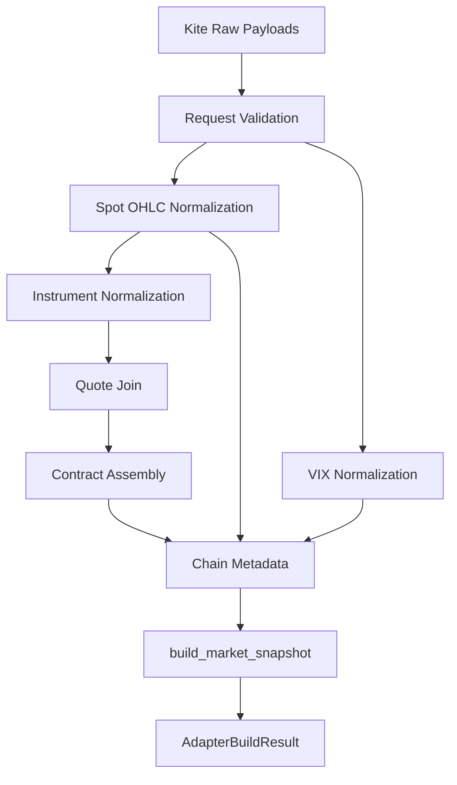

# Market Data Adapter — Software Engineering Specification

| Field | Value |
|---|---|
| **Module** | `market_data/market_data_adapter.py` |
| **Document version** | 1.0.0 |
| **Status** | Draft — ready for implementation |
| **Owner** | THETA AI TRADER Core Platform |
| **Last updated** | 2026-08-02 |

---

## 1. Purpose

`market_data/market_data_adapter.py` is the **exclusive broker-boundary normalization layer** for THETA AI TRADER.

It is the **only module in the entire platform** permitted to understand vendor-specific payload shapes (Zerodha Kite Connect v3 in v1). Every other module — engines, orchestrators, risk layers, execution layers — must consume **normalized immutable domain objects** from `market_data/market_snapshot.py`, never raw broker dictionaries.

The adapter translates:

```text
Broker Instrument Master  +  Broker Quote Payloads  +  Optional Pre-computed Greeks
                                    ↓
                    Normalization & Validation Pipeline
                                    ↓
           Immutable Domain Types (UnderlyingSnapshot, OptionContractSnapshot, …)
                                    ↓
                         MarketSnapshot (via build_market_snapshot)
                                    ↓
                         Downstream Intelligence Engines
```

### Goals

1. **Single broker knowledge surface** — eliminate duplicated Kite field parsing across `market_data_engine.py`, pipeline scripts, and legacy root-level `market_data_adapter.py`.
2. **Deterministic normalization** — identical broker inputs produce semantically identical domain outputs.
3. **Fail-closed data quality** — reject or explicitly record partial normalization; never silently coerce invalid broker data into trade-enabling structures.
4. **Institutional auditability** — structured adapter results with permission flags, rejection records, and stable error codes.
5. **Seamless integration** — direct production of `MarketSnapshot` instances validated by `market_data/market_snapshot.py`.

### Success criteria

- No production module outside `market_data/market_data_adapter.py` imports Kite field names (`last_price`, `instrument_type`, `depth.buy`, etc.).
- A pipeline run can call one adapter method and receive a validated `MarketSnapshot` or a structured rejection.
- Unit tests cover all normalization paths using broker-shaped fixtures without network access.
- Legacy dict-based adapter at repository root can be deprecated behind a thin compatibility shim.

### Relationship to other modules

| Module | Relationship |
|---|---|
| `market_data/market_snapshot.py` | **Downstream domain contract.** Adapter outputs map 1:1 into snapshot types; adapter calls `build_market_snapshot`. |
| `market_data_engine.py` (legacy) | **Upstream fetcher (external to adapter).** Fetches raw Kite payloads; must not normalize long term. |
| `market_data_adapter.py` (legacy root) | **Migration source.** Behaviour preserved; API replaced by immutable result types. |
| `market_data_safety.py` | **Separate concern.** Session/freshness rules live in snapshot module; adapter supplies timestamps. |
| `option_greeks_engine.py` | **Optional upstream of greeks_map.** Adapter attaches pre-computed Greeks when supplied; does not calculate Greeks. |
| `core/base_engine.py` | **Consumer contract.** Orchestrator places adapter-produced `MarketSnapshot` into `EngineContext.payload`. |
| `live_option_chain_pipeline.py` | **Migration consumer.** Must switch from inline normalization to adapter API. |

---

## 2. Responsibilities

`market_data/market_data_adapter.py` **is responsible for**:

| # | Responsibility | Description |
|---|---|---|
| R1 | **Broker payload ingestion** | Accept raw Kite instrument records, quote dictionaries, and optional Greeks maps as **already-fetched** inputs. |
| R2 | **Instrument normalization** | Map Kite instrument master fields to canonical instrument identity (underlying, exchange, symbol, expiry, strike, option type, tokens). |
| R3 | **Quote normalization** | Map Kite quote payloads to canonical price, depth, volume, OI, and timestamp fields. |
| R4 | **Index / spot OHLC normalization** | Map Kite index quote payloads to `UnderlyingSnapshot` including session OHLC when present. |
| R5 | **Volatility index normalization** | Map Kite VIX quote payloads to `VolatilitySnapshot`. |
| R6 | **Greeks attachment** | Merge optional pre-computed Greeks into `OptionContractSnapshot` fields without calculating Greeks. |
| R7 | **Option chain assembly** | Filter, match, deduplicate, and sort contracts into an immutable chain slice. |
| R8 | **Chain metadata derivation** | Compute ATM strike, strike step, strike window, contract counts, and complete pairs from normalized inputs. |
| R9 | **MarketSnapshot construction** | Invoke `build_market_snapshot` with normalized components and adapter provenance metadata. |
| R10 | **Structured adapter results** | Return immutable result types with permission flags, diagnostics, rejections, and counts. |
| R11 | **Validation at normalization boundary** | Reject malformed broker objects before they enter domain types. |
| R12 | **Error taxonomy** | Emit stable codes under `MARKET_DATA_ADAPTER.*`. |
| R13 | **Instrument utilities** | Expose expiry/strike discovery helpers used during chain assembly (ported from legacy adapter). |
| R14 | **Documentation contract** | Google-style docstrings; explicit broker field mapping tables in code comments referencing this spec. |

---

## 3. Non-Responsibilities

`market_data/market_data_adapter.py` **must not**:

| # | Non-responsibility | Rationale |
|---|---|---|
| NR1 | **Authenticate with Zerodha / Kite** | Credentials and token refresh belong in infrastructure fetch layers. |
| NR2 | **Perform HTTP / WebSocket I/O** | Adapter is pure transformation logic. |
| NR3 | **Read environment variables or config files** | Accept resolved policy objects and parameters at call time. |
| NR4 | **Calculate implied volatility or Greeks** | Belongs in `option_greeks_engine.py`; adapter only attaches supplied values. |
| NR5 | **Generate trading signals or permissions beyond data normalization** | `adapter_permission` reflects data readiness, not trade authorization. |
| NR6 | **Select strategies or contracts for trading** | Belongs in contract selection / decision engines. |
| NR7 | **Place, modify, or cancel orders** | Execution layer only; `broker_order_allowed` is always `False`. |
| NR8 | **Persist snapshots or write to disk** | Persistence is external. |
| NR9 | **Orchestrate pipelines or call engines** | Orchestrators invoke the adapter; adapter never calls engines. |
| NR10 | **Define canonical domain types** | Types live in `market_data/market_snapshot.py`. |
| NR11 | **Evaluate snapshot freshness or market session** | Delegated to `evaluate_snapshot_freshness` in snapshot module. |
| NR12 | **Parse non-Kite broker formats in v1** | Extension points reserved; v1 implements Kite Connect only. |

---

## 4. Public API

All symbols below are part of the stable public API unless marked *internal*.

### 4.1 Constants

| Symbol | Value / Type | Description |
|---|---|---|
| `MARKET_DATA_ADAPTER_VERSION` | `"1.0.0"` | Adapter semantic version recorded in snapshot provenance. |
| `SUPPORTED_BROKER` | `"KITE_CONNECT_V3"` | Broker format identifier for v1. |
| `VALID_DERIVATIVE_EXCHANGES` | `frozenset({"NFO", "BFO"})` | Allowed F&O exchanges. |
| `VALID_SPOT_EXCHANGES` | `frozenset({"NSE", "BSE"})` | Allowed cash/index exchanges. |
| `VALID_OPTION_TYPES` | `frozenset({OptionType.CE, OptionType.PE})` | Allowed option sides. |

### 4.2 Enumerations

| Enum | Values (v1) | Purpose |
|---|---|---|
| `AdapterPermission` | `ALLOW`, `PARTIAL`, `BLOCK` | Overall adapter outcome for orchestrators. |
| `AdapterRejectionReason` | See §16 | Machine-readable rejection categories. |
| `BrokerFormat` | `KITE_INSTRUMENT`, `KITE_QUOTE`, `KITE_INDEX_QUOTE` | Source payload type hints for normalization entry points. |

### 4.3 Immutable result types

| Type | Description |
|---|---|
| `AdapterErrorRecord` | Structured error: code, message, field, broker_field (optional). |
| `AdapterWarningRecord` | Non-fatal normalization warning. |
| `AdapterRejectionRecord` | One rejected instrument/contract with reason and errors. |
| `NormalizedInstrument` | Canonical instrument identity (internal to adapter pipeline, may be exported for testing). |
| `NormalizedQuote` | Canonical quote fields before contract assembly. |
| `OptionChainBuildResult` | Immutable chain build outcome: contracts tuple, metadata, rejections. |
| `AdapterBuildResult` | Top-level result: permission, snapshot (optional), diagnostics, rejections. |

### 4.4 Policy types

| Type | Description |
|---|---|
| `AdapterPolicy` | Frozen dataclass: strictness, minimum contracts, strike window, timezone defaults. |

### 4.5 Exceptions

| Symbol | Description |
|---|---|
| `AdapterConfigurationError` | Invalid static policy at construction. |
| `AdapterInputError` | Non-recoverable invalid request parameters before normalization. |

### 4.6 Primary class: `MarketDataAdapter`

Stateless service class. Configuration (policy) may be supplied at construction; no mutable run state.

| Method | Visibility | Description |
|---|---|---|
| `__init__(policy: AdapterPolicy \| None = None)` | Public | Optional default policy. |
| `build_quote_key(exchange, tradingsymbol) -> str \| None` | Public | Construct Kite quote lookup key (`NFO:SYMBOL`). |
| `normalize_instrument(raw) -> NormalizationResult[NormalizedInstrument]` | Public | Normalize one Kite instrument record. |
| `normalize_quote(raw) -> NormalizationResult[NormalizedQuote]` | Public | Normalize one Kite quote record. |
| `normalize_index_quote(raw, *, symbol, exchange, quote_key) -> NormalizationResult[UnderlyingSnapshot]` | Public | Normalize index/spot quote to `UnderlyingSnapshot`. |
| `normalize_vix_quote(raw, *, quote_key) -> NormalizationResult[VolatilitySnapshot]` | Public | Normalize India VIX quote. |
| `normalize_greeks(raw) -> NormalizedGreeks` | Public | Normalize optional Greeks dict; never raises for bad input. |
| `build_contract(instrument, quote, greeks=None) -> NormalizationResult[OptionContractSnapshot]` | Public | Merge instrument + quote + optional greeks into one contract snapshot. |
| `build_option_chain(...) -> OptionChainBuildResult` | Public | Build filtered, sorted contract tuple from instruments + quotes. |
| `build_market_snapshot_from_kite(...) -> AdapterBuildResult` | Public | **Primary entry point.** Full pipeline → `MarketSnapshot`. |
| `get_available_expiries(...) -> tuple[str, ...]` | Public | Sorted ISO expiry dates for underlying. |
| `get_nearest_expiry(...) -> str \| None` | Public | Nearest non-expired expiry. |
| `get_available_strikes(...) -> tuple[float, ...]` | Public | Sorted strikes for underlying + expiry. |
| `get_atm_strike(...) -> float \| None` | Public | Strike nearest spot. |
| `detect_strike_step(strikes) -> float \| None` | Public | Minimum positive strike increment. |
| `get_nearby_strikes(...) -> tuple[float, ...]` | Public | Strikes within window around spot. |

### 4.7 Module-level helpers (*internal* unless promoted)

| Symbol | Description |
|---|---|
| `_safe_float`, `_safe_int`, `_normalize_text` | Type coercion helpers. |
| `_normalize_expiry`, `_normalize_timestamp` | Date/time normalization. |
| `_extract_best_bid`, `_extract_best_ask` | Depth book extraction. |
| `_find_greeks` | Greeks map key resolution. |

Internal helpers are prefixed with `_` and are not semver-stable.

### 4.8 API stability rules

- Breaking changes to `AdapterBuildResult`, `build_market_snapshot_from_kite`, or field names on `OptionContractSnapshot` mapping require major version bump and `CHANGELOG.md` entry.
- New optional broker fields must map with defaults; existing callers remain valid.
- No public method may return mutable `list` or `dict` as primary output; use immutable tuples and frozen dataclasses.

---

## 5. Broker Normalization Pipeline

### 5.1 End-to-end pipeline

```text
[Inputs — already fetched externally]
    kite_instruments: Sequence[Mapping]
    kite_quotes: Mapping[str, Mapping]        # keys: "NFO:TRADINGSYMBOL"
    kite_spot_quote: Mapping | None           # e.g. kite.ltp / kite.quote for NSE:NIFTY 50
    kite_vix_quote: Mapping | None            # optional
    greeks_map: Mapping | None                # optional, keyed by quote_key or token
    request: AdapterBuildRequest              # underlying, expiry, exchange, window, correlation_id, as_of

[Stage 1 — Request validation]
    → validate request parameters
    → on failure: AdapterBuildResult(permission=BLOCK)

[Stage 2 — Spot / volatility normalization]
    → normalize_index_quote(kite_spot_quote) → UnderlyingSnapshot
    → normalize_vix_quote(kite_vix_quote) → VolatilitySnapshot | None
    → on hard spot failure: BLOCK

[Stage 3 — Instrument filtering]
    → for each raw instrument: normalize_instrument
    → filter by underlying, exchange, expiry, option type
    → deduplicate by quote_key

[Stage 4 — Quote join]
    → lookup kite_quotes[quote_key]
    → on missing quote: record AdapterRejectionRecord(QUOTE_NOT_FOUND)

[Stage 5 — Contract normalization]
    → normalize_quote + normalize_greeks + build_contract
    → produce OptionContractSnapshot

[Stage 6 — Chain metadata]
    → compute atm_strike, strike_step, min/max strike, complete_pairs

[Stage 7 — Domain assembly]
    → build_market_snapshot(...) in market_snapshot module
    → attach provenance: adapter_name="market_data_adapter", adapter_version

[Stage 8 — Result packaging]
    → AdapterBuildResult with permission ALLOW | PARTIAL | BLOCK
```

### 5.2 Pipeline diagram



### 5.3 Permission determination

| Condition | `AdapterPermission` |
|---|---|
| Valid snapshot built; zero rejections | `ALLOW` |
| Valid snapshot built; one or more rejections but meets `minimum_contracts` | `PARTIAL` |
| Invalid spot, empty valid chain, or below `minimum_contracts` | `BLOCK` |
| Request validation failed | `BLOCK` |

`broker_order_allowed` is **always** `False` on every result path.

### 5.4 Idempotency

Given identical inputs and policy, the adapter produces semantically equal `MarketSnapshot` and equal rejection sets. Contract ordering is deterministic (see §11).

---

## 6. Supported Broker Formats

### 6.1 v1 scope

| Format ID | Vendor | API | Usage |
|---|---|---|---|
| `KITE_CONNECT_V3` | Zerodha | Kite Connect REST v3 | Production default |

### 6.2 Kite instrument master record

Source: `kite.instruments("NFO")`, `kite.instruments("BFO")`, etc.

Expected fields (minimum):

| Kite field | Type | Required |
|---|---|---|
| `instrument_token` | int | Yes |
| `exchange_token` | int | No |
| `tradingsymbol` | str | Yes |
| `name` | str | Yes (underlying) |
| `expiry` | date / str | Yes (options) |
| `strike` | float | Yes (options) |
| `tick_size` | float | No |
| `lot_size` | int | Yes |
| `instrument_type` | str | Yes (`CE`, `PE`) |
| `segment` | str | No |
| `exchange` | str | Yes |

### 6.3 Kite quote record (derivatives)

Source: `kite.quote(["NFO:..."])`

Expected fields (minimum):

| Kite field | Type | Required |
|---|---|---|
| `instrument_token` | int | No |
| `timestamp` | datetime / str | No |
| `last_trade_time` | datetime / str | No |
| `last_price` | float | Yes |
| `last_quantity` | int | No |
| `volume` | int | No |
| `average_price` | float | No |
| `oi` | int | No |
| `oi_day_high` | int | No |
| `oi_day_low` | int | No |
| `buy_quantity` | int | No |
| `sell_quantity` | int | No |
| `depth` | dict | No |
| `depth.buy[]` | list | No |
| `depth.sell[]` | list | No |
| `depth.*.price` | float | No |
| `depth.*.quantity` | int | No |

### 6.4 Kite index / spot quote record

Source: `kite.ltp(["NSE:NIFTY 50"])` or `kite.quote(["NSE:NIFTY 50"])`

| Kite field | Type | Required |
|---|---|---|
| `last_price` | float | Yes |
| `ohlc` | dict | No |
| `ohlc.open` | float | No |
| `ohlc.high` | float | No |
| `ohlc.low` | float | No |
| `ohlc.close` | float | No (previous close) |
| `volume` | int | No |
| `timestamp` | datetime / str | No |

### 6.5 Kite Greeks map (optional input)

Not from Kite directly in v1; supplied by `option_greeks_engine.py` or forward engine.

Expected keys per entry: `delta`, `iv`, `gamma`, `theta`, `vega` (all optional floats).

Lookup keys (attempt order): `quote_key`, `tradingsymbol`, `instrument_token`, `str(instrument_token)`.

---

## 7. Canonical Field Mapping

### 7.1 Mapping principle

Every normalized field maps to exactly one domain type field in `market_data/market_snapshot.py`. The adapter **never** introduces parallel field names.

### 7.2 Instrument → domain identity

| Canonical field | Source (Kite instrument) | Domain target |
|---|---|---|
| `underlying` | `name` → uppercase strip | Used in filtering; copied to `OptionContractSnapshot.underlying` |
| `exchange` | `exchange` → uppercase strip | `OptionContractSnapshot.exchange` |
| `tradingsymbol` | `tradingsymbol` → uppercase strip | `OptionContractSnapshot.tradingsymbol` |
| `expiry` | `expiry` → ISO date | `OptionContractSnapshot.expiry` |
| `strike` | `strike` → float | `OptionContractSnapshot.strike` |
| `option_type` | `instrument_type` → `OptionType` | `OptionContractSnapshot.option_type` |
| `lot_size` | `lot_size` → int | `OptionContractSnapshot.lot_size` |
| `instrument_token` | `instrument_token` | `OptionContractSnapshot.instrument_token` |
| `exchange_token` | `exchange_token` | `OptionContractSnapshot.exchange_token` |
| `tick_size` | `tick_size` | `OptionContractSnapshot.tick_size` |
| `quote_key` | derived | Internal join key only |

### 7.3 Quote → `OptionContractSnapshot` market fields

| Domain field | Normalized quote field | Kite source |
|---|---|---|
| `ltp` | `ltp` | `last_price` |
| `bid` | `bid` | max valid `depth.buy[].price` |
| `ask` | `ask` | min valid `depth.sell[].price` |
| `volume` | `volume` | `volume` (default 0) |
| `open_interest` | `open_interest` | `oi` (default 0) |
| `quote_timestamp` | `timestamp` | `timestamp` or `last_trade_time` |
| `last_quantity` | `last_quantity` | `last_quantity` |
| `average_price` | `average_price` | `average_price` |
| `buy_quantity` | `buy_quantity` | `buy_quantity` |
| `sell_quantity` | `sell_quantity` | `sell_quantity` |
| `oi_day_high` | `oi_day_high` | `oi_day_high` |
| `oi_day_low` | `oi_day_low` | `oi_day_low` |

Missing bid/ask become `0.0` on the domain object; snapshot validation records warnings (see `market_snapshot` spec).

### 7.4 Index quote → `UnderlyingSnapshot`

| Domain field | Kite source |
|---|---|
| `symbol` | Request parameter (e.g. `"NIFTY 50"`) |
| `exchange` | Request parameter (e.g. `"NSE"`) |
| `quote_key` | Request parameter (e.g. `"NSE:NIFTY 50"`) |
| `last_price` | `last_price` |
| `open` | `ohlc.open` |
| `high` | `ohlc.high` |
| `low` | `ohlc.low` |
| `previous_close` | `ohlc.close` |
| `change` | computed: `last_price - previous_close` when both finite |
| `change_percent` | computed: `(change / previous_close) * 100` when `previous_close > 0` |
| `quote_timestamp` | `timestamp` |
| `volume` | `volume` |

### 7.5 VIX quote → `VolatilitySnapshot`

| Domain field | Kite source |
|---|---|
| `symbol` | `"INDIA VIX"` (constant for v1 NSE VIX) |
| `exchange` | `"NSE"` |
| `quote_key` | `"NSE:INDIA VIX"` |
| `last_price` | `last_price` |
| `quote_timestamp` | `timestamp` |

### 7.6 Greeks → `OptionContractSnapshot`

| Domain field | Greeks map key |
|---|---|
| `delta` | `delta` |
| `iv` | `iv` |
| `gamma` | `gamma` |
| `theta` | `theta` |
| `vega` | `vega` |

Non-finite values become `None`.

---

## 8. Timestamp Normalization

### 8.1 Rules

| Rule ID | Input | Output | Notes |
|---|---|---|---|
| T-001 | `None` | `None` | Allowed for optional timestamps. |
| T-002 | timezone-aware `datetime` | unchanged | Preferred input. |
| T-003 | naive `datetime` | attach `timezone.utc` | Never leave naive on domain objects. |
| T-004 | ISO 8601 string | `datetime.fromisoformat` | Must become timezone-aware per T-003. |
| T-005 | unparseable string | `None` + warning | Code: `MARKET_DATA_ADAPTER.TIMESTAMP.UNPARSEABLE`. |
| T-006 | Quote timestamp selection | `timestamp` first, else `last_trade_time` | Kite quote precedence. |

### 8.2 Domain requirement alignment

All `quote_timestamp` values placed on `UnderlyingSnapshot` and `OptionContractSnapshot` must be timezone-aware per `market_snapshot` validation.

### 8.3 Snapshot assembly timestamps

| Field | Source |
|---|---|
| `provenance.as_of` | `AdapterBuildRequest.as_of` (required, timezone-aware) |
| `provenance.captured_at` | `AdapterBuildRequest.captured_at` or wall-clock inject at orchestrator |

Adapter never generates `as_of` silently; orchestrator must supply decision time.

---

## 9. Symbol Normalization

### 9.1 Text normalization

```text
normalize_text(value) → str.upper(strip(str(value)))
```

Empty after strip → treated as missing.

### 9.2 Underlying symbols

| Kite `name` | Canonical underlying | Notes |
|---|---|---|
| `NIFTY` | `NIFTY` | Index options |
| `BANKNIFTY` | `BANKNIFTY` | |
| `FINNIFTY` | `FINNIFTY` | |
| `SENSEX` | `SENSEX` | BFO |

Request underlying must match normalized instrument `name`.

### 9.3 Tradingsymbol

- Uppercase, stripped, preserved as opaque broker identifier.
- Never parsed for strike/expiry in v1 (instrument master fields are authoritative).
- Used as fallback display key in rejection records.

### 9.4 Quote keys

Format: `{EXCHANGE}:{TRADINGSYMBOL}`

Examples:

- `NFO:NIFTY2680724300CE`
- `NSE:NIFTY 50`

Returns `None` when exchange or tradingsymbol missing → instrument rejection.

---

## 10. Expiry Normalization

### 10.1 Output format

All canonical expiries are **ISO 8601 date strings**: `YYYY-MM-DD`.

### 10.2 Input acceptance

| Input type | Handling |
|---|---|
| `datetime.date` | `.isoformat()` |
| `datetime.datetime` | `.date().isoformat()` |
| `str` | Parse with formats: `%Y-%m-%d`, `%d-%m-%Y`, `%Y/%m/%d`, `%d/%m/%Y` |
| Unparseable string | Pass through stripped (validation catches at snapshot layer) |

### 10.3 Expiry filtering

- Default: exclude expired expiries relative to `reference_date` (default `date.today()` in caller timezone or UTC date).
- `get_nearest_expiry` returns first sorted non-expired date.

### 10.4 Error codes

| Code | Condition |
|---|---|
| `MARKET_DATA_ADAPTER.EXPIRY.MISSING` | Missing on instrument |
| `MARKET_DATA_ADAPTER.EXPIRY.INVALID_FORMAT` | Cannot parse or empty |

---

## 11. Strike Normalization

### 11.1 Rules

| Rule ID | Condition | Outcome |
|---|---|---|
| K-001 | `strike` missing or non-numeric | Rejection: `INVALID_STRIKE` |
| K-002 | `strike <= 0` or non-finite | Rejection: `INVALID_STRIKE` |
| K-003 | Storage type | `float` on domain object |
| K-004 | Sort order | Ascending strike, then `OptionType` (CE before PE) |
| K-005 | ATM selection | `min(strikes, key=lambda s: (abs(s - spot), s))` |
| K-006 | Strike step | Minimum positive difference between consecutive sorted unique strikes |
| K-007 | Nearby window | `strikes_each_side` from policy; default 10 |

### 11.2 Strike window metadata

For `build_market_snapshot_from_kite`:

| Metadata field | Derivation |
|---|---|
| `atm_strike` | `get_atm_strike(...)` |
| `strike_step` | `detect_strike_step(available_strikes)` |
| `minimum_strike` | min strike in normalized contract set |
| `maximum_strike` | max strike in normalized contract set |
| `strike_window_strikes` | policy `strikes_each_side` |

---

## 12. OHLC Normalization

### 12.1 Scope

OHLC normalization applies to **index/spot quotes** only in v1 (NIFTY 50, BANKNIFTY, etc.). Option contracts do not carry OHLC on `OptionContractSnapshot`.

### 12.2 Rules

| Field | Source | Validation |
|---|---|---|
| `open` | `ohlc.open` | If present: finite and ≥ 0 |
| `high` | `ohlc.high` | If present: finite, ≥ 0, ≥ low when both present |
| `low` | `ohlc.low` | If present: finite and ≥ 0 |
| `previous_close` | `ohlc.close` | If present: finite and > 0 for change calc |
| `change` | computed | Only when `last_price` and `previous_close` valid |
| `change_percent` | computed | Only when `previous_close > 0` |

### 12.3 Missing OHLC

Missing `ohlc` object is **non-fatal**. `UnderlyingSnapshot` is built with `last_price` only; optional fields remain `None`.

### 12.4 Warning codes

| Code | Condition |
|---|---|
| `MARKET_DATA_ADAPTER.OHLC.INCONSISTENT` | `high < low` |
| `MARKET_DATA_ADAPTER.OHLC.MISSING` | No ohlc block (informational) |

---

## 13. Volume Normalization

### 13.1 Option quote volume

| Rule | Handling |
|---|---|
| Source field | Kite `volume` |
| Missing | Default `0` |
| Type | `int` |
| Validation | Must be ≥ 0; negative → rejection `INVALID_VOLUME` |

### 13.2 Index volume

| Rule | Handling |
|---|---|
| Source field | Kite `volume` on index quote |
| Missing | `None` on `UnderlyingSnapshot.volume` |
| Validation | If present, must be ≥ 0 |

### 13.3 Aggregate quantities

| Domain field | Kite source | Default |
|---|---|---|
| `buy_quantity` | `buy_quantity` | 0 |
| `sell_quantity` | `sell_quantity` | 0 |
| `last_quantity` | `last_quantity` | 0 |

---

## 14. OI Normalization

### 14.1 Open interest

| Rule | Handling |
|---|---|
| Source field | Kite `oi` |
| Missing | Default `0` |
| Type | `int` |
| Validation | Must be ≥ 0; negative → rejection `INVALID_OPEN_INTEREST` |

### 14.2 OI day range

| Domain field | Kite source | Default |
|---|---|---|
| `oi_day_high` | `oi_day_high` | 0 |
| `oi_day_low` | `oi_day_low` | 0 |

Non-negative validation applied; negative values clamped to 0 with warning `MARKET_DATA_ADAPTER.OI.NEGATIVE_CLAMPED`.

---

## 15. Greeks Normalization

### 15.1 Policy

- Greeks are **optional attachments** only.
- Adapter **never computes** Greeks.
- Invalid or missing Greeks map entries produce `None` on domain fields without rejection.

### 15.2 Field rules

| Field | Rule |
|---|---|
| `delta`, `gamma`, `theta`, `vega`, `iv` | `_safe_float`; non-finite → `None` |
| Missing map / key | All fields `None` |
| Non-dict greeks object | All fields `None` |

### 15.3 Lookup

Attempt keys in order:

1. `quote_key` (`NFO:...`)
2. `tradingsymbol`
3. `instrument_token` (int)
4. `str(instrument_token)`

First hit wins.

---

## 16. Error Taxonomy

All adapter errors use namespace:

```text
MARKET_DATA_ADAPTER.<CATEGORY>.<DETAIL>
```

### 16.1 Request errors

| Code | Description |
|---|---|
| `MARKET_DATA_ADAPTER.REQUEST.UNDERLYING_REQUIRED` | Empty underlying |
| `MARKET_DATA_ADAPTER.REQUEST.INVALID_EXCHANGE` | Exchange not in allowed set |
| `MARKET_DATA_ADAPTER.REQUEST.INSTRUMENTS_REQUIRED` | Missing instrument collection |
| `MARKET_DATA_ADAPTER.REQUEST.QUOTES_INVALID` | Quotes not a mapping |
| `MARKET_DATA_ADAPTER.REQUEST.INVALID_AS_OF` | Naive or missing as_of |
| `MARKET_DATA_ADAPTER.REQUEST.INVALID_OPTION_TYPES` | Unknown option type filter |

### 16.2 Instrument errors

| Code | Legacy equivalent |
|---|---|
| `MARKET_DATA_ADAPTER.INSTRUMENT.INVALID_OBJECT` | `INVALID_INSTRUMENT_OBJECT` |
| `MARKET_DATA_ADAPTER.INSTRUMENT.MISSING_UNDERLYING` | `MISSING_UNDERLYING` |
| `MARKET_DATA_ADAPTER.INSTRUMENT.INVALID_EXCHANGE` | `INVALID_EXCHANGE` |
| `MARKET_DATA_ADAPTER.INSTRUMENT.MISSING_TRADINGSYMBOL` | `MISSING_TRADINGSYMBOL` |
| `MARKET_DATA_ADAPTER.INSTRUMENT.INVALID_OPTION_TYPE` | `INVALID_OPTION_TYPE` |
| `MARKET_DATA_ADAPTER.INSTRUMENT.MISSING_EXPIRY` | `MISSING_EXPIRY` |
| `MARKET_DATA_ADAPTER.INSTRUMENT.INVALID_STRIKE` | `INVALID_STRIKE` |
| `MARKET_DATA_ADAPTER.INSTRUMENT.INVALID_LOT_SIZE` | `INVALID_LOT_SIZE` |
| `MARKET_DATA_ADAPTER.INSTRUMENT.MISSING_INSTRUMENT_TOKEN` | `MISSING_INSTRUMENT_TOKEN` |
| `MARKET_DATA_ADAPTER.INSTRUMENT.INVALID_TICK_SIZE` | `INVALID_TICK_SIZE` |
| `MARKET_DATA_ADAPTER.INSTRUMENT.DUPLICATE_QUOTE_KEY` | `DUPLICATE_QUOTE_KEY` |

### 16.3 Quote errors

| Code | Legacy equivalent |
|---|---|
| `MARKET_DATA_ADAPTER.QUOTE.INVALID_OBJECT` | `INVALID_QUOTE_OBJECT` |
| `MARKET_DATA_ADAPTER.QUOTE.INVALID_LTP` | `INVALID_LTP` |
| `MARKET_DATA_ADAPTER.QUOTE.INVALID_VOLUME` | `INVALID_VOLUME` |
| `MARKET_DATA_ADAPTER.QUOTE.INVALID_OPEN_INTEREST` | `INVALID_OPEN_INTEREST` |
| `MARKET_DATA_ADAPTER.QUOTE.MISSING_BID` | `MISSING_BID` |
| `MARKET_DATA_ADAPTER.QUOTE.MISSING_ASK` | `MISSING_ASK` |
| `MARKET_DATA_ADAPTER.QUOTE.INVERTED_MARKET` | `INVERTED_MARKET` |
| `MARKET_DATA_ADAPTER.QUOTE.NOT_FOUND` | `MISSING_QUOTE` |

### 16.4 Spot / VIX errors

| Code | Description |
|---|---|
| `MARKET_DATA_ADAPTER.SPOT.INVALID_OBJECT` | Spot quote not a dict |
| `MARKET_DATA_ADAPTER.SPOT.INVALID_PRICE` | Missing or non-positive last_price |
| `MARKET_DATA_ADAPTER.VIX.INVALID_PRICE` | VIX present but invalid |

### 16.5 Chain errors

| Code | Description |
|---|---|
| `MARKET_DATA_ADAPTER.CHAIN.NO_VALID_CONTRACTS` | Zero contracts after normalization |
| `MARKET_DATA_ADAPTER.CHAIN.BELOW_MINIMUM` | Contracts < policy.minimum_contracts |

### 16.6 `AdapterRejectionReason` enum (v1)

`INVALID_INSTRUMENT`, `QUOTE_NOT_FOUND`, `INVALID_QUOTE`, `DUPLICATE_INSTRUMENT`, `FILTERED_OUT`, `CONTRACT_BUILD_FAILED`.

---

## 17. Validation

### 17.1 Validation layers

| Layer | When | Failure mode |
|---|---|---|
| **Request validation** | Before normalization | `AdapterBuildResult(BLOCK)` |
| **Instrument validation** | Per instrument | Rejection record; continue chain |
| **Quote validation** | Per quote | Rejection record; continue chain |
| **Contract validation** | Per contract build | Rejection record; continue chain |
| **Snapshot validation** | After `build_market_snapshot` | Propagate `SnapshotBuildError` as `BLOCK` |

### 17.2 Strict vs lenient policy

`AdapterPolicy.strict: bool` (default `False`)

| Mode | Behaviour |
|---|---|
| Lenient | Missing bid/ask become `0.0`; warnings flow to snapshot quality |
| Strict | `MISSING_BID` / `MISSING_ASK` on quote → contract rejection |

### 17.3 Minimum contracts

`AdapterPolicy.minimum_contracts: int` (default `1`)

Chain with fewer valid contracts after normalization → `BLOCK`.

### 17.4 `NormalizationResult[T]` shape

Immutable generic result:

| Field | Type |
|---|---|
| `valid` | `bool` |
| `value` | `T \| None` |
| `errors` | `tuple[AdapterErrorRecord, ...]` |
| `warnings` | `tuple[AdapterWarningRecord, ...]` |

---

## 18. Performance Requirements

| Requirement | Target | Notes |
|---|---|---|
| Single instrument normalization | < 0.1 ms median | Excludes I/O |
| Single quote normalization | < 0.2 ms median | Includes depth scan |
| Full chain (42 contracts) | < 15 ms median | Filter + join + build |
| Full snapshot build (42 contracts) | < 25 ms median | Includes snapshot validation |
| Memory | O(n) over instruments + quotes | No unbounded caches |
| Hot path | Single pass over instruments | No O(n²) unless duplicate detection |

Benchmarks in `tests/test_market_data_adapter.py`.

---

## 19. Thread Safety

| Aspect | Requirement |
|---|---|
| `MarketDataAdapter` instance | Stateless after construction; policy immutable |
| Concurrent calls | Safe on same instance when policy is frozen |
| Global mutable state | Forbidden |
| Normalization helpers | Pure functions of inputs |
| Domain outputs | Immutable; safe to share across threads |

---

## 20. Security

| Concern | Requirement |
|---|---|
| Credentials | Never accepted, stored, or logged |
| Raw broker payloads in logs | DEBUG/TRACE only; INFO logs counts and permission flags |
| Injection via tradingsymbol | Treat as opaque string; no eval/exec |
| Untrusted input | All broker dicts validated before field access; no KeyError propagation |
| Secrets in results | Forbidden on adapter result types |
| Denial of service | Orchestrator should cap instrument list size before adapter call (recommended max 10,000 instruments per request) |

---

## 21. Testing Strategy

Tests live in `tests/test_market_data_adapter.py` (pytest).

### 21.1 Fixtures

| Fixture | Description |
|---|---|
| `kite_instrument_factory` | Builds Kite-shaped instrument dicts |
| `kite_quote_factory` | Builds Kite quote dicts with depth |
| `kite_index_quote_factory` | Builds NIFTY 50 quote with OHLC |
| `standard_nifty_chain` | 21-strike instrument + quote set |
| `fixed_timestamps` | Timezone-aware IST datetimes |

No network, broker credentials, or filesystem access.

### 21.2 Required test cases

| Category | Cases |
|---|---|
| **Instrument normalization** | Valid CE/PE; missing fields; invalid exchange; duplicate keys |
| **Quote normalization** | Valid depth; missing bid/ask; inverted market; negative volume/OI |
| **Timestamp normalization** | Naive datetime; ISO string; None; unparseable |
| **Expiry normalization** | date, datetime, multiple string formats |
| **Strike utilities** | ATM detection; strike step; nearby window |
| **OHLC normalization** | Full OHLC; missing ohlc; change calculation |
| **Greeks attachment** | Lookup by quote_key, token; invalid values → None |
| **Chain build** | Filter by underlying/expiry; rejections; deterministic sort |
| **Snapshot build** | End-to-end `MarketSnapshot`; provenance adapter fields |
| **Permission flags** | ALLOW, PARTIAL, BLOCK paths |
| **Legacy parity** | Key scenarios match root `test_market_data_adapter.py` expectations |
| **Thread smoke** | Parallel normalization without errors |
| **Performance smoke** | 42-contract build under threshold |

### 21.3 Coverage target

≥ 95% line coverage on `market_data/market_data_adapter.py`.

### 21.4 Integration tests

Optional: `tests/test_market_data_adapter_integration.py` with recorded Kite fixture files (no live API).

---

## 22. Migration from Legacy Engines

### 22.1 Legacy modules affected

| Legacy module | Current behaviour | Migration action |
|---|---|---|
| `market_data_adapter.py` (root) | Dict-based normalization | Deprecate; shim delegates to `market_data/market_data_adapter.py` |
| `market_data_engine.py` | Fetches + inline normalize | Fetch only; pass raw payloads to adapter |
| `live_option_chain_pipeline.py` | Inline Kite parsing | Replace with `build_market_snapshot_from_kite` |
| `live_oi_engine.py` | Legacy snapshot dicts | Consume `MarketSnapshot` from adapter |
| `option_snapshot_engine.py` | Dict persistence | Persist `to_json(snapshot)` |

### 22.2 API mapping (legacy → v1)

| Legacy method / output | v1 equivalent |
|---|---|
| `normalize_instrument()` → dict | `normalize_instrument()` → `NormalizationResult[NormalizedInstrument]` |
| `normalize_quote()` → dict | `normalize_quote()` → `NormalizationResult[NormalizedQuote]` |
| `build_contract()` → dict | `build_contract()` → `NormalizationResult[OptionContractSnapshot]` |
| `build_option_chain()` → dict with `contracts: list` | `build_option_chain()` → `OptionChainBuildResult` with immutable tuple |
| N/A | `normalize_index_quote()` → `UnderlyingSnapshot` |
| N/A | `build_market_snapshot_from_kite()` → `AdapterBuildResult.snapshot` |

### 22.3 Compatibility shim (transitional)

Optional thin wrapper in root `market_data_adapter.py`:

```text
LegacyMarketDataAdapter.build_option_chain(...)
    → calls market_data.market_data_adapter.MarketDataAdapter
    → converts immutable result back to legacy dict for callers not yet migrated
```

Shim must be marked deprecated in docstring and removed after migration milestone.

### 22.4 Migration sequence

1. Implement `market_data/market_data_adapter.py` per this spec.
2. Port unit tests from `test_market_data_adapter.py` to pytest suite.
3. Switch `live_option_chain_pipeline.py` to new adapter + snapshot.
4. Add compatibility shim for remaining callers.
5. Remove inline normalization from `market_data_engine.py`.
6. Delete shim after all callers migrated.

---

## 23. Future Extension Points

| Extension | Description |
|---|---|
| **Additional brokers** | `BrokerFormat` enum + pluggable normalizer registry (still single module entry point) |
| **WebSocket tick normalization** | Stream adapter methods returning incremental quote updates |
| **BANKNIFTY / FINNIFTY / SENSEX presets** | Underlying configuration objects without hardcoding in adapter body |
| **Corporate action adjustments** | Strike/expiry adjustment hooks on normalized instruments |
| **Extended OHLC on options** | If Kite exposes option OHLC in future API versions |
| **Async API** | `async def build_market_snapshot_from_kite_async` for concurrent quote joins |
| **Metrics** | Injectable recorder for normalization latency and rejection counts |
| **Content validation hashes** | Hash raw broker payload for audit replay |

Extensions must not move broker field knowledge into engine modules.

---

## 24. Definition of Done

The `market_data/market_data_adapter.py` module and this specification are **done** when all of the following are true:

### 24.1 Implementation

- [ ] All public API symbols in §4 implemented in `market_data/market_data_adapter.py`.
- [ ] All result and policy types are immutable (`frozen=True` dataclasses).
- [ ] Normalization output maps exactly to `market_data/market_snapshot.py` domain types.
- [ ] `build_market_snapshot_from_kite` produces validated `MarketSnapshot` on success.
- [ ] `broker_order_allowed` is always `False`.
- [ ] No broker I/O, env loading, or global mutable state.
- [ ] Stable error codes in §16 implemented.
- [ ] Google-style docstrings on all public surfaces.
- [ ] Type hints throughout; Python 3.12 compatible.
- [ ] No Kite field names referenced outside this module (verified by grep CI check).

### 24.2 Testing

- [ ] `tests/test_market_data_adapter.py` covers all cases in §21.2.
- [ ] Line coverage ≥ 95%.
- [ ] Legacy parity tests pass against key scenarios from root `test_market_data_adapter.py`.
- [ ] End-to-end snapshot build tested with `validate_market_snapshot` and `is_live_trade_ready`.
- [ ] Tests run deterministically in CI without external services.

### 24.3 Integration

- [ ] At least one pipeline path (`live_option_chain_pipeline.py` or orchestrator) uses new adapter.
- [ ] Compatibility shim documented if legacy callers remain.
- [ ] `CHANGELOG.md` updated with "Add institutional market data adapter under market_data package".

### 24.4 Documentation

- [ ] This specification matches implemented behaviour.
- [ ] Cross-link from `docs/specifications/market_snapshot.md` relationship table updated.
- [ ] Broker field mapping tables in spec match implementation.

### 24.5 Review checklist

- [ ] Correctness — all normalization rules enforced by tests.
- [ ] Readability — contributor can implement from spec alone.
- [ ] Architecture — sole broker boundary; engines receive only domain types.
- [ ] Security — no credentials; safe untrusted dict handling.
- [ ] Capital protection — BLOCK permission prevents silent bad data propagation.

### 24.6 Sign-off

- [ ] Peer review approved.
- [ ] Specification version bumped if API changed post-review.

---

## Appendix A — `AdapterBuildRequest` fields

| Field | Required | Type | Description |
|---|---|---|---|
| `underlying` | Yes | `str` | e.g. `"NIFTY"` |
| `as_of` | Yes | timezone-aware `datetime` | Decision timestamp |
| `correlation_id` | No | `str` | Pipeline correlation |
| `expiry` | No | `str` | ISO date filter; default nearest |
| `exchange` | No | `str` | Default `NFO` for index options |
| `strikes_each_side` | No | `int` | Default 10 |
| `option_types` | No | `tuple[OptionType, ...]` | Default CE+PE |
| `captured_at` | No | `datetime` | Default `as_of` |
| `source` | No | `SnapshotSource` | Default `LIVE` |
| `reference_date` | No | `date` | Expiry filtering |

---

## Appendix B — `AdapterBuildResult` fields

| Field | Type | Description |
|---|---|---|
| `permission` | `AdapterPermission` | ALLOW / PARTIAL / BLOCK |
| `adapter_allowed` | `bool` | `permission != BLOCK` |
| `reason` | `str` | Human-readable summary |
| `snapshot` | `MarketSnapshot \| None` | Present on ALLOW/PARTIAL |
| `validation_errors` | `tuple[AdapterErrorRecord, ...]` | Request-level errors |
| `rejections` | `tuple[AdapterRejectionRecord, ...]` | Per-contract rejections |
| `instrument_count` | `int` | Input instrument count |
| `matched_instruments` | `int` | Passed filters |
| `normalized_count` | `int` | Valid contracts |
| `rejected_count` | `int` | Rejection count |
| `broker_order_allowed` | `bool` | Always `False` |

---

## Appendix C — Example: Kite inputs → MarketSnapshot

Conceptual flow (not implementation code):

1. Orchestrator fetches `kite.instruments("NFO")`, `kite.quote([...])`, `kite.quote(["NSE:NIFTY 50", "NSE:INDIA VIX"])`.
2. Calls `adapter.build_market_snapshot_from_kite(...)` with `as_of=now(IST)`, `underlying="NIFTY"`, `strikes_each_side=10`.
3. Adapter returns `AdapterBuildResult(permission=ALLOW, snapshot=MarketSnapshot(...))`.
4. Orchestrator calls `is_live_trade_ready(snapshot)` before trade-enabling engines.
5. Engines receive `EngineContext(payload=snapshot)` — no Kite fields visible.

---

## Appendix D — Glossary

| Term | Definition |
|---|---|
| **Broker boundary** | The single module allowed to parse vendor payloads. |
| **Normalization** | Deterministic mapping from broker fields to domain types. |
| **Rejection** | One instrument/quote that failed normalization; recorded, not silently dropped without trace. |
| **Permission** | Adapter-level data readiness flag distinct from trade authorization. |
| **Quote key** | Kite dictionary key format `EXCHANGE:TRADINGSYMBOL`. |

---

## Appendix E — Related documents

- `docs/specifications/market_snapshot.md`
- `docs/specifications/base_engine.md`
- `.cursor/rules/theta-ai-trader-engineering-standards.mdc`
- `.cursor/rules/theta-ai-trader-trading-architecture.mdc`
- `.cursor/rules/theta-ai-trader-development-workflow.mdc`
- `docs/foundation/THETA_AI_TRADER_ARCHITECTURE.md`

---

## Appendix F — Revision history

| Version | Date | Author | Changes |
|---|---|---|---|
| 1.0.0 | 2026-08-02 | THETA AI TRADER | Initial specification |
