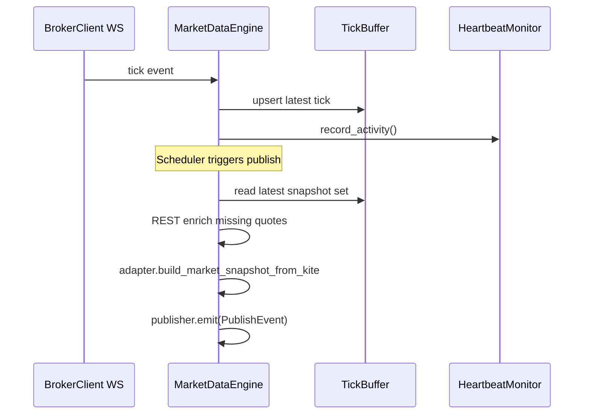

# Market Data Engine — Software Engineering Specification

| Field | Value |
|---|---|
| **Module** | `market_data/market_data_engine.py` |
| **Document version** | 1.0.0 |
| **Status** | Draft — ready for implementation |
| **Owner** | THETA AI TRADER Core Platform |
| **Last updated** | 2026-08-02 |

---

## 1. Purpose

`market_data/market_data_engine.py` is the **institutional market data acquisition and publishing engine** for THETA AI TRADER.

It sits between an **already-authenticated broker transport client** (Kite Connect REST + WebSocket in v1) and the **normalization layer** (`market_data/market_data_adapter.py`). Its sole mission is to:

1. **Acquire** live and snapshot-oriented market data from the broker.
2. **Validate** transport-level integrity (connectivity, subscription health, tick completeness thresholds).
3. **Buffer** incoming ticks and quote updates safely under concurrency.
4. **Publish** immutable `MarketSnapshot` instances to downstream consumers.

The engine is the runtime **data plane**. It does not interpret markets, does not trade, and does not normalize broker field shapes — that belongs to the adapter.

### Pipeline placement

```text
[Credential / Session Layer — external]
    kite_login.py, token refresh, inject authenticated BrokerClient
              ↓
[market_data/market_data_engine.py]
    REST fetch + WebSocket subscribe + tick buffer + snapshot cadence
              ↓ raw Kite payloads (dicts)
[market_data/market_data_adapter.py]
    normalize → MarketSnapshot
              ↓
[Orchestrator / Intelligence Engines]
    EngineContext.payload = MarketSnapshot
```

### Goals

1. Replace legacy root-level `market_data_engine.py` (mixed fetch + inline normalize + env loading) with a focused acquisition engine under `market_data/`.
2. Provide production-grade WebSocket tick handling with reconnection, heartbeat monitoring, and thread-safe buffering.
3. Publish cadence-controlled `MarketSnapshot` objects integrated with adapter and snapshot validation.
4. Fail closed when connectivity or data completeness is insufficient for live publishing.
5. Enable deterministic testing via injectable broker client fakes — no live broker required in unit tests.

### Success criteria

- Orchestrator can subscribe to `MarketSnapshot` publications without touching Kite SDK types.
- No normalization logic or Kite field parsing exists in this module.
- WebSocket disconnects recover automatically within policy bounds without silent data gaps.
- Every published snapshot traceable via `correlation_id` and engine metrics.
- Legacy callers (`live_oi_engine.py`, pipelines) can migrate to injected engine + publisher interface.

### Relationship to other modules

| Module | Relationship |
|---|---|
| `market_data/market_data_adapter.py` | **Downstream normalizer.** Engine passes raw payloads; adapter returns `AdapterBuildResult` with `MarketSnapshot`. |
| `market_data/market_snapshot.py` | **Published domain type.** Engine outputs snapshots only through adapter; never constructs snapshot fields directly. |
| `market_data_engine.py` (legacy root) | **Migration source.** REST helpers and env loading deprecated; behaviour split between injectors and this module. |
| `market_data_safety.py` | **Collaborator.** Freshness/session rules applied on snapshots after adapter build; engine may consult for publish gating. |
| `core/base_engine.py` | **Pattern reference.** Engine is infrastructure, not an analytical `BaseEngine` subclass in v1; may align later. |
| `kite_login.py` / token utilities | **External auth.** Provide authenticated `BrokerClient`; engine never loads credentials. |

---

## 2. Responsibilities

`market_data/market_data_engine.py` **is responsible for**:

| # | Responsibility | Description |
|---|---|---|
| R1 | **Broker transport orchestration** | Coordinate REST calls and WebSocket subscriptions through an injected `BrokerClient` interface. |
| R2 | **Connection lifecycle** | Establish, monitor, and tear down broker connections deterministically. |
| R3 | **Subscription management** | Subscribe/unsubscribe instrument tokens and quote keys per configured universe. |
| R4 | **Tick ingestion** | Receive WebSocket ticks and quote updates; hand off to tick buffer. |
| R5 | **Tick buffering** | Thread-safe, bounded in-memory buffer keyed by instrument token / quote key. |
| R6 | **Snapshot assembly trigger** | On timer, manual request, or completeness threshold, gather buffered + REST snapshot data. |
| R7 | **Adapter invocation** | Call `MarketDataAdapter.build_market_snapshot_from_kite` with raw payloads and `AdapterBuildRequest`. |
| R8 | **Snapshot publishing** | Emit immutable `MarketSnapshot` (or structured failure) to registered subscribers. |
| R9 | **Transport validation** | Validate connectivity, heartbeat freshness, minimum subscribed instrument coverage before publish. |
| R10 | **Reconnection** | Reconnect WebSocket and resubscribe after failure with exponential backoff. |
| R11 | **Heartbeat monitoring** | Detect stale streams; mark connection degraded before publishing unsafe snapshots. |
| R12 | **Historical REST fetch (optional v1)** | Fetch raw historical candles/OHLCV via REST for non-live consumers; return broker-native payloads without indicator processing. |
| R13 | **Instrument master cache** | Cache `kite.instruments()` results in-memory with TTL for subscription and REST quote batching. |
| R14 | **Structured diagnostics** | Expose connection status, subscription counts, buffer stats, last publish outcome. |
| R15 | **Error taxonomy** | Stable codes under `MARKET_DATA_ENGINE.*`. |
| R16 | **Logging and metrics hooks** | Standard event names for connect, disconnect, publish, reconnect. |

---

## 3. Non-Responsibilities

`market_data/market_data_engine.py` **must not**:

| # | Non-responsibility | Rationale |
|---|---|---|
| NR1 | **Authenticate with broker** | Login, OAuth, token refresh, API key loading belong in external infrastructure. |
| NR2 | **Read environment variables or config files** | Accept injected `MarketDataEngineConfig` and `BrokerClient` at construction. |
| NR3 | **Normalize broker payloads** | Exclusive responsibility of `market_data/market_data_adapter.py`. |
| NR4 | **Define `MarketSnapshot` fields** | Domain model lives in `market_data/market_snapshot.py`. |
| NR5 | **Calculate indicators** | Belongs in `indicator_engine.py` and similar. |
| NR6 | **Calculate Greeks or IV** | Belongs in Greeks / forward engines. |
| NR7 | **Market intelligence or regime detection** | Analytical engines only. |
| NR8 | **Strategy selection or signal generation** | Decision engines only. |
| NR9 | **Risk scoring or position sizing** | Risk layer only. |
| NR10 | **Place, modify, or cancel orders** | Execution layer only. |
| NR11 | **Persist snapshots to disk** | Optional external persistence (`option_snapshot_engine.py`). |
| NR12 | **Call analytical engines directly** | Orchestrator consumes published snapshots. |
| NR13 | **Evaluate trade permissions** | Freshness gating uses snapshot helpers; trade authority stays downstream. |

---

## 4. Architecture

### 4.1 Layered design

```text
┌─────────────────────────────────────────────────────────────┐
│                    MarketDataEngine                          │
│  ┌─────────────┐ ┌──────────────┐ ┌────────────────────────┐ │
│  │ Connection  │ │ Subscription │ │ SnapshotPublishScheduler│ │
│  │ Manager     │ │ Manager      │ │                         │ │
│  └──────┬──────┘ └──────┬───────┘ └───────────┬────────────┘ │
│         │               │                     │              │
│  ┌──────▼───────────────▼─────────────────────▼────────────┐ │
│  │                    TickBuffer                            │ │
│  └──────────────────────────┬──────────────────────────────┘ │
│                             │ assemble raw payload batch      │
│  ┌──────────────────────────▼──────────────────────────────┐ │
│  │              MarketDataAdapter (injected)                │ │
│  └──────────────────────────┬──────────────────────────────┘ │
└─────────────────────────────┼────────────────────────────────┘
                              │ MarketSnapshot
                    ┌─────────▼─────────┐
                    │ SnapshotPublisher │
                    └─────────┬─────────┘
                              │ subscribers
                    Orchestrator / Engines
```

### 4.2 Component responsibilities

| Component | Role |
|---|---|
| `BrokerClient` | Abstract transport (REST + WebSocket). Implemented by Kite adapter outside this module or in `market_data/broker/kite_client.py`. |
| `ConnectionManager` | Owns connect/disconnect, delegates to `BrokerClient`. |
| `SubscriptionManager` | Maintains desired vs active subscription sets. |
| `TickBuffer` | Latest-tick store per instrument; thread-safe updates. |
| `HeartbeatMonitor` | Tracks last message time; emits degraded status. |
| `ReconnectionManager` | Backoff policy and resubscribe orchestration. |
| `SnapshotPublishScheduler` | Timer/event-driven publish cadence. |
| `SnapshotAssembler` | Builds raw payload bundle for adapter from buffer + REST. |
| `MarketDataAdapter` | Injected normalizer producing `MarketSnapshot`. |
| `SnapshotPublisher` | Fan-out to subscribers with immutable events. |

### 4.3 Design principles

- **Dependency injection** — no global broker singleton; test with fakes.
- **Immutability at boundary** — published snapshots are frozen; buffer holds mutable latest state internally but never leaks references.
- **Fail closed** — do not publish when connection degraded below policy unless explicit `force_publish` override for analysis mode.
- **Separation of transport vs domain** — engine knows instrument tokens and quote keys; adapter knows Kite field names.
- **Single writer for publish path** — one assembly thread/task avoids duplicate snapshots with same `as_of`.

### 4.4 Module dependencies (allowed)

| Dependency | Usage |
|---|---|
| `market_data.market_data_adapter` | Snapshot assembly |
| `market_data.market_snapshot` | Published type, `is_live_trade_ready` for optional gating |
| `market_data.market_data_safety` | Optional publish-time session consult |
| Standard library | threading, asyncio (v1 may use threading), logging, datetime, collections |
| **Not allowed in this module** | `kiteconnect` direct import in v1 target — must go through `BrokerClient` interface for testability |

Note: v1 implementation may wrap `kiteconnect` inside `KiteBrokerClient` in a sibling module; `market_data_engine.py` depends only on `BrokerClient` protocol.

---

## 5. Public API

### 5.1 Constants

| Symbol | Value | Description |
|---|---|---|
| `MARKET_DATA_ENGINE_VERSION` | `"1.0.0"` | Engine semantic version. |
| `ENGINE_NAME` | `"market_data"` | Stable identifier for logs/metrics. |
| `DEFAULT_PUBLISH_INTERVAL_SECONDS` | `1.0` | Default snapshot cadence during live session. |
| `DEFAULT_INSTRUMENT_CACHE_TTL_SECONDS` | `86400` | Instrument master cache TTL (24h). |

### 5.2 Enumerations

| Enum | Values (v1) | Purpose |
|---|---|---|
| `ConnectionStatus` | `DISCONNECTED`, `CONNECTING`, `CONNECTED`, `DEGRADED`, `RECONNECTING` | Transport health. |
| `PublishMode` | `LIVE`, `ANALYSIS`, `BACKTEST` | Controls fail-closed strictness. |
| `PublishOutcome` | `PUBLISHED`, `SKIPPED`, `FAILED` | Last publish attempt result. |
| `SubscriptionState` | `PENDING`, `ACTIVE`, `FAILED`, `UNSUBSCRIBED` | Per-instrument subscription tracking. |

### 5.3 Immutable configuration and policy types

| Type | Description |
|---|---|
| `MarketDataEngineConfig` | Frozen dataclass: universe, publish interval, buffer limits, reconnect policy, heartbeat thresholds. |
| `ReconnectPolicy` | Frozen: max attempts, initial delay, max delay, jitter. |
| `HeartbeatPolicy` | Frozen: max silence seconds, check interval. |
| `UniverseConfig` | Frozen: underlying, exchange, strikes_each_side, include_vix, spot_quote_key. |

### 5.4 Event and result types

| Type | Description |
|---|---|
| `EngineErrorRecord` | Structured error: code, message, field, recoverable. |
| `ConnectionInfo` | Immutable connection snapshot: status, since, last_error, reconnect_attempt. |
| `BufferStats` | Immutable: instrument_count, tick_count, oldest_tick_age, memory_estimate. |
| `PublishEvent` | Immutable: outcome, snapshot (optional), adapter_result (optional), correlation_id, as_of. |
| `SubscriptionRecord` | Immutable: instrument_token, quote_key, state, subscribed_at. |

### 5.5 Exceptions

| Symbol | Description |
|---|---|
| `MarketDataEngineConfigurationError` | Invalid config at construction. |
| `MarketDataEngineConnectionError` | Unrecoverable connection failure. |
| `MarketDataEnginePublishError` | Publish aborted due to engine policy (not adapter BLOCK). |

### 5.6 `BrokerClient` protocol (injected)

| Method | Description |
|---|---|
| `connect() -> None` | Open REST session + WebSocket. |
| `disconnect() -> None` | Clean shutdown. |
| `is_connected() -> bool` | Connection probe. |
| `fetch_instruments(exchange: str) -> Sequence[Mapping]` | Instrument master download. |
| `fetch_quotes(keys: Sequence[str]) -> Mapping[str, Mapping]` | REST quote batch. |
| `fetch_ltp(keys: Sequence[str]) -> Mapping[str, Mapping]` | REST LTP batch. |
| `subscribe(tokens: Sequence[int]) -> None` | WebSocket subscribe. |
| `unsubscribe(tokens: Sequence[int]) -> None` | WebSocket unsubscribe. |
| `set_tick_handler(callback) -> None` | Register tick callback. |
| `set_error_handler(callback) -> None` | Register transport error callback. |
| `fetch_historical(...) -> Sequence[Mapping]` | Optional REST historical candles. |

### 5.7 Primary class: `MarketDataEngine`

| Method | Visibility | Description |
|---|---|---|
| `__init__(config, broker_client, adapter, publisher, *, safety=None)` | Public | Wire dependencies; validate config. |
| `start() -> None` | Public | Connect, load instruments, subscribe, start scheduler. |
| `stop() -> None` | Public | Unsubscribe, disconnect, stop scheduler; idempotent. |
| `publish_snapshot(*, correlation_id, as_of, force=False) -> PublishEvent` | Public | Manual one-shot publish. |
| `get_connection_info() -> ConnectionInfo` | Public | Current connection diagnostics. |
| `get_buffer_stats() -> BufferStats` | Public | Buffer metrics. |
| `get_subscriptions() -> tuple[SubscriptionRecord, ...]` | Public | Active subscription snapshot. |
| `refresh_instruments() -> int` | Public | Force instrument master reload; returns count. |
| `fetch_historical_candles(request) -> HistoricalCandleResult` | Public | Raw REST historical fetch; no normalization. |
| `add_subscriber(callback) -> None` | Public | Register snapshot subscriber on publisher. |
| `remove_subscriber(callback) -> None` | Public | Unregister subscriber. |

Internal components may be private classes in the same module or submodules; public surface is `MarketDataEngine` + types above.

### 5.8 API stability

- Breaking changes to `PublishEvent`, `MarketDataEngine.start/stop`, or `BrokerClient` protocol require major version bump.
- New optional config fields must have defaults.

---

## 6. Engine Lifecycle

### 6.1 Instance lifecycle

```text
[Construction]
    → validate MarketDataEngineConfig
    → store immutable dependencies (broker, adapter, publisher)
    → state = STOPPED

[start()]
    → ConnectionManager.connect()
    → load instrument master (cache-aware)
    → SubscriptionManager.compute_universe()
    → subscribe WebSocket tokens
    → start HeartbeatMonitor
    → start SnapshotPublishScheduler
    → state = RUNNING

[Running]
    → ticks → TickBuffer
    → scheduler → assemble → adapter → publish
    → heartbeat / reconnect loops active

[stop()]
    → stop scheduler
    → unsubscribe all
    → disconnect
    → state = STOPPED
```

### 6.2 State machine

| State | Allowed transitions |
|---|---|
| `STOPPED` | → `STARTING` via `start()` |
| `STARTING` | → `RUNNING` or → `STOPPED` on failure |
| `RUNNING` | → `STOPPING` via `stop()`; internal `DEGRADED` flag |
| `STOPPING` | → `STOPPED` |
| `DEGRADED` (overlay) | While `RUNNING`; may block LIVE publish |

### 6.3 Idempotency

- `start()` on `RUNNING` is no-op with warning log.
- `stop()` on `STOPPED` is no-op.

---

## 7. Connection Lifecycle

### 7.1 Connect sequence

1. Validate `BrokerClient.is_connected()` false.
2. Set status `CONNECTING`.
3. Invoke `broker_client.connect()`.
4. Verify with lightweight REST probe (`fetch_ltp` on spot key).
5. Set status `CONNECTED`; record `connected_at`.

### 7.2 Disconnect sequence

1. Set status `DISCONNECTING` (internal).
2. Cancel in-flight publish assembly (optional flag; do not partial-publish).
3. `broker_client.disconnect()`.
4. Set status `DISCONNECTED`.

### 7.3 Connection validation rules

| Rule ID | Condition | Action |
|---|---|---|
| C-001 | REST probe returns empty for spot key | Fail connect; raise `MarketDataEngineConnectionError` |
| C-002 | Spot LTP ≤ 0 in probe | Fail connect |
| C-003 | WebSocket not connected after subscribe phase | Status `DEGRADED`; LIVE publish blocked |
| C-004 | Connect timeout exceeded | Fail with `MARKET_DATA_ENGINE.CONNECTION.TIMEOUT` |

Default connect timeout: 15 seconds.

### 7.4 Degraded mode

Connection is `DEGRADED` when:

- WebSocket silent beyond heartbeat threshold, or
- WebSocket disconnected but REST still works, or
- Subscription mismatch (active < desired by policy threshold).

In `DEGRADED` + `PublishMode.LIVE`: skip scheduled publish unless REST fallback completes full quote set.

---

## 8. Subscription Management

### 8.1 Universe resolution

Given `UniverseConfig`:

1. Load NFO instruments for `underlying` from instrument cache.
2. Resolve nearest expiry via adapter helper (`get_nearest_expiry`).
3. Resolve strikes via adapter helper (`get_nearby_strikes` using latest spot from REST or buffer).
4. Collect CE + PE instrument tokens for selected strikes.
5. Add spot index token and optional VIX token.

### 8.2 Subscription sets

| Set | Description |
|---|---|
| `desired_tokens` | Computed from universe resolution |
| `active_tokens` | Acknowledged by broker WebSocket |
| `failed_tokens` | Subscribe failures with retry schedule |

### 8.3 Subscribe workflow

```text
compute desired_tokens
    → diff against active_tokens
    → broker_client.subscribe(new_tokens)
    → mark PENDING → ACTIVE on first tick or broker ack
    → on failure: mark FAILED, schedule retry
```

### 8.4 Unsubscribe workflow

On `stop()` or universe change:

```text
broker_client.unsubscribe(active_tokens)
    → clear active set
    → optionally prune buffer entries
```

### 8.5 Universe refresh

- Recompute on: manual `refresh_instruments()`, spot move beyond `universe_rebalance_strike_steps` (default 2), or expiry roll detected.
- Rebalance must be atomic: subscribe new before unsubscribe old when possible to minimize gap.

### 8.6 Limits

| Parameter | Default | Notes |
|---|---|---|
| `max_subscriptions` | `200` | NIFTY ±10 CE/PE + spot + VIX ≈ 43; headroom for BANKNIFTY |
| `subscribe_batch_size` | `50` | Kite batch subscribe limit compliance |

---

## 9. WebSocket Event Flow

### 9.1 Event types (Kite v1)

| Event | Handler | Action |
|---|---|---|
| `tick` | `_on_tick` | Parse minimal fields; update `TickBuffer` |
| `error` | `_on_ws_error` | Log; trigger reconnect evaluation |
| `close` | `_on_ws_close` | Mark degraded; start reconnect |
| `reconnect` | `_on_ws_reconnect` | Resubscribe; reset heartbeat |

Engine stores only transport-normalized tick records internally:

| Field | Source |
|---|---|
| `instrument_token` | tick payload |
| `last_price` | tick payload |
| `timestamp` | exchange timestamp or receive time |
| `volume` | optional |
| `oi` | optional mode |
| `received_at` | local monotonic clock |

Full Kite tick dict may be retained in buffer for adapter REST-shaped assembly — engine does not interpret fields beyond token, price, time, volume, oi.

### 9.2 Event flow diagram



### 9.3 Threading model for callbacks

- WebSocket callbacks run on broker client thread (Kite ticker thread).
- `_on_tick` must delegate quickly: parse → buffer lock → return.
- Heavy work (REST batch, adapter) runs on publish worker thread only.

---

## 10. Tick Buffer Design

### 10.1 Purpose

Hold **latest known tick state** per subscribed instrument between snapshot publishes. Not a full tick history database in v1.

### 10.2 Structure

```text
TickBuffer
├── entries: Mapping[int, TickEntry]     # keyed by instrument_token
├── quote_key_index: Mapping[str, int]   # reverse lookup
├── lock: threading.RLock
└── max_entries: int                     # policy limit
```

### 10.3 `TickEntry` (immutable)

| Field | Type | Description |
|---|---|---|
| `instrument_token` | `int` | Broker token |
| `quote_key` | `str` | `EXCHANGE:SYMBOL` |
| `last_price` | `float` | Latest LTP |
| `timestamp` | `datetime` | Exchange or receive time (timezone-aware) |
| `volume` | `int` | Optional cumulative session volume |
| `oi` | `int` | Optional OI when mode includes it |
| `received_at` | `datetime` | Local receive timestamp |
| `raw_tick` | `Mapping` | Opaque broker tick for adapter assembly |

### 10.4 Operations

| Operation | Complexity | Notes |
|---|---|---|
| `upsert(tick)` | O(1) | Overwrites previous entry for token |
| `get(token)` | O(1) | Returns copy or immutable entry |
| `snapshot_tokens(tokens)` | O(n) | Batch read for publish assembly |
| `prune(not_in)` | O(n) | Remove stale universe tokens |
| `stats()` | O(n) | BufferStats |

### 10.5 Eviction policy

- Entries not in `desired_tokens` for > `stale_entry_ttl_seconds` (default 300) are pruned on scheduler tick.
- When `max_entries` exceeded, reject new tokens with warning (should not happen if universe enforced).

### 10.6 Consistency rules

- Buffer never returns mutable `raw_tick` references; copy-on-read or immutable mapping wrapper.
- Missing token at publish time triggers REST `fetch_quotes` fallback for that key.

---

## 11. Snapshot Publishing

### 11.1 Publish triggers

| Trigger | Description |
|---|---|
| **Scheduled** | Every `publish_interval_seconds` while `RUNNING` and session open |
| **Manual** | `publish_snapshot(correlation_id=..., as_of=...)` |
| **Completeness** | Optional: first tick received for all desired tokens (initial publish) |

### 11.2 Assembly pipeline

```text
[SnapshotAssembler]
    1. Determine as_of (explicit or now timezone-aware IST)
    2. Read spot/VIX from buffer or REST LTP
    3. Read option ticks from buffer for desired tokens
    4. Build kite_quotes mapping (merge tick → quote shape via internal mapper)
    5. REST fetch_quotes for missing / stale keys
    6. Build AdapterBuildRequest from config + correlation_id + as_of
    7. adapter.build_market_snapshot_from_kite(...)
    8. If permission BLOCK → PublishEvent FAILED (no snapshot)
    9. If ALLOW/PARTIAL → emit PublishEvent with snapshot
```

### 11.3 Internal tick-to-quote mapping

Engine contains **minimal transport mapping** (not adapter-level normalization):

- Maps buffered tick + optional REST depth into Kite quote dict shape expected by adapter.
- This is transport assembly, not domain normalization.
- Field mapping table maintained in engine spec appendix only; adapter remains authoritative on validation.

### 11.4 Publish gating (LIVE mode)

Do not publish when:

| Condition | Outcome |
|---|---|
| Connection `DISCONNECTED` | `SKIPPED` |
| Connection `DEGRADED` and REST fallback incomplete | `SKIPPED` |
| `AdapterBuildResult.permission == BLOCK` | `FAILED` |
| `MarketDataSafety.is_market_open` false and mode LIVE | `SKIPPED` (optional; ANALYSIS mode overrides) |
| Less than `minimum_publish_coverage_ratio` of desired tokens have ticks | `SKIPPED` |

Default `minimum_publish_coverage_ratio`: `0.90`.

### 11.5 `SnapshotPublisher`

- Thread-safe subscriber list.
- Synchronous callback invocation on publish thread by default; async queue optional extension.
- Subscribers receive `PublishEvent`; must not block.
- Subscriber exceptions caught and logged; do not abort other subscribers.

### 11.6 Correlation and provenance

Every publish must set:

- `AdapterBuildRequest.correlation_id` from orchestrator or auto-generated UUID.
- `AdapterBuildRequest.as_of` explicit timezone-aware timestamp.
- `AdapterBuildRequest.source = SnapshotSource.LIVE` for live engine path.

---

## 12. Error Handling

### 12.1 Error taxonomy

Namespace: `MARKET_DATA_ENGINE.<CATEGORY>.<DETAIL>`

| Code | Description |
|---|---|
| `MARKET_DATA_ENGINE.CONFIG.INVALID` | Bad engine config |
| `MARKET_DATA_ENGINE.CONNECTION.TIMEOUT` | Connect timeout |
| `MARKET_DATA_ENGINE.CONNECTION.FAILED` | Unrecoverable connect failure |
| `MARKET_DATA_ENGINE.CONNECTION.DISCONNECTED` | Unexpected disconnect |
| `MARKET_DATA_ENGINE.WEBSOCKET.ERROR` | WebSocket error event |
| `MARKET_DATA_ENGINE.SUBSCRIBE.FAILED` | Subscribe batch failure |
| `MARKET_DATA_ENGINE.SUBSCRIBE.LIMIT_EXCEEDED` | Too many instruments |
| `MARKET_DATA_ENGINE.BUFFER.OVERFLOW` | Buffer capacity exceeded |
| `MARKET_DATA_ENGINE.PUBLISH.SKIPPED_DEGRADED` | Degraded connection skip |
| `MARKET_DATA_ENGINE.PUBLISH.SKIPPED_COVERAGE` | Insufficient tick coverage |
| `MARKET_DATA_ENGINE.PUBLISH.ADAPTER_BLOCK` | Adapter returned BLOCK |
| `MARKET_DATA_ENGINE.PUBLISH.ASSEMBLY_FAILED` | REST/instrument failure during assembly |
| `MARKET_DATA_ENGINE.HEARTBEAT.STALE` | Heartbeat threshold exceeded |
| `MARKET_DATA_ENGINE.RECONNECT.EXHAUSTED` | Max reconnect attempts reached |

### 12.2 Exception vs event policy

| Scenario | Behavior |
|---|---|
| Invalid config at init | Raise `MarketDataEngineConfigurationError` |
| Connect failure at start | Raise `MarketDataEngineConnectionError`; remain STOPPED |
| Runtime publish failure | Return `PublishEvent` with `FAILED`; do not raise |
| Subscriber callback error | Log; continue |
| Reconnect exhausted | Set STOPPED; emit diagnostic event; require manual `start()` |

### 12.3 Fail closed

Engine must never publish a snapshot when LIVE gating rules fail. Prefer `SKIPPED` over partial unknowable state.

---

## 13. Reconnection Strategy

### 13.1 `ReconnectPolicy` defaults

| Parameter | Default |
|---|---|
| `max_attempts` | `10` |
| `initial_delay_seconds` | `1.0` |
| `max_delay_seconds` | `60.0` |
| `jitter_ratio` | `0.2` |
| `reset_attempts_after_seconds` | `300` of stable connection |

### 13.2 Reconnect sequence

```text
[detect failure: WS close / heartbeat stale / WS error]
    → status = RECONNECTING
    → attempt = 0
    loop attempt < max_attempts:
        sleep backoff(attempt)
        try broker_client.connect()
        resubscribe all desired_tokens
        if heartbeat ok within grace period:
            status = CONNECTED; return success
    status = DISCONNECTED
    emit RECONNECT.EXHAUSTED
```

### 13.3 Resubscribe after reconnect

- Full `desired_tokens` resubscribe always; do not assume broker preserved subscriptions.
- Clear `active_tokens`; mark PENDING until ticks resume.

### 13.4 REST-only fallback (degraded)

While WebSocket reconnecting:

- Scheduled publish may use REST `fetch_quotes` for entire universe if within rate limits.
- Mark published snapshot freshness accordingly (adapter/snapshot module handles timestamps).

---

## 14. Heartbeat Monitoring

### 14.1 `HeartbeatPolicy` defaults

| Parameter | Default |
|---|---|
| `max_silence_seconds` | `30` |
| `check_interval_seconds` | `5` |
| `grace_after_subscribe_seconds` | `10` |

### 14.2 Activity sources

Any of the following resets silence timer:

- WebSocket tick received
- WebSocket control message
- Successful REST probe during degraded mode

### 14.3 Stale detection

When `now - last_activity > max_silence_seconds`:

1. Log `HEARTBEAT.STALE`.
2. Set connection overlay `DEGRADED`.
3. Trigger reconnect manager.

### 14.4 Recovery

After reconnect and first tick within grace period:

- Clear `DEGRADED` overlay.
- Resume scheduled publishing.

---

## 15. Thread Safety

| Component | Requirement |
|---|---|
| `TickBuffer` | All public methods thread-safe via lock |
| `SubscriptionManager` | Internal lock; consistent snapshots for reads |
| `SnapshotPublisher` | Subscriber list lock; copy-on-iterate |
| `MarketDataEngine.start/stop` | Guard with engine state lock; not re-entrant from same thread during stop |
| `BrokerClient` callbacks | Must not call blocking `start/stop`; use engine queue |
| Published `MarketSnapshot` | Immutable; safe to share across threads |
| Config / policies | Immutable after construction |

Prohibited: global mutable singletons for engine state.

---

## 16. Concurrency Model

### 16.1 v1 threading model

| Thread / Task | Responsibility |
|---|---|
| **Main / caller thread** | `start`, `stop`, `publish_snapshot` manual |
| **Broker WS thread** | Tick callbacks → buffer upsert |
| **Publish worker thread** | Scheduler-driven assembly + adapter + publish |
| **Heartbeat thread** | Periodic silence checks |
| **Reconnect thread** | Backoff reconnect attempts (or publish worker triggered) |

### 16.2 v1 synchronization primitives

- `threading.RLock` for buffer and engine state.
- `threading.Event` for shutdown signaling.
- `threading.Condition` or queue for publish worker wake (schedule + manual publish).

### 16.3 Avoided patterns

- No unbounded thread spawn per tick.
- No adapter or REST calls from WS callback thread.
- No nested lock acquisition across buffer → subscription without defined order (always: engine state → buffer → subscriptions).

### 16.4 Future async model (extension)

- Optional asyncio event loop with same boundaries; not required for v1.

---

## 17. Performance Requirements

| Requirement | Target | Notes |
|---|---|---|
| Tick callback handler | < 0.5 ms median | Buffer upsert only |
| Buffer upsert | O(1) | Per tick |
| REST quote batch (42 keys) | < 500 ms p95 | Broker dependent; engine timeout 2s |
| Snapshot assembly + adapter | < 30 ms median | Excludes REST |
| End-to-end publish cycle | < 2 s p95 | Includes REST enrichment |
| Memory (tick buffer) | ≤ 4 MB for 200 entries | Excluding instrument cache |
| Instrument cache | ≤ 32 MB | NFO full master |
| Publish scheduler jitter | ± 50 ms | Acceptable on 1s interval |
| CPU while idle | Negligible | No busy loops |

Rate limiting: engine must respect Kite REST rate limits via `BrokerClient` throttling (3 req/s default conservative).

---

## 18. Security Considerations

| Concern | Requirement |
|---|---|
| Credentials | Never stored, logged, or accepted by `MarketDataEngine` |
| API keys in logs | Forbidden at INFO and above |
| Raw tick payloads in logs | DEBUG only; truncated |
| Injection via tradingsymbol | Opaque strings; no eval |
| Subscriber callbacks | Untrusted code isolated — exceptions caught |
| Denial of service | Bounded buffer; max subscriptions; publish rate cap |
| Token in `BrokerClient` | Held only inside injected client implementation, not engine |

---

## 19. Logging Strategy

### 19.1 Logger

- Module logger: `market_data.market_data_engine`
- Structured `extra` fields: `engine_name`, `correlation_id`, `connection_status`, `publish_outcome`

### 19.2 Required log events

| Event | Level | When |
|---|---|---|
| `market_data_engine.start` | INFO | `start()` begins |
| `market_data_engine.connected` | INFO | Connection established |
| `market_data_engine.disconnected` | INFO | Clean disconnect |
| `market_data_engine.subscribe` | INFO | Subscription batch applied (count) |
| `market_data_engine.publish.success` | INFO | Snapshot published (permission, contract count) |
| `market_data_engine.publish.skipped` | INFO | Publish skipped with reason code |
| `market_data_engine.publish.failed` | WARNING | Adapter BLOCK or assembly failure |
| `market_data_engine.degraded` | WARNING | Connection degraded |
| `market_data_engine.reconnect.attempt` | INFO | Reconnect try N |
| `market_data_engine.reconnect.exhausted` | ERROR | Max attempts reached |
| `market_data_engine.heartbeat.stale` | WARNING | Silence threshold exceeded |
| `market_data_engine.config.invalid` | ERROR | Bad configuration |

### 19.3 Content rules

- Do log: counts, status enums, error codes, durations.
- Do not log: access tokens, API keys, full raw tick streams at INFO.

---

## 20. Metrics & Observability

### 20.1 Metrics (v1 counters/gauges)

| Metric | Type | Description |
|---|---|---|
| `market_data_connection_status` | gauge | Enum numeric mapping |
| `market_data_ticks_received_total` | counter | Ticks ingested |
| `market_data_publish_total` | counter | By outcome label |
| `market_data_publish_duration_seconds` | histogram | Assembly + adapter |
| `market_data_buffer_entries` | gauge | Current buffer size |
| `market_data_subscriptions_active` | gauge | Active token count |
| `market_data_reconnect_attempts_total` | counter | Reconnect tries |
| `market_data_heartbeat_lag_seconds` | gauge | Since last activity |
| `market_data_rest_fallback_total` | counter | REST enrich calls |

### 20.2 Tracing hooks (extension)

- Optional OpenTelemetry spans: `publish_snapshot`, `adapter_build`, `rest_fetch_quotes`.
- Span attributes: `correlation_id`, `underlying`, `expiry`, `permission`.

### 20.3 Health check interface

| Method | Returns |
|---|---|
| `health_check() -> EngineHealth` | `healthy: bool`, `connection_status`, `last_publish_at`, `last_successful_publish_at`, `issues: tuple[str, ...]` |

---

## 21. Testing Strategy

Tests live in `tests/test_market_data_engine.py`.

### 21.1 Test doubles

| Double | Description |
|---|---|
| `FakeBrokerClient` | Deterministic REST/WS simulation; records subscribe calls |
| `FakeTickStream` | Replay tick fixtures from JSON |
| `CapturingPublisher` | Collects `PublishEvent` list |
| `FixedAdapter` | Optional; prefer real `MarketDataAdapter` with fixtures |

No live broker, network, or credentials in unit tests.

### 21.2 Required test cases

| Category | Cases |
|---|---|
| **Lifecycle** | start/stop idempotency; start failure leaves STOPPED |
| **Connection** | connect success/failure; degraded detection |
| **Subscriptions** | universe resolution; subscribe/unsubscribe; rebalance |
| **Tick buffer** | upsert; thread-safe concurrent writes; prune |
| **WebSocket flow** | tick → buffer → publish includes updated LTP |
| **Publishing** | scheduled publish; manual publish; BLOCK → FAILED event |
| **Adapter integration** | end-to-end `MarketSnapshot` with fake broker + real adapter |
| **Gating** | LIVE skip when degraded; ANALYSIS override |
| **Reconnection** | simulated disconnect → reconnect → resubscribe |
| **Heartbeat** | stale detection triggers degraded |
| **Error handling** | reconnect exhausted; subscriber exception isolation |
| **Historical fetch** | raw candles returned unchanged |
| **Determinism** | same tick replay → equal snapshots (modulo snapshot_id) |
| **Performance smoke** | publish cycle under threshold with 42 instruments |

### 21.3 Coverage target

≥ 90% line coverage on `market_data/market_data_engine.py` (I/O boundaries mocked).

### 21.4 Integration tests

Optional: `tests/test_market_data_engine_integration.py` with recorded Kite fixture files.

---

## 22. Failure Recovery

| Failure | Detection | Recovery |
|---|---|---|
| WebSocket disconnect | close callback | Reconnect + resubscribe |
| Heartbeat stale | heartbeat thread | Reconnect |
| REST timeout on publish | client timeout | Skip publish; retry next cycle |
| Partial tick coverage | assembler check | REST fallback; skip if still below ratio |
| Adapter BLOCK | `AdapterBuildResult` | Log; no publish; next cycle retry |
| Instrument cache stale | TTL expiry | Auto refresh on next publish |
| Expiry roll | date change detected | Universe rebalance |
| Reconnect exhausted | policy max | Stop engine; alert operator; manual restart |

Capital protection: downstream must treat absence of publish during failures as **no new live decisions** unless orchestrator uses last known good snapshot explicitly.

---

## 23. Future Extension Points

| Extension | Description |
|---|---|
| **Asyncio engine** | `async start/stop/publish` with same semantics |
| **Multi-underlying** | Parallel universes (NIFTY + BANKNIFTY) |
| **Tick history ring buffer** | Intraday replay beyond latest tick |
| **Binary tick protocol** | Non-Kite brokers via new `BrokerClient` |
| **Cloud snapshot bus** | Kafka/Redis publisher adapter |
| **BaseEngine wrapper** | `MarketDataEngine.run(context)` for pipeline uniformity |
| **OI-only subscription mode** | Reduced bandwidth profile |
| **Exchange calendar integration** | Holiday-aware publish scheduler |
| **Rate limit adaptive backoff** | Dynamic publish interval from REST 429 responses |
| **Compressed instrument cache** | Disk-backed cache with invalidation |

---

## 24. Definition of Done

The `market_data/market_data_engine.py` module and this specification are **done** when:

### 24.1 Implementation

- [ ] All public API symbols in §5 implemented.
- [ ] `BrokerClient` protocol used; no direct `kiteconnect` import in engine module.
- [ ] No environment variable or config file loading in engine module.
- [ ] No broker authentication logic in engine module.
- [ ] No normalization logic beyond minimal tick→quote assembly for adapter input.
- [ ] No strategy, risk, indicator, or order placement code.
- [ ] Published output is always `MarketSnapshot` via `MarketDataAdapter`.
- [ ] `broker_order_allowed` never set by engine (adapter always false).
- [ ] Thread-safe tick buffer and publisher.
- [ ] Reconnection and heartbeat implemented per §13–§14.
- [ ] Stable error codes in §12 implemented.
- [ ] Google-style docstrings on all public surfaces.
- [ ] Python 3.12 type hints throughout.

### 24.2 Testing

- [ ] `tests/test_market_data_engine.py` covers §21.2 cases.
- [ ] Line coverage ≥ 90%.
- [ ] Tests run without network or credentials.
- [ ] End-to-end test with real adapter + fake broker produces valid `MarketSnapshot`.

### 24.3 Integration

- [ ] At least one pipeline (`live_option_chain_pipeline.py` or orchestrator) uses new engine.
- [ ] Legacy root `market_data_engine.py` marked deprecated with migration note.
- [ ] `CHANGELOG.md` updated.

### 24.4 Documentation

- [ ] This specification matches implemented behavior.
- [ ] Cross-links updated in `market_snapshot.md` and `market_data_adapter.md` relationship tables.

### 24.5 Review checklist

- [ ] Correctness — lifecycle, reconnect, publish gating verified.
- [ ] Architecture — acquisition only; adapter normalizes; snapshot is domain boundary.
- [ ] Security — no credentials in engine.
- [ ] Capital protection — fail closed on degraded data.
- [ ] Performance — smoke tests pass targets.

### 24.6 Sign-off

- [ ] Peer review approved.
- [ ] Specification version bumped if API changed post-review.

---

## Appendix A — `MarketDataEngineConfig` fields

| Field | Required | Default | Description |
|---|---|---|---|
| `universe` | Yes | — | `UniverseConfig` |
| `publish_interval_seconds` | No | `1.0` | Scheduled publish cadence |
| `publish_mode` | No | `LIVE` | LIVE / ANALYSIS / BACKTEST |
| `reconnect_policy` | No | §13 defaults | Reconnect behaviour |
| `heartbeat_policy` | No | §14 defaults | Heartbeat behaviour |
| `instrument_cache_ttl_seconds` | No | `86400` | Master cache TTL |
| `minimum_publish_coverage_ratio` | No | `0.90` | Min fraction of tokens with ticks |
| `universe_rebalance_strike_steps` | No | `2` | Spot move triggering rebalance |
| `max_buffer_entries` | No | `256` | Tick buffer capacity |
| `stale_entry_ttl_seconds` | No | `300` | Prune idle buffer entries |
| `timezone` | No | `Asia/Kolkata` | Scheduler session awareness |

---

## Appendix B — `UniverseConfig` fields

| Field | Required | Default | Description |
|---|---|---|---|
| `underlying` | Yes | — | e.g. `"NIFTY"` |
| `exchange` | No | `"NFO"` | Derivatives exchange |
| `strikes_each_side` | No | `10` | Passed to adapter request |
| `include_vix` | No | `True` | Include India VIX quote |
| `spot_symbol` | No | `"NIFTY 50"` | Index display symbol |
| `spot_exchange` | No | `"NSE"` | Spot exchange |
| `spot_quote_key` | No | `"NSE:NIFTY 50"` | REST/WS key |
| `option_types` | No | CE+PE | Option sides |

---

## Appendix C — `PublishEvent` fields

| Field | Type | Description |
|---|---|---|
| `outcome` | `PublishOutcome` | PUBLISHED / SKIPPED / FAILED |
| `correlation_id` | `str` | Pipeline correlation |
| `as_of` | `datetime` | Decision timestamp |
| `snapshot` | `MarketSnapshot \| None` | Present when PUBLISHED |
| `adapter_permission` | `AdapterPermission \| None` | From adapter when attempted |
| `reason_code` | `str` | Machine-readable skip/fail reason |
| `reason_message` | `str` | Human-readable |
| `published_at` | `datetime` | Wall-clock publish time |
| `duration_ms` | `float` | Assembly duration |

---

## Appendix D — Legacy migration mapping

| Legacy `market_data_engine.py` | New location |
|---|---|
| `__init__` env + KiteConnect | External auth + inject `BrokerClient` |
| `test_connection()` | `BrokerClient.connect()` + health check |
| `get_nifty_candles()` | `fetch_historical_candles()` raw broker payload |
| `get_india_vix()` | Part of snapshot assembly via REST |
| `get_nifty_option_snapshot()` | **Removed** — use engine publish + adapter |
| Inline normalization | **Removed** — `MarketDataAdapter` |

---

## Appendix E — Example operational flow

1. Orchestrator constructs `KiteBrokerClient` with pre-authenticated session (external).
2. Orchestrator constructs `MarketDataEngine(config, broker, adapter, publisher)`.
3. Engine `start()` connects, subscribes NIFTY ±10 CE/PE, starts 1s publish scheduler.
4. Each second: assembler gathers ticks → adapter → `MarketSnapshot` → subscribers.
5. Orchestrator receives `PublishEvent`; if `is_live_trade_ready(snapshot)`, runs intelligence pipeline.
6. On WebSocket drop: reconnect, resubscribe, skip LIVE publishes until healthy.
7. `stop()` on shutdown.

---

## Appendix F — Related documents

- `docs/specifications/market_snapshot.md`
- `docs/specifications/market_data_adapter.md`
- `docs/specifications/base_engine.md`
- `.cursor/rules/theta-ai-trader-trading-architecture.mdc`
- `.cursor/rules/theta-ai-trader-engineering-standards.mdc`
- `docs/foundation/THETA_AI_TRADER_ARCHITECTURE.md`

---

## Appendix G — Revision history

| Version | Date | Author | Changes |
|---|---|---|---|
| 1.0.0 | 2026-08-02 | THETA AI TRADER | Initial specification |
