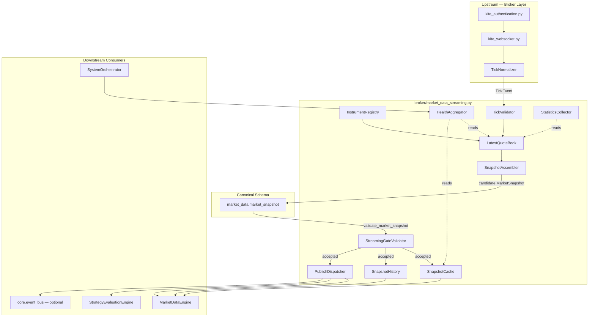
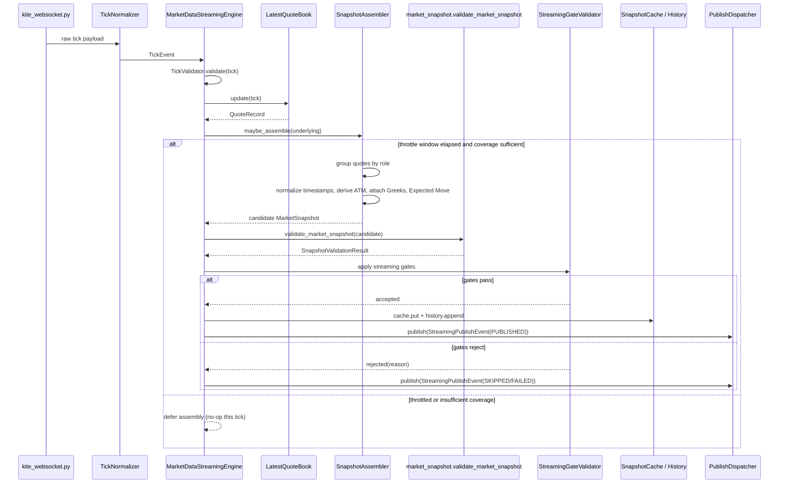

# Market Data Streaming — Software Engineering Specification

| Field | Value |
|---|---|
| **Module** | `broker/market_data_streaming.py` |
| **Document version** | 1.0.0 |
| **Status** | Draft — ready for implementation |
| **Owner** | THETA AI TRADER Core Platform |
| **Last updated** | 2026-08-05 |

---

## 1. Purpose

`broker/market_data_streaming.py` defines the **sole streaming market-data assembly component** for THETA AI TRADER v1.0.

The module answers a question that no other frozen module answers: *"Once normalized ticks are flowing from the Kite WebSocket transport, who continuously turns them into validated, immutable `MarketSnapshot` objects — per configured underlying, at low latency, under concurrency, without redefining the snapshot schema, without owning the socket, and without performing any trading logic?"*

It is the **only** module permitted to:

1. Consume normalized `TickEvent` objects emitted by an injected tick source / tick normalizer.
2. Maintain a live, thread-safe book of the latest quote per instrument token (`LatestQuoteBook`).
3. Aggregate per-underlying streaming state (spot, futures, option chain, volatility index) into an assembled candidate snapshot.
4. Delegate structural/semantic validation to `market_data.market_snapshot.validate_market_snapshot` and apply **additional streaming-specific gates** (staleness, coverage, throttling) before publish.
5. Publish immutable `MarketSnapshot` instances via callbacks and/or an injected Event Bus, cache the latest snapshot per underlying, and retain a bounded snapshot history ring for diagnostics/replay.

It is **not** a WebSocket client. It is **not** an authenticator. It is **not** a REST gateway. It is **not** a Greeks or IV engine. It is **not** a strategy, risk, or execution component. It is **streaming assembly plumbing** — the deterministic bridge between "ticks are arriving" and "a validated Market Snapshot is available for the next engine in the pipeline."

### 1.1 The gap this module fills

Three frozen (or previously specified) modules deliberately refuse to own continuous snapshot assembly:

| Frozen / specified module | Explicit non-responsibility |
|---|---|
| `broker/kite_websocket.py` | NR3 — no `MarketSnapshot` normalization; owns only `KiteTicker` transport, subscription management, and opaque/raw tick dispatch. |
| `broker/kite_authentication.py` | NR1 — no market data streaming of any kind; produces `BrokerSession` only. |
| `market_data/market_data_adapter.py` | Normalizes **one broker payload shape into one snapshot** on demand; it is not a continuous, stateful, multi-tick aggregator that tracks a live quote book across an unbounded tick stream. |
| `market_data/market_snapshot.py` | Defines the canonical `MarketSnapshot` schema and validation/freshness primitives; it does **not** consume ticks, does **not** maintain state, and does **not** publish. |
| `market_data/market_data_engine.py` | Historically combined transport + buffering + assembly in one legacy shape; the v1 architecture splits transport (`kite_websocket.py`) from continuous assembly (**this module**) so the engine can consume a stable, always-fresh snapshot source without re-implementing tick bookkeeping. |

Nobody in the frozen/specified architecture currently owns:

- A live per-instrument "latest quote" book fed continuously by WebSocket ticks.
- Deterministic, thread-safe aggregation of spot + futures + option chain + volatility index ticks into one coherent point-in-time view per underlying.
- Streaming-specific validation gates (staleness thresholds, minimum chain coverage, throttled rebuild cadence) layered on top of the canonical `validate_market_snapshot`.
- A bounded, replayable snapshot history ring per underlying for diagnostics and downstream backfill.
- A stable publish contract (callbacks + optional Event Bus topics) that `MarketDataEngine`, `StrategyEvaluationEngine`, and `SystemOrchestrator` can depend on as a continuous snapshot source.

`broker/market_data_streaming.py` closes this gap. It is the mandatory intermediate layer between raw/normalized streaming ticks and any consumer that expects a `MarketSnapshot`.

### 1.2 Pipeline placement

```text
[broker/kite_authentication.py]
    BrokerSession (api_key, access_token)
              │
              ▼
[broker/kite_websocket.py]
    KiteTicker transport → opaque ticks / WebSocketTickEvent
              │
              ▼
[TickNormalizer]  (injected; may wrap market_data.market_data_adapter helpers)
    opaque broker tick → TickEvent (platform-normalized)
              │
              ▼
[broker/market_data_streaming.py]                          ← THIS MODULE
    ┌──────────────────────────────────────────────────────────────────┐
    │ STREAMING ASSEMBLY PIPELINE                                       │
    │   ingest_tick(TickEvent)                                          │
    │     → validate tick (TICK-*)                                      │
    │     → validate instrument membership (INST-MDS-*)                 │
    │     → LatestQuoteBook.update(...)                                 │
    │     → trigger SnapshotAssembler for affected underlying           │
    │         → group quotes: spot / futures / option chain / vol index │
    │         → normalize timestamps (IST/UTC rules, §12)               │
    │         → attach pre-computed Greeks/IV when present               │
    │         → derive ATM from quote book                              │
    │         → optionally compute Expected Move (lightweight formula)  │
    │         → build candidate MarketSnapshot                          │
    │     → validate_market_snapshot(candidate)  [market_data.market_snapshot] │
    │     → apply streaming gates (VAL-MDS-*: staleness, coverage, throttle) │
    │     → SnapshotCache.put(underlying, snapshot, view)                │
    │     → SnapshotHistory.append(underlying, snapshot)                 │
    │     → publish StreamingPublishEvent (callbacks + optional EventBus)│
    └──────────────────────────────────────────────────────────────────┘
              │
              ▼
MarketSnapshot (market_data/market_snapshot.py — canonical, unmodified schema)
              │
              ▼
[market_data/market_data_engine.py]  /  [StrategyEvaluationEngine]  /  [SystemOrchestrator]
    consume as continuous snapshot source (pull via get_snapshot / get_streaming_view,
    or push via publish callback / Event Bus subscription)
```

### 1.3 Architecture freeze note

The platform architecture is **FROZEN** for v1.0. This module does **not**:

- Own `KiteTicker` or any WebSocket connection lifecycle — that remains exclusive to `broker/kite_websocket.py` (Rule BOUNDARY-MDS-001).
- Perform OAuth, token exchange, or token persistence — that remains exclusive to `broker/kite_authentication.py` (Rule BOUNDARY-MDS-002).
- Redefine, fork, or extend the `MarketSnapshot` schema. It **imports and reuses** `market_data.market_snapshot` types (`MarketSnapshot`, `UnderlyingSnapshot`, `OptionChainSnapshot`, `OptionChainMetadata`, `OptionContractSnapshot`, `VolatilitySnapshot`, `SnapshotFreshness`, `SnapshotQuality`, `SnapshotProvenance`) as the **canonical** and **only** snapshot schema (Rule BOUNDARY-MDS-003).
- Replace `market_data.market_data_adapter.MarketDataAdapter`. Any raw-broker-field-to-platform-field mapping is performed by an **injected adapter / tick normalizer**; this module only aggregates already-normalized `TickEvent` objects (Rule BOUNDARY-MDS-004).
- Replace `market_data.market_data_engine.MarketDataEngine`. The Market Data Engine may treat this module as a **continuous snapshot source** (pull or push); this module is streaming assembly/cache/publish plumbing, not a second orchestration engine (Rule BOUNDARY-MDS-005).
- Evaluate strategies, compute trade signals, calculate position risk, size positions, manage positions, or place/modify/cancel orders (Rule BOUNDARY-MDS-006).
- Load Application Configuration files, `.env` files, or environment variables. It accepts an already-projected `MarketDataStreamingConfig` (Rule BOUNDARY-MDS-007).
- Hardcode instrument tokens, trading symbols, or a sole-path spot quote key. All instrument identity arrives via externally resolved `InstrumentDescriptor` records (Rule BOUNDARY-MDS-008).
- Compute option Greeks or Implied Volatility from first principles. Full Greeks/IV calculation remains the responsibility of the option Greeks engine (`option_greeks_engine`, out of scope for this document); this module only **attaches** pre-computed values when present on a `TickEvent` / `GreeksAttachment` map, derives ATM strike from the live quote book, and may compute **Expected Move** from an attached ATM IV using one documented, lightweight, well-known options approximation formula (§18.5) — this is explicitly **not** a new Greeks engine (Rule BOUNDARY-MDS-009).

### 1.4 Goals

1. Provide a **single streaming assembly component** that turns a continuous stream of normalized ticks into validated `MarketSnapshot` objects, per configured underlying.
2. Support **multiple configured underlyings** simultaneously (primary + secondary catalog, §4) without hardcoding a subscription universe.
3. Maintain a **latest-quote book** (`LatestQuoteBook`) that is thread-safe, deterministic, and O(1) per tick update.
4. Assemble snapshots that expose **spot, futures, option chain, ATM, IV, Greeks (when attached), OI, volume, bid/ask, expected move, and timestamp** for downstream consumers, using the canonical `MarketSnapshot` type plus an optional streaming view projection.
5. Apply **timezone-aware timestamp normalization** with explicit IST ↔ UTC rules; naive datetimes are never accepted.
6. Delegate all structural/semantic snapshot validation to `market_data.market_snapshot.validate_market_snapshot` and layer **streaming-specific gates** (staleness, coverage, throttled rebuild cadence) on top — never re-implement or bypass canonical validation.
7. Publish snapshots through **callbacks** and an **optional Event Bus** with deterministic, ordered, per-underlying sequencing.
8. Maintain a **bounded snapshot cache** (latest per underlying) and a **bounded snapshot history ring** (recent N per underlying) for diagnostics, replay, and backfill.
9. Be **thread-safe** under high-frequency concurrent tick ingestion and concurrent read access (health, statistics, cache, history).
10. Be **deterministic** — identical ordered tick sequences plus identical clock produce identical assembled snapshots and identical validation outcomes.
11. Be engineered for **high throughput / low latency**: O(1) tick ingestion, bounded per-underlying assembly cost, no unbounded memory growth, no blocking I/O on the hot ingestion path.
12. Expose **health**, **statistics**, and **serialization** contracts consistent with the rest of the `broker/*` module family.
13. Use **Google-style docstrings** on all public types and methods; **immutable dataclasses** at the public boundary.
14. Reach **≥ 95% unit test coverage** on `broker/market_data_streaming.py`.
15. **Never** own a WebSocket connection, perform OAuth, redefine the snapshot schema, replace `MarketDataAdapter`/`MarketDataEngine`, evaluate strategies, calculate risk, manage positions, execute trades, or load configuration files/environment variables directly.

### 1.5 Success criteria

- Given a stream of normalized `TickEvent` objects for `NIFTY` spot, futures, and a full option chain slice, `MarketDataStreamingEngine.get_snapshot("NIFTY")` returns a `MarketSnapshot` whose `quality.validation_status` is `VALID` once minimum coverage is reached, and the object is a **direct instance** of `market_data.market_snapshot.MarketSnapshot` (no forked schema).
- Adding `SENSEX` to `enabled_underlyings` and feeding SENSEX ticks causes `get_snapshot("SENSEX")` to become populated without any code change — only configuration and registered `InstrumentDescriptor` records change.
- `get_streaming_view("NIFTY")` exposes spot, futures (when present), ATM strike, ATM IV (when attached), total OI, total volume, best bid/ask context, and an `ExpectedMoveEstimate` (when enabled and ATM IV available) — all without duplicating fields already present on the canonical `MarketSnapshot`.
- Feeding ticks with a naive (timezone-unaware) timestamp is rejected with `MDS.TICK.NAIVE_TIMESTAMP` before any state mutation occurs.
- Concurrent ingestion from 8 threads at 5,000 ticks/second/thread against a `FakeTickSource` produces no data races, no lost updates for the last tick per token, and deterministic final `LatestQuoteBook` state under a fixed replay order.
- Grep of the module finds **zero** references to `KiteTicker`, `generate_session`, `place_order`, strategy scoring, or position/risk math.
- Unit coverage ≥ 95% on `broker/market_data_streaming.py`.

### 1.6 Relationship to other modules

| Module | Relationship |
|---|---|
| `broker/kite_websocket.py` | **Upstream transport.** Owns `KiteTicker`; may dispatch raw/opaque ticks to a `TickNormalizer` that this module's callers construct `TickEvent` from. This module never imports `KiteTicker`. |
| `broker/kite_authentication.py` | **Indirect upstream.** Provides the `BrokerSession` consumed by `kite_websocket.py`. This module never imports it and never sees credentials. |
| `market_data/market_snapshot.py` | **Canonical schema authority.** This module imports `MarketSnapshot` and friends and calls `validate_market_snapshot` / `evaluate_snapshot_freshness`; it never redefines these types. |
| `market_data/market_data_adapter.py` | **Peer normalizer / optional collaborator.** May be wrapped by an injected `TickNormalizer` for broker-field mapping; this module never duplicates adapter field-mapping logic. |
| `market_data/market_data_engine.py` | **Primary downstream consumer.** May treat `MarketDataStreamingEngine` as its continuous snapshot source (pull via `get_snapshot()` / push via publish callback) instead of, or in addition to, its own REST/WS acquisition path. |
| Strategy Evaluation Engine | **Downstream consumer.** Reads published `MarketSnapshot` / `StreamingSnapshotView` objects; never receives raw ticks or `LatestQuoteBook` internals. |
| System Orchestrator | **Downstream consumer / lifecycle caller.** May call `start()` / `stop()` / `get_health()` as part of its own health aggregation; never ingests ticks directly. |
| `core/event_bus.py` | **Optional transport.** When `publish_events=True` and an `EventBus` is injected, this module publishes `market.streaming.*` topics (§27). |
| Option Greeks Engine (out of scope) | **Optional upstream enrichment.** May populate `GreeksAttachment` on `TickEvent` records before they reach this module, or via a side-channel `attach_greeks()` call; this module never computes Greeks/IV from raw option prices. |

### 1.7 Distinction from adjacent modules

| Concern | `kite_websocket.py` | `market_data_adapter.py` | `market_data_streaming.py` (this module) | `market_data_engine.py` |
|---|---|---|---|---|
| Owns `KiteTicker` | **Yes** | No | No | No |
| Normalizes one broker payload → one snapshot on demand | No | **Yes** | No (consumes already-normalized `TickEvent`) | Delegates to adapter |
| Maintains a continuous latest-quote book across the tick stream | No | No | **Yes** | No (delegated to this module in v1 wiring) |
| Publishes a continuously updated `MarketSnapshot` per underlying | No | No | **Yes** | Consumes |
| Defines `MarketSnapshot` schema | No | No | No (reuses) | No (reuses) |
| Computes Greeks/IV from raw prices | No | No | No (attaches pre-computed only) | No |
| Coordinates full trading cycles | No | No | No | No |
| Output type | Opaque tick dict / `WebSocketTickEvent` | `AdapterBuildResult` / `MarketSnapshot` (one-shot) | `MarketSnapshot` (continuous) + `StreamingSnapshotView` | `MarketSnapshot` (via adapter) |

**Rule BOUNDARY-MDS-010:** This module may import `market_data.market_snapshot` and, for optional convenience wrapping only, `market_data.market_data_adapter` types used purely as a `TickNormalizer` implementation detail supplied by the caller. It must never import `kiteconnect`, `broker.kite_websocket`, or `broker.kite_authentication`.

---

## 2. Responsibilities

`broker/market_data_streaming.py` **is responsible for**:

| # | Responsibility | Description |
|---|---|---|
| R1 | **Tick ingestion** | Accept normalized `TickEvent` objects via `ingest_tick()`; optionally accept raw ticks via `ingest_raw_tick()` when a `TickNormalizer` is injected. |
| R2 | **Tick validation** | Reject structurally invalid ticks (naive timestamps, non-finite prices, negative volume/OI, unknown/disallowed underlying) before any state mutation. |
| R3 | **Instrument registration** | Accept externally resolved `InstrumentDescriptor` records via `register_instruments()` to establish the validation allowlist and enrichment metadata (strike, expiry, option type, lot size). |
| R4 | **Instrument validation** | Reject ticks for unregistered instrument tokens or instruments whose underlying is not in `enabled_underlyings`. |
| R5 | **Latest quote book maintenance** | Maintain one current `QuoteRecord` per instrument token via `LatestQuoteBook`, updated atomically per tick. |
| R6 | **Per-underlying aggregation** | Group live quotes by underlying into spot / futures / option chain / volatility index buckets for assembly. |
| R7 | **Snapshot assembly** | Build a candidate `MarketSnapshot` from the current quote-book state for a given underlying via `SnapshotAssembler`. |
| R8 | **Timestamp normalization** | Normalize all timestamps to timezone-aware values under documented IST/UTC rules (§12) before they reach the canonical snapshot. |
| R9 | **ATM derivation** | Derive the ATM strike from the live quote book (nearest strike to spot, respecting configured strike step) rather than accepting a hardcoded value. |
| R10 | **Greeks/IV attachment** | Attach pre-computed Greeks/IV present on `TickEvent.greeks` / `GreeksAttachment` onto assembled `OptionContractSnapshot` records; never compute Greeks independently. |
| R11 | **Expected Move computation** | Optionally compute a lightweight, documented Expected Move estimate from ATM IV and time-to-expiry (§18.5); never a full volatility model. |
| R12 | **Canonical validation delegation** | Call `market_data.market_snapshot.validate_market_snapshot` on every assembled candidate; never bypass or reimplement its rules. |
| R13 | **Streaming validation gates** | Apply additional streaming-only gates: minimum quote staleness, minimum chain coverage, rebuild throttling, duplicate-tick suppression. |
| R14 | **Snapshot publishing** | Publish successfully validated snapshots to registered callbacks and, optionally, an injected Event Bus, with deterministic per-underlying sequencing. |
| R15 | **Snapshot cache** | Maintain the latest published (or best-effort candidate, when configured) `MarketSnapshot` and `StreamingSnapshotView` per underlying for O(1) pull access. |
| R16 | **Snapshot history** | Maintain a bounded ring buffer of recent snapshots per underlying for diagnostics, replay, and backfill. |
| R17 | **Multi-underlying isolation** | Ensure a fault, staleness condition, or validation failure on one underlying never blocks assembly or publish for another underlying. |
| R18 | **Health reporting** | Expose `StreamingHealthReport` aggregating global and per-underlying `SnapshotHealth`. |
| R19 | **Statistics** | Expose `SnapshotStatistics` aggregating global and per-underlying tick/snapshot counters and timing. |
| R20 | **Error taxonomy** | Raise typed streaming errors with stable `MDS.*` codes. |
| R21 | **Thread safety** | Protect all mutable state (quote book, cache, history, statistics, counters) with well-scoped locks; return immutable snapshots to callers. |
| R22 | **Determinism** | Guarantee identical ordered inputs plus identical clock produce identical assembled snapshots and identical validation/gate outcomes. |
| R23 | **Serialization** | Provide versioned JSON serialization for public health/statistics/view types (the canonical `MarketSnapshot` uses its own module's serializers). |
| R24 | **Lifecycle management** | Implement a documented state machine (`CREATED` → `RUNNING` → `DEGRADED` / `STOPPED`) with explicit `start()` / `stop()` semantics. |
| R25 | **Performance envelope** | Meet documented throughput/latency budgets (§19) under the reference workload; avoid unbounded memory growth via bounded cache/history/statistics structures. |
| R26 | **Configuration validation** | Validate `MarketDataStreamingConfig` (underlying catalog membership, non-negative thresholds, ring sizes) before accepting ticks. |
| R27 | **Duplicate/out-of-order tolerance** | Detect and gracefully ignore duplicate or stale-sequence ticks without raising for normal network reordering (configurable tolerance). |

---

## 3. Non-Responsibilities

`broker/market_data_streaming.py` **must not**:

| # | Non-responsibility | Rationale |
|---|---|---|
| NR1 | **Own or construct `KiteTicker`** | `broker/kite_websocket.py` exclusively. |
| NR2 | **Perform OAuth / token exchange / token persistence** | `broker/kite_authentication.py` exclusively. |
| NR3 | **Redefine or fork the `MarketSnapshot` schema** | `market_data/market_snapshot.py` is the sole schema authority; this module imports and reuses it. |
| NR4 | **Perform broker-field-name mapping (Kite field → platform field)** | Injected `TickNormalizer` / `market_data_adapter` helpers; this module consumes already-normalized `TickEvent`. |
| NR5 | **Replace `MarketDataEngine` orchestration** | `market_data/market_data_engine.py` remains the analytical acquisition engine; this module is streaming plumbing it may consume. |
| NR6 | **Evaluate strategies or generate trading signals** | Strategy Evaluation Engine. |
| NR7 | **Calculate risk or size positions** | Risk Engine / Position Sizing Engine. |
| NR8 | **Manage positions or portfolio state** | Position Manager / Portfolio Manager. |
| NR9 | **Place, modify, or cancel orders** | Order Manager / Execution Engine. |
| NR10 | **Compute Greeks or IV from first principles** | Option Greeks Engine; this module only attaches pre-computed values. |
| NR11 | **Compute a full volatility surface or pricing model** | Out of scope; Expected Move is one documented lightweight formula only. |
| NR12 | **Coordinate full trading cycles** | System Orchestrator. |
| NR13 | **Compose engines / build the `EngineRegistry`** | Integration Engine. |
| NR14 | **Parse Application Configuration files, `.env`, or read `os.environ`** | Application Configuration is the sole bootstrap authority; this module accepts a projected `MarketDataStreamingConfig` only. |
| NR15 | **Hardcode instrument tokens, trading symbols, or a sole-path spot quote key** | Absolute prohibition — instrument identity is always externally resolved and registered. |
| NR16 | **Hardcode a fixed subscription universe** | The supported underlying catalog (§4) is a validation allowlist only, never a subscription list. |
| NR17 | **Persist snapshots to disk or a database** | Optional external persistence remains a separate concern (e.g., a snapshot recorder); this module keeps only in-memory bounded cache/history. |
| NR18 | **Retry or reconnect the WebSocket transport** | `broker/kite_websocket.py` owns reconnect surface; this module reacts to whatever ticks arrive. |
| NR19 | **Decide strike-window policy or option universe composition for subscription** | `MarketDataEngine` / instrument resolver decide what gets subscribed; this module only assembles from whatever `InstrumentDescriptor`s and ticks it is given. |
| NR20 | **Publish trading-domain Event Bus topics (`order.*`, `pipeline.*`)** | May optionally publish `market.streaming.*` topics only (§27). |
| NR21 | **Block the ingestion hot path on I/O** | No network calls, no disk writes, no blocking Event Bus publish on the tick-ingestion critical path. |
| NR22 | **Silently mutate a published `MarketSnapshot`** | All published snapshots are immutable; any correction is a **new** snapshot with a new `snapshot_id`. |

---

## 4. Supported Underlying Catalog

This catalog is a **validation allowlist** of canonical underlying names, identical in spirit and content to the catalog already frozen in `broker/kite_websocket.py`. It is **not** a hardcoded subscription set and **not** a source of instrument tokens or spot quote keys.

### 4.1 Primary supported indices

| Canonical name | Role |
|---|---|
| `NIFTY` | Primary index options universe |
| `BANKNIFTY` | Primary index options universe |
| `SENSEX` | Primary index options universe |

### 4.2 Secondary supported indices

| Canonical name | Role |
|---|---|
| `FINNIFTY` | Secondary / optional index universe |
| `MIDCPNIFTY` | Secondary / optional index universe |

### 4.3 Catalog rules

| Rule | Statement |
|---|---|
| CAT-MDS-001 | Canonical names are uppercase ASCII; validation normalizes input with `strip().upper()`. |
| CAT-MDS-002 | `enabled_underlyings` must be a non-empty subset of `PRIMARY ∪ SECONDARY` unless `allow_experimental_underlyings=True` (tests only). |
| CAT-MDS-003 | Primary vs secondary is metadata for health/statistics classification only — both are fully supported for ingestion/assembly/publish when enabled. |
| CAT-MDS-004 | The module must not map catalog names to hardcoded `instrument_token` or `"EXCHANGE:SYMBOL"` constants. |
| CAT-MDS-005 | The catalog in this module **must remain identical** to `broker.kite_websocket.SUPPORTED_UNDERLYINGS` — both modules import from a shared constant set or are kept in lockstep by contract test `test_underlying_catalog_parity`. |

```text
SUPPORTED_PRIMARY_UNDERLYINGS   = frozenset({"NIFTY", "BANKNIFTY", "SENSEX"})
SUPPORTED_SECONDARY_UNDERLYINGS = frozenset({"FINNIFTY", "MIDCPNIFTY"})
SUPPORTED_UNDERLYINGS           = SUPPORTED_PRIMARY_UNDERLYINGS | SUPPORTED_SECONDARY_UNDERLYINGS
```

### 4.4 Catalog is not a subscription list

| What the catalog is | What the catalog is not |
|---|---|
| A closed set of names `enabled_underlyings` is validated against | A list of instrument tokens |
| A classification axis for health/statistics (`PRIMARY`/`SECONDARY`) | A source of spot quote keys (`"NSE:NIFTY 50"`, etc.) |
| Shared, stable across `kite_websocket.py` and this module | Something either module writes tokens into |

Actual subscription (which tokens stream) is decided upstream by `kite_websocket.SubscriptionManager` from resolved instrument master data; actual instrument **identity metadata for assembly** (strike, expiry, option type, lot size) arrives at this module via `InstrumentDescriptor` records registered through `register_instruments()`.

---

## 5. Architecture

### 5.1 Component model

```text
┌───────────────────────────────────────────────────────────────────────────┐
│                      MarketDataStreamingEngine                             │
│                 (public facade — thread-safe, mutable)                     │
├───────────────────────────────────────────────────────────────────────────┤
│  InstrumentRegistry        │  LatestQuoteBook                              │
│  - InstrumentDescriptor    │  - per-token QuoteRecord                      │
│    catalog + role mapping  │  - per-underlying indexes                     │
│  - underlying membership   │  - staleness evaluation                       │
├─────────────────────────────┴────────────────────────────────────────────┤
│  TickValidator  │  SnapshotAssembler   │  StreamingGateValidator          │
│  - TICK-* rules │  - group by role     │  - staleness / coverage /       │
│  - normalize ts │  - build UnderlyingSnapshot / OptionChainSnapshot /     │
│                 │    FuturesSnapshot / VolatilitySnapshot                 │
│                 │  - ATM derivation, Greeks attach, Expected Move          │
├─────────────────────────────┴──────────────┴──────────────────────────────┤
│  SnapshotCache        │  SnapshotHistory       │  PublishDispatcher       │
│  - latest per UL      │  - bounded ring per UL │  - callbacks + EventBus  │
├───────────────────────┴────────────────────────┴──────────────────────────┤
│  HealthAggregator     │  StatisticsCollector   │  Serializer              │
└───────────────────────────────────────────────────────────────────────────┘
                              │
                              ▼
              market_data.market_snapshot.MarketSnapshot
                       (canonical, unmodified)
                              │
                              ▼
     MarketDataEngine  /  StrategyEvaluationEngine  /  SystemOrchestrator
```

### 5.2 Design principles

| Principle | Application |
|---|---|
| **Schema reuse, never forking** | `MarketSnapshot` and its nested types are imported, never redefined. |
| **Config-driven universe** | `enabled_underlyings` and `InstrumentDescriptor`s are injected; no hardcoded tokens. |
| **Fail closed on structure, fail soft on staleness** | Malformed ticks/instruments are rejected outright; stale-but-structurally-valid data degrades health without crashing ingestion. |
| **Immutable outward boundary** | `TickEvent`, `QuoteRecord`, `MarketSnapshot`, `StreamingSnapshotView`, health/statistics types are all frozen dataclasses. |
| **Bounded memory** | Cache holds exactly one snapshot per underlying; history is a fixed-size ring; statistics use fixed-cardinality counters. |
| **No hot-path I/O** | Ingestion never blocks on network, disk, or synchronous Event Bus delivery beyond in-process dispatch. |
| **Determinism** | Given a fixed tick order and fixed clock, assembly and validation outcomes are reproducible. |
| **Separation from transport and domain** | Transport (`kite_websocket.py`) knows sockets; domain schema (`market_snapshot.py`) knows the contract; this module knows only aggregation/publish plumbing. |

### 5.3 Mermaid — component/dependency diagram



### 5.4 Mermaid — per-tick sequence



---

## 6. Dependency Direction

```text
ApplicationConfiguration  →  (projection, external)  →  MarketDataStreamingConfig
Instrument resolver / master data  →  (external)  →  InstrumentDescriptor[]
kite_websocket.py + TickNormalizer  →  TickEvent  →  MarketDataStreamingEngine.ingest_tick()

MarketDataStreamingEngine
        │
        ├──► market_data.market_snapshot   (MarketSnapshot, validate_market_snapshot,
        │                                    evaluate_snapshot_freshness, freshness/quality types)
        ├──► core.event_bus                (optional; publish only, never subscribe)
        └──► standard library only          (threading, collections, dataclasses, datetime, uuid, json)

market_data.market_data_engine   ◄── MarketSnapshot / StreamingSnapshotView (pull or push)
StrategyEvaluationEngine         ◄── MarketSnapshot (via MarketDataEngine or direct subscription)
SystemOrchestrator               ◄── StreamingHealthReport (health aggregation only)
```

**Rule DEP-MDS-001:** `market_data.market_snapshot` must never import `broker.market_data_streaming` (one-directional dependency; schema layer stays independent of streaming plumbing).

**Rule DEP-MDS-002:** `broker.market_data_streaming` must never import `broker.kite_websocket` or `broker.kite_authentication`. Ticks arrive as plain `TickEvent` objects constructed by the caller's wiring layer (typically Integration Engine), preserving testability with zero SDK dependencies.

**Rule DEP-MDS-003:** `broker.market_data_streaming` must never import `market_data.market_data_engine` (would create a downstream-to-upstream cycle). The engine imports this module, never the reverse.

### 6.1 Module layout (v1)

| Path | Visibility | Description |
|---|---|---|
| `broker/market_data_streaming.py` | Public | All public types, `MarketDataStreamingEngine`, component classes, serializers |
| Optional internals (same file in v1) | Private | `_SnapshotAssembler`, `_StreamingGateValidator`, `_ExpectedMoveCalculator`, helpers |

v1 ships as a **single public module** unless size forces private helpers into `broker/_market_data_streaming_*.py`. No WebSocket or REST modules are introduced.

---

## 7. Configuration — ApplicationConfiguration Projection

### 7.1 Injection contract

This module **does not** load Application Configuration, `.env` files, or `os.environ`. The Integration Engine (or an equivalent bootstrap layer) projects settings from `config/application_configuration.py`'s `MarketDataConfiguration` into a `MarketDataStreamingConfig` and injects it at construction time (Rule CFG-MDS-001).

### 7.2 `MarketDataStreamingConfig` (frozen)

| Field | Type | Default | Description |
|---|---|---|---|
| `environment_profile` | `EnvironmentProfile` | `DEVELOPMENT` | Development / Paper / Production. |
| `enabled_underlyings` | `tuple[str, ...]` | — (required) | Canonical underlyings to assemble — from Application Configuration projection. |
| `allow_experimental_underlyings` | `bool` | `False` | When `False`, only catalog names (§4) are accepted. |
| `tick_staleness_seconds` | `float` | `5.0` | Per-quote age beyond which a `QuoteRecord` is considered stale for coverage purposes. |
| `snapshot_min_interval_seconds` | `float` | `0.25` | Minimum wall-clock interval between successive assembly attempts per underlying (throttle). |
| `history_ring_size` | `int` | `500` | Maximum retained snapshots per underlying in `SnapshotHistory`. |
| `max_missing_quote_ratio` | `float` | `0.10` | Maximum tolerated fraction of missing bid/ask quotes in the chain before a streaming gate rejects the candidate. |
| `min_complete_pairs` | `int` | `1` | Minimum CE/PE complete strike pairs required to attempt publish. |
| `strike_window_strikes` | `int` | `10` | Strikes retained on each side of ATM when assembling the chain slice (mirrors `market_snapshot.OptionChainMetadata.strike_window_strikes`). |
| `strike_step` | `Mapping[str, float]` | `{}` | Per-underlying strike increment; falls back to `default_strike_step` when a key is absent. |
| `default_strike_step` | `float` | `50.0` | Strike increment used when no per-underlying override is configured. |
| `require_futures_for_snapshot` | `bool` | `False` | When `True`, a missing futures quote blocks publish (`MDS.SNAPSHOT.FUTURES_REQUIRED`). |
| `require_volatility_index` | `bool` | `False` | When `True`, a missing volatility index quote blocks publish. |
| `expected_move_enabled` | `bool` | `True` | Enables Expected Move computation on the streaming view when ATM IV is available. |
| `expected_move_trading_days_per_year` | `float` | `365.0` | Time-scaling denominator for the Expected Move formula (§18.5). |
| `duplicate_tick_tolerance` | `bool` | `True` | When `True`, ticks with a non-increasing `sequence` for a token are ignored rather than raising. |
| `validation_policy` | `market_data.market_snapshot.ValidationPolicy \| None` | `None` | Overrides passed straight through to `validate_market_snapshot`. |
| `freshness_policy` | `market_data.market_snapshot.SnapshotFreshnessPolicy \| None` | `None` | Overrides passed straight through to `evaluate_snapshot_freshness`. |
| `publish_events` | `bool` | `False` | When `True` and an `EventBus` is injected, publish `market.streaming.*` topics. |
| `publish_tick_events` | `bool` | `False` | High-volume; default off even when `publish_events=True`. |
| `runner_kind` | `str` | `"unknown"` | Audit tag (`cli`, `paper`, `live`, `test`). |
| `metadata` | `Mapping[str, str]` | `{}` | Non-secret audit metadata. |

**Rule CFG-MDS-002:** `enabled_underlyings` must contain ≥ 1 unique canonical name after `strip().upper()` normalization; duplicates raise `MDS.CONFIG.UNDERLYING_DUPLICATE`.

**Rule CFG-MDS-003:** All `*_seconds` and `*_ratio` fields must be finite and ≥ 0; `max_missing_quote_ratio` must be ≤ 1.0.

**Rule CFG-MDS-004:** `history_ring_size` must be ≥ 1.

### 7.3 Projection flow (no architecture change)

```text
ApplicationConfiguration.market_data
    → project enabled_underlyings, strike windows, thresholds (see §7.4)
    → Integration Engine / bootstrap layer constructs MarketDataStreamingConfig
    → InstrumentResolver resolves InstrumentDescriptor[] per enabled underlying
    → MarketDataStreamingEngine(config).register_instruments(descriptors)
    → kite_websocket.py ticks → TickNormalizer → TickEvent → engine.ingest_tick(...)
```

Changing Application Configuration and re-resolving instruments changes the live streaming universe **without code edits** — identical in spirit to the dynamic subscription model already frozen in `broker/kite_websocket.py` §7.3–7.4.

### 7.4 Projection expectations

Recommended projection sources (Application Configuration remains the sole bootstrap authority; this module never reads any of these directly):

1. Explicit multi-underlying field on `MarketDataConfiguration` when present (preferred long-term).
2. Composed list from primary `market_data.underlying` plus optional metadata/env projection (e.g., `THETA_MARKET_UNDERLYINGS`), loaded **only** by Application Configuration.
3. Test doubles inject `MarketDataStreamingConfig` directly.

**This module never reads `os.environ`.**

### 7.5 Example projected configuration

```python
from broker.market_data_streaming import MarketDataStreamingConfig
from config.application_configuration import EnvironmentProfile

config = MarketDataStreamingConfig(
    environment_profile=EnvironmentProfile.PAPER,
    enabled_underlyings=("NIFTY", "BANKNIFTY", "SENSEX"),
    allow_experimental_underlyings=False,
    tick_staleness_seconds=5.0,
    snapshot_min_interval_seconds=0.25,
    history_ring_size=500,
    max_missing_quote_ratio=0.10,
    min_complete_pairs=1,
    strike_window_strikes=10,
    strike_step={"NIFTY": 50.0, "BANKNIFTY": 100.0, "SENSEX": 100.0},
    default_strike_step=50.0,
    expected_move_enabled=True,
    publish_events=True,
    runner_kind="paper",
)
```

---

## 8. Public API

### 8.1 Constants

| Symbol | Value | Description |
|---|---|---|
| `MARKET_DATA_STREAMING_VERSION` | `"1.0.0"` | Module semantic version. |
| `MARKET_DATA_STREAMING_SCHEMA_VERSION` | `"1.0.0"` | Public JSON schema version for this module's own types. |
| `PRODUCER_NAME` | `"broker.market_data_streaming"` | Audit / event producer id. |
| `SUPPORTED_PRIMARY_UNDERLYINGS` | `frozenset[str]` | §4.1 |
| `SUPPORTED_SECONDARY_UNDERLYINGS` | `frozenset[str]` | §4.2 |
| `SUPPORTED_UNDERLYINGS` | `frozenset[str]` | Union of primary and secondary |
| `DEFAULT_TICK_STALENESS_SECONDS` | `5.0` | Default per-quote staleness threshold |
| `DEFAULT_SNAPSHOT_MIN_INTERVAL_SECONDS` | `0.25` | Default assembly throttle |
| `DEFAULT_HISTORY_RING_SIZE` | `500` | Default per-underlying history ring capacity |
| `DEFAULT_STRIKE_STEP` | `50.0` | Default strike increment |
| `IST_ZONE` | `"Asia/Kolkata"` | Canonical timezone name for exchange-local normalization |

### 8.2 Enumerations

| Enum | Values | Purpose |
|---|---|---|
| `InstrumentRole` | `SPOT`, `FUTURE`, `OPTION_CE`, `OPTION_PE`, `VOLATILITY_INDEX`, `UNKNOWN` | Canonical role of an instrument for assembly grouping. |
| `UnderlyingSupportTier` | `PRIMARY`, `SECONDARY`, `EXPERIMENTAL` | Catalog classification (mirrors `kite_websocket.UnderlyingSupportTier`). |
| `StreamingLifecycleState` | `CREATED`, `RUNNING`, `DEGRADED`, `STOPPED` | Engine lifecycle state. |
| `SnapshotPublishOutcome` | `PUBLISHED`, `SKIPPED`, `FAILED` | Result of one assembly-and-publish attempt. |
| `StreamingHealthStatus` | `HEALTHY`, `DEGRADED`, `UNHEALTHY`, `UNKNOWN` | Aggregated streaming health. |
| `TimestampSource` | `EXCHANGE`, `RECEIVE`, `INJECTED` | Provenance of the timestamp used to build a snapshot field. |

### 8.3 Immutable models — tick and instrument layer

#### 8.3.1 `GreeksAttachment`

| Field | Type | Description |
|---|---|---|
| `delta` | `float \| None` | Pre-computed delta. |
| `iv` | `float \| None` | Pre-computed implied volatility (decimal, e.g. `0.145` for 14.5%). |
| `gamma` | `float \| None` | Pre-computed gamma. |
| `theta` | `float \| None` | Pre-computed theta. |
| `vega` | `float \| None` | Pre-computed vega. |
| `computed_at` | `datetime \| None` | When the upstream Greeks engine computed these values (tz-aware). |
| `source` | `str \| None` | Producer identifier (e.g. `"option_greeks_engine"`). |

**Rule GRK-001:** This module never sets `iv`/`delta`/`gamma`/`theta`/`vega` to a computed (non-`None`) value itself; it only forwards values already present on the input.

#### 8.3.2 `TickEvent`

Normalized platform tick — the **sole ingestion contract** of this module.

| Field | Type | Description |
|---|---|---|
| `instrument_token` | `int` | Resolved instrument token (> 0). |
| `underlying` | `str` | Canonical underlying name. |
| `quote_key` | `str` | Broker quote key (e.g. `"NSE:NIFTY 50"`), resolved externally. |
| `exchange` | `str` | Exchange code, resolved externally. |
| `tradingsymbol` | `str` | Trading symbol, resolved externally. |
| `instrument_kind` | `str` | Opaque role tag from upstream (`"INDEX"`, `"FUT"`, `"CE"`, `"PE"`, `"VIX"`, …); mapped to `InstrumentRole` internally (§9.3). |
| `last_price` | `float` | Last traded price; must be finite and ≥ 0. |
| `bid` | `float \| None` | Best bid; `None` when unavailable. |
| `ask` | `float \| None` | Best ask; `None` when unavailable. |
| `bid_quantity` | `int \| None` | Best bid quantity. |
| `ask_quantity` | `int \| None` | Best ask quantity. |
| `volume` | `int` | Cumulative traded volume; must be ≥ 0. |
| `open_interest` | `int \| None` | Open interest; required for options, optional for spot/futures. |
| `open` | `float \| None` | Session open. |
| `high` | `float \| None` | Session high. |
| `low` | `float \| None` | Session low. |
| `close` | `float \| None` | Previous session close. |
| `average_price` | `float \| None` | Volume-weighted average price when provided. |
| `exchange_timestamp` | `datetime \| None` | Broker-reported quote timestamp; tz-aware when present (see §12). |
| `received_at` | `datetime` | Local receive timestamp; **always required and tz-aware**. |
| `sequence` | `int \| None` | Monotonic per-token sequence number for duplicate/reorder detection. |
| `greeks` | `GreeksAttachment \| None` | Optional pre-computed Greeks/IV. |
| `metadata` | `Mapping[str, str]` | Non-secret free-form tags. |

**Rule TICK-001:** `instrument_token` must be `> 0`.

**Rule TICK-002:** `received_at` must be timezone-aware; naive values raise `MDS.TICK.NAIVE_TIMESTAMP`.

**Rule TICK-003:** When present, `exchange_timestamp` must be timezone-aware after normalization (§12); a naive value is normalized, never rejected outright, unless normalization is explicitly disabled in config (test-only escape hatch).

**Rule TICK-004:** `last_price` and `volume` must be finite; `last_price ≥ 0`, `volume ≥ 0`; negative values raise `MDS.TICK.INVALID_PRICE` / `MDS.TICK.INVALID_VOLUME`.

**Rule TICK-005:** `underlying` must be non-empty; membership in `enabled_underlyings` is checked at instrument-validation time (§13.2), not tick-validation time, since the tick itself cannot be blamed for a misconfigured universe.

#### 8.3.3 `InstrumentDescriptor`

Resolved externally (instrument master + Application Configuration projection); registered once per instrument, reused across many ticks.

| Field | Type | Description |
|---|---|---|
| `instrument_token` | `int` | Kite instrument token (resolved externally). |
| `underlying` | `str` | Canonical underlying name. |
| `quote_key` | `str` | Broker quote key. |
| `exchange` | `str` | Exchange code. |
| `tradingsymbol` | `str` | Trading symbol. |
| `instrument_kind` | `str` | Opaque role tag, same vocabulary as `TickEvent.instrument_kind`. |
| `instrument_role` | `InstrumentRole` | Resolved role (derived at registration time via §9.3 mapping, may be overridden explicitly). |
| `strike` | `float \| None` | Strike price for option instruments. |
| `option_type` | `str \| None` | `"CE"` / `"PE"` for option instruments. |
| `expiry` | `str \| None` | `YYYY-MM-DD` expiry for option/futures instruments. |
| `lot_size` | `int \| None` | Exchange lot size. |
| `tick_size` | `float \| None` | Minimum price increment. |
| `support_tier` | `UnderlyingSupportTier \| None` | Primary/secondary classification for health/statistics. |
| `metadata` | `Mapping[str, str]` | Non-secret tags. |

**Rule INST-MDS-001:** `underlying` must be in `enabled_underlyings` at registration time; otherwise `register_instruments()` raises `MDS.INSTRUMENT.UNDERLYING_NOT_ENABLED`.

**Rule INST-MDS-002:** `instrument_token` must be `> 0` and unique within a single `register_instruments()` call; duplicates raise `MDS.INSTRUMENT.DUPLICATE_TOKEN`.

**Rule INST-MDS-003:** Option instruments (`instrument_role ∈ {OPTION_CE, OPTION_PE}`) must have non-`None` `strike`, `option_type`, `expiry`, and `lot_size`; missing fields raise `MDS.INSTRUMENT.INCOMPLETE_OPTION_METADATA`.

#### 8.3.4 `QuoteRecord`

Immutable snapshot of the latest known state for one instrument token, produced by `LatestQuoteBook`.

| Field | Type | Description |
|---|---|---|
| `instrument_token` | `int` | Token. |
| `underlying` | `str` | Canonical underlying. |
| `instrument_role` | `InstrumentRole` | Resolved role. |
| `descriptor` | `InstrumentDescriptor \| None` | Registered static metadata; `None` only in permissive test modes. |
| `last_tick` | `TickEvent` | The most recently accepted tick for this token. |
| `first_seen_at` | `datetime` | When this token was first observed (engine clock). |
| `last_updated_at` | `datetime` | When this token was last updated (engine clock). |
| `update_count` | `int` | Total accepted ticks for this token. |

### 8.4 Immutable models — assembly and view layer

#### 8.4.1 `FuturesSnapshot`

Ancillary futures observation — **not** part of the canonical `MarketSnapshot` schema; attached only via `StreamingSnapshotView`.

| Field | Type | Description |
|---|---|---|
| `underlying` | `str` | Canonical underlying. |
| `exchange` | `str` | Exchange code. |
| `tradingsymbol` | `str` | Futures trading symbol. |
| `expiry` | `str` | `YYYY-MM-DD` expiry of the tracked futures contract (nearest month unless configured otherwise). |
| `instrument_token` | `int \| None` | Token, when known. |
| `last_price` | `float` | Futures LTP. |
| `bid` | `float \| None` | Best bid. |
| `ask` | `float \| None` | Best ask. |
| `volume` | `int \| None` | Volume. |
| `open_interest` | `int \| None` | OI. |
| `basis` | `float \| None` | `last_price − spot_last_price`, computed at assembly time when spot is present. |
| `quote_timestamp` | `datetime \| None` | Normalized tz-aware timestamp. |

#### 8.4.2 `ExpectedMoveEstimate`

| Field | Type | Description |
|---|---|---|
| `underlying` | `str` | Canonical underlying. |
| `spot` | `float` | Spot price used as the basis. |
| `atm_iv` | `float` | ATM implied volatility (decimal) used as input. |
| `days_to_expiry` | `float` | Calendar days to the option chain's expiry, computed from the engine clock. |
| `method` | `str` | Formula identifier; `"ATM_IV_SQRT_TIME"` in v1 (§18.5). |
| `expected_move_points` | `float` | One-standard-deviation expected move, in underlying points. |
| `expected_move_percent` | `float` | Expected move as a percentage of spot. |
| `upper_bound` | `float` | `spot + expected_move_points`. |
| `lower_bound` | `float` | `spot − expected_move_points`. |
| `computed_at` | `datetime` | Engine clock at computation time (tz-aware). |

#### 8.4.3 `StreamingSnapshotView`

Optional projection combining the canonical `MarketSnapshot` with streaming-only ancillary fields. **Never** a substitute for the canonical snapshot; always embeds it.

| Field | Type | Description |
|---|---|---|
| `underlying` | `str` | Canonical underlying. |
| `snapshot` | `market_data.market_snapshot.MarketSnapshot` | The canonical, embedded snapshot. |
| `futures` | `FuturesSnapshot \| None` | Futures observation, when available. |
| `atm_strike` | `float` | Echoed from `snapshot.option_chain.metadata.atm_strike`. |
| `atm_call` | `market_data.market_snapshot.OptionContractSnapshot \| None` | Convenience reference to the ATM call contract. |
| `atm_put` | `market_data.market_snapshot.OptionContractSnapshot \| None` | Convenience reference to the ATM put contract. |
| `atm_iv` | `float \| None` | Average of ATM call/put IV when both attached; otherwise whichever side is present; `None` when neither is attached. |
| `expected_move` | `ExpectedMoveEstimate \| None` | Present only when `expected_move_enabled=True` and `atm_iv` is available. |
| `total_call_oi` | `int` | Sum of open interest across all CE contracts in the chain slice. |
| `total_put_oi` | `int` | Sum of open interest across all PE contracts in the chain slice. |
| `put_call_oi_ratio` | `float \| None` | `total_put_oi / total_call_oi`; `None` when `total_call_oi == 0`. |
| `total_volume` | `int` | Sum of volume across all contracts in the chain slice. |
| `as_of` | `datetime` | Echoed from `snapshot.provenance.as_of`. |

**Rule VIEW-001:** Every field on `StreamingSnapshotView` is either directly derived from the embedded `snapshot` or from ancillary data (`futures`, `expected_move`) that is explicitly **not** part of the canonical schema. No field duplicates canonical data with a different value.

### 8.5 Immutable models — config, events, health, statistics

#### 8.5.1 `MarketDataStreamingConfig` — see §7.2

#### 8.5.2 `StreamingPublishEvent`

| Field | Type | Description |
|---|---|---|
| `event_id` | `str` | UUID4. |
| `underlying` | `str` | Canonical underlying. |
| `outcome` | `SnapshotPublishOutcome` | `PUBLISHED` / `SKIPPED` / `FAILED`. |
| `snapshot` | `MarketSnapshot \| None` | Present when `outcome == PUBLISHED`. |
| `view` | `StreamingSnapshotView \| None` | Present when `outcome == PUBLISHED`. |
| `reason_code` | `str \| None` | `MDS.*` code when `SKIPPED`/`FAILED`. |
| `reason_message` | `str \| None` | Human-readable reason. |
| `published_at` | `datetime` | Engine clock at publish time (tz-aware). |
| `correlation_id` | `str \| None` | Optional pipeline correlation id (echoed from an originating tick's metadata, when present). |
| `sequence` | `int` | Monotonic per-underlying publish sequence, starting at 1. |

#### 8.5.3 `SnapshotHealth` (per underlying)

| Field | Type | Description |
|---|---|---|
| `underlying` | `str` | Canonical underlying. |
| `support_tier` | `UnderlyingSupportTier` | Primary/secondary/experimental. |
| `has_snapshot` | `bool` | Whether a snapshot is currently cached. |
| `freshness_status` | `market_data.market_snapshot.SnapshotFreshnessStatus \| None` | From the cached snapshot's `freshness.status`; `None` when `has_snapshot=False`. |
| `validation_status` | `market_data.market_snapshot.SnapshotValidationStatus \| None` | From the cached snapshot's `quality.validation_status`. |
| `completeness_score` | `float \| None` | Echoed from `quality.completeness_score`. |
| `seconds_since_last_snapshot` | `float \| None` | Age of the cached snapshot relative to `as_of` evaluation time. |
| `consecutive_publish_failures` | `int` | Running count of consecutive non-`PUBLISHED` outcomes for this underlying. |
| `last_publish_outcome` | `SnapshotPublishOutcome \| None` | Most recent attempt outcome. |
| `issues` | `tuple[StreamingHealthIssue, ...]` | Structured issues for this underlying. |

#### 8.5.4 `StreamingHealthIssue`

| Field | Type | Description |
|---|---|---|
| `issue_code` | `str` | `MDS.HEALTH.*` code. |
| `severity` | `Literal["info", "warning", "error"]` | Severity classification. |
| `message` | `str` | Human-readable description. |
| `underlying` | `str \| None` | Attributed underlying, when applicable. |
| `instrument_token` | `int \| None` | Attributed instrument, when applicable. |

#### 8.5.5 `StreamingHealthReport`

| Field | Type | Description |
|---|---|---|
| `report_id` | `str` | UUID4. |
| `as_of` | `datetime` | Snapshot time of this report (tz-aware). |
| `overall_health` | `StreamingHealthStatus` | Aggregated across all enabled underlyings. |
| `lifecycle_state` | `StreamingLifecycleState` | Current engine lifecycle state. |
| `enabled_underlyings` | `tuple[str, ...]` | Configured set, in config order. |
| `healthy_underlyings` | `tuple[str, ...]` | Underlyings currently `HEALTHY`. |
| `degraded_underlyings` | `tuple[str, ...]` | Underlyings currently `DEGRADED`. |
| `unhealthy_underlyings` | `tuple[str, ...]` | Underlyings currently `UNHEALTHY`. |
| `per_underlying` | `tuple[SnapshotHealth, ...]` | One entry per enabled underlying, in config order. |
| `statistics` | `SnapshotStatistics` | Embedded statistics snapshot. |
| `issues` | `tuple[StreamingHealthIssue, ...]` | Global (non-underlying-scoped) issues. |
| `metadata` | `Mapping[str, str]` | Free-form. |

#### 8.5.6 `UnderlyingStreamStatistics`

| Field | Type | Description |
|---|---|---|
| `underlying` | `str` | Canonical name. |
| `support_tier` | `UnderlyingSupportTier` | Classification. |
| `tick_count` | `int` | Accepted ticks since start/reset. |
| `rejected_tick_count` | `int` | Ticks rejected by validation, attributed to this underlying. |
| `unique_instruments_seen` | `int` | Distinct instrument tokens observed for this underlying. |
| `snapshot_attempt_count` | `int` | Assembly attempts (throttle-gated). |
| `snapshot_published_count` | `int` | Successful publishes. |
| `snapshot_skipped_count` | `int` | Gate-skipped attempts. |
| `snapshot_failed_count` | `int` | Validation/assembly failures. |
| `last_tick_at` | `datetime \| None` | Last accepted tick for this underlying. |
| `last_snapshot_at` | `datetime \| None` | Last successful publish. |
| `average_assembly_ms` | `float \| None` | Rolling average assembly duration. |
| `max_assembly_ms` | `float \| None` | Maximum observed assembly duration since start/reset. |

#### 8.5.7 `SnapshotStatistics`

| Field | Type | Description |
|---|---|---|
| `as_of` | `datetime` | Snapshot time (tz-aware). |
| `total_tick_count` | `int` | Global accepted ticks. |
| `total_rejected_tick_count` | `int` | Global rejected ticks. |
| `unattributed_tick_count` | `int` | Ticks for tokens with no registered `InstrumentDescriptor`. |
| `total_snapshot_published_count` | `int` | Global successful publishes. |
| `total_snapshot_skipped_count` | `int` | Global gate-skipped attempts. |
| `total_snapshot_failed_count` | `int` | Global validation/assembly failures. |
| `enabled_underlyings` | `tuple[str, ...]` | Configured set. |
| `per_underlying` | `tuple[UnderlyingStreamStatistics, ...]` | One entry per enabled underlying, in config order. |

### 8.6 Exceptions

| Exception | Base | Code prefix | Description |
|---|---|---|---|
| `MarketDataStreamingError` | `Exception` | `MDS.*` | Base error. |
| `MarketDataStreamingConfigurationError` | `MarketDataStreamingError` | `MDS.CONFIG.*` | Invalid `MarketDataStreamingConfig`. |
| `TickValidationError` | `MarketDataStreamingError` | `MDS.TICK.*` | Structurally invalid `TickEvent`. |
| `InstrumentValidationError` | `MarketDataStreamingError` | `MDS.INSTRUMENT.*` | Invalid or unregistered instrument. |
| `SnapshotAssemblyError` | `MarketDataStreamingError` | `MDS.SNAPSHOT.*` | Assembly could not produce a candidate. |
| `SnapshotPublishError` | `MarketDataStreamingError` | `MDS.PUBLISH.*` | Publish dispatch failure (callback/EventBus isolation failure re-raised only in tests). |
| `MarketDataStreamingSerializationError` | `MarketDataStreamingError` | `MDS.SERIALIZATION.*` | Bad JSON / unsupported schema version. |
| `MarketDataStreamingStateError` | `MarketDataStreamingError` | `MDS.STATE.*` | Illegal lifecycle transition or operation before `start()`. |

Each exception carries:

```python
code: str
field: str | None = None
underlying: str | None = None
instrument_token: int | None = None
correlation_id: str | None = None
```

### 8.7 Primary class: `MarketDataStreamingEngine`

The primary public facade. Consumers that treat this module purely as a continuous snapshot source (e.g., `MarketDataEngine`) may refer to it through the narrower `StreamingSnapshotService` alias exported for readability at call sites — both names resolve to the same class.

```python
class MarketDataStreamingEngine:
    """Continuous streaming market-data snapshot assembly service.

    Consumes normalized ``TickEvent`` objects, maintains a thread-safe
    latest-quote book per instrument, assembles per-underlying candidate
    ``MarketSnapshot`` instances, validates them against the canonical
    ``market_data.market_snapshot`` rules plus streaming-only gates, and
    publishes accepted snapshots via callbacks and an optional Event Bus.

    Never owns a WebSocket connection, never performs OAuth, never
    redefines the ``MarketSnapshot`` schema, and never evaluates
    strategies, risk, or orders.

    Args:
        config: Validated streaming configuration.
        event_bus: Optional Event Bus for ``market.streaming.*`` publication.
        clock: Injectable clock returning timezone-aware ``datetime`` values.
        id_factory: Injectable UUID factory for deterministic tests.
        tick_normalizer: Optional callable converting raw broker payloads
            into ``TickEvent`` for callers using ``ingest_raw_tick``.
    """

    def __init__(
        self,
        config: MarketDataStreamingConfig,
        *,
        event_bus: EventBus | None = None,
        clock: Callable[[], datetime] | None = None,
        id_factory: Callable[[], str] | None = None,
        tick_normalizer: TickNormalizer | None = None,
    ) -> None: ...

    # Lifecycle
    def start(self) -> None: ...
    def stop(self) -> None: ...
    def get_status(self) -> StreamingLifecycleState: ...

    # Registration
    def register_instruments(self, descriptors: Sequence[InstrumentDescriptor]) -> None: ...
    def deregister_instruments(self, tokens: Sequence[int]) -> None: ...
    def enabled_underlyings(self) -> tuple[str, ...]: ...

    # Ingestion
    def ingest_tick(self, tick: TickEvent) -> None: ...
    def ingest_raw_tick(self, raw: Mapping[str, Any], *, instrument_token: int) -> None: ...

    # Pull access
    def get_snapshot(self, underlying: str) -> MarketSnapshot | None: ...
    def get_streaming_view(self, underlying: str) -> StreamingSnapshotView | None: ...
    def get_history(
        self, underlying: str, *, limit: int | None = None
    ) -> tuple[MarketSnapshot, ...]: ...
    def get_quote(self, instrument_token: int) -> QuoteRecord | None: ...
    def get_quotes_for_underlying(self, underlying: str) -> tuple[QuoteRecord, ...]: ...

    # Push access
    def add_publish_callback(
        self, callback: Callable[[StreamingPublishEvent], None]
    ) -> None: ...
    def remove_publish_callback(
        self, callback: Callable[[StreamingPublishEvent], None]
    ) -> None: ...

    # Observability
    def get_health(self) -> StreamingHealthReport: ...
    def get_statistics(self) -> SnapshotStatistics: ...
    def reset_statistics(self) -> None: ...
    def validate(self) -> tuple[StreamingHealthIssue, ...]: ...
```

```python
StreamingSnapshotService = MarketDataStreamingEngine
"""Alias emphasizing this class's role as a continuous snapshot source
for ``MarketDataEngine`` and other pull-based consumers."""
```

### 8.8 `LatestQuoteBook` (public collaborative component)

`LatestQuoteBook` is an explicit component of this module, exposed publicly for testing and for advanced consumers that need direct quote-book introspection.

| Method | Description |
|---|---|
| `__init__(*, enabled_underlyings: Sequence[str], tick_staleness_seconds: float)` | Construct with the configured underlying allowlist and staleness threshold. |
| `register_instruments(descriptors: Sequence[InstrumentDescriptor]) -> None` | Register/replace static instrument metadata. |
| `update(tick: TickEvent) -> QuoteRecord` | Atomically update (or insert) the record for `tick.instrument_token`; returns the new immutable record. |
| `get(instrument_token: int) -> QuoteRecord \| None` | Fetch the current record for a token. |
| `get_for_underlying(underlying: str) -> tuple[QuoteRecord, ...]` | Deterministic snapshot of all records for an underlying, ordered by `instrument_token`. |
| `get_by_role(underlying: str, role: InstrumentRole) -> tuple[QuoteRecord, ...]` | Filter by resolved role (e.g., all `OPTION_CE` records). |
| `is_stale(instrument_token: int, *, now: datetime) -> bool` | Evaluate staleness against `tick_staleness_seconds`. |
| `token_count() -> int` | Total registered instruments. |
| `underlying_token_count(underlying: str) -> int` | Registered instrument count for one underlying. |

**Rule QB-001:** `LatestQuoteBook` never calls `SnapshotAssembler`, `SnapshotCache`, or `PublishDispatcher` directly — the engine orchestrates the pipeline; the book only stores and serves quote state.

**Rule QB-002:** `update()` replaces the prior `QuoteRecord` atomically under a per-token lock (or a sharded lock strategy, §19.3); readers never observe a partially updated record.

---

## 9. `TickEvent` Contract and Ingestion

### 9.1 Ingestion entry points

| Method | Precondition | Behaviour |
|---|---|---|
| `ingest_tick(tick: TickEvent)` | Engine `RUNNING` or `DEGRADED` | Primary path. Validates, updates quote book, triggers assembly attempt. |
| `ingest_raw_tick(raw, *, instrument_token)` | `tick_normalizer` injected at construction | Convenience path: calls `tick_normalizer(raw, instrument_token=...)` to obtain a `TickEvent`, then delegates to `ingest_tick`. Raises `MDS.STATE.NORMALIZER_NOT_CONFIGURED` when no normalizer was injected. |

**Rule ING-001:** `ingest_tick` never blocks on I/O. Any Event Bus publish triggered as a side effect of a resulting snapshot publish is dispatched through the injected `EventBus`'s own (already async-safe) publish contract; this module never waits on subscriber execution.

**Rule ING-002:** `ingest_tick` is safe to call concurrently from multiple threads for different or the same instrument tokens.

### 9.2 Ingestion pipeline (per tick)

```text
ingest_tick(tick)
    1. TickValidator.validate(tick)               → raise TickValidationError on failure
    2. InstrumentRegistry.resolve(tick.instrument_token)
         → None                                    → increment unattributed_tick_count; return
         → descriptor with underlying not enabled  → increment rejected_tick_count; return
    3. Duplicate/out-of-order check (sequence)      → ignore silently if configured tolerant
    4. LatestQuoteBook.update(tick)                 → QuoteRecord
    5. StatisticsCollector.record_tick(underlying)
    6. maybe_assemble(underlying)                   → §11 pipeline
```

### 9.3 `instrument_kind` → `InstrumentRole` mapping

| Raw `instrument_kind` (illustrative, resolved externally) | `InstrumentRole` |
|---|---|
| `"INDEX"`, `"SPOT"` | `SPOT` |
| `"FUT"`, `"FUTURE"`, `"FUTURES"` | `FUTURE` |
| `"CE"` | `OPTION_CE` |
| `"PE"` | `OPTION_PE` |
| `"VIX"`, `"INDVIX"`, `"VOLATILITY"` | `VOLATILITY_INDEX` |
| anything else | `UNKNOWN` (excluded from assembly; counted in statistics) |

**Rule ROLE-001:** The mapping table is case-insensitive (`strip().upper()` applied before lookup) and is a pure function with no side effects, callable as `resolve_instrument_role(instrument_kind: str) -> InstrumentRole`.

**Rule ROLE-002:** `InstrumentDescriptor.instrument_role` may be explicitly supplied by the caller to override the mapping table (e.g., for a broker-specific tag not yet in the table); explicit values always win.

### 9.4 Rejection without state mutation

**Rule ING-003:** A tick that fails `TickValidator.validate()` never reaches `LatestQuoteBook.update()`. Validation is strictly a pre-condition gate — there is no partial application of an invalid tick.

---

## 10. `LatestQuoteBook`

### 10.1 Purpose

`LatestQuoteBook` is the live, thread-safe "current state of the world" for every registered instrument. It answers, at any instant, "what is the latest known tick for token *T*?" and "what tokens/roles exist for underlying *U*?" in O(1) and O(k) respectively, where *k* is the number of instruments for that underlying.

### 10.2 Internal structure (implementation guidance, not a public contract)

```text
_records: dict[int, QuoteRecord]                        # token → latest record
_by_underlying: dict[str, set[int]]                      # underlying → token set
_descriptors: dict[int, InstrumentDescriptor]             # token → static metadata
_locks: shard of threading.Lock (or per-token via a lock pool, see §19.3)
```

### 10.3 Update semantics

| Step | Behaviour |
|---|---|
| 1 | Resolve `instrument_role` from the registered `InstrumentDescriptor` (fallback: map `tick.instrument_kind` via §9.3 if no descriptor is registered and permissive mode is enabled — Development/test only). |
| 2 | If an existing record is present and `tick.sequence` is not `None`, and the new sequence is `≤` the stored sequence, treat as duplicate/out-of-order: no-op when `duplicate_tick_tolerance=True`, else raise `MDS.TICK.OUT_OF_ORDER`. |
| 3 | Construct a new immutable `QuoteRecord` copying `first_seen_at` from the prior record (or setting it to `now` on first observation) and refreshing `last_updated_at` / `last_tick` / `update_count`. |
| 4 | Atomically replace the stored record for the token. |
| 5 | Return the new record. |

### 10.4 Staleness evaluation

```python
def is_stale(self, instrument_token: int, *, now: datetime) -> bool:
    """Return True when the record's last update exceeds the staleness budget."""
    record = self.get(instrument_token)
    if record is None:
        return True
    reference = record.last_tick.exchange_timestamp or record.last_tick.received_at
    return (now - reference).total_seconds() > self._tick_staleness_seconds
```

**Rule QB-003:** Staleness is evaluated relative to `exchange_timestamp` when present (post-normalization), falling back to `received_at` — never to `last_updated_at` alone, since a network burst can update `last_updated_at` with an old `exchange_timestamp` during replay/backfill scenarios.

---

## 11. Aggregation and Snapshot Assembly

### 11.1 Trigger policy

Assembly for underlying *U* is attempted after any accepted tick belonging to *U*, subject to a throttle:

```text
maybe_assemble(underlying)
    last_attempt = _last_attempt_at.get(underlying)
    if last_attempt is not None and (now - last_attempt) < snapshot_min_interval_seconds:
        return  # throttled; no-op
    _last_attempt_at[underlying] = now
    assemble_and_publish(underlying)
```

**Rule ASM-001:** Throttling bounds the maximum assembly rate per underlying; it never drops ticks — `LatestQuoteBook` already holds the newest state, so a throttled tick's data is included in the *next* assembly attempt.

### 11.2 Assembly steps

```text
assemble_and_publish(underlying)
    1. quotes = LatestQuoteBook.get_for_underlying(underlying)
    2. spot   = single quote with role SPOT (error if 0 or >1 candidates after tie-break, §11.4)
    3. future = quote with role FUTURE, nearest unexpired expiry (optional; may be absent)
    4. vol    = quote with role VOLATILITY_INDEX (optional; may be absent)
    5. options = quotes with role in {OPTION_CE, OPTION_PE}, filtered to the
                 nearest configured expiry present in the registered descriptors
    6. if spot is None: SnapshotAssemblyError(MDS.SNAPSHOT.MISSING_SPOT); abort
    7. normalize timestamps for spot/future/vol/options (§12)
    8. atm_strike = derive_atm(spot.last_price, strike_step, options)   (§11.5)
    9. contracts  = build OptionContractSnapshot per option quote,
                    attaching GreeksAttachment fields when present
   10. underlying_snapshot = build UnderlyingSnapshot(spot)
   11. volatility_snapshot = build VolatilitySnapshot(vol) if vol is not None else None
   12. candidate = market_snapshot.build_market_snapshot(
                       underlying=underlying_snapshot,
                       contracts=contracts,
                       underlying_symbol=underlying,
                       exchange=<from descriptor>,
                       expiry=<selected expiry>,
                       atm_strike=atm_strike,
                       strike_step=<config>,
                       strike_window_strikes=<config>,
                       minimum_strike=min(strikes),
                       maximum_strike=max(strikes),
                       lot_size=<from descriptor>,
                       as_of=<engine clock, §12>,
                       captured_at=<engine clock, §12>,
                       source=SnapshotSource.LIVE,
                       adapter_name="broker.market_data_streaming",
                       adapter_version=MARKET_DATA_STREAMING_VERSION,
                       volatility=volatility_snapshot,
                       strict=False,
                   )
   13. apply streaming gates (§13.3) on top of candidate.quality / candidate.freshness
   14. on acceptance: build FuturesSnapshot + ExpectedMoveEstimate + StreamingSnapshotView
   15. publish (§14)
```

**Rule ASM-002:** Step 12 always calls `market_data.market_snapshot.build_market_snapshot` (or, equivalently, constructs the same nested dataclasses and calls `validate_market_snapshot` directly) — this module never hand-rolls an alternate construction path that skips canonical validation.

**Rule ASM-003:** `SnapshotBuildError` raised by step 12 is caught and translated into a `SnapshotPublishEvent(outcome=FAILED, reason_code="MDS.SNAPSHOT.BUILD_FAILED", ...)` — it never propagates out of `ingest_tick` and never crashes the ingestion thread.

### 11.3 Expiry selection

**Rule ASM-004:** The chain expiry used for one assembly pass is the **nearest unexpired expiry present among registered option `InstrumentDescriptor`s** for that underlying (deterministic ascending sort of distinct `expiry` values, first entry ≥ today in the engine's IST calendar day). This module never invents an expiry; it only selects among registered descriptors.

**Rule ASM-005:** If registered option descriptors span multiple expiries, only contracts matching the selected expiry are included in the chain slice for that assembly pass; other-expiry quotes remain in `LatestQuoteBook` for the next request targeting that expiry (a future/paper mode may run multiple `MarketDataStreamingEngine` instances, one per tracked expiry, without architecture change).

### 11.4 Spot tie-break

**Rule ASM-006:** If more than one instrument resolves to role `SPOT` for the same underlying (a misconfiguration), assembly raises `MDS.SNAPSHOT.AMBIGUOUS_SPOT` rather than guessing; this is a registration-time data quality issue, not a runtime heuristic decision.

### 11.5 ATM derivation

```python
def derive_atm(
    spot_price: float,
    strike_step: float,
    available_strikes: Sequence[float],
) -> float:
    """Return the strike nearest to spot_price, snapped to strike_step,
    preferring an available strike when the exact snapped value is not
    quoted.
    """
    snapped = round(spot_price / strike_step) * strike_step
    if not available_strikes:
        return snapped
    return min(available_strikes, key=lambda strike: (abs(strike - snapped), strike))
```

**Rule ASM-007:** ATM derivation is a pure function of the current quote book state and configured `strike_step` — it never consults a hardcoded ATM value and never depends on IV/Greeks.

### 11.6 Greeks/IV attachment

**Rule ASM-008:** For each option quote with a non-`None` `GreeksAttachment`, the corresponding `OptionContractSnapshot.delta` / `.iv` / `.gamma` / `.theta` / `.vega` fields are populated **verbatim** from the attachment. When absent, these fields remain `None` — this module never interpolates, estimates, or backfills a missing Greek.

---

## 12. Timestamp Normalization

### 12.1 Principles

| Rule | Statement |
|---|---|
| TS-NORM-001 | Every timestamp that reaches a canonical `MarketSnapshot` field must be timezone-aware. Naive datetimes are never written to `as_of`, `captured_at`, or any `quote_timestamp`. |
| TS-NORM-002 | Internal storage and comparison always occur in UTC. Exchange-local (IST) values are converted to UTC immediately upon normalization; IST is never carried as the working timezone beyond the normalization boundary. |
| TS-NORM-003 | `IST_ZONE = "Asia/Kolkata"` is the assumed exchange-local zone for any `exchange_timestamp` that arrives naive. |
| TS-NORM-004 | `received_at` is always supplied by the caller as timezone-aware (typically UTC from the engine's injected clock at tick receipt) and is never subject to IST assumption. |

### 12.2 Normalization function

```python
def normalize_exchange_timestamp(
    value: datetime | None,
    *,
    assume_tz: str = IST_ZONE,
) -> datetime | None:
    """Return a UTC-normalized, timezone-aware timestamp.

    Args:
        value: Raw broker-reported timestamp, naive or aware.
        assume_tz: IANA zone assumed when ``value`` is naive.

    Returns:
        Timezone-aware UTC ``datetime``, or ``None`` when ``value`` is ``None``.
    """
    if value is None:
        return None
    if value.tzinfo is None:
        value = value.replace(tzinfo=ZoneInfo(assume_tz))
    return value.astimezone(timezone.utc)
```

**Rule TS-NORM-005:** Normalization is applied to every `TickEvent.exchange_timestamp` at ingestion time (inside `TickValidator`), before the value is stored on a `QuoteRecord`. `LatestQuoteBook` therefore only ever holds already-normalized, tz-aware timestamps.

### 12.3 Deriving `as_of` and `captured_at`

| Field | Source | Rationale |
|---|---|---|
| `MarketSnapshot.provenance.as_of` | Engine clock at the moment `assemble_and_publish` begins (tz-aware UTC) | Represents "when the platform decided to build this view," consistent with `market_data.market_snapshot`'s existing `as_of` semantics used elsewhere in the platform. |
| `MarketSnapshot.provenance.captured_at` | Engine clock at the moment assembly completes (tz-aware UTC); may equal `as_of` when assembly is effectively instantaneous | Represents "when assembly finished." |
| `UnderlyingSnapshot.quote_timestamp` | Normalized `spot_tick.exchange_timestamp`, falling back to `spot_tick.received_at` | The actual broker-observed time for the spot quote. |
| `OptionContractSnapshot.quote_timestamp` | Normalized `option_tick.exchange_timestamp`, falling back to `option_tick.received_at` | Per-contract observation time. |
| `VolatilitySnapshot.quote_timestamp` | Normalized `vol_tick.exchange_timestamp`, falling back to `vol_tick.received_at` | Volatility index observation time. |

**Rule TS-NORM-006:** `market_data.market_snapshot._select_observation_time` (used internally by `validate_market_snapshot` / `evaluate_snapshot_freshness`) takes the **minimum** of `as_of` and all populated `quote_timestamp` fields — this module relies on that existing canonical behaviour rather than reimplementing freshness math.

### 12.4 IST session boundary awareness

**Rule TS-NORM-007:** This module does not itself gate publish on market-session-open/closed — that classification is already produced by `market_data.market_snapshot.evaluate_snapshot_freshness` (via `SnapshotFreshnessPolicy.market_open` / `market_close`, `Asia/Kolkata`) and surfaced on `snapshot.freshness`. Streaming gates (§13.3) may *additionally* consult `snapshot.freshness.status` but never duplicate the session-boundary calculation.

---

## 13. Validation

This module validates at three distinct layers, in strict order: **tick** → **instrument** → **snapshot**. A failure at an earlier layer always prevents progression to a later layer.

### 13.1 Tick validation matrix (`TickValidator`)

| Check | Error code |
|---|---|
| `instrument_token <= 0` | `MDS.TICK.INVALID_TOKEN` |
| `received_at` naive | `MDS.TICK.NAIVE_TIMESTAMP` |
| `last_price` non-finite or `< 0` | `MDS.TICK.INVALID_PRICE` |
| `volume < 0` | `MDS.TICK.INVALID_VOLUME` |
| `open_interest` present and `< 0` | `MDS.TICK.INVALID_OI` |
| `bid`/`ask` present and non-finite or `< 0` | `MDS.TICK.INVALID_QUOTE` |
| `underlying` empty/whitespace | `MDS.TICK.MISSING_UNDERLYING` |
| non-tolerant duplicate/out-of-order `sequence` | `MDS.TICK.OUT_OF_ORDER` |

### 13.2 Instrument validation matrix (`InstrumentRegistry`)

| Check | Error code |
|---|---|
| Unregistered `instrument_token` on ingest | *(soft)* increments `unattributed_tick_count`; no exception on the hot path |
| `InstrumentDescriptor.underlying` not in `enabled_underlyings` at registration | `MDS.INSTRUMENT.UNDERLYING_NOT_ENABLED` |
| Duplicate `instrument_token` within one `register_instruments()` call | `MDS.INSTRUMENT.DUPLICATE_TOKEN` |
| Option descriptor missing `strike`/`option_type`/`expiry`/`lot_size` | `MDS.INSTRUMENT.INCOMPLETE_OPTION_METADATA` |
| `instrument_token <= 0` on a descriptor | `MDS.INSTRUMENT.INVALID_TOKEN` |
| Underlying name fails catalog membership (§4) and experimental disallowed | `MDS.INSTRUMENT.UNDERLYING_UNSUPPORTED` |

### 13.3 Snapshot validation — canonical delegation plus streaming gates

**Rule VAL-MDS-001:** Every assembled candidate is passed to `market_data.market_snapshot.validate_market_snapshot(candidate, policy=config.validation_policy)`. The returned `SnapshotValidationResult` is authoritative for `quality.validation_status`, `completeness_score`, `missing_quotes`, `inverted_markets`, `warnings`, and `errors` — this module never recomputes or overrides these fields.

**Rule VAL-MDS-002:** A candidate whose canonical validation status is `INVALID` is **never** published, cached, or added to history. It produces `StreamingPublishEvent(outcome=FAILED, reason_code="MDS.SNAPSHOT.CANONICAL_INVALID")`.

On top of canonical validation, the following **streaming-only gates** apply, evaluated only when canonical validation status is `VALID` or `PARTIAL`:

| Gate | Condition to pass | Failure code |
|---|---|---|
| Coverage gate | `missing_quotes / contract_count ≤ max_missing_quote_ratio` | `MDS.SNAPSHOT.INSUFFICIENT_COVERAGE` |
| Complete-pairs gate | `option_chain.metadata.complete_pairs ≥ min_complete_pairs` | `MDS.SNAPSHOT.INSUFFICIENT_PAIRS` |
| Futures-required gate | `future is not None` when `require_futures_for_snapshot=True` | `MDS.SNAPSHOT.FUTURES_REQUIRED` |
| Volatility-required gate | `volatility is not None` when `require_volatility_index=True` | `MDS.SNAPSHOT.VOLATILITY_REQUIRED` |
| Staleness gate | No contributing quote is stale per `LatestQuoteBook.is_stale()` beyond `tick_staleness_seconds` | `MDS.SNAPSHOT.STALE_INPUT` (produces `SKIPPED`, not `FAILED` — staleness is expected during pre-market/illiquid periods) |

**Rule VAL-MDS-003:** A gate failure produces `outcome=SKIPPED` (recoverable, expected under normal market conditions such as thin pre-open liquidity) except `MDS.SNAPSHOT.CANONICAL_INVALID` and `MDS.SNAPSHOT.BUILD_FAILED`, which produce `outcome=FAILED` (structural problem warranting operator attention).

**Rule VAL-MDS-004:** Gate evaluation order is fixed and documented (table above, top to bottom); the **first** failing gate determines the reported `reason_code` — gates are not aggregated into a combined error list, keeping publish-skip reasons unambiguous for statistics.

### 13.4 `validate()` — static consistency check

`MarketDataStreamingEngine.validate()` inspects current configuration and registry state (not a specific tick or snapshot) and returns issues such as:

- `MDS.VALIDATION.UNDERLYING_WITHOUT_INSTRUMENTS` — an enabled underlying has zero registered descriptors.
- `MDS.VALIDATION.UNDERLYING_WITHOUT_SPOT` — an enabled underlying has registered option/future descriptors but no `SPOT` descriptor.
- `MDS.VALIDATION.CONFIG_THRESHOLD_OUT_OF_RANGE` — a configured ratio/seconds field is out of the documented range (defensive re-check beyond construction-time validation).

This method never mutates state and never raises; it always returns a (possibly empty) immutable tuple.

---

## 14. Snapshot Publishing

### 14.1 Publish dispatch

```text
publish(underlying, outcome, snapshot=None, view=None, reason_code=None, reason_message=None)
    1. sequence = next per-underlying publish sequence (monotonic, starts at 1)
    2. event = StreamingPublishEvent(..., sequence=sequence, published_at=clock())
    3. if outcome == PUBLISHED:
           SnapshotCache.put(underlying, snapshot, view)
           SnapshotHistory.append(underlying, snapshot)
    4. StatisticsCollector.record_publish(underlying, outcome)
    5. for callback in _callbacks (snapshot of the list taken under lock):
           try: callback(event)
           except Exception: log + increment handler_error_count; never propagate
    6. if config.publish_events and event_bus is not None:
           event_bus.publish(topic_for(outcome), event, producer=PRODUCER_NAME, ...)
```

**Rule PUB-001:** Callback exceptions are isolated per-callback; one failing callback never prevents delivery to subsequent callbacks and never aborts cache/history updates (those already happened in step 3, before callback dispatch).

**Rule PUB-002:** `SnapshotCache` and `SnapshotHistory` are updated **only** for `outcome == PUBLISHED`. `SKIPPED` and `FAILED` outcomes are visible only via the publish event and statistics — the cache/history never hold anything less than a fully validated, gate-passed snapshot.

**Rule PUB-003:** Per-underlying publish `sequence` is strictly increasing and gap-free across `PUBLISHED` **and** `SKIPPED`/`FAILED` attempts (every assembly attempt consumes the next sequence number), so a consumer inspecting event history can detect skipped attempts by sequence gaps in their own `PUBLISHED`-only view.

### 14.2 Callback registration

**Rule PUB-004:** `add_publish_callback` / `remove_publish_callback` are idempotent and thread-safe; registering the same callable twice results in it being invoked once per publish (deduplicated by identity).

**Rule PUB-005:** Callbacks are invoked **synchronously, in registration order**, on the thread that called `ingest_tick` (or, when the engine uses an internal assembly worker, on that worker thread — see §19.4). Callbacks must therefore be fast and non-blocking; heavy downstream work must be offloaded by the callback itself.

---

## 15. `SnapshotCache`

### 15.1 Purpose

`SnapshotCache` holds **exactly one** entry per enabled underlying: the most recently published `MarketSnapshot` and its paired `StreamingSnapshotView`. It is the O(1) pull surface for consumers that do not want to subscribe to callbacks.

### 15.2 Contract

| Method | Description |
|---|---|
| `put(underlying: str, snapshot: MarketSnapshot, view: StreamingSnapshotView) -> None` | Atomically replace the cached entry for `underlying`. |
| `get(underlying: str) -> MarketSnapshot \| None` | Fetch the cached snapshot, or `None` if never published. |
| `get_view(underlying: str) -> StreamingSnapshotView \| None` | Fetch the cached view. |
| `all_snapshots() -> Mapping[str, MarketSnapshot]` | Immutable mapping snapshot of all cached entries, in config order. |
| `clear(underlying: str \| None = None) -> None` | Clear one underlying's entry, or all entries when `None`. |

**Rule CACHE-001:** `SnapshotCache` never holds more than one entry per underlying — memory usage is bounded by `len(enabled_underlyings)`, independent of tick volume.

**Rule CACHE-002:** `get()` / `get_view()` return the **same object** stored by the most recent `put()` (snapshots are immutable, so returning a reference is safe and avoids copy overhead) — never a defensive deep copy, since `MarketSnapshot` and `StreamingSnapshotView` are frozen dataclasses.

---

## 16. Snapshot History

### 16.1 Purpose

`SnapshotHistory` retains the most recent `history_ring_size` published snapshots **per underlying**, enabling diagnostics, short-window replay, and backfill for a late-joining consumer.

### 16.2 Contract

| Method | Description |
|---|---|
| `append(underlying: str, snapshot: MarketSnapshot) -> None` | Append to the ring for `underlying`, evicting the oldest entry when at capacity. |
| `get(underlying: str, *, limit: int \| None = None) -> tuple[MarketSnapshot, ...]` | Return up to `limit` most recent snapshots (default: all retained), oldest-first. |
| `size(underlying: str) -> int` | Current retained count for `underlying`. |
| `capacity() -> int` | Configured `history_ring_size`. |
| `clear(underlying: str \| None = None) -> None` | Clear one underlying's ring, or all rings when `None`. |

**Rule HIST-001:** The ring is implemented as a fixed-capacity structure (e.g., `collections.deque(maxlen=history_ring_size)`) per underlying — memory usage is bounded by `len(enabled_underlyings) * history_ring_size`, independent of total runtime tick volume.

**Rule HIST-002:** History append occurs **after** cache update in the publish sequence (§14.1), so a consumer that reads `SnapshotCache.get()` immediately after observing a history append is guaranteed to see at least that snapshot as the latest cached entry.

**Rule HIST-003:** History is **not** a substitute for external persistence. It is bounded, in-memory, and lost on process restart — any durable snapshot archive is an external concern layered on top of publish callbacks.

---

## 17. Multi-Underlying Behaviour

### 17.1 Isolation guarantee

**Rule MULTI-001:** A structural failure, staleness condition, or gate rejection for underlying *A* never blocks, delays, or degrades assembly/publish for underlying *B*. Each underlying's throttle timer, quote subset, statistics, and health classification are independent.

### 17.2 Fan-out example

```text
config.enabled_underlyings = ("NIFTY", "BANKNIFTY", "SENSEX")

engine.register_instruments(nifty_descriptors + banknifty_descriptors + sensex_descriptors)

# Ticks interleave freely across underlyings on the same ingestion path:
engine.ingest_tick(nifty_spot_tick)        # triggers NIFTY assembly attempt
engine.ingest_tick(banknifty_option_tick)  # triggers BANKNIFTY assembly attempt
engine.ingest_tick(sensex_future_tick)     # triggers SENSEX assembly attempt (future optional)
engine.ingest_tick(nifty_option_tick)      # NIFTY throttle window may defer this attempt
```

### 17.3 Dynamic reconfiguration

Adding a new underlying (e.g., `FINNIFTY`) requires only:

1. Application Configuration projection includes `FINNIFTY` in `enabled_underlyings`.
2. A new `MarketDataStreamingConfig` is constructed (or, for a running engine, an explicit `add_underlying()`-style extension is **out of scope for v1** — v1 treats `enabled_underlyings` as fixed for the lifetime of one engine instance; reconfiguration requires constructing a new engine, consistent with `Rule LC-MDS-004`, §26).
3. `register_instruments()` is called with `FINNIFTY` descriptors.
4. Ticks for `FINNIFTY` instruments begin flowing through the same `ingest_tick` path.

**Rule MULTI-002:** No module code changes are required to support an additional catalog-member underlying — only configuration, instrument registration, and tick flow.

### 17.4 Health and statistics partitioning

**Rule MULTI-003:** `StreamingHealthReport.per_underlying` and `SnapshotStatistics.per_underlying` **always** contain exactly one entry per `enabled_underlyings` member, in config order, even when tick/snapshot counts are zero for that underlying (mirrors the identical rule already frozen in `kite_websocket.py` §14).

---

## 18. Snapshot Exposure Fields Mapping Table

This table shows, for every field the specification requires the module to expose, exactly where it lives.

| Exposed concept | Canonical field | Streaming-only field | Notes |
|---|---|---|---|
| Spot | `snapshot.underlying.last_price` | — | Canonical. |
| Spot OHLC | `snapshot.underlying.open/high/low/previous_close` | — | Canonical. |
| Futures | — | `view.futures` (`FuturesSnapshot`) | Not in canonical schema; streaming-only. |
| Futures basis | — | `view.futures.basis` | Computed at assembly time. |
| Option Chain | `snapshot.option_chain.contracts` | — | Canonical. |
| ATM strike | `snapshot.option_chain.metadata.atm_strike` | `view.atm_strike` (echo) | Derived per §11.5. |
| ATM call/put contracts | — | `view.atm_call`, `view.atm_put` | Convenience references into `snapshot.option_chain.contracts`. |
| IV (per contract) | `snapshot.option_chain.contracts[i].iv` | — | Canonical; attached, never computed (§11.6). |
| ATM IV (aggregate) | — | `view.atm_iv` | Average of ATM call/put IV. |
| Greeks (per contract) | `contracts[i].delta/gamma/theta/vega` | — | Canonical; attached only. |
| Open Interest (per contract) | `contracts[i].open_interest` | — | Canonical. |
| Open Interest (aggregate) | — | `view.total_call_oi`, `view.total_put_oi`, `view.put_call_oi_ratio` | Computed at assembly time. |
| Volume (per contract) | `contracts[i].volume` | — | Canonical. |
| Volume (aggregate) | — | `view.total_volume` | Computed at assembly time. |
| Bid/Ask (per contract) | `contracts[i].bid/ask` | — | Canonical. |
| Expected Move | — | `view.expected_move` (`ExpectedMoveEstimate`) | §18.5 formula; optional. |
| Timestamp | `snapshot.provenance.as_of` / `.captured_at` | `view.as_of` (echo) | §12. |
| Volatility Index | `snapshot.volatility.last_price` | — | Canonical, optional field. |
| Validation status | `snapshot.quality.validation_status` | — | Canonical. |
| Freshness status | `snapshot.freshness.status` | — | Canonical. |

### 18.5 Expected Move — documented lightweight formula

**Rule EM-001:** Expected Move uses the well-known **ATM-IV, square-root-of-time** approximation for a one-standard-deviation price range and **nothing more sophisticated**:

```text
T  = days_to_expiry / expected_move_trading_days_per_year
EM_points  = spot * atm_iv * sqrt(T)
EM_percent = atm_iv * sqrt(T) * 100
upper_bound = spot + EM_points
lower_bound = spot - EM_points
```

```python
def compute_expected_move(
    *,
    underlying: str,
    spot: float,
    atm_iv: float,
    days_to_expiry: float,
    trading_days_per_year: float,
    now: datetime,
) -> ExpectedMoveEstimate:
    """Compute a one-standard-deviation Expected Move using the ATM-IV
    square-root-of-time approximation.

    This is a single, fixed, well-known options approximation — not a
    volatility model and not a Greeks computation. ``atm_iv`` must
    already be attached (never computed) by this module.
    """
    time_fraction = max(days_to_expiry, 0.0) / trading_days_per_year
    em_points = spot * atm_iv * math.sqrt(time_fraction)
    em_percent = atm_iv * math.sqrt(time_fraction) * 100.0
    return ExpectedMoveEstimate(
        underlying=underlying,
        spot=spot,
        atm_iv=atm_iv,
        days_to_expiry=days_to_expiry,
        method="ATM_IV_SQRT_TIME",
        expected_move_points=em_points,
        expected_move_percent=em_percent,
        upper_bound=spot + em_points,
        lower_bound=spot - em_points,
        computed_at=now,
    )
```

**Rule EM-002:** Expected Move is computed **only** when `expected_move_enabled=True` and `view.atm_iv` is non-`None`; otherwise `view.expected_move` is `None`. It is never estimated from historical volatility, VIX, or any source other than the attached ATM IV.

**Rule EM-003:** This formula is explicitly documented as an approximation for informational/UI purposes; it is **not** used internally by this module for any validation gate or publish decision.

---

## 19. Performance

### 19.1 Throughput and latency budgets

| Operation | Target (p99) | Notes |
|---|---|---|
| `ingest_tick()` (validation + quote-book update, no assembly) | < 150 µs | Excludes assembly; hot path per tick. |
| `ingest_tick()` including a throttled (no-op) assembly check | < 200 µs | Throttle check is a single map lookup + comparison. |
| Full assembly for a 20-strikes-each-side chain (≈ 42 contracts) | < 3 ms | Includes canonical `validate_market_snapshot` call. |
| `get_snapshot()` / `get_streaming_view()` | < 10 µs | O(1) cache read; no lock contention with readers. |
| `get_health()` | < 2 ms | Aggregates per-underlying health; bounded by `len(enabled_underlyings)`. |
| `get_statistics()` | < 1 ms | Bounded counters; no per-tick scan. |
| Sustained ingestion (single underlying, single process) | ≥ 20,000 ticks/second | Reference workload: commodity 4-core development laptop. |

### 19.2 Zero-copy / low-allocation guidance

**Rule PERF-MDS-001:** `TickEvent` and `QuoteRecord` are frozen dataclasses constructed once per tick; no defensive deep-copying of nested mappings occurs on the hot path — `metadata: Mapping[str, str]` is expected to already be an immutable mapping (e.g., `types.MappingProxyType`) supplied by the caller.

**Rule PERF-MDS-002:** `LatestQuoteBook.get_for_underlying()` returns a `tuple` built from a pre-maintained per-underlying token index (`set[int]`), never a full scan of all registered instruments.

**Rule PERF-MDS-003:** Assembly reuses the same contract-sorting and validation code paths already optimized in `market_data.market_snapshot` (`_sort_contracts`, `_count_complete_pairs`) rather than reimplementing equivalent logic with different complexity characteristics.

### 19.3 Lock strategy

| Structure | Locking approach |
|---|---|
| `LatestQuoteBook._records` | Sharded locking by `instrument_token % N_SHARDS` (default `N_SHARDS = 32`) to minimize contention across concurrently updating tokens; single `RLock` acceptable for v1 reference implementation with documented upgrade path. |
| Per-underlying throttle timestamps | Single `RLock` per underlying (small, fixed count — contention is negligible). |
| `SnapshotCache` | Single `RLock`; writes are infrequent relative to reads and the critical section is O(1). |
| `SnapshotHistory` | One `RLock` per underlying ring (append/read are both cheap; avoids one global lock serializing unrelated underlyings). |
| Statistics counters | Atomic increment under a fine-grained per-underlying `RLock`, or `threading.local` accumulation with periodic merge for the highest-throughput deployments (documented as an optional v1.1 optimization, not required for v1). |

### 19.4 Threading model

**Rule PERF-MDS-004:** v1 executes validation, quote-book update, and assembly **synchronously on the calling thread** inside `ingest_tick()`. There is no mandatory internal worker pool. Callers requiring async dispatch (e.g., to avoid blocking a WebSocket callback thread) are expected to hand ticks to their own bounded queue and call `ingest_tick()` from a dedicated consumer thread — this module remains thread-agnostic and does not impose a concurrency model on its caller.

**Rule PERF-MDS-005:** Because assembly is synchronous with ingestion, `snapshot_min_interval_seconds` (throttle) is the primary lever for bounding worst-case per-tick latency during tick bursts; operators tune it alongside expected tick rates.

---

## 20. Health Reporting

### 20.1 Per-underlying derivation

An underlying is:

| State | Criteria |
|---|---|
| **Healthy** | `has_snapshot=True`; `freshness_status == FRESH`; `validation_status ∈ {VALID, PARTIAL}`; `consecutive_publish_failures == 0`. |
| **Degraded** | `has_snapshot=True` but `freshness_status ∈ {STALE, MARKET_CLOSED}`, or `validation_status == PARTIAL` with active warnings, or `1 ≤ consecutive_publish_failures < degraded_failure_threshold` (default `3`). |
| **Unhealthy** | `has_snapshot=False` and the underlying has ≥ 1 registered instrument (should be producing data but isn't), or `consecutive_publish_failures ≥ degraded_failure_threshold`, or `freshness_status == FUTURE_TIMESTAMP` (clock/data integrity concern). |
| **Unknown** | `has_snapshot=False` and zero registered instruments for the underlying (nothing to stream yet). |

### 20.2 Overall health derivation

| Condition | `overall_health` |
|---|---|
| Lifecycle state is `STOPPED` | `UNKNOWN` |
| All enabled underlyings `HEALTHY` | `HEALTHY` |
| At least one `DEGRADED`, none `UNHEALTHY` | `DEGRADED` |
| At least one `UNHEALTHY` | `UNHEALTHY` if it is the majority, else `DEGRADED` (documented tie-break: `UNHEALTHY` count `>` `HEALTHY` count) |
| No underlyings have ever produced a snapshot and lifecycle is `RUNNING` | `UNKNOWN` |

### 20.3 Health issues examples

| Issue code | Severity | When |
|---|---|---|
| `MDS.HEALTH.NO_SNAPSHOT_YET` | info | Underlying enabled but never published (startup grace period). |
| `MDS.HEALTH.UNDERLYING_SILENT` | warning | No accepted tick for the underlying within `tick_staleness_seconds * 3`. |
| `MDS.HEALTH.CONSECUTIVE_FAILURES` | error | `consecutive_publish_failures ≥ degraded_failure_threshold`. |
| `MDS.HEALTH.STALE_SNAPSHOT` | warning | Cached snapshot's `freshness.status == STALE`. |
| `MDS.HEALTH.NO_INSTRUMENTS_REGISTERED` | warning | Enabled underlying with zero registered descriptors. |
| `MDS.HEALTH.MISSING_SPOT_INSTRUMENT` | error | Enabled underlying has option/future descriptors but no `SPOT` descriptor. |

### 20.4 Consumers

| Consumer | Usage |
|---|---|
| `MarketDataEngine` | Merges into its own connectivity/coverage health view. |
| System Orchestrator | Aggregates into platform-wide health without inspecting internals. |
| Dashboard | Displays per-underlying streaming health. |
| Integration Engine | May gate Live-mode readiness on `overall_health != UNHEALTHY` before allowing trading cycles. |

---

## 21. Statistics

### 21.1 Collection points

| Event | Counter(s) updated |
|---|---|
| Tick accepted | `total_tick_count`, `per_underlying[U].tick_count`, `per_underlying[U].unique_instruments_seen` (set-based, deduplicated) |
| Tick rejected (validation) | `total_rejected_tick_count`, `per_underlying[U].rejected_tick_count` |
| Tick unattributed (unknown token) | `unattributed_tick_count` (global only — no underlying is known) |
| Assembly attempted | `per_underlying[U].snapshot_attempt_count` |
| Assembly published | `total_snapshot_published_count`, `per_underlying[U].snapshot_published_count`, assembly duration folded into rolling average/max |
| Assembly skipped (gate) | `total_snapshot_skipped_count`, `per_underlying[U].snapshot_skipped_count` |
| Assembly failed | `total_snapshot_failed_count`, `per_underlying[U].snapshot_failed_count` |

### 21.2 Reset semantics

**Rule STATS-001:** `reset_statistics()` zeroes all counters and clears rolling timing accumulators but **never** clears `SnapshotCache`, `SnapshotHistory`, `LatestQuoteBook`, or `enabled_underlyings` identity — statistics are purely observational and separable from operational state.

### 21.3 Determinism

**Rule STATS-002:** Given an identical ordered sequence of `ingest_tick` calls and a fixed clock, `get_statistics()` returns identical counters on every run (no dependency on wall-clock scheduling of the calling thread, since v1 assembly is synchronous per Rule PERF-MDS-004).

---

## 22. Error Codes

Namespace: `MDS.<CATEGORY>.<DETAIL>`

| Code | Description |
|---|---|
| `MDS.CONFIG.INVALID` | Generic invalid `MarketDataStreamingConfig`. |
| `MDS.CONFIG.UNDERLYING_REQUIRED` | Empty `enabled_underlyings`. |
| `MDS.CONFIG.UNDERLYING_UNSUPPORTED` | Name not in catalog and experimental disallowed. |
| `MDS.CONFIG.UNDERLYING_DUPLICATE` | Duplicate entries in `enabled_underlyings`. |
| `MDS.CONFIG.THRESHOLD_OUT_OF_RANGE` | A ratio/seconds/ring-size field is out of the documented valid range. |
| `MDS.TICK.INVALID_TOKEN` | `instrument_token <= 0`. |
| `MDS.TICK.NAIVE_TIMESTAMP` | `received_at` is timezone-naive. |
| `MDS.TICK.INVALID_PRICE` | `last_price` non-finite or negative. |
| `MDS.TICK.INVALID_VOLUME` | `volume` negative. |
| `MDS.TICK.INVALID_OI` | `open_interest` negative. |
| `MDS.TICK.INVALID_QUOTE` | `bid`/`ask` non-finite or negative. |
| `MDS.TICK.MISSING_UNDERLYING` | Empty `underlying`. |
| `MDS.TICK.OUT_OF_ORDER` | Non-tolerant duplicate/out-of-order `sequence`. |
| `MDS.INSTRUMENT.UNDERLYING_NOT_ENABLED` | Descriptor underlying not in `enabled_underlyings`. |
| `MDS.INSTRUMENT.UNDERLYING_UNSUPPORTED` | Descriptor underlying fails catalog membership. |
| `MDS.INSTRUMENT.DUPLICATE_TOKEN` | Duplicate token in one registration call. |
| `MDS.INSTRUMENT.INVALID_TOKEN` | `instrument_token <= 0` on a descriptor. |
| `MDS.INSTRUMENT.INCOMPLETE_OPTION_METADATA` | Option descriptor missing strike/option_type/expiry/lot_size. |
| `MDS.SNAPSHOT.MISSING_SPOT` | No `SPOT` quote available for assembly. |
| `MDS.SNAPSHOT.AMBIGUOUS_SPOT` | More than one `SPOT` quote registered for the underlying. |
| `MDS.SNAPSHOT.BUILD_FAILED` | `market_data.market_snapshot.build_market_snapshot` raised `SnapshotBuildError`. |
| `MDS.SNAPSHOT.CANONICAL_INVALID` | Canonical `validate_market_snapshot` returned `INVALID`. |
| `MDS.SNAPSHOT.INSUFFICIENT_COVERAGE` | Streaming coverage gate failed. |
| `MDS.SNAPSHOT.INSUFFICIENT_PAIRS` | Streaming complete-pairs gate failed. |
| `MDS.SNAPSHOT.FUTURES_REQUIRED` | Futures required but absent. |
| `MDS.SNAPSHOT.VOLATILITY_REQUIRED` | Volatility index required but absent. |
| `MDS.SNAPSHOT.STALE_INPUT` | Contributing quote exceeds staleness budget. |
| `MDS.PUBLISH.CALLBACK_FAILED` | (Diagnostic only — never raised; logged and isolated per Rule PUB-001.) |
| `MDS.HEALTH.NO_SNAPSHOT_YET` | See §20.3. |
| `MDS.HEALTH.UNDERLYING_SILENT` | See §20.3. |
| `MDS.HEALTH.CONSECUTIVE_FAILURES` | See §20.3. |
| `MDS.HEALTH.STALE_SNAPSHOT` | See §20.3. |
| `MDS.HEALTH.NO_INSTRUMENTS_REGISTERED` | See §20.3. |
| `MDS.HEALTH.MISSING_SPOT_INSTRUMENT` | See §20.3. |
| `MDS.VALIDATION.UNDERLYING_WITHOUT_INSTRUMENTS` | See §13.4. |
| `MDS.VALIDATION.UNDERLYING_WITHOUT_SPOT` | See §13.4. |
| `MDS.VALIDATION.CONFIG_THRESHOLD_OUT_OF_RANGE` | See §13.4. |
| `MDS.SERIALIZATION.MALFORMED` | Bad JSON payload. |
| `MDS.SERIALIZATION.UNSUPPORTED_VERSION` | Unknown `schema_version`. |
| `MDS.STATE.NOT_RUNNING` | Operation requires `RUNNING`/`DEGRADED` lifecycle state. |
| `MDS.STATE.NORMALIZER_NOT_CONFIGURED` | `ingest_raw_tick` called without an injected `tick_normalizer`. |
| `MDS.STATE.INVALID_TRANSITION` | Illegal lifecycle transition (§26). |

---

## 23. Security

| ID | Invariant |
|---|---|
| SEC-MDS-001 | This module never receives, stores, or logs `api_key`, `api_secret`, or `access_token` — it has no credential-shaped fields anywhere in its data model. |
| SEC-MDS-002 | `TickEvent.metadata` and `InstrumentDescriptor.metadata` are documented as non-secret; callers must not place credentials there. Static review / tests assert no fixture ever places a token-shaped string in these mappings. |
| SEC-MDS-003 | Log lines never include full tick payloads at `INFO`; only counts, codes, and identifiers are logged at `INFO`. Full tick contents may appear at `DEBUG` only, gated by an explicit debug-logging opt-in. |
| SEC-MDS-004 | Serialized public health/statistics/view payloads contain no free-form upstream broker fields beyond the documented, typed schema — preventing accidental leakage of unexpected broker response contents. |
| SEC-MDS-005 | This module performs no outbound network calls of any kind; it cannot be a vector for credential exfiltration by construction. |

---

## 24. Thread Safety and Determinism

### 24.1 Locking model summary

```python
class MarketDataStreamingEngine:
    def __init__(self, ...):
        self._lifecycle_lock = threading.RLock()
        self._lifecycle_state = StreamingLifecycleState.CREATED
        self._quote_book = LatestQuoteBook(...)          # internally sharded locks
        self._cache = SnapshotCache()                     # internal RLock
        self._history = SnapshotHistory(...)               # internal per-underlying RLock
        self._stats_lock = threading.RLock()
        self._callbacks_lock = threading.RLock()
        self._callbacks: list[Callable[[StreamingPublishEvent], None]] = []
```

| Rule | Description |
|---|---|
| TS-MDS-001 | All lifecycle transitions occur under `_lifecycle_lock`. |
| TS-MDS-002 | `get_health()`, `get_statistics()`, `get_snapshot()`, `get_streaming_view()`, `get_history()`, `get_quote()` are safe to call concurrently with `ingest_tick()` from any number of threads. |
| TS-MDS-003 | `register_instruments()` acquires a dedicated registry lock distinct from the quote-book shard locks, so registration never blocks in-flight tick updates for already-registered tokens for more than the brief critical section needed to add new entries. |
| TS-MDS-004 | Callback and Event Bus dispatch occur **outside** any state-mutation lock (cache/history/statistics locks are released before callbacks run) to avoid callback code re-entering the engine and deadlocking. |

### 24.2 Determinism contract

**Rule DET-MDS-001:** Given a fixed ordered sequence of `ingest_tick` calls (same tokens, same field values, same `sequence` numbers) and a fixed injected `clock`, two independently constructed `MarketDataStreamingEngine` instances with identical `MarketDataStreamingConfig` and identical registered `InstrumentDescriptor`s produce **bit-identical** published `MarketSnapshot` objects (identical `snapshot_id` only if `id_factory` is also fixed; all other fields identical regardless).

**Rule DET-MDS-002:** Determinism holds **per assembly attempt**, not across wall-clock races between threads — concurrent multi-threaded ingestion of ticks for the *same* underlying does not guarantee a single deterministic interleaving (this is expected and acceptable; determinism is guaranteed for a *fixed serialized order*, matching real-world single-writer-per-token tick delivery from `kite_websocket.py`).

**Rule DET-MDS-003:** UUIDs (`event_id`, `report_id`) and wall-clock reads never influence business-logic branching — they are attached to output records only, never consulted by validation or gate logic.

---

## 25. Serialization

### 25.1 Schema version

`MARKET_DATA_STREAMING_SCHEMA_VERSION = "1.0.0"`

This versions **this module's own types** (`StreamingHealthReport`, `SnapshotStatistics`, `StreamingSnapshotView`, `StreamingPublishEvent`). The embedded canonical `MarketSnapshot` always serializes with its **own** `MARKET_SNAPSHOT_SCHEMA_VERSION` via `market_data.market_snapshot.to_dict` / `to_json` — this module never re-serializes the canonical snapshot with different logic.

### 25.2 Supported public types

- `StreamingHealthReport` (embeds `SnapshotStatistics`; embeds no raw `MarketSnapshot`)
- `SnapshotStatistics`
- `StreamingSnapshotView` (embeds `MarketSnapshot` via `market_data.market_snapshot.to_dict`)
- `StreamingPublishEvent` (embeds `MarketSnapshot` via `market_data.market_snapshot.to_dict` when `outcome == PUBLISHED`)
- `MarketDataStreamingConfig` (audit/debug serialization only; contains no secrets by construction)

### 25.3 Rules

| Rule | Description |
|---|---|
| SER-MDS-001 | Enums serialize as string values. |
| SER-MDS-002 | Datetimes serialize as ISO-8601 UTC with `Z` suffix. |
| SER-MDS-003 | Mappings serialize as sorted-key JSON objects. |
| SER-MDS-004 | Embedded `MarketSnapshot` fields delegate entirely to `market_data.market_snapshot.to_dict` / `from_dict` — never hand-rolled. |
| SER-MDS-005 | Unknown fields on deserialize are ignored with a `WARNING` log line (forward compatibility), mirroring `market_data.market_snapshot`'s existing policy. |
| SER-MDS-006 | Unknown `schema_version` major component raises `MDS.SERIALIZATION.UNSUPPORTED_VERSION`. |

### 25.4 Example serialized `StreamingSnapshotView` (abridged)

```json
{
  "schema_version": "1.0.0",
  "underlying": "NIFTY",
  "atm_strike": 24850.0,
  "atm_iv": 0.132,
  "total_call_oi": 4821300,
  "total_put_oi": 5102450,
  "put_call_oi_ratio": 1.0583,
  "total_volume": 981234,
  "as_of": "2026-08-05T04:12:03.512Z",
  "futures": {
    "underlying": "NIFTY",
    "exchange": "NFO",
    "tradingsymbol": "NIFTY26AUGFUT",
    "expiry": "2026-08-27",
    "last_price": 24861.5,
    "basis": 11.5,
    "quote_timestamp": "2026-08-05T04:12:02.980Z"
  },
  "expected_move": {
    "underlying": "NIFTY",
    "spot": 24850.0,
    "atm_iv": 0.132,
    "days_to_expiry": 8.0,
    "method": "ATM_IV_SQRT_TIME",
    "expected_move_points": 331.7,
    "expected_move_percent": 1.335,
    "upper_bound": 25181.7,
    "lower_bound": 24518.3,
    "computed_at": "2026-08-05T04:12:03.512Z"
  },
  "snapshot": {
    "schema_version": "1.0.0",
    "provenance": { "...": "see market_data.market_snapshot serialization" },
    "underlying": { "...": "..." },
    "option_chain": { "...": "..." }
  }
}
```

---

## 26. Lifecycle / State Machine

### 26.1 States

```text
CREATED
    │ start()
    ▼
RUNNING ──(consecutive_publish_failures ≥ threshold for ≥1 underlying)──► DEGRADED
    │                                                                        │
    │◄───────────────────(recovers: a subsequent PUBLISHED outcome)─────────┘
    │
    │ stop()
    ▼
STOPPED
```

| Rule | Description |
|---|---|
| LC-MDS-001 | `ingest_tick()` raises `MDS.STATE.NOT_RUNNING` when lifecycle state is `CREATED` or `STOPPED`. It is accepted in both `RUNNING` and `DEGRADED` (degraded is a *health* signal, not an ingestion gate). |
| LC-MDS-002 | `start()` transitions `CREATED → RUNNING` exactly once; calling `start()` again while already `RUNNING`/`DEGRADED` is a no-op (idempotent). Calling `start()` after `stop()` raises `MDS.STATE.INVALID_TRANSITION` — a stopped engine is terminal for v1 (construct a new instance to restart, matching the immutable-config design). |
| LC-MDS-003 | `stop()` transitions to `STOPPED` from any prior state; it flushes no data (cache/history remain readable after stop for diagnostics) but rejects further `ingest_tick()` calls. |
| LC-MDS-004 | `enabled_underlyings` and all other `MarketDataStreamingConfig` fields are fixed for the lifetime of one engine instance — v1 has no `reconfigure()` method; a configuration change requires constructing a new `MarketDataStreamingEngine` (consistent with §17.3). |
| LC-MDS-005 | `DEGRADED` is a **read-only health classification**, not a distinct code path for ingestion or publishing — `get_status()` may report `DEGRADED` while the engine continues to accept ticks and attempt assembly normally. |

### 26.2 Lifecycle and health interaction

**Rule LC-MDS-006:** `StreamingHealthReport.lifecycle_state` always reflects the actual `get_status()` value at report time; `overall_health` is computed independently per §20.2 and may be `HEALTHY` even while `lifecycle_state == RUNNING` reports zero issues, or `UNHEALTHY` while `lifecycle_state` remains `RUNNING` (health degradation does not force a lifecycle transition to `DEGRADED` automatically in v1 — `DEGRADED` lifecycle is reserved for future auto-classification and is documented here as a **planned, not required, v1 behaviour**; v1 implementations may set `lifecycle_state` to track `overall_health != HEALTHY` as a convenience, but `get_health()` remains authoritative for health regardless of lifecycle labelling).

---

## 27. Event Bus Topics

When `publish_events=True` and an `EventBus` is injected:

| Topic | Payload | When |
|---|---|---|
| `market.streaming.snapshot.published` | `StreamingPublishEvent` (`outcome=PUBLISHED`) | Successful assembly and gate pass. |
| `market.streaming.snapshot.skipped` | `StreamingPublishEvent` (`outcome=SKIPPED`) | Streaming gate rejection (recoverable). |
| `market.streaming.snapshot.failed` | `StreamingPublishEvent` (`outcome=FAILED`) | Canonical validation or build failure. |
| `market.streaming.tick` | `TickEvent` (opaque copy) | Optional; only when `publish_tick_events=True` (high volume — default off). |
| `market.streaming.health` | `StreamingHealthReport` | Periodic or on-demand publish by the caller (this module does not self-schedule periodic health publication in v1; callers invoke `get_health()` and publish it themselves, or wrap this engine with a scheduler). |

**Rule EVT-MDS-001:** All topics live under the `market.streaming.*` namespace, distinct from the existing canonical `market.snapshot.*` namespace already used by `market_data_engine.py` / `core/event_bus.py` — a consumer subscribed to `market.snapshot.published` (the engine-level topic) is unaffected by whether this module's `market.streaming.*` topics are enabled.

**Rule EVT-MDS-002:** This module never subscribes to any Event Bus topic — it is a **publish-only** participant, consistent with its role as a data-plane producer.

**Rule EVT-MDS-003:** Topic payloads are redacted-by-construction (no credential-shaped fields exist anywhere in this module's data model, per §23), so no additional redaction step is required before publish.

---

## 28. Integration with MarketDataEngine / StrategyEvaluationEngine / SystemOrchestrator

### 28.1 `MarketDataEngine` — pull integration

```python
from broker.market_data_streaming import MarketDataStreamingEngine

class MarketDataEngine:
    def __init__(self, *, streaming: MarketDataStreamingEngine, ...):
        self._streaming = streaming

    def get_latest_snapshot(self, underlying: str) -> MarketSnapshot | None:
        return self._streaming.get_snapshot(underlying)
```

### 28.2 `MarketDataEngine` — push integration

```python
def on_streaming_publish(event: StreamingPublishEvent) -> None:
    if event.outcome is SnapshotPublishOutcome.PUBLISHED:
        market_data_engine.handle_new_snapshot(event.snapshot)

streaming_engine.add_publish_callback(on_streaming_publish)
```

**Rule INTEG-MDS-001:** `MarketDataEngine` may choose either integration style (pull, push, or both) without requiring changes to this module's public API.

### 28.3 `StrategyEvaluationEngine`

**Rule INTEG-MDS-002:** `StrategyEvaluationEngine` never calls this module directly. It receives `MarketSnapshot` objects exclusively through `MarketDataEngine` (or the Event Bus `market.snapshot.*` topics published by `MarketDataEngine`), preserving the frozen pipeline order `Market Data → Market Intelligence → ... → Strategy Intelligence`.

### 28.4 `SystemOrchestrator`

**Rule INTEG-MDS-003:** `SystemOrchestrator` never ingests ticks and never calls `ingest_tick()`. It may aggregate `StreamingHealthReport` (obtained indirectly through `MarketDataEngine`'s own health surface, or directly if wired by Integration Engine) into platform-wide health without depending on any streaming-internal type beyond the public health/statistics models.

### 28.5 Wiring summary

| Consumer | Call surface used | Data received |
|---|---|---|
| `MarketDataEngine` | `get_snapshot`, `get_streaming_view`, `add_publish_callback` | `MarketSnapshot`, `StreamingSnapshotView` |
| `StrategyEvaluationEngine` | None (indirect via `MarketDataEngine`) | `MarketSnapshot` |
| `SystemOrchestrator` | `get_health` (indirect or direct) | `StreamingHealthReport` |
| Integration Engine (bootstrap) | Constructor, `register_instruments`, lifecycle methods | — |

---

## 29. Testing Requirements

### 29.1 Coverage target

**Minimum line coverage: 95%** on `broker/market_data_streaming.py`.

### 29.2 Required test categories

| Category | Tests |
|---|---|
| Config validation | Empty underlyings, duplicate underlyings, unsupported underlying without experimental flag, out-of-range thresholds. |
| Instrument registration | Valid registration; underlying-not-enabled rejection; duplicate token rejection; incomplete option metadata rejection. |
| Tick validation | Naive timestamp rejection; negative price/volume/OI rejection; invalid token rejection; out-of-order sequence handling (tolerant and strict modes). |
| Quote book | Single-token update correctness; per-underlying indexing; staleness evaluation at exact boundary. |
| Assembly happy path | Full spot + futures + chain + volatility ticks → `VALID` published snapshot with correct ATM, IV attachment, expected move. |
| Assembly missing spot | `MDS.SNAPSHOT.MISSING_SPOT` produces `FAILED` outcome without crashing ingestion. |
| Ambiguous spot | Two `SPOT`-role instruments for one underlying → `MDS.SNAPSHOT.AMBIGUOUS_SPOT`. |
| Canonical delegation | Assert `validate_market_snapshot` is actually invoked (spy) and its result drives `quality`/`freshness` unchanged. |
| Streaming gates | Each gate (coverage, complete-pairs, futures-required, volatility-required, staleness) independently triggers the documented `SKIPPED`/`FAILED` outcome and code. |
| Expected Move | Correct formula output for known inputs; `None` when `atm_iv` unavailable or feature disabled. |
| Publishing | Callback isolation (one raising callback does not block others or the cache/history update); Event Bus publish payload shape; sequence monotonicity across `PUBLISHED`/`SKIPPED`/`FAILED`. |
| Cache | `get_snapshot`/`get_view` return the latest `PUBLISHED` entry only; never populated by `SKIPPED`/`FAILED`. |
| History | Ring eviction at capacity; per-underlying isolation; ordering oldest-first. |
| Multi-underlying | ≥ 2 simultaneous underlyings; isolation of failure on one from success on another; health/statistics partitioning completeness. |
| Health | Each per-underlying state (`HEALTHY`/`DEGRADED`/`UNHEALTHY`/`UNKNOWN`) reachable via constructed scenarios; overall health tie-break rule. |
| Statistics | Counters match expected values after a scripted tick sequence; `reset_statistics` semantics. |
| Serialization | Round-trip for `StreamingHealthReport`, `SnapshotStatistics`, `StreamingSnapshotView`, `StreamingPublishEvent`; unsupported schema version raises; unknown fields ignored. |
| Lifecycle | `CREATED → RUNNING → STOPPED`; ingestion rejected before `start()` and after `stop()`; `start()` idempotent; restart-after-stop rejected. |
| Concurrency | Multi-threaded `ingest_tick` for the same and different tokens; concurrent readers during writes; no lost updates; no deadlocks (bounded run with timeout assertion). |
| Timestamp normalization | Naive `exchange_timestamp` correctly assumed IST and converted to UTC; already-aware timestamps pass through unchanged (converted to UTC representation). |
| Determinism | Two engines fed an identical scripted tick sequence with a fixed clock/id-factory produce field-for-field identical published snapshots. |
| Static compliance | Grep for forbidden symbols: `KiteTicker`, `generate_session`, `place_order`, `os.environ`. |

### 29.3 Test doubles

| Double | Purpose |
|---|---|
| `FakeTickSource` | Deterministic generator of `TickEvent` sequences from a fixture script (spot/futures/chain/vol ticks with configurable timing). |
| `ClockStub` | Deterministic, manually advanceable clock. |
| `SequentialIdFactory` | Deterministic UUID substitute for reproducible `event_id`/`report_id` in tests. |
| `InMemoryEventBus` | Captures published topics/payloads for assertion without a real bus dependency. |
| `RecordingPublishCallback` | Captures `StreamingPublishEvent` objects in order for assertion. |
| `RaisingPublishCallback` | Deliberately raises, to test isolation (Rule PUB-001). |

### 29.4 Concurrent test sketch

```python
def test_concurrent_ingestion_same_and_different_tokens(engine, nifty_descriptors):
    engine.register_instruments(nifty_descriptors)
    barrier = threading.Barrier(9)
    errors: list[BaseException] = []

    def writer(token_offset: int) -> None:
        barrier.wait()
        for i in range(2000):
            try:
                engine.ingest_tick(build_option_tick(token_offset, sequence=i))
            except BaseException as exc:  # noqa: BLE001 — capture for assertion
                errors.append(exc)

    def reader() -> None:
        barrier.wait()
        for _ in range(500):
            engine.get_health()
            engine.get_statistics()
            engine.get_snapshot("NIFTY")

    threads = [threading.Thread(target=writer, args=(i,)) for i in range(8)]
    threads.append(threading.Thread(target=reader))
    for t in threads:
        t.start()
    for t in threads:
        t.join(timeout=30)
    assert not errors
    assert all(not t.is_alive() for t in threads)
```

### 29.5 Static compliance checks

- Grep module for forbidden symbols: `KiteTicker`, `generate_session`, `place_order`, `import kiteconnect`, `os.environ`.
- Assert `MarketDataStreamingEngine` never imports `broker.kite_websocket` or `broker.kite_authentication`.
- Assert every public field of `TickEvent`, `InstrumentDescriptor`, `MarketDataStreamingConfig` is documented in this specification (contract test cross-checking `dataclasses.fields()` against a maintained allowlist).

---

## 30. Implementation Checklist

- [ ] Implement `broker/market_data_streaming.py` per this specification.
- [ ] Define all enums, frozen models, exceptions listed in §8.
- [ ] Import `MarketSnapshot` and friends from `market_data.market_snapshot`; never redefine.
- [ ] Implement `LatestQuoteBook` with sharded/locked, deterministic update semantics.
- [ ] Implement `InstrumentRegistry` with catalog validation and role mapping (§9.3).
- [ ] Implement `TickValidator` per §13.1.
- [ ] Implement `SnapshotAssembler` per §11, including ATM derivation (§11.5) and Greeks attachment (§11.6).
- [ ] Implement timestamp normalization helpers per §12.
- [ ] Implement `StreamingGateValidator` per §13.3.
- [ ] Implement `SnapshotCache` and `SnapshotHistory` per §15–§16.
- [ ] Implement `PublishDispatcher` (callbacks + optional Event Bus) per §14 and §27.
- [ ] Implement `HealthAggregator` and `StatisticsCollector` per §20–§21.
- [ ] Implement Expected Move calculator per §18.5.
- [ ] Implement `StreamingSnapshotView` assembly per §8.4.3.
- [ ] Implement serializers per §25.
- [ ] Implement lifecycle state machine per §26.
- [ ] Add `tests/test_market_data_streaming.py` with ≥ 95% coverage.
- [ ] Google-style docstrings; full typing; frozen dataclasses at the public boundary.
- [ ] Add contract test asserting underlying-catalog parity with `broker.kite_websocket` (§4.3, CAT-MDS-005).
- [ ] Update `CHANGELOG.md` when implementation lands.

---

## 31. Definition of Done

### 31.1 Implementation

- [ ] All public API symbols in §8 implemented.
- [ ] Ingestion pipeline (§9) complete: validate → resolve instrument → duplicate check → quote-book update → assembly trigger.
- [ ] Assembly pipeline (§11) complete: grouping, timestamp normalization, ATM derivation, Greeks attachment, canonical build + validation, streaming gates.
- [ ] Publishing (§14), cache (§15), and history (§16) implemented and bounded.
- [ ] Health (§20) and statistics (§21) implemented for global and per-underlying dimensions.
- [ ] Error taxonomy (§22) implemented with stable codes.
- [ ] Security invariants (§23) verified by static/dynamic tests.
- [ ] Thread safety and determinism (§24) verified by concurrent and repeatability tests.
- [ ] Serialization (§25) round-trips for all public streaming-layer types.
- [ ] Lifecycle state machine (§26) implemented with documented transitions.
- [ ] Event Bus topics (§27) implemented as publish-only.
- [ ] No forbidden WebSocket/OAuth/strategy/risk/position/order logic anywhere in the module (§3).

### 31.2 Quality

- [ ] Unit test coverage ≥ 95%.
- [ ] Google-style docstrings on all public types/methods.
- [ ] JSON schema v1.0.0 round-trips for public streaming-layer models.
- [ ] Concurrent ingestion/read tests pass without data races or deadlocks.
- [ ] Determinism tests pass (identical inputs → identical outputs).
- [ ] Static compliance checks pass (§29.5).

### 31.3 Documentation

- [ ] This specification implemented faithfully.
- [ ] `CHANGELOG.md` updated when the module ships.
- [ ] Cross-links added/updated in `kite_websocket.md`, `market_data_engine.md`, `market_snapshot.md`.
- [ ] Underlying catalog parity with `kite_websocket.md` §5 documented and tested.

### 31.4 Integration

- [ ] `MarketDataEngine` can consume snapshots via pull (`get_snapshot`) and/or push (`add_publish_callback`) without modification to this module.
- [ ] `StrategyEvaluationEngine` receives only canonical `MarketSnapshot` objects, never streaming-internal types.
- [ ] `SystemOrchestrator` can aggregate `StreamingHealthReport` without importing streaming-internal component classes.
- [ ] Integration Engine can construct, register instruments for, and start/stop this module as part of bootstrap.

---

## 32. Non-Goals / Explicit Non-Changes

The following architectural decisions are **frozen** and explicitly **not** altered, extended, or reinterpreted by this specification:

1. `broker/kite_websocket.py` remains the sole owner of `KiteTicker` and WebSocket connection lifecycle.
2. `broker/kite_authentication.py` remains the sole owner of OAuth, token exchange, and token persistence.
3. `market_data/market_snapshot.py` remains the sole schema and validation authority for `MarketSnapshot`; this module never forks or extends that schema.
4. `market_data/market_data_adapter.py` remains available for one-shot broker-payload normalization; this module does not replace it and may wrap it only via an injected `TickNormalizer`.
5. `market_data/market_data_engine.py` remains the analytical acquisition/orchestration engine; this module is streaming assembly plumbing it may consume, not a second engine of the same rank.
6. Application Configuration remains the only file/env merge authority; this module never reads `os.environ` or configuration files.
7. The supported underlying catalog (§4) remains a validation allowlist only, never a hardcoded subscription list or a source of instrument tokens.
8. No hardcoded instrument tokens, trading symbols, or sole-path spot quote keys are introduced anywhere in this module.
9. This module does not evaluate strategies, compute risk, size positions, manage positions, or place/modify/cancel orders.
10. This module does not compute Greeks or Implied Volatility from raw prices; it only attaches pre-computed values and computes one documented Expected Move approximation.
11. Event Bus dispatch semantics remain owned by `core/event_bus.py`; this module is a publish-only participant under the `market.streaming.*` namespace, distinct from the existing `market.snapshot.*` namespace.
12. This module does not become a coordinated trading engine, does not gain a `run_forever` trading loop, and does not participate in `EngineRegistry` composition.

---

## Appendix A — Worked Example: End-to-End Assembly for NIFTY

```python
from datetime import datetime, timezone
from broker.market_data_streaming import (
    MarketDataStreamingEngine,
    MarketDataStreamingConfig,
    InstrumentDescriptor,
    InstrumentRole,
    TickEvent,
)
from config.application_configuration import EnvironmentProfile

config = MarketDataStreamingConfig(
    environment_profile=EnvironmentProfile.PAPER,
    enabled_underlyings=("NIFTY",),
    tick_staleness_seconds=5.0,
    snapshot_min_interval_seconds=0.25,
    strike_window_strikes=2,
    strike_step={"NIFTY": 50.0},
)
engine = MarketDataStreamingEngine(config)
engine.start()

engine.register_instruments([
    InstrumentDescriptor(
        instrument_token=256265, underlying="NIFTY", quote_key="NSE:NIFTY 50",
        exchange="NSE", tradingsymbol="NIFTY 50", instrument_kind="INDEX",
        instrument_role=InstrumentRole.SPOT,
    ),
    InstrumentDescriptor(
        instrument_token=11924738, underlying="NIFTY", quote_key="NFO:NIFTY26AUG24800CE",
        exchange="NFO", tradingsymbol="NIFTY26AUG24800CE", instrument_kind="CE",
        instrument_role=InstrumentRole.OPTION_CE, strike=24800.0, option_type="CE",
        expiry="2026-08-27", lot_size=75,
    ),
    InstrumentDescriptor(
        instrument_token=11924994, underlying="NIFTY", quote_key="NFO:NIFTY26AUG24800PE",
        exchange="NFO", tradingsymbol="NIFTY26AUG24800PE", instrument_kind="PE",
        instrument_role=InstrumentRole.OPTION_PE, strike=24800.0, option_type="PE",
        expiry="2026-08-27", lot_size=75,
    ),
    # ... additional strikes on each side ...
])

now = datetime.now(timezone.utc)
engine.ingest_tick(TickEvent(
    instrument_token=256265, underlying="NIFTY", quote_key="NSE:NIFTY 50",
    exchange="NSE", tradingsymbol="NIFTY 50", instrument_kind="INDEX",
    last_price=24812.35, volume=0, received_at=now, exchange_timestamp=now,
))
engine.ingest_tick(TickEvent(
    instrument_token=11924738, underlying="NIFTY", quote_key="NFO:NIFTY26AUG24800CE",
    exchange="NFO", tradingsymbol="NIFTY26AUG24800CE", instrument_kind="CE",
    last_price=142.1, bid=141.8, ask=142.4, volume=52341, open_interest=1245300,
    received_at=now, exchange_timestamp=now,
))
engine.ingest_tick(TickEvent(
    instrument_token=11924994, underlying="NIFTY", quote_key="NFO:NIFTY26AUG24800PE",
    exchange="NFO", tradingsymbol="NIFTY26AUG24800PE", instrument_kind="PE",
    last_price=128.55, bid=128.2, ask=128.9, volume=48012, open_interest=1198450,
    received_at=now, exchange_timestamp=now,
))

snapshot = engine.get_snapshot("NIFTY")
view = engine.get_streaming_view("NIFTY")
assert snapshot is not None
assert snapshot.option_chain.metadata.atm_strike == 24800.0
```

---

## Appendix B — Example `TickEvent` JSON (illustrative wire shape for a normalizer)

```json
{
  "instrument_token": 11924738,
  "underlying": "NIFTY",
  "quote_key": "NFO:NIFTY26AUG24800CE",
  "exchange": "NFO",
  "tradingsymbol": "NIFTY26AUG24800CE",
  "instrument_kind": "CE",
  "last_price": 142.1,
  "bid": 141.8,
  "ask": 142.4,
  "bid_quantity": 375,
  "ask_quantity": 300,
  "volume": 52341,
  "open_interest": 1245300,
  "open": 138.0,
  "high": 149.75,
  "low": 136.4,
  "close": 137.9,
  "average_price": 141.02,
  "exchange_timestamp": "2026-08-05T09:42:03",
  "received_at": "2026-08-05T04:12:03.512Z",
  "sequence": 48213,
  "greeks": {
    "delta": 0.52,
    "iv": 0.132,
    "gamma": 0.0011,
    "theta": -9.8,
    "vega": 14.2,
    "computed_at": "2026-08-05T04:12:00.000Z",
    "source": "option_greeks_engine"
  },
  "metadata": {}
}
```

Note: `exchange_timestamp` above is intentionally naive (as Kite commonly emits IST-local naive timestamps); the `TickNormalizer` or this module's `TickValidator` applies `normalize_exchange_timestamp(..., assume_tz="Asia/Kolkata")` before the value is stored (§12.2).

---

## Appendix C — Assembly Algorithm Pseudocode (full)

```text
function assemble_and_publish(underlying):
    attempt_sequence = next_sequence(underlying)
    quotes = quote_book.get_for_underlying(underlying)

    spot_candidates = [q for q in quotes if q.instrument_role == SPOT]
    if len(spot_candidates) == 0:
        return publish(underlying, FAILED, reason="MDS.SNAPSHOT.MISSING_SPOT")
    if len(spot_candidates) > 1:
        return publish(underlying, FAILED, reason="MDS.SNAPSHOT.AMBIGUOUS_SPOT")
    spot = spot_candidates[0]

    future_candidates = [q for q in quotes if q.instrument_role == FUTURE]
    future = nearest_expiry(future_candidates)  # or None

    vol_candidates = [q for q in quotes if q.instrument_role == VOLATILITY_INDEX]
    volatility = vol_candidates[0] if vol_candidates else None

    option_candidates = [q for q in quotes if q.instrument_role in (OPTION_CE, OPTION_PE)]
    selected_expiry = select_nearest_expiry(option_candidates, engine_clock())
    options = [q for q in option_candidates if q.descriptor.expiry == selected_expiry]
    if not options:
        return publish(underlying, SKIPPED, reason="MDS.SNAPSHOT.INSUFFICIENT_COVERAGE")

    now = engine_clock()
    strikes = sorted({q.descriptor.strike for q in options})
    step = config.strike_step.get(underlying, config.default_strike_step)
    atm = derive_atm(spot.last_tick.last_price, step, strikes)

    contracts = []
    for q in options:
        greeks = q.last_tick.greeks
        contracts.append(OptionContractSnapshot(
            underlying=underlying,
            exchange=q.descriptor.exchange,
            tradingsymbol=q.descriptor.tradingsymbol,
            expiry=selected_expiry,
            strike=q.descriptor.strike,
            option_type=OptionType(q.descriptor.option_type),
            lot_size=q.descriptor.lot_size,
            ltp=q.last_tick.last_price,
            bid=q.last_tick.bid or 0.0,
            ask=q.last_tick.ask or 0.0,
            volume=q.last_tick.volume,
            open_interest=q.last_tick.open_interest or 0,
            delta=greeks.delta if greeks else None,
            iv=greeks.iv if greeks else None,
            gamma=greeks.gamma if greeks else None,
            theta=greeks.theta if greeks else None,
            vega=greeks.vega if greeks else None,
            instrument_token=q.instrument_token,
            quote_timestamp=normalize_exchange_timestamp(q.last_tick.exchange_timestamp)
                            or q.last_tick.received_at,
        ))

    underlying_snapshot = UnderlyingSnapshot(
        symbol=spot.descriptor.tradingsymbol,
        exchange=spot.descriptor.exchange,
        quote_key=spot.descriptor.quote_key,
        last_price=spot.last_tick.last_price,
        open=spot.last_tick.open,
        high=spot.last_tick.high,
        low=spot.last_tick.low,
        previous_close=spot.last_tick.close,
        quote_timestamp=normalize_exchange_timestamp(spot.last_tick.exchange_timestamp)
                        or spot.last_tick.received_at,
        volume=spot.last_tick.volume,
    )

    volatility_snapshot = None
    if volatility is not None:
        volatility_snapshot = VolatilitySnapshot(
            symbol=volatility.descriptor.tradingsymbol,
            exchange=volatility.descriptor.exchange,
            quote_key=volatility.descriptor.quote_key,
            last_price=volatility.last_tick.last_price,
            quote_timestamp=normalize_exchange_timestamp(volatility.last_tick.exchange_timestamp)
                            or volatility.last_tick.received_at,
        )

    try:
        candidate = build_market_snapshot(
            underlying=underlying_snapshot,
            contracts=contracts,
            underlying_symbol=underlying,
            exchange=options[0].descriptor.exchange,
            expiry=selected_expiry,
            atm_strike=atm,
            strike_step=step,
            strike_window_strikes=config.strike_window_strikes,
            minimum_strike=min(strikes),
            maximum_strike=max(strikes),
            lot_size=options[0].descriptor.lot_size,
            as_of=now,
            captured_at=now,
            source=SnapshotSource.LIVE,
            adapter_name="broker.market_data_streaming",
            adapter_version=MARKET_DATA_STREAMING_VERSION,
            volatility=volatility_snapshot,
            reference_time=now,
            strict=False,
        )
    except SnapshotBuildError as exc:
        return publish(underlying, FAILED, reason="MDS.SNAPSHOT.BUILD_FAILED", detail=str(exc))

    if candidate.quality.validation_status == SnapshotValidationStatus.INVALID:
        return publish(underlying, FAILED, reason="MDS.SNAPSHOT.CANONICAL_INVALID")

    gate_result = apply_streaming_gates(candidate, underlying, quotes, config, now)
    if not gate_result.passed:
        outcome = FAILED if gate_result.is_structural else SKIPPED
        return publish(underlying, outcome, reason=gate_result.code)

    view = build_streaming_view(underlying, candidate, future, config, now)
    return publish(underlying, PUBLISHED, snapshot=candidate, view=view)
```

---

## Appendix D — Concurrency Sketches

### D.1 Sharded quote-book lock (illustrative)

```python
class LatestQuoteBook:
    def __init__(self, *, shard_count: int = 32, **kwargs) -> None:
        self._shard_count = shard_count
        self._shard_locks = [threading.Lock() for _ in range(shard_count)]
        self._records: dict[int, QuoteRecord] = {}
        self._by_underlying: dict[str, set[int]] = {}
        self._index_lock = threading.RLock()  # protects _by_underlying membership changes

    def _shard_for(self, instrument_token: int) -> threading.Lock:
        return self._shard_locks[instrument_token % self._shard_count]

    def update(self, tick: TickEvent) -> QuoteRecord:
        lock = self._shard_for(tick.instrument_token)
        with lock:
            prior = self._records.get(tick.instrument_token)
            record = self._build_record(tick, prior)
            self._records[tick.instrument_token] = record
        return record
```

### D.2 Publish dispatch outside mutation locks

```python
def publish(self, underlying: str, outcome: SnapshotPublishOutcome, **kwargs) -> StreamingPublishEvent:
    event = self._build_event(underlying, outcome, **kwargs)

    if outcome is SnapshotPublishOutcome.PUBLISHED:
        with self._cache_lock:
            self._cache.put(underlying, event.snapshot, event.view)
        with self._history_locks[underlying]:
            self._history.append(underlying, event.snapshot)

    with self._stats_lock:
        self._stats.record_publish(underlying, outcome)

    # Callback dispatch happens with NO lock held.
    with self._callbacks_lock:
        callbacks = tuple(self._callbacks)
    for callback in callbacks:
        try:
            callback(event)
        except Exception:  # noqa: BLE001
            logger.exception("market_data_streaming.callback.failed")
            self._stats.increment_handler_error_count()

    if self._config.publish_events and self._event_bus is not None:
        self._event_bus.publish(_topic_for(outcome), event, producer=PRODUCER_NAME)

    return event
```

### D.3 Reader/writer race-freedom argument

Because `QuoteRecord` and `MarketSnapshot` are frozen dataclasses, and because `SnapshotCache.put()` performs a single reference reassignment under its lock, any reader calling `get()` either observes the previous fully-formed snapshot or the new fully-formed snapshot — never a partially constructed object. This is the same immutability-based race-freedom argument already relied upon throughout `market_data.market_snapshot` and `broker.kite_websocket`.

---

## Appendix E — Glossary

| Term | Meaning |
|---|---|
| `TickEvent` | Normalized platform tick, the sole ingestion contract of this module. |
| `InstrumentDescriptor` | Externally resolved static instrument reference metadata (strike, expiry, role, etc.). |
| `QuoteRecord` | Immutable latest-known state for one instrument token. |
| `LatestQuoteBook` | Thread-safe live store of `QuoteRecord`s, indexed by token and underlying. |
| `InstrumentRole` | Canonical grouping tag (`SPOT`/`FUTURE`/`OPTION_CE`/`OPTION_PE`/`VOLATILITY_INDEX`/`UNKNOWN`) used for assembly. |
| `SnapshotAssembler` | Component that builds a candidate `MarketSnapshot` from current quote-book state. |
| `StreamingGateValidator` | Component applying streaming-only publish gates on top of canonical validation. |
| `SnapshotCache` | Bounded, one-entry-per-underlying store of the latest published snapshot/view. |
| `SnapshotHistory` | Bounded per-underlying ring buffer of recently published snapshots. |
| `StreamingSnapshotView` | Optional projection adding futures/ATM-IV/expected-move context around the canonical snapshot. |
| `ExpectedMoveEstimate` | Lightweight ATM-IV, square-root-of-time expected price range estimate. |
| `FuturesSnapshot` | Ancillary futures observation, not part of the canonical schema. |
| `GreeksAttachment` | Pre-computed option Greeks/IV carried on a tick, attached (never computed) by this module. |
| `PublishDispatcher` | Component fanning out `StreamingPublishEvent`s to callbacks and the optional Event Bus. |
| `MDS.*` | Error code namespace for this module (`MARKET_DATA_STREAMING.*` in full form). |

---

## Appendix F — Migration Notes

| From | To | Notes |
|---|---|---|
| Legacy root `market_data_engine.py` inline tick buffering | `broker/market_data_streaming.py` `LatestQuoteBook` + `SnapshotAssembler` | Continuous quote-book responsibility moves into this module; the legacy engine's ad-hoc buffer dict is replaced by a typed, tested, bounded component. |
| Ad-hoc per-call snapshot construction in adapters/pipelines | `MarketDataStreamingEngine.get_snapshot()` / `get_streaming_view()` | Callers migrate from "build a snapshot from whatever REST payload I just fetched" to "pull the latest continuously-assembled snapshot." |
| Direct Kite tick dict consumption in downstream code | `TickEvent` via `TickNormalizer` | Any code reading raw Kite tick dicts should be updated to consume normalized `TickEvent` objects instead, isolating broker field-name churn to the normalizer layer. |
| Manual ATM/expected-move calculations scattered across scripts | `SnapshotAssembler.derive_atm` / `compute_expected_move` | Centralizes ATM derivation and Expected Move computation behind one tested, documented implementation. |

**Rule MIGRATE-001:** Migration is additive — existing one-shot `market_data_adapter.build_market_snapshot_from_kite` call sites remain valid for non-continuous use cases (e.g., ad-hoc REST snapshots, backtesting harnesses) and are not required to route through this module.

---

## Appendix G — Performance Benchmark Targets (reference harness)

| Benchmark | Target | Harness description |
|---|---|---|
| `bench_ingest_tick_solo` | ≥ 20,000 ticks/sec, p99 < 150 µs | Single underlying, single thread, no assembly (throttled to near-zero attempts). |
| `bench_ingest_tick_with_assembly` | ≥ 4,000 ticks/sec, p99 assembly < 3 ms | Single underlying, `snapshot_min_interval_seconds=0`, 42-contract chain, assembly on every tick. |
| `bench_multi_underlying_fanout` | ≥ 12,000 ticks/sec aggregate | 3 underlyings interleaved round-robin, default throttle. |
| `bench_concurrent_readers` | 0 added p99 latency to writers | 8 writer threads + 8 reader threads calling `get_health`/`get_snapshot` continuously for 10 seconds. |
| `bench_memory_bound` | Flat RSS growth after warm-up | 1,000,000 ticks fed sequentially; RSS measured before and after; growth attributable only to bounded cache/history/statistics structures. |

**Rule PERF-MDS-006:** Benchmarks are part of the test suite (marked slow/optional in CI) and must be re-run whenever `LatestQuoteBook` locking strategy or `SnapshotAssembler` contract-building logic changes.

---

## Appendix H — Non-Goals Confirmation Checklist

| Forbidden capability | Verified absent |
|---|---|
| `KiteTicker` ownership | ☐ |
| OAuth / token exchange / persistence | ☐ |
| `MarketSnapshot` schema redefinition | ☐ |
| Broker-field-name mapping (adapter duplication) | ☐ |
| Strategy evaluation | ☐ |
| Risk calculation | ☐ |
| Position / portfolio management | ☐ |
| Order placement / modification / cancellation | ☐ |
| Greeks/IV computation from raw prices | ☐ |
| Hardcoded instrument tokens / spot keys | ☐ |
| Application Configuration file/env loading | ☐ |
| Blocking network/disk I/O on the ingestion hot path | ☐ |

---

## Appendix I — Failure Scenario Matrix

| Scenario | Raised type / outcome | `StreamingPublishEvent.outcome` |
|---|---|---|
| Naive `received_at` | `TickValidationError` (`MDS.TICK.NAIVE_TIMESTAMP`) | N/A (rejected pre-assembly) |
| Negative `last_price` | `TickValidationError` (`MDS.TICK.INVALID_PRICE`) | N/A |
| Unregistered instrument token | Soft-ignored; `unattributed_tick_count` incremented | N/A |
| Underlying not enabled at registration | `InstrumentValidationError` (`MDS.INSTRUMENT.UNDERLYING_NOT_ENABLED`) | N/A |
| No spot quote at assembly time | — | `FAILED` (`MDS.SNAPSHOT.MISSING_SPOT`) |
| Two spot quotes registered | — | `FAILED` (`MDS.SNAPSHOT.AMBIGUOUS_SPOT`) |
| Canonical validation returns `INVALID` | — | `FAILED` (`MDS.SNAPSHOT.CANONICAL_INVALID`) |
| Coverage gate fails | — | `SKIPPED` (`MDS.SNAPSHOT.INSUFFICIENT_COVERAGE`) |
| Staleness gate fails | — | `SKIPPED` (`MDS.SNAPSHOT.STALE_INPUT`) |
| Futures required but absent | — | `SKIPPED` (`MDS.SNAPSHOT.FUTURES_REQUIRED`) |
| Callback raises during dispatch | Logged, isolated; cache/history already updated | Unaffected (`PUBLISHED` already recorded) |
| `ingest_tick` before `start()` | `MarketDataStreamingStateError` (`MDS.STATE.NOT_RUNNING`) | N/A |
| `ingest_raw_tick` without normalizer | `MarketDataStreamingStateError` (`MDS.STATE.NORMALIZER_NOT_CONFIGURED`) | N/A |

---

## Appendix J — Configuration Defaults by Profile

### Development

```text
allow_experimental_underlyings = True (for local testing of new underlyings)
tick_staleness_seconds = 10.0 (relaxed)
snapshot_min_interval_seconds = 0.0 (assemble on every tick for debugging)
max_missing_quote_ratio = 0.25 (relaxed)
require_futures_for_snapshot = False
require_volatility_index = False
publish_events = False
```

### Paper

```text
allow_experimental_underlyings = False
tick_staleness_seconds = 5.0
snapshot_min_interval_seconds = 0.25
max_missing_quote_ratio = 0.10
require_futures_for_snapshot = False
require_volatility_index = False
publish_events = True
```

### Production (Live)

```text
allow_experimental_underlyings = False
tick_staleness_seconds = 3.0 (tighter)
snapshot_min_interval_seconds = 0.25
max_missing_quote_ratio = 0.05 (tighter)
min_complete_pairs = 3 (tighter)
require_futures_for_snapshot = True (recommended for basis-aware strategies)
require_volatility_index = True (recommended)
publish_events = True
publish_tick_events = False (always off in Production — volume)
```

---

## Appendix K — Instrument Master Resolution Contract (external, illustrative)

This module never resolves an instrument master itself. The following illustrates the **shape** of what an external resolver must supply — it is documentation of the input boundary, not an implementation owned by this module:

```python
def resolve_nifty_instruments(
    instrument_master: Sequence[Mapping[str, Any]],
    *,
    expiry: str,
    strikes_each_side: int,
    atm_hint: float,
    strike_step: float,
) -> tuple[InstrumentDescriptor, ...]:
    """External resolver (NOT part of broker/market_data_streaming.py).

    Produces the InstrumentDescriptor tuple this module's
    register_instruments() expects, given raw instrument master rows.
    """
```

**Rule EXT-001:** This module's tests use fixture-built `InstrumentDescriptor` tuples directly and never depend on a live instrument master fetch.

---

## Appendix L — Related Documents

- `docs/specifications/kite_websocket.md`
- `docs/specifications/kite_authentication.md`
- `docs/specifications/market_snapshot.md`
- `docs/specifications/market_data_adapter.md`
- `docs/specifications/market_data_engine.md`
- `docs/specifications/event_bus.md`
- `docs/specifications/application_configuration.md`
- `docs/specifications/integration_engine.md`
- `docs/specifications/system_orchestrator.md`
- `market_data/market_snapshot.py`

---

## Appendix M — Implementation Checklist (engineer, expanded)

1. Create `broker/market_data_streaming.py` with constants, enums, frozen models, exceptions (§8).
2. Implement `InstrumentRole` resolution table (§9.3) as a pure function.
3. Implement `LatestQuoteBook` with sharded locking (§19.3, Appendix D.1).
4. Implement `TickValidator` (§13.1) as a pure, side-effect-free validation function returning structured errors.
5. Implement timestamp normalization helpers (§12.2) with explicit IST assumption and UTC storage.
6. Implement `SnapshotAssembler` (§11, Appendix C) delegating to `market_data.market_snapshot.build_market_snapshot`.
7. Implement `StreamingGateValidator` (§13.3) with fixed gate ordering.
8. Implement `SnapshotCache` (§15) and `SnapshotHistory` (§16) as bounded structures.
9. Implement `PublishDispatcher` (§14, Appendix D.2) with lock-free callback dispatch.
10. Implement `HealthAggregator` (§20) and `StatisticsCollector` (§21).
11. Implement `ExpectedMoveEstimate` calculator (§18.5).
12. Implement `MarketDataStreamingEngine` facade wiring all components together; export `StreamingSnapshotService` alias.
13. Implement serializers (§25) delegating embedded `MarketSnapshot` fields to `market_data.market_snapshot`.
14. Implement lifecycle state machine (§26).
15. Add `tests/test_market_data_streaming.py` covering §29 categories, targeting ≥ 95% coverage.
16. Add contract test for underlying-catalog parity with `broker.kite_websocket` (CAT-MDS-005).
17. Update `CHANGELOG.md` and cross-link this specification from `kite_websocket.md` / `market_data_engine.md`.
18. Run static compliance grep checks (§29.5) as part of CI.

---

## Appendix N — Performance Tuning Guidance

| Symptom | Likely cause | Tuning lever |
|---|---|---|
| High per-tick latency under burst load | Assembly running on every tick | Increase `snapshot_min_interval_seconds` |
| Frequent `MDS.SNAPSHOT.STALE_INPUT` skips | `tick_staleness_seconds` too tight for actual feed cadence | Increase threshold, or investigate upstream feed gaps first |
| Frequent `MDS.SNAPSHOT.INSUFFICIENT_COVERAGE` skips | Chain not yet fully populated after (re)subscribe | Widen `max_missing_quote_ratio` transiently at startup, or delay `start()` until initial REST warm-up completes |
| Growing memory over a trading day | Misconfigured `history_ring_size` far larger than needed | Reduce `history_ring_size`; confirm no external code retains references to old snapshots indefinitely |
| Lock contention visible in profiling | `shard_count` too low relative to instrument count | Increase `LatestQuoteBook` shard count |
| Callback latency impacting publish throughput | Slow synchronous callback | Move heavy work inside the callback to the callback's own worker queue (§14.2, Rule PUB-005) |

---

## Appendix O — Example Multi-Underlying Health Snapshot (illustrative JSON)

```json
{
  "schema_version": "1.0.0",
  "report_id": "9c3f2e10-8b41-4e2a-9d77-2c1a6f0b5a11",
  "as_of": "2026-08-05T04:15:00.000Z",
  "overall_health": "DEGRADED",
  "lifecycle_state": "RUNNING",
  "enabled_underlyings": ["NIFTY", "BANKNIFTY", "SENSEX"],
  "healthy_underlyings": ["NIFTY", "SENSEX"],
  "degraded_underlyings": ["BANKNIFTY"],
  "unhealthy_underlyings": [],
  "per_underlying": [
    {
      "underlying": "NIFTY",
      "support_tier": "PRIMARY",
      "has_snapshot": true,
      "freshness_status": "FRESH",
      "validation_status": "VALID",
      "completeness_score": 98.4,
      "seconds_since_last_snapshot": 0.31,
      "consecutive_publish_failures": 0,
      "last_publish_outcome": "PUBLISHED",
      "issues": []
    },
    {
      "underlying": "BANKNIFTY",
      "support_tier": "PRIMARY",
      "has_snapshot": true,
      "freshness_status": "STALE",
      "validation_status": "PARTIAL",
      "completeness_score": 76.2,
      "seconds_since_last_snapshot": 6.8,
      "consecutive_publish_failures": 1,
      "last_publish_outcome": "SKIPPED",
      "issues": [
        {
          "issue_code": "MDS.HEALTH.STALE_SNAPSHOT",
          "severity": "warning",
          "message": "Cached snapshot freshness status is STALE.",
          "underlying": "BANKNIFTY",
          "instrument_token": null
        }
      ]
    },
    {
      "underlying": "SENSEX",
      "support_tier": "PRIMARY",
      "has_snapshot": true,
      "freshness_status": "FRESH",
      "validation_status": "VALID",
      "completeness_score": 95.0,
      "seconds_since_last_snapshot": 0.44,
      "consecutive_publish_failures": 0,
      "last_publish_outcome": "PUBLISHED",
      "issues": []
    }
  ],
  "statistics": { "...": "see SnapshotStatistics schema" },
  "issues": [],
  "metadata": {}
}
```

---

## Appendix P — Security Review Prompts

1. Does any public type on this module have a field that could hold a credential-shaped string?
2. Does `TickEvent.metadata` / `InstrumentDescriptor.metadata` ever receive broker auth headers in any fixture or integration wiring?
3. Do `INFO`-level log lines ever include full tick payloads?
4. Does any exception message echo raw upstream payload contents beyond a bounded, redacted summary?
5. Does this module perform any network call anywhere (it must not)?
6. Are serialized `StreamingHealthReport` / `SnapshotStatistics` / `StreamingSnapshotView` payloads free of any field not documented in §8?
7. Does the Event Bus publish path ever publish to a non-`market.streaming.*` topic?

---

## Appendix Q — Acceptance Scenarios (Definition of Done narrative)

1. **Cold start, single underlying:** Engine constructed with `enabled_underlyings=("NIFTY",)`, instruments registered, ticks fed for spot + a 4-strike-each-side chain. First `VALID` snapshot publishes once `min_complete_pairs` is satisfied; `get_snapshot("NIFTY")` returns it immediately after.
2. **Multi-underlying steady state:** Three primary underlyings streaming simultaneously for a full session; health report shows all `HEALTHY`; statistics show non-zero, growing counters for each.
3. **Partial chain degradation:** One underlying's option feed drops to a handful of strikes (broker-side subscription issue upstream); coverage gate transitions that underlying to repeated `SKIPPED` outcomes and `DEGRADED` health, while other underlyings remain `HEALTHY` and continue publishing (Rule MULTI-001).
4. **Bad tick rejected cleanly:** A malformed tick (naive timestamp) is rejected with a typed exception at the ingestion boundary; the quote book and all previously published snapshots remain untouched.
5. **Restart discipline:** Engine `stop()`ped at end of session; `get_snapshot()` remains readable for post-session diagnostics; a subsequent `start()` call raises `MDS.STATE.INVALID_TRANSITION`, and operators construct a fresh engine for the next session.
6. **CI:** Entire suite green using `FakeTickSource` and `ClockStub` only; coverage ≥ 95%; zero network calls attempted.

---

## Appendix R — Module Constants (reference)

```python
MARKET_DATA_STREAMING_VERSION = "1.0.0"
MARKET_DATA_STREAMING_SCHEMA_VERSION = "1.0.0"
PRODUCER_NAME = "broker.market_data_streaming"
SUPPORTED_PRIMARY_UNDERLYINGS = frozenset({"NIFTY", "BANKNIFTY", "SENSEX"})
SUPPORTED_SECONDARY_UNDERLYINGS = frozenset({"FINNIFTY", "MIDCPNIFTY"})
SUPPORTED_UNDERLYINGS = SUPPORTED_PRIMARY_UNDERLYINGS | SUPPORTED_SECONDARY_UNDERLYINGS
DEFAULT_TICK_STALENESS_SECONDS = 5.0
DEFAULT_SNAPSHOT_MIN_INTERVAL_SECONDS = 0.25
DEFAULT_HISTORY_RING_SIZE = 500
DEFAULT_MAX_MISSING_QUOTE_RATIO = 0.10
DEFAULT_MIN_COMPLETE_PAIRS = 1
DEFAULT_STRIKE_STEP = 50.0
DEFAULT_EXPECTED_MOVE_TRADING_DAYS_PER_YEAR = 365.0
DEFAULT_DEGRADED_FAILURE_THRESHOLD = 3
IST_ZONE = "Asia/Kolkata"
```

---

## Appendix S — Error-to-Outcome Mapping (quick reference)

| Error code | `StreamingPublishEvent.outcome` | Recoverable without operator action? |
|---|---|---|
| `MDS.SNAPSHOT.MISSING_SPOT` | `FAILED` | Yes, once spot ticks resume |
| `MDS.SNAPSHOT.AMBIGUOUS_SPOT` | `FAILED` | No — registration data quality issue |
| `MDS.SNAPSHOT.BUILD_FAILED` | `FAILED` | Depends — inspect underlying `SnapshotBuildError` message |
| `MDS.SNAPSHOT.CANONICAL_INVALID` | `FAILED` | Depends — inspect `quality.errors` |
| `MDS.SNAPSHOT.INSUFFICIENT_COVERAGE` | `SKIPPED` | Yes, as coverage improves |
| `MDS.SNAPSHOT.INSUFFICIENT_PAIRS` | `SKIPPED` | Yes, as more strikes populate |
| `MDS.SNAPSHOT.FUTURES_REQUIRED` | `SKIPPED` | Yes, once futures tick arrives |
| `MDS.SNAPSHOT.VOLATILITY_REQUIRED` | `SKIPPED` | Yes, once volatility index tick arrives |
| `MDS.SNAPSHOT.STALE_INPUT` | `SKIPPED` | Yes, as fresh ticks arrive |

---

## Appendix T — Changelog

| Version | Date | Summary |
|---|---|---|
| 1.0.0 | 2026-08-05 | Initial specification for `broker/market_data_streaming.py`: `TickEvent` ingestion contract, `LatestQuoteBook`, `SnapshotAssembler` with ATM derivation and Greeks/Expected-Move attachment, canonical `MarketSnapshot` delegation plus streaming gates, `SnapshotCache`/`SnapshotHistory`, publish dispatch (callbacks + optional Event Bus), health/statistics, lifecycle state machine, and full test/performance/security requirements. No architecture changes to `kite_websocket.py`, `kite_authentication.py`, `market_snapshot.py`, `market_data_adapter.py`, or `market_data_engine.py`. |

---

*End of specification — `broker/market_data_streaming.py` v1.0.0*
