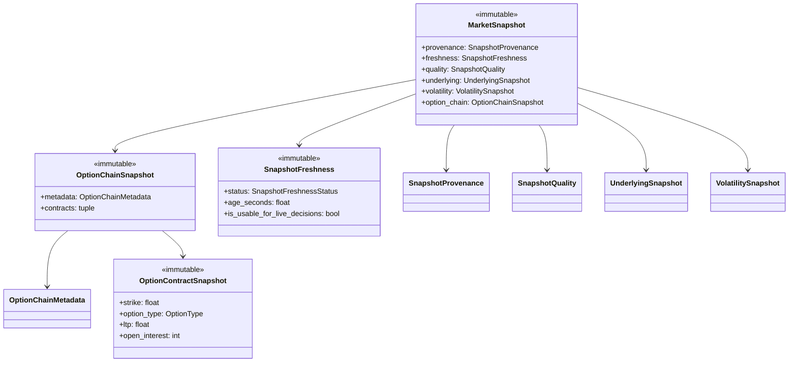

# Market Snapshot — Software Engineering Specification

| Field | Value |
|---|---|
| **Module** | `market_data/market_snapshot.py` |
| **Document version** | 1.0.0 |
| **Status** | Draft — ready for implementation |
| **Owner** | THETA AI TRADER Core Platform |
| **Last updated** | 2026-08-02 |

---

## 1. Purpose

`market_data/market_snapshot.py` defines the **canonical, immutable point-in-time market data model** for THETA AI TRADER.

The module is the single source of truth for how normalized market observations — index spot, volatility context, and an option-chain slice — are represented, validated, freshness-checked, and serialized before they enter the analytical pipeline.

Today, snapshot-shaped data appears as loosely typed dictionaries across legacy modules (`market_data_engine.py`, `option_snapshot_engine.py`, `live_oi_engine.py`, pipeline scripts). Each caller invents its own field names, optional fields, and validation rules. That fragmentation makes orchestrators brittle, prevents safe sharing between engines, and blocks capital-protection guarantees that depend on knowing whether data is complete and fresh.

This module resolves that by providing:

1. A **frozen, typed composite** (`MarketSnapshot`) that adapters produce and engines consume.
2. **Explicit validation and freshness semantics** so downstream engines can fail closed when data is unsafe.
3. **Deterministic serialization** for audit trails, replay, and test fixtures.
4. A **stable contract** that aligns with `MarketDataAdapter` normalized contracts and `EngineContext.payload` usage in `core/base_engine.py`.

### Goals

1. Replace ad-hoc snapshot dictionaries with one production-grade immutable model.
2. Enable every intelligence engine to receive the same validated market view for a given pipeline run.
3. Make data quality, freshness, and completeness first-class, inspectable properties — not inferred implicitly.
4. Serve as the migration target for legacy snapshot formats while preserving backward-compatible deserialization where feasible.

### Success criteria

- A pipeline run can be fully described by one `MarketSnapshot` instance plus correlation metadata.
- Any engine can reject trade-enabling logic when snapshot validation or freshness checks fail, without re-implementing rules.
- Unit tests can construct deterministic snapshots without broker access.
- Serialization round-trips preserve semantic equality.

### Relationship to other modules

| Module | Relationship |
|---|---|
| `market_data_adapter.py` | **Upstream producer.** Adapters map broker payloads into snapshot component types; they do not own the canonical model. |
| `market_data_engine.py` | **Upstream fetcher.** Fetches raw broker data; must not define its own snapshot schema long term. |
| `market_data_safety.py` | **Freshness collaborator.** Freshness evaluation may delegate session/timestamp rules; results are stored on the snapshot. |
| `option_snapshot_engine.py` | **Persistence layer.** May serialize/deserialize `MarketSnapshot` for T1→T2 comparison; persistence is out of scope for this module. |
| `market_regime_detector.py` | **Legacy consumer.** Contains a simplified, derived `MarketSnapshot` dataclass (trend/IV summary). That type will be renamed or replaced by engine-specific payload types built *from* this module's snapshot. |
| `core/base_engine.py` | **Downstream contract.** `MarketSnapshot` is a primary candidate for `EngineContext.payload` in market-facing engines. |

---

## 2. Responsibilities

`market_data/market_snapshot.py` **is responsible for**:

| # | Responsibility | Description |
|---|---|---|
| R1 | **Canonical snapshot model** | Define `MarketSnapshot` and composed immutable sub-types representing one coherent market observation set. |
| R2 | **Option contract snapshot type** | Define `OptionContractSnapshot` aligned with `MarketDataAdapter.build_contract` field names and semantics. |
| R3 | **Underlying snapshot type** | Define `UnderlyingSnapshot` for index spot and session OHLC context (e.g., NIFTY 50). |
| R4 | **Volatility context type** | Define `VolatilitySnapshot` for index-level volatility inputs (e.g., India VIX). |
| R5 | **Chain metadata type** | Define `OptionChainMetadata` for expiry, ATM strike, strike step, and strike window boundaries. |
| R6 | **Freshness model** | Define `SnapshotFreshnessStatus` enumeration and `SnapshotFreshness` record capturing age, session state, and safe-to-trade flag. |
| R7 | **Quality model** | Define `SnapshotQuality` with completeness score, rejection counts, and structured warnings. |
| R8 | **Snapshot identity and provenance** | Define `SnapshotProvenance` with snapshot ID, schema version, source adapter, and capture timestamps. |
| R9 | **Validation API** | Provide `validate_market_snapshot(snapshot) -> SnapshotValidationResult` enforcing field, cross-field, and structural rules. |
| R10 | **Freshness evaluation API** | Provide `evaluate_snapshot_freshness(snapshot, *, reference_time, policy) -> SnapshotFreshness` using configurable thresholds. |
| R11 | **Construction helpers** | Provide `build_market_snapshot(...)` that assembles sub-types, runs validation, and returns an immutable instance or structured rejection. |
| R12 | **Serialization** | Provide `to_dict`, `from_dict`, `to_json`, `from_json` with explicit schema version handling. |
| R13 | **Equality and hashing** | Support value-based equality for deterministic tests; document hashability constraints. |
| R14 | **Error taxonomy** | Define stable validation/freshness error codes namespaced under `MARKET_SNAPSHOT.*`. |
| R15 | **Documentation contract** | Google-style docstrings on all public types and functions; module-level description of invariants. |

---

## 3. Non-Responsibilities

`market_data/market_snapshot.py` **must not**:

| # | Non-responsibility | Rationale |
|---|---|---|
| NR1 | **Fetch broker or network data** | Data acquisition belongs in `market_data_engine.py` and broker adapters. |
| NR2 | **Authenticate with brokers** | Credentials and sessions are infrastructure concerns. |
| NR3 | **Normalize raw Kite/Zerodha payloads** | Normalization belongs in `market_data_adapter.py`. |
| NR4 | **Calculate Greeks, IV surfaces, or regime labels** | Analytical derivation belongs in dedicated engines (Greeks, Intelligence, Regime). |
| NR5 | **Generate trading signals or permissions** | Decision authority stays in decision/risk engines. |
| NR6 | **Persist snapshots to disk or database** | Persistence belongs in `option_snapshot_engine.py` or a future storage module. |
| NR7 | **Orchestrate pipelines or call engines** | Orchestrators assemble snapshots and invoke engines; this module is pure domain logic. |
| NR8 | **Load configuration files or environment variables** | Accept already-resolved policy objects (freshness thresholds) via function parameters or constructor injection at call sites. |
| NR9 | **Mutate snapshots after construction** | All types are immutable; corrections require building a new snapshot. |
| NR10 | **Maintain mutable caches or snapshot history** | History stores are external; this module defines snapshots, not repositories. |
| NR11 | **Place or simulate orders** | Execution is strictly out of scope. |

---

## 4. Immutable Data Model

All public snapshot types are **immutable dataclasses** (`frozen=True`). Collections exposed on snapshots must be immutable (`tuple`, `MappingProxyType`, or equivalent) — never mutable `list` or `dict` held by reference.

### 4.1 Type hierarchy

```text
MarketSnapshot
├── provenance: SnapshotProvenance
├── freshness: SnapshotFreshness
├── quality: SnapshotQuality
├── underlying: UnderlyingSnapshot
├── volatility: VolatilitySnapshot | None
└── option_chain: OptionChainSnapshot

OptionChainSnapshot
├── metadata: OptionChainMetadata
└── contracts: tuple[OptionContractSnapshot, ...]
```

### 4.2 Core types

| Type | Kind | Mutability | Description |
|---|---|---|---|
| `MarketSnapshot` | Dataclass | Frozen | Top-level canonical snapshot for one pipeline observation. |
| `SnapshotProvenance` | Dataclass | Frozen | Identity, schema version, source, capture and assembly timestamps. |
| `SnapshotFreshness` | Dataclass | Frozen | Freshness status, age, session context, and downstream usability flag. |
| `SnapshotQuality` | Dataclass | Frozen | Completeness metrics and non-fatal warnings. |
| `UnderlyingSnapshot` | Dataclass | Frozen | Index/underlying price and session OHLC. |
| `VolatilitySnapshot` | Dataclass | Frozen | Index volatility index reading (optional but recommended). |
| `OptionChainSnapshot` | Dataclass | Frozen | Option chain slice with metadata and contracts. |
| `OptionChainMetadata` | Dataclass | Frozen | Expiry, ATM, strike grid parameters. |
| `OptionContractSnapshot` | Dataclass | Frozen | One normalized option contract observation. |
| `SnapshotValidationResult` | Dataclass | Frozen | Outcome of validation with errors and warnings. |
| `SnapshotFreshnessPolicy` | Dataclass | Frozen | Configurable thresholds for freshness evaluation. |

### 4.3 Enumerations

| Enum | Values (v1) | Purpose |
|---|---|---|
| `SnapshotFreshnessStatus` | `FRESH`, `STALE`, `MARKET_CLOSED`, `FUTURE_TIMESTAMP`, `UNKNOWN` | Machine-readable freshness classification. |
| `SnapshotSource` | `LIVE`, `REPLAY`, `FIXTURE`, `BACKTEST` | How the snapshot was produced. |
| `OptionType` | `CE`, `PE` | Normalized option side. |
| `LiquidityBand` | `EXCELLENT`, `GOOD`, `AVERAGE`, `POOR`, `UNKNOWN` | Optional derived band stored when pre-computed upstream; not computed here in v1. |
| `SnapshotValidationStatus` | `VALID`, `INVALID`, `PARTIAL` | Overall validation outcome. |

### 4.4 Invariants (global)

1. Once constructed and validated, a `MarketSnapshot` instance must not change.
2. `MarketSnapshot.provenance.snapshot_id` must be unique within a pipeline run namespace (UUID v4 or deterministic hash — see §5).
3. `MarketSnapshot.provenance.as_of` must be timezone-aware.
4. `option_chain.contracts` must be sorted by `(strike ascending, option_type)` for deterministic comparisons.
5. No duplicate `(strike, option_type)` pairs within one `OptionChainSnapshot`.
6. If `freshness.is_usable_for_live_decisions` is `False`, orchestrators must treat the snapshot as **no-trade** unless explicitly running in analysis/replay mode.
7. `quality.validation_status == INVALID` implies the snapshot must not enter live trade-enabling engines.

### 4.5 Relationship diagram



---

## 5. Field Definitions

### 5.1 `SnapshotProvenance`

| Field | Required | Description |
|---|---|---|
| `snapshot_id` | Yes | Unique identifier. v1: UUID string (`uuid4`) or deterministic SHA-256 hex truncated to 32 chars from canonical serialized content + `as_of`. |
| `schema_version` | Yes | Semantic version of snapshot schema (initial: `"1.0.0"`). |
| `source` | Yes | `SnapshotSource` indicating LIVE, REPLAY, etc. |
| `adapter_name` | Yes | Producing adapter identifier, e.g. `"market_data_adapter"`. |
| `adapter_version` | No | Adapter semantic version when available. |
| `correlation_id` | No | Pipeline run correlation ID; mirrors `EngineContext.correlation_id` when present. |
| `as_of` | Yes | Decision timestamp — when the snapshot represents the market (timezone-aware). |
| `captured_at` | Yes | Wall-clock time when snapshot assembly completed (timezone-aware). |
| `underlying_symbol` | Yes | Canonical symbol, e.g. `"NIFTY"`. |
| `exchange` | Yes | Primary exchange code, e.g. `"NFO"` for options, `"NSE"` for spot. |

### 5.2 `UnderlyingSnapshot`

| Field | Required | Description |
|---|---|---|
| `symbol` | Yes | Index symbol, e.g. `"NIFTY 50"`. |
| `exchange` | Yes | Spot exchange, e.g. `"NSE"`. |
| `quote_key` | Yes | Broker quote key, e.g. `"NSE:NIFTY 50"`. |
| `last_price` | Yes | Last traded price (spot). Must be finite and > 0. |
| `open` | No | Session open from OHLC. |
| `high` | No | Session high from OHLC. |
| `low` | No | Session low from OHLC. |
| `previous_close` | No | Prior session close. |
| `change` | No | Absolute change vs previous close. |
| `change_percent` | No | Percentage change vs previous close. |
| `quote_timestamp` | No | Broker-reported quote timestamp (timezone-aware when present). |
| `volume` | No | Underlying volume if provided by broker (often zero for indices). |

### 5.3 `VolatilitySnapshot`

| Field | Required | Description |
|---|---|---|
| `symbol` | Yes | Volatility index symbol, e.g. `"INDIA VIX"`. |
| `exchange` | Yes | Exchange code, e.g. `"NSE"`. |
| `quote_key` | Yes | Broker quote key, e.g. `"NSE:INDIA VIX"`. |
| `last_price` | Yes | Current VIX level. Must be finite and > 0 when present. |
| `quote_timestamp` | No | Broker-reported quote timestamp. |

`volatility` on `MarketSnapshot` may be `None` when VIX is unavailable; downstream engines must handle absence explicitly.

### 5.4 `OptionChainMetadata`

| Field | Required | Description |
|---|---|---|
| `underlying` | Yes | Underlying name, e.g. `"NIFTY"`. |
| `exchange` | Yes | Derivatives exchange, e.g. `"NFO"`. |
| `expiry` | Yes | ISO 8601 date string (`YYYY-MM-DD`). |
| `atm_strike` | Yes | Strike nearest spot at capture time. |
| `strike_step` | Yes | Minimum positive strike increment in the chain. |
| `strike_window_strikes` | Yes | Number of strikes each side of ATM included in the slice. |
| `minimum_strike` | Yes | Lowest strike in the slice. |
| `maximum_strike` | Yes | Highest strike in the slice. |
| `lot_size` | Yes | Exchange lot size for the underlying options. |
| `contract_count` | Yes | Number of contracts in `contracts` tuple. |
| `complete_pairs` | Yes | Count of strikes with both CE and PE present. |

### 5.5 `OptionContractSnapshot`

Aligned with `MarketDataAdapter.build_contract` output. Field names use adapter-canonical keys.

| Field | Required | Description |
|---|---|---|
| `underlying` | Yes | Underlying name. |
| `exchange` | Yes | Exchange code. |
| `tradingsymbol` | Yes | Broker trading symbol. |
| `expiry` | Yes | ISO date string. |
| `strike` | Yes | Strike price. |
| `option_type` | Yes | `OptionType.CE` or `OptionType.PE`. |
| `lot_size` | Yes | Contract lot size. |
| `ltp` | Yes | Last traded premium. |
| `bid` | Yes | Best bid. |
| `ask` | Yes | Best ask. |
| `volume` | Yes | Session volume (≥ 0). |
| `open_interest` | Yes | Open interest (≥ 0). |
| `delta` | No | Model delta when pre-attached. |
| `iv` | No | Implied volatility when pre-attached. |
| `gamma` | No | Model gamma when pre-attached. |
| `theta` | No | Model theta when pre-attached. |
| `vega` | No | Model vega when pre-attached. |
| `instrument_token` | No | Broker instrument token. |
| `exchange_token` | No | Broker exchange token. |
| `tick_size` | No | Minimum price tick. |
| `quote_timestamp` | No | Quote observation timestamp. |
| `last_quantity` | No | Last traded quantity. |
| `average_price` | No | Session average price. |
| `buy_quantity` | No | Aggregate buy quantity. |
| `sell_quantity` | No | Aggregate sell quantity. |
| `oi_day_high` | No | Day high OI. |
| `oi_day_low` | No | Day low OI. |

### 5.6 `SnapshotFreshness`

| Field | Required | Description |
|---|---|---|
| `status` | Yes | `SnapshotFreshnessStatus`. |
| `reference_time` | Yes | Time used for age calculation (timezone-aware). |
| `observation_time` | Yes | Effective observation timestamp derived from underlying/chain quote times. |
| `age_seconds` | Yes | Non-negative age in seconds (`reference_time - observation_time`), except `FUTURE_TIMESTAMP` where negative age is preserved for diagnostics. |
| `market_session_open` | Yes | Whether regular session is open at `reference_time`. |
| `max_age_seconds` | Yes | Threshold applied for live freshness. |
| `is_usable_for_live_decisions` | Yes | Capital-protection flag. `False` when stale, future-dated, or structurally invalid during live session. |
| `reason` | Yes | Human-readable explanation. |

### 5.7 `SnapshotQuality`

| Field | Required | Description |
|---|---|---|
| `validation_status` | Yes | `SnapshotValidationStatus`. |
| `completeness_score` | Yes | 0–100 float summarizing structural completeness. |
| `expected_contract_count` | No | Expected contracts for the configured window. |
| `missing_quotes` | Yes | Count of contracts failing quote validation. |
| `inverted_markets` | Yes | Count of contracts where `ask < bid`. |
| `warnings` | Yes | Tuple of `SnapshotWarningRecord` (code, message, field). |
| `errors` | Yes | Tuple of `SnapshotErrorRecord` (code, message, field). |

### 5.8 `MarketSnapshot`

| Field | Required | Description |
|---|---|---|
| `provenance` | Yes | Identity and capture metadata. |
| `freshness` | Yes | Freshness evaluation result at assembly time. |
| `quality` | Yes | Validation and completeness summary. |
| `underlying` | Yes | Spot/index observation. |
| `volatility` | No | VIX or equivalent; optional in v1. |
| `option_chain` | Yes | Option chain slice. |

---

## 6. Data Types

### 6.1 Python type mapping

| Concept | Python type | Notes |
|---|---|---|
| Identifiers | `str` | Non-empty after strip. |
| Timestamps | `datetime.datetime` | Must be timezone-aware (`tzinfo is not None`). |
| Dates | `str` (ISO date) or `datetime.date` | Serialize dates as `YYYY-MM-DD` strings in JSON. |
| Prices, rates, scores | `float` | Must pass `math.isfinite()`. |
| Quantities (OI, volume) | `int` | ≥ 0 unless explicitly documented otherwise. |
| Enumerations | `Enum` subclasses | Subclass `str, Enum` for JSON compatibility. |
| Contract collections | `tuple[OptionContractSnapshot, ...]` | Sorted, immutable. |
| Warning/error lists | `tuple[SnapshotWarningRecord, ...]` | Immutable. |
| Optional Greeks | `float \| None` | Absence is valid; presence must be finite. |
| Policy objects | `SnapshotFreshnessPolicy` | Frozen dataclass passed into freshness evaluation. |

### 6.2 Numeric precision

| Domain | Storage | Comparison tolerance |
|---|---|---|
| Spot and strikes | `float` | Exact equality for strikes sourced from exchange grid. |
| Premiums (ltp, bid, ask) | `float` | `1e-6` relative tolerance in tests. |
| IV / Greeks | `float` | `1e-4` absolute tolerance in tests. |
| Completeness score | `float` | Range `[0.0, 100.0]` inclusive. |

### 6.3 Schema version

- Current schema version constant: `MARKET_SNAPSHOT_SCHEMA_VERSION = "1.0.0"`.
- Serialized payloads must include `"schema_version"` at the root.
- `from_dict` rejects unsupported major versions; minor version additions must be backward compatible.

---

## 7. Validation Rules

Validation is layered. `validate_market_snapshot` runs all layers and returns `SnapshotValidationResult` without mutating the input.

### 7.1 Layer 1 — Structural validation

| Rule ID | Condition | Error code |
|---|---|---|
| V-001 | `provenance.as_of` is timezone-aware | `MARKET_SNAPSHOT.PROVENANCE.NAIVE_TIMESTAMP` |
| V-002 | `provenance.captured_at` is timezone-aware | `MARKET_SNAPSHOT.PROVENANCE.NAIVE_CAPTURED_AT` |
| V-003 | `provenance.snapshot_id` non-empty | `MARKET_SNAPSHOT.PROVENANCE.MISSING_ID` |
| V-004 | `underlying.last_price` finite and > 0 | `MARKET_SNAPSHOT.UNDERLYING.INVALID_SPOT` |
| V-005 | `option_chain.metadata.expiry` matches ISO date regex | `MARKET_SNAPSHOT.CHAIN.INVALID_EXPIRY` |
| V-006 | `option_chain.metadata.strike_step` > 0 | `MARKET_SNAPSHOT.CHAIN.INVALID_STRIKE_STEP` |
| V-007 | `option_chain.metadata.atm_strike` within `[minimum_strike, maximum_strike]` | `MARKET_SNAPSHOT.CHAIN.ATM_OUT_OF_RANGE` |
| V-008 | `option_chain.contracts` non-empty | `MARKET_SNAPSHOT.CHAIN.EMPTY` |
| V-009 | No duplicate `(strike, option_type)` | `MARKET_SNAPSHOT.CHAIN.DUPLICATE_CONTRACT` |
| V-010 | Contracts sorted by strike then option type | `MARKET_SNAPSHOT.CHAIN.UNSORTED` |

### 7.2 Layer 2 — Field validation (per contract)

| Rule ID | Condition | Severity |
|---|---|---|
| V-101 | `strike` finite and > 0 | Error |
| V-102 | `option_type` in `{CE, PE}` | Error |
| V-103 | `ltp` finite and ≥ 0 | Error |
| V-104 | `bid` finite and > 0 | Warning if missing; error if negative/non-finite |
| V-105 | `ask` finite and > 0 | Warning if missing; error if negative/non-finite |
| V-106 | `ask >= bid` when both present | Warning (`INVERTED_MARKET`) |
| V-107 | `volume` ≥ 0 | Error |
| V-108 | `open_interest` ≥ 0 | Error |
| V-109 | `expiry` matches chain metadata expiry | Error |
| V-110 | `underlying` matches chain metadata underlying | Error |

### 7.3 Layer 3 — Cross-field validation

| Rule ID | Condition | Outcome |
|---|---|---|
| V-201 | `abs(atm_strike - spot)` ≤ `strike_step` | Warning if violated (ATM drift between quote and metadata) |
| V-202 | Every contract strike within `[minimum_strike, maximum_strike]` | Error |
| V-203 | `contract_count == len(contracts)` | Error |
| V-204 | `complete_pairs` ≤ unique strikes | Error |
| V-205 | If `volatility` present, `last_price` > 0 | Error |
| V-206 | `observation_time` ≤ `provenance.captured_at` + 5s tolerance | Warning |

### 7.4 Layer 4 — Quality classification

| Status | Criteria |
|---|---|
| `VALID` | No errors; completeness_score ≥ configured minimum (default 90). |
| `PARTIAL` | No errors; completeness_score ≥ 70 and < 90, or non-fatal warnings present. |
| `INVALID` | One or more errors, empty chain, invalid spot, or completeness_score < 70. |

Default `minimum_completeness_for_valid = 90.0`.

Completeness score formula (v1):

```text
score = 100.0
score -= (missing_quotes / max(contract_count, 1)) * 40
score -= (inverted_markets / max(contract_count, 1)) * 10
score -= max(0, expected_pairs - complete_pairs) * 2
score = clamp(score, 0, 100)
```

where `expected_pairs = metadata.strike_window_strikes * 2` when both CE and PE are expected for each strike in the window.

### 7.5 Validation API

| Function | Signature | Behavior |
|---|---|---|
| `validate_market_snapshot` | `(snapshot: MarketSnapshot, *, policy: ValidationPolicy \| None = None) -> SnapshotValidationResult` | Runs all layers; does not mutate snapshot. |
| `ValidationPolicy` | Frozen dataclass | Configures completeness thresholds and strictness (e.g., treat warnings as errors in live mode). |

---

## 8. Data Freshness Rules

Freshness evaluation determines whether a snapshot may drive **live trade-enabling** decisions. It aligns with `market_data_safety.py` session semantics.

### 8.1 `SnapshotFreshnessPolicy` defaults

| Parameter | Default | Description |
|---|---|---|
| `market_open` | `09:15` IST | Regular session open. |
| `market_close` | `15:30` IST | Regular session close. |
| `timezone` | `Asia/Kolkata` | Session evaluation timezone. |
| `max_quote_age_seconds_live` | `120` | Maximum quote age during open session. |
| `max_quote_age_seconds_pre_open` | `900` | Pre-open tolerance (optional v1). |
| `allow_market_closed_analysis` | `True` | Snapshots outside session may be marked usable for analysis-only. |
| `future_timestamp_tolerance_seconds` | `2` | Clock skew allowance. |

### 8.2 Observation time selection

Effective `observation_time` is the **minimum** of:

1. `underlying.quote_timestamp` (if present)
2. Latest non-null `quote_timestamp` among contracts
3. `provenance.as_of` (fallback)

### 8.3 Freshness decision table

| Session state | Age condition | Status | `is_usable_for_live_decisions` |
|---|---|---|---|
| Open | `age <= max_quote_age_seconds_live` | `FRESH` | `True` (if also `VALID`) |
| Open | `age > max_quote_age_seconds_live` | `STALE` | `False` |
| Closed (weekday after close or weekend) | any non-future age | `MARKET_CLOSED` | `False` for live; `True` for analysis-only flag when `allow_market_closed_analysis` |
| Any | `observation_time > reference_time + tolerance` | `FUTURE_TIMESTAMP` | `False` |
| Any | Missing observation time | `UNKNOWN` | `False` |

### 8.4 Integration with quality validation

A snapshot is **live-usable** only when **all** hold:

1. `quality.validation_status` is `VALID` or `PARTIAL` (configurable; default requires `VALID` for live).
2. `freshness.is_usable_for_live_decisions` is `True`.
3. `freshness.status` is `FRESH` for live session trading.

Helper:

| Function | Description |
|---|---|
| `is_live_trade_ready(snapshot, *, strict: bool = True) -> bool` | Combines freshness + quality for orchestrators. |
| `evaluate_snapshot_freshness(snapshot, *, reference_time, policy) -> SnapshotFreshness` | Computes freshness block; may be called at build time and re-evaluated later with a new `reference_time`. |

Re-evaluation note: snapshots are immutable; freshness may be recomputed by constructing an updated snapshot with a new `freshness` block via `dataclasses.replace` in the builder layer (the module may expose `with_freshness(snapshot, freshness)` as a pure helper returning a new instance).

---

## 9. Snapshot Lifecycle

### 9.1 End-to-end lifecycle

```text
[Broker raw data]
    → MarketDataEngine.fetch (external)
    → MarketDataAdapter.normalize (external)
    → build_market_snapshot(components...)
        → assemble immutable sub-types
        → validate_market_snapshot
        → evaluate_snapshot_freshness
        → MarketSnapshot (immutable)
    → Orchestrator attaches to EngineContext.payload
    → Engines consume read-only
    → Optional: to_json for persistence (external)
```

### 9.2 Construction lifecycle

```text
[build_market_snapshot]
    → validate required inputs present
    → normalize and sort contracts
    → compute metadata (contract_count, complete_pairs)
    → compute quality
    → compute freshness
    → construct MarketSnapshot
    → return snapshot OR raise SnapshotBuildError / return Result type
```

Construction policy (v1): **`build_market_snapshot` raises `SnapshotBuildError`** on hard failures (empty contracts, invalid spot). Warnings are attached to `quality.warnings` but do not abort unless `strict=True`.

### 9.3 Consumption lifecycle

1. Orchestrator receives `MarketSnapshot`.
2. Calls `is_live_trade_ready(snapshot)` before trade-enabling engines.
3. Passes snapshot (or engine-specific projections) as `EngineContext.payload`.
4. Engines must not mutate or enrich the snapshot in place; derived values belong in engine result payloads.

### 9.4 Replay lifecycle

1. Load serialized JSON via `from_json`.
2. Set `provenance.source = SnapshotSource.REPLAY`.
3. Re-run `evaluate_snapshot_freshness` with explicit `reference_time` if simulating historical decisions.
4. Never treat replay snapshots as live without explicit orchestrator mode flag.

### 9.5 Idempotency

Given identical normalized inputs and policy, `build_market_snapshot` produces semantically equal snapshots. When using deterministic `snapshot_id` derivation, equality extends to identical IDs.

---

## 10. Serialization

### 10.1 Formats

| Format | Functions | Use case |
|---|---|---|
| Dictionary | `to_dict(snapshot) -> dict[str, Any]` | Internal logging, adapter interop |
| JSON | `to_json(snapshot) -> str` | File persistence, API transport |
| Deserialization | `from_dict(data) -> MarketSnapshot` | Load from dict |
| JSON parse | `from_json(text) -> MarketSnapshot` | Load from file |

### 10.2 JSON root schema (v1)

```json
{
  "schema_version": "1.0.0",
  "provenance": { },
  "freshness": { },
  "quality": { },
  "underlying": { },
  "volatility": null,
  "option_chain": {
    "metadata": { },
    "contracts": [ ]
  }
}
```

### 10.3 Serialization rules

1. Timestamps serialize as ISO 8601 with timezone offset (`datetime.isoformat()`).
2. Dates serialize as `YYYY-MM-DD` strings.
3. Enums serialize as their string value.
4. Omit `None` optional fields in JSON output when `omit_nulls=True` (default).
5. `from_dict` must validate after deserialization — never trust external JSON without validation.
6. Unknown fields in input dicts are ignored with a logged warning (forward compatibility).
7. Contracts deserialize into immutable tuples.

### 10.4 Legacy format compatibility

The module must provide `from_legacy_option_snapshot(data: dict) -> MarketSnapshot` to ingest existing shapes:

| Legacy source | Mapping notes |
|---|---|
| `market_data_engine.get_nifty_option_snapshot` | Map `spot` → `underlying.last_price`, `options[]` → contracts (`price` → `ltp`, `oi` → `open_interest`). |
| `option_snapshot_engine` saved JSON | Map root `timestamp` → `provenance.as_of`, preserve `expiry`, `atm`, `strike_step`. |
| `logs/test_live_oi_snapshot.json` | Same as option snapshot engine format. |

Legacy conversion sets `provenance.source = REPLAY` unless explicitly marked LIVE.

### 10.5 Canonical equality

`MarketSnapshot` implements value equality across all fields. JSON round-trip must preserve equality:

```text
snapshot == from_json(to_json(snapshot))
```

---

## 11. Performance Requirements

| Requirement | Target | Notes |
|---|---|---|
| Build time (21 contracts) | < 5 ms median | Excludes broker fetch; pure Python assembly |
| Validation time (21 contracts) | < 3 ms median | All validation layers |
| Serialization to JSON (21 contracts) | < 10 ms median | Standard library `json` |
| Deserialization from JSON (21 contracts) | < 15 ms median | Includes validation |
| Memory per snapshot | ≤ 256 KB for 42-contract slice | Measured excluding JSON string |
| Allocation discipline | Use tuples; avoid deep copies on read paths | Shallow immutability for nested dicts forbidden |
| Scalability | O(n) over contract count | No O(n²) cross-contract comparisons beyond duplicate detection |

Benchmarks live in `tests/test_market_snapshot.py` using fixed fixtures.

---

## 12. Thread Safety

| Aspect | Requirement |
|---|---|
| Snapshot instances | Immutable and safe to share across threads without locking |
| `build_market_snapshot` | Must be reentrant; no module-level mutable state |
| `validate_market_snapshot` | Pure function of inputs; thread-safe |
| Serialization functions | Thread-safe (operate on immutable inputs) |
| Global mutable caches | Forbidden in this module |
| Policy objects | Must be immutable (`frozen=True`) when shared |

Concurrent calls with identical inputs may run in parallel. Callers requiring strict deduplication must implement caching outside this module.

---

## 13. Security Considerations

| Concern | Requirement |
|---|---|
| Secrets in snapshots | Snapshots must never contain API keys, access tokens, or broker credentials |
| PII | v1 snapshots contain market data only; no client/account identifiers |
| Untrusted deserialization | `from_json` / `from_dict` must validate all fields; reject malformed types; cap JSON input size at caller boundary (recommended max 10 MB) |
| Injection via symbol fields | Treat `tradingsymbol` as opaque string; do not evaluate or interpolate into shell/SQL commands |
| Log safety | `__repr__` and log helpers must truncate long contract lists (show count + ATM pair summary) |
| Integrity | Optional future: content hash in `provenance` for tamper detection; not required v1 |
| Replay attacks | Orchestrator must distinguish `SnapshotSource.LIVE` vs `REPLAY`; live trading path rejects replay without explicit override flag |

---

## 14. Future Extension Points

Designed for extension without breaking v1 consumers:

| Extension | Description |
|---|---|
| **Multi-expiry chains** | `option_chains: tuple[OptionChainSnapshot, ...]` on a v2 root type |
| **Equity/F&O underlyings** | Generalize `underlying_symbol` beyond NIFTY (BANKNIFTY, FINNIFTY, single-stock) |
| **Forward pricing attachment** | Optional `forward_curve: ForwardCurveSnapshot` after forward engine runs |
| **Pre-computed intelligence** | Optional attachment slot for derived analytics (explicitly not computed here) |
| **Content-addressed IDs** | Deterministic snapshot hashing for deduplication |
| **Compression** | Optional gzip wrapper for persistence layer |
| **Protobuf/Arrow** | Alternative serialization for high-throughput backtests |
| **Generic typing** | `MarketSnapshot[UnderlyingT, ContractT]` for stricter compile-time checks |
| **Event stream metadata** | Sequence numbers for websocket-fed incremental updates |
| **Cross-vendor normalization** | Additional adapter mappers registered externally, same canonical model |

Extensions must preserve immutability and must not move broker I/O into this module.

---

## 15. Example Snapshot

Illustrative JSON (truncated to four contracts). Values are synthetic but schema-valid.

```json
{
  "schema_version": "1.0.0",
  "provenance": {
    "snapshot_id": "a1b2c3d4-e5f6-7890-abcd-ef1234567890",
    "schema_version": "1.0.0",
    "source": "LIVE",
    "adapter_name": "market_data_adapter",
    "adapter_version": "1.0.0",
    "correlation_id": "run-20260802-101500-001",
    "as_of": "2026-08-02T10:15:00+05:30",
    "captured_at": "2026-08-02T10:15:01.042+05:30",
    "underlying_symbol": "NIFTY",
    "exchange": "NFO"
  },
  "freshness": {
    "status": "FRESH",
    "reference_time": "2026-08-02T10:15:01.042+05:30",
    "observation_time": "2026-08-02T10:15:00+05:30",
    "age_seconds": 1.042,
    "market_session_open": true,
    "max_age_seconds": 120,
    "is_usable_for_live_decisions": true,
    "reason": "Quote age within live threshold during open session"
  },
  "quality": {
    "validation_status": "VALID",
    "completeness_score": 96.5,
    "expected_contract_count": 42,
    "missing_quotes": 0,
    "inverted_markets": 0,
    "warnings": [],
    "errors": []
  },
  "underlying": {
    "symbol": "NIFTY 50",
    "exchange": "NSE",
    "quote_key": "NSE:NIFTY 50",
    "last_price": 24296.75,
    "open": 24200.0,
    "high": 24350.0,
    "low": 24180.0,
    "previous_close": 24210.5,
    "change": 86.25,
    "change_percent": 0.36,
    "quote_timestamp": "2026-08-02T10:15:00+05:30"
  },
  "volatility": {
    "symbol": "INDIA VIX",
    "exchange": "NSE",
    "quote_key": "NSE:INDIA VIX",
    "last_price": 13.24,
    "quote_timestamp": "2026-08-02T10:15:00+05:30"
  },
  "option_chain": {
    "metadata": {
      "underlying": "NIFTY",
      "exchange": "NFO",
      "expiry": "2026-08-07",
      "atm_strike": 24300.0,
      "strike_step": 50.0,
      "strike_window_strikes": 10,
      "minimum_strike": 23800.0,
      "maximum_strike": 24800.0,
      "lot_size": 75,
      "contract_count": 4,
      "complete_pairs": 2
    },
    "contracts": [
      {
        "underlying": "NIFTY",
        "exchange": "NFO",
        "tradingsymbol": "NIFTY2680724300CE",
        "expiry": "2026-08-07",
        "strike": 24300.0,
        "option_type": "CE",
        "lot_size": 75,
        "ltp": 110.0,
        "bid": 109.65,
        "ask": 109.9,
        "volume": 141895845,
        "open_interest": 8490430,
        "quote_timestamp": "2026-08-02T10:15:00+05:30"
      },
      {
        "underlying": "NIFTY",
        "exchange": "NFO",
        "tradingsymbol": "NIFTY2680724300PE",
        "expiry": "2026-08-07",
        "strike": 24300.0,
        "option_type": "PE",
        "lot_size": 75,
        "ltp": 115.0,
        "bid": 115.0,
        "ask": 115.15,
        "volume": 105397890,
        "open_interest": 7525375,
        "quote_timestamp": "2026-08-02T10:15:00+05:30"
      },
      {
        "underlying": "NIFTY",
        "exchange": "NFO",
        "tradingsymbol": "NIFTY2680724250CE",
        "expiry": "2026-08-07",
        "strike": 24250.0,
        "option_type": "CE",
        "lot_size": 75,
        "ltp": 138.2,
        "bid": 138.0,
        "ask": 138.35,
        "volume": 114968750,
        "open_interest": 4933045,
        "quote_timestamp": "2026-08-02T10:15:00+05:30"
      },
      {
        "underlying": "NIFTY",
        "exchange": "NFO",
        "tradingsymbol": "NIFTY2680724250PE",
        "expiry": "2026-08-07",
        "strike": 24250.0,
        "option_type": "PE",
        "lot_size": 75,
        "ltp": 93.0,
        "bid": 92.95,
        "ask": 93.1,
        "volume": 106021305,
        "open_interest": 7922200,
        "quote_timestamp": "2026-08-02T10:15:00+05:30"
      }
    ]
  }
}
```

### 15.1 Example usage flow (conceptual)

1. Adapter normalizes 42 contracts around ATM for NIFTY nearest expiry.
2. `build_market_snapshot` assembles the snapshot with `correlation_id` from the orchestrator.
3. `is_live_trade_ready(snapshot)` returns `True`.
4. Orchestrator builds `EngineContext(as_of=snapshot.provenance.as_of, payload=snapshot)`.
5. Market Regime, Greeks, and Intelligence engines consume the same immutable snapshot.

---

## 16. Unit Testing Strategy

Tests live in `tests/test_market_snapshot.py`.

### 16.1 Test fixtures

| Fixture | Description |
|---|---|
| `minimal_valid_snapshot` | Smallest valid snapshot (2 contracts, spot, metadata) |
| `full_nifty_snapshot` | 42-contract fixture mirroring production window |
| `legacy_option_snapshot_dict` | Dict matching `logs/test_live_oi_snapshot.json` shape |
| `fixed_timestamps` | Timezone-aware constants for reproducibility |

Fixtures are plain factory functions — no broker access.

### 16.2 Required test cases

| Category | Cases |
|---|---|
| **Construction** | Valid inputs produce immutable snapshot; contracts sorted; metadata counts correct |
| **Immutability** | Frozen dataclasses reject attribute mutation |
| **Validation — spot** | Zero/negative/NaN spot → `INVALID` |
| **Validation — chain** | Empty chain, duplicate contracts, unsorted input → errors |
| **Validation — contracts** | Negative OI/volume, invalid option type → errors |
| **Validation — cross-field** | Strike outside window, expiry mismatch → errors |
| **Freshness — live** | Fresh quote during session → `FRESH`, usable |
| **Freshness — stale** | Old quote during session → `STALE`, not usable |
| **Freshness — closed** | Market closed → `MARKET_CLOSED`, not live-usable |
| **Freshness — future** | Future observation → `FUTURE_TIMESTAMP` |
| **Quality scoring** | Missing quotes reduce completeness score predictably |
| **Serialization** | Round-trip equality dict/JSON |
| **Legacy import** | `from_legacy_option_snapshot` maps fields correctly |
| **Determinism** | Same inputs → equal snapshots |
| **Thread smoke** | Parallel build/validate from shared fixture without errors |
| **Security** | Untrusted malformed JSON raises structured parse/validation errors |
| **Performance smoke** | Build+validate 42 contracts completes under threshold on CI hardware |

### 16.3 Testing conventions

- No network, disk, or broker fixtures in unit tests.
- Use `Asia/Kolkata` timezone-aware datetimes.
- Google-style test names: `test_validate_rejects_duplicate_contract`.
- Target ≥ 95% line coverage on `market_data/market_snapshot.py`.
- Integration tests with `MarketDataAdapter` belong in `tests/test_market_data_snapshot_integration.py` (optional separate file).

### 16.4 Test doubles

- `SnapshotFreshnessPolicy` with shortened ages for fast stale tests.
- `ValidationPolicy(strict=True)` for strict-mode orchestrator simulation.

---

## 17. Risks

| Risk | Impact | Mitigation |
|---|---|---|
| **Legacy format divergence** | Multiple snapshot shapes persist; migration stalls | Provide `from_legacy_option_snapshot`; document field mapping; deprecate dict snapshots in orchestrator |
| **Name collision with `market_regime_detector.MarketSnapshot`** | Import confusion | Rename legacy type during migration; use explicit imports (`from market_data.market_snapshot import MarketSnapshot`) |
| **Large payload memory** | High memory in tight loops | Use tuples; avoid JSON round-trips in hot path; document shallow sharing |
| **Stale data traded live** | Capital loss | Fail-closed freshness; orchestrator gate via `is_live_trade_ready` |
| **Optional VIX absent** | Engines assume VIX always present | Explicit `None` handling; quality warnings when volatility missing |
| **Clock skew** | False `FUTURE_TIMESTAMP` | Configurable tolerance; use broker quote timestamps over wall clock |
| **Over-validation blocks valid trades** | Missed opportunities | `PARTIAL` status + warnings; configurable strictness |
| **Under-validation allows bad trades** | Execution on inverted/missing quotes | Default live mode requires `VALID` + `FRESH` |
| **Schema evolution pain** | Breaking downstream parsers | Strict semver on schema; integration tests for JSON compatibility |
| **Deterministic ID collisions** | Incorrect deduplication | Prefer UUID v4 for live; deterministic hash only for replay fixtures |

---

## 18. Definition of Done

The `market_data/market_snapshot.py` module and this specification are **done** when all of the following are true:

### 18.1 Implementation

- [ ] All public types and functions in §2 and §10 are implemented in `market_data/market_snapshot.py`.
- [ ] All dataclasses are immutable (`frozen=True`).
- [ ] Field names align with `MarketDataAdapter.build_contract` for option contracts.
- [ ] `MARKET_SNAPSHOT_SCHEMA_VERSION = "1.0.0"` exported.
- [ ] Stable error codes under `MARKET_SNAPSHOT.*` namespace implemented.
- [ ] Google-style docstrings on all public classes, methods, and module exports.
- [ ] Type hints on all public surfaces; mypy-clean or project-standard equivalent.
- [ ] No forbidden side effects: no broker I/O, no env loading, no global mutable state.

### 18.2 Testing

- [ ] `tests/test_market_snapshot.py` covers all cases in §16.2.
- [ ] Line coverage on `market_data/market_snapshot.py` ≥ 95%.
- [ ] JSON round-trip tests pass for full and minimal fixtures.
- [ ] Legacy snapshot conversion tested against `logs/test_live_oi_snapshot.json` shape.
- [ ] Tests run deterministically in CI with no external services.

### 18.3 Integration readiness

- [ ] At least one adapter or pipeline path produces a `MarketSnapshot` (may follow in adjacent PR).
- [ ] Orchestrator documentation updated to reference `is_live_trade_ready`.
- [ ] Legacy dict snapshot call sites identified with migration tickets.

### 18.4 Documentation

- [ ] This specification matches implemented behavior.
- [ ] `CHANGELOG.md` updated with "Add market snapshot canonical model".
- [ ] Cross-link added from `docs/specifications/base_engine.md` appendix (optional follow-up).

### 18.5 Review checklist

- [ ] Correctness — validation and freshness invariants enforced by tests.
- [ ] Readability — new contributor can implement from this spec alone.
- [ ] Maintainability — no trading logic in snapshot module.
- [ ] Architecture alignment — immutable, stateless functions, adapter/engine separation.
- [ ] Security — no secrets in snapshots; safe deserialization.

### 18.6 Sign-off

- [ ] Peer review approved.
- [ ] Specification version bumped if API changed post-review.

---

## Appendix A — Public API Summary

| Symbol | Kind | Description |
|---|---|---|
| `MARKET_SNAPSHOT_SCHEMA_VERSION` | Constant | Current schema semver |
| `MarketSnapshot` | Dataclass | Canonical root snapshot |
| `SnapshotProvenance` | Dataclass | Identity and capture metadata |
| `SnapshotFreshness` | Dataclass | Freshness evaluation result |
| `SnapshotQuality` | Dataclass | Validation quality summary |
| `UnderlyingSnapshot` | Dataclass | Spot/index data |
| `VolatilitySnapshot` | Dataclass | VIX data |
| `OptionChainSnapshot` | Dataclass | Chain slice |
| `OptionChainMetadata` | Dataclass | Chain grid metadata |
| `OptionContractSnapshot` | Dataclass | Single contract |
| `SnapshotFreshnessPolicy` | Dataclass | Freshness thresholds |
| `ValidationPolicy` | Dataclass | Validation strictness |
| `SnapshotValidationResult` | Dataclass | Validation output |
| `SnapshotFreshnessStatus` | Enum | Freshness classification |
| `SnapshotSource` | Enum | Snapshot origin |
| `OptionType` | Enum | CE / PE |
| `SnapshotValidationStatus` | Enum | VALID / PARTIAL / INVALID |
| `SnapshotBuildError` | Exception | Hard construction failure |
| `SnapshotValidationError` | Exception | Invalid deserialized data |
| `build_market_snapshot` | Function | Assemble and validate |
| `validate_market_snapshot` | Function | Validate existing snapshot |
| `evaluate_snapshot_freshness` | Function | Compute freshness block |
| `is_live_trade_ready` | Function | Orchestrator gate |
| `to_dict` / `from_dict` | Functions | Dict serialization |
| `to_json` / `from_json` | Functions | JSON serialization |
| `from_legacy_option_snapshot` | Function | Legacy dict migration |

---

## Appendix B — Glossary

| Term | Definition |
|---|---|
| **Snapshot** | Immutable point-in-time market observation bundle. |
| **Chain slice** | Subset of option contracts around ATM for one expiry. |
| **Freshness** | Whether quote timestamps are recent enough for live decisions. |
| **Completeness** | Structural quality score based on missing/inverted quotes. |
| **Provenance** | Origin metadata distinguishing live vs replay and adapter identity. |
| **Live-usable** | Snapshot meets freshness and validation thresholds for trade-enabling paths. |

---

## Appendix C — Related documents

- `docs/specifications/base_engine.md`
- `.cursor/rules/theta-ai-trader-engineering-standards.mdc`
- `.cursor/rules/theta-ai-trader-trading-architecture.mdc`
- `.cursor/rules/theta-ai-trader-development-workflow.mdc`
- `docs/foundation/THETA_AI_TRADER_ARCHITECTURE.md`
- `docs/foundation/ENGINEERING_PRINCIPLES.md`

---

## Appendix D — Revision history

| Version | Date | Author | Changes |
|---|---|---|---|
| 1.0.0 | 2026-08-02 | THETA AI TRADER | Initial specification |
