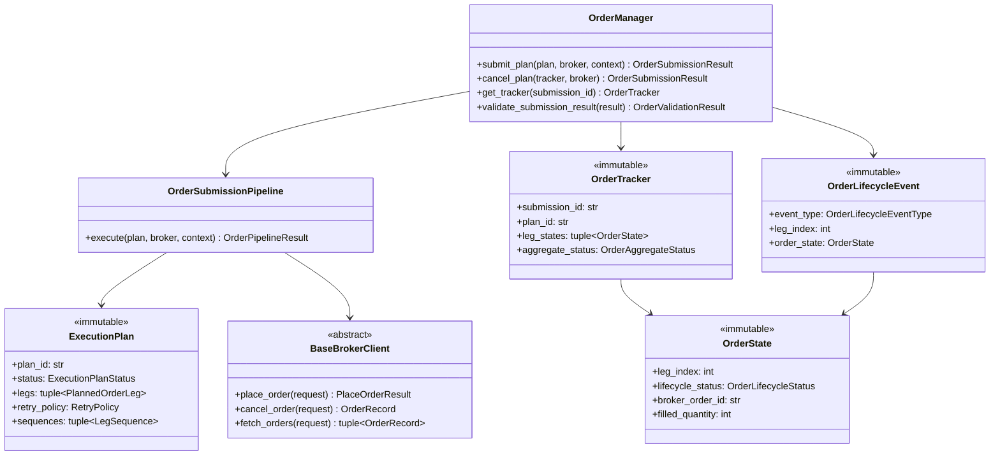

# Order Manager — Software Engineering Specification

| Field | Value |
|---|---|
| **Module** | `execution/order_manager.py` |
| **Document version** | 1.0.0 |
| **Status** | Draft — ready for implementation |
| **Owner** | THETA AI TRADER Core Platform |
| **Last updated** | 2026-08-04 |

---

## 1. Purpose

`execution/order_manager.py` defines the **institutional order submission and lifecycle management layer** for THETA AI TRADER v1.0.

The module consumes an immutable `ExecutionPlan` produced by the Execution Engine together with an injected `BaseBrokerClient` session, and performs **broker-neutral order submission, retry execution, lifecycle tracking, partial-fill reconciliation, cancellation, and rejection handling** — but **never** performs risk checks, strategy selection, contract/strike planning, position management, or APME logic.

The module answers: *"Given this READY execution plan and an authenticated broker client, how do we deterministically submit orders, track their lifecycle, apply retry policy, and publish auditable lifecycle events until every leg reaches a terminal state?"*

It is **not** an execution planner. It is **not** a risk manager. It is **not** a broker SDK adapter. It is the **order execution gate** between execution planning and broker transport.

### Pipeline placement

```text
[Market Data Engine]
    → MarketSnapshot (immutable)
              ↓
[Strategy Registry → Strategy Evaluation → Trade Decision]
              ↓
[risk/risk_engine.py]
    → RiskDecisionResult (APPROVED | REJECTED | SKIPPED)
              ↓
[execution/execution_engine.py]
    validate risk verdict + signal integrity
    build PlannedOrderLeg sequence + policies
              ↓
    ExecutionPlan (immutable)
    status: READY | SKIPPED | NO_PLAN | REJECTED
              ↓
[execution/order_manager.py]             ← THIS MODULE
    validate READY plan + plan validity window
    map PlannedOrderLeg → PlaceOrderRequest
    submit via BaseBrokerClient ONLY
    track OrderState per leg
    execute RetryPolicy from plan
    handle partial fills, cancellations, rejections
    publish order.* lifecycle events
              ↓
    OrderSubmissionResult (immutable)
    OrderTracker (immutable snapshot)
              ↓
[broker/base_broker.py → concrete adapters]
    place_order / modify_order / cancel_order / fetch_orders
              ↓
[Broker Execution]
              ↓
[Adaptive Position Management Engine (APME)]
    (downstream — not invoked by Order Manager)
```

### Architecture freeze note

The platform architecture is **FROZEN** for v1.0:

- **Order Manager** sits strictly **between** Execution Engine and Broker Layer.
- **Order submission ownership** has moved from the orchestrator (as described in `docs/specifications/execution_engine.md` Appendix B v1.0.0 draft) to **Order Manager** per this specification.
- The orchestrator **delegates** plan submission to `OrderManager.submit_plan()`; it does **not** call `BaseBrokerClient.place_order()` directly for institutional pipeline runs.
- Execution Engine **continues** to define retry **policy metadata** only; Order Manager **executes** retries.

### Goals

1. Provide a **dedicated order submission layer** between execution planning and broker transport — separate from risk, strategy, planning, and position management.
2. Consume **immutable upstream artifacts** (`ExecutionPlan`) without re-running execution planning or risk review.
3. Submit orders **exclusively** through `BaseBrokerClient` — never import Kite SDK or vendor-specific modules.
4. Apply **multi-stage deterministic submission pipeline** with ordered stages and stable rule identifiers.
5. Map `PlannedOrderLeg` → `PlaceOrderRequest` with **zero broker leakage** into Execution Engine types.
6. Execute **`ExecutionPlan.retry_policy`** with exponential backoff, idempotency key semantics, and retryable error classification.
7. Respect **`ExecutionPlan.sequences`** (`LegSequence`) for simultaneous, sequential, and hedged-first submission modes.
8. Maintain **immutable `OrderState`** snapshots for every tracked leg — append-only lifecycle history.
9. Handle **partial fills**, **cancellations**, and **rejections** with explicit terminal-state semantics.
10. Publish **order lifecycle events** via `core/event_bus.py` under the `order.*` topic namespace.
11. Remain **thread-safe** for concurrent submission runs on independent plans.
12. **Fail closed** on expired plans, disconnected brokers, or ambiguous leg state — prefer explicit rejection over silent submission.
13. Provide **full explainability** via structured error codes, warnings, and lifecycle event payloads.
14. Support **LIVE vs ANALYSIS vs BACKTEST** mode-aware submission strictness.
15. Achieve **deterministic, replay-verifiable** submission outcomes for identical inputs and broker responses.

### Success criteria

- Orchestrator invokes `OrderManager.submit_plan(plan, broker_client, context)` with `ExecutionPlan.status=READY` and receives immutable `OrderSubmissionResult`.
- Non-READY plans (`SKIPPED`, `NO_PLAN`, `REJECTED`) are rejected at pre-submit gate with `ORDER_MANAGER.PLAN.NOT_READY` — no broker calls.
- Expired plans (`reference_time >= plan.valid_until`) rejected with `ORDER_MANAGER.PLAN.EXPIRED` — no broker calls.
- Identical inputs (plan fingerprint, broker mock responses, config, reference time) produce semantically equal `OrderSubmissionResult` and identical `submission_fingerprint`.
- All order placement flows through `BaseBrokerClient.place_order()` — no Kite SDK imports anywhere in `execution/order_manager.py`.
- Retry loops honor `ExecutionPlan.retry_policy.max_attempts`, backoff parameters, and `retryable_error_codes`.
- Partial fills transition `OrderState` to `PARTIALLY_FILLED`; terminal reconciliation emits `order.leg.partial_fill` events.
- Cancellations and rejections reach terminal states with appropriate `order.leg.cancelled` / `order.leg.rejected` events.
- `OrderTracker.get_state(leg_index)` returns immutable current `OrderState` at any time during and after submission.
- Unit test coverage ≥ 95% line coverage on `execution/order_manager.py`.
- No module under `execution/order_manager.py` imports APME modules, risk engine, strategy plugins, or Kite SDK.

### Relationship to other modules

| Module | Relationship |
|---|---|
| `execution/execution_engine.py` | **Primary upstream input.** Consumes `ExecutionPlan`, `PlannedOrderLeg`, `LegSequence`, `RetryPolicy`, `TimeoutPolicy`. |
| `broker/base_broker.py` | **Primary downstream transport.** Submits via `BaseBrokerClient.place_order`, `cancel_order`, `fetch_orders`. |
| `core/event_bus.py` | **Event publisher.** Publishes `OrderLifecycleEvent` on `order.*` topics. |
| `core/base_engine.py` | **Optional foundation.** Order Manager may implement service pattern; not required to extend `BaseEngine`. |
| `docs/specifications/execution_engine.md` | **Upstream contract.** §17 Broker Layer Interface; Appendix D mapping — Order Manager implements mapping. |
| `docs/specifications/broker_client.md` | **Downstream contract.** `PlaceOrderRequest`, `PlaceOrderResult`, `OrderRecord`, `OrderStatus`. |
| `docs/specifications/risk_engine.md` | **No direct dependency.** Risk consumed indirectly via plan fingerprints. |
| Orchestrator | **Invoker.** Calls `OrderManager.submit_plan()`; does not place orders directly. |
| APME (future) | **Downstream consumer.** Subscribes to `order.plan.completed` events; Order Manager never calls APME. |
| Trade Monitoring (future) | **Sibling consumer.** May subscribe to `order.*` events for dashboards. |
| Legacy root execution helpers | **Not a dependency.** Institutional module is independent rewrite. |

### Distinction from Execution Engine

| Concern | Execution Engine | Order Manager |
|---|---|---|
| Primary output | `ExecutionPlan` (logical) | `OrderSubmissionResult` (broker-assigned IDs) |
| Risk consumption | Reads `RiskDecisionResult` | Reads plan metadata only — no risk re-run |
| Order construction | Builds `PlannedOrderLeg` | Maps legs to `PlaceOrderRequest` |
| Broker SDK | **Never imported** | Uses `BaseBrokerClient` abstract interface only |
| Order submission | **Never** | **Authoritative** submission owner |
| Retry execution | Defines retry **policy** | **Executes** retry loops |
| Slippage enforcement | Defines limits on plan | May reject at submit if hint stale (configurable) |
| Sequencing | Assigns `LegSequence` metadata | **Executes** sequence submission order |
| Fill handling | Out of scope | **In scope** — partial fill tracking |
| Idempotency | Generates keys on plan | **Uses** keys on submission; may regenerate per policy |

### Distinction from Broker Layer

| Concern | Order Manager | Broker Layer (`BaseBrokerClient`) |
|---|---|---|
| Role | Orchestrates submission lifecycle | Transport adapter to vendor APIs |
| Vendor SDK | **Never imported** | Concrete implementations may use Kite etc. |
| Retry logic | Implements plan retry policy | Returns errors; may be transient |
| State tracking | Maintains `OrderState` / `OrderTracker` | Returns point-in-time `OrderRecord` |
| Event publishing | Publishes `order.*` events | Does not publish platform events |
| Plan consumption | Reads `ExecutionPlan` | Reads `PlaceOrderRequest` only |

---

## 2. Responsibilities

`execution/order_manager.py` **is responsible for**:

| # | Responsibility | Description |
|---|---|---|
| R1 | **ExecutionPlan consumption** | Accept immutable `ExecutionPlan` as primary submission input. |
| R2 | **Plan status gating** | Reject submission when plan status is not `READY`. |
| R3 | **Plan validity gating** | Reject submission when `reference_time >= plan.valid_until`. |
| R4 | **Correlation integrity** | Enforce `correlation_id` alignment across plan, context, and broker requests. |
| R5 | **Broker client injection** | Accept `BaseBrokerClient` at submission time — never construct broker clients internally. |
| R6 | **Connection gating** | Verify broker connected and authenticated before mutating operations. |
| R7 | **Leg mapping** | Map each `PlannedOrderLeg` to `PlaceOrderRequest` per Appendix D contract. |
| R8 | **Pre-submit validation** | Validate plan, legs, broker readiness before pipeline stages. |
| R9 | **Multi-stage submission pipeline** | Apply ordered submission stages with audit trail. |
| R10 | **Sequence execution** | Submit legs per `LegSequence.mode` (SIMULTANEOUS, SEQUENTIAL, HEDGED_FIRST). |
| R11 | **Inter-leg delay** | Honor `LegSequence.inter_leg_delay_ms` between sequential submissions. |
| R12 | **Abort on leg failure** | Honor `LegSequence.abort_on_leg_failure` — stop group on terminal leg failure. |
| R13 | **Order placement** | Invoke `broker_client.place_order(request)` for each leg. |
| R14 | **Retry policy execution** | Implement `ExecutionPlan.retry_policy` with backoff and attempt limits. |
| R15 | **Idempotency key usage** | Pass `PlannedOrderLeg.idempotency_key` on every submission attempt. |
| R16 | **Idempotency regeneration** | Regenerate key on retry when `retry_policy.idempotency_regenerate_on_retry=True`. |
| R17 | **Broker error classification** | Map `BrokerClientError.code` to retryable vs terminal failures. |
| R18 | **Order lifecycle tracking** | Maintain per-leg `OrderState` from submission through terminal state. |
| R19 | **Partial fill handling** | Detect and record partial fills; emit lifecycle events. |
| R20 | **Cancellation handling** | Process user/orchestrator cancel requests; invoke `broker_client.cancel_order`. |
| R21 | **Rejection handling** | Record broker rejections; transition leg to terminal REJECTED state. |
| R22 | **Order polling** | Poll `broker_client.fetch_orders` when configured for status reconciliation. |
| R23 | **Timeout enforcement** | Honor `ExecutionPlan.timeout_policy.leg_submission_timeout_ms` per leg. |
| R24 | **Sequential group timeout** | Honor `timeout_policy.sequential_group_timeout_ms` per sequence group. |
| R25 | **OrderState immutability** | Emit new frozen `OrderState` on every transition — never mutate in place. |
| R26 | **OrderTracker assembly** | Aggregate all leg states into immutable `OrderTracker` snapshot. |
| R27 | **OrderSubmissionResult assembly** | Immutable result with status, tracker, warnings, errors, fingerprint. |
| R28 | **Event bus integration** | Publish `OrderLifecycleEvent` on hierarchical `order.*` topics. |
| R29 | **Lifecycle event schema** | Structured, serializable event payloads for all state transitions. |
| R30 | **Post-submit validation** | Validate sealed `OrderSubmissionResult` before return. |
| R31 | **Error taxonomy** | Stable codes under `ORDER_MANAGER.*`. |
| R32 | **Serialization** | JSON round-trip for `OrderState`, `OrderTracker`, `OrderSubmissionResult` schema v1.0.0. |
| R33 | **Logging conventions** | Standard log events for submit start, leg outcomes, retries, terminal states. |
| R34 | **Thread-safe execution** | Safe concurrent `submit_plan()` on independent plans. |
| R35 | **Stage audit trail** | Record per-stage pass/fail counts and rejection reasons. |
| R36 | **Submission fingerprint** | Compute deterministic fingerprint for replay verification. |
| R37 | **Mode-aware strictness** | Different behavior for LIVE vs ANALYSIS vs BACKTEST. |
| R38 | **Documentation contract** | Google-style docstrings on all public types and methods. |
| R39 | **Plan metadata propagation** | Propagate `plan_id`, `plan_fingerprint`, `risk_fingerprint` into order metadata. |
| R40 | **Warning emission** | Non-fatal warnings (near-expiry plan, stale limit hint) attached to result. |
| R41 | **Cancel all legs** | Support orchestrator-initiated cancellation of in-flight plan legs. |
| R42 | **Modify order (v1 limited)** | Optional price/qty modify via `broker_client.modify_order` when policy allows. |

---

## 3. Non-Responsibilities

`execution/order_manager.py` **must not**:

| # | Non-responsibility | Rationale |
|---|---|---|
| NR1 | **Run risk checks or consume `RiskDecisionResult` directly** | Risk Engine responsibility; plan already risk-gated. |
| NR2 | **Build or modify `ExecutionPlan` or `PlannedOrderLeg`** | Execution Engine responsibility. |
| NR3 | **Select strategies or re-run strategy plugins** | Strategy Evaluation Engine responsibility. |
| NR4 | **Perform strike selection or contract resolution** | Contract Selection Engine / Execution Engine responsibility. |
| NR5 | **Compute position sizes or lot quantities** | Position Sizing Engine responsibility. |
| NR6 | **Manage open positions or invoke APME logic** | APME is separate downstream module. |
| NR7 | **Import Kite SDK or Zerodha-specific modules** | All broker access via `BaseBrokerClient` only. |
| NR8 | **Construct broker client instances** | Orchestrator injects authenticated `BaseBrokerClient`. |
| NR9 | **Load environment variables or config files** | Accept injected `OrderManagerConfig` at construction. |
| NR10 | **Mutate `ExecutionPlan`, `PlannedOrderLeg`, or broker session** | All inputs read-only. |
| NR11 | **Override READY plan legs with ad-hoc quantities** | Must submit plan as sealed by Execution Engine. |
| NR12 | **Persist order state to disk or database** | External persistence concern; module returns immutable snapshots. |
| NR13 | **Subscribe to market data feeds** | No live quote fetching for price adjustment in v1. |
| NR14 | **Call other analytical engines directly** | Orchestrator assembles inputs. |
| NR15 | **Import Execution Engine planning internals** | Public plan types and policies only. |
| NR16 | **Import legacy execution helpers** | Institutional module is independent rewrite. |
| NR17 | **Force submission when plan expired** | Fail closed — reject expired plans. |
| NR18 | **Retry non-retryable broker errors** | Respect `retry_policy.retryable_error_codes`. |
| NR19 | **Implement UI or dashboard rendering** | Consumers read results or subscribe to events. |
| NR20 | **Perform margin validation** | Risk Engine / broker margin APIs out of scope. |
| NR21 | **Modify registry or register strategies** | Registry module responsibility. |
| NR22 | **Silently swallow broker exceptions** | All failures recorded in `OrderState` and result errors. |
| NR23 | **Use global mutable submission state** | Per-run state isolated; tracker returned immutably. |
| NR24 | **Publish events when event bus is None** | Graceful no-op when bus not injected; no crash. |
| NR25 | **Assume broker order IDs are stable across sessions** | Reconcile via idempotency keys and correlation_id. |
| NR26 | **Execute hedging logic beyond sequence ordering** | HEDGED_FIRST is sequencing only — not dynamic hedge adjustment. |
| NR27 | **Apply slippage recomputation from live market** | Uses plan limit hints; stale hint warnings only in v1. |
| NR28 | **Handle basket/combo broker APIs** | v1 submits individual legs per `PlaceOrderRequest`. |
| NR29 | **Implement WebSocket tick-driven fill detection** | v1 uses polling + place_order response; WS deferred. |
| NR30 | **Bypass `BaseBrokerClient` for any order operation** | All broker I/O through abstract interface. |
| NR31 | **Re-plan failed legs** | Failed legs remain terminal; orchestrator must request new plan from Execution Engine. |
| NR32 | **Merge partial fills into position records** | Position reconciliation is orchestrator/APME concern. |

---

## 4. Architecture

### 4.1 Layered design

```text
┌─────────────────────────────────────────────────────────────────────────┐
│                   execution/order_manager.py                             │
│  (order submission gate — no planning, no risk, no APME, no Kite SDK)   │
│                                                                          │
│  ┌────────────────────┐  ┌────────────────────┐  ┌──────────────────┐  │
│  │ OrderManager       │  │ OrderSubmission    │  │ OrderLifecycle   │  │
│  │ (public service)   │→ │ Pipeline           │→ │ Tracker          │  │
│  │                    │  │ (ordered stages)   │  │ (immutable state)│  │
│  └─────────┬──────────┘  └─────────┬──────────┘  └────────┬─────────┘  │
│            │                       │                        │            │
│  ┌─────────▼───────────────────────▼────────────────────────▼─────────┐  │
│  │ PlanGate · LegMapper · SequenceExecutor · RetryExecutor             │  │
│  │ BrokerGate · PartialFillReconciler · CancellationHandler            │  │
│  │ RejectionClassifier · TimeoutWatchdog · EventPublisher              │  │
│  │ SubmissionFingerprint · ResultSealer · OrderStateFactory            │  │
│  └────────────────────────────────────────────────────────────────────┘  │
└──────────────────────────────┬──────────────────────────────────────────┘
                               │
    ExecutionPlan + BaseBrokerClient + OrderSubmissionContext
                               │
                               ▼
              OrderSubmissionResult + OrderTracker (immutable)
                               │
                               ▼
                    core/event_bus.py (order.* events)
                               │
                               ▼
                    broker/base_broker.py → vendor adapters
```

### 4.2 Design principles

- **Single responsibility** — submit READY plans, track lifecycle, execute retries; nothing else.
- **Immutable I/O** — all inputs and outputs are frozen dataclasses.
- **Deterministic submission** — identical inputs and broker responses produce identical results and fingerprints.
- **Fail closed in LIVE** — prefer explicit rejection over submission with ambiguous state.
- **Broker abstraction only** — all transport via `BaseBrokerClient`; zero vendor SDK imports.
- **Policy-driven behavior** — retry, timeout, sequencing from `ExecutionPlan` policies.
- **Event-first observability** — every state transition publishes an `OrderLifecycleEvent`.
- **Thread-safe service** — manager instance safe for concurrent runs on independent plans.
- **No hidden globals** — config and event bus injected at construction.
- **Append-only state** — `OrderState` transitions create new immutable instances.
- **Idempotency by design** — reuse Execution Engine keys; regenerate only when policy dictates.
- **Orchestrator delegation** — institutional pipeline never bypasses Order Manager for submission.

### 4.3 Component responsibilities

| Component | Role |
|---|---|
| `OrderManager` | Public service; orchestrates full submission run. |
| `OrderManagerConfig` | Frozen policy: polling, strictness, event publishing, mode behavior. |
| `OrderSubmissionContext` | Immutable per-run inputs: plan, reference time, tags, cancel token. |
| `OrderSubmissionPipeline` | Ordered multi-stage submitter applying pass/fail rules. |
| `PlanStatusGate` | Reject non-READY plans and expired plans before broker contact. |
| `BrokerReadinessGate` | Verify connection, authentication, capability support. |
| `LegMapper` | Maps `PlannedOrderLeg` → `PlaceOrderRequest`. |
| `SequenceExecutor` | Submits legs per `LegSequence` mode and ordering. |
| `RetryExecutor` | Implements backoff retry loop per `RetryPolicy`. |
| `OrderStateFactory` | Creates initial and transitioned `OrderState` instances. |
| `OrderTracker` | Immutable aggregate of all leg `OrderState` snapshots. |
| `PartialFillReconciler` | Detects partial fills from `OrderRecord`; updates state. |
| `CancellationHandler` | Processes cancel requests via `broker_client.cancel_order`. |
| `RejectionClassifier` | Maps broker errors to terminal REJECTED states. |
| `TimeoutWatchdog` | Enforces per-leg and per-group timeouts from plan. |
| `OrderLifecycleEventPublisher` | Publishes events to `core/event_bus.py`. |
| `SubmissionFingerprintComputer` | Deterministic fingerprint over plan + outcomes. |
| `OrderSubmissionResult` | Immutable submission outcome with tracker and metadata. |
| `OrderValidator` | Validates inputs and sealed results. |

### 4.4 Dependency direction

```text
orchestrator                         →  execution/order_manager.py
execution/order_manager.py           →  execution/execution_engine.py (ExecutionPlan types)
execution/order_manager.py           →  broker/base_broker.py (BaseBrokerClient, PlaceOrderRequest)
execution/order_manager.py           →  core/event_bus.py (EventBus, EventEnvelope)
execution/order_manager.py           →  stdlib
```

**Forbidden imports:** `broker/zerodha/*`, Kite SDK, APME modules, `risk/risk_engine.py`, strategy plugins, legacy execution helpers, live ConfigManager, market data engines.

### 4.5 Relationship diagram



---

## 5. Data Model

All public outward-facing types are **immutable dataclasses** (`frozen=True`) unless noted.

### 5.1 Type hierarchy

```text
OrderManager (mutable service)
├── config: OrderManagerConfig
├── event_bus: EventBus | None
├── pipeline: OrderSubmissionPipeline (stateless)
└── methods: submit_plan(), cancel_plan(), get_tracker()

OrderSubmissionContext (immutable)
├── correlation_id: str
├── reference_time: datetime
├── execution_mode: StrategyExecutionMode
└── tags: Mapping[str, str]

OrderSubmissionResult (immutable)
├── submission_id: str
├── plan_id: str
├── status: OrderSubmissionStatus
├── tracker: OrderTracker
├── warnings: tuple[OrderWarningRecord, ...]
├── errors: tuple[OrderErrorRecord, ...]
└── submission_fingerprint: str

OrderTracker (immutable)
├── submission_id: str
├── plan_id: str
├── correlation_id: str
├── leg_states: tuple[OrderState, ...]
├── aggregate_status: OrderAggregateStatus
└── tracker_fingerprint: str

OrderState (immutable)
├── leg_index: int
├── lifecycle_status: OrderLifecycleStatus
├── broker_order_id: str | None
├── filled_quantity: int
├── remaining_quantity: int
├── last_broker_status: OrderStatus | None
├── attempt_count: int
├── transitions: tuple[OrderStateTransition, ...]
└── terminal: bool

OrderLifecycleEvent (immutable)
├── event_type: OrderLifecycleEventType
├── submission_id: str
├── plan_id: str
├── leg_index: int | None
├── order_state: OrderState | None
├── occurred_at: datetime
└── metadata: Mapping[str, str]
```

### 5.2 Module constants

| Constant | Value | Description |
|---|---|---|
| `ORDER_MANAGER_VERSION` | `"1.0.0"` | Module semantic version. |
| `ORDER_STATE_SCHEMA_VERSION` | `"1.0.0"` | JSON schema version for order state types. |
| `DEFAULT_POLL_INTERVAL_MS` | `500` | Default order status poll interval. |
| `DEFAULT_MAX_POLL_ATTEMPTS` | `60` | Max polls before timeout per leg. |
| `PRODUCER_NAME` | `"order_manager"` | Event bus producer identifier. |

### 5.3 Enums

#### 5.3.1 `OrderSubmissionStatus`

| Member | Description |
|---|---|
| `SUBMITTED` | All legs submitted; at least one non-terminal (in-flight). |
| `COMPLETED` | All legs reached terminal success. |
| `PARTIAL` | Mixed terminal states — some complete, some failed/cancelled. |
| `FAILED` | All legs failed or critical sequence abort. |
| `REJECTED` | Pre-submit gate rejected plan — no broker calls. |
| `CANCELLED` | Orchestrator cancelled all in-flight legs. |
| `EXPIRED` | Plan expired before submission completed. |
| `TIMEOUT` | Submission or polling exceeded timeout policy. |

#### 5.3.2 `OrderAggregateStatus`

| Member | Description |
|---|---|
| `PENDING` | No legs submitted yet. |
| `IN_FLIGHT` | At least one leg submitted and non-terminal. |
| `ALL_COMPLETE` | Every leg terminal COMPLETE. |
| `PARTIALLY_FILLED` | At least one leg PARTIALLY_FILLED, none in-flight. |
| `MIXED_TERMINAL` | Multiple terminal states including failures. |
| `ALL_FAILED` | Every leg terminal REJECTED or FAILED. |
| `ALL_CANCELLED` | Every leg terminal CANCELLED. |
| `ABORTED` | Sequence aborted mid-group. |

#### 5.3.3 `OrderLifecycleStatus`

| Member | Description |
|---|---|
| `PLANNED` | Leg from plan; not yet submitted. |
| `SUBMITTING` | place_order in progress. |
| `SUBMITTED` | Broker acknowledged; order_id assigned. |
| `OPEN` | Order open at broker. |
| `PARTIALLY_FILLED` | Partial fill; remaining_quantity > 0. |
| `COMPLETE` | Fully filled. |
| `CANCEL_PENDING` | Cancel sent; awaiting confirmation. |
| `CANCELLED` | Cancel confirmed. |
| `REJECTED` | Broker rejected order. |
| `FAILED` | Retries exhausted or non-retryable error. |
| `TIMEOUT` | Leg timeout exceeded. |
| `SKIPPED` | Skipped due to sequence abort. |

#### 5.3.4 `OrderLifecycleEventType`

| Member | Topic | Description |
|---|---|---|
| `PLAN_RECEIVED` | `order.plan.received` | Plan accepted for processing. |
| `PLAN_REJECTED` | `order.plan.rejected` | Pre-submit gate rejected. |
| `LEG_SUBMIT_STARTED` | `order.leg.submit_started` | place_order invoked. |
| `LEG_SUBMITTED` | `order.leg.submitted` | Broker returned order_id. |
| `LEG_RETRY_SCHEDULED` | `order.leg.retry_scheduled` | Backoff scheduled. |
| `LEG_RETRY_ATTEMPT` | `order.leg.retry_attempt` | Retry invoked. |
| `LEG_OPEN` | `order.leg.open` | Order open at broker. |
| `LEG_PARTIAL_FILL` | `order.leg.partial_fill` | Partial fill detected. |
| `LEG_COMPLETE` | `order.leg.complete` | Leg fully filled. |
| `LEG_CANCEL_REQUESTED` | `order.leg.cancel_requested` | Cancel initiated. |
| `LEG_CANCELLED` | `order.leg.cancelled` | Cancel confirmed. |
| `LEG_REJECTED` | `order.leg.rejected` | Rejection recorded. |
| `LEG_FAILED` | `order.leg.failed` | Terminal failure. |
| `LEG_TIMEOUT` | `order.leg.timeout` | Timeout exceeded. |
| `LEG_SKIPPED` | `order.leg.skipped` | Leg skipped. |
| `SEQUENCE_GROUP_STARTED` | `order.sequence.started` | Group submission began. |
| `SEQUENCE_GROUP_COMPLETED` | `order.sequence.completed` | Group finished. |
| `SEQUENCE_GROUP_ABORTED` | `order.sequence.aborted` | abort_on_leg_failure triggered. |
| `PLAN_SUBMISSION_COMPLETED` | `order.plan.completed` | Entire run finished. |

#### 5.3.5 `OrderSubmissionStageId`

```python
STAGE_ORDER: Final[tuple[OrderSubmissionStageId, ...]] = (
    OrderSubmissionStageId.PLAN_GATE,
    OrderSubmissionStageId.INPUT_INTEGRITY,
    OrderSubmissionStageId.BROKER_READINESS,
    OrderSubmissionStageId.LEG_MAPPING,
    OrderSubmissionStageId.PRE_SUBMIT_VALIDATION,
    OrderSubmissionStageId.SEQUENCE_EXECUTION,
    OrderSubmissionStageId.POST_SUBMIT_RECONCILIATION,
    OrderSubmissionStageId.RESULT_ASSEMBLY,
    OrderSubmissionStageId.OUTPUT_VALIDATION,
)
```

### 5.4 Dataclass field tables

#### 5.4.1 `OrderManagerConfig`

| Field | Type | Default | Description |
|---|---|---|---|
| `strict_plan_validation` | `bool` | `True` | Fail on plan validation warnings in LIVE. |
| `reject_expired_plans` | `bool` | `True` | Reject when reference_time >= valid_until. |
| `require_broker_connected` | `bool` | `True` | Gate on is_connected(). |
| `require_broker_authenticated` | `bool` | `True` | Gate on is_authenticated(). |
| `enable_status_polling` | `bool` | `True` | Poll fetch_orders after submit. |
| `poll_interval_ms` | `int` | `500` | Poll interval. |
| `max_poll_attempts` | `int` | `60` | Max polls per leg. |
| `publish_lifecycle_events` | `bool` | `True` | Publish when event bus injected. |
| `strict_output_validation` | `bool` | `True` | Validate result before return. |
| `deterministic_fingerprint` | `bool` | `True` | Compute submission fingerprint. |
| `allow_analysis_dry_run` | `bool` | `False` | ANALYSIS may skip broker. |
| `honor_sequence_delays` | `bool` | `True` | Sleep inter_leg_delay_ms. |
| `strict_correlation` | `bool` | `True` | Enforce correlation_id match. |
| `partial_fill_terminal_in_backtest` | `bool` | `True` | Partial as terminal in BACKTEST. |
| `metadata` | `Mapping[str, str]` | `{}` | Opaque metadata. |

#### 5.4.2 `OrderState` invariants

- INV-OS-001: `0 <= filled_quantity <= planned_quantity`.
- INV-OS-002: `remaining_quantity == planned_quantity - filled_quantity`.
- INV-OS-003: `terminal=True` implies terminal lifecycle status.
- INV-OS-004: `broker_order_id` non-empty when status >= SUBMITTED (except SKIPPED).
- INV-OS-005: `transitions` ordered by occurred_at non-decreasing.
- INV-OS-006: `idempotency_key` non-empty after first submit attempt.

#### 5.4.3 `OrderTracker`

| Field | Type | Description |
|---|---|---|
| `submission_id` | `str` | Unique submission run ID. |
| `plan_id` | `str` | From ExecutionPlan.plan_id. |
| `correlation_id` | `str` | Pipeline correlation. |
| `plan_fingerprint` | `str` | From plan. |
| `leg_states` | `tuple[OrderState, ...]` | One per leg, ordered by leg_index. |
| `aggregate_status` | `OrderAggregateStatus` | Rollup status. |
| `sequence_results` | `tuple[OrderSequenceResult, ...]` | Per-group outcomes. |
| `started_at` | `datetime` | Start timestamp. |
| `completed_at` | `datetime | None` | When all terminal. |
| `tracker_fingerprint` | `str` | Deterministic fingerprint. |

#### 5.4.4 `OrderSubmissionResult`

| Field | Type | Description |
|---|---|---|
| `submission_id` | `str` | Unique run ID. |
| `plan_id` | `str` | From plan. |
| `correlation_id` | `str` | Pipeline correlation. |
| `status` | `OrderSubmissionStatus` | Overall status. |
| `tracker` | `OrderTracker` | Lifecycle snapshot. |
| `pipeline_summary` | `OrderPipelineResult` | Stage audit. |
| `warnings` | `tuple[OrderWarningRecord, ...]` | Non-fatal warnings. |
| `errors` | `tuple[OrderErrorRecord, ...]` | Structured errors. |
| `primary_error_code` | `str | None` | Primary failure code. |
| `submitted_at` | `datetime` | Run start. |
| `completed_at` | `datetime | None` | Run end. |
| `duration_ms` | `float` | Total duration. |
| `submission_fingerprint` | `str` | Replay fingerprint. |

#### 5.4.5 `OrderLifecycleEvent`

| Field | Type | Description |
|---|---|---|
| `event_type` | `OrderLifecycleEventType` | Discriminator. |
| `topic` | `str` | Full topic string. |
| `submission_id` | `str` | Submission run ID. |
| `plan_id` | `str` | Plan ID. |
| `correlation_id` | `str` | Pipeline correlation. |
| `leg_index` | `int | None` | Leg index if leg-level. |
| `sequence_group` | `int | None` | Sequence group if applicable. |
| `order_state` | `OrderState | None` | State snapshot. |
| `occurred_at` | `datetime` | Domain timestamp. |
| `producer` | `str` | `"order_manager"`. |
| `producer_version` | `str` | ORDER_MANAGER_VERSION. |
| `metadata` | `Mapping[str, str]` | Event metadata. |

### 5.5 Global invariants

- INV-G-001: Every tracker leg_state matches one ExecutionPlan.legs entry by leg_index.
- INV-G-002: submission_fingerprint stable across replays with identical inputs/responses.
- INV-G-003: No broker API call when plan.status != READY.
- INV-G-004: All datetimes timezone-aware.
- INV-G-005: Event topics match `order.[a-z0-9_]+(\.[a-z0-9_]+)*`.

---

## 6. Order Lifecycle State Machine

### 6.1 Per-leg state machine

```text
                    ┌──────────┐
                    │ PLANNED  │
                    └────┬─────┘
                         │ submit_plan() begins leg
                         ▼
                  ┌─────────────┐
                  │ SUBMITTING  │
                  └──────┬──────┘
                         │
           ┌─────────────┼─────────────┐
           │ success     │ retryable   │ non-retryable
           ▼             │ error       │ error
    ┌────────────┐       │             ▼
    │ SUBMITTED  │◄──────┘      ┌────────────┐
    └─────┬──────┘   backoff   │  REJECTED  │ (terminal)
          │                    └────────────┘
          ▼ poll / WS
    ┌────────────┐
    │    OPEN    │
    └─────┬──────┘
          │
    ┌─────┼──────────────────┐
    │     │                  │
    ▼     ▼                  ▼
PARTIALLY  │            CANCEL_PENDING
  _FILLED  │                  │
    │      │ full fill        ▼
    │      ▼            CANCELLED (terminal)
    │  COMPLETE (terminal)
    │
    └──► COMPLETE (terminal) when filled_quantity == planned_quantity

    SUBMITTING ──timeout──► TIMEOUT (terminal)
    SUBMITTING ──retries exhausted──► FAILED (terminal)
    PLANNED ──sequence abort──► SKIPPED (terminal)
```

### 6.2 Terminal states

| Status | Terminal | Description |
|---|---|---|
| `COMPLETE` | Yes | Full fill confirmed. |
| `CANCELLED` | Yes | Cancel confirmed at broker. |
| `REJECTED` | Yes | Broker rejected; no further retries. |
| `FAILED` | Yes | Retries exhausted or unrecoverable error. |
| `TIMEOUT` | Yes | Timeout policy exceeded. |
| `SKIPPED` | Yes | Leg never submitted due to abort policy. |

### 6.3 Transition rules

| Rule ID | From | To | Trigger |
|---|---|---|---|
| TR-001 | PLANNED | SUBMITTING | place_order invoked |
| TR-002 | SUBMITTING | SUBMITTED | PlaceOrderResult with order_id |
| TR-003 | SUBMITTING | REJECTED | Non-retryable BrokerOrderError |
| TR-004 | SUBMITTING | SUBMITTING | Retryable error; attempts remain |
| TR-005 | SUBMITTING | FAILED | Retries exhausted |
| TR-006 | SUBMITTING | TIMEOUT | leg_submission_timeout_ms exceeded |
| TR-007 | SUBMITTED | OPEN | fetch_orders confirms OPEN |
| TR-008 | OPEN | PARTIALLY_FILLED | filled_quantity < planned_quantity > 0 |
| TR-009 | OPEN | COMPLETE | filled_quantity == planned_quantity |
| TR-010 | PARTIALLY_FILLED | COMPLETE | Remaining quantity filled |
| TR-011 | OPEN | CANCEL_PENDING | cancel_order invoked |
| TR-012 | CANCEL_PENDING | CANCELLED | fetch_orders confirms CANCELLED |
| TR-013 | PLANNED | SKIPPED | Sequence abort before leg reached |
| TR-014 | SUBMITTED | REJECTED | Broker status REJECTED on poll |

### 6.4 Aggregate status derivation

```python
def derive_aggregate_status(states: tuple[OrderState, ...]) -> OrderAggregateStatus:
    """Derive tracker rollup from leg states."""
    if all(s.lifecycle_status is OrderLifecycleStatus.PLANNED for s in states):
        return OrderAggregateStatus.PENDING
    if any(not s.terminal for s in states):
        return OrderAggregateStatus.IN_FLIGHT
    if all(s.lifecycle_status is OrderLifecycleStatus.COMPLETE for s in states):
        return OrderAggregateStatus.ALL_COMPLETE
    if all(s.lifecycle_status is OrderLifecycleStatus.CANCELLED for s in states):
        return OrderAggregateStatus.ALL_CANCELLED
    if all(s.lifecycle_status in (REJECTED, FAILED) for s in states):
        return OrderAggregateStatus.ALL_FAILED
    if any(s.lifecycle_status is OrderLifecycleStatus.PARTIALLY_FILLED for s in states):
        return OrderAggregateStatus.PARTIALLY_FILLED
    return OrderAggregateStatus.MIXED_TERMINAL
```

---

## 7. Upstream Integration

### 7.1 ExecutionPlan consumption

Order Manager consumes the sealed `ExecutionPlan` from `execution/execution_engine.py`. It **does not** re-run execution planning.

**Preconditions for submission:**

| Check | Rule ID | Failure code |
|---|---|---|
| `plan.status == READY` | UP-001 | `ORDER_MANAGER.PLAN.NOT_READY` |
| `len(plan.legs) >= 1` | UP-002 | `ORDER_MANAGER.PLAN.NO_LEGS` |
| `plan.valid_until is None or reference_time < valid_until` | UP-003 | `ORDER_MANAGER.PLAN.EXPIRED` |
| `context.correlation_id == plan.correlation_id` | UP-004 | `ORDER_MANAGER.CONTEXT.CORRELATION_MISMATCH` |
| Plan passes `validate_execution_plan()` | UP-005 | `ORDER_MANAGER.PLAN.INVALID` |

**Fields consumed:**

| ExecutionPlan field | Usage |
|---|---|
| `plan_id` | Submission and event correlation. |
| `correlation_id` | Broker request correlation_id; event correlation. |
| `plan_fingerprint` | Tracker metadata and submission fingerprint input. |
| `legs` | Source for PlaceOrderRequest mapping. |
| `sequences` | Submission ordering and group execution. |
| `retry_policy` | Retry loop parameters. |
| `timeout_policy` | Per-leg and group timeouts. |
| `execution_mode` | Mode-aware strictness (fallback to context). |
| `valid_until` | Expiry gate. |
| `metadata` | Propagated to OrderState metadata. |

**Fields ignored for submission:**

| Field | Reason |
|---|---|
| `trading_signal` | Planning artifact; not needed for broker submit. |
| `reasons`, `factors` | Planning explainability only. |
| `pipeline_summary` | Execution Engine audit only. |
| `slippage_policy` | Informational; limit hints already on legs. |

### 7.2 PlannedOrderLeg → PlaceOrderRequest mapping

Order Manager **implements** the mapping documented in `docs/specifications/execution_engine.md` Appendix D — previously assigned to orchestrator, now owned by Order Manager.

```python
def map_leg_to_place_order_request(
    leg: PlannedOrderLeg,
    plan: ExecutionPlan,
    *,
    idempotency_key: str | None = None,
) -> PlaceOrderRequest:
    """Map planned leg to broker-neutral order request."""
    from broker.base_broker import (
        OrderSide as BrokerOrderSide,
        OrderType as BrokerOrderType,
        OrderVariety,
        PlaceOrderRequest,
        ProductType as BrokerProductType,
    )

    variety = OrderVariety.REGULAR
    if leg.variety and leg.variety.upper() == "AMO":
        variety = OrderVariety.AMO

    return PlaceOrderRequest(
        instrument_key=leg.instrument_key,
        side=BrokerOrderSide(leg.side.value),
        order_type=BrokerOrderType(leg.order_type.value),
        product=BrokerProductType(leg.product.value),
        quantity=leg.quantity,
        price=leg.limit_price_hint,
        trigger_price=leg.trigger_price_hint,
        variety=variety,
        validity=leg.validity or "DAY",
        tag=leg.tag or plan.summary.strategy_id,
        idempotency_key=idempotency_key or leg.idempotency_key,
        correlation_id=plan.correlation_id,
    )
```

### 7.3 Mapping validation rules

| Rule ID | Validation | Failure code |
|---|---|---|
| MAP-001 | instrument_key non-empty | `ORDER_MANAGER.MAP.INVALID_INSTRUMENT` |
| MAP-002 | quantity > 0 | `ORDER_MANAGER.MAP.INVALID_QUANTITY` |
| MAP-003 | LIMIT requires limit_price_hint | `ORDER_MANAGER.MAP.MISSING_LIMIT_PRICE` |
| MAP-004 | SL requires trigger_price_hint | `ORDER_MANAGER.MAP.MISSING_TRIGGER_PRICE` |
| MAP-005 | idempotency_key non-empty | `ORDER_MANAGER.MAP.MISSING_IDEMPOTENCY_KEY` |
| MAP-006 | Passes validate_place_order_request() | `ORDER_MANAGER.MAP.BROKER_VALIDATION_FAILED` |

### 7.4 RetryPolicy consumption

Order Manager reads `ExecutionPlan.retry_policy: RetryPolicy`:

| RetryPolicy field | Usage |
|---|---|
| `max_attempts` | Maximum place_order attempts per leg. |
| `initial_backoff_ms` | First retry delay. |
| `backoff_multiplier` | Exponential multiplier. |
| `max_backoff_ms` | Backoff cap. |
| `retryable_error_codes` | Allowlist for retry (includes broker transient codes). |
| `idempotency_regenerate_on_retry` | Regenerate key on retry when True. |

Default retryable codes from Execution Engine:

```text
BROKER.TRANSIENT.TIMEOUT
BROKER.TRANSIENT.RATE_LIMIT
BROKER.TRANSIENT.GATEWAY
BROKER.TRANSIENT.CONNECTION
```

Order Manager additionally maps these broker client codes when broker_id error prefix differs:

| BrokerClientError code | Mapped retryable code |
|---|---|
| `BROKER_CLIENT.REQUEST.TIMEOUT` | `BROKER.TRANSIENT.TIMEOUT` |
| `BROKER_CLIENT.RATE_LIMIT.EXCEEDED` | `BROKER.TRANSIENT.RATE_LIMIT` |
| `BROKER_CLIENT.CONNECTION.DISCONNECTED` | `BROKER.TRANSIENT.CONNECTION` |

### 7.5 TimeoutPolicy consumption

| TimeoutPolicy field | Usage |
|---|---|
| `leg_submission_timeout_ms` | Max wall time per leg submit+retry cycle. |
| `sequential_group_timeout_ms` | Max wall time per LegSequence group. |
| `plan_validity_seconds` | Informational; valid_until already on plan. |

---

## 8. Downstream Integration

### 8.1 BaseBrokerClient contract

All broker I/O flows through `broker/base_broker.py`:

| Method | Usage |
|---|---|
| `place_order(request)` | Primary order submission. |
| `cancel_order(request)` | Orchestrator-initiated cancellation. |
| `fetch_orders(request)` | Status polling and reconciliation. |
| `modify_order(request)` | Optional v1.1; limited v1 support when policy allows. |
| `is_connected()` | Broker readiness gate. |
| `is_authenticated()` | Broker readiness gate. |
| `capabilities.order_placement` | Capability gate. |

**Forbidden:** Direct import of `broker/zerodha/kite_broker.py`, Kite SDK, or any vendor module.

### 8.2 PlaceOrderResult handling

On successful `place_order()`:

```python
@dataclass(frozen=True)
class PlaceOrderResult:
    order_id: str
    status: OrderStatus
    message: str
    broker_order_id: str | None = None
    raw: Mapping[str, object] | None = None
```

| PlaceOrderResult.status | Initial OrderLifecycleStatus |
|---|---|
| `PENDING` | SUBMITTED |
| `OPEN` | OPEN |
| `COMPLETE` | COMPLETE (if full qty) or PARTIALLY_FILLED |
| `REJECTED` | REJECTED |
| `CANCELLED` | CANCELLED |
| `UNKNOWN` | SUBMITTED (poll for reconciliation) |

### 8.3 OrderRecord reconciliation

During polling, `fetch_orders(OrderQueryRequest(order_id=...))` returns `OrderRecord`:

| OrderRecord field | OrderState update |
|---|---|
| `status` | Maps to lifecycle status |
| `quantity` | planned_quantity reference |
| `filled_quantity` (from raw if present) | filled_quantity |
| `price` | average_fill_price hint |

Normalized `OrderStatus` mapping:

| OrderStatus | OrderLifecycleStatus |
|---|---|
| `PENDING` | SUBMITTED |
| `OPEN` | OPEN |
| `COMPLETE` | COMPLETE |
| `CANCELLED` | CANCELLED |
| `REJECTED` | REJECTED |
| `UNKNOWN` | SUBMITTED (continue polling) |

### 8.4 Broker error handling

| Exception | recoverable | Action |
|---|---|---|
| `BrokerRateLimitError` | True | Retry with backoff |
| `BrokerTimeoutError` | True | Retry with backoff |
| `BrokerConnectionError` | True | Retry with backoff |
| `BrokerAuthenticationError` | False | Fail leg; emit ORDER_MANAGER.BROKER.AUTH_FAILED |
| `BrokerOrderError` | False | REJECTED terminal |
| `BrokerRequestError` | False | REJECTED terminal |
| `BrokerCapabilityError` | False | Fail submission; ORDER_MANAGER.BROKER.CAPABILITY_UNSUPPORTED |

### 8.5 Session and connection requirements

**Rule BR-001:** When `require_broker_connected=True`, reject before SEQUENCE_EXECUTION if `not broker_client.is_connected()`.

**Rule BR-002:** When `require_broker_authenticated=True`, reject if `not broker_client.is_authenticated()`.

**Rule BR-003:** When `capabilities.order_placement=False`, reject with `ORDER_MANAGER.BROKER.PLACEMENT_UNSUPPORTED`.

---

## 9. Submission Pipeline

### 9.1 Pipeline overview

The submission pipeline applies **nine ordered stages**. Each stage emits `OrderStageResult` with pass/fail, duration, and rejection code. Stages short-circuit on fatal failure unless policy allows continuation.

```text
PLAN_GATE → INPUT_INTEGRITY → BROKER_READINESS → LEG_MAPPING
    → PRE_SUBMIT_VALIDATION → SEQUENCE_EXECUTION → POST_SUBMIT_RECONCILIATION
    → RESULT_ASSEMBLY → OUTPUT_VALIDATION
```

### 9.2 Stage specifications

#### Stage 1: PLAN_GATE (Rule PG-001 through PG-005)

| Rule ID | Check | On failure |
|---|---|---|
| PG-001 | plan.status == READY | REJECTED result; ORDER_MANAGER.PLAN.NOT_READY |
| PG-002 | plan.legs non-empty | ORDER_MANAGER.PLAN.NO_LEGS |
| PG-003 | valid_until not passed | ORDER_MANAGER.PLAN.EXPIRED |
| PG-004 | execution_mode LIVE requires strict validation | Warn in ANALYSIS |
| PG-005 | Emit order.plan.received event | Always on pass |

#### Stage 2: INPUT_INTEGRITY (Rule II-001 through II-006)

| Rule ID | Check | On failure |
|---|---|---|
| II-001 | context.reference_time timezone-aware | ORDER_MANAGER.CONTEXT.NAIVE_TIMESTAMP |
| II-002 | correlation_id match when strict | ORDER_MANAGER.CONTEXT.CORRELATION_MISMATCH |
| II-003 | plan_fingerprint non-empty | ORDER_MANAGER.PLAN.INVALID |
| II-004 | leg indices unique and contiguous | ORDER_MANAGER.PLAN.INVALID_LEGS |
| II-005 | sequences reference valid leg indices | ORDER_MANAGER.SEQUENCE.INVALID |
| II-006 | Generate submission_id if absent | UUID v5 from plan_id + reference_time |

#### Stage 3: BROKER_READINESS (Rule BR-001 through BR-005)

| Rule ID | Check | On failure |
|---|---|---|
| BR-001 | broker_client not None | ORDER_MANAGER.BROKER.MISSING |
| BR-002 | is_connected when required | ORDER_MANAGER.BROKER.NOT_CONNECTED |
| BR-003 | is_authenticated when required | ORDER_MANAGER.BROKER.NOT_AUTHENTICATED |
| BR-004 | order_placement capability | ORDER_MANAGER.BROKER.PLACEMENT_UNSUPPORTED |
| BR-005 | Session not expired | ORDER_MANAGER.BROKER.SESSION_EXPIRED |

#### Stage 4: LEG_MAPPING (Rule LM-001 through LM-004)

| Rule ID | Action |
|---|---|
| LM-001 | Build legs_by_index dict from plan.legs |
| LM-002 | Map each leg to PlaceOrderRequest |
| LM-003 | Apply idempotency_key from PlannedOrderLeg |
| LM-004 | Store mapped requests in pipeline state |

#### Stage 5: PRE_SUBMIT_VALIDATION (Rule PV-001 through PV-008)

| Rule ID | Check | On failure |
|---|---|---|
| PV-001 | validate_place_order_request for each mapped request | ORDER_MANAGER.MAP.BROKER_VALIDATION_FAILED |
| PV-002 | All legs have idempotency_key | ORDER_MANAGER.MAP.MISSING_IDEMPOTENCY_KEY |
| PV-003 | LIMIT legs have price | ORDER_MANAGER.MAP.MISSING_LIMIT_PRICE |
| PV-004 | Initialize OrderState per leg as PLANNED | — |
| PV-005 | Warn if limit_price_hint stale (metadata flag) | ORDER_MANAGER.PLAN.STALE_LIMIT_HINT |
| PV-006 | Warn if valid_until within 15s | ORDER_MANAGER.PLAN.NEAR_EXPIRY |
| PV-007 | BACKTEST dry-run skip when configured | Skip broker in ANALYSIS |
| PV-008 | Build initial OrderTracker snapshot | — |

#### Stage 6: SEQUENCE_EXECUTION (Rule SE-001 through SE-012)

Core submission stage. See §15 for sequencing details.

| Rule ID | Action |
|---|---|
| SE-001 | Sort sequences by sequence_group ascending |
| SE-002 | For each sequence, dispatch by mode |
| SE-003 | SIMULTANEOUS: submit all legs in parallel (thread pool when safe) |
| SE-004 | SEQUENTIAL: submit legs in leg_indices order |
| SE-005 | HEDGED_FIRST: submit hedge legs before premium legs |
| SE-006 | Honor inter_leg_delay_ms between sequential legs |
| SE-007 | Honor abort_on_leg_failure — skip remaining legs in group |
| SE-008 | Execute retry policy per leg on transient failures |
| SE-009 | Enforce leg_submission_timeout_ms per leg |
| SE-010 | Enforce sequential_group_timeout_ms per group |
| SE-011 | Publish lifecycle events on each transition |
| SE-012 | Update OrderTracker after each leg terminal/in-flight change |

#### Stage 7: POST_SUBMIT_RECONCILIATION (Rule PR-001 through PR-006)

| Rule ID | Action |
|---|---|
| PR-001 | Skip when enable_status_polling=False |
| PR-002 | Poll fetch_orders for non-terminal legs |
| PR-003 | Detect partial fills; transition to PARTIALLY_FILLED |
| PR-004 | Detect terminal broker states |
| PR-005 | Stop polling when all legs terminal or max_poll_attempts |
| PR-006 | Emit timeout if polling exhausted |

#### Stage 8: RESULT_ASSEMBLY (Rule RA-001 through RA-005)

| Rule ID | Action |
|---|---|
| RA-001 | Derive OrderSubmissionStatus from tracker |
| RA-002 | Compute submission_fingerprint |
| RA-003 | Attach pipeline_summary with stage results |
| RA-004 | Set completed_at timestamp |
| RA-005 | Emit order.plan.completed event |

#### Stage 9: OUTPUT_VALIDATION (Rule OV-001 through OV-004)

| Rule ID | Check | On failure |
|---|---|---|
| OV-001 | validate_order_submission_result() | ORDER_MANAGER.RESULT.INVALID |
| OV-002 | Fingerprint recomputation match | ORDER_MANAGER.RESULT.FINGERPRINT_MISMATCH |
| OV-003 | strict_output_validation raises | OrderManagerValidationError |
| OV-004 | Return sealed OrderSubmissionResult | — |

### 9.3 Short-circuit behavior

| Condition | Behavior |
|---|---|
| PLAN_GATE failure | Return REJECTED immediately; no broker calls |
| BROKER_READINESS failure | Return REJECTED; no broker calls |
| PRE_SUBMIT_VALIDATION failure | Return REJECTED; no broker calls |
| Leg failure with abort_on_leg_failure | Skip remaining legs in group as SKIPPED |
| Non-abort leg failure | Continue group per policy |

---

## 10. Retry Policy Execution

### 10.1 Overview

Order Manager **executes** the retry loop defined by `ExecutionPlan.retry_policy`. Execution Engine attaches policy metadata only.

### 10.2 Retry algorithm

```python
def submit_leg_with_retry(
    leg: PlannedOrderLeg,
    plan: ExecutionPlan,
    broker: BaseBrokerClient,
    state: OrderState,
) -> OrderState:
    """Submit one leg with retry policy from plan."""
    policy = plan.retry_policy
    attempt = 0
    current_key = leg.idempotency_key
    backoff_ms = policy.initial_backoff_ms

    while attempt < policy.max_attempts:
        attempt += 1
        request = map_leg_to_place_order_request(leg, plan, idempotency_key=current_key)
        try:
            result = broker.place_order(request)
            return transition_to_submitted(state, result, attempt)
        except BrokerClientError as exc:
            if not is_retryable(exc, policy):
                return transition_to_rejected(state, exc, attempt)
            if attempt >= policy.max_attempts:
                return transition_to_failed(state, exc, attempt)
            publish_retry_scheduled(state, attempt, backoff_ms)
            sleep_ms(backoff_ms)
            backoff_ms = min(
                int(backoff_ms * policy.backoff_multiplier),
                policy.max_backoff_ms,
            )
            if policy.idempotency_regenerate_on_retry:
                current_key = regenerate_idempotency_key(leg, plan, attempt)
            publish_retry_attempt(state, attempt)
    return transition_to_failed(state, last_error, attempt)
```

### 10.3 Retryable error classification

```python
def is_retryable(error: BrokerClientError, policy: RetryPolicy) -> bool:
    """Return True when error code is in retryable set."""
    mapped = map_broker_error_code(error.code)
    return mapped in policy.retryable_error_codes and error.recoverable
```

### 10.4 Backoff schedule example

With defaults (`initial_backoff_ms=500`, `multiplier=2.0`, `max_backoff_ms=8000`, `max_attempts=3`):

| Attempt | Delay before attempt | Cumulative wait |
|---|---|---|
| 1 | 0 ms | 0 ms |
| 2 | 500 ms | 500 ms |
| 3 | 1000 ms | 1500 ms |

### 10.5 Idempotency key rules

| Rule ID | Rule |
|---|---|
| ID-001 | First attempt uses `PlannedOrderLeg.idempotency_key` from Execution Engine. |
| ID-002 | When `idempotency_regenerate_on_retry=False`, same key on all attempts. |
| ID-003 | When `idempotency_regenerate_on_retry=True`, append `-retry-{attempt}` suffix. |
| ID-004 | Regenerated keys must remain deterministic for replay. |
| ID-005 | Idempotency keys logged on every attempt for audit. |

```python
def regenerate_idempotency_key(
    leg: PlannedOrderLeg,
    plan: ExecutionPlan,
    attempt: int,
) -> str:
    """Deterministic retry idempotency key."""
    base = leg.idempotency_key
    return f"{base}-retry-{attempt}"
```

### 10.6 Non-retryable errors (must not retry)

| Code | Reason |
|---|---|
| `BROKER_CLIENT.ORDER.REJECTED` | Broker business rejection |
| `BROKER_CLIENT.REQUEST.INVALID` | Bad request parameters |
| `BROKER_CLIENT.AUTH.EXPIRED` | Session expired |
| `BROKER_CLIENT.AUTH.INVALID` | Invalid session |
| `BROKER_CLIENT.CAPABILITY.UNSUPPORTED` | API not supported |
| `ORDER_MANAGER.MAP.*` | Mapping validation failure |

---

## 11. Partial Fill Handling

### 11.1 Detection

Partial fills detected when:

1. `PlaceOrderResult.status == COMPLETE` but broker raw indicates partial (some brokers).
2. `OrderRecord` from polling shows `filled_quantity < planned_quantity` and `filled_quantity > 0`.
3. `OrderStatus.OPEN` with non-zero filled quantity in raw payload.

### 11.2 State transition

**Rule PF-001:** Transition OPEN → PARTIALLY_FILLED when `0 < filled_quantity < planned_quantity`.

**Rule PF-002:** Transition PARTIALLY_FILLED → COMPLETE when `filled_quantity == planned_quantity`.

**Rule PF-003:** Update `remaining_quantity = planned_quantity - filled_quantity` on every reconciliation.

**Rule PF-004:** Emit `order.leg.partial_fill` with filled_quantity, remaining_quantity, average_fill_price.

### 11.3 Polling behavior for partial fills

| Rule ID | Behavior |
|---|---|
| PF-POLL-001 | Continue polling PARTIALLY_FILLED legs until COMPLETE or terminal. |
| PF-POLL-002 | Respect max_poll_attempts; transition to TIMEOUT if incomplete. |
| PF-POLL-003 | In BACKTEST with partial_fill_terminal_in_backtest=True, treat partial as terminal COMPLETE for simulation. |

### 11.4 Multi-leg partial fill policy

| Scenario | OrderSubmissionStatus |
|---|---|
| All legs COMPLETE | COMPLETED |
| Some COMPLETE, some PARTIALLY_FILLED (terminal) | PARTIAL |
| Iron condor: 3/4 legs filled | PARTIAL — orchestrator handles remediation |
| Sequential abort after partial fill on leg 1 | PARTIAL or ABORTED per aggregate rules |

### 11.5 Event payload for partial fill

```json
{
  "event_type": "LEG_PARTIAL_FILL",
  "leg_index": 2,
  "filled_quantity": 50,
  "remaining_quantity": 50,
  "planned_quantity": 100,
  "average_fill_price": 125.50,
  "broker_order_id": "240804000012345"
}
```

---

## 12. Cancellation Handling

### 12.1 Cancellation triggers

| Trigger | API |
|---|---|
| Orchestrator calls `OrderManager.cancel_plan(tracker, broker)` | Public API |
| force_cancel_token set in context | Checked between legs in sequential mode |
| Plan expiry during in-flight submission | Cancel remaining non-terminal legs |

### 12.2 Cancellation algorithm

```python
def cancel_leg(
    state: OrderState,
    broker: BaseBrokerClient,
) -> OrderState:
    """Cancel a single in-flight leg."""
    if state.terminal or state.broker_order_id is None:
        return state
    publish_event(LEG_CANCEL_REQUESTED, state)
    new_state = transition(state, CANCEL_PENDING)
    try:
        record = broker.cancel_order(CancelOrderRequest(order_id=state.broker_order_id))
        if record.status is OrderStatus.CANCELLED:
            return transition(new_state, CANCELLED, broker_status=record.status)
        return reconcile_via_polling(new_state, broker)
    except BrokerOrderError as exc:
        return transition_to_failed(new_state, exc)
```

### 12.3 Cancellation rules

| Rule ID | Rule |
|---|---|
| CAN-001 | Cannot cancel PLANNED legs (never submitted) — mark SKIPPED instead. |
| CAN-002 | Cannot cancel terminal legs — no-op return same state. |
| CAN-003 | COMPLETE legs are never cancelled. |
| CAN-004 | Emit order.leg.cancel_requested before broker call. |
| CAN-005 | Emit order.leg.cancelled on confirmation. |
| CAN-006 | cancel_plan cancels all non-terminal legs in parallel. |
| CAN-007 | Partial cancellation returns OrderSubmissionStatus.CANCELLED with mixed tracker. |

### 12.4 Cancel during sequence abort

When `abort_on_leg_failure=True` and leg N fails:

1. Remaining legs in group marked SKIPPED (not submitted).
2. Already-submitted legs in group **not auto-cancelled** in v1 — orchestrator must call cancel_plan.
3. Future v1.1 may add `cancel_on_abort` config flag.

---

## 13. Rejection Handling

### 13.1 Rejection sources

| Source | Example |
|---|---|
| Pre-submit gate | Plan not READY, expired |
| Mapping validation | Missing limit price |
| Broker place_order | BrokerOrderError |
| Broker status poll | OrderStatus.REJECTED |
| Margin insufficient | Broker message in raw |

### 13.2 Rejection classification

| Class | Terminal status | Retry |
|---|---|---|
| Pre-submit validation | REJECTED result status | No |
| Non-retryable broker | REJECTED leg status | No |
| Retryable broker (exhausted) | FAILED leg status | Was retried |
| Sequence abort skip | SKIPPED leg status | No |

### 13.3 Rejection recording

Every rejection captures:

- `last_error_code` — stable code
- `last_error_message` — broker or validation message
- `OrderStateTransition` with reason_code
- `order.leg.rejected` or `order.plan.rejected` event

### 13.4 Primary error code selection

When multiple legs fail, `OrderSubmissionResult.primary_error_code` is:

1. Pre-submit gate code if no broker calls made.
2. First leg failure in sequence order if sequential.
3. Lexicographically smallest leg_index failure if simultaneous.

### 13.5 Rejection rules

| Rule ID | Rule |
|---|---|
| REJ-001 | Broker REJECTED status is terminal — no modify/retry. |
| REJ-002 | Record broker raw message in metadata when present. |
| REJ-003 | REJECTED legs included in submission_fingerprint. |
| REJ-004 | Plan-level REJECTED result has empty broker_order_ids. |
| REJ-005 | Emit order.plan.rejected for pre-submit; order.leg.rejected for broker. |

---

## 14. Event Bus Integration

### 14.1 Overview

Order Manager publishes immutable `OrderLifecycleEvent` payloads via `core/event_bus.py`. Topics use the **`order.*`** namespace hierarchy.

When `event_bus` is `None` or `publish_lifecycle_events=False`, publishing is a no-op — submission continues normally.

### 14.2 Topic registry

| Topic | Event type | Payload |
|---|---|---|
| `order.plan.received` | PLAN_RECEIVED | plan_id, submission_id, leg_count |
| `order.plan.rejected` | PLAN_REJECTED | plan_id, primary_error_code |
| `order.plan.completed` | PLAN_SUBMISSION_COMPLETED | OrderSubmissionResult summary |
| `order.leg.submit_started` | LEG_SUBMIT_STARTED | OrderState (SUBMITTING) |
| `order.leg.submitted` | LEG_SUBMITTED | OrderState (SUBMITTED) |
| `order.leg.retry_scheduled` | LEG_RETRY_SCHEDULED | attempt, backoff_ms |
| `order.leg.retry_attempt` | LEG_RETRY_ATTEMPT | attempt, idempotency_key |
| `order.leg.open` | LEG_OPEN | OrderState (OPEN) |
| `order.leg.partial_fill` | LEG_PARTIAL_FILL | fill quantities, prices |
| `order.leg.complete` | LEG_COMPLETE | OrderState (COMPLETE) |
| `order.leg.cancel_requested` | LEG_CANCEL_REQUESTED | broker_order_id |
| `order.leg.cancelled` | LEG_CANCELLED | OrderState (CANCELLED) |
| `order.leg.rejected` | LEG_REJECTED | error_code, message |
| `order.leg.failed` | LEG_FAILED | error_code, attempt_count |
| `order.leg.timeout` | LEG_TIMEOUT | timeout_ms exceeded |
| `order.leg.skipped` | LEG_SKIPPED | skip reason |
| `order.sequence.started` | SEQUENCE_GROUP_STARTED | sequence_group, mode |
| `order.sequence.completed` | SEQUENCE_GROUP_COMPLETED | sequence_group, duration_ms |
| `order.sequence.aborted` | SEQUENCE_GROUP_ABORTED | failed_leg_index |

### 14.3 Publishing contract

```python
def publish_lifecycle_event(
    event_bus: EventBus,
    event: OrderLifecycleEvent,
) -> str:
    """Publish OrderLifecycleEvent to event bus."""
    return event_bus.publish(
        event.topic,
        payload=event,
        correlation_id=event.correlation_id,
        producer=PRODUCER_NAME,
        occurred_at=event.occurred_at,
        producer_version=ORDER_MANAGER_VERSION,
        payload_type="execution.order_manager.OrderLifecycleEvent",
        tags=event.metadata,
    )
```

### 14.4 EventEnvelope alignment

Published events conform to `core/event_bus.py` `EventEnvelope`:

| Envelope field | Source |
|---|---|
| `event_id` | Generated by event bus |
| `topic` | From OrderLifecycleEvent.topic |
| `payload` | OrderLifecycleEvent instance |
| `correlation_id` | plan.correlation_id |
| `producer` | `"order_manager"` |
| `producer_version` | ORDER_MANAGER_VERSION |
| `occurred_at` | Domain transition timestamp |
| `schema_version` | EVENT_ENVELOPE_SCHEMA_VERSION |
| `payload_type` | Fully-qualified class name |

### 14.5 Recommended subscriptions

| Consumer | Pattern | Purpose |
|---|---|---|
| Trade Monitoring | `order.leg.*` | Dashboard order status |
| APME | `order.plan.completed` | Position management trigger |
| Orchestrator audit | `order.*` | Full submission audit |
| Analytics | `order.plan.completed` | Execution quality metrics |
| Alerting | `order.leg.failed`, `order.leg.rejected` | Operator alerts |

### 14.6 Event ordering guarantees

- Events for a single leg are published in transition order.
- Events for simultaneous legs may interleave — use leg_index to disambiguate.
- `order.plan.completed` is always last for a submission run.
- SYNC dispatch — subscribers run inline; handlers must be fast.

---

## 15. Sequencing

### 15.1 LegSequence consumption

Order Manager reads `ExecutionPlan.sequences: tuple[LegSequence, ...]` from Execution Engine.

```python
@dataclass(frozen=True)
class LegSequence:
    sequence_group: int
    mode: LegSequenceMode
    leg_indices: tuple[int, ...]
    inter_leg_delay_ms: int = 0
    abort_on_leg_failure: bool = True
```

### 15.2 Execution modes

#### 15.2.1 SIMULTANEOUS

**Rule SEQ-SIM-001:** Submit all legs in `leg_indices` without ordering dependency.

**Rule SEQ-SIM-002:** May use bounded thread pool when `len(leg_indices) > 1` and thread-safe broker mock confirms safety.

**Rule SEQ-SIM-003:** Wait for all legs to reach terminal or in-flight before group complete.

**Rule SEQ-SIM-004:** `abort_on_leg_failure` applies: if any leg reaches FAILED/REJECTED terminal, mark group aborted — but already-submitted legs continue reconciliation.

#### 15.2.2 SEQUENTIAL

**Rule SEQ-SEQ-001:** Submit legs strictly in `leg_indices` order.

**Rule SEQ-SEQ-002:** Wait for leg N to reach SUBMITTED (or terminal) before leg N+1 when policy requires acknowledgement.

**Rule SEQ-SEQ-003:** Sleep `inter_leg_delay_ms / 1000.0` seconds between legs when `honor_sequence_delays=True`.

**Rule SEQ-SEQ-004:** When `abort_on_leg_failure=True` and leg N fails terminal, remaining indices marked SKIPPED without submission.

#### 15.2.3 HEDGED_FIRST

**Rule SEQ-HF-001:** Hedge legs (identified by `sequence_group` metadata or leg metadata `role=hedge`) submitted before premium legs.

**Rule SEQ-HF-002:** Within hedge tier, SIMULTANEOUS submission allowed.

**Rule SEQ-HF-003:** Premium legs follow SEQUENTIAL or SIMULTANEOUS per sequence mode after hedges complete.

Execution Engine assigns hedge ordering via `build_sequences()` with `LegSequenceMode.HEDGED_FIRST`.

### 15.3 Multi-group execution

**Rule SEQ-MG-001:** Process sequence groups in ascending `sequence_group` order.

**Rule SEQ-MG-002:** Group N+1 does not start until group N completes when sequential group dependency implied (default v1 behavior).

**Rule SEQ-MG-003:** Each group has independent `sequential_group_timeout_ms` budget from plan.timeout_policy.

### 15.4 Sequence result tracking

Each group produces `OrderSequenceResult` stored on tracker:

```python
@dataclass(frozen=True)
class OrderSequenceResult:
    sequence_group: int
    mode: LegSequenceMode
    leg_indices: tuple[int, ...]
    completed: bool
    aborted: bool
    duration_ms: float
```

---

## 16. Validation

### 16.1 Pre-submit validation

Invoked in PRE_SUBMIT_VALIDATION stage.

```python
def validate_submission_context(
    context: OrderSubmissionContext,
    plan: ExecutionPlan,
    config: OrderManagerConfig,
) -> OrderValidationResult:
    """Validate context and plan before broker contact."""
```

| Check | Code on failure |
|---|---|
| reference_time timezone-aware | ORDER_MANAGER.CONTEXT.NAIVE_TIMESTAMP |
| correlation_id match | ORDER_MANAGER.CONTEXT.CORRELATION_MISMATCH |
| plan.status READY | ORDER_MANAGER.PLAN.NOT_READY |
| plan not expired | ORDER_MANAGER.PLAN.EXPIRED |
| legs non-empty | ORDER_MANAGER.PLAN.NO_LEGS |
| validate_execution_plan(plan) | ORDER_MANAGER.PLAN.INVALID |

### 16.2 Post-submit validation

Invoked in OUTPUT_VALIDATION stage.

```python
def validate_order_submission_result(
    result: OrderSubmissionResult,
) -> OrderValidationResult:
    """Validate sealed submission result."""
```

| Check | Code on failure |
|---|---|
| submission_id non-empty | ORDER_MANAGER.RESULT.INVALID |
| tracker.leg_states count == plan leg count | ORDER_MANAGER.RESULT.INVALID |
| All leg indices present | ORDER_MANAGER.RESULT.INVALID |
| submission_fingerprint matches recompute | ORDER_MANAGER.RESULT.FINGERPRINT_MISMATCH |
| Terminal legs have terminal_at set | ORDER_MANAGER.RESULT.INVALID |
| COMPLETE legs have filled_quantity == planned | ORDER_MANAGER.RESULT.INVALID |

### 16.3 Output validation

```python
def assert_valid_order_submission_result(result: OrderSubmissionResult) -> None:
    """Raise OrderManagerValidationError when invalid."""
    validation = validate_order_submission_result(result)
    if not validation.is_valid:
        raise OrderManagerValidationError(
            validation.errors[0].message,
            code=validation.errors[0].code,
        )
```

---

## 17. Deterministic Behavior & Idempotency

### 17.1 Determinism scope

Identical inputs must produce identical outputs:

| Input dimension | Included in fingerprint |
|---|---|
| ExecutionPlan.plan_fingerprint | Yes |
| OrderManagerConfig (serialized) | Yes |
| reference_time (ISO format) | Yes |
| Broker response sequence (mocked) | Yes |
| submission_id when explicitly provided | Yes |

Non-deterministic elements (excluded from fingerprint):

- Wall-clock duration_ms (rounded to ms in fingerprint)
- UUID submission_id when auto-generated (use provided ID for replay tests)

### 17.2 Submission fingerprint

```python
def compute_submission_fingerprint(
    plan: ExecutionPlan,
    tracker: OrderTracker,
    config: OrderManagerConfig,
) -> str:
    """SHA-256 over canonical JSON of plan fingerprint + leg terminal states."""
    payload = {
        "plan_fingerprint": plan.plan_fingerprint,
        "leg_outcomes": [
            {
                "leg_index": s.leg_index,
                "lifecycle_status": s.lifecycle_status.value,
                "broker_order_id": s.broker_order_id,
                "filled_quantity": s.filled_quantity,
                "attempt_count": s.attempt_count,
                "last_error_code": s.last_error_code,
            }
            for s in sorted(tracker.leg_states, key=lambda x: x.leg_index)
        ],
        "aggregate_status": tracker.aggregate_status.value,
        "config_hash": config_fingerprint(config),
    }
    return sha256(canonical_json(payload)).hexdigest()
```

### 17.3 Idempotency guarantees

| Guarantee | Description |
|---|---|
| Same idempotency_key + same request | Broker dedupes duplicate submissions |
| Replay same plan with same keys | Order Manager produces same logical outcome |
| Retry with regenerated key | New broker order; prior attempt may exist |

### 17.4 Replay testing

Deterministic replay tests inject recorded broker responses in sequence. Fingerprint must match golden hash.

---

## 18. Thread Safety

### 18.1 Concurrency model

| Component | Thread safety |
|---|---|
| `OrderManager` instance | Safe for concurrent submit_plan on **different** plans |
| Same plan submitted twice | Undefined — orchestrator must dedupe |
| `OrderTracker` | Immutable — inherently thread-safe |
| `OrderState` transitions | New instance per transition — no shared mutation |
| Event bus publish | EventBus is thread-safe (RLock) |
| Simultaneous leg submission | Uses per-leg isolated state; broker client thread safety depends on implementation |

### 18.2 Locking strategy

```python
class OrderManager:
    def __init__(self, config: OrderManagerConfig, event_bus: EventBus | None = None):
        self._config = config
        self._event_bus = event_bus
        self._trackers_lock = threading.RLock()
        self._active_trackers: dict[str, OrderTracker] = {}
```

- `_trackers_lock` protects active tracker registry for `get_tracker()`.
- Pipeline state is **per-run local** — no cross-run shared mutable state.
- Simultaneous submission uses thread pool with one OrderState per leg — no shared leg state.

### 18.3 Broker client concurrency

**Rule TS-001:** Order Manager does not synchronize broker client — orchestrator must provide thread-safe client or disable parallel SIMULTANEOUS submission.

**Rule TS-002:** Default config submits SIMULTANEOUS legs sequentially when `config.allow_parallel_submit=False` (default False in v1).

---

## 19. Serialization

### 19.1 Schema version

`ORDER_STATE_SCHEMA_VERSION = "1.0.0"`

### 19.2 JSON round-trip

Supported types:

- `OrderState`
- `OrderTracker`
- `OrderSubmissionResult`
- `OrderLifecycleEvent`
- `OrderManagerConfig`

```python
def serialize_order_submission_result(result: OrderSubmissionResult) -> str:
    """Serialize to canonical JSON."""

def deserialize_order_submission_result(payload: str) -> OrderSubmissionResult:
    """Deserialize from JSON; validate schema version."""
```

### 19.3 Serialization rules

| Rule ID | Rule |
|---|---|
| SER-001 | Enums serialize as string values. |
| SER-002 | datetimes serialize as ISO-8601 UTC with Z suffix. |
| SER-003 | Mappings serialize as sorted-key JSON objects. |
| SER-004 | tuples serialize as JSON arrays. |
| SER-005 | Unknown schema version raises ORDER_MANAGER.SERIALIZATION.UNSUPPORTED_VERSION. |
| SER-006 | Malformed JSON raises ORDER_MANAGER.SERIALIZATION.MALFORMED. |

### 19.4 Example serialized OrderState

```json
{
  "schema_version": "1.0.0",
  "leg_index": 0,
  "sequence_group": 0,
  "instrument_key": "NFO:NIFTY24AUG22000CE",
  "side": "sell",
  "order_type": "limit",
  "product": "nrml",
  "planned_quantity": 50,
  "lifecycle_status": "complete",
  "broker_order_id": "240804000012345",
  "idempotency_key": "corr-abc-plan-def-leg-0",
  "filled_quantity": 50,
  "remaining_quantity": 0,
  "average_fill_price": 125.50,
  "last_broker_status": "complete",
  "attempt_count": 1,
  "terminal": true,
  "transitions": [],
  "metadata": {
    "plan_id": "plan-xyz",
    "plan_fingerprint": "a1b2c3..."
  }
}
```

---

## 20. Error Taxonomy

Namespace: `ORDER_MANAGER.<CATEGORY>.<DETAIL>`

### 20.1 Exceptions

| Exception | When |
|---|---|
| `OrderManagerError` | Base order manager exception |
| `OrderManagerConfigurationError` | Invalid config at construction |
| `OrderManagerValidationError` | Input or output validation failure |
| `OrderManagerContextError` | Invalid submission context |
| `OrderManagerSubmissionError` | Submission stage failure |

All exceptions carry `code`, `message`, optional `field`, optional `leg_index`.

### 20.2 Error codes

| Code | Description |
|---|---|
| `ORDER_MANAGER.CONFIG.INVALID` | Invalid manager configuration |
| `ORDER_MANAGER.CONTEXT.INVALID` | Invalid submission context |
| `ORDER_MANAGER.CONTEXT.NAIVE_TIMESTAMP` | Timezone-naive datetime |
| `ORDER_MANAGER.CONTEXT.CORRELATION_MISMATCH` | correlation_id mismatch |
| `ORDER_MANAGER.PLAN.NOT_READY` | Plan status not READY |
| `ORDER_MANAGER.PLAN.NO_LEGS` | Empty legs array |
| `ORDER_MANAGER.PLAN.EXPIRED` | Plan past valid_until |
| `ORDER_MANAGER.PLAN.INVALID` | Plan validation failed |
| `ORDER_MANAGER.PLAN.INVALID_LEGS` | Leg index integrity failure |
| `ORDER_MANAGER.PLAN.NEAR_EXPIRY` | Warning — valid_until within 15s |
| `ORDER_MANAGER.PLAN.STALE_LIMIT_HINT` | Warning — limit hint may be stale |
| `ORDER_MANAGER.MAP.INVALID_INSTRUMENT` | Empty instrument_key |
| `ORDER_MANAGER.MAP.INVALID_QUANTITY` | Non-positive quantity |
| `ORDER_MANAGER.MAP.MISSING_LIMIT_PRICE` | LIMIT without price |
| `ORDER_MANAGER.MAP.MISSING_TRIGGER_PRICE` | SL without trigger |
| `ORDER_MANAGER.MAP.MISSING_IDEMPOTENCY_KEY` | Missing idempotency key |
| `ORDER_MANAGER.MAP.BROKER_VALIDATION_FAILED` | validate_place_order_request failed |
| `ORDER_MANAGER.BROKER.MISSING` | No broker client injected |
| `ORDER_MANAGER.BROKER.NOT_CONNECTED` | Broker disconnected |
| `ORDER_MANAGER.BROKER.NOT_AUTHENTICATED` | Broker not authenticated |
| `ORDER_MANAGER.BROKER.SESSION_EXPIRED` | Session expired |
| `ORDER_MANAGER.BROKER.PLACEMENT_UNSUPPORTED` | order_placement capability false |
| `ORDER_MANAGER.BROKER.AUTH_FAILED` | Authentication error during submit |
| `ORDER_MANAGER.BROKER.CAPABILITY_UNSUPPORTED` | Unsupported broker API |
| `ORDER_MANAGER.SEQUENCE.INVALID` | Invalid LegSequence reference |
| `ORDER_MANAGER.SEQUENCE.TIMEOUT` | Group timeout exceeded |
| `ORDER_MANAGER.LEG.SUBMIT_FAILED` | Leg submission failed |
| `ORDER_MANAGER.LEG.TIMEOUT` | Leg timeout exceeded |
| `ORDER_MANAGER.LEG.REJECTED` | Broker rejected leg |
| `ORDER_MANAGER.LEG.CANCEL_FAILED` | Cancel operation failed |
| `ORDER_MANAGER.RESULT.INVALID` | Output validation failed |
| `ORDER_MANAGER.RESULT.FINGERPRINT_MISMATCH` | Fingerprint mismatch |
| `ORDER_MANAGER.SERIALIZATION.UNSUPPORTED_VERSION` | Unknown schema version |
| `ORDER_MANAGER.SERIALIZATION.MALFORMED` | Malformed JSON |

### 20.3 Warning codes

| Code | Description |
|---|---|
| `ORDER_MANAGER.PLAN.NEAR_EXPIRY` | Plan valid_until within 15 seconds |
| `ORDER_MANAGER.PLAN.STALE_LIMIT_HINT` | Limit hint may not reflect current market |
| `ORDER_MANAGER.BROKER.DEGRADED` | Connection in DEGRADED state |
| `ORDER_MANAGER.LEG.RETRY_SUCCEEDED` | Leg succeeded after retry |
| `ORDER_MANAGER.POLL.TIMEOUT` | Polling stopped before terminal confirmation |

---

## 21. Public API

### 21.1 Module exports

```python
# execution/order_manager.py — public surface

ORDER_MANAGER_VERSION: str
ORDER_STATE_SCHEMA_VERSION: str
PRODUCER_NAME: str

# Enums
OrderSubmissionStatus
OrderAggregateStatus
OrderLifecycleStatus
OrderLifecycleEventType
OrderSubmissionStageId

# Config and context
OrderManagerConfig
OrderSubmissionContext

# Core models (required output models)
OrderState
OrderTracker
OrderSubmissionResult
OrderLifecycleEvent

# Audit types
OrderStateTransition
OrderSequenceResult
OrderStageResult
OrderPipelineResult
OrderWarningRecord
OrderErrorRecord
OrderValidationResult

# Service
OrderManager

# Module functions
default_order_manager_config() -> OrderManagerConfig
map_leg_to_place_order_request(leg, plan, *, idempotency_key) -> PlaceOrderRequest
validate_submission_context(context, plan, config) -> OrderValidationResult
validate_order_submission_result(result) -> OrderValidationResult
assert_valid_order_submission_result(result) -> None
serialize_order_submission_result(result) -> str
deserialize_order_submission_result(payload) -> OrderSubmissionResult
compute_submission_fingerprint(plan, tracker, config) -> str
```

### 21.2 `OrderManager` class

```python
class OrderManager:
    """Institutional order submission and lifecycle manager.

    Submits READY ExecutionPlan legs via BaseBrokerClient, executes retry
    policy, tracks immutable OrderState, and publishes order.* lifecycle events.

    Args:
        config: Injected immutable configuration.
        event_bus: Optional EventBus for lifecycle event publishing.
    """

    def __init__(
        self,
        config: OrderManagerConfig | None = None,
        *,
        event_bus: EventBus | None = None,
    ) -> None:
        """Initialize OrderManager with config and optional event bus."""

    @property
    def config(self) -> OrderManagerConfig:
        """Return frozen configuration."""

    @property
    def version(self) -> str:
        """Return module semantic version."""

    def submit_plan(
        self,
        plan: ExecutionPlan,
        broker_client: BaseBrokerClient,
        context: OrderSubmissionContext,
    ) -> OrderSubmissionResult:
        """Submit a READY execution plan to the broker.

        Args:
            plan: Immutable ExecutionPlan from Execution Engine.
            broker_client: Authenticated BaseBrokerClient instance.
            context: Per-run submission context with reference_time.

        Returns:
            Immutable OrderSubmissionResult with OrderTracker snapshot.

        Raises:
            OrderManagerValidationError: When strict validation fails pre-submit.
            OrderManagerConfigurationError: When manager misconfigured.
        """

    def cancel_plan(
        self,
        tracker: OrderTracker,
        broker_client: BaseBrokerClient,
        *,
        context: OrderSubmissionContext | None = None,
    ) -> OrderSubmissionResult:
        """Cancel all non-terminal legs in an active submission.

        Args:
            tracker: Current OrderTracker from prior submit_plan call.
            broker_client: Authenticated BaseBrokerClient instance.
            context: Optional context for correlation and events.

        Returns:
            Updated OrderSubmissionResult with cancellation outcomes.
        """

    def get_tracker(self, submission_id: str) -> OrderTracker | None:
        """Return cached tracker for submission_id if still held."""

    def validate_submission_context(
        self,
        context: OrderSubmissionContext,
        plan: ExecutionPlan,
    ) -> OrderValidationResult:
        """Validate context and plan without submitting."""

    def validate_submission_result(
        self,
        result: OrderSubmissionResult,
    ) -> OrderValidationResult:
        """Validate sealed submission result."""
```

### 21.3 Module functions

#### `default_order_manager_config()`

Returns production-default `OrderManagerConfig` with conservative LIVE settings.

#### `map_leg_to_place_order_request()`

Public mapping function — usable by tests and orchestrator diagnostics. Production submission uses internal pipeline instance.

#### Serialization pair

`serialize_order_submission_result` / `deserialize_order_submission_result` support audit log persistence and cross-process handoff.

---

## 22. Configuration

### 22.1 `OrderManagerConfig` defaults

```python
def default_order_manager_config() -> OrderManagerConfig:
    """Production-default order manager configuration."""
    return OrderManagerConfig(
        strict_plan_validation=True,
        reject_expired_plans=True,
        require_broker_connected=True,
        require_broker_authenticated=True,
        enable_status_polling=True,
        poll_interval_ms=500,
        max_poll_attempts=60,
        publish_lifecycle_events=True,
        strict_output_validation=True,
        deterministic_fingerprint=True,
        allow_analysis_dry_run=False,
        honor_sequence_delays=True,
        strict_correlation=True,
        partial_fill_terminal_in_backtest=True,
        metadata=MappingProxyType({}),
    )
```

### 22.2 Mode-specific overrides

| Setting | LIVE | ANALYSIS | BACKTEST |
|---|---|---|---|
| `reject_expired_plans` | True | True | False |
| `require_broker_connected` | True | False (if dry_run) | False |
| `enable_status_polling` | True | True | False |
| `allow_analysis_dry_run` | False | True (optional) | N/A |
| `partial_fill_terminal_in_backtest` | False | False | True |

Orchestrator may inject mode-specific config at construction — Order Manager does not read environment.

### 22.3 Configuration validation

| Field constraint | Error |
|---|---|
| `poll_interval_ms > 0` | ORDER_MANAGER.CONFIG.INVALID |
| `max_poll_attempts >= 1` | ORDER_MANAGER.CONFIG.INVALID |

---

## 23. Logging Events

Structured log events under logger name `execution.order_manager`.

| Event | Level | When |
|---|---|---|
| `order_manager.submit.start` | INFO | submit_plan invoked |
| `order_manager.submit.plan_rejected` | INFO | Pre-submit gate rejection |
| `order_manager.submit.stage` | DEBUG | Each pipeline stage complete |
| `order_manager.leg.submit_started` | INFO | place_order invoked |
| `order_manager.leg.submitted` | INFO | Broker order_id received |
| `order_manager.leg.retry` | WARNING | Retry scheduled |
| `order_manager.leg.partial_fill` | INFO | Partial fill detected |
| `order_manager.leg.complete` | INFO | Leg fully filled |
| `order_manager.leg.rejected` | WARNING | Broker rejection |
| `order_manager.leg.failed` | ERROR | Retries exhausted |
| `order_manager.sequence.aborted` | WARNING | Sequence abort |
| `order_manager.submit.complete` | INFO | Submission run finished |
| `order_manager.cancel.start` | INFO | cancel_plan invoked |
| `order_manager.cancel.complete` | INFO | Cancellation finished |

### 23.1 Structured log fields

| Field | Description |
|---|---|
| `correlation_id` | Pipeline correlation |
| `submission_id` | Submission run ID |
| `plan_id` | Execution plan ID |
| `plan_fingerprint` | Plan fingerprint |
| `leg_index` | Leg index when leg-scoped |
| `broker_order_id` | Broker order ID when assigned |
| `lifecycle_status` | Current OrderLifecycleStatus |
| `attempt_count` | Retry attempt number |
| `duration_ms` | Stage or run duration |
| `error_code` | Machine-readable error when failed |

---

## 24. Testing Strategy

### 24.1 Coverage target

**Minimum line coverage: 95%** on `execution/order_manager.py`.

Branch coverage target: 90%.

### 24.2 Test doubles

| Double | Purpose |
|---|---|
| `MockBrokerClient` | Extends BaseBrokerClient; records calls; returns scripted responses |
| `RecordingEventBus` | Captures published events for assertion |
| `FixedClock` | Deterministic reference_time and backoff |
| `ExecutionPlanFactory` | Builds READY plans from fixtures |
| `BrokerResponseScript` | Sequences place_order/fetch_orders responses |

```python
class MockBrokerClient(BaseBrokerClient):
    """Test double implementing BaseBrokerClient."""

    def __init__(self, session: BrokerSession, script: BrokerResponseScript):
        super().__init__(session)
        self.calls: list[tuple[str, object]] = []
        self._script = script

    def place_order(self, request: PlaceOrderRequest) -> PlaceOrderResult:
        self.calls.append(("place_order", request))
        return self._script.next_place_order(request)
```

**Rule TEST-001:** Tests must never import Kite SDK — use MockBrokerClient only.

### 24.3 Required test cases

#### Plan gate tests

| Test | Assertion |
|---|---|
| `test_reject_non_ready_plan` | REJECTED; no broker calls |
| `test_reject_expired_plan` | ORDER_MANAGER.PLAN.EXPIRED |
| `test_reject_empty_legs` | ORDER_MANAGER.PLAN.NO_LEGS |
| `test_accept_ready_valid_plan` | Proceeds to submission |

#### Mapping tests

| Test | Assertion |
|---|---|
| `test_map_limit_leg_to_place_order_request` | price populated |
| `test_map_market_leg_null_price` | price is None |
| `test_map_idempotency_key_propagated` | key matches leg |
| `test_map_correlation_id_from_plan` | correlation_id set |

#### Submission tests

| Test | Assertion |
|---|---|
| `test_submit_single_leg_complete` | COMPLETED; one broker call |
| `test_submit_multi_leg_simultaneous` | All legs submitted |
| `test_submit_sequential_with_delay` | Order preserved; delay honored |
| `test_sequential_abort_on_failure` | Remaining legs SKIPPED |

#### Retry tests

| Test | Assertion |
|---|---|
| `test_retry_transient_timeout` | 2 calls; success on attempt 2 |
| `test_retry_exhausted` | FAILED after max_attempts |
| `test_no_retry_on_rejection` | REJECTED; single call |
| `test_idempotency_regenerate_on_retry` | Different keys per attempt |

#### Partial fill tests

| Test | Assertion |
|---|---|
| `test_partial_fill_detection` | PARTIALLY_FILLED state |
| `test_partial_to_complete` | COMPLETE after poll |
| `test_partial_fill_event_published` | order.leg.partial_fill event |

#### Cancellation tests

| Test | Assertion |
|---|---|
| `test_cancel_open_leg` | CANCELLED terminal |
| `test_cancel_already_terminal_noop` | State unchanged |
| `test_cancel_plan_all_inflight` | All non-terminal cancelled |

#### Event bus tests

| Test | Assertion |
|---|---|
| `test_events_published_on_submit` | order.plan.received, order.plan.completed |
| `test_no_events_when_bus_none` | No crash |
| `test_leg_event_ordering` | Transitions in order |

#### Determinism tests

| Test | Assertion |
|---|---|
| `test_submission_fingerprint_stable` | Same hash on replay |
| `test_identical_mock_responses_identical_result` | Semantic equality |

#### Thread safety tests

| Test | Assertion |
|---|---|
| `test_concurrent_different_plans` | No cross-contamination |
| `test_tracker_immutable_after_return` | Mutation attempt fails |

#### Serialization tests

| Test | Assertion |
|---|---|
| `test_order_state_round_trip` | Equal after JSON |
| `test_submission_result_round_trip` | Equal after JSON |
| `test_unsupported_schema_version_raises` | ORDER_MANAGER.SERIALIZATION.UNSUPPORTED_VERSION |

### 24.4 Integration test boundary

Integration tests with live broker are **out of scope** for unit test suite. They run in separate manual/CI-optional pipeline with real MockBrokerClient conformance tests only.

---

## 25. Performance Requirements

### 25.1 Latency targets

| Operation | Target (p99) | Notes |
|---|---|---|
| Pre-submit validation (no broker) | < 5 ms | Plan gate + mapping |
| Single leg submit (excl. broker RTT) | < 10 ms | Mapping + state + event |
| 4-leg simultaneous plan (excl. broker) | < 25 ms | Sequential broker calls in v1 |
| Full 4-leg with polling (mock broker) | < 100 ms | 4 legs × 1 poll |
| cancel_plan 4 legs | < 20 ms | Excl. broker RTT |

### 25.2 Resource limits

| Limit | Value |
|---|---|
| Max legs per plan | Inherited from Execution Engine (typically ≤ 8) |
| Max concurrent submission runs per manager | Unbounded (independent state) |
| Max poll attempts per leg | Configurable; default 60 |
| Max retry attempts per leg | From RetryPolicy; default 3 |
| Event payload size | < 64 KB per event |

### 25.3 Performance anti-patterns

- Do not hold locks during broker I/O.
- Do not poll faster than `poll_interval_ms`.
- Do not publish events inside broker client locks.
- Do not re-serialize full plan on every leg transition.

---

## 26. Definition of Done

Implementation of `execution/order_manager.py` is **complete** when all criteria below are satisfied:

### 26.1 Functional

- [ ] `OrderManager.submit_plan()` accepts READY `ExecutionPlan` and returns `OrderSubmissionResult`.
- [ ] Non-READY plans rejected without broker calls.
- [ ] All legs mapped to `PlaceOrderRequest` and submitted via `BaseBrokerClient.place_order()`.
- [ ] `ExecutionPlan.retry_policy` executed with backoff and attempt limits.
- [ ] `LegSequence` modes SIMULTANEOUS, SEQUENTIAL, HEDGED_FIRST implemented.
- [ ] Partial fills, cancellations, rejections reach correct terminal states.
- [ ] `OrderLifecycleEvent` published on all transitions when event bus injected.
- [ ] `cancel_plan()` cancels non-terminal legs.

### 26.2 Models

- [ ] `OrderSubmissionResult`, `OrderTracker`, `OrderState`, `OrderLifecycleEvent` implemented as frozen dataclasses.
- [ ] All field tables in §5 satisfied.
- [ ] All invariants INV-OS-* and INV-G-* enforced in validators.

### 26.3 Quality

- [ ] Unit test coverage ≥ 95% line coverage.
- [ ] All required test cases in §24.3 passing.
- [ ] No Kite SDK or zerodha imports in module.
- [ ] No risk engine, strategy, or APME imports.
- [ ] Google-style docstrings on all public types and methods.
- [ ] `CHANGELOG.md` updated with Order Manager feature entry.

### 26.4 Documentation

- [ ] This specification implemented faithfully.
- [ ] `docs/specifications/execution_engine.md` Appendix B ownership matrix updated to reflect Order Manager submission ownership.
- [ ] Public API matches §21.

### 26.5 Operational

- [ ] Structured logging events from §23 emitted.
- [ ] Error codes from §20 implemented.
- [ ] JSON serialization round-trip works for schema version 1.0.0.

---

## Appendix A — Worked Examples

### A.1 Single-leg READY plan — full success

**Input:** 1-leg iron condor short call, READY plan, connected broker.

```text
Plan: plan_id=plan-001, status=READY, legs=1
Leg 0: SELL LIMIT NRML NFO:NIFTY24AUG22000CE qty=50 price=125.50
```

**Flow:**

1. PLAN_GATE pass → order.plan.received
2. Map to PlaceOrderRequest
3. broker.place_order → order_id=240804000012345, status=OPEN
4. Poll → status=COMPLETE, filled=50
5. OrderSubmissionStatus=COMPLETED
6. order.plan.completed

**Result:** `tracker.leg_states[0].lifecycle_status=COMPLETE`, `filled_quantity=50`.

### A.2 Four-leg iron condor — sequential with abort

**Input:** 4-leg plan, sequence mode SEQUENTIAL, abort_on_leg_failure=True.

**Flow:**

1. Leg 0 submit → COMPLETE
2. Leg 1 submit → REJECTED (broker margin)
3. Legs 2, 3 → SKIPPED (abort)
4. OrderSubmissionStatus=PARTIAL
5. order.sequence.aborted

### A.3 Transient timeout with retry success

**Input:** RetryPolicy max_attempts=3; broker fails attempt 1 with TIMEOUT, succeeds attempt 2.

**Flow:**

1. Attempt 1 → BrokerTimeoutError → order.leg.retry_scheduled
2. Backoff 500ms
3. Attempt 2 → success → order.leg.submitted
4. attempt_count=2, ORDER_MANAGER.LEG.RETRY_SUCCEEDED warning

### A.4 Expired plan rejection

**Input:** plan.valid_until=2026-08-04T10:00:00Z, reference_time=2026-08-04T10:00:01Z

**Result:** OrderSubmissionStatus=REJECTED, primary_error_code=ORDER_MANAGER.PLAN.EXPIRED, zero broker calls.

---

## Appendix B — Orchestrator Handoff

### B.1 Updated end-to-end pseudocode

Per frozen architecture, orchestrator **delegates submission to Order Manager** (replaces execution_engine.md Appendix B steps 8–9 direct broker calls):

```python
# 1-7: Strategy eval → Trade decision → Risk → Contract selection → Execution planning
# (unchanged from execution_engine.md Appendix B)

execution_plan: ExecutionPlan = execution_engine_result.payload

# 8. Order submission via Order Manager (NEW — replaces direct broker calls)
if execution_plan.status is ExecutionPlanStatus.READY:
    order_manager = OrderManager(config=order_manager_config, event_bus=event_bus)
    submission_context = OrderSubmissionContext(
        correlation_id=correlation_id,
        reference_time=reference_time,
        execution_mode=execution_plan.execution_mode,
        tags=tags,
    )
    submission_result = order_manager.submit_plan(
        execution_plan,
        broker_client,
        submission_context,
    )
    if submission_result.status is OrderSubmissionStatus.COMPLETED:
        apme_queue.enqueue(submission_result.tracker)
    elif submission_result.status in (OrderSubmissionStatus.PARTIAL, OrderSubmissionStatus.FAILED):
        alert_service.notify(submission_result)
else:
    log_execution_skip_or_reject(execution_plan)
```

### B.2 Updated ownership matrix

| Responsibility | Owner |
|---|---|
| Risk approval | Risk Engine |
| Contract/strike selection | Contract Selection Engine |
| Position sizing | Position Sizing Engine |
| Execution planning | Execution Engine |
| Plan → PlaceOrderRequest mapping | **Order Manager** |
| Order submission + retries | **Order Manager** |
| Order lifecycle tracking | **Order Manager** |
| Lifecycle event publishing | **Order Manager** |
| Fill handling → positions | Orchestrator + APME |
| Position management | APME |

### B.3 Migration from execution_engine.md Appendix B

| Old owner (Appendix B v1.0.0) | New owner |
|---|---|
| Orchestrator: map_leg_to_place_order_request | Order Manager |
| Orchestrator: submit_sequence_group | Order Manager |
| Orchestrator: retry loops | Order Manager |
| Orchestrator: direct broker_client.place_order | **Forbidden** in institutional pipeline |

Orchestrator retains: pipeline coordination, broker session injection, OrderManager construction, APME handoff on completion.

---

## Appendix C — Comparison Tables

### C.1 Execution Engine vs Order Manager

| Dimension | Execution Engine | Order Manager |
|---|---|---|
| Primary input | RiskDecisionResult | ExecutionPlan |
| Primary output | ExecutionPlan | OrderSubmissionResult |
| Broker calls | Never | Always (via BaseBrokerClient) |
| Retry | Defines policy | Executes policy |
| Idempotency | Generates keys | Uses keys on submit |
| Sequencing | Assigns metadata | Executes submission order |
| Fill tracking | Out of scope | In scope |
| Event topics | None | order.* |

### C.2 Order Manager vs Broker Layer

| Dimension | Order Manager | Broker Layer |
|---|---|---|
| Abstraction level | Domain lifecycle | Transport adapter |
| Knows ExecutionPlan | Yes | No |
| Knows PlaceOrderRequest | Yes (produces) | Yes (consumes) |
| Vendor SDK | Never | In concrete adapters |
| Retry/backoff | Yes | Returns errors only |
| State machine | OrderLifecycleStatus | OrderStatus |

### C.3 OrderLifecycleStatus vs broker OrderStatus

| OrderLifecycleStatus | broker OrderStatus | Notes |
|---|---|---|
| PLANNED | — | Pre-submit domain only |
| SUBMITTING | — | In-flight domain only |
| SUBMITTED | PENDING | Broker acknowledged |
| OPEN | OPEN | |
| PARTIALLY_FILLED | OPEN | Domain detects partial |
| COMPLETE | COMPLETE | |
| CANCELLED | CANCELLED | |
| REJECTED | REJECTED | |
| FAILED | — | Retries exhausted |
| TIMEOUT | — | Policy exceeded |
| SKIPPED | — | Never submitted |

---

## Appendix D — Broker Mapping Contract

### D.1 Full field mapping

| PlannedOrderLeg | PlaceOrderRequest | Transform |
|---|---|---|
| `instrument_key` | `instrument_key` | Direct |
| `side` | `side` | Enum by value |
| `order_type` | `order_type` | Enum by value |
| `product` | `product` | Enum by value |
| `quantity` | `quantity` | Direct |
| `limit_price_hint` | `price` | None for MARKET |
| `trigger_price_hint` | `trigger_price` | SL types only |
| `variety` | `variety` | Map REGULAR/AMO → OrderVariety |
| `validity` | `validity` | Default DAY |
| `tag` | `tag` | Fallback plan.summary.strategy_id |
| `idempotency_key` | `idempotency_key` | Direct or regenerated |
| `plan.correlation_id` | `correlation_id` | From plan |

### D.2 Fields NOT mapped to broker

| Field | Retained on |
|---|---|
| `sequence_group` | OrderState |
| `resolution_source` | OrderState.metadata |
| `max_slippage_bps` | OrderState.metadata |
| `leg.metadata` | OrderState.metadata |

### D.3 Enum value alignment

Execution Engine and broker enums **must** share identical `.value` strings. Order Manager validates at mapping time.

---

## Appendix E — Glossary

| Term | Definition |
|---|---|
| **ExecutionPlan** | Immutable planning output from Execution Engine with READY status and planned legs. |
| **PlannedOrderLeg** | Broker-neutral logical order leg with idempotency key and price hints. |
| **PlaceOrderRequest** | Broker-neutral submission DTO consumed by BaseBrokerClient. |
| **OrderState** | Immutable per-leg lifecycle snapshot with transition history. |
| **OrderTracker** | Aggregate of all OrderState instances for one submission run. |
| **OrderSubmissionResult** | Immutable outcome of submit_plan including tracker and status. |
| **OrderLifecycleEvent** | Event bus payload for order.* topic publications. |
| **LegSequence** | Sequencing metadata defining submission order and mode. |
| **RetryPolicy** | Execution Engine policy consumed and executed by Order Manager. |
| **Idempotency key** | Deterministic deduplication key from Execution Engine. |
| **Submission fingerprint** | Deterministic hash for replay verification. |
| **Terminal state** | Lifecycle status with no expected further transitions. |

---

## Appendix F — Related Documents

| Document | Relationship |
|---|---|
| `docs/specifications/execution_engine.md` | Upstream plan contract; Appendix B superseded for submission |
| `docs/specifications/broker_client.md` | Downstream BaseBrokerClient contract |
| `docs/specifications/risk_engine.md` | Indirect upstream via plan fingerprints |
| `docs/specifications/trading_signal.md` | Indirect via ExecutionPlan.trading_signal |
| `core/event_bus.py` | Event publishing infrastructure |
| `broker/base_broker.py` | Broker transport abstract interface |
| `.cursor/rules/theta-ai-trader-trading-architecture.mdc` | Pipeline architecture rules |

---

## Appendix G — Revision History

| Version | Date | Author | Changes |
|---|---|---|---|
| 1.0.0 | 2026-08-04 | THETA AI TRADER Core Platform | Initial Order Manager specification. Submission ownership transferred from orchestrator per frozen architecture update. |

---


