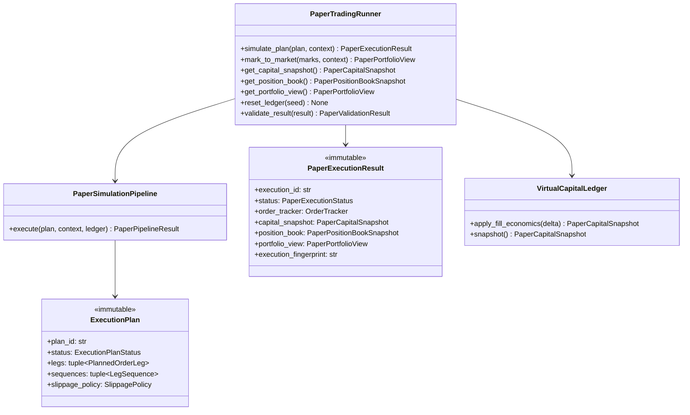

# Paper Trading Runner — Software Engineering Specification

| Field | Value |
|---|---|
| **Module** | `paper_trading/paper_trading_runner.py` |
| **Document version** | 1.0.0 |
| **Status** | Draft — ready for implementation |
| **Owner** | THETA AI TRADER Core Platform |
| **Last updated** | 2026-08-05 |

---

## 1. Purpose

`paper_trading/paper_trading_runner.py` defines the **institutional paper execution simulation layer** for THETA AI TRADER v1.0.

The module consumes an immutable `ExecutionPlan` produced by the Execution Engine (already risk-gated upstream) together with orchestrator-supplied reference marks, and performs **deterministic simulated fills, virtual capital accounting, paper position and portfolio bookkeeping, realized and unrealized P&L calculation, and auditable paper order event publication** — but **never** evaluates strategies, calculates indicators, calculates risk verdicts, or connects to a live broker.

The module answers: *"Given this READY execution plan and reference market prices, what are the deterministic paper fills, capital impacts, paper positions, paper portfolio state, and order lifecycle events — without sending any broker orders?"*

It is **not** a strategy engine. It is **not** a risk manager. It is **not** an indicator calculator. It is **not** a live Order Manager. It is the **paper execution simulation gate** between execution planning and the post-fill institutional pipeline (Position Manager → Portfolio Manager → APME), used exclusively under `EnvironmentProfile.PAPER`.

### Pipeline placement

```text
[Market Data Engine]
    → MarketSnapshot (immutable)
              ↓
[strategy/strategy_evaluation_engine.py]
    → StrategyEvaluationBundle
              ↓
[decision/trade_decision_engine.py]
    → TradeDecisionResult
              ↓
[risk/risk_engine.py]
    → RiskDecisionResult (APPROVED | REJECTED | SKIPPED)
              ↓
[execution/execution_engine.py]
    → ExecutionPlan (READY | SKIPPED | NO_PLAN | REJECTED)
              ↓
┌─────────────────────────────────────────────────────────────────────────┐
│ PAPER MODE BRANCH (orchestrator selects path by EnvironmentProfile)      │
│                                                                          │
│  LIVE / PRODUCTION path:                                                 │
│    [execution/order_manager.py] → BaseBrokerClient → live fills          │
│                                                                          │
│  PAPER path:                                                             │
│    [paper_trading/paper_trading_runner.py]   ← THIS MODULE               │
│      validate READY plan                                                 │
│      reject invalid prices / quantities / duplicate execution IDs        │
│      simulate market fills (slippage · brokerage · latency)              │
│      update virtual capital ledger                                       │
│      update paper position book                                          │
│      update paper portfolio view                                         │
│      compute realized + unrealized P&L                                   │
│      emit paper.order.* events                                           │
│      project OrderTracker-compatible fill artifacts                      │
└─────────────────────────────────────────────────────────────────────────┘
              ↓
    PaperExecutionResult (immutable)
    · order_tracker (OrderTracker — Position Manager compatible)
    · capital_snapshot (PaperCapitalSnapshot)
    · position_book (PaperPositionBook)
    · portfolio_view (PaperPortfolioView)
              ↓
[Orchestrator post-fill cycle]
    Position Manager.apply_order_tracker(tracker)
    Portfolio Manager.ingest_position_snapshot(...)
    APME.evaluate(...)
              ↓
[Event Bus: paper.order.* · paper.capital.* · paper.position.* · paper.portfolio.*]
```

### Architecture freeze note

The platform architecture is **FROZEN** for v1.0:

- **Paper Trading Runner** sits strictly **between** Execution Engine output and the post-fill pipeline as the **PAPER-mode substitute for Order Manager + live broker**.
- Upstream engines (Strategy Evaluation, Trade Decision, Risk, Execution) remain **unchanged** and are **never invoked** by this module.
- Downstream engines (Position Manager, Portfolio Manager, APME) remain **unchanged**; orchestrator feeds them `OrderTracker` projected from paper fills.
- Order Manager remains the **LIVE** submission owner; Paper Trading Runner **must not** call Order Manager or `BaseBrokerClient`.
- The runner **owns** virtual capital, paper position book, and paper portfolio view for simulation accounting and deterministic replay.
- Institutional Position Manager / Portfolio Manager remain the **authoritative post-fill artifacts for APME** when the orchestrator chains them after paper simulation.
- No new analytical engines are introduced. No broker SDK is imported.

### Goals

1. Provide a **dedicated paper execution simulation layer** for `EnvironmentProfile.PAPER` — separate from live Order Manager and broker transport.
2. Consume **immutable upstream artifacts** (`ExecutionPlan`) without re-running strategy, decision, risk, or execution planning.
3. **Simulate market fills** deterministically from plan legs and reference marks.
4. Maintain **virtual capital** with debit/credit semantics for premiums, brokerage, and P&L settlement.
5. Maintain a **paper position book** derived solely from simulated fills.
6. Maintain a **paper portfolio view** aggregating paper positions, capital, and P&L.
7. Calculate **realized P&L** on quantity-reducing fills and **unrealized P&L** from mark prices.
8. Generate **paper order lifecycle events** under the `paper.order.*` topic namespace.
9. Support **deterministic replay** — identical inputs and config yield identical fills, ledgers, fingerprints, and events.
10. Support **configurable slippage**, **brokerage**, and **latency** models via frozen configuration.
11. **Reject** invalid execution plans, invalid prices, invalid quantities, and duplicate execution IDs — fail closed.
12. Remain **thread-safe** for concurrent simulation runs on independent execution IDs.
13. Produce **OrderTracker-compatible** fill artifacts so Position Manager requires no paper-specific fork.
14. Provide **versioned JSON serialization** for all public paper artifacts (schema `1.0.0`).
15. Achieve **≥ 95% unit test coverage** on `paper_trading/paper_trading_runner.py`.
16. Use **immutable models**, Google-style docstrings, and stable error codes under `PAPER.*`.

### Success criteria

- Orchestrator invokes `PaperTradingRunner.simulate_plan(plan, context)` with `ExecutionPlan.status=READY` and receives immutable `PaperExecutionResult`.
- Non-READY plans (`SKIPPED`, `NO_PLAN`, `REJECTED`) are rejected at pre-simulate gate with `PAPER.PLAN.NOT_READY` — no ledger mutation.
- Expired plans (`reference_time >= plan.valid_until`) rejected with `PAPER.PLAN.EXPIRED` — no ledger mutation.
- Duplicate `execution_id` rejected with `PAPER.EXECUTION.DUPLICATE_ID` — no ledger mutation.
- Invalid prices / quantities rejected with stable `PAPER.PRICE.*` / `PAPER.QTY.*` codes — fail closed.
- Identical inputs (plan fingerprint, marks, config, reference time, RNG seed when applicable) produce identical `execution_fingerprint` and sealed artifacts.
- Zero imports of broker SDKs, Kite modules, strategy plugins, risk engine internals, indicator engines, or Order Manager submission paths.
- `PaperExecutionResult.order_tracker` is a valid `OrderTracker` consumable by `PositionManager.apply_order_tracker`.
- Virtual capital never goes negative when `reject_insufficient_capital=True` (default).
- Unit test coverage ≥ 95% line coverage on `paper_trading/paper_trading_runner.py`.

### Relationship to other modules

| Module | Relationship |
|---|---|
| `execution/execution_engine.py` | **Primary upstream input.** Consumes `ExecutionPlan`, `PlannedOrderLeg`, `LegSequence`, `SlippagePolicy`, `RetryPolicy`, `TimeoutPolicy`. |
| `execution/order_manager.py` | **Sibling (LIVE path).** Shares `OrderTracker` / `OrderState` types for downstream compatibility. Paper runner **never** calls Order Manager. |
| `portfolio/position_manager.py` | **Downstream consumer (via orchestrator).** Consumes projected `OrderTracker` from paper fills. |
| `portfolio/portfolio_manager.py` | **Downstream consumer (via orchestrator).** Aggregates institutional portfolio after Position Manager update. |
| `apme/adaptive_position_management_engine.py` | **Downstream consumer (via orchestrator).** Reads institutional portfolio/position snapshots — never called by paper runner. |
| `strategy/strategy_evaluation_engine.py` | **Upstream only (via orchestrator).** Paper runner never invokes. |
| `decision/trade_decision_engine.py` | **Upstream only (via orchestrator).** Paper runner never invokes. |
| `risk/risk_engine.py` | **Upstream only (via orchestrator).** Paper runner never invokes; may enforce virtual capital gates only. |
| `system/system_orchestrator.py` | **Primary consumer / invoker.** Selects PAPER vs LIVE path; calls `simulate_plan`; chains post-fill. |
| `system/integration_engine.py` | **Bootstrap.** Wires PAPER profile session; may inject runner into orchestrator. |
| `core/event_bus.py` | **Event publisher.** Publishes `paper.*` events. |
| `broker/base_broker.py` | **Forbidden.** Paper runner must never import or call broker clients. |
| `market_data/market_snapshot.py` | **Optional mark source.** Orchestrator may inject marks derived from snapshot; runner does not fetch market data. |

### Distinction from Order Manager

| Concern | Order Manager | Paper Trading Runner |
|---|---|---|
| Primary output | `OrderSubmissionResult` via live broker | `PaperExecutionResult` via simulated fills |
| Broker I/O | **Authoritative** via `BaseBrokerClient` | **Never** |
| Fill source | Broker responses / polls | Deterministic fill model |
| Capital | Broker funds APIs (external) | **Owns** virtual capital ledger |
| Position/portfolio books | Out of scope | **Owns** paper books for simulation |
| Events | `order.*` | `paper.order.*` (+ capital/position/portfolio) |
| Environment | LIVE / PRODUCTION | PAPER only (ANALYSIS/BACKTEST allowed for replay) |

### Distinction from Position Manager / Portfolio Manager

| Concern | Position / Portfolio Managers | Paper Trading Runner |
|---|---|---|
| Role | Institutional post-fill accounting | Paper simulation accounting + fill projection |
| Input | `OrderTracker` from Order Manager or paper projection | `ExecutionPlan` + marks |
| Authority for APME | **Authoritative** when orchestrator chains them | Paper books are simulation mirrors / capital source |
| Risk / strategy | Never | Never |
| Broker | Never | Never |

### Distinction from Risk Engine

| Concern | Risk Engine | Paper Trading Runner |
|---|---|---|
| Pre-trade verdict | **Authoritative** | Out of scope — consumes READY plans only |
| Capital enforcement | Portfolio / daily loss / margin heuristics | Virtual capital sufficiency for simulated premium + brokerage only |
| Rejects trades | Via `RiskVerdict` | Via paper validation / capital gate on simulation |

---

## 2. Responsibilities

`paper_trading/paper_trading_runner.py` **is responsible for**:

| # | Responsibility | Description |
|---|---|---|
| R1 | **ExecutionPlan consumption** | Accept immutable `ExecutionPlan` as primary simulation input. |
| R2 | **Plan status gating** | Reject simulation when plan status is not `READY`. |
| R3 | **Plan validity gating** | Reject when `reference_time >= plan.valid_until`. |
| R4 | **Correlation integrity** | Enforce `correlation_id` alignment across plan and context. |
| R5 | **Execution ID assignment** | Generate or accept deterministic `execution_id` per simulation run. |
| R6 | **Duplicate execution ID rejection** | Reject replay of the same `execution_id` while retained in the dedupe window. |
| R7 | **Price validation** | Reject missing, non-finite, non-positive, or policy-violating fill/mark prices. |
| R8 | **Quantity validation** | Reject non-positive, non-integer (where required), or policy-violating quantities. |
| R9 | **Fill simulation** | Produce deterministic fill prices and quantities per leg using slippage model. |
| R10 | **Slippage application** | Apply configurable absolute/bps slippage per side and order type. |
| R11 | **Brokerage application** | Apply configurable brokerage schedule to each fill and to capital. |
| R12 | **Latency simulation** | Apply configurable latency model to fill timestamps (deterministic clock). |
| R13 | **Sequence honor** | Respect `LegSequence` ordering and `abort_on_leg_failure` during simulation. |
| R14 | **Virtual capital maintenance** | Debit/credit cash for premiums, brokerage, and settlements. |
| R15 | **Insufficient capital gate** | Optionally reject fills that would breach virtual cash floor. |
| R16 | **Paper position book** | Open, increase, decrease, and close paper positions from fills. |
| R17 | **Paper portfolio view** | Aggregate positions, capital, exposures, and P&L into sealed snapshot. |
| R18 | **Realized P&L** | Compute realized P&L on quantity-reducing fills. |
| R19 | **Unrealized P&L** | Mark open paper positions to injected reference prices. |
| R20 | **OrderTracker projection** | Build `OrderTracker` / `OrderState` compatible with Position Manager. |
| R21 | **Paper order events** | Publish `paper.order.*` lifecycle events on the Event Bus. |
| R22 | **Capital / position / portfolio events** | Publish corresponding `paper.capital.*`, `paper.position.*`, `paper.portfolio.*` events. |
| R23 | **Deterministic replay** | Support sealed replay from serialized inputs with identical fingerprints. |
| R24 | **Execution fingerprint** | Compute deterministic fingerprint over plan + fills + capital delta. |
| R25 | **Multi-stage simulation pipeline** | Ordered stages with audit trail and short-circuit. |
| R26 | **Pre/post validation** | Validate context, plan, and sealed results. |
| R27 | **Error taxonomy** | Stable codes under `PAPER.*`. |
| R28 | **Serialization** | JSON round-trip for public types schema `1.0.0`. |
| R29 | **Logging conventions** | Standard log events for simulate start, fill, reject, capital, P&L. |
| R30 | **Thread-safe execution** | Safe concurrent `simulate_plan()` on independent execution IDs. |
| R31 | **Mode awareness** | PAPER primary; ANALYSIS/BACKTEST permitted for offline replay only. |
| R32 | **Documentation contract** | Google-style docstrings on all public types and methods. |
| R33 | **Idempotency key reuse** | Propagate `PlannedOrderLeg.idempotency_key` into paper order states. |
| R34 | **Partial fill policy** | Support full-fill default and optional deterministic partial-fill fractions. |
| R35 | **Mark-to-market refresh** | Recompute unrealized P&L and portfolio view from new marks without new plans. |
| R36 | **Ledger snapshot query** | Expose immutable capital, position, and portfolio snapshots via getters. |
| R37 | **Reset / seed API** | Support test harness reset and deterministic capital seeding. |
| R38 | **Warning emission** | Non-fatal warnings (near-expiry plan, zero-brokerage, capped slippage). |

---

## 3. Non-Responsibilities

`paper_trading/paper_trading_runner.py` **must not**:

| # | Non-responsibility | Rationale |
|---|---|---|
| NR1 | **Evaluate strategies or run strategy plugins** | Strategy Evaluation Engine responsibility. |
| NR2 | **Calculate indicators or market intelligence** | Indicator / Market Intelligence engines. |
| NR3 | **Calculate risk scores or emit RiskVerdict** | Risk Engine responsibility. |
| NR4 | **Build or modify `ExecutionPlan` / `PlannedOrderLeg`** | Execution Engine responsibility. |
| NR5 | **Connect to live broker or import broker SDK** | Live path is Order Manager + `BaseBrokerClient`. |
| NR6 | **Call `OrderManager.submit_plan`** | Sibling LIVE path — never mixed inside paper runner. |
| NR7 | **Invoke Position Manager, Portfolio Manager, or APME** | Orchestrator owns post-fill chaining. |
| NR8 | **Invoke Trade Decision Engine** | Upstream orchestrator responsibility. |
| NR9 | **Select strikes or resolve contracts** | Contract Selection / Execution Engine. |
| NR10 | **Fetch live market data or WebSocket ticks** | Marks are orchestrator-injected. |
| NR11 | **Load environment variables or config files** | Accept injected `PaperTradingRunnerConfig`. |
| NR12 | **Mutate `ExecutionPlan` or upstream artifacts** | All inputs read-only. |
| NR13 | **Persist ledger to disk/database (v1)** | Returns immutable snapshots; external persistence optional later. |
| NR14 | **Render UI or dashboards** | Consumers subscribe to events / read snapshots. |
| NR15 | **Authenticate users or brokers** | Out of scope. |
| NR16 | **Bypass fail-closed validation** | Invalid inputs must reject. |
| NR17 | **Silently swallow simulation failures** | All failures in result errors + events. |
| NR18 | **Use wall-clock time for fill timestamps in deterministic mode** | Use `reference_time` + configured latency offsets only. |
| NR19 | **Introduce new analytical engines** | Architecture locked. |
| NR20 | **Train ML models or sample stochastic noise without seed** | Deterministic only; any randomness requires explicit seed. |
| NR21 | **Replace institutional Position/Portfolio managers for APME** | Orchestrator still chains institutional engines when required. |
| NR22 | **Force fills when capital insufficient if gate enabled** | Fail closed. |
| NR23 | **Re-plan failed legs** | Orchestrator must request a new ExecutionPlan. |
| NR24 | **Import Kite / Zerodha modules** | Absolute forbid. |
| NR25 | **Publish on live `order.*` topics as if broker-sourced** | Use `paper.order.*` namespace only. |

---

## 4. Architecture

### 4.1 Layered design

```text
┌─────────────────────────────────────────────────────────────────────────────┐
│                 paper_trading/paper_trading_runner.py                        │
│  (paper execution simulation — no strategy, no risk, no broker, no APME)    │
│                                                                              │
│  ┌──────────────────┐  ┌──────────────────┐  ┌──────────────────────────┐  │
│  │ PaperTradingRunner│  │ PaperSimulation  │  │ PaperLedgerRegistry     │  │
│  │ (public service)  │→ │ Pipeline         │→ │ (capital·positions·     │  │
│  │                   │  │ (ordered stages) │  │  portfolio · dedupe)    │  │
│  └─────────┬─────────┘  └─────────┬────────┘  └────────────┬─────────────┘  │
│            │                      │                         │                │
│  ┌─────────▼──────────────────────▼─────────────────────────▼────────────┐  │
│  │ PlanGate · PriceGate · QtyGate · DuplicateIdGate · CapitalGate         │  │
│  │ FillSimulator · SlippageModel · BrokerageModel · LatencyModel          │  │
│  │ SequenceSimulator · PositionBookUpdater · PortfolioAggregator          │  │
│  │ PnLComputer · OrderTrackerProjector · EventPublisher · Fingerprinter   │  │
│  │ ResultSealer · PaperValidator                                          │  │
│  └───────────────────────────────────────────────────────────────────────┘  │
└───────────────────────────────────┬─────────────────────────────────────────┘
                                    │
         ExecutionPlan + PaperSimulationContext (+ marks)
                                    │
                                    ▼
              PaperExecutionResult (immutable) + OrderTracker projection
                                    │
                                    ▼
                         core/event_bus.py (paper.*)
```

### 4.2 Design principles

- **Single responsibility** — simulate paper fills and maintain paper ledger; nothing else.
- **Immutable I/O** — public inputs/outputs are frozen dataclasses.
- **Deterministic simulation** — identical inputs → identical fills, capital, P&L, fingerprints.
- **Fail closed** — prefer explicit rejection over ambiguous fills.
- **No broker I/O** — absolute; architecture locked.
- **Compatible projection** — `OrderTracker` shape shared with Order Manager types.
- **Event-first observability** — every material transition emits `paper.*` events.
- **Thread-safe service** — runner instance safe for concurrent independent execution IDs.
- **No hidden globals** — config, bus, and initial capital injected at construction.
- **Orchestrator delegation** — institutional PAPER cycles never bypass this module for simulated submission.

### 4.3 Component responsibilities

| Component | Role |
|---|---|
| `PaperTradingRunner` | Public service; orchestrates simulation runs and ledger queries. |
| `PaperTradingRunnerConfig` | Frozen policy: slippage, brokerage, latency, capital, partial fills, mode. |
| `PaperSimulationContext` | Immutable per-run inputs: marks, reference time, execution_id, tags. |
| `PaperSimulationPipeline` | Ordered multi-stage simulator with audit trail. |
| `PlanStatusGate` | Reject non-READY / expired plans. |
| `DuplicateExecutionIdGate` | Reject duplicate `execution_id`. |
| `PriceValidator` | Validate mark and derived fill prices. |
| `QuantityValidator` | Validate planned and fill quantities. |
| `FillSimulator` | Produce fill price/qty per leg. |
| `SlippageModel` | Apply bps/absolute slippage by side and order type. |
| `BrokerageModel` | Compute fees per fill. |
| `LatencyModel` | Offset fill timestamps deterministically. |
| `SequenceSimulator` | Honor leg sequences and abort policy. |
| `VirtualCapitalLedger` | Mutable internal cash book; emits immutable snapshots. |
| `PaperPositionBook` | Mutable internal positions; emits immutable snapshots. |
| `PaperPortfolioAggregator` | Builds immutable paper portfolio view. |
| `PnLComputer` | Realized and unrealized P&L. |
| `OrderTrackerProjector` | Maps paper fills → `OrderTracker` / `OrderState`. |
| `PaperEventPublisher` | Publishes `paper.*` events. |
| `ExecutionFingerprintComputer` | Deterministic fingerprint. |
| `PaperExecutionResult` | Immutable sealed simulation outcome. |
| `PaperValidator` | Validates inputs and sealed results. |

### 4.4 Dependency direction

```text
system/system_orchestrator.py          →  paper_trading/paper_trading_runner.py
paper_trading/paper_trading_runner.py  →  execution/execution_engine.py (ExecutionPlan types only)
paper_trading/paper_trading_runner.py  →  execution/order_manager.py (OrderTracker / OrderState types only)
paper_trading/paper_trading_runner.py  →  core/event_bus.py
paper_trading/paper_trading_runner.py  →  stdlib
```

**Forbidden imports:** `broker/*` (including mock broker clients used as live transport), Kite SDK, `risk/risk_engine.py`, `strategy/*` plugins, `decision/trade_decision_engine.py`, indicator engines, APME modules, Position Manager / Portfolio Manager mutation APIs, legacy root execution helpers.

**Allowed type-only imports:** `ExecutionPlan`, `PlannedOrderLeg`, `LegSequence`, `OrderTracker`, `OrderState`, `OrderLifecycleStatus`, `OrderAggregateStatus`, and related immutable enums/dataclasses required for projection.

### 4.5 Relationship diagram



---

## 5. Data Model

All public outward-facing types are **immutable dataclasses** (`frozen=True`) unless noted. Internal ledgers may use guarded mutable state behind the service lock; all external reads return frozen snapshots.

### 5.1 Type hierarchy

```text
PaperTradingRunner (mutable service)
├── config: PaperTradingRunnerConfig
├── event_bus: EventBus | None
├── _lock: threading.RLock
├── _capital: VirtualCapitalLedger (internal)
├── _positions: PaperPositionBookStore (internal)
├── _seen_execution_ids: OrderedDict[str, datetime] (dedupe window)
└── methods: simulate_plan(), mark_to_market(), getters, reset_ledger()

PaperSimulationContext (immutable)
├── correlation_id: str
├── reference_time: datetime
├── execution_id: str | None
├── marks: Mapping[str, Decimal]          # instrument_key → mark price
├── execution_mode: StrategyExecutionMode
├── tags: Mapping[str, str]
└── force_reject: bool = False

PaperExecutionResult (immutable)
├── execution_id: str
├── plan_id: str
├── correlation_id: str
├── status: PaperExecutionStatus
├── fills: tuple[PaperFill, ...]
├── order_tracker: OrderTracker
├── capital_snapshot: PaperCapitalSnapshot
├── position_book: PaperPositionBookSnapshot
├── portfolio_view: PaperPortfolioView
├── pipeline_summary: PaperPipelineResult
├── warnings: tuple[PaperWarningRecord, ...]
├── errors: tuple[PaperErrorRecord, ...]
├── simulated_at: datetime
├── duration_ms: float
├── execution_fingerprint: str
├── schema_version: str = "1.0.0"
└── metadata: Mapping[str, str]

PaperFill (immutable)
├── leg_index: int
├── instrument_key: str
├── side: OrderSide
├── quantity: int
├── raw_reference_price: Decimal
├── fill_price: Decimal
├── slippage_applied: Decimal
├── brokerage: Decimal
├── notional: Decimal
├── cash_delta: Decimal
├── filled_at: datetime
├── idempotency_key: str
├── paper_order_id: str
└── metadata: Mapping[str, str]

PaperCapitalSnapshot (immutable)
├── cash: Decimal
├── reserved_margin_hint: Decimal
├── starting_cash: Decimal
├── cumulative_brokerage: Decimal
├── cumulative_realized_pnl: Decimal
├── as_of: datetime
└── capital_fingerprint: str

PaperPosition (immutable)
├── position_id: str
├── instrument_key: str
├── quantity: int                         # signed: +long / −short
├── average_price: Decimal
├── realized_pnl: Decimal
├── unrealized_pnl: Decimal
├── mark_price: Decimal | None
├── opened_at: datetime
├── updated_at: datetime
├── strategy_id: str | None
├── plan_id: str | None
└── metadata: Mapping[str, str]

PaperPositionBookSnapshot (immutable)
├── positions: tuple[PaperPosition, ...]
├── as_of: datetime
└── book_fingerprint: str

PaperPortfolioView (immutable)
├── capital: PaperCapitalSnapshot
├── positions: PaperPositionBookSnapshot
├── total_realized_pnl: Decimal
├── total_unrealized_pnl: Decimal
├── total_pnl: Decimal
├── open_position_count: int
├── gross_notional: Decimal
├── as_of: datetime
└── portfolio_fingerprint: str
```

### 5.2 Module constants

| Constant | Value | Description |
|---|---|---|
| `PAPER_TRADING_RUNNER_VERSION` | `"1.0.0"` | Module semantic version. |
| `PAPER_SCHEMA_VERSION` | `"1.0.0"` | JSON schema version for paper types. |
| `PRODUCER_NAME` | `"paper_trading_runner"` | Event bus producer identifier. |
| `DEFAULT_INITIAL_CASH` | `Decimal("1000000.00")` | Default virtual capital seed (INR units unless tagged). |
| `DEFAULT_SLIPPAGE_BPS` | `Decimal("5")` | Default adverse slippage in basis points. |
| `DEFAULT_BROKERAGE_PER_ORDER` | `Decimal("20.00")` | Flat brokerage per filled leg (configurable). |
| `DEFAULT_LATENCY_MS` | `0` | Default simulated latency offset per leg. |
| `DEFAULT_DEDUPE_RETENTION` | `10_000` | Max retained execution IDs. |
| `MONEY_QUANTUM` | `Decimal("0.01")` | Monetary rounding quantum. |
| `PRICE_QUANTUM` | `Decimal("0.05")` | Default price tick rounding (configurable). |

### 5.3 Enums

#### 5.3.1 `PaperExecutionStatus`

| Member | Description |
|---|---|
| `COMPLETED` | All legs simulated to terminal COMPLETE (or configured success). |
| `PARTIAL` | Mixed terminal outcomes under partial-fill or abort policy. |
| `REJECTED` | Pre-simulate gate rejected — no fills applied. |
| `FAILED` | Simulation started but aborted with terminal failure. |
| `INSUFFICIENT_CAPITAL` | Capital gate rejected one or more fills. |
| `EXPIRED` | Plan expired before simulation. |

#### 5.3.2 `PaperFillModel`

| Member | Description |
|---|---|
| `FULL_AT_MARK` | Fill entire quantity at mark ± slippage. |
| `FULL_AT_LIMIT_OR_MARK` | Prefer limit hint when marketable; else mark ± slippage. |
| `DETERMINISTIC_PARTIAL` | Fill `partial_fill_fraction` of quantity (config). |

#### 5.3.3 `PaperSlippageMode`

| Member | Description |
|---|---|
| `BPS_ADVERSE` | Apply bps adverse to the trading side. |
| `ABSOLUTE` | Apply fixed absolute price offset. |
| `MAX_OF_PLAN_AND_CONFIG` | Use max(plan leg max_slippage_bps, config). |
| `NONE` | No slippage (tests / ideal replay). |

#### 5.3.4 `PaperBrokerageMode`

| Member | Description |
|---|---|
| `FLAT_PER_LEG` | Flat fee per filled leg. |
| `BPS_OF_NOTIONAL` | Fee = bps × \|notional\|. |
| `FLAT_PLUS_BPS` | Sum of flat and bps components. |
| `NONE` | Zero brokerage. |

#### 5.3.5 `PaperLatencyMode`

| Member | Description |
|---|---|
| `FIXED_MS` | Add fixed milliseconds per leg index. |
| `PER_LEG_INCREMENT_MS` | `base + leg_index * step`. |
| `SEQUENCE_DELAY` | Honor `LegSequence.inter_leg_delay_ms` only. |
| `NONE` | All fills at `reference_time`. |

#### 5.3.6 `PaperEventType`

| Member | Topic suffix | Description |
|---|---|---|
| `PLAN_SIMULATION_STARTED` | `paper.order.plan.started` | Simulation begun. |
| `LEG_FILLED` | `paper.order.leg.filled` | Leg fully filled. |
| `LEG_PARTIALLY_FILLED` | `paper.order.leg.partial_fill` | Partial fill. |
| `LEG_REJECTED` | `paper.order.leg.rejected` | Leg rejected. |
| `PLAN_COMPLETED` | `paper.order.plan.completed` | Plan simulation completed. |
| `PLAN_REJECTED` | `paper.order.plan.rejected` | Plan rejected pre-fill. |
| `CAPITAL_UPDATED` | `paper.capital.updated` | Capital snapshot changed. |
| `POSITION_UPDATED` | `paper.position.updated` | Position book changed. |
| `PORTFOLIO_UPDATED` | `paper.portfolio.updated` | Portfolio view refreshed. |
| `MARK_TO_MARKET` | `paper.portfolio.marked` | Mark-to-market refresh. |

### 5.4 Dataclass field tables

#### 5.4.1 `PaperTradingRunnerConfig`

| Field | Type | Default | Constraints |
|---|---|---|---|
| `initial_cash` | `Decimal` | `DEFAULT_INITIAL_CASH` | `>= 0`, finite |
| `reject_insufficient_capital` | `bool` | `True` | — |
| `minimum_cash_floor` | `Decimal` | `Decimal("0")` | finite |
| `fill_model` | `PaperFillModel` | `FULL_AT_LIMIT_OR_MARK` | enum |
| `partial_fill_fraction` | `Decimal` | `Decimal("1")` | `(0, 1]` |
| `slippage_mode` | `PaperSlippageMode` | `BPS_ADVERSE` | enum |
| `slippage_bps` | `Decimal` | `DEFAULT_SLIPPAGE_BPS` | `>= 0` |
| `slippage_absolute` | `Decimal` | `Decimal("0")` | `>= 0` |
| `brokerage_mode` | `PaperBrokerageMode` | `FLAT_PER_LEG` | enum |
| `brokerage_flat` | `Decimal` | `DEFAULT_BROKERAGE_PER_ORDER` | `>= 0` |
| `brokerage_bps` | `Decimal` | `Decimal("0")` | `>= 0` |
| `latency_mode` | `PaperLatencyMode` | `SEQUENCE_DELAY` | enum |
| `latency_base_ms` | `int` | `DEFAULT_LATENCY_MS` | `>= 0` |
| `latency_step_ms` | `int` | `0` | `>= 0` |
| `price_quantum` | `Decimal` | `PRICE_QUANTUM` | `> 0` |
| `contract_multiplier` | `Decimal` | `Decimal("1")` | `> 0` |
| `honor_plan_slippage_policy` | `bool` | `True` | — |
| `allow_market_orders` | `bool` | `True` | PAPER default |
| `dedupe_retention` | `int` | `DEFAULT_DEDUPE_RETENTION` | `>= 1` |
| `publish_events` | `bool` | `True` | — |
| `strict_mark_presence` | `bool` | `True` | require mark per instrument |
| `execution_mode_default` | `StrategyExecutionMode` | `LIVE` semantics label for PAPER profile | mode enum |
| `schema_version` | `str` | `"1.0.0"` | must equal `PAPER_SCHEMA_VERSION` |

**Construction invariants (`CFG-PAPER-*`):**

| Code | Rule |
|---|---|
| `CFG-PAPER-001` | `initial_cash` finite and `>= 0`. |
| `CFG-PAPER-002` | `slippage_bps`, `slippage_absolute`, brokerage fields finite and `>= 0`. |
| `CFG-PAPER-003` | `partial_fill_fraction` in `(0, 1]`. |
| `CFG-PAPER-004` | Latency fields `>= 0`. |
| `CFG-PAPER-005` | `price_quantum > 0`, `contract_multiplier > 0`. |
| `CFG-PAPER-006` | `dedupe_retention >= 1`. |
| `CFG-PAPER-007` | `schema_version == "1.0.0"`. |
| `CFG-PAPER-008` | If `fill_model == DETERMINISTIC_PARTIAL` then fraction `< 1` allowed; if `FULL_*` then fraction must be `1`. |

#### 5.4.2 `PaperSimulationContext`

| Field | Type | Required | Notes |
|---|---|---|---|
| `correlation_id` | `str` | Yes | Non-empty; must match `plan.correlation_id`. |
| `reference_time` | `datetime` | Yes | Timezone-aware UTC. |
| `marks` | `Mapping[str, Decimal]` | Yes | instrument_key → finite price `> 0`. |
| `execution_id` | `str \| None` | No | If None, generated deterministically. |
| `execution_mode` | `StrategyExecutionMode` | No | Defaults from config. |
| `tags` | `Mapping[str, str]` | No | Audit tags (`runner_kind=paper`, etc.). |
| `force_reject` | `bool` | No | Test harness short-circuit. |

#### 5.4.3 `PaperFill` economics

Cash delta convention (options credit/debit):

| Side | Position effect | Cash impact (before brokerage) |
|---|---|---|
| `BUY` | Increase long / decrease short | `− fill_price × qty × multiplier` |
| `SELL` | Increase short / decrease long | `+ fill_price × qty × multiplier` |

Brokerage always reduces cash: `cash_delta_final = cash_delta_premium − brokerage`.

### 5.5 Global invariants

| ID | Invariant |
|---|---|
| INV-001 | Public dataclasses are `frozen=True`. |
| INV-002 | All money/price fields are `Decimal` (not float) in paper types. |
| INV-003 | `execution_fingerprint` stable for identical sealed inputs. |
| INV-004 | Reject path never mutates capital or positions. |
| INV-005 | Duplicate `execution_id` never applies fills twice. |
| INV-006 | `OrderTracker.plan_id == ExecutionPlan.plan_id`. |
| INV-007 | Sum of position realized P&L matches capital cumulative realized (within quantum). |
| INV-008 | `filled_at` is timezone-aware and `>= reference_time`. |
| INV-009 | No broker module appears in import graph. |

---

## 6. Simulation Lifecycle State Machine

### 6.1 Per-leg paper order states

Projected onto `OrderLifecycleStatus` for Position Manager compatibility:

```text
PLANNED
  → SUBMITTED          (simulation accepted leg)
  → OPEN               (latency window started — optional)
  → PARTIALLY_FILLED   (deterministic partial model)
  → COMPLETE           (full fill)
  → REJECTED           (price/qty/capital/sequence abort)
```

Terminal: `COMPLETE`, `REJECTED`, `CANCELLED` (only if orchestrator cancel API used — v1 optional), `FAILED`.

### 6.2 Aggregate status derivation

Map to `OrderAggregateStatus` and `PaperExecutionStatus`:

| Condition | `OrderAggregateStatus` | `PaperExecutionStatus` |
|---|---|---|
| All legs COMPLETE | `ALL_COMPLETE` | `COMPLETED` |
| Any PARTIALLY_FILLED, rest terminal | `PARTIALLY_FILLED` | `PARTIAL` |
| Mixed COMPLETE + REJECTED | `MIXED_TERMINAL` | `PARTIAL` |
| All REJECTED/FAILED | `ALL_FAILED` | `FAILED` |
| Pre-gate reject | (empty tracker) | `REJECTED` / `EXPIRED` / `INSUFFICIENT_CAPITAL` |

### 6.3 Transition rules

| Rule | Description |
|---|---|
| TR-001 | No transition after terminal. |
| TR-002 | Quantity monotonic: `0 ≤ filled ≤ planned`. |
| TR-003 | `average_fill_price` set on first fill; VWAP on subsequent partials. |
| TR-004 | Sequence abort marks remaining unsubmitted legs `REJECTED` with `PAPER.SEQUENCE.ABORTED`. |

---

## 7. Upstream Integration

### 7.1 ExecutionPlan consumption

**Accepted:** `ExecutionPlan.status == READY` with non-empty `legs` (unless policy allows empty → `REJECTED`).

**Rejected immediately (no mutation):**

| Code | Condition |
|---|---|
| `PAPER.PLAN.NOT_READY` | status ≠ `READY` |
| `PAPER.PLAN.EXPIRED` | `valid_until` set and `reference_time >= valid_until` |
| `PAPER.PLAN.EMPTY_LEGS` | no legs on READY plan |
| `PAPER.CORR.MISMATCH` | `context.correlation_id != plan.correlation_id` |
| `PAPER.EXECUTION.DUPLICATE_ID` | `execution_id` already applied |
| `PAPER.CONTEXT.FORCE_REJECT` | `force_reject=True` |

### 7.2 PlannedOrderLeg fields used

| Field | Usage |
|---|---|
| `leg_index` | Ordering / events / tracker |
| `instrument_key` | Mark lookup / position key |
| `side` | Slippage direction / cash delta |
| `order_type` | Limit vs market fill rules |
| `quantity` | Fill quantity basis |
| `limit_price_hint` | Preferred fill anchor when marketable |
| `max_slippage_bps` | Optional override vs config |
| `idempotency_key` | Propagated to paper order id / tracker |
| `sequence_group` | Sequence simulation |

### 7.3 SlippagePolicy honor

When `honor_plan_slippage_policy=True`:

1. Read `plan.slippage_policy` and per-leg `max_slippage_bps`.
2. Effective bps = `max(config.slippage_bps, leg.max_slippage_bps or 0)` under `MAX_OF_PLAN_AND_CONFIG`, else config mode.
3. Never exceed plan hard ceiling if policy defines one; if fill would breach ceiling → reject leg `PAPER.SLIPPAGE.EXCEEDED`.

### 7.4 Market marks

Orchestrator supplies `context.marks`. Recommended source: mid/last from `MarketSnapshot` option chain rows matching `instrument_key`.

**Rule MARK-001:** Runner never calls Market Data Engine.

**Rule MARK-002:** If `strict_mark_presence=True` and mark missing → `PAPER.PRICE.MARK_MISSING`.

---

## 8. Downstream Integration

### 8.1 OrderTracker projection (Position Manager)

For each simulated leg, emit `OrderState`:

| OrderState field | Paper source |
|---|---|
| `leg_index` | leg index |
| `lifecycle_status` | COMPLETE / PARTIALLY_FILLED / REJECTED |
| `broker_order_id` | `paper_order_id` (`paper-{hash}`) |
| `filled_quantity` | fill qty |
| `remaining_quantity` | planned − filled |
| `average_fill_price` | `float(fill_price)` (OrderState uses float today) |
| `attempt_count` | `1` |
| `terminal` | True when terminal |
| `transitions` | PLANNED→SUBMITTED→COMPLETE (etc.) |

`OrderTracker` fields:

| Field | Value |
|---|---|
| `submission_id` | `execution_id` |
| `plan_id` | `plan.plan_id` |
| `correlation_id` | `plan.correlation_id` |
| `leg_states` | projected states |
| `aggregate_status` | derived |
| `tracker_fingerprint` | deterministic hash |

**Rule PROJ-001:** Projection must satisfy Order Manager invariants so `PositionManager.apply_order_tracker` accepts without forks.

**Rule PROJ-002:** Do not publish these as live `order.*` events; paper events use `paper.order.*`. Orchestrator may optionally mirror if a compatibility subscriber exists — out of scope for v1 runner.

### 8.2 Portfolio Manager / APME

Orchestrator sequence after successful paper simulation:

1. `PositionManager.apply_order_tracker(result.order_tracker, context)`
2. `PortfolioManager.ingest_position_snapshot(...)`
3. `APME.evaluate(...)`

Paper runner does not call these APIs.

### 8.3 Virtual capital vs institutional portfolio cash

| Ledger | Owner | Purpose |
|---|---|---|
| `PaperCapitalSnapshot` | Paper runner | Simulation cash, brokerage, paper P&L |
| Institutional `PortfolioSnapshot` | Portfolio Manager | APME / risk mapping after fills |

Orchestrator may inject paper capital hints into portfolio ingest context for PAPER profile dashboards — mapping documented in System Orchestrator; not performed inside this module beyond emitting `paper.capital.updated`.

---

## 9. Simulation Pipeline

### 9.1 Pipeline overview

Ordered stages (short-circuit on failure):

1. `VALIDATE_CONTEXT`
2. `GATE_PLAN_STATUS`
3. `GATE_PLAN_EXPIRY`
4. `GATE_DUPLICATE_EXECUTION_ID`
5. `VALIDATE_LEGS`
6. `VALIDATE_MARKS_AND_PRICES`
7. `VALIDATE_QUANTITIES`
8. `SIMULATE_SEQUENCE_AND_FILLS`
9. `APPLY_BROKERAGE`
10. `APPLY_CAPITAL_DELTAS`
11. `UPDATE_POSITION_BOOK`
12. `COMPUTE_PNL`
13. `AGGREGATE_PORTFOLIO`
14. `PROJECT_ORDER_TRACKER`
15. `PUBLISH_EVENTS`
16. `SEAL_RESULT`

### 9.2 Stage specifications

#### Stage 1 — `VALIDATE_CONTEXT`

- Require non-empty `correlation_id`, timezone-aware `reference_time`.
- Validate marks mapping types.
- Fail: `PAPER.CONTEXT.INVALID`.

#### Stage 2 — `GATE_PLAN_STATUS`

- Require `READY`.
- Fail: `PAPER.PLAN.NOT_READY`.

#### Stage 3 — `GATE_PLAN_EXPIRY`

- Enforce `valid_until`.
- Fail: `PAPER.PLAN.EXPIRED`.

#### Stage 4 — `GATE_DUPLICATE_EXECUTION_ID`

- Resolve `execution_id` (see §17).
- If seen → `PAPER.EXECUTION.DUPLICATE_ID`.

#### Stage 5 — `VALIDATE_LEGS`

- Each leg: non-empty `instrument_key`, valid side/order_type, `quantity > 0`.
- Fail: `PAPER.LEG.INVALID`.

#### Stage 6 — `VALIDATE_MARKS_AND_PRICES`

- Mark present (if strict), finite, `> 0`.
- Limit hint if present: finite, `> 0`.
- Fail: `PAPER.PRICE.MARK_MISSING`, `PAPER.PRICE.NON_FINITE`, `PAPER.PRICE.NON_POSITIVE`, `PAPER.PRICE.INVALID_LIMIT`.

#### Stage 7 — `VALIDATE_QUANTITIES`

- `quantity` positive int; fill qty same constraints.
- Fail: `PAPER.QTY.NON_POSITIVE`, `PAPER.QTY.INVALID`.

#### Stage 8 — `SIMULATE_SEQUENCE_AND_FILLS`

- Iterate sequences / legs.
- Compute fill price (§10), fill qty (§11), timestamp (§12).
- On failure with `abort_on_leg_failure`: reject remaining → `PAPER.SEQUENCE.ABORTED`.

#### Stage 9 — `APPLY_BROKERAGE`

- Compute fee per fill (§13).

#### Stage 10 — `APPLY_CAPITAL_DELTAS`

- Apply cash deltas; if breach floor and gate enabled → rollback this run's mutations and `PAPER.CAPITAL.INSUFFICIENT`.

**Atomicity rule CAP-001:** A single `simulate_plan` call is atomic w.r.t. ledger mutation — either all accepted fills for the run commit, or none (except when partial success policy explicitly enabled; v1 default = all-or-nothing per plan when capital fails mid-run).

#### Stage 11 — `UPDATE_POSITION_BOOK`

- Apply signed quantity updates; update average price; close at zero qty.

#### Stage 12 — `COMPUTE_PNL`

- Realized on reduces; unrealized from marks.

#### Stage 13 — `AGGREGATE_PORTFOLIO`

- Build `PaperPortfolioView`.

#### Stage 14 — `PROJECT_ORDER_TRACKER`

- Build compatible tracker.

#### Stage 15 — `PUBLISH_EVENTS`

- Emit lifecycle events if bus present and `publish_events`.

#### Stage 16 — `SEAL_RESULT`

- Fingerprint; validate; return.

### 9.3 Short-circuit behavior

- Stages 1–7 failures → `PaperExecutionStatus.REJECTED` (or `EXPIRED`), empty fills, unchanged ledger.
- Stage 10 capital failure → `INSUFFICIENT_CAPITAL`, unchanged ledger (rollback).
- Stage 8 sequence abort with partial commits only if `config` enables `commit_partial_on_abort` (default **False** for determinism and safety).

---

## 10. Fill Price & Slippage Model

### 10.1 Reference price selection

```text
if order_type == LIMIT and limit_price_hint is not None:
    if side == BUY and mark <= limit_price_hint: reference = mark
    elif side == SELL and mark >= limit_price_hint: reference = mark
    elif fill_model == FULL_AT_LIMIT_OR_MARK and not marketable:
        # v1 default: still fill at limit (optimistic paper) OR reject — controlled by
        # config.tag unmarketable_limit_policy: FILL_AT_LIMIT (default) | REJECT
        reference = limit_price_hint  # default
    else:
        reference = mark
else:
    reference = mark
```

### 10.2 Adverse slippage

Let `s_bps` = effective slippage bps, `s_abs` = absolute slippage.

```text
BUY  fill = reference * (1 + s_bps/10000) + s_abs
SELL fill = reference * (1 - s_bps/10000) - s_abs
fill = round_to_quantum(fill, price_quantum)
```

**Rule SLIP-001:** Fill price must remain `> 0` after slippage; else `PAPER.PRICE.INVALID_FILL`.

**Rule SLIP-002:** `PaperSlippageMode.NONE` ⇒ fill = rounded reference.

### 10.3 Plan ceiling

If effective adverse slippage exceeds plan/leg max → `PAPER.SLIPPAGE.EXCEEDED`.

---

## 11. Quantity & Partial Fills

### 11.1 Default

`fill_qty = planned_quantity` when `partial_fill_fraction == 1`.

### 11.2 Deterministic partial

```text
fill_qty = max(1, floor(planned_quantity * partial_fill_fraction))
fill_qty = min(fill_qty, planned_quantity)
```

Remaining quantity stays unfilled; leg status `PARTIALLY_FILLED` if `fill_qty < planned`.

### 11.3 Invalid quantities

Reject when `planned_quantity <= 0` or non-int: `PAPER.QTY.NON_POSITIVE` / `PAPER.QTY.INVALID`.

---

## 12. Latency Model

All timestamps derived from `context.reference_time` — never `datetime.now()` when building sealed fills (wall clock may be recorded only in log extras, not fingerprints).

| Mode | `filled_at` |
|---|---|
| `NONE` | `reference_time` |
| `FIXED_MS` | `reference_time + latency_base_ms` |
| `PER_LEG_INCREMENT_MS` | `reference_time + base + leg_index * step` |
| `SEQUENCE_DELAY` | cumulative sum of `inter_leg_delay_ms` along sequence order |

**Rule LAT-001:** Latency never changes fill price in v1 — time metadata only.

---

## 13. Brokerage Model

| Mode | Fee |
|---|---|
| `NONE` | `0` |
| `FLAT_PER_LEG` | `brokerage_flat` |
| `BPS_OF_NOTIONAL` | `notional * brokerage_bps / 10000` |
| `FLAT_PLUS_BPS` | sum of flat and bps |

`notional = fill_price * fill_qty * contract_multiplier` (absolute value for fee base).

Round fees to `MONEY_QUANTUM` using `ROUND_HALF_UP`.

---

## 14. Virtual Capital

### 14.1 Ledger operations

| Operation | Effect |
|---|---|
| Seed / reset | `cash = initial_cash` |
| Apply fill | `cash += cash_delta_final` |
| Realized PnL settle | Already embedded in cash via premium deltas; realized tracked separately for reporting |
| Brokerage | Included in `cash_delta_final` |

### 14.2 Insufficient capital

Before commit:

```text
projected_cash = cash + sum(cash_delta_final for fills in run)
if reject_insufficient_capital and projected_cash < minimum_cash_floor:
    reject PAPER.CAPITAL.INSUFFICIENT
```

### 14.3 Snapshot fields

See `PaperCapitalSnapshot` — always returned on success and on mark-to-market.

---

## 15. Paper Positions & Portfolio

### 15.1 Position keying

Default key: `instrument_key` (+ optional `strategy_id` from `plan.summary.strategy_id` when `config.tag net_by_strategy=true`; v1 default nets by instrument only).

### 15.2 Average price

On increasing absolute exposure:

```text
new_avg = (abs(old_qty)*old_avg + fill_qty*fill_price) / (abs(old_qty)+fill_qty)
```

On reducing exposure: average unchanged; realized PnL accrued.

### 15.3 Realized P&L

For quantity reduction:

```text
# long reduce (SELL)
realized += (fill_price - average_price) * reduce_qty * multiplier
# short reduce (BUY)
realized += (average_price - fill_price) * reduce_qty * multiplier
```

### 15.4 Unrealized P&L

```text
# long
unrealized = (mark - average_price) * qty * multiplier
# short (qty negative)
unrealized = (average_price - mark) * abs(qty) * multiplier
```

### 15.5 Portfolio view

```text
total_realized_pnl = sum(position.realized_pnl)  # or capital cumulative
total_unrealized_pnl = sum(position.unrealized_pnl)
total_pnl = total_realized_pnl + total_unrealized_pnl
gross_notional = sum(abs(qty)*mark*multiplier)
```

### 15.6 `mark_to_market`

Public API refreshes unrealized P&L and portfolio view without new fills. Rejects invalid marks. Emits `paper.portfolio.marked`.

---

## 16. Validation

### 16.1 Pre-simulate validation

Reject on:

- Invalid context / correlation mismatch
- Non-READY / expired plan
- Duplicate execution ID
- Missing/invalid marks or prices
- Invalid quantities
- Invalid legs / empty READY plan

### 16.2 Runtime validation

Reject on:

- Slippage ceiling breach
- Non-positive fill price after model
- Insufficient capital
- Sequence abort (as failure or partial per config)

### 16.3 Post-simulate / output validation

`validate_result(result)` checks:

- Fingerprint recompute match
- Tracker invariants
- Capital / position / portfolio internal consistency
- Schema version
- Status/error coherence (REJECTED ⇒ no committed fills)

---

## 17. Deterministic Behavior & Replay

### 17.1 Determinism scope

Identical tuple:

```text
(plan_fingerprint, marks, config_hash, reference_time, execution_id, prior_ledger_fingerprint)
```

⇒ identical:

```text
(fills, capital_snapshot, position_book, portfolio_view, order_tracker, execution_fingerprint, event payloads)
```

### 17.2 Execution ID generation

If `context.execution_id` is None:

```text
execution_id = "paper-exec-" + sha256(plan.plan_id + "|" + plan.plan_fingerprint + "|" + correlation_id)[:24]
```

If provided, must be non-empty and match charset `[A-Za-z0-9._:-]+`.

### 17.3 Execution fingerprint

```text
payload = canonical_json({
  "plan_fingerprint": ...,
  "execution_id": ...,
  "fills": [...],
  "capital_fingerprint": ...,
  "book_fingerprint": ...,
  "portfolio_fingerprint": ...,
  "tracker_fingerprint": ...,
  "config_hash": ...,
  "schema_version": "1.0.0",
})
execution_fingerprint = sha256(payload).hexdigest()
```

### 17.4 Duplicate ID semantics

- Successful or failed **committed** attempts record `execution_id`.
- Pure pre-gate rejects that occur **before** ID reservation may optionally not consume ID; v1 **reserves ID only after Stage 4 pass** and records on seal (success or mid-pipeline failure after reservation).
- Duplicate after reservation → `PAPER.EXECUTION.DUPLICATE_ID`.

### 17.5 Replay testing

Test harness must:

1. Freeze config + marks + plan + reference_time.
2. Run `simulate_plan` twice on fresh runners with same seed capital.
3. Assert deep equality of fingerprints and serialized JSON.

---

## 18. Thread Safety

### 18.1 Concurrency model

- One `PaperTradingRunner` instance may serve concurrent `simulate_plan` calls.
- All ledger mutations and dedupe set updates occur under `threading.RLock`.
- Concurrent runs with **different** `execution_id`s serialize through the lock (v1 simple model) to preserve capital integrity.
- Getters return immutable snapshots copied under the lock.

### 18.2 Locking strategy

| Resource | Protection |
|---|---|
| Capital ledger | `_lock` |
| Position book | `_lock` |
| Dedupe window | `_lock` |
| Event publish | After snapshot seal; bus assumed thread-safe per Event Bus spec |

### 18.3 Deadlock avoidance

- Never call orchestrator/engines while holding `_lock`.
- Publish events **after** releasing lock (recommended) or using bus reentrancy-safe publish; v1 publishes after seal still under lock only if bus guarantees non-reentrant runner callbacks — prefer release-then-publish.

---

## 19. Serialization

### 19.1 Schema version

`PAPER_SCHEMA_VERSION = "1.0.0"`.

Supported types: `PaperExecutionResult`, `PaperFill`, `PaperCapitalSnapshot`, `PaperPosition`, `PaperPositionBookSnapshot`, `PaperPortfolioView`, `PaperTradingRunnerConfig`, `PaperSimulationContext`, `PaperWarningRecord`, `PaperErrorRecord`, `PaperPipelineResult`.

`OrderTracker` serialization reuses Order Manager schema `1.0.0`.

### 19.2 JSON round-trip

```python
def to_jsonable(obj: object) -> Mapping[str, object]: ...
def paper_execution_result_from_dict(data: Mapping[str, object]) -> PaperExecutionResult: ...
```

Rules:

- `Decimal` → string
- `datetime` → ISO-8601 with offset
- `Enum` → value string
- mappings → objects; tuples → arrays
- unknown schema version → `PaperTradingSerializationError`

### 19.3 Example serialized fill (abridged)

```json
{
  "schema_version": "1.0.0",
  "execution_id": "paper-exec-ab12cd34ef56",
  "plan_id": "plan-99aa",
  "status": "COMPLETED",
  "fills": [
    {
      "leg_index": 0,
      "instrument_key": "NIFTY24AUG24400PE",
      "side": "SELL",
      "quantity": 50,
      "raw_reference_price": "120.00",
      "fill_price": "119.40",
      "slippage_applied": "0.60",
      "brokerage": "20.00",
      "notional": "5970.00",
      "cash_delta": "5950.00",
      "filled_at": "2026-08-05T10:15:00+00:00",
      "idempotency_key": "exec-...",
      "paper_order_id": "paper-ord-..."
    }
  ],
  "execution_fingerprint": "..."
}
```

---

## 20. Error Taxonomy

### 20.1 Exceptions

| Exception | When |
|---|---|
| `PaperTradingError` | Base |
| `PaperTradingConfigurationError` | Invalid config at construction |
| `PaperTradingValidationError` | Input/output validation failure (may also be soft-coded in result) |
| `PaperTradingSimulationError` | Unexpected simulation failure |
| `PaperTradingSerializationError` | Schema/serde failure |
| `PaperTradingConcurrencyError` | Lock / invariant concurrency failure (rare) |

**Policy:** Gate failures normally return `PaperExecutionResult` with `REJECTED`/`FAILED` and error records — exceptions reserved for programmer/config/invariant violations.

### 20.2 Error codes

| Code | Severity | Meaning |
|---|---|---|
| `PAPER.PLAN.NOT_READY` | reject | Plan status not READY |
| `PAPER.PLAN.EXPIRED` | reject | Plan validity window elapsed |
| `PAPER.PLAN.EMPTY_LEGS` | reject | READY plan has no legs |
| `PAPER.CORR.MISMATCH` | reject | Correlation ID mismatch |
| `PAPER.CONTEXT.INVALID` | reject | Bad context |
| `PAPER.CONTEXT.FORCE_REJECT` | reject | Test force reject |
| `PAPER.EXECUTION.DUPLICATE_ID` | reject | Duplicate execution_id |
| `PAPER.EXECUTION.INVALID_ID` | reject | Bad execution_id format |
| `PAPER.LEG.INVALID` | reject | Leg failed structural validation |
| `PAPER.PRICE.MARK_MISSING` | reject | Required mark absent |
| `PAPER.PRICE.NON_FINITE` | reject | NaN/Inf price |
| `PAPER.PRICE.NON_POSITIVE` | reject | Price ≤ 0 |
| `PAPER.PRICE.INVALID_LIMIT` | reject | Bad limit hint |
| `PAPER.PRICE.INVALID_FILL` | reject | Fill ≤ 0 after model |
| `PAPER.QTY.NON_POSITIVE` | reject | Quantity ≤ 0 |
| `PAPER.QTY.INVALID` | reject | Non-integer / overflow |
| `PAPER.SLIPPAGE.EXCEEDED` | reject | Breach plan/config ceiling |
| `PAPER.CAPITAL.INSUFFICIENT` | reject | Virtual cash floor breach |
| `PAPER.SEQUENCE.ABORTED` | fail | Abort on leg failure |
| `PAPER.RESULT.INVALID` | error | Sealed result failed validation |
| `PAPER.SERIALIZATION.UNSUPPORTED_VERSION` | error | Bad schema version |
| `CFG-PAPER-001`…`CFG-PAPER-008` | config | Configuration invariants |

---

## 21. Event Bus Integration

### 21.1 Publishing contract

- Producer: `PRODUCER_NAME`
- Topics hierarchical under `paper.*`
- Payload includes `execution_id`, `plan_id`, `correlation_id`, fingerprints, and type-specific fields
- If `event_bus is None` or `publish_events=False` → no-op

### 21.2 Topic registry

| Topic | Payload highlight |
|---|---|
| `paper.order.plan.started` | plan_id, execution_id |
| `paper.order.leg.filled` | PaperFill summary |
| `paper.order.leg.partial_fill` | partial qty |
| `paper.order.leg.rejected` | code, leg_index |
| `paper.order.plan.completed` | status, fingerprint |
| `paper.order.plan.rejected` | primary error code |
| `paper.capital.updated` | PaperCapitalSnapshot |
| `paper.position.updated` | PaperPositionBookSnapshot |
| `paper.portfolio.updated` | PaperPortfolioView |
| `paper.portfolio.marked` | mark-to-market view |

### 21.3 Ordering guarantees

Within one `simulate_plan` call, events emit in stage order: started → per-leg → capital → position → portfolio → completed/rejected.

### 21.4 Recommended orchestrator subscriptions

- `paper.order.plan.completed` → trigger post-fill cycle with `order_tracker`
- `paper.order.plan.rejected` → log / metrics; skip post-fill
- `paper.capital.updated` → dashboard paper equity curve

---

## 22. Public API

### 22.1 Module exports

```text
PaperTradingRunner
PaperTradingRunnerConfig
PaperSimulationContext
PaperExecutionResult
PaperFill
PaperCapitalSnapshot
PaperPosition
PaperPositionBookSnapshot
PaperPortfolioView
PaperExecutionStatus
PaperFillModel
PaperSlippageMode
PaperBrokerageMode
PaperLatencyMode
PaperEventType
PaperWarningRecord
PaperErrorRecord
PaperValidationResult
PaperPipelineResult
PaperTradingError
PaperTradingConfigurationError
PaperTradingValidationError
PaperTradingSimulationError
PaperTradingSerializationError
default_paper_trading_runner_config()
compute_execution_fingerprint(...)
serialize_paper_execution_result(...)
deserialize_paper_execution_result(...)
```

### 22.2 `PaperTradingRunner`

```python
class PaperTradingRunner:
    """Simulate READY execution plans without live broker I/O.

    Args:
        config: Frozen runner configuration.
        event_bus: Optional event bus for ``paper.*`` topics.
    """

    def __init__(
        self,
        config: PaperTradingRunnerConfig,
        event_bus: EventBus | None = None,
    ) -> None: ...

    def simulate_plan(
        self,
        plan: ExecutionPlan,
        context: PaperSimulationContext,
    ) -> PaperExecutionResult:
        """Simulate fills for a READY plan and update the paper ledger.

        Args:
            plan: Immutable execution plan from Execution Engine.
            context: Marks, time, and execution identity.

        Returns:
            Sealed ``PaperExecutionResult`` including ``OrderTracker`` projection.
        """

    def mark_to_market(
        self,
        marks: Mapping[str, Decimal],
        reference_time: datetime,
    ) -> PaperPortfolioView:
        """Recompute unrealized P&L and portfolio view from marks."""

    def get_capital_snapshot(self) -> PaperCapitalSnapshot:
        """Return immutable virtual capital snapshot."""

    def get_position_book(self) -> PaperPositionBookSnapshot:
        """Return immutable paper position book snapshot."""

    def get_portfolio_view(self) -> PaperPortfolioView:
        """Return immutable paper portfolio view."""

    def reset_ledger(
        self,
        *,
        initial_cash: Decimal | None = None,
        clear_dedupe: bool = True,
    ) -> PaperCapitalSnapshot:
        """Reset capital and positions for tests or session restart."""

    def validate_result(
        self,
        result: PaperExecutionResult,
    ) -> PaperValidationResult:
        """Validate a sealed simulation result."""
```

### 22.3 Defaults

```python
def default_paper_trading_runner_config() -> PaperTradingRunnerConfig:
    """Return conservative PAPER defaults."""
```

---

## 23. System Orchestrator Integration

### 23.1 Mode branch

```text
if environment_profile == PAPER:
    result = paper_trading_runner.simulate_plan(plan, paper_context)
    if result.status == COMPLETED (or acceptable PARTIAL policy):
        run_post_fill_cycle(order_tracker=result.order_tracker, ...)
else:
    order_manager.submit_plan(plan, broker_client, context)
```

### 23.2 Context assembly

Orchestrator responsibilities:

1. Build `marks` from latest `MarketSnapshot`.
2. Set `correlation_id` from trading cycle.
3. Set `reference_time` cycle clock.
4. Tag `runner_kind=paper`.
5. Do **not** pass live `BaseBrokerClient` into paper runner.

### 23.3 Integration Engine

`create_paper_trading_session()` wires:

- `EnvironmentProfile.PAPER`
- `PaperTradingRunner` with config projected from `ApplicationConfiguration.execution` slippage defaults + paper feature flags
- Orchestrator reference to runner for PAPER branch

**Rule INT-PAPER-001:** Integration Engine must not embed fill simulation logic — only construct and inject this module.

---

## 24. Logging Conventions

| Event name | When |
|---|---|
| `paper.simulate.start` | Enter `simulate_plan` |
| `paper.simulate.rejected` | Pre-gate reject |
| `paper.leg.filled` | Leg fill committed |
| `paper.capital.updated` | Cash changed |
| `paper.pnl.realized` | Realized delta non-zero |
| `paper.simulate.completed` | Success seal |
| `paper.simulate.failed` | Failed/aborted |
| `paper.mark_to_market` | MTM refresh |

Log extras must include `correlation_id`, `plan_id`, `execution_id` when available — never secrets.

---

## 25. Performance

| Metric | Budget |
|---|---|
| Single 2-leg plan simulate | < 5 ms typical in-process |
| Single 4-leg plan simulate | < 10 ms typical |
| Mark-to-market 100 positions | < 5 ms |
| Event publish overhead | Negligible vs fill compute |

No network I/O on hot path.

---

## 26. Testing Requirements

### 26.1 Coverage

- Line coverage **≥ 95%** on `paper_trading/paper_trading_runner.py`.
- Branch coverage emphasized on gates, slippage sides, capital reject, sequence abort, duplicate IDs.

### 26.2 Mandatory unit tests

| ID | Test |
|---|---|
| T01 | READY plan → COMPLETED with fills |
| T02 | SKIPPED/NO_PLAN/REJECTED plan → NOT_READY |
| T03 | Expired plan → EXPIRED |
| T04 | Duplicate execution_id → DUPLICATE_ID, ledger unchanged |
| T05 | Missing mark → MARK_MISSING |
| T06 | Non-finite / non-positive price → reject |
| T07 | quantity ≤ 0 → reject |
| T08 | BUY slippage increases price; SELL decreases |
| T09 | Brokerage flat deducted from cash |
| T10 | Brokerage bps scales with notional |
| T11 | Latency offsets filled_at deterministically |
| T12 | Insufficient capital → INSUFFICIENT_CAPITAL, no mutation |
| T13 | Position open/increase/reduce/close + realized PnL |
| T14 | Unrealized PnL via mark_to_market |
| T15 | OrderTracker accepted shape (COMPLETE legs) |
| T16 | Fingerprint identical on replay |
| T17 | Serialization round-trip |
| T18 | Thread safety: parallel distinct execution_ids preserve cash invariants |
| T19 | Sequence abort with abort_on_leg_failure |
| T20 | Config invariants CFG-PAPER-* raise |
| T21 | No broker imports (static or runtime guard test) |
| T22 | Events published when bus injected |
| T23 | Events no-op when bus None |
| T24 | Correlation mismatch reject |
| T25 | Partial fill model |
| T26 | Multi-leg iron-condor-like 4 legs capital + book |
| T27 | reset_ledger clears positions and restores cash |
| T28 | honor plan max_slippage_bps ceiling |

### 26.3 Property / determinism tests

- Same inputs ⇒ same `execution_fingerprint` across 50 runs.
- Ledger fingerprint after N plans matches golden vector.

### 26.4 Forbidden behavior tests

Assert module source / import graph excludes:

- `kiteconnect`, `broker.zerodha`, live `BaseBrokerClient.place_order` calls
- `strategy_evaluation_engine`, `risk_engine`, indicator modules

---

## 27. Definition of Done

The implementation is done when **all** are true:

1. Module exists at `paper_trading/paper_trading_runner.py` with complete production code (no placeholders).
2. Tests exist at `tests/test_paper_trading_runner.py` with **≥ 95%** coverage.
3. Public types are frozen dataclasses with Google-style docstrings.
4. Behavior is deterministic and thread-safe as specified.
5. Serialization schema `1.0.0` round-trips.
6. Validation rejects invalid plans, prices, quantities, and duplicate execution IDs.
7. Configurable slippage, brokerage, and latency work per enums.
8. Virtual capital, paper positions, paper portfolio, realized and unrealized P&L are maintained.
9. Paper order events emit under `paper.order.*`.
10. `OrderTracker` projection integrates with existing Position Manager without modifying unrelated modules.
11. Module **does not** evaluate strategies, calculate indicators, calculate risk, or connect to a broker.
12. Architecture remains locked — no new engines; no unrelated module edits required for core behavior.

---

## Appendix A — Worked Example (Bull Put Spread paper fill)

**Inputs**

- Spot marks: short PE mid `85.00`, long PE mid `45.00`
- Plan legs: SELL 50× short PE, BUY 50× long PE
- Config: slippage 5 bps, flat brokerage `20` per leg, multiplier `1`
- Starting cash: `1,000,000.00`

**Fills (approx)**

1. SELL short PE: fill ≈ `84.9575` → cash + premium − 20
2. BUY long PE: fill ≈ `45.0225` → cash − premium − 20

**Net**

- Credit ≈ `(84.9575 − 45.0225) * 50 − 40` brokerage
- Paper positions: −50 short PE, +50 long PE
- Unrealized marked to same mids ≈ near zero right after fill (modulo slippage)
- `OrderTracker` both legs `COMPLETE`
- Orchestrator feeds tracker to Position Manager

---

## Appendix B — Orchestrator Pseudo-sequence

```text
plan = execution_engine.plan(exec_ctx)          # upstream — not this module
if plan.status != READY:
    return cycle_skip

if profile == PAPER:
    marks = extract_marks(snapshot, plan.legs)
    paper_ctx = PaperSimulationContext(
        correlation_id=cycle.correlation_id,
        reference_time=cycle.as_of,
        marks=marks,
        tags={"runner_kind": "paper"},
    )
    paper_result = paper_runner.simulate_plan(plan, paper_ctx)
    if paper_result.status not in {COMPLETED, PARTIAL}:
        return cycle_with_paper_reject(paper_result)
    post = orchestrator.run_post_fill_cycle(
        order_tracker=paper_result.order_tracker,
        ...
    )
    return seal(cycle, paper_result, post)
else:
    live = order_manager.submit_plan(plan, broker, ...)
    ...
```

---

## Appendix C — Compatibility Matrix

| Artifact | Producer | Consumer |
|---|---|---|
| `ExecutionPlan` | Execution Engine | Paper Runner / Order Manager |
| `PaperExecutionResult` | Paper Runner | Orchestrator / analytics |
| `OrderTracker` | Paper Runner (projected) or Order Manager | Position Manager |
| `PositionSnapshot` | Position Manager | Portfolio Manager |
| `PortfolioSnapshot` | Portfolio Manager | APME / Risk mapping |
| `APMEDecisionReport` | APME | Orchestrator |

---

## Appendix D — Out of Scope (v1.1+)

- Disk-persisted paper ledger / crash recovery
- Intraday stochastic fill noise models (beyond seeded determinism)
- Assignment / exercise simulation
- Corporate action adjustments
- Automatic mirroring to live `order.*` topics
- Multi-currency virtual ledgers
- Tax/STT schedule engines beyond simple brokerage modes

---

## Appendix E — Checklist for Implementers

- [ ] Create `paper_trading/` package with `__init__.py` exports
- [ ] Implement frozen models + config invariants
- [ ] Implement pipeline stages 1–16
- [ ] Implement slippage / brokerage / latency models
- [ ] Implement capital, position, portfolio, PnL
- [ ] Project `OrderTracker`
- [ ] Event publishing
- [ ] Serialization
- [ ] Thread-safe runner
- [ ] Unit tests ≥ 95%
- [ ] Confirm zero broker / strategy / risk / indicator imports
- [ ] Wire note for orchestrator PAPER branch (orchestrator change is separate task — do not expand scope unless requested)

---

**End of specification — `paper_trading/paper_trading_runner.py` v1.0.0**
