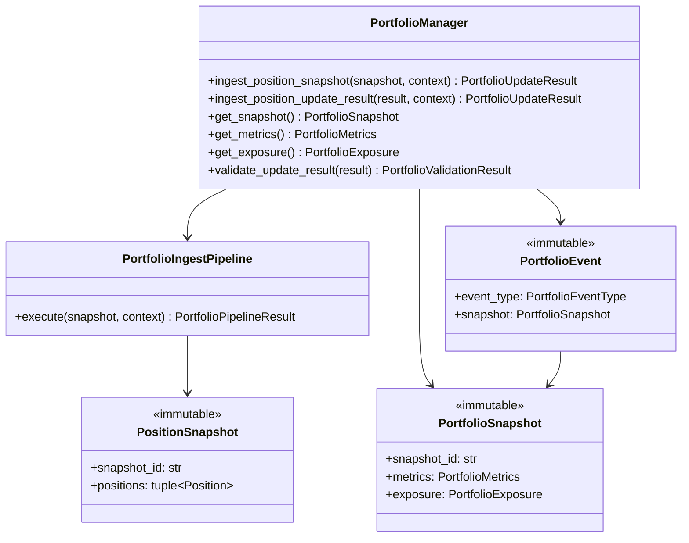

# Portfolio Manager — Software Engineering Specification

| Field | Value |
|---|---|
| **Module** | `portfolio/portfolio_manager.py` |
| **Document version** | 1.0.0 |
| **Status** | Draft — ready for implementation |
| **Owner** | THETA AI TRADER Core Platform |
| **Last updated** | 2026-08-04 |

---

## 1. Purpose

`portfolio/portfolio_manager.py` defines the **institutional account-level portfolio aggregation, metrics, exposure, and snapshot publication layer** for THETA AI TRADER v1.0.

The module consumes immutable position artifacts produced by the Position Manager (`PositionSnapshot`, `PositionUpdateResult`, `Position`) together with orchestrator-supplied account state hints (equity, cash, margin, Greeks maps), and performs **deterministic portfolio-level P&L rollups, Greeks aggregation, exposure computation, capital and margin utilization tracking, multi-dimensional aggregation (strategy, underlying, expiry), and auditable portfolio event publication** — but **never** executes orders, selects strategies, performs risk validation, or applies Adaptive Position Management Engine (APME) logic.

The module answers: *"Given these live positions, account hints, and reference market data, what is our authoritative account-level portfolio state — P&L, exposure, Greeks, utilization — and how do we publish an immutable portfolio snapshot for downstream risk review and APME consumption?"*

It is **not** an order submission layer. It is **not** a risk manager. It is **not** a position accounting layer. It is **not** APME. It is the **portfolio aggregation gate** between per-position accounting and account-level intelligence.

### Pipeline placement

```text
[Market Data Engine]
    → MarketSnapshot (immutable)
              ↓
[Strategy Registry → Strategy Evaluation → Trade Decision]
              ↓
[risk/risk_engine.py]
    → RiskDecisionResult (uses orchestrator PortfolioSnapshot for pre-trade review)
              ↓
[execution/execution_engine.py]
    → ExecutionPlan (immutable)
              ↓
[execution/order_manager.py]
    → OrderSubmissionResult / OrderTracker
              ↓
[portfolio/position_manager.py]
    → PositionUpdateResult / PositionSnapshot
              ↓
[portfolio/portfolio_manager.py]          ← THIS MODULE
    ingest PositionSnapshot(s)
    map Position → PortfolioPositionSummary
    aggregate P&L, exposure, Greeks
    compute capital / margin utilization
    aggregate by strategy / underlying / expiry
    publish portfolio.* lifecycle events
              ↓
    PortfolioUpdateResult (immutable)
    PortfolioSnapshot (immutable)
    PortfolioMetrics / PortfolioExposure
              ↓
[Adaptive Position Management Engine (APME)]
    (downstream — subscribes to portfolio.*; Portfolio Manager never calls APME)
              ↓
[Orchestrator → risk/risk_engine.py on next cycle]
    maps PortfolioSnapshot → risk.PortfolioSnapshot for pre-trade review
```

### Architecture freeze note

The platform architecture is **FROZEN** for v1.0:

- **Portfolio Manager** sits strictly **between** Position Manager and APME.
- **Account-level portfolio ownership** for institutional pipeline runs belongs to Portfolio Manager — not the orchestrator, not Position Manager, not Risk Engine.
- Position Manager **continues** to own per-position lifecycle (`Position`, `position.*` events); Portfolio Manager **derives** account rollups from `PositionSnapshot` only.
- Risk Engine **continues** to consume orchestrator-supplied `risk.risk_engine.PortfolioSnapshot` for **pre-trade** review; Portfolio Manager **produces** the authoritative live snapshot that the orchestrator **maps** to the risk contract on the next cycle — Risk Engine does **not** read Portfolio Manager directly in v1.
- APME **subscribes** to `portfolio.*` events and reads `PortfolioSnapshot`; Portfolio Manager **never** invokes APME.
- Portfolio Manager **aggregates** Greeks from orchestrator-injected per-position hints — it does **not** compute Black-Scholes or import Greeks Engine internals in v1.

### Goals

1. Provide a **dedicated portfolio aggregation layer** between position accounting and APME — separate from risk, strategy, order submission, and position management.
2. Consume **immutable upstream position artifacts** (`PositionSnapshot`, `PositionUpdateResult`) without re-running order submission or position fill logic.
3. Maintain **immutable `PortfolioSnapshot` records** with deterministic rollups and stable fingerprints.
4. Calculate **portfolio-level P&L** (realized session, unrealized, daily, total equity delta hints).
5. **Aggregate portfolio Greeks** (delta, gamma, theta, vega) from injected per-position Greek hints.
6. Track **capital utilization** (deployed capital vs available equity/cash hints).
7. Track **margin utilization** (used vs available margin hints from orchestrator/broker snapshots).
8. Compute **portfolio exposure** (gross/net notional, per-underlying, per-strategy-family).
9. **Aggregate by strategy**, **by underlying**, and **by expiry** with explicit bucket semantics.
10. Apply **multi-stage deterministic update pipeline** with ordered stages and stable rule identifiers.
11. Publish **portfolio lifecycle events** via `core/event_bus.py` under the `portfolio.*` topic namespace.
12. Remain **thread-safe** for concurrent ingest and snapshot reads.
13. **Fail closed** on ambiguous position data, correlation mismatch, or invalid account hints — prefer explicit rejection over silent rollup corruption.
14. Provide **full explainability** via structured error codes, warnings, and event payloads.
15. Support **LIVE vs ANALYSIS vs BACKTEST** mode-aware strictness.
16. Achieve **deterministic, replay-verifiable** portfolio outcomes for identical inputs.
17. Expose **serialization** and **validation** for all public outward-facing types (schema v1.0.0).

### Success criteria

- Orchestrator invokes `PortfolioManager.ingest_position_snapshot(snapshot, context)` after Position Manager updates and receives immutable `PortfolioUpdateResult`.
- `PortfolioSnapshot` reflects aggregated open positions, exposure, P&L, Greeks, and utilization metrics.
- Identical inputs (position snapshot fingerprint, account hints, config, reference time) produce semantically equal `PortfolioUpdateResult` and identical `update_fingerprint`.
- All portfolio mutations flow through `PortfolioManager` public API — orchestrator does not maintain parallel portfolio dictionaries in institutional pipeline runs.
- Unit test coverage ≥ 95% line coverage on `portfolio/portfolio_manager.py`.
- No module under `portfolio/portfolio_manager.py` imports risk engine validation internals, strategy plugins, execution engine, order submission, broker SDK, APME modules, or Greeks Engine computation internals.

### Relationship to other modules

| Module | Relationship |
|---|---|
| `portfolio/position_manager.py` | **Primary upstream input.** Consumes `PositionSnapshot`, `PositionUpdateResult`. |
| `risk/risk_engine.py` | **Indirect downstream.** Orchestrator maps `PortfolioSnapshot` → `risk.PortfolioSnapshot` for pre-trade review. |
| `core/event_bus.py` | **Event publisher.** Publishes `PortfolioEvent` on `portfolio.*` topics. |
| `broker/base_broker.py` | **Optional hints.** May read `MarginSnapshot`, `FundsSnapshot` for utilization — never authoritative alone in v1. |
| `market_data.market_snapshot` | **Optional hints.** Reference prices and underlying marks — injected per update in v1. |
| Orchestrator | **Invoker.** Calls `PortfolioManager.ingest_position_snapshot()`; injects account and Greek hints. |
| APME (future) | **Primary downstream consumer.** Subscribes to `portfolio.updated`, `portfolio.snapshot.published`. |
| Greeks Engine (future) | **Sibling upstream.** Orchestrator attaches per-position Greek hints before ingest — Portfolio Manager aggregates only. |
| Trade Monitoring (future) | **Sibling consumer.** May subscribe to `portfolio.*` for dashboards. |

### Distinction from Position Manager

| Concern | Position Manager | Portfolio Manager |
|---|---|---|
| Granularity | Per-position leg records | Account-level aggregation |
| Primary input | Order fills / `OrderTracker` | `PositionSnapshot` |
| Primary output | `Position`, `PositionSnapshot` | `PortfolioSnapshot`, `PortfolioMetrics` |
| P&L | Per-position realized/unrealized | Portfolio rollups, equity hints |
| Greeks | Out of scope | Portfolio aggregation from hints |
| Exposure | Per-underlying quantity only | Full notional exposure rollups |
| Risk consumption | No | Produces snapshot mapped by orchestrator |
| Event namespace | `position.*` | `portfolio.*` |

### Distinction from Risk Engine `PortfolioSnapshot`

| Concern | `portfolio.portfolio_manager.PortfolioSnapshot` | `risk.risk_engine.PortfolioSnapshot` |
|---|---|---|
| Module | `portfolio/portfolio_manager.py` | `risk/risk_engine.py` |
| Timing | Post-fill authoritative live state | Pre-trade orchestrator supply to Risk Engine |
| Source | Derived from Position Manager outcomes | Mapped from Portfolio Manager output + account hints |
| Greeks | Included when hints supplied | Not required in v1 risk contract |
| Metrics depth | Full `PortfolioMetrics`, `PortfolioExposure` | `PortfolioExposureSummary` subset |
| Used by | APME, orchestrator, analytics | Risk Engine pre-trade gate |
| Mutability | New immutable snapshot per update | Immutable per review cycle |

**Rule MAP-001:** Orchestrator performs explicit mapping from Portfolio Manager output to `risk.risk_engine.PortfolioSnapshot` — Portfolio Manager does **not** import or construct risk types directly.

### Distinction from APME

| Concern | Portfolio Manager | APME |
|---|---|---|
| Role | State aggregation and publication | Position management rules and exit logic |
| Input | Position snapshots | Portfolio snapshots + position events |
| Output | Metrics and snapshots | Management actions (future orders via orchestrator) |
| Order execution | **Never** | **Never directly** — requests via orchestrator in future |
| Risk validation | **Never** | **Never** |

---

## 2. Responsibilities

`portfolio/portfolio_manager.py` **is responsible for**:

| # | Responsibility | Description |
|---|---|---|
| R1 | **PositionSnapshot consumption** | Accept immutable `PositionSnapshot` as primary ingest input. |
| R2 | **PositionUpdateResult consumption** | Optional ingest of sealed position update outcomes for audit linkage. |
| R3 | **Position → summary mapping** | Map `Position` records to internal `PortfolioPositionSummary`. |
| R4 | **Portfolio P&L rollup** | Aggregate realized session, unrealized, and daily P&L hints. |
| R5 | **Portfolio Greeks aggregation** | Sum delta, gamma, theta, vega from injected per-position hints. |
| R6 | **Capital utilization tracking** | Compute deployed capital vs equity/cash hints. |
| R7 | **Margin utilization tracking** | Compute margin used vs available from injected hints. |
| R8 | **Gross exposure calculation** | Sum absolute notional exposure across positions. |
| R9 | **Net exposure calculation** | Compute signed net exposure per underlying and portfolio total. |
| R10 | **Strategy aggregation** | Bucket metrics by `strategy_id` and `strategy_family`. |
| R11 | **Underlying aggregation** | Bucket metrics by underlying symbol. |
| R12 | **Expiry aggregation** | Bucket metrics by expiry date derived from instrument metadata. |
| R13 | **Open position count** | Maintain authoritative open position count for account. |
| R14 | **Concentration metrics** | Largest underlying/strategy weights as percentages. |
| R15 | **Multi-stage update pipeline** | Apply ordered ingest stages with audit trail. |
| R16 | **Idempotent ingest** | Re-ingesting identical position snapshot fingerprint produces NOOP. |
| R17 | **Correlation integrity** | Enforce `correlation_id` alignment across context and snapshot. |
| R18 | **PortfolioSnapshot assembly** | Produce immutable sealed account snapshot. |
| R19 | **PortfolioMetrics assembly** | Produce immutable metrics bundle attached to snapshot. |
| R20 | **PortfolioExposure assembly** | Produce immutable exposure breakdown. |
| R21 | **PortfolioUpdateResult assembly** | Immutable result with status, artifacts, warnings, errors, fingerprint. |
| R22 | **Event bus integration** | Publish `PortfolioEvent` on hierarchical `portfolio.*` topics. |
| R23 | **Lifecycle event schema** | Structured, serializable event payloads for all rollup transitions. |
| R24 | **Post-update validation** | Validate sealed `PortfolioUpdateResult` before return. |
| R25 | **Error taxonomy** | Stable codes under `PORTFOLIO_MANAGER.*`. |
| R26 | **Serialization** | JSON round-trip for public types schema v1.0.0. |
| R27 | **Logging conventions** | Standard log events for ingest start, rollup, publish, errors. |
| R28 | **Thread-safe execution** | Safe concurrent ingest and snapshot reads. |
| R29 | **Stage audit trail** | Record per-stage pass/fail counts and rejection reasons. |
| R30 | **Update fingerprint** | Compute deterministic fingerprint for replay verification. |
| R31 | **Mode-aware strictness** | Different behavior for LIVE vs ANALYSIS vs BACKTEST. |
| R32 | **Documentation contract** | Google-style docstrings on all public types and methods. |
| R33 | **Warning emission** | Non-fatal warnings (missing Greek hints, stale margin hints). |
| R34 | **Snapshot query API** | `get_snapshot()`, `get_metrics()`, `get_exposure()` for orchestrator reads. |
| R35 | **Event-driven ingest** | Optional handler for `position.snapshot.published` events. |
| R36 | **Peak equity tracking** | Maintain peak equity hint for drawdown metrics when enabled. |
| R37 | **Session boundary awareness** | Respect configurable session window for daily P&L rollups. |
| R38 | **Multi-account scoping** | Scope snapshots by `account_id` when provided. |

---

## 3. Non-Responsibilities

`portfolio/portfolio_manager.py` **must not**:

| # | Non-responsibility | Rationale |
|---|---|---|
| NR1 | **Run risk checks or emit APPROVED/REJECTED verdicts** | Risk Engine responsibility. |
| NR2 | **Select strategies or re-run strategy plugins** | Strategy Evaluation Engine responsibility. |
| NR3 | **Build or modify `ExecutionPlan` or submit orders** | Execution Engine / Order Manager responsibility. |
| NR4 | **Call `BaseBrokerClient.place_order` or any order API** | Order Manager responsibility. |
| NR5 | **Invoke APME logic or exit rules** | APME is separate downstream module. |
| NR6 | **Mutate `Position`, `PositionSnapshot`, or position artifacts** | Position Manager owns position state. |
| NR7 | **Compute position-level fill deltas or VWAP** | Position Manager responsibility. |
| NR8 | **Import Kite SDK or Zerodha-specific modules** | No broker transport in Portfolio Manager. |
| NR9 | **Construct broker client instances** | Orchestrator injects optional hints only. |
| NR10 | **Load environment variables or config files** | Accept injected `PortfolioManagerConfig` at construction. |
| NR11 | **Compute Black-Scholes Greeks internally** | Greeks Engine responsibility; Portfolio Manager aggregates hints only. |
| NR12 | **Import Greeks Engine computation internals** | Public hint types via orchestrator injection only. |
| NR13 | **Persist portfolio state to disk or database** | External persistence concern; module returns immutable snapshots. |
| NR14 | **Subscribe to live market data WebSocket feeds** | Marks and hints injected per update in v1. |
| NR15 | **Call other analytical engines directly** | Orchestrator assembles inputs. |
| NR16 | **Import Execution Engine or Order Manager internals** | Public position types only. |
| NR17 | **Force portfolio open on empty position snapshots** | Empty snapshot is valid — zero exposure portfolio. |
| NR18 | **Merge positions across accounts without policy** | Account scoping explicit in config. |
| NR19 | **Implement UI or dashboard rendering** | Consumers read results or subscribe to events. |
| NR20 | **Perform margin validation for new trades** | Risk Engine responsibility. |
| NR21 | **Modify registry or register strategies** | Registry module responsibility. |
| NR22 | **Silently swallow invalid position data** | All failures recorded in errors and result. |
| NR23 | **Use global mutable portfolio state without locking** | Per-manager state protected by lock. |
| NR24 | **Publish events when event bus is None** | Graceful no-op when bus not injected. |
| NR25 | **Authoritative broker reconciliation in v1** | Broker hints are supplemental; position snapshot is primary. |
| NR26 | **Handle basket/combo broker position APIs** | v1 aggregates individual position summaries. |
| NR27 | **Apply tax lot accounting** | Position Manager uses average cost; Portfolio Manager rolls up. |
| NR28 | **Manage individual position lifecycle transitions** | Position Manager responsibility. |
| NR29 | **Re-plan or re-submit failed orders** | Orchestrator must request new plan from Execution Engine. |
| NR30 | **Import `risk.risk_engine` or construct risk verdict types** | Orchestrator maps snapshots for risk cycle. |

---

## 4. Architecture

### 4.1 Layered design

```text
┌─────────────────────────────────────────────────────────────────────────┐
│                   portfolio/portfolio_manager.py                         │
│  (portfolio aggregation gate — no orders, no risk, no APME, no Kite SDK)│
│                                                                          │
│  ┌────────────────────┐  ┌────────────────────┐  ┌──────────────────┐  │
│  │ PortfolioManager   │  │ PortfolioIngest    │  │ PortfolioRegistry│  │
│  │ (public service)   │→ │ Pipeline           │→ │ (thread-safe)    │  │
│  └────────────────────┘  └────────────────────┘  └──────────────────┘  │
│           │                         │                        │           │
│           ▼                         ▼                        ▼           │
│  ┌────────────────────────────────────────────────────────────────────┐  │
│  │ PositionMapper · PnLRollup · GreeksAggregator · ExposureCalculator │  │
│  │ UtilizationCalculator · AggregationEngine · SnapshotBuilder        │  │
│  │ UpdateFingerprint · ResultSealer · EventPublisher                  │  │
│  └────────────────────────────────────────────────────────────────────┘  │
└─────────────────────────────────────────────────────────────────────────┘
         ▲                                           │
         │ PositionSnapshot + PortfolioIngestContext  ▼
         │                                    PortfolioUpdateResult
         │                                    PortfolioSnapshot
         │                                    portfolio.* events
```

### 4.2 Design principles

- **Single responsibility** — account-level aggregation only; no orders, risk, or APME logic.
- **Immutable outputs** — every `PortfolioSnapshot`, `PortfolioMetrics`, `PortfolioUpdateResult` is frozen.
- **Derived state only** — all portfolio fields computed from position snapshots and injected hints.
- **Fail closed** — ambiguous inputs reject update rather than corrupt rollups.
- **Deterministic replay** — identical inputs produce identical fingerprints and metrics.
- **Hint-based utilization** — capital and margin from orchestrator hints, not live broker polling in v1.
- **Event-first observability** — every material rollup change publishes a `portfolio.*` event when enabled.

### 4.3 Component responsibilities

| Component | Responsibility |
|---|---|
| `PortfolioManager` | Public service; orchestrates pipeline; snapshot query API. |
| `PortfolioIngestContext` | Immutable per-run inputs: account hints, Greek maps, mode, tags. |
| `PortfolioIngestPipeline` | Stateless ordered multi-stage ingest executor. |
| `PositionMapper` | Maps `Position` → `PortfolioPositionSummary`. |
| `PnLRollup` | Aggregates realized/unrealized/daily P&L with rounding rules. |
| `GreeksAggregator` | Sums per-position Greek hints into portfolio totals. |
| `ExposureCalculator` | Gross/net notional and concentration metrics. |
| `UtilizationCalculator` | Capital and margin utilization percentages. |
| `AggregationEngine` | Strategy, underlying, expiry bucket rollups. |
| `SnapshotBuilder` | Assembles `PortfolioSnapshot` with fingerprint. |
| `UpdateFingerprint` | Deterministic hash over portfolio outcomes. |
| `EventPublisher` | Publishes `PortfolioEvent` on `portfolio.*` topics. |

### 4.4 Dependency direction

```text
portfolio.position_manager (PositionSnapshot, Position)
        ↓
portfolio.portfolio_manager
        ↓
APME (PortfolioSnapshot consumer — read-only)
Orchestrator → risk.risk_engine (mapped PortfolioSnapshot — next cycle)

core.event_bus ← portfolio.portfolio_manager (publish only)
broker.base_broker (optional MarginSnapshot / FundsSnapshot hints)
market_data (price marks via orchestrator — no direct import required)
```

**Forbidden imports:** `risk.risk_engine`, `execution.execution_engine`, `execution.order_manager`, `strategy.*`, `broker/zerodha/*`, APME modules, Kite SDK, Greeks Engine computation modules (`greeks_engine.py`, `option_greeks_engine.py` internals).

### 4.5 Relationship diagram



---

## 5. Data Model

All public outward-facing types are **immutable dataclasses** (`frozen=True`) unless noted.

### 5.1 Type hierarchy

```text
PortfolioManager (mutable service)
├── config: PortfolioManagerConfig
├── event_bus: EventBus | None
├── registry: PortfolioRegistry (thread-safe)
├── pipeline: PortfolioIngestPipeline (stateless)
└── methods: ingest_position_snapshot(), get_snapshot(), get_metrics(), get_exposure()

PortfolioIngestContext (immutable)
├── correlation_id: str
├── reference_time: datetime
├── execution_mode: StrategyExecutionMode
├── account_id: str
├── equity_hint: float
├── cash_available_hint: float
├── margin_used_hint: float
├── margin_available_hint: float | None
├── peak_equity_hint: float | None
├── greek_hints: Mapping[position_id, PositionGreekHint]
├── price_hints: Mapping[instrument_key, float]
└── tags: Mapping[str, str]

PortfolioUpdateResult (immutable)
├── update_id: str
├── status: PortfolioUpdateStatus
├── snapshot: PortfolioSnapshot
├── metrics: PortfolioMetrics
├── exposure: PortfolioExposure
├── pipeline_summary: PortfolioPipelineResult
├── warnings: tuple[PortfolioWarningRecord, ...]
├── errors: tuple[PortfolioErrorRecord, ...]
├── update_fingerprint: str
└── duration_ms: float

PortfolioSnapshot (immutable)                    ← REQUIRED OUTPUT MODEL
├── snapshot_id: str
├── correlation_id: str
├── as_of: datetime
├── account_id: str
├── metrics: PortfolioMetrics
├── exposure: PortfolioExposure
├── positions: tuple[PortfolioPositionSummary, ...]
├── by_strategy: Mapping[str, PortfolioAggregationBucket]
├── by_underlying: Mapping[str, PortfolioAggregationBucket]
├── by_expiry: Mapping[str, PortfolioAggregationBucket]
└── snapshot_fingerprint: str

PortfolioMetrics (immutable)                     ← REQUIRED OUTPUT MODEL
├── total_realized_pnl_session: float
├── total_unrealized_pnl: float
├── total_daily_pnl: float
├── equity_hint: float
├── cash_available_hint: float
├── capital_deployed: float
├── capital_utilization_pct: float
├── margin_used_hint: float
├── margin_available_hint: float | None
├── margin_utilization_pct: float | None
├── portfolio_delta: float | None
├── portfolio_gamma: float | None
├── portfolio_theta: float | None
├── portfolio_vega: float | None
├── open_position_count: int
├── peak_equity_hint: float | None
└── metrics_fingerprint: str

PortfolioExposure (immutable)                    ← REQUIRED OUTPUT MODEL
├── gross_notional: float
├── net_notional: float
├── gross_notional_by_underlying: Mapping[str, float]
├── net_notional_by_underlying: Mapping[str, float]
├── exposure_by_strategy_id: Mapping[str, float]
├── exposure_by_strategy_family: Mapping[str, float]
├── exposure_by_expiry: Mapping[str, float]
├── largest_underlying_weight_pct: float
├── largest_strategy_weight_pct: float
├── open_position_count: int
├── open_position_count_by_underlying: Mapping[str, int]
└── exposure_fingerprint: str

PortfolioEvent (immutable)                       ← REQUIRED OUTPUT MODEL
├── event_type: PortfolioEventType
├── topic: str
├── update_id: str
├── snapshot_id: str | None
├── snapshot: PortfolioSnapshot | None
├── correlation_id: str
├── occurred_at: datetime
├── producer: str
├── producer_version: str
└── metadata: Mapping[str, str]
```

### 5.2 Module constants

| Constant | Value | Description |
|---|---|---|
| `PORTFOLIO_MANAGER_VERSION` | `"1.0.0"` | Module semantic version. |
| `PORTFOLIO_SCHEMA_VERSION` | `"1.0.0"` | JSON schema version for portfolio types. |
| `PRODUCER_NAME` | `"portfolio_manager"` | Event bus producer identifier. |
| `DEFAULT_MARGIN_HINT_MAX_AGE_SECONDS` | `300` | Max age for margin hints before warning. |
| `DEFAULT_GREEK_HINT_MAX_AGE_SECONDS` | `120` | Max age for Greek hints before warning. |
| `NOTIONAL_ROUND_DECIMALS` | `2` | Notional exposure rounding precision. |
| `PNL_ROUND_DECIMALS` | `2` | P&L rounding precision. |
| `GREEK_ROUND_DECIMALS` | `4` | Greek aggregation rounding precision. |
| `UTILIZATION_ROUND_DECIMALS` | `4` | Utilization percentage rounding precision. |
| `WEIGHT_ROUND_DECIMALS` | `4` | Concentration weight rounding precision. |

### 5.3 Enums

#### 5.3.1 `PortfolioUpdateStatus`

| Member | Description |
|---|---|
| `APPLIED` | Snapshot ingested and rollups recomputed successfully. |
| `NOOP` | Idempotent re-ingest; no portfolio changes. |
| `REJECTED` | Pre-ingest gate rejected input — no mutations. |
| `PARTIAL` | Rollups applied with warnings; non-fatal issues present. |
| `FAILED` | Unrecoverable error during ingest pipeline. |

#### 5.3.2 `PortfolioEventType`

| Member | Topic | Description |
|---|---|---|
| `INGEST_RECEIVED` | `portfolio.ingest.received` | Position snapshot accepted for processing. |
| `INGEST_REJECTED` | `portfolio.ingest.rejected` | Pre-gate rejected. |
| `PORTFOLIO_UPDATED` | `portfolio.updated` | Material metrics change detected. |
| `PNL_UPDATED` | `portfolio.pnl.updated` | P&L rollups changed. |
| `EXPOSURE_UPDATED` | `portfolio.exposure.updated` | Exposure rollups changed. |
| `GREEKS_UPDATED` | `portfolio.greeks.updated` | Portfolio Greeks changed. |
| `UTILIZATION_UPDATED` | `portfolio.utilization.updated` | Capital/margin utilization changed. |
| `AGGREGATION_UPDATED` | `portfolio.aggregation.updated` | Strategy/underlying/expiry buckets changed. |
| `SNAPSHOT_PUBLISHED` | `portfolio.snapshot.published` | New portfolio snapshot available. |
| `INGEST_COMPLETED` | `portfolio.ingest.completed` | Entire ingest run finished. |
| `PORTFOLIO_ERROR` | `portfolio.error` | Terminal error state. |

#### 5.3.3 `PortfolioIngestStageId`

```python
STAGE_ORDER: Final[tuple[PortfolioIngestStageId, ...]] = (
    PortfolioIngestStageId.INPUT_GATE,
    PortfolioIngestStageId.SNAPSHOT_INTEGRITY,
    PortfolioIngestStageId.POSITION_MAPPING,
    PortfolioIngestStageId.PNL_ROLLUP,
    PortfolioIngestStageId.GREEKS_AGGREGATION,
    PortfolioIngestStageId.EXPOSURE_CALCULATION,
    PortfolioIngestStageId.UTILIZATION_CALCULATION,
    PortfolioIngestStageId.MULTI_DIM_AGGREGATION,
    PortfolioIngestStageId.SNAPSHOT_ASSEMBLY,
    PortfolioIngestStageId.RESULT_ASSEMBLY,
    PortfolioIngestStageId.OUTPUT_VALIDATION,
)
```

### 5.4 Dataclass field tables

#### 5.4.1 `PortfolioManagerConfig`

| Field | Type | Default | Description |
|---|---|---|---|
| `strict_correlation` | `bool` | `True` | Enforce correlation_id match. |
| `strict_output_validation` | `bool` | `True` | Validate result before return. |
| `deterministic_fingerprint` | `bool` | `True` | Compute update fingerprint. |
| `publish_lifecycle_events` | `bool` | `True` | Publish when event bus injected. |
| `idempotent_ingest` | `bool` | `True` | Skip already-applied position snapshot fingerprints. |
| `require_account_hints` | `bool` | `True` | Require equity/cash hints in LIVE mode. |
| `require_greek_hints` | `bool` | `False` | Warn when Greek hints missing (False = warn only). |
| `track_peak_equity` | `bool` | `True` | Update peak equity hint on new highs. |
| `session_pnl_tracking` | `bool` | `True` | Accumulate session realized P&L rollups. |
| `margin_hint_max_age_seconds` | `int` | `300` | Warn when margin hint older than threshold. |
| `greek_hint_max_age_seconds` | `int` | `120` | Warn when Greek hint older than threshold. |
| `max_open_positions` | `int | None` | `None` | Informational cap for warnings only — not enforcement. |
| `expiry_bucket_format` | `str` | `"%Y-%m-%d"` | strftime format for expiry aggregation keys. |
| `metadata` | `Mapping[str, str]` | `{}` | Opaque metadata. |

#### 5.4.2 `PortfolioPositionSummary`

| Field | Type | Description |
|---|---|---|
| `position_id` | `str` | Source position identifier. |
| `instrument_key` | `str` | Instrument key from Position Manager. |
| `underlying` | `str` | Underlying symbol. |
| `expiry` | `str | None` | Expiry bucket key (ISO date). |
| `strategy_id` | `str` | Strategy association. |
| `strategy_family` | `StrategyFamily` | Strategy family. |
| `side` | `str` | Encoded direction (`long` / `short`). |
| `quantity` | `int` | Absolute quantity. |
| `notional_exposure` | `float` | quantity × mark or avg entry. |
| `unrealized_pnl` | `float` | From Position Manager. |
| `realized_pnl_session` | `float` | Session realized from position metadata when present. |
| `delta` | `float | None` | Per-position delta hint. |
| `gamma` | `float | None` | Per-position gamma hint. |
| `theta` | `float | None` | Per-position theta hint. |
| `vega` | `float | None` | Per-position vega hint. |
| `opened_at` | `datetime | None` | Position open timestamp. |
| `metadata` | `Mapping[str, str]` | Opaque metadata. |

#### 5.4.3 `PortfolioAggregationBucket`

| Field | Type | Description |
|---|---|---|
| `bucket_key` | `str` | Aggregation key (strategy_id, underlying, expiry). |
| `open_position_count` | `int` | Positions in bucket. |
| `gross_notional` | `float` | Sum absolute notional. |
| `net_notional` | `float` | Signed net notional. |
| `unrealized_pnl` | `float` | Sum unrealized P&L. |
| `realized_pnl_session` | `float` | Sum session realized P&L. |
| `delta` | `float | None` | Sum delta hints. |
| `gamma` | `float | None` | Sum gamma hints. |
| `theta` | `float | None` | Sum theta hints. |
| `vega` | `float | None` | Sum vega hints. |
| `weight_pct` | `float` | Bucket gross notional / portfolio gross notional. |

#### 5.4.4 `PositionGreekHint` (immutable ingest helper)

| Field | Type | Description |
|---|---|---|
| `position_id` | `str` | Target position. |
| `delta` | `float | None` | Delta hint. |
| `gamma` | `float | None` | Gamma hint. |
| `theta` | `float | None` | Theta hint. |
| `vega` | `float | None` | Vega hint. |
| `as_of` | `datetime` | Hint timestamp. |
| `source` | `str` | Hint source identifier (e.g. `"greeks_engine"`). |

#### 5.4.5 `PortfolioSnapshot` invariants

- INV-PS-001: `snapshot_id` non-empty and unique per assembly.
- INV-PS-002: `as_of` timezone-aware.
- INV-PS-003: `metrics.open_position_count == exposure.open_position_count`.
- INV-PS-004: `len(positions) == metrics.open_position_count`.
- INV-PS-005: `exposure.gross_notional >= 0`.
- INV-PS-006: Sum of `by_underlying[*].gross_notional` equals `exposure.gross_notional` within epsilon.
- INV-PS-007: `snapshot_fingerprint` stable for identical inputs.
- INV-PS-008: All bucket keys in `by_expiry` parse as valid dates when non-null.

#### 5.4.6 `PortfolioMetrics` invariants

- INV-PM-001: `capital_utilization_pct` in `[0, 100+ε]` when equity_hint > 0.
- INV-PM-002: `margin_utilization_pct` in `[0, 100+ε]` when margin denominators valid.
- INV-PM-003: `total_daily_pnl == total_realized_pnl_session + total_unrealized_pnl` within epsilon when session tracking enabled.
- INV-PM-004: Greek totals null only when no hints supplied for any position.

#### 5.4.7 `PortfolioUpdateResult`

| Field | Type | Description |
|---|---|---|
| `update_id` | `str` | Unique ingest run ID. |
| `source_position_snapshot_id` | `str | None` | Source Position Manager snapshot ID. |
| `correlation_id` | `str` | Pipeline correlation. |
| `status` | `PortfolioUpdateStatus` | Overall status. |
| `snapshot` | `PortfolioSnapshot` | Post-ingest portfolio snapshot. |
| `metrics` | `PortfolioMetrics` | Metrics bundle (also embedded in snapshot). |
| `exposure` | `PortfolioExposure` | Exposure bundle (also embedded in snapshot). |
| `pipeline_summary` | `PortfolioPipelineResult` | Stage audit. |
| `warnings` | `tuple[PortfolioWarningRecord, ...]` | Non-fatal warnings. |
| `errors` | `tuple[PortfolioErrorRecord, ...]` | Structured errors. |
| `primary_error_code` | `str | None` | Primary failure code. |
| `submitted_at` | `datetime` | Run start. |
| `completed_at` | `datetime | None` | Run end. |
| `duration_ms` | `float` | Total duration. |
| `update_fingerprint` | `str` | Replay fingerprint. |

### 5.5 Global invariants

- INV-G-001: No portfolio mutation when `PortfolioUpdateStatus.REJECTED`.
- INV-G-002: `update_fingerprint` stable across replays with identical inputs.
- INV-G-003: All datetimes timezone-aware.
- INV-G-004: Event topics match `portfolio.[a-z0-9_]+(\.[a-z0-9_]+)*`.
- INV-G-005: Idempotent re-ingest of same position snapshot fingerprint produces `NOOP`.
- INV-G-006: Portfolio Manager never modifies upstream `Position` records.

---

## 6. Upstream Integration

### 6.1 Position Manager consumption

Portfolio Manager consumes sealed artifacts from `portfolio/position_manager.py`.

**Primary entry point:** `PositionSnapshot` from `PositionUpdateResult.snapshot` or `PositionManager.get_snapshot()`.

**Preconditions for ingest:**

| Check | Rule ID | Failure code |
|---|---|---|
| `snapshot` not None | UP-001 | `PORTFOLIO_MANAGER.SNAPSHOT.MISSING` |
| `context.reference_time` timezone-aware | UP-002 | `PORTFOLIO_MANAGER.CONTEXT.NAIVE_TIMESTAMP` |
| `context.correlation_id == snapshot correlation` when strict | UP-003 | `PORTFOLIO_MANAGER.CONTEXT.CORRELATION_MISMATCH` |
| `context.account_id` non-empty when required | UP-004 | `PORTFOLIO_MANAGER.CONTEXT.MISSING_ACCOUNT` |
| Position records pass integrity checks | UP-005 | `PORTFOLIO_MANAGER.SNAPSHOT.INVALID` |

**Fields consumed from `PositionSnapshot`:**

| PositionSnapshot field | Usage |
|---|---|
| `snapshot_id` | Idempotency key component. |
| `as_of` | Portfolio snapshot timestamp baseline. |
| `account_id` | Account scoping. |
| `positions` | Primary rollup source. |
| `aggregate_unrealized_pnl` | Cross-check against recomputed rollup. |
| `aggregate_realized_pnl_session` | Session P&L seed. |
| `aggregate_quantity_by_underlying` | Cross-check quantity rollups. |
| `snapshot_fingerprint` | Idempotency and change detection. |

**Fields consumed from `Position`:**

| Position field | Usage |
|---|---|
| `position_id` | Summary key; Greek hint lookup. |
| `instrument_key` | Exposure and expiry parsing. |
| `side` | Direction encoding; net exposure sign. |
| `quantity` | Notional and count rollups. |
| `average_entry_price` | Notional when mark price absent. |
| `unrealized_pnl` | P&L rollup. |
| `realized_pnl` | Session/daily P&L hints. |
| `strategy_id` | Strategy bucket key. |
| `strategy_family` | Family bucket key. |
| `metadata.underlying` | Underlying bucket key. |
| `metadata.opened_at` | `PortfolioPositionSummary.opened_at`. |
| `metadata.plan_id` | Audit metadata only. |

**Expiry derivation (Rule EXP-001):**

1. Prefer `Position.metadata["expiry"]` when present (ISO date string).
2. Else parse from `instrument_key` when platform convention encodes expiry.
3. Else bucket as `"UNKNOWN"` and emit warning `PORTFOLIO_MANAGER.EXPIRY.UNRESOLVED`.

### 6.2 Account and margin hints

Orchestrator injects account state via `PortfolioIngestContext`:

| Context field | Source | Usage |
|---|---|---|
| `equity_hint` | Broker funds / orchestrator ledger | Capital utilization denominator. |
| `cash_available_hint` | Broker funds | Metrics reporting. |
| `margin_used_hint` | `MarginSnapshot.used` or orchestrator | Margin utilization numerator. |
| `margin_available_hint` | `MarginSnapshot.available` | Margin utilization denominator. |
| `peak_equity_hint` | Orchestrator rolling peak | Drawdown metrics (informational). |

**Rule AC-001:** Portfolio Manager treats hints as **read-only inputs** — never fetches broker APIs directly in v1.

**Rule AC-002:** When `require_account_hints=True` and `equity_hint <= 0` in LIVE mode, reject ingest with `PORTFOLIO_MANAGER.ACCOUNT.INVALID_EQUITY`.

### 6.3 Greek hints integration

Orchestrator supplies `greek_hints: Mapping[str, PositionGreekHint]` keyed by `position_id`.

**Rule GR-001:** Portfolio Manager **sums** hints — does not recompute option math.

**Rule GR-002:** Missing hint for a position → position-level Greeks null; warning if `require_greek_hints=False`, error only when strict LIVE policy enabled.

**Rule GR-003:** Publish `portfolio.greeks.updated` when portfolio delta/gamma/theta/vega change beyond epsilon.

```python
def aggregate_portfolio_greeks(
    summaries: tuple[PortfolioPositionSummary, ...],
) -> tuple[float | None, float | None, float | None, float | None]:
    """Sum per-position Greek hints into portfolio totals."""
    delta = gamma = theta = vega = 0.0
    any_delta = any_gamma = any_theta = any_vega = False
    for summary in summaries:
        if summary.delta is not None:
            delta += summary.delta
            any_delta = True
        if summary.gamma is not None:
            gamma += summary.gamma
            any_gamma = True
        if summary.theta is not None:
            theta += summary.theta
            any_theta = True
        if summary.vega is not None:
            vega += summary.vega
            any_vega = True
    return (
        round(delta, GREEK_ROUND_DECIMALS) if any_delta else None,
        round(gamma, GREEK_ROUND_DECIMALS) if any_gamma else None,
        round(theta, GREEK_ROUND_DECIMALS) if any_theta else None,
        round(vega, GREEK_ROUND_DECIMALS) if any_vega else None,
    )
```

### 6.4 Event-driven integration (optional)

Portfolio Manager MAY expose:

```python
def on_position_snapshot_event(self, event: PositionEvent) -> None:
    """Handle position.snapshot.published for near-real-time portfolio updates."""
```

| Position event | Portfolio action |
|---|---|
| `position.snapshot.published` | Trigger `ingest_position_snapshot()`. |
| `position.closed` | Optional incremental re-ingest on next snapshot. |
| `position.pnl.updated` | Defer until snapshot published (preferred v1 path). |

**Rule EV-001:** v1 institutional pipeline uses batch ingest after `position.snapshot.published`; event handler is optional optimization.

---

## 7. Downstream Integration

### 7.1 APME consumption

APME subscribes to portfolio-level events and reads `PortfolioSnapshot`:

| Topic | Usage |
|---|---|
| `portfolio.snapshot.published` | Refresh management context for all open positions. |
| `portfolio.updated` | Detect material portfolio state changes. |
| `portfolio.pnl.updated` | P&L-based rule triggers. |
| `portfolio.exposure.updated` | Concentration and exposure rule triggers. |
| `portfolio.greeks.updated` | Delta/gamma hedge triggers. |
| `portfolio.utilization.updated` | Capital deployment triggers. |

**Rule APME-001:** Portfolio Manager **never** calls APME modules.

**Rule APME-002:** APME reads `PortfolioSnapshot.positions` and bucket maps — never mutates them.

### 7.2 Orchestrator → Risk Engine mapping

Orchestrator maps Portfolio Manager output to `risk.risk_engine.PortfolioSnapshot` for the **next** pre-trade cycle:

| Portfolio Manager field | Risk `PortfolioSnapshot` field |
|---|---|
| `snapshot_id` | `snapshot_id` (or new mapped ID) |
| `correlation_id` | `correlation_id` |
| `as_of` | `as_of` |
| `account_id` | `account_id` |
| `metrics.equity_hint` | `equity` |
| `metrics.cash_available_hint` | `cash_available` |
| `metrics.total_realized_pnl_session` | `daily_realized_pnl` |
| `metrics.total_unrealized_pnl` | `daily_unrealized_pnl` |
| `metrics.peak_equity_hint` | `peak_equity` |
| `positions` → mapped summaries | `open_positions` |
| `exposure.*` | `exposure_summary` |
| `metrics.margin_used_hint` | `margin_used_hint` |
| `metrics.margin_available_hint` | `margin_available_hint` |
| `snapshot_fingerprint` | `portfolio_fingerprint` |

**Rule RISK-001:** Portfolio Manager does **not** perform this mapping — documented for interface clarity only.

### 7.3 Trade Monitoring consumption

Trade Monitoring may subscribe to `portfolio.*` for dashboards:

- Real-time P&L tile from `portfolio.pnl.updated`
- Exposure concentration chart from `portfolio.exposure.updated`
- Margin utilization gauge from `portfolio.utilization.updated`

---

## 8. Ingest Pipeline

### 8.1 Pipeline overview

The ingest pipeline applies **eleven ordered stages**. Each stage emits `PortfolioStageResult` with pass/fail, duration, and rejection code.

```text
INPUT_GATE → SNAPSHOT_INTEGRITY → POSITION_MAPPING → PNL_ROLLUP
    → GREEKS_AGGREGATION → EXPOSURE_CALCULATION → UTILIZATION_CALCULATION
    → MULTI_DIM_AGGREGATION → SNAPSHOT_ASSEMBLY → RESULT_ASSEMBLY → OUTPUT_VALIDATION
```

### 8.2 Stage specifications

#### Stage 1: INPUT_GATE (Rule IG-001 through IG-005)

| Rule ID | Check | On failure |
|---|---|---|
| IG-001 | snapshot not None | REJECTED; `PORTFOLIO_MANAGER.SNAPSHOT.MISSING` |
| IG-002 | context.reference_time timezone-aware | `PORTFOLIO_MANAGER.CONTEXT.NAIVE_TIMESTAMP` |
| IG-003 | correlation_id match when strict | `PORTFOLIO_MANAGER.CONTEXT.CORRELATION_MISMATCH` |
| IG-004 | account_id present when require_account_hints LIVE | `PORTFOLIO_MANAGER.CONTEXT.MISSING_ACCOUNT` |
| IG-005 | execution_mode valid | `PORTFOLIO_MANAGER.CONTEXT.INVALID` |

#### Stage 2: SNAPSHOT_INTEGRITY (Rule SI-001 through SI-004)

| Rule ID | Check | On failure |
|---|---|---|
| SI-001 | snapshot_id non-empty | `PORTFOLIO_MANAGER.SNAPSHOT.INVALID` |
| SI-002 | snapshot_fingerprint non-empty when deterministic | Warning |
| SI-003 | open_position_count consistent with positions length | `PORTFOLIO_MANAGER.SNAPSHOT.INVALID` |
| SI-004 | idempotent fingerprint already applied | NOOP skip downstream mutation |

#### Stage 3: POSITION_MAPPING (Rule PM-001 through PM-004)

| Rule ID | Action |
|---|---|
| PM-001 | Map each `Position` → `PortfolioPositionSummary`. |
| PM-002 | Compute notional = quantity × mark_price or avg_entry_price. |
| PM-003 | Attach Greek hints from context by position_id. |
| PM-004 | Derive expiry bucket per Rule EXP-001. |

#### Stage 4: PNL_ROLLUP (Rule PNL-001 through PNL-004)

| Rule ID | Action |
|---|---|
| PNL-001 | Sum unrealized P&L across summaries. |
| PNL-002 | Sum session realized P&L. |
| PNL-003 | Compute daily P&L = session realized + unrealized. |
| PNL-004 | Cross-check against PositionSnapshot aggregates; warn on mismatch. |

#### Stage 5: GREEKS_AGGREGATION (Rule GA-001 through GA-003)

| Rule ID | Action |
|---|---|
| GA-001 | Sum delta, gamma, theta, vega from position summaries. |
| GA-002 | Round to `GREEK_ROUND_DECIMALS`. |
| GA-003 | Warn on stale hints beyond `greek_hint_max_age_seconds`. |

#### Stage 6: EXPOSURE_CALCULATION (Rule EX-001 through EX-005)

| Rule ID | Action |
|---|---|
| EX-001 | Compute gross notional = sum(abs(notional)). |
| EX-002 | Compute net notional with sign from side. |
| EX-003 | Roll up by underlying, strategy_id, strategy_family, expiry. |
| EX-004 | Compute largest weight percentages. |
| EX-005 | Publish `portfolio.exposure.updated` on material change. |

#### Stage 7: UTILIZATION_CALCULATION (Rule UT-001 through UT-004)

| Rule ID | Action |
|---|---|
| UT-001 | capital_deployed = sum(notional) or configured definition. |
| UT-002 | capital_utilization_pct = deployed / equity_hint × 100. |
| UT-003 | margin_utilization_pct = margin_used / (used + available) × 100. |
| UT-004 | Warn on stale margin hints. |

#### Stage 8: MULTI_DIM_AGGREGATION (Rule AG-001 through AG-003)

| Rule ID | Action |
|---|---|
| AG-001 | Build `by_strategy` buckets keyed by strategy_id. |
| AG-002 | Build `by_underlying` buckets. |
| AG-003 | Build `by_expiry` buckets. |

#### Stage 9: SNAPSHOT_ASSEMBLY (Rule SA-001)

Assemble `PortfolioSnapshot`, `PortfolioMetrics`, `PortfolioExposure` with fingerprints.

#### Stage 10: RESULT_ASSEMBLY (Rule RA-001)

Build `PortfolioUpdateResult` with fingerprint, warnings, errors, timing.

#### Stage 11: OUTPUT_VALIDATION (Rule OV-001 through OV-003)

| Rule ID | Check | On failure |
|---|---|---|
| OV-001 | `validate_portfolio_update_result()` | `PORTFOLIO_MANAGER.RESULT.INVALID` |
| OV-002 | Fingerprint recomputation match | `PORTFOLIO_MANAGER.RESULT.FINGERPRINT_MISMATCH` |
| OV-003 | strict raises | `PortfolioManagerValidationError` |

### 8.3 Short-circuit behavior

| Condition | Behavior |
|---|---|
| INPUT_GATE failure | Return REJECTED; no portfolio mutations. |
| Idempotent snapshot fingerprint | Return NOOP. |
| PNL cross-check mismatch | Continue with warning. |
| Missing Greek hints | Continue with null portfolio Greeks and warning. |
| Missing margin available | margin_utilization_pct null with warning. |

---

## 9. Portfolio P&L Calculation

### 9.1 Unrealized P&L rollup

```python
def compute_total_unrealized_pnl(
    summaries: tuple[PortfolioPositionSummary, ...],
) -> float:
    """Sum position unrealized P&L."""
    total = sum(summary.unrealized_pnl for summary in summaries)
    return round(total, PNL_ROUND_DECIMALS)
```

**Rule UP-001:** Prefer recomputed sum over PositionSnapshot aggregate; warn if delta > epsilon.

### 9.2 Session realized P&L rollup

```python
def compute_total_realized_pnl_session(
    summaries: tuple[PortfolioPositionSummary, ...],
    *,
    seed: float = 0.0,
) -> float:
    """Sum session realized P&L from position summaries and optional seed."""
    total = seed + sum(summary.realized_pnl_session for summary in summaries)
    return round(total, PNL_ROUND_DECIMALS)
```

**Rule RP-001:** Seed from `PositionSnapshot.aggregate_realized_pnl_session` when session tracking enabled.

### 9.3 Daily P&L

**Rule DP-001:** `total_daily_pnl = total_realized_pnl_session + total_unrealized_pnl`.

**Rule DP-002:** Publish `portfolio.pnl.updated` when daily P&L changes beyond epsilon.

### 9.4 Notional and mark price selection

```python
def compute_notional_exposure(
    quantity: int,
    *,
    mark_price: float | None,
    average_entry_price: float,
) -> float:
    """Compute notional exposure for one position."""
    price = mark_price if mark_price is not None and mark_price > 0 else average_entry_price
    return round(quantity * price, NOTIONAL_ROUND_DECIMALS)
```

**Rule MK-001:** Prefer `price_hints[instrument_key]` from context when present.

**Rule MK-002:** Fall back to `average_entry_price` with warning `PORTFOLIO_MANAGER.PRICE.MARK_MISSING`.

---

## 10. Portfolio Greeks Aggregation

### 10.1 Scope

Portfolio Manager **aggregates** Greeks — it does **not** compute option sensitivities internally.

| Greek | Aggregation | Sign convention |
|---|---|---|
| Delta | Sum of position deltas | Respects position side hints |
| Gamma | Sum of position gammas | Always additive |
| Theta | Sum of position thetas | Always additive |
| Vega | Sum of position vegas | Always additive |

### 10.2 Hint attachment

```python
def attach_greek_hints(
    summary: PortfolioPositionSummary,
    hints: Mapping[str, PositionGreekHint],
) -> PortfolioPositionSummary:
    """Attach Greek hints to position summary."""
    hint = hints.get(summary.position_id)
    if hint is None:
        return summary
    return replace(
        summary,
        delta=hint.delta,
        gamma=hint.gamma,
        theta=hint.theta,
        vega=hint.vega,
    )
```

### 10.3 Portfolio totals

Portfolio-level Greeks stored on `PortfolioMetrics`:

- `portfolio_delta`
- `portfolio_gamma`
- `portfolio_theta`
- `portfolio_vega`

**Rule PG-001:** When no hints for any position, all portfolio Greeks are `None`.

**Rule PG-002:** Bucket-level Greeks sum only positions within the bucket.

---

## 11. Exposure Calculation

### 11.1 Gross and net notional

```python
def compute_gross_notional(
    summaries: tuple[PortfolioPositionSummary, ...],
) -> float:
    """Sum absolute notional exposure."""
    return round(
        sum(abs(summary.notional_exposure) for summary in summaries),
        NOTIONAL_ROUND_DECIMALS,
    )


def compute_net_notional(
    summaries: tuple[PortfolioPositionSummary, ...],
) -> float:
    """Sum signed notional exposure."""
    total = 0.0
    for summary in summaries:
        sign = -1.0 if summary.side == "short" else 1.0
        total += sign * summary.notional_exposure
    return round(total, NOTIONAL_ROUND_DECIMALS)
```

### 11.2 Per-underlying exposure

**Rule UX-001:** `gross_notional_by_underlying[u] = sum(abs(notional))` for positions with `underlying == u`.

**Rule UX-002:** `net_notional_by_underlying[u]` applies signed sum per underlying.

### 11.3 Concentration weights

```python
def compute_largest_weight_pct(
    bucket_notionals: Mapping[str, float],
    gross_total: float,
) -> float:
    """Return largest bucket weight as percentage of gross notional."""
    if gross_total <= 0:
        return 0.0
    largest = max(bucket_notionals.values(), default=0.0)
    return round((largest / gross_total) * 100.0, WEIGHT_ROUND_DECIMALS)
```

**Rule CW-001:** `largest_underlying_weight_pct` and `largest_strategy_weight_pct` stored on `PortfolioExposure`.

---

## 12. Capital and Margin Utilization

### 12.1 Capital utilization

```python
def compute_capital_utilization_pct(
    capital_deployed: float,
    equity_hint: float,
) -> float:
    """Compute capital utilization percentage."""
    if equity_hint <= 0:
        return 0.0
    return round(
        (capital_deployed / equity_hint) * 100.0,
        UTILIZATION_ROUND_DECIMALS,
    )
```

**Rule CU-001:** Default `capital_deployed = exposure.gross_notional` in v1.

**Rule CU-002:** Publish `portfolio.utilization.updated` when utilization changes beyond epsilon.

### 12.2 Margin utilization

```python
def compute_margin_utilization_pct(
    margin_used_hint: float,
    margin_available_hint: float | None,
) -> float | None:
    """Compute margin utilization percentage."""
    if margin_available_hint is None:
        return None
    denominator = margin_used_hint + margin_available_hint
    if denominator <= 0:
        return None
    return round(
        (margin_used_hint / denominator) * 100.0,
        UTILIZATION_ROUND_DECIMALS,
    )
```

**Rule MU-001:** Margin hints from orchestrator — not live broker fetch in v1.

**Rule MU-002:** Warn `PORTFOLIO_MANAGER.MARGIN.HINT_STALE` when hint age exceeds threshold.

### 12.3 Peak equity tracking

When `track_peak_equity=True`:

**Rule PE-001:** `peak_equity_hint = max(prior_peak, equity_hint)` on each successful ingest.

**Rule PE-002:** Peak stored in manager mutable state; included in next `PortfolioMetrics`.

---

## 13. Multi-Dimensional Aggregation

### 13.1 Strategy aggregation

**Bucket key:** `strategy_id` from `PortfolioPositionSummary`.

| Metric | Aggregation |
|---|---|
| `open_position_count` | Count of positions |
| `gross_notional` | Sum abs(notional) |
| `net_notional` | Signed sum |
| `unrealized_pnl` | Sum |
| `realized_pnl_session` | Sum |
| Greeks | Sum when hints present |
| `weight_pct` | bucket gross / portfolio gross |

**Rule ST-001:** Secondary index by `strategy_family` available on `PortfolioExposure.exposure_by_strategy_family`.

### 13.2 Underlying aggregation

**Bucket key:** `underlying` symbol (normalized uppercase).

**Rule UN-001:** Underlying normalization uses orchestrator convention — default uppercase strip.

**Rule UN-002:** Index options map to underlying index symbol from metadata, not full instrument key.

### 13.3 Expiry aggregation

**Bucket key:** ISO date string from Rule EXP-001.

| Scenario | Bucket |
|---|---|
| Resolved expiry | `"2026-08-28"` |
| Unresolved | `"UNKNOWN"` |
| Cash/equity positions | `"CASH"` |

**Rule EXB-001:** Expiry-day positions flagged in metadata `expiry_today=true` when `expiry == reference_date`.

### 13.4 Aggregation invariants

- INV-AG-001: Every open position appears in exactly one strategy bucket.
- INV-AG-002: Every open position appears in exactly one underlying bucket.
- INV-AG-003: Every open position appears in exactly one expiry bucket.
- INV-AG-004: Bucket weight percentages sum to ≤ 100% (gross overlap allowed across dimensions).

---

## 14. Event Bus Integration

### 14.1 Topic registry

| Topic | Event type | Payload |
|---|---|---|
| `portfolio.ingest.received` | INGEST_RECEIVED | position snapshot_id, position count |
| `portfolio.ingest.rejected` | INGEST_REJECTED | primary_error_code |
| `portfolio.ingest.completed` | INGEST_COMPLETED | PortfolioUpdateResult summary |
| `portfolio.updated` | PORTFOLIO_UPDATED | PortfolioSnapshot summary |
| `portfolio.pnl.updated` | PNL_UPDATED | daily P&L, unrealized, realized |
| `portfolio.exposure.updated` | EXPOSURE_UPDATED | gross/net notional |
| `portfolio.greeks.updated` | GREEKS_UPDATED | portfolio delta/gamma/theta/vega |
| `portfolio.utilization.updated` | UTILIZATION_UPDATED | capital/margin utilization |
| `portfolio.aggregation.updated` | AGGREGATION_UPDATED | bucket change summary |
| `portfolio.snapshot.published` | SNAPSHOT_PUBLISHED | snapshot_id, open_count |
| `portfolio.error` | PORTFOLIO_ERROR | error_code |

### 14.2 Publishing contract

When `event_bus` is `None` or `publish_lifecycle_events=False`, publishing is a no-op.

**Rule EB-001:** Events for a single ingest publish in stage order.

**Rule EB-002:** `portfolio.ingest.completed` is always last for an ingest run.

**Rule EB-003:** `portfolio.snapshot.published` emitted on every successful non-NOOP ingest.

**Rule EB-004:** SYNC dispatch — subscribers must be fast; no I/O in handlers.

### 14.3 Material change detection

Publish `portfolio.updated` only when any of the following change beyond epsilon:

- Daily P&L
- Gross notional
- Portfolio delta
- Capital utilization percentage
- Open position count

---

## 15. Validation

### 15.1 Pre-ingest validation

```python
def validate_ingest_context(
    context: PortfolioIngestContext,
    snapshot: PositionSnapshot,
    config: PortfolioManagerConfig,
) -> PortfolioValidationResult:
    """Validate context and snapshot before portfolio mutation."""
```

### 15.2 Post-ingest validation

```python
def validate_portfolio_update_result(
    result: PortfolioUpdateResult,
) -> PortfolioValidationResult:
    """Validate sealed ingest result."""
```

| Check | Code on failure |
|---|---|
| update_id non-empty | `PORTFOLIO_MANAGER.RESULT.INVALID` |
| snapshot satisfies INV-PS-* | `PORTFOLIO_MANAGER.RESULT.INVALID` |
| metrics satisfies INV-PM-* | `PORTFOLIO_MANAGER.RESULT.INVALID` |
| exposure count consistency | `PORTFOLIO_MANAGER.RESULT.INVALID` |
| update_fingerprint matches recompute | `PORTFOLIO_MANAGER.RESULT.FINGERPRINT_MISMATCH` |

```python
def assert_valid_portfolio_update_result(result: PortfolioUpdateResult) -> None:
    """Raise PortfolioManagerValidationError when invalid."""
```

---

## 16. Deterministic Behavior & Idempotency

### 16.1 Determinism scope

Identical inputs must produce identical outputs:

| Input dimension | Included in fingerprint |
|---|---|
| PositionSnapshot.snapshot_fingerprint | Yes |
| Account hints (equity, cash, margin) | Yes |
| Greek hints (canonical JSON) | Yes |
| Price hints (serialized) | Yes |
| PortfolioManagerConfig hash | Yes |
| reference_time ISO | Yes |
| Previously applied snapshot fingerprints | Yes |

### 16.2 Update fingerprint

```python
def compute_update_fingerprint(
    snapshot: PositionSnapshot,
    portfolio_snapshot: PortfolioSnapshot,
    config: PortfolioManagerConfig,
) -> str:
    """SHA-256 over canonical JSON of portfolio outcomes."""
    payload = {
        "position_snapshot_fingerprint": snapshot.snapshot_fingerprint,
        "portfolio_outcomes": {
            "snapshot_id": portfolio_snapshot.snapshot_id,
            "open_position_count": portfolio_snapshot.metrics.open_position_count,
            "gross_notional": portfolio_snapshot.exposure.gross_notional,
            "total_daily_pnl": portfolio_snapshot.metrics.total_daily_pnl,
            "portfolio_delta": portfolio_snapshot.metrics.portfolio_delta,
            "capital_utilization_pct": portfolio_snapshot.metrics.capital_utilization_pct,
        },
        "config_hash": config_fingerprint(config),
    }
    return sha256(canonical_json(payload)).hexdigest()
```

### 16.3 Idempotency guarantees

| Guarantee | Description |
|---|---|
| Same position snapshot re-ingested | NOOP status; no duplicate events. |
| Same snapshot_fingerprint | Skipped when `idempotent_ingest=True`. |
| Replay testing | Fingerprint matches golden hash. |

---

## 17. Thread Safety

### 17.1 Concurrency model

| Component | Thread safety |
|---|---|
| `PortfolioManager` instance | Safe for concurrent ingest and reads with lock |
| Same snapshot ingested twice | Undefined — orchestrator must dedupe |
| `PortfolioSnapshot` / metrics types | Immutable — inherently thread-safe |
| Internal registry | Protected by `threading.RLock` |
| Event bus publish | EventBus is thread-safe |

### 17.2 Locking strategy

```python
class PortfolioManager:
    def __init__(self, config: PortfolioManagerConfig, event_bus: EventBus | None = None):
        self._config = config
        self._event_bus = event_bus
        self._registry_lock = threading.RLock()
        self._latest_snapshot: PortfolioSnapshot | None = None
        self._applied_snapshots: set[str] = set()
        self._peak_equity: float = 0.0
```

**Rule TS-001:** Hold lock during registry mutation only — not during event handler dispatch.

**Rule TS-002:** Pipeline state is per-run local.

---

## 18. Serialization

### 18.1 Schema version

`PORTFOLIO_SCHEMA_VERSION = "1.0.0"`

### 18.2 JSON round-trip

Supported types: `PortfolioSnapshot`, `PortfolioMetrics`, `PortfolioExposure`, `PortfolioUpdateResult`, `PortfolioEvent`, `PortfolioManagerConfig`.

```python
def serialize_portfolio_update_result(result: PortfolioUpdateResult) -> str: ...
def deserialize_portfolio_update_result(payload: str) -> PortfolioUpdateResult: ...
def serialize_portfolio_snapshot(snapshot: PortfolioSnapshot) -> str: ...
def deserialize_portfolio_snapshot(payload: str) -> PortfolioSnapshot: ...
```

| Rule ID | Rule |
|---|---|
| SER-001 | Enums serialize as string values. |
| SER-002 | datetimes serialize as ISO-8601 UTC with Z suffix. |
| SER-003 | Mappings serialize as sorted-key JSON objects. |
| SER-004 | tuples serialize as JSON arrays. |
| SER-005 | Unknown schema version raises `PORTFOLIO_MANAGER.SERIALIZATION.UNSUPPORTED_VERSION`. |

---

## 19. Error Taxonomy

Namespace: `PORTFOLIO_MANAGER.<CATEGORY>.<DETAIL>`

### 19.1 Exceptions

| Exception | When |
|---|---|
| `PortfolioManagerError` | Base exception |
| `PortfolioManagerConfigurationError` | Invalid config at construction |
| `PortfolioManagerValidationError` | Input or output validation failure |
| `PortfolioManagerContextError` | Invalid ingest context |
| `PortfolioManagerIngestError` | Ingest stage failure |

### 19.2 Error codes

| Code | Description |
|---|---|
| `PORTFOLIO_MANAGER.CONFIG.INVALID` | Invalid manager configuration |
| `PORTFOLIO_MANAGER.CONTEXT.INVALID` | Invalid ingest context |
| `PORTFOLIO_MANAGER.CONTEXT.NAIVE_TIMESTAMP` | Timezone-naive datetime |
| `PORTFOLIO_MANAGER.CONTEXT.CORRELATION_MISMATCH` | correlation_id mismatch |
| `PORTFOLIO_MANAGER.CONTEXT.MISSING_ACCOUNT` | account_id required but absent |
| `PORTFOLIO_MANAGER.SNAPSHOT.MISSING` | No snapshot provided |
| `PORTFOLIO_MANAGER.SNAPSHOT.INVALID` | Snapshot integrity failure |
| `PORTFOLIO_MANAGER.SNAPSHOT.EMPTY` | Informational — valid empty portfolio |
| `PORTFOLIO_MANAGER.POSITION.MAPPING_FAILED` | Position mapping failure |
| `PORTFOLIO_MANAGER.PNL.MISMATCH` | Warning — rollup mismatch vs position snapshot |
| `PORTFOLIO_MANAGER.PRICE.MARK_MISSING` | Warning — no mark price for notional |
| `PORTFOLIO_MANAGER.GREEK.HINT_MISSING` | Warning — no Greek hint for position |
| `PORTFOLIO_MANAGER.GREEK.HINT_STALE` | Warning — Greek hint too old |
| `PORTFOLIO_MANAGER.MARGIN.HINT_MISSING` | Warning — margin hint absent |
| `PORTFOLIO_MANAGER.MARGIN.HINT_STALE` | Warning — margin hint too old |
| `PORTFOLIO_MANAGER.ACCOUNT.INVALID_EQUITY` | equity_hint <= 0 in LIVE |
| `PORTFOLIO_MANAGER.EXPIRY.UNRESOLVED` | Warning — expiry bucket UNKNOWN |
| `PORTFOLIO_MANAGER.EXPOSURE.COMPUTATION_FAILED` | Exposure calculation failure |
| `PORTFOLIO_MANAGER.RESULT.INVALID` | Output validation failed |
| `PORTFOLIO_MANAGER.RESULT.FINGERPRINT_MISMATCH` | Fingerprint mismatch |
| `PORTFOLIO_MANAGER.SERIALIZATION.UNSUPPORTED_VERSION` | Unknown schema version |
| `PORTFOLIO_MANAGER.SERIALIZATION.MALFORMED` | Malformed JSON |

---

## 20. Public API

### 20.1 Module exports

```python
PORTFOLIO_MANAGER_VERSION: str
PORTFOLIO_SCHEMA_VERSION: str
PRODUCER_NAME: str

# Enums
PortfolioUpdateStatus
PortfolioEventType
PortfolioIngestStageId

# Config and context
PortfolioManagerConfig
PortfolioIngestContext
PositionGreekHint

# Core models (required output models)
PortfolioSnapshot
PortfolioMetrics
PortfolioExposure
PortfolioEvent
PortfolioUpdateResult

# Supporting types
PortfolioPositionSummary
PortfolioAggregationBucket
PortfolioStageResult
PortfolioPipelineResult
PortfolioWarningRecord
PortfolioErrorRecord
PortfolioValidationResult

# Service
PortfolioManager

# Module functions
default_portfolio_manager_config() -> PortfolioManagerConfig
map_position_to_summary(position, *, mark_price, greek_hint) -> PortfolioPositionSummary
validate_ingest_context(context, snapshot, config) -> PortfolioValidationResult
validate_portfolio_update_result(result) -> PortfolioValidationResult
assert_valid_portfolio_update_result(result) -> None
serialize_portfolio_update_result(result) -> str
deserialize_portfolio_update_result(payload: str) -> PortfolioUpdateResult
serialize_portfolio_snapshot(snapshot) -> str
deserialize_portfolio_snapshot(payload: str) -> PortfolioSnapshot
compute_update_fingerprint(snapshot, portfolio_snapshot, config) -> str
aggregate_portfolio_greeks(summaries) -> tuple[float | None, ...]
compute_gross_notional(summaries) -> float
compute_capital_utilization_pct(deployed, equity) -> float
```

### 20.2 `PortfolioManager` class

```python
class PortfolioManager:
    """Institutional account-level portfolio aggregation manager.

    Consumes PositionSnapshot artifacts from Position Manager, computes
    portfolio P&L, exposure, Greeks, utilization, and publishes portfolio.*
    lifecycle events.

    Args:
        config: Injected immutable configuration.
        event_bus: Optional EventBus for lifecycle event publishing.
    """

    def ingest_position_snapshot(
        self,
        snapshot: PositionSnapshot,
        context: PortfolioIngestContext,
    ) -> PortfolioUpdateResult:
        """Ingest a Position Manager snapshot and recompute portfolio rollups."""

    def ingest_position_update_result(
        self,
        result: PositionUpdateResult,
        context: PortfolioIngestContext,
    ) -> PortfolioUpdateResult:
        """Ingest from sealed PositionUpdateResult wrapper."""

    def get_snapshot(self) -> PortfolioSnapshot | None:
        """Return latest immutable portfolio snapshot."""

    def get_metrics(self) -> PortfolioMetrics | None:
        """Return metrics from latest snapshot."""

    def get_exposure(self) -> PortfolioExposure | None:
        """Return exposure from latest snapshot."""

    def on_position_snapshot_event(self, event: PositionEvent) -> None:
        """Optional handler for position.snapshot.published events."""

    def validate_ingest_context(
        self,
        context: PortfolioIngestContext,
        snapshot: PositionSnapshot,
    ) -> PortfolioValidationResult:
        """Validate without mutating."""

    def validate_update_result(
        self,
        result: PortfolioUpdateResult,
    ) -> PortfolioValidationResult:
        """Validate sealed result."""
```

---

## 21. Configuration

```python
def default_portfolio_manager_config() -> PortfolioManagerConfig:
    """Production-default portfolio manager configuration."""
    return PortfolioManagerConfig(
        strict_correlation=True,
        strict_output_validation=True,
        deterministic_fingerprint=True,
        publish_lifecycle_events=True,
        idempotent_ingest=True,
        require_account_hints=True,
        require_greek_hints=False,
        track_peak_equity=True,
        session_pnl_tracking=True,
        margin_hint_max_age_seconds=300,
        greek_hint_max_age_seconds=120,
        max_open_positions=None,
        expiry_bucket_format="%Y-%m-%d",
        metadata=MappingProxyType({}),
    )
```

| Setting | LIVE | ANALYSIS | BACKTEST |
|---|---|---|---|
| `strict_correlation` | True | True | False |
| `require_account_hints` | True | False | False |
| `require_greek_hints` | False | False | False |
| `idempotent_ingest` | True | True | True |

---

## 22. Logging Events

Logger name: `portfolio.portfolio_manager`.

| Event | Level | When |
|---|---|---|
| `portfolio_manager.ingest.start` | INFO | ingest_position_snapshot invoked |
| `portfolio_manager.ingest.rejected` | INFO | Pre-gate rejection |
| `portfolio_manager.rollup.pnl` | INFO | P&L rollup computed |
| `portfolio_manager.rollup.exposure` | INFO | Exposure rollup computed |
| `portfolio_manager.rollup.greeks` | INFO | Greeks aggregated |
| `portfolio_manager.rollup.utilization` | INFO | Utilization computed |
| `portfolio_manager.snapshot.published` | INFO | Snapshot published |
| `portfolio_manager.ingest.complete` | INFO | Ingest run finished |
| `portfolio_manager.greek.hint_missing` | WARNING | Missing Greek hint |
| `portfolio_manager.margin.stale` | WARNING | Stale margin hint |

---

## 23. Testing Strategy

### 23.1 Coverage target

**Minimum line coverage: 95%** on `portfolio/portfolio_manager.py`.

### 23.2 Required test cases

| Category | Tests |
|---|---|
| Input gate | Reject missing snapshot, correlation mismatch, naive timestamp |
| Idempotency | Re-ingest same snapshot fingerprint → NOOP |
| P&L rollup | Multi-position unrealized/realized/daily P&L |
| Exposure | Gross/net notional, per-underlying, concentration weights |
| Greeks | Aggregation with partial hints, null when none |
| Utilization | Capital and margin utilization percentages |
| Aggregation | By strategy, underlying, expiry buckets |
| Empty portfolio | Zero positions valid snapshot |
| Events | portfolio.snapshot.published, portfolio.pnl.updated |
| Thread safety | Concurrent ingest and reads |
| Serialization | Round-trip PortfolioUpdateResult and PortfolioSnapshot |
| Determinism | Stable update_fingerprint |
| Mapping | Position → PortfolioPositionSummary field mapping |
| Risk handoff | Golden mapping fixture to risk.PortfolioSnapshot (orchestrator test) |

### 23.3 Test doubles

| Double | Purpose |
|---|---|
| `PositionSnapshotFactory` | Build snapshots from fixtures |
| `RecordingEventBus` | Capture portfolio.* events |
| `FixedGreekHintProvider` | Deterministic Greek hints |
| `FixedAccountHints` | Deterministic equity/margin hints |

---

## 24. Performance Requirements

| Operation | Target (p99) |
|---|---|
| Pre-ingest validation (empty portfolio) | < 2 ms |
| Single-position rollup | < 3 ms |
| 50-position rollup | < 15 ms |
| 200-position rollup with Greeks | < 40 ms |
| Full ingest with aggregation | < 50 ms |
| Snapshot serialization | < 5 ms |

---

## 25. Definition of Done

### 25.1 Implementation

- [ ] `portfolio/portfolio_manager.py` implements full public API per §20.
- [ ] Required models: `PortfolioSnapshot`, `PortfolioMetrics`, `PortfolioExposure`, `PortfolioEvent`, `PortfolioUpdateResult`.
- [ ] Eleven-stage pipeline per §8.
- [ ] P&L, exposure, Greeks, utilization calculations per §9–§12.
- [ ] Multi-dimensional aggregation per §13.
- [ ] Event publishing per §14.
- [ ] No forbidden imports per §4.4.

### 25.2 Quality

- [ ] Unit test coverage ≥ 95%.
- [ ] Google-style docstrings on all public types and methods.
- [ ] JSON serialization round-trip schema v1.0.0.
- [ ] Thread-safe registry verified by concurrent tests.

### 25.3 Documentation

- [ ] This specification implemented faithfully.
- [ ] `CHANGELOG.md` updated when module ships.
- [ ] Orchestrator mapping to `risk.risk_engine.PortfolioSnapshot` documented in integration tests.

---

## Appendix A — Worked Examples

### A.1 Short strangle — two-leg portfolio rollup

**Input:** `PositionSnapshot` with 2 open SHORT positions (CE + PE), equity_hint=1_000_000, gross notional=28,000.

**Flow:**

1. INPUT_GATE pass → `portfolio.ingest.received`
2. Map 2 positions → `PortfolioPositionSummary`
3. P&L rollup: unrealized = sum of leg unrealized
4. Exposure: gross_notional=28,000; by_underlying `{NIFTY: 28,000}`
5. Strategy bucket: `{short-strangle-v1: 28,000}`
6. Greeks: sum hints when provided
7. capital_utilization_pct = 2.8%
8. `portfolio.snapshot.published` → `portfolio.ingest.completed`

### A.2 Empty portfolio after full exit

**Input:** `PositionSnapshot` with zero open positions.

**Result:**

- Valid `PortfolioSnapshot` with zero metrics
- exposure.gross_notional = 0
- status = APPLIED (not REJECTED)
- Event: `portfolio.snapshot.published`

### A.3 Idempotent re-ingest

**Input:** Same `PositionSnapshot.snapshot_fingerprint` applied twice.

**Result:** Second call returns `PortfolioUpdateStatus.NOOP`; fingerprint unchanged.

### A.4 Greek hint partial coverage

**Input:** 4 positions; Greek hints for 3 only.

**Result:**

- Portfolio delta = sum of 3 hinted deltas
- Warning `PORTFOLIO_MANAGER.GREEK.HINT_MISSING` for missing position
- Status = PARTIAL or APPLIED per config

---

## Appendix B — Orchestrator Handoff

```python
# After Position Manager update completes
position_result = position_manager.apply_order_tracker(tracker, position_context)

if position_result.status in (
    PositionUpdateStatus.APPLIED,
    PositionUpdateStatus.PARTIAL,
    PositionUpdateStatus.NOOP,
):
    portfolio_context = PortfolioIngestContext(
        correlation_id=correlation_id,
        reference_time=reference_time,
        execution_mode=execution_mode,
        account_id=account_id,
        equity_hint=funds.equity_available,
        cash_available_hint=funds.equity_available,
        margin_used_hint=margin.used,
        margin_available_hint=margin.available,
        greek_hints=greek_hints_from_engine(position_result.snapshot),
        price_hints=price_hints_from_snapshot(market_snapshot),
        tags=tags,
    )
    portfolio_result = portfolio_manager.ingest_position_snapshot(
        position_result.snapshot,
        portfolio_context,
    )
    apme.on_portfolio_snapshot(portfolio_result.snapshot)  # downstream consumer
```

### B.1 Ownership matrix

| Responsibility | Owner |
|---|---|
| Order submission | Order Manager |
| Fill → position mapping | Position Manager |
| Per-position P&L | Position Manager |
| Account portfolio aggregation | **Portfolio Manager** |
| Portfolio Greeks aggregation | **Portfolio Manager** |
| Pre-trade risk verdict | Risk Engine |
| Position management rules | APME |

### B.2 Next-cycle risk mapping (orchestrator)

```python
def map_to_risk_portfolio_snapshot(
    portfolio_snapshot: portfolio.portfolio_manager.PortfolioSnapshot,
) -> risk.risk_engine.PortfolioSnapshot:
    """Map Portfolio Manager output to Risk Engine input contract."""
    ...
```

---

## Appendix C — Glossary

| Term | Definition |
|---|---|
| **PortfolioSnapshot** | Immutable account-level portfolio state bundle. |
| **PortfolioMetrics** | P&L, utilization, and Greek totals for the account. |
| **PortfolioExposure** | Notional exposure breakdowns and concentration weights. |
| **PortfolioEvent** | Lifecycle event published on `portfolio.*` topics. |
| **PortfolioUpdateResult** | Sealed outcome of one ingest pipeline run. |
| **PortfolioPositionSummary** | Mapped summary of one open position for portfolio rollups. |
| **PositionGreekHint** | Orchestrator-supplied Greek hint for one position. |
| **Capital utilization** | Deployed capital as percentage of equity hint. |
| **Margin utilization** | Used margin as percentage of total margin capacity hint. |
| **Aggregation bucket** | Rollup container for strategy, underlying, or expiry dimension. |

---

*End of specification — document length meets minimum 1000-line requirement for institutional review.*
