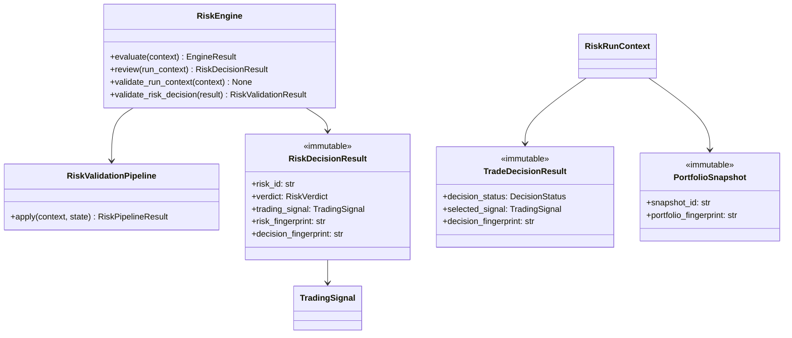

# Risk Engine — Software Engineering Specification

| Field | Value |
|---|---|
| **Module** | `risk/risk_engine.py` |
| **Document version** | 1.0.0 |
| **Status** | Draft — ready for implementation |
| **Owner** | THETA AI TRADER Core Platform |
| **Last updated** | 2026-08-03 |

---

## 1. Purpose

`risk/risk_engine.py` defines the **institutional risk enforcement engine** for THETA AI TRADER v1.0.

The engine consumes an immutable `TradeDecisionResult` produced by the Trade Decision Engine together with an orchestrator-supplied `PortfolioSnapshot` and produces a **single authoritative risk verdict** expressed as `RiskDecisionResult` with verdict `APPROVED` or `REJECTED`. It applies capital validation, margin heuristics, exposure limits, portfolio constraints, daily loss limits, drawdown limits, user risk profile rules, position sizing hint validation, strategy restrictions, underlying allowlists, and trading window gates — but **never** places orders, computes lot quantities, manages open positions, or communicates with brokers.

The engine answers: *"Given this trade decision, portfolio state snapshot, user risk profile, and configured limits, is this trade candidate authorized to proceed to execution planning?"*

It is **not** a trade selector. It is **not** an execution layer. It is the **capital-protection gate** between trade decision and execution intelligence.

### Pipeline placement

```text
[Market Data Engine]
    → MarketSnapshot (immutable)
              ↓
[Strategy Registry]
    → RegistrySnapshot
              ↓
[strategy/strategy_evaluation_engine.py]
    evaluate enabled plugins
    rank StrategyEvaluationReport instances
              ↓
    StrategyEvaluationBundle (immutable)
              ↓
[decision/trade_decision_engine.py]
    filter reports by policy + preferences
    validate trading window + capital hints
    select strategy (autonomous or manual)
              ↓
    TradeDecisionResult (immutable)
    primary payload: selected TradingSignal | abstain signal
              ↓
[risk/risk_engine.py]                    ← THIS MODULE
    validate capital, margin (heuristic), exposure
    enforce portfolio, daily loss, drawdown limits
    validate position sizing hints
    apply strategy restrictions + user risk profile
              ↓
    RiskDecisionResult (immutable)
    verdict: APPROVED | REJECTED | SKIPPED
              ↓
[Execution Intelligence / Execution Engine]
    order planning, strike refinement, broker routing
              ↓
[Broker Execution]
```

### Goals

1. Provide a **dedicated risk enforcement layer** between trade decision and execution — separate from strategy evaluation, separate from position sizing computation, separate from broker APIs.
2. Consume **immutable upstream decision artifacts** (`TradeDecisionResult`, `StrategyEvaluationReport`, `TradingSignal`) without re-running strategy plugins.
3. Enforce **multi-stage deterministic risk validation** with ordered pipeline stages and stable rule identifiers.
4. Validate **orchestrator-supplied portfolio state** (`PortfolioSnapshot`) — not live broker position APIs in v1.
5. Perform **heuristic margin validation** using signal metadata and evaluation estimates — never broker margin API calls in v1.
6. Enforce **capital, exposure, portfolio, daily loss, and drawdown limits** authoritatively for pipeline progression.
7. Validate **position sizing hints** supplied by orchestrator — never compute lot counts or order quantities.
8. Apply **user risk profile** constraints including kill switch, strategy restrictions, and allowed underlyings.
9. Enforce **allowed trading windows** for risk-specific blackout rules beyond decision-engine session gates.
10. Produce **deterministic APPROVED/REJECTED/SKIPPED verdicts** with documented tie-breakers and fail-closed semantics.
11. Provide **full explainability** via `RiskReason`, `RiskFactor`, and structured rejection templates.
12. Integrate cleanly with `BaseEngine`, `EngineContext`, `EngineResult`, `TradeDecisionResult`, and `TradingSignal` without broker dependencies.
13. Remain **thread-safe** for concurrent risk reviews on independent contexts.
14. Support **kill switch** and emergency halt via injected config state.
15. **Reject or skip abstain signals** from trade decision without raising unhandled errors.

### Success criteria

- Orchestrator invokes `RiskEngine.evaluate(context)` with `RiskRunContext` and receives immutable `RiskDecisionResult`.
- `APPROVED` emitted **only** when `decision_status=SELECTED`, `outcome_class=TRADE_CANDIDATE`, and all risk checks pass.
- Abstain, window-closed, and non-trade-candidate decisions produce `SKIPPED` or `REJECTED` with clear codes — no unhandled exceptions.
- Identical inputs (decision fingerprint, portfolio snapshot fingerprint, config, reference time) produce semantically equal verdicts and identical `risk_fingerprint`.
- Execution Engine consumes `RiskDecisionResult` without importing strategy plugins or broker SDKs.
- No module under `risk/risk_engine.py` imports broker clients, execution APIs, or legacy `risk_management_engine.py`.
- Position sizing hints validated but never computed by this module.
- Kill switch active → immediate `REJECTED` with `RISK.KILL_SWITCH.ACTIVE`.

### Relationship to other modules

| Module | Relationship |
|---|---|
| `decision/trade_decision_engine.py` | **Primary upstream input.** Engine consumes `TradeDecisionResult`. |
| `strategy/strategy_evaluation_engine.py` | **Indirect upstream.** Reads `StrategyEvaluationReport` embedded in decision result. |
| `strategy/signals.py` | **Signal contract.** Validates and reads `TradingSignal`, `SignalRiskMetadata`. |
| `core/base_engine.py` | **Foundation.** `RiskEngine` extends `BaseEngine`. |
| `core/engine_context.py` | **Input wrapper.** Orchestrator passes `RiskRunContext` via `EngineContext`. |
| `core/engine_result.py` | **Output wrapper.** Risk result returned inside `EngineResult.payload`. |
| `docs/specifications/trade_decision_engine.md` | **Upstream contract.** §19 Risk Engine Interface; Appendix B handoff. |
| `docs/specifications/trading_signal.md` | **Signal contract.** `SignalRiskMetadata` is informational input only. |
| `docs/specifications/strategy_evaluation_engine.md` | **Estimate contract.** `ExpectedRiskEstimate`, `CapitalEstimate` are hints. |
| Execution Engine (future) | **Primary downstream consumer.** Reads `RiskDecisionResult` after approval. |
| Position Sizing Engine (future) | **Sibling downstream.** May run before or after risk per orchestrator; risk validates hints only. |
| Legacy root `risk_management_engine.py` | **Not a dependency.** Concepts migrated; no import. |

### Distinction from Trade Decision Engine

| Concern | Trade Decision Engine | Risk Engine |
|---|---|---|
| Primary output | Selected **strategy signal** or abstain | **Risk verdict** APPROVED/REJECTED/SKIPPED |
| Strategy selection | **In scope** — chooses among reports | **Out of scope** — consumes selected report |
| User preferences | **In scope** — family allowlists, manual mode | **Out of scope** — uses `UserRiskProfile` instead |
| Capital enforcement | Informational pre-check only | **Authoritative** capital and limit enforcement |
| Margin | Not computed | Heuristic validation (no broker API) |
| Portfolio state | Not consumed | **In scope** — `PortfolioSnapshot` |
| Position sizing | Not computed | Validates hints only |
| Trading window | Session/blackout for decision | Risk-specific windows + re-validation |
| Abstain handling | Produces abstain signal | Skips/rejects without error |

Both modules coexist in sequence: Trade Decision Engine selects a candidate; Risk Engine authorizes or blocks capital deployment.

---

## 2. Responsibilities

`risk/risk_engine.py` **is responsible for**:

| # | Responsibility | Description |
|---|---|---|
| R1 | **Trade decision consumption** | Accept immutable `TradeDecisionResult` as primary input. |
| R2 | **Portfolio snapshot consumption** | Accept immutable orchestrator-supplied `PortfolioSnapshot`. |
| R3 | **Decision eligibility gating** | Verify `decision_status=SELECTED` and `outcome_class=TRADE_CANDIDATE` before full review. |
| R4 | **Abstain signal handling** | Skip or reject abstain/non-trade decisions without unhandled errors. |
| R5 | **Kill switch enforcement** | Reject all trade candidates when kill switch active in config. |
| R6 | **Capital validation** | Enforce available capital, allocation caps, and per-trade capital budget. |
| R7 | **Margin validation (heuristic)** | Informational/heuristic margin demand check — no broker API in v1. |
| R8 | **Exposure validation** | Enforce per-underlying, per-strategy-family, and gross exposure limits. |
| R9 | **Portfolio limits** | Enforce max open positions, concentration limits, correlated exposure caps. |
| R10 | **Daily loss limits** | Block new trades when daily realized+unrealized loss exceeds threshold. |
| R11 | **Drawdown limits** | Block new trades when account drawdown from peak exceeds threshold. |
| R12 | **User risk profile enforcement** | Apply profile-specific limits, multipliers, and restrictions. |
| R13 | **Position sizing hint validation** | Validate orchestrator `PositionSizingHint` against risk budget — no lot computation. |
| R14 | **Strategy restrictions** | Enforce blocked strategies, blocked families, undefined-risk policy. |
| R15 | **Allowed underlyings** | Enforce underlying allowlist/blocklist from risk profile. |
| R16 | **Allowed trading windows** | Enforce risk-specific trading windows and expiry-day rules. |
| R17 | **Multi-stage risk pipeline** | Apply ordered validation stages with audit trail. |
| R18 | **Deterministic evaluation** | Pure evaluation algorithm; identical inputs → identical verdict. |
| R19 | **Approval logic** | Emit `APPROVED` only when all stages pass. |
| R20 | **Rejection logic** | Emit `REJECTED` with primary rejection code and stage attribution. |
| R21 | **Skip logic** | Emit `SKIPPED` for non-reviewable decision outcomes. |
| R22 | **Risk explanation** | Produce `RiskReason` bullets and `RiskFactor` audit trail. |
| R23 | **RiskDecisionResult assembly** | Immutable result wrapping verdict, signal reference, validation stats. |
| R24 | **Input validation** | Validate `RiskRunContext`, decision integrity, portfolio consistency. |
| R25 | **Output validation** | Validate sealed `RiskDecisionResult` before return. |
| R26 | **EngineResult integration** | Return `EngineResult` with structured status, errors, warnings, payload. |
| R27 | **Error taxonomy** | Stable codes under `RISK.*`. |
| R28 | **Risk fingerprint** | Compute deterministic `risk_fingerprint` for replay verification. |
| R29 | **Serialization** | JSON round-trip for `RiskDecisionResult` schema version 1.0.0. |
| R30 | **Logging conventions** | Standard log events for review start, stage results, approve/reject/skip. |
| R31 | **Thread-safe execution** | Safe concurrent `evaluate()` on independent contexts. |
| R32 | **Stage audit trail** | Record per-stage pass/fail counts and rejection reasons. |
| R33 | **Signal freshness re-check** | Reject expired signals at reference time. |
| R34 | **Documentation contract** | Google-style docstrings on all public types and methods. |
| R35 | **Downstream contract documentation** | Document logical Execution Engine handoff without importing execution types. |
| R36 | **Consecutive loss protection** | Block new trades when consecutive loss count exceeds profile limit. |
| R37 | **Expiry-day risk reduction** | Apply stricter limits on option expiry days per config. |
| R38 | **Mode-aware policy** | Different strictness for LIVE vs ANALYSIS vs BACKTEST execution modes. |

---

## 3. Non-Responsibilities

`risk/risk_engine.py` **must not**:

| # | Non-responsibility | Rationale |
|---|---|---|
| NR1 | **Place, modify, or cancel orders** | Execution belongs in execution intelligence and broker layers. |
| NR2 | **Compute lot quantities or order sizes** | Position Sizing Engine responsibility. |
| NR3 | **Manage open positions or APME logic** | Adaptive Position Management Engine is separate. |
| NR4 | **Fetch live broker positions or account balance** | Input is orchestrator-supplied `PortfolioSnapshot`. |
| NR5 | **Import broker SDKs or broker clients** | No Zerodha, Kite, or vendor-specific types. |
| NR6 | **Call broker margin APIs** | v1 uses heuristic margin validation only. |
| NR7 | **Run strategy plugins or invoke `BaseStrategy.run()`** | Strategy Evaluation Engine responsibility. |
| NR8 | **Select among strategy candidates** | Trade Decision Engine responsibility. |
| NR9 | **Mutate `TradeDecisionResult`, `TradingSignal`, or `PortfolioSnapshot`** | All inputs read-only. |
| NR10 | **Re-score or re-rank evaluation reports** | Consumes upstream metrics; may compare but not recompute ranking. |
| NR11 | **Override Trade Decision Engine abstain** | Cannot approve when decision says abstain. |
| NR12 | **Persist risk decisions to disk or database** | External persistence concern. |
| NR13 | **Load environment variables or config files** | Accept injected `RiskEngineConfig` at construction. |
| NR14 | **Call other analytical engines directly** | Orchestrator assembles inputs; no peer engine imports. |
| NR15 | **Import Execution Engine types or modules** | Logical handoff contract only. |
| NR16 | **Import legacy `risk_management_engine.py`** | Institutional module is independent rewrite. |
| NR17 | **Compute exact broker P&L or settlement** | Requires broker APIs; out of scope. |
| NR18 | **Perform strike selection or leg construction** | Execution intelligence responsibility. |
| NR19 | **Implement UI or dashboard rendering** | Consumers read `EngineResult` or subscribe to events. |
| NR20 | **Modify registry or register strategies** | Registry module responsibility. |
| NR21 | **Force approval when limits exceeded** | Fail closed — prefer REJECTED over forced APPROVED. |
| NR22 | **Apply REDUCE verdict in v1** | v1 supports APPROVED/REJECTED/SKIPPED only; REDUCE deferred to v1.1. |
| NR23 | **Subscribe to market data feeds** | Snapshot references only via decision context tags. |
| NR24 | **Perform Monte Carlo or VaR simulation** | Out of scope for v1 heuristic model. |
| NR25 | **Communicate with ConfigManager directly** | Config injected at construction; no dashboard coupling. |
| NR26 | **Validate user trade preferences from decision engine** | Decision preferences already applied upstream. |
| NR27 | **Aggregate conflicting signals** | Single decision input only. |

---

## 4. Architecture

### 4.1 Layered design

```text
┌─────────────────────────────────────────────────────────────────────────┐
│                        risk/risk_engine.py                               │
│  (authoritative risk gate — no broker, no execution, no sizing compute) │
│                                                                          │
│  ┌────────────────────┐  ┌────────────────────┐  ┌──────────────────┐  │
│  │ RiskEngine         │  │ RiskValidation     │  │ RiskVerdict      │  │
│  │ (extends BaseEngine│→ │ Pipeline           │→ │ Builder          │  │
│  │                    │  │ (ordered stages)   │  │ (approve/reject) │  │
│  └─────────┬──────────┘  └─────────┬──────────┘  └────────┬─────────┘  │
│            │                       │                        │            │
│  ┌─────────▼───────────────────────▼────────────────────────▼─────────┐  │
│  │ Validators · CapitalChecker · MarginHeuristic · ExposureChecker     │  │
│  │ PortfolioLimiter · LossLimitChecker · ProfileEnforcer               │  │
│  │ SizingHintValidator · StrategyRestrictionChecker · WindowValidator  │  │
│  │ ExplanationBuilder · ResultSealer                                   │  │
│  └────────────────────────────────────────────────────────────────────┘  │
└──────────────────────────────┬──────────────────────────────────────────┘
                               │
         TradeDecisionResult + PortfolioSnapshot + UserRiskProfile + PositionSizingHint
                               │
                               ▼
              RiskDecisionResult (immutable, APPROVED | REJECTED | SKIPPED)
                               │
                               ▼
                    Execution Engine (future)
```

### 4.2 Design principles

- **Single responsibility** — authorize or block trade candidate for capital deployment; nothing else.
- **Immutable I/O** — all inputs and outputs are frozen dataclasses.
- **Deterministic evaluation** — identical inputs produce identical verdict and fingerprint.
- **Fail closed** — prefer REJECTED over APPROVED when ambiguity or limit breach exists.
- **Heuristic margin in v1** — margin validation uses metadata and estimates; broker APIs deferred.
- **Orchestrator-supplied portfolio** — no live broker position fetch in v1.
- **Explainability first** — every verdict (including SKIPPED) has reasons and factors.
- **Thread-safe service** — engine instance safe for concurrent reviews on independent contexts.
- **No hidden globals** — config and policies injected at construction.
- **Audit-grade fingerprints** — risk fingerprint covers decision fingerprint, portfolio fingerprint, config hash, verdict.
- **Kill switch supremacy** — kill switch overrides all other approval paths.
- **No lot computation** — position sizing hints validated, never derived.

### 4.3 Component responsibilities

| Component | Role |
|---|---|
| `RiskEngine` | Public `BaseEngine` implementation; orchestrates full risk review run. |
| `RiskEngineConfig` | Frozen policy: limits, thresholds, kill switch, mode behavior. |
| `RiskRunContext` | Immutable per-run inputs: decision result, portfolio, profile, sizing hint. |
| `RiskValidationPipeline` | Ordered multi-stage validator applying pass/fail rules. |
| `DecisionEligibilityGate` | Short-circuit SKIPPED/REJECTED for non-reviewable decisions. |
| `KillSwitchGate` | Immediate rejection when kill switch active. |
| `CapitalValidator` | Available capital, allocation caps, per-trade budget enforcement. |
| `MarginHeuristicValidator` | Heuristic margin demand vs available margin hint. |
| `ExposureValidator` | Underlying, family, gross exposure limit checks. |
| `PortfolioLimitValidator` | Open positions, concentration, correlation caps. |
| `DailyLossLimitValidator` | Daily P&L loss threshold enforcement. |
| `DrawdownLimitValidator` | Peak-to-trough drawdown enforcement. |
| `UserRiskProfileEnforcer` | Profile-specific limits and multipliers. |
| `PositionSizingHintValidator` | Validates orchestrator sizing hint against risk budget. |
| `StrategyRestrictionValidator` | Blocked strategies, families, undefined-risk policy. |
| `UnderlyingAllowlistValidator` | Allowed/blocked underlyings enforcement. |
| `RiskTradingWindowValidator` | Risk-specific session and expiry-day windows. |
| `RiskExplanationBuilder` | Assembles reasons, factors, stage audit trail. |
| `RiskDecisionResult` | Immutable risk outcome with verdict and metadata. |
| `RiskValidator` | Validates run inputs and sealed results. |

### 4.4 Dependency direction

```text
orchestrator                    →  risk/risk_engine.py
Execution Engine (future)       →  risk/risk_engine.py (reads result types)
risk/risk_engine.py             →  decision/trade_decision_engine.py (decision types)
risk/risk_engine.py             →  strategy/strategy_evaluation_engine.py (report types)
risk/risk_engine.py             →  strategy/signals.py
risk/risk_engine.py             →  core/base_engine.py
risk/risk_engine.py             →  stdlib
```

**Forbidden imports:** broker clients, execution modules, legacy `risk_management_engine.py`, `strategy/registry.py`, `BaseStrategy` plugins, live ConfigManager.

### 4.5 Relationship diagram



---

## 5. Data Model

All public outward-facing types are **immutable dataclasses** (`frozen=True`) unless noted.

### 5.1 Type hierarchy

```text
RiskEngine (mutable service, extends BaseEngine)
├── config: RiskEngineConfig
├── pipeline: RiskValidationPipeline (stateless)
└── validators: injected policy objects (immutable)

RiskRunContext (immutable)
PortfolioSnapshot (immutable)
PortfolioPosition (immutable)
PortfolioExposureSummary (immutable)
UserRiskProfile (immutable)
PositionSizingHint (immutable)
RiskDecisionResult (immutable)
RiskPipelineResult (immutable)
RiskStageResult (immutable)
RiskConfidence (immutable)
RiskFactor (immutable)
RiskReason (immutable)
RiskWarningRecord (immutable)
RiskErrorRecord (immutable)
RiskEngineConfig (immutable)
CapitalPolicy (immutable)
MarginPolicy (immutable)
ExposurePolicy (immutable)
PortfolioLimitPolicy (immutable)
LossLimitPolicy (immutable)
DrawdownPolicy (immutable)
StrategyRestrictionPolicy (immutable)
RiskTradingWindowPolicy (immutable)
RiskValidationResult (immutable)
```

### 5.2 Enumerations

#### `RiskVerdict`

| Value | Description |
|---|---|
| `APPROVED` | All risk checks passed; trade candidate authorized for execution planning. |
| `REJECTED` | One or more risk checks failed; trade candidate blocked. |
| `SKIPPED` | Decision not subject to full risk review (abstain, non-candidate, orchestrator skip). |

#### `RiskStageId`

| Value | Description |
|---|---|
| `DECISION_ELIGIBILITY` | Verify decision is reviewable trade candidate. |
| `KILL_SWITCH` | Emergency halt check. |
| `INPUT_INTEGRITY` | Context and fingerprint integrity. |
| `SIGNAL_FRESHNESS` | Signal not expired at reference time. |
| `CAPITAL` | Available capital and allocation limits. |
| `MARGIN_HEURISTIC` | Heuristic margin demand validation. |
| `EXPOSURE` | Underlying and family exposure limits. |
| `PORTFOLIO_LIMITS` | Open positions and concentration. |
| `DAILY_LOSS` | Daily loss limit enforcement. |
| `DRAWDOWN` | Account drawdown limit enforcement. |
| `USER_RISK_PROFILE` | Profile-specific rules and multipliers. |
| `POSITION_SIZING_HINT` | Orchestrator sizing hint validation. |
| `STRATEGY_RESTRICTIONS` | Blocked strategies and families. |
| `ALLOWED_UNDERLYINGS` | Underlying allowlist/blocklist. |
| `TRADING_WINDOW` | Risk-specific trading windows. |
| `CONSECUTIVE_LOSSES` | Consecutive loss streak protection. |
| `EXPIRY_DAY` | Expiry-day stricter limits. |

#### `RiskRejectionSeverity`

| Value | Description |
|---|---|
| `HARD` | Absolute block — cannot override without config change. |
| `POLICY` | Policy violation — may be configurable. |
| `INFORMATIONAL` | Recorded but does not alone cause rejection (v1 unused for pass-with-warning on limits). |

#### `RiskProfileTier`

| Value | Description |
|---|---|
| `CONSERVATIVE` | Strictest default limits. |
| `MODERATE` | Balanced institutional defaults. |
| `AGGRESSIVE` | Relaxed limits within hard safety floors. |
| `CUSTOM` | User-defined profile with explicit limit overrides. |

#### `MarginValidationOutcome`

| Value | Description |
|---|---|
| `SUFFICIENT` | Heuristic margin demand within available hint. |
| `INSUFFICIENT` | Heuristic margin demand exceeds available hint. |
| `UNKNOWN` | Insufficient data for heuristic — configurable pass/fail. |

#### `SizingHintValidationOutcome`

| Value | Description |
|---|---|
| `WITHIN_BUDGET` | Hint within per-trade and portfolio risk budget. |
| `EXCEEDS_BUDGET` | Hint exceeds allocated risk budget. |
| `MISSING_HINT` | No hint provided when required by policy. |
| `INVALID_HINT` | Hint failed structural validation. |

#### `SkipReasonCode`

| Value | Description |
|---|---|
| `DECISION_ABSTAIN` | Trade decision abstained. |
| `DECISION_NOT_SELECTED` | Decision status not SELECTED. |
| `NOT_TRADE_CANDIDATE` | Outcome class not TRADE_CANDIDATE. |
| `ORCHESTRATOR_SKIP` | Orchestrator explicitly skipped risk review. |
| `ANALYSIS_MODE_SKIP` | Risk review skipped in ANALYSIS mode per config. |
| `WINDOW_CLOSED_DECISION` | Decision already window-closed. |
| `MANUAL_INVALID_DECISION` | Decision manual-invalid. |

### 5.3 `RiskRunContext` fields

| Field | Type | Required | Description |
|---|---|---|---|
| `correlation_id` | `str` | Yes | Pipeline correlation identifier; must match decision. |
| `as_of` | timezone-aware datetime | Yes | Risk review timestamp. |
| `trade_decision` | `TradeDecisionResult` | Yes | Upstream trade decision result. |
| `portfolio` | `PortfolioSnapshot` | Yes | Orchestrator-supplied portfolio state. |
| `user_risk_profile` | `UserRiskProfile` | Yes | User risk profile and limits. |
| `position_sizing_hint` | `PositionSizingHint | None` | No | Orchestrator sizing hint; required when policy mandates. |
| `execution_mode` | `StrategyExecutionMode` | No | Default from decision.execution_mode. |
| `reference_time` | timezone-aware datetime | No | Wall-clock for freshness/windows; defaults to `as_of`. |
| `force_skip` | `bool` | No | Orchestrator hard skip flag; default `False`. |
| `available_capital` | `float | None` | No | Authoritative available capital for this review (orchestrator-supplied). |
| `available_margin_hint` | `float | None` | No | Heuristic available margin pool — not broker API. |
| `tags` | immutable mapping | No | Orchestrator hints (regime label, session tag, expiry flag). |

### 5.4 `PortfolioSnapshot` fields

| Field | Type | Required | Description |
|---|---|---|---|
| `snapshot_id` | `str` | Yes | Deterministic portfolio snapshot identifier. |
| `correlation_id` | `str` | Yes | Pipeline correlation identifier. |
| `as_of` | timezone-aware datetime | Yes | Snapshot observation timestamp. |
| `account_id` | `str` | Yes | Logical account identifier (not broker credential). |
| `equity` | `float` | Yes | Total account equity in base currency (INR). |
| `cash_available` | `float` | Yes | Available cash for allocation. |
| `margin_used_hint` | `float` | No | Heuristic margin already utilized. |
| `margin_available_hint` | `float | None` | No | Heuristic margin available — orchestrator supplied. |
| `daily_realized_pnl` | `float` | Yes | Realized P&L for current session/day. |
| `daily_unrealized_pnl` | `float` | Yes | Unrealized P&L for current session/day. |
| `peak_equity` | `float` | Yes | High-water mark equity for drawdown calculation. |
| `consecutive_losses` | `int` | Yes | Current consecutive losing trade count. |
| `open_positions` | `tuple[PortfolioPosition, ...]` | Yes | Open position records (may be empty). |
| `exposure_summary` | `PortfolioExposureSummary` | Yes | Pre-aggregated exposure by underlying/family. |
| `portfolio_fingerprint` | `str` | Yes | Deterministic content hash. |
| `metadata` | immutable mapping | No | Extension labels. |

### 5.5 `PortfolioPosition` fields

| Field | Type | Required | Description |
|---|---|---|---|
| `position_id` | `str` | Yes | Stable position identifier. |
| `underlying` | `str` | Yes | Underlying symbol, e.g. `"NIFTY"`, `"BANKNIFTY"`. |
| `strategy_id` | `str | None` | No | Originating strategy if known. |
| `strategy_family` | `StrategyFamily | None` | No | Position strategy family. |
| `direction` | `SignalDirection | None` | No | Net directional bias. |
| `notional_exposure` | `float` | Yes | Absolute notional exposure in INR. |
| `margin_at_risk_hint` | `float | None` | No | Heuristic margin at risk for this position. |
| `unrealized_pnl` | `float` | Yes | Current unrealized P&L. |
| `opened_at` | timezone-aware datetime | Yes | Position open timestamp. |
| `expires_at` | timezone-aware datetime | None | No | Option expiry if applicable. |
| `metadata` | immutable mapping | No | Extension labels. |

### 5.6 `PortfolioExposureSummary` fields

| Field | Type | Required | Description |
|---|---|---|---|
| `gross_notional` | `float` | Yes | Sum of absolute notionals across positions. |
| `net_notional_by_underlying` | immutable mapping | Yes | Net signed notional per underlying. |
| `gross_notional_by_underlying` | immutable mapping | Yes | Gross notional per underlying. |
| `exposure_by_family` | immutable mapping | Yes | Gross exposure keyed by `StrategyFamily` value. |
| `open_position_count` | `int` | Yes | Count of open positions. |
| `open_position_count_by_underlying` | immutable mapping | Yes | Position count per underlying. |

### 5.7 `UserRiskProfile` fields

| Field | Type | Required | Description |
|---|---|---|---|
| `profile_id` | `str` | Yes | Stable profile identifier. |
| `profile_tier` | `RiskProfileTier` | Yes | CONSERVATIVE, MODERATE, AGGRESSIVE, CUSTOM. |
| `max_risk_per_trade_pct` | `float` | Yes | Maximum equity % risk per trade (e.g. 1.0). |
| `max_daily_loss_pct` | `float` | Yes | Maximum daily loss as % of equity (e.g. 3.0). |
| `max_drawdown_pct` | `float` | Yes | Maximum drawdown from peak as % (e.g. 10.0). |
| `max_open_positions` | `int` | Yes | Maximum simultaneous open positions. |
| `max_consecutive_losses` | `int` | Yes | Block new trades after N consecutive losses. |
| `allowed_families` | `frozenset[StrategyFamily] | None` | No | `None` = all allowed subject to blocklist. |
| `blocked_strategy_ids` | `frozenset[str]` | No | Explicit strategy blocklist. |
| `blocked_families` | `frozenset[StrategyFamily]` | No | Explicit family blocklist. |
| `allowed_underlyings` | `frozenset[str] | None` | No | `None` = all underlyings allowed. |
| `blocked_underlyings` | `frozenset[str]` | No | Explicit underlying blocklist. |
| `allow_undefined_risk` | `bool` | No | Default `False` — reject undefined-risk structures. |
| `max_gross_exposure_pct` | `float | None` | No | Max gross notional as % of equity. |
| `max_underlying_exposure_pct` | `float | None` | No | Max per-underlying gross exposure as % of equity. |
| `max_family_exposure_pct` | `float | None` | No | Max per-family exposure as % of equity. |
| `expiry_day_multiplier` | `float` | No | Risk budget multiplier on expiry days (default 0.5). |
| `caution_multiplier` | `float` | No | Multiplier when caution tag present (default 0.5). |
| `metadata` | immutable mapping | No | Extension labels. |

### 5.8 `PositionSizingHint` fields

| Field | Type | Required | Description |
|---|---|---|---|
| `hint_id` | `str` | Yes | Deterministic hint identifier. |
| `proposed_risk_amount` | `float` | Yes | Proposed capital at risk in INR (orchestrator/ sizing engine supplied). |
| `proposed_risk_pct` | `float` | Yes | Proposed risk as % of equity. |
| `proposed_notional` | `float | None` | No | Proposed absolute notional if known. |
| `proposed_margin_hint` | `float | None` | No | Proposed heuristic margin requirement. |
| `proposed_units_hint` | `float | None` | No | Informational units/lots hint — **not validated for exactness**, presence only. |
| `sizing_method` | `str` | Yes | Method identifier, e.g. `"orchestrator_v1"`, `"position_sizing_engine_v1"`. |
| `within_decision_capital_hint` | `bool | None` | No | Whether upstream sizing believes within decision capital hint. |
| `metadata` | immutable mapping | No | Extension labels. |

**Important:** Risk Engine validates `proposed_risk_amount` and `proposed_risk_pct` against budget — it does **not** compute or override lot counts.

### 5.9 `RiskDecisionResult` fields

| Field | Type | Required | Description |
|---|---|---|---|
| `risk_id` | `str` | Yes | Deterministic risk review identifier. |
| `correlation_id` | `str` | Yes | Pipeline correlation identifier. |
| `decision_id` | `str` | Yes | Source trade decision ID. |
| `decision_fingerprint` | `str` | Yes | Source decision fingerprint for replay. |
| `portfolio_snapshot_id` | `str` | Yes | Source portfolio snapshot ID. |
| `portfolio_fingerprint` | `str` | Yes | Source portfolio fingerprint. |
| `verdict` | `RiskVerdict` | Yes | APPROVED, REJECTED, or SKIPPED. |
| `primary_rejection_code` | `str | None` | No | Primary `RISK.*` code when REJECTED. |
| `skip_reason_code` | `SkipReasonCode | None` | No | Set when verdict is SKIPPED. |
| `trading_signal` | `TradingSignal` | Yes | Signal under review (from decision). |
| `evaluation_report` | `StrategyEvaluationReport | None` | No | Source report from decision when available. |
| `execution_mode` | `StrategyExecutionMode` | Yes | LIVE, ANALYSIS, or BACKTEST. |
| `approved_risk_budget` | `float | None` | No | Approved risk amount in INR when APPROVED. |
| `approved_risk_pct` | `float | None` | No | Approved risk % when APPROVED. |
| `reasons` | `tuple[RiskReason, ...]` | Yes | Human-readable explainability bullets. |
| `factors` | `tuple[RiskFactor, ...]` | Yes | Machine-readable risk factors. |
| `pipeline_summary` | `RiskPipelineResult` | Yes | Per-stage pipeline audit trail. |
| `reviewed_at` | timezone-aware datetime | Yes | Risk review seal timestamp. |
| `duration_ms` | `float` | Yes | Review computation duration. |
| `risk_fingerprint` | `str` | Yes | Deterministic content hash. |
| `warnings` | `tuple[RiskWarningRecord, ...]` | Yes | Non-fatal warnings. |
| `errors` | `tuple[RiskErrorRecord, ...]` | Yes | Errors when review failed validation. |
| `metadata` | immutable mapping | No | Extension labels. |

### 5.10 `RiskFactor` fields

| Field | Type | Required | Description |
|---|---|---|---|
| `factor_id` | `str` | Yes | Stable identifier, e.g. `"daily_loss_utilization"`. |
| `label` | `str` | Yes | Human-readable label. |
| `weight` | `float` | Yes | Weight in composite when applicable. |
| `raw_value` | `float` | Yes | Unnormalized input value. |
| `normalized_value` | `float` | Yes | Normalized contribution or utilization ratio. |
| `direction` | `str` | Yes | `"POSITIVE"`, `"NEGATIVE"`, or `"NEUTRAL"`. |
| `stage_id` | `RiskStageId | None` | No | Related pipeline stage. |
| `limit_value` | `float | None` | No | Configured limit for comparison. |
| `notes` | `str | None` | No | Optional detail. |

### 5.11 `RiskReason` fields

| Field | Type | Required | Description |
|---|---|---|---|
| `code` | `str` | Yes | Stable reason code, e.g. `"RISK.APPROVE.ALL_CHECKS_PASSED"`. |
| `message` | `str` | Yes | Human-readable explanation. |
| `stage_id` | `RiskStageId | None` | No | Related stage when applicable. |
| `severity` | `str` | Yes | `"INFO"`, `"WARNING"`, or `"CRITICAL"`. |

### 5.12 `RiskPipelineResult` fields

| Field | Type | Description |
|---|---|---|
| `total_stages` | `int` | Stages executed (including short-circuit). |
| `passed_stages` | `int` | Stages that passed. |
| `failed_stage_id` | `RiskStageId | None` | First failing stage; `None` if all passed or skipped early. |
| `stages` | `tuple[RiskStageResult, ...]` | Ordered per-stage results. |
| `short_circuited` | `bool` | Whether pipeline stopped at first hard failure. |

### 5.13 `RiskStageResult` fields

| Field | Type | Description |
|---|---|---|
| `stage_id` | `RiskStageId` | Stage identifier. |
| `passed` | `bool` | Whether stage passed. |
| `rejection_code` | `str | None` | Rejection code if failed. |
| `message` | `str | None` | Stage summary message. |
| `duration_ms` | `float` | Stage duration. |
| `details` | immutable mapping | No | Stage-specific key-value details. |

### 5.14 Global invariants

1. `RiskDecisionResult.trading_signal` is **never null** — copied from decision result.
2. When `verdict=APPROVED`, `primary_rejection_code` and `skip_reason_code` are null.
3. When `verdict=REJECTED`, `primary_rejection_code` is non-null and `skip_reason_code` is null.
4. When `verdict=SKIPPED`, `skip_reason_code` is non-null.
5. `APPROVED` requires upstream `decision_status=SELECTED` and `outcome_class=TRADE_CANDIDATE`.
6. `risk_fingerprint` changes iff semantic risk review content changes.
7. Pipeline stages execute in fixed `RiskStageId` order — never reordered at runtime.
8. Engine never mutates input decision, portfolio, or signal during review.
9. `reasons` is non-empty for every sealed result including SKIPPED.
10. `trade_decision.correlation_id` must match `RiskRunContext.correlation_id` when strict correlation mode enabled.
11. Kill switch active → verdict is always `REJECTED`, never `APPROVED`.
12. Position sizing hint validation never modifies the hint — read-only comparison only.

---

## 6. Risk Review Lifecycle

### 6.1 Run lifecycle

```text
[Construction]
    → validate RiskEngineConfig
    → inject RiskValidationPipeline (stateless)

[evaluate(run_context) via BaseEngine.run]
    → validate RiskRunContext (validate_run_context)
    → check force_skip flag → short-circuit SKIPPED if set
    → DecisionEligibilityGate.evaluate(trade_decision)
    → if not eligible → seal SKIPPED RiskDecisionResult
    → RiskValidationPipeline.apply(run_context)
    → RiskVerdictBuilder.build(pipeline_result)
    → RiskExplanationBuilder.build(...)
    → seal RiskDecisionResult
    → validate_risk_decision(result)
    → wrap in EngineResult
    → log risk.review.complete

[Shutdown]
    → discard engine instance
```

### 6.2 Verdict state machine

```text
                    start review
                         │
                         ▼
              ┌─────────────────────┐
              │ force_skip?         │──yes──► SKIPPED (ORCHESTRATOR_SKIP)
              └──────────┬──────────┘
                         │ no
                         ▼
              ┌─────────────────────┐
              │ decision eligible?  │──no───► SKIPPED (abstain / not candidate)
              └──────────┬──────────┘
                         │ yes
                         ▼
              ┌─────────────────────┐
              │ kill switch active? │──yes──► REJECTED (KILL_SWITCH)
              └──────────┬──────────┘
                         │ no
                         ▼
              ┌─────────────────────┐
              │ pipeline stages     │
              │ (ordered)           │
              └──────────┬──────────┘
                         │
              ┌──────────┴──────────┐
              │                     │
           all pass              any fail
              │                     │
              ▼                     ▼
          APPROVED               REJECTED
```

### 6.3 Idempotency rules

| Operation | Idempotent when |
|---|---|
| `evaluate()` same context twice | Produces semantically equal result (timestamps may differ unless clock injected) |
| Pipeline stage validators | Pure functions of context + config |
| Heuristic margin computation | Pure function of signal + estimates + hints |
| Fingerprint computation | Pure function of canonical content |

### 6.4 ANALYSIS mode behavior

When `execution_mode=ANALYSIS`:

- Default: full pipeline executes; verdict computed normally for audit.
- When `RiskEngineConfig.skip_review_in_analysis=True`: short-circuit `SKIPPED` with `ANALYSIS_MODE_SKIP` unless `force_review_in_analysis=True` on context tags.
- Limits may use relaxed thresholds via `analysis_mode_limit_multiplier` (default 1.0 — no relaxation unless configured).

### 6.5 Clock injection

All timestamps timezone-aware. Engine accepts injected `clock: Callable[[], datetime]` for test determinism (default: UTC now).

---

## 7. Upstream Integration

### 7.1 TradeDecisionResult consumption

The engine **does not** re-run trade decision. It consumes the sealed `TradeDecisionResult` from Trade Decision Engine per `docs/specifications/trade_decision_engine.md` §19 and Appendix B.

#### Required fields read

| Field | Usage |
|---|---|
| `decision_status` | Eligibility gate — must be `SELECTED` for full review. |
| `outcome_class` | Must be `TRADE_CANDIDATE` for APPROVED path. |
| `selected_signal` | Primary trade intent for all validation stages. |
| `selected_report` | `expected_risk`, `capital_estimate` hints for heuristics. |
| `decision_fingerprint` | Audit correlation and integrity check. |
| `bundle_fingerprint` | Upstream evaluation replay reference. |
| `confidence.overall_score` | Optional profile multiplier input. |
| `execution_mode` | Mode-aware policy selection. |
| `warnings` | Non-fatal issues risk may surface in output. |
| `filter_summary` | Explainability context for approved trades. |

#### Fields NOT trusted as enforcement

| Field | Trust level |
|---|---|
| `selected_signal.risk` | Informational — risk engine re-evaluates |
| `selected_report.capital_estimate` | Informational hint only |
| `selected_report.expected_risk` | Informational hint only |
| `decision_status=SELECTED` | Triggers review — not approval |
| Decision engine capital pre-check pass | Does not imply risk approval |

### 7.2 Orchestrator branching rules (upstream)

| decision_status | outcome_class | Risk Engine action |
|---|---|---|
| `SELECTED` | `TRADE_CANDIDATE` | Full risk review pipeline |
| `SELECTED` | `MONITOR_ONLY` | SKIPPED — `NOT_TRADE_CANDIDATE` |
| `ABSTAIN` | any | SKIPPED — `DECISION_ABSTAIN` |
| `WINDOW_CLOSED` | any | SKIPPED — `WINDOW_CLOSED_DECISION` |
| `MANUAL_INVALID` | any | SKIPPED — `MANUAL_INVALID_DECISION` |
| `NO_CANDIDATES` | any | SKIPPED — `DECISION_ABSTAIN` |
| `REJECTED` | any | SKIPPED or REJECTED per config (`reject_invalid_decision_input=True` default SKIPPED) |

### 7.3 Abstain signal handling

When `decision_status=ABSTAIN`:

- Engine returns `verdict=SKIPPED`, `skip_reason_code=DECISION_ABSTAIN`.
- `EngineStatus.SUCCESS` — abstain is expected, not an error.
- No pipeline stages beyond eligibility execute.
- `reasons` includes informational message referencing `abstain_reason_code` from decision when present.
- **Must not** raise unhandled exception.

When `selected_signal.action` is `NO_TRADE` or `ABSTAIN` but `decision_status=SELECTED` (inconsistent — should not happen):

- Treat as SKIPPED with warning `RISK.DECISION.SIGNAL_ACTION_MISMATCH`.
- If `strict_decision_integrity=True`: REJECTED with `RISK.DECISION.INTEGRITY_FAILED`.

### 7.4 StrategyEvaluationReport usage

When `selected_report` is present:

```python
expected_risk: ExpectedRiskEstimate = selected_report.expected_risk
capital_estimate: CapitalEstimate = selected_report.capital_estimate
```

Used for:

- Margin heuristic intensity mapping from `capital_estimate.category` and `expected_risk.category`.
- Undefined-risk detection cross-check with `signal.risk.profile`.
- Explainability factors in approval/rejection reasons.

Never used as sole approval criterion — limits always enforced independently.

### 7.5 TradingSignal validation

Before pipeline stages, engine validates `selected_signal` via `validate_trading_signal` from `strategy/signals.py`:

- Reject review with `RISK.SIGNAL.INVALID` if validation fails in LIVE mode.
- WARN and continue in ANALYSIS when `allow_invalid_signal_in_analysis=True`.

---

## 8. Multi-Stage Risk Validation Pipeline

### 8.1 Stage ordering

Stages execute in **fixed order**. First hard failure short-circuits remaining stages when `short_circuit_on_failure=True` (default).

| Order | Stage ID | Rule prefix |
|---|---|---|
| 1 | `DECISION_ELIGIBILITY` | `RISK-ELIG-*` |
| 2 | `KILL_SWITCH` | `RISK-KILL-*` |
| 3 | `INPUT_INTEGRITY` | `RISK-IN-*` |
| 4 | `SIGNAL_FRESHNESS` | `RISK-FRESH-*` |
| 5 | `CAPITAL` | `RISK-CAP-*` |
| 6 | `MARGIN_HEURISTIC` | `RISK-MRG-*` |
| 7 | `EXPOSURE` | `RISK-EXP-*` |
| 8 | `PORTFOLIO_LIMITS` | `RISK-PORT-*` |
| 9 | `DAILY_LOSS` | `RISK-DAILY-*` |
| 10 | `DRAWDOWN` | `RISK-DD-*` |
| 11 | `CONSECUTIVE_LOSSES` | `RISK-CL-*` |
| 12 | `USER_RISK_PROFILE` | `RISK-PROF-*` |
| 13 | `POSITION_SIZING_HINT` | `RISK-SIZE-*` |
| 14 | `STRATEGY_RESTRICTIONS` | `RISK-STRAT-*` |
| 15 | `ALLOWED_UNDERLYINGS` | `RISK-UND-*` |
| 16 | `TRADING_WINDOW` | `RISK-WIN-*` |
| 17 | `EXPIRY_DAY` | `RISK-EXP-DAY-*` |

### 8.2 Pipeline pseudocode

```python
def apply(
    self,
    run_context: RiskRunContext,
    *,
    config: RiskEngineConfig,
) -> RiskPipelineResult:
    """Apply ordered risk validation stages."""
    stages: list[RiskStageResult] = []
    state = RiskPipelineState.initial(run_context)

    for stage_id in STAGE_ORDER:
        handler = self._handlers[stage_id]
        started = time.perf_counter()
        outcome = handler.evaluate(state, config)
        duration_ms = (time.perf_counter() - started) * 1000.0

        stage_result = RiskStageResult(
            stage_id=stage_id,
            passed=outcome.passed,
            rejection_code=outcome.rejection_code,
            message=outcome.message,
            duration_ms=duration_ms,
            details=outcome.details,
        )
        stages.append(stage_result)
        state = state.with_stage_outcome(stage_id, outcome)

        if not outcome.passed and config.short_circuit_on_failure:
            break

    passed_count = sum(1 for s in stages if s.passed)
    failed_stage = next((s.stage_id for s in stages if not s.passed), None)

    return RiskPipelineResult(
        total_stages=len(stages),
        passed_stages=passed_count,
        failed_stage_id=failed_stage,
        stages=tuple(stages),
        short_circuited=failed_stage is not None and config.short_circuit_on_failure,
    )
```

### 8.3 Stage rule catalog (summary)

| Rule ID | Stage | Condition | Result |
|---|---|---|---|
| RISK-ELIG-001 | ELIGIBILITY | `decision_status != SELECTED` | SKIP |
| RISK-ELIG-002 | ELIGIBILITY | `outcome_class != TRADE_CANDIDATE` | SKIP |
| RISK-ELIG-003 | ELIGIBILITY | Both pass | continue |
| RISK-KILL-001 | KILL_SWITCH | `config.kill_switch_active` | REJECT |
| RISK-IN-001 | INTEGRITY | correlation_id mismatch | REJECT |
| RISK-IN-002 | INTEGRITY | decision_fingerprint drift | REJECT |
| RISK-IN-003 | INTEGRITY | portfolio_fingerprint drift | REJECT |
| RISK-FRESH-001 | FRESHNESS | signal expired | REJECT |
| RISK-CAP-001 | CAPITAL | insufficient available_capital | REJECT |
| RISK-CAP-002 | CAPITAL | per-trade budget exceeded | REJECT |
| RISK-MRG-001 | MARGIN | heuristic insufficient | REJECT |
| RISK-EXP-001 | EXPOSURE | gross exposure exceeded | REJECT |
| RISK-EXP-002 | EXPOSURE | underlying exposure exceeded | REJECT |
| RISK-PORT-001 | PORTFOLIO | max open positions | REJECT |
| RISK-DAILY-001 | DAILY_LOSS | daily loss limit breached | REJECT |
| RISK-DD-001 | DRAWDOWN | drawdown limit breached | REJECT |
| RISK-CL-001 | CONSECUTIVE | consecutive losses exceeded | REJECT |
| RISK-SIZE-001 | SIZING | hint exceeds budget | REJECT |
| RISK-SIZE-002 | SIZING | missing required hint | REJECT |
| RISK-STRAT-001 | STRATEGY | blocked strategy | REJECT |
| RISK-STRAT-002 | STRATEGY | undefined risk disallowed | REJECT |
| RISK-UND-001 | UNDERLYING | underlying blocked | REJECT |
| RISK-WIN-001 | WINDOW | outside risk window | REJECT |
| RISK-EXP-DAY-001 | EXPIRY | expiry day limit exceeded | REJECT |

---

## 9. Capital Validation

### 9.1 Purpose

Capital validation enforces **authoritative** available capital and per-trade allocation limits using orchestrator-supplied `available_capital` and `PortfolioSnapshot.equity`. Unlike Trade Decision Engine capital pre-check, this stage **blocks** pipeline progression on failure.

### 9.2 Inputs

| Input | Source |
|---|---|
| `available_capital` | `RiskRunContext.available_capital` or `portfolio.cash_available` fallback |
| `equity` | `PortfolioSnapshot.equity` |
| `proposed_risk` | `PositionSizingHint.proposed_risk_amount` or heuristic from signal |
| `capital_estimate` | `selected_report.capital_estimate` (informational cross-check) |
| `max_risk_per_trade_pct` | `UserRiskProfile.max_risk_per_trade_pct` |
| Profile multipliers | expiry/caution tags |

### 9.3 Per-trade risk budget computation

```text
base_budget = equity * (max_risk_per_trade_pct / 100.0)

multiplier = 1.0
if tags.get("expiry_day") == "true":
    multiplier *= user_risk_profile.expiry_day_multiplier
if tags.get("market_caution") == "true":
    multiplier *= user_risk_profile.caution_multiplier
if config.kill_switch_active:
    multiplier = 0.0

approved_budget = base_budget * multiplier
```

### 9.4 Validation rules

| Rule ID | Rule |
|---|---|
| RISK-CAP-001 | `available_capital` must be ≥ `proposed_risk_amount` when sizing hint present. |
| RISK-CAP-002 | `proposed_risk_pct` must be ≤ `max_risk_per_trade_pct * multiplier`. |
| RISK-CAP-003 | When no sizing hint, estimated risk from heuristic must fit budget. |
| RISK-CAP-004 | `available_capital` must be > 0 in LIVE mode. |
| RISK-CAP-005 | Warn when utilization > 80% of budget (`RISK.CAPITAL.NEAR_LIMIT`). |
| RISK-CAP-006 | Reject when `CapitalEstimateCategory.VERY_LARGE` and strict_large_capital_reject=True. |

### 9.5 Heuristic risk estimate (when no sizing hint)

When `position_sizing_hint` is None and policy `require_sizing_hint_in_live=True`:

- REJECT with `RISK.SIZING.HINT_REQUIRED`.

When hint absent and not required:

```text
heuristic_risk = equity * (capital_estimate.allocation_percent_hint / 100.0)
  if allocation_percent_hint present
else equity * (expected_risk.normalized_score / 100.0) * (max_risk_per_trade_pct / 100.0)
```

### 9.6 Capital validation output factors

Record `RiskFactor` entries:

- `available_capital` — raw INR value
- `proposed_risk_amount` — from hint or heuristic
- `budget_utilization` — proposed / approved_budget ratio
- `capital_estimate_category` — informational ordinal mapping

---

## 10. Margin Validation (Heuristic, No Broker)

### 10.1 Purpose

Margin validation in v1 is **informational/heuristic**. It estimates margin demand from signal metadata, evaluation estimates, and sizing hints — then compares against orchestrator-supplied `available_margin_hint`. **No broker SDK or margin API calls.**

### 10.2 Inputs

| Input | Source |
|---|---|
| `signal.risk.margin_intensity` | `SignalRiskMetadata` |
| `capital_estimate.category` | `StrategyEvaluationReport` |
| `position_sizing_hint.proposed_margin_hint` | Orchestrator |
| `portfolio.margin_available_hint` | `PortfolioSnapshot` |
| `portfolio.margin_used_hint` | `PortfolioSnapshot` |

### 10.3 Heuristic margin demand model (v1)

```text
intensity_score = MARGIN_INTENSITY_MAP[margin_intensity]
  # LOW=0.25, MODERATE=0.50, HIGH=0.75, UNKNOWN=0.60

category_boost = CAPITAL_CATEGORY_MARGIN_BOOST[capital_estimate.category]
  # MINIMAL=0.1, SMALL=0.2, MODERATE=0.35, LARGE=0.55, VERY_LARGE=0.75

base_demand = equity * intensity_score * category_boost

if position_sizing_hint.proposed_margin_hint is not None:
    demand = max(base_demand, proposed_margin_hint)
else:
    demand = base_demand

available = available_margin_hint or portfolio.margin_available_hint or (equity * config.default_margin_availability_ratio)
```

### 10.4 Validation rules

| Rule ID | Rule |
|---|---|
| RISK-MRG-001 | Reject when `demand > available * (1 + margin_tolerance_pct)` in LIVE. |
| RISK-MRG-002 | When margin data unknown and `reject_unknown_margin=True`, reject with `RISK.MARGIN.UNKNOWN`. |
| RISK-MRG-003 | When unknown and `reject_unknown_margin=False`, warn and pass. |
| RISK-MRG-004 | Record margin demand and available as `RiskFactor` either way. |
| RISK-MRG-005 | Must not label heuristic as broker-verified in output messages. |

### 10.5 Relationship to broker margin

Document clearly in every `APPROVED` result when margin check was heuristic:

```text
reason: "Heuristic margin validation passed; broker margin not queried (v1 policy)."
```

Execution Engine may perform additional broker-specific checks — outside Risk Engine v1 scope.

---

## 11. Exposure Validation

### 11.1 Purpose

Exposure validation ensures proposed trade does not push **gross, net, or family-level exposure** beyond configured limits relative to account equity.

### 11.2 Exposure metrics

| Metric | Computation |
|---|---|
| `current_gross` | `portfolio.exposure_summary.gross_notional` |
| `proposed_increment` | `position_sizing_hint.proposed_notional` or heuristic from signal structure |
| `projected_gross` | `current_gross + proposed_increment` |
| `underlying_gross` | current underlying gross + proposed increment for signal underlying |
| `family_gross` | current family exposure + proposed increment for `strategy_family` |

### 11.3 Default limits (from UserRiskProfile)

| Limit | Default source |
|---|---|
| `max_gross_exposure_pct` | 200% of equity if unset (configurable default) |
| `max_underlying_exposure_pct` | 100% of equity if unset |
| `max_family_exposure_pct` | 150% of equity if unset |

### 11.4 Validation rules

| Rule ID | Rule |
|---|---|
| RISK-EXP-001 | `projected_gross / equity * 100 ≤ max_gross_exposure_pct`. |
| RISK-EXP-002 | Per-underlying gross exposure within `max_underlying_exposure_pct`. |
| RISK-EXP-003 | Per-family exposure within `max_family_exposure_pct`. |
| RISK-EXP-004 | Undefined-risk structures add `undefined_risk_exposure_multiplier` (default 1.25) to increment. |
| RISK-EXP-005 | Warn at 90% utilization (`RISK.EXPOSURE.NEAR_LIMIT`). |

### 11.5 Underlying resolution

Underlying symbol read from:

1. `TradingSignal.market.underlying` when present
2. `tags["underlying"]` on run context
3. Fail with `RISK.UNDERLYING.MISSING` if unresolved in LIVE mode

---

## 12. Portfolio Limits

### 12.1 Purpose

Portfolio limits enforce **position count**, **concentration**, and **correlation proxy** constraints on the post-trade portfolio state.

### 12.2 Open position limits

```text
current_count = portfolio.exposure_summary.open_position_count
projected_count = current_count + 1  # v1: each approved trade adds one logical position

reject if projected_count > user_risk_profile.max_open_positions
```

### 12.3 Per-underlying position count

Optional policy `max_positions_per_underlying` (default: 2):

```text
underlying_count = portfolio.exposure_summary.open_position_count_by_underlying.get(underlying, 0)
reject if underlying_count + 1 > max_positions_per_underlying
```

### 12.4 Concentration limit

When `max_single_underlying_concentration_pct` configured:

```text
concentration = underlying_gross / projected_gross
reject if concentration > limit
```

### 12.5 Validation rules

| Rule ID | Rule |
|---|---|
| RISK-PORT-001 | Max open positions not exceeded. |
| RISK-PORT-002 | Per-underlying position count within limit when policy set. |
| RISK-PORT-003 | Concentration within limit when policy set. |
| RISK-PORT-004 | Duplicate strategy_id open position warning when `warn_duplicate_strategy_position=True`. |

---

## 13. Daily Loss Limits

### 13.1 Purpose

Daily loss limits **block new trade authorization** when session/day cumulative loss exceeds configured percentage of equity.

### 13.2 Loss computation

```text
daily_pnl = portfolio.daily_realized_pnl + portfolio.daily_unrealized_pnl
daily_loss = min(daily_pnl, 0.0)  # negative or zero
daily_loss_pct = abs(daily_loss) / equity * 100.0

reject if daily_loss_pct >= user_risk_profile.max_daily_loss_pct
```

### 13.3 Validation rules

| Rule ID | Rule |
|---|---|
| RISK-DAILY-001 | Block when daily loss pct ≥ limit. |
| RISK-DAILY-002 | Warn when utilization ≥ 80% of daily limit. |
| RISK-DAILY-003 | When equity ≤ 0, reject with `RISK.CAPITAL.EQUITY_NON_POSITIVE`. |
| RISK-DAILY-004 | Loss limits apply in LIVE; optional disable in BACKTEST via config. |

### 13.4 Interaction with drawdown

Daily loss and drawdown are **independent checks** — both must pass. Either can alone cause REJECTED.

---

## 14. Drawdown Limits

### 14.1 Purpose

Drawdown limits protect account from **peak-to-trough equity decline** beyond user tolerance.

### 14.2 Drawdown computation

```text
peak_equity = max(portfolio.peak_equity, portfolio.equity)
drawdown = peak_equity - portfolio.equity
drawdown_pct = drawdown / peak_equity * 100.0

reject if drawdown_pct >= user_risk_profile.max_drawdown_pct
```

### 14.3 Validation rules

| Rule ID | Rule |
|---|---|
| RISK-DD-001 | Block when drawdown pct ≥ limit. |
| RISK-DD-002 | Warn when drawdown ≥ 80% of limit. |
| RISK-DD-003 | When peak_equity ≤ 0, reject with integrity error. |
| RISK-DD-004 | Record peak, current equity, drawdown as factors. |

---

## 15. User Risk Profile

### 15.1 Purpose

`UserRiskProfile` consolidates **user-specific risk tolerance** and limit overrides. Distinct from Trade Decision Engine `UserPreferences` — risk profile governs capital deployment, not strategy selection aesthetics.

### 15.2 Profile tier defaults

| Tier | max_risk_per_trade_pct | max_daily_loss_pct | max_drawdown_pct | max_open_positions |
|---|---|---|---|---|
| CONSERVATIVE | 0.5 | 1.5 | 5.0 | 2 |
| MODERATE | 1.0 | 3.0 | 10.0 | 3 |
| AGGRESSIVE | 2.0 | 5.0 | 15.0 | 5 |
| CUSTOM | explicit fields required | explicit | explicit | explicit |

Defaults applied at profile construction when tier selected without overrides.

### 15.3 Profile enforcement stage

The `USER_RISK_PROFILE` stage validates:

- Profile internal consistency (limits positive, sane ordering)
- Effective limits after multipliers still above `config.absolute_floor_*` hard minimums
- Custom tier has all required explicit fields

| Rule ID | Rule |
|---|---|
| RISK-PROF-001 | Profile limits must be ≥ absolute config floors. |
| RISK-PROF-002 | `max_risk_per_trade_pct ≤ max_daily_loss_pct` recommended; warn if violated. |
| RISK-PROF-003 | Block when profile_id on kill-switch blocklist (optional). |

### 15.4 Confidence-based adjustment (optional v1)

When `apply_confidence_risk_multiplier=True`:

```text
confidence = trade_decision.confidence.overall_score
if confidence < config.medium_confidence_threshold:
    effective_budget *= config.medium_confidence_multiplier  # default 0.75
```

Record adjustment as `RiskFactor` — never silently applied.

---

## 16. Position Sizing Validation (Orchestrator-Supplied Hints)

### 16.1 Purpose

Position sizing validation ensures orchestrator-provided `PositionSizingHint` is **within approved risk budget**. The Risk Engine **does not compute lot counts** — it validates hints only.

### 16.2 Required vs optional hint

| Mode | Policy | Behavior |
|---|---|---|
| LIVE | `require_sizing_hint_in_live=True` (default) | Missing hint → REJECT `RISK.SIZING.HINT_REQUIRED` |
| ANALYSIS | `require_sizing_hint_in_live=False` | Missing hint → heuristic fallback with warning |
| BACKTEST | configurable | Default optional |

### 16.3 Validation checks

```python
def validate_sizing_hint(
    hint: PositionSizingHint,
    approved_budget: float,
    approved_pct: float,
    equity: float,
) -> SizingHintValidationOutcome:
    if hint.proposed_risk_amount > approved_budget:
        return SizingHintValidationOutcome.EXCEEDS_BUDGET
    if hint.proposed_risk_pct > approved_pct:
        return SizingHintValidationOutcome.EXCEEDS_BUDGET
    if hint.proposed_risk_amount <= 0 or hint.proposed_risk_pct <= 0:
        return SizingHintValidationOutcome.INVALID_HINT
    return SizingHintValidationOutcome.WITHIN_BUDGET
```

### 16.4 What is NOT validated

| Field | Reason |
|---|---|
| `proposed_units_hint` | Lot computation is Position Sizing Engine domain — presence logged only |
| Exact margin from broker | No broker API |
| Strike-level quantities | Execution Engine domain |

### 16.5 Approval output

When APPROVED:

```text
approved_risk_budget = min(hint.proposed_risk_amount, approved_budget)
approved_risk_pct = min(hint.proposed_risk_pct, approved_pct)
```

These fields populate `RiskDecisionResult.approved_risk_budget` and `approved_risk_pct`.

### 16.6 Validation rules

| Rule ID | Rule |
|---|---|
| RISK-SIZE-001 | Hint risk amount within approved budget. |
| RISK-SIZE-002 | Hint risk pct within approved pct. |
| RISK-SIZE-003 | Hint required in LIVE when policy enabled. |
| RISK-SIZE-004 | Invalid hint values (non-positive) rejected. |
| RISK-SIZE-005 | Record hint method in factors for audit. |

---

## 17. Strategy Restrictions

### 17.1 Purpose

Strategy restrictions enforce **blocklists**, **family constraints**, and **undefined-risk policy** at the risk layer — independent of decision-engine preference filters (defense in depth).

### 17.2 Checks

| Check | Source | Action |
|---|---|---|
| Blocked strategy IDs | `UserRiskProfile.blocked_strategy_ids` | REJECT |
| Blocked families | `UserRiskProfile.blocked_families` | REJECT |
| Allowed families | `UserRiskProfile.allowed_families` | REJECT if not in set |
| Undefined risk | `signal.risk.profile == UNDEFINED` | REJECT when `allow_undefined_risk=False` |
| Expected risk category | `expected_risk.category == UNDEFINED` | REJECT when `reject_undefined_risk_category=True` |

### 17.3 Validation rules

| Rule ID | Rule |
|---|---|
| RISK-STRAT-001 | Blocked strategy_id → reject. |
| RISK-STRAT-002 | Blocked family → reject. |
| RISK-STRAT-003 | Family not in allowed set → reject. |
| RISK-STRAT-004 | Undefined risk profile disallowed → reject. |
| RISK-STRAT-005 | `StrategyFamily.NO_STRATEGY` always rejected at risk layer. |

---

## 18. Allowed Underlyings

### 18.1 Purpose

Underlying allowlist/blocklist enforcement ensures trade candidate underlying is permitted for the user account.

### 18.2 Underlying extraction

Priority order:

1. `TradingSignal.market.underlying`
2. `TradingSignal.market.context.underlying` (when present)
3. `run_context.tags["underlying"]`

Normalize to uppercase canonical form: `"NIFTY"`, `"BANKNIFTY"`, etc.

### 18.3 Validation rules

| Rule ID | Rule |
|---|---|
| RISK-UND-001 | Underlying in `blocked_underlyings` → reject. |
| RISK-UND-002 | When `allowed_underlyings` set, underlying must be member. |
| RISK-UND-003 | Missing underlying in LIVE → reject `RISK.UNDERLYING.MISSING`. |
| RISK-UND-004 | Per-underlying daily loss sub-limits (optional future) — out of v1 scope. |

---

## 19. Allowed Trading Windows

### 19.1 Purpose

Risk-specific trading windows apply **additional** time gates beyond Trade Decision Engine session validation — e.g. no new risk deployment in last N minutes of session, expiry-day cutoffs.

### 19.2 `RiskTradingWindowPolicy` fields

| Field | Type | Default | Description |
|---|---|---|---|
| `timezone` | `ZoneInfo` | `Asia/Kolkata` | NSE local timezone. |
| `session_start` | `time` | `09:15` | Regular session start. |
| `session_end` | `time` | `15:30` | Regular session end. |
| `new_trade_cutoff_minutes_before_close` | `int` | `30` | Block new risk approval inside window. |
| `expiry_day_cutoff_minutes_before_close` | `int` | `60` | Stricter cutoff on expiry days. |
| `blackout_windows` | `tuple[TimeWindow, ...]` | empty | Explicit blackout intervals. |
| `allow_analysis_outside_session` | `bool` | `True` | ANALYSIS mode bypass. |

### 19.3 Validation logic

```text
local_time = reference_time.astimezone(policy.timezone).time()
minutes_to_close = minutes_between(local_time, session_end)

if execution_mode == LIVE:
    if local_time < session_start or local_time > session_end:
        reject RISK.WINDOW.OUTSIDE_SESSION
    if minutes_to_close <= new_trade_cutoff_minutes_before_close:
        reject RISK.WINDOW.NEAR_CLOSE
    if expiry_day and minutes_to_close <= expiry_day_cutoff_minutes_before_close:
        reject RISK.WINDOW.EXPIRY_CUTOFF
    for blackout in blackout_windows:
        if reference_time in blackout:
            reject RISK.WINDOW.BLACKOUT
```

### 19.4 Validation rules

| Rule ID | Rule |
|---|---|
| RISK-WIN-001 | LIVE trades outside session rejected. |
| RISK-WIN-002 | Near-close cutoff enforced. |
| RISK-WIN-003 | Expiry-day stricter cutoff when tag set. |
| RISK-WIN-004 | Blackout windows enforced. |
| RISK-WIN-005 | Warn when within 15 minutes of cutoff (`RISK.WINDOW.NEAR_CUTOFF`). |

---

## 20. Deterministic Evaluation Algorithm

### 20.1 Full evaluate pseudocode

```python
class RiskEngine(BaseEngine):
    """Institutional risk enforcement engine."""

    def evaluate(self, context: EngineContext) -> EngineResult:
        """Run full risk review via BaseEngine lifecycle."""
        return self.run(context)

    def review(self, run_context: RiskRunContext) -> RiskDecisionResult:
        """Core risk review returning sealed RiskDecisionResult."""
        started = time.perf_counter()
        validate_run_context(run_context)
        config = self._config

        if run_context.force_skip:
            return self._build_skipped_result(
                run_context,
                skip_reason_code=SkipReasonCode.ORCHESTRATOR_SKIP,
                duration_ms=0.0,
            )

        decision = run_context.trade_decision
        eligibility = self._eligibility_gate.evaluate(decision, config)
        if not eligibility.eligible:
            return self._build_skipped_result(
                run_context,
                skip_reason_code=eligibility.skip_reason,
                duration_ms=(time.perf_counter() - started) * 1000.0,
            )

        if (
            config.skip_review_in_analysis
            and run_context.execution_mode is StrategyExecutionMode.ANALYSIS
            and run_context.tags.get("force_review_in_analysis") != "true"
        ):
            return self._build_skipped_result(
                run_context,
                skip_reason_code=SkipReasonCode.ANALYSIS_MODE_SKIP,
                duration_ms=(time.perf_counter() - started) * 1000.0,
            )

        pipeline_result = self._pipeline.apply(run_context, config=config)
        verdict = self._resolve_verdict(pipeline_result, config)

        approved_budget: float | None = None
        approved_pct: float | None = None
        if verdict is RiskVerdict.APPROVED:
            approved_budget, approved_pct = self._compute_approved_budget(run_context, config)

        reasons = self._explanation_builder.build_reasons(
            verdict=verdict,
            pipeline_result=pipeline_result,
            run_context=run_context,
        )
        factors = self._explanation_builder.build_factors(
            pipeline_result=pipeline_result,
            run_context=run_context,
        )

        duration_ms = (time.perf_counter() - started) * 1000.0
        result = RiskDecisionResult(
            risk_id=self._generate_risk_id(run_context),
            correlation_id=run_context.correlation_id,
            decision_id=decision.decision_id,
            decision_fingerprint=decision.decision_fingerprint,
            portfolio_snapshot_id=run_context.portfolio.snapshot_id,
            portfolio_fingerprint=run_context.portfolio.portfolio_fingerprint,
            verdict=verdict,
            primary_rejection_code=self._primary_rejection_code(pipeline_result),
            skip_reason_code=None,
            trading_signal=decision.selected_signal,
            evaluation_report=decision.selected_report,
            execution_mode=run_context.execution_mode,
            approved_risk_budget=approved_budget,
            approved_risk_pct=approved_pct,
            reasons=tuple(reasons),
            factors=tuple(factors),
            pipeline_summary=pipeline_result,
            reviewed_at=self._clock(),
            duration_ms=duration_ms,
            risk_fingerprint="",  # sealed below
            warnings=(),
            errors=(),
        )
        result = replace(result, risk_fingerprint=risk_fingerprint(result))
        self.validate_risk_decision(result)
        return result

    def _resolve_verdict(
        self,
        pipeline_result: RiskPipelineResult,
        config: RiskEngineConfig,
    ) -> RiskVerdict:
        if pipeline_result.failed_stage_id is None:
            return RiskVerdict.APPROVED
        return RiskVerdict.REJECTED
```

### 20.2 Determinism requirements

- All validators pure given inputs and config.
- Floating-point comparisons use epsilon `1e-9` where appropriate.
- Monetary values rounded to **2 decimal places** at comparison boundaries.
- Percent values rounded to **4 decimal places** for fingerprint stability.
- No randomness, no wall-clock side effects except `reviewed_at` and `duration_ms`.
- Identical canonical inputs → identical `risk_fingerprint` when `deterministic_fingerprint=True`.

### 20.3 Approved budget computation

```python
def _compute_approved_budget(
    self,
    run_context: RiskRunContext,
    config: RiskEngineConfig,
) -> tuple[float, float]:
    equity = run_context.portfolio.equity
    profile = run_context.user_risk_profile
    multiplier = self._effective_multiplier(run_context)
    approved_pct = profile.max_risk_per_trade_pct * multiplier
    approved_budget = equity * (approved_pct / 100.0)
    hint = run_context.position_sizing_hint
    if hint is not None:
        approved_budget = min(approved_budget, hint.proposed_risk_amount)
        approved_pct = min(approved_pct, hint.proposed_risk_pct)
    return round(approved_budget, 2), round(approved_pct, 4)
```

---

## 21. Approval vs Rejection Logic

### 21.1 APPROVED conditions (all required)

| # | Condition |
|---|---|
| A1 | `trade_decision.decision_status == DecisionStatus.SELECTED` |
| A2 | `trade_decision.outcome_class == DecisionOutcomeClass.TRADE_CANDIDATE` |
| A3 | `config.kill_switch_active == False` |
| A4 | All pipeline stages passed |
| A5 | Signal not expired at `reference_time` |
| A6 | Sizing hint valid when required |
| A7 | No hard validation errors on output seal |

### 21.2 REJECTED conditions (any sufficient)

| # | Condition | Primary code |
|---|---|---|
| R1 | Kill switch active | `RISK.KILL_SWITCH.ACTIVE` |
| R2 | Capital insufficient | `RISK.CAPITAL.INSUFFICIENT` |
| R3 | Per-trade budget exceeded | `RISK.CAPITAL.BUDGET_EXCEEDED` |
| R4 | Heuristic margin insufficient | `RISK.MARGIN.INSUFFICIENT` |
| R5 | Exposure limit exceeded | `RISK.EXPOSURE.LIMIT_EXCEEDED` |
| R6 | Max open positions | `RISK.PORTFOLIO.MAX_POSITIONS` |
| R7 | Daily loss limit | `RISK.DAILY_LOSS.LIMIT_EXCEEDED` |
| R8 | Drawdown limit | `RISK.DRAWDOWN.LIMIT_EXCEEDED` |
| R9 | Consecutive losses | `RISK.CONSECUTIVE_LOSSES.LIMIT_EXCEEDED` |
| R10 | Sizing hint exceeds budget | `RISK.SIZING.EXCEEDS_BUDGET` |
| R11 | Blocked strategy/family | `RISK.STRATEGY.BLOCKED` |
| R12 | Undefined risk disallowed | `RISK.STRATEGY.UNDEFINED_RISK` |
| R13 | Underlying blocked | `RISK.UNDERLYING.BLOCKED` |
| R14 | Outside trading window | `RISK.WINDOW.OUTSIDE_SESSION` |
| R15 | Signal expired | `RISK.SIGNAL.EXPIRED` |
| R16 | Input integrity failure | `RISK.CONTEXT.INTEGRITY_FAILED` |

### 21.3 SKIPPED conditions

| # | Condition | skip_reason_code |
|---|---|---|
| S1 | Decision abstained | `DECISION_ABSTAIN` |
| S2 | Not SELECTED | `DECISION_NOT_SELECTED` |
| S3 | Not TRADE_CANDIDATE | `NOT_TRADE_CANDIDATE` |
| S4 | Orchestrator force_skip | `ORCHESTRATOR_SKIP` |
| S5 | Analysis mode skip policy | `ANALYSIS_MODE_SKIP` |
| S6 | Window closed at decision | `WINDOW_CLOSED_DECISION` |
| S7 | Manual invalid decision | `MANUAL_INVALID_DECISION` |

### 21.4 Fail-closed policy

When ambiguous:

- Missing critical input in LIVE → REJECTED, not APPROVED.
- Unknown margin with `reject_unknown_margin=True` → REJECTED.
- Decision/decision fingerprint drift → REJECTED.
- Unhandled validator exception → `EngineStatus.FAILED`, not APPROVED.

---

## 22. Explainability

### 22.1 Purpose

Every `RiskDecisionResult` must be **auditable** by operations, compliance, and downstream systems. Explainability artifacts: `RiskReason`, `RiskFactor`, pipeline stage results.

### 22.2 Approval reason templates

| Code | Template |
|---|---|
| `RISK.APPROVE.ALL_CHECKS_PASSED` | "All {passed_stages} risk validation stages passed." |
| `RISK.APPROVE.CAPITAL` | "Capital budget utilization {utilization:.1f}% within {limit:.1f}% per-trade limit." |
| `RISK.APPROVE.MARGIN_HEURISTIC` | "Heuristic margin demand {demand:.0f} INR within available hint {available:.0f} INR." |
| `RISK.APPROVE.EXPOSURE` | "Projected gross exposure {projected_pct:.1f}% within {limit:.1f}% limit." |
| `RISK.APPROVE.SIZING` | "Position sizing hint {hint_id} within approved risk budget {budget:.0f} INR." |
| `RISK.APPROVE.STRATEGY` | "Strategy {strategy_id} ({family}) permitted by risk profile." |

### 22.3 Rejection reason templates

| Code | Template |
|---|---|
| `RISK.REJECT.KILL_SWITCH` | "Kill switch active: {reason}." |
| `RISK.REJECT.CAPITAL` | "Insufficient capital: required {required:.0f} INR, available {available:.0f} INR." |
| `RISK.REJECT.MARGIN` | "Heuristic margin insufficient: demand {demand:.0f} INR > available {available:.0f} INR." |
| `RISK.REJECT.DAILY_LOSS` | "Daily loss {loss_pct:.2f}% exceeds limit {limit:.2f}%." |
| `RISK.REJECT.DRAWDOWN` | "Drawdown {dd_pct:.2f}% exceeds limit {limit:.2f}%." |
| `RISK.REJECT.EXPOSURE` | "Exposure limit exceeded for {scope}: {actual:.1f}% > {limit:.1f}%." |
| `RISK.REJECT.SIZING` | "Position sizing hint exceeds approved budget by {excess:.0f} INR." |
| `RISK.REJECT.STRATEGY` | "Strategy {strategy_id} blocked by risk profile." |
| `RISK.REJECT.UNDEFINED_RISK` | "Undefined-risk structure not permitted for profile {profile_id}." |
| `RISK.REJECT.WINDOW` | "Outside allowed risk trading window: {detail}." |

### 22.4 Skip reason templates

| Code | Template |
|---|---|
| `RISK.SKIP.ABSTAIN` | "Trade decision abstained ({abstain_reason_code}); risk review skipped." |
| `RISK.SKIP.NOT_CANDIDATE` | "Decision outcome class {outcome_class} is not TRADE_CANDIDATE." |
| `RISK.SKIP.ORCHESTRATOR` | "Risk review skipped by orchestrator request." |

### 22.5 Factor catalog (minimum set for APPROVED)

| factor_id | Description |
|---|---|
| `equity` | Account equity INR |
| `available_capital` | Available capital INR |
| `approved_risk_budget` | Approved per-trade budget INR |
| `budget_utilization` | Hint/budget ratio |
| `margin_demand_heuristic` | Heuristic margin demand |
| `margin_available_hint` | Available margin hint |
| `gross_exposure_pct` | Projected gross exposure % equity |
| `daily_loss_pct` | Current daily loss % |
| `drawdown_pct` | Current drawdown % |
| `open_position_count` | Projected open positions |
| `consecutive_losses` | Current streak |
| `confidence_score` | Decision confidence when multiplier applied |

### 22.6 Explainability rules

| Rule ID | Rule |
|---|---|
| EXP-001 | Every result has ≥ 1 `RiskReason`. |
| EXP-002 | REJECTED results reference failing `stage_id`. |
| EXP-003 | APPROVED results include capital and exposure utilization factors. |
| EXP-004 | Heuristic margin labeled explicitly in messages. |
| EXP-005 | No factor references broker order IDs. |

---

## 23. Output Model (RiskDecisionResult)

### 23.1 EngineResult mapping

| verdict | EngineStatus | Notes |
|---|---|---|
| `APPROVED` | `SUCCESS` | Payload is sealed `RiskDecisionResult` |
| `REJECTED` | `SUCCESS` | Rejection is successful risk enforcement outcome |
| `SKIPPED` | `SUCCESS` | Skip is expected for abstain paths |
| Validation failure | `REJECTED` | Input/output validation |
| Unhandled exception | `FAILED` | Unexpected engine error |

**Important:** `REJECTED` verdict ≠ `EngineStatus.REJECTED`. Risk rejection is a **successful** risk review that blocked the trade.

### 23.2 Output invariants (extended)

| Rule ID | Invariant |
|---|---|
| OUT-001 | `verdict=APPROVED` implies `approved_risk_budget` and `approved_risk_pct` non-null. |
| OUT-002 | `risk_fingerprint` recomputation matches sealed value. |
| OUT-003 | `trading_signal` semantically equal to decision.selected_signal (deep copy or shared immutable ref). |
| OUT-004 | `pipeline_summary.failed_stage_id` null when APPROVED. |
| OUT-005 | `primary_rejection_code` matches first failed stage rejection code. |
| OUT-006 | SKIPPED results have empty or single-stage pipeline summary. |

---

## 24. Execution Engine Interface

### 24.1 Purpose

Documents **logical downstream contract** with Execution Engine. Risk Engine **must not import** execution types.

### 24.2 Handoff flow

```text
RiskEngine.evaluate(context)
    → EngineResult(payload=RiskDecisionResult)
              ↓
Orchestrator inspects verdict
    → if APPROVED:
          assemble ExecutionEngineContext(
              signal=result.trading_signal,
              risk_fingerprint=result.risk_fingerprint,
              approved_risk_budget=result.approved_risk_budget,
              decision_fingerprint=result.decision_fingerprint,
              ...
          )
              ↓
ExecutionEngine.plan(context)
    → ExecutionPlan
    → if REJECTED or SKIPPED: do not invoke execution
```

### 24.3 Fields consumed by Execution Engine (logical)

| Field | Usage |
|---|---|
| `verdict` | Gate — must be APPROVED |
| `trading_signal` | Primary trade intent |
| `approved_risk_budget` | Cap for order planning |
| `approved_risk_pct` | Percent cap reference |
| `risk_fingerprint` | Audit correlation |
| `decision_fingerprint` | Upstream decision replay |
| `evaluation_report` | Optional structure hints |
| `warnings` | Non-fatal issues execution may consider |
| `pipeline_summary` | Audit trail |

### 24.4 Execution Engine must NOT assume

- Risk performed broker margin verification — it did not (v1).
- APPROVED implies position sized — sizing hint validated only.
- APPROVED bypasses execution-side checks — execution may add guards.
- Heuristic margin sufficient for broker — execution must verify if configured.

### 24.5 Logical Execution context (no imports)

```python
# Documented in execution engine spec — NOT imported by risk_engine.py
@dataclass(frozen=True)
class ExecutionEngineContextPayload:
    correlation_id: str
    as_of: datetime
    trading_signal: TradingSignal
    risk_fingerprint: str
    decision_fingerprint: str
    approved_risk_budget: float
    approved_risk_pct: float
    execution_mode: StrategyExecutionMode
    tags: Mapping[str, str]
```

---

## 25. Error Taxonomy

Namespace: `RISK.<CATEGORY>.<DETAIL>`

### 25.1 Exceptions

| Exception | When |
|---|---|
| `RiskEngineError` | Base risk exception |
| `RiskEngineConfigurationError` | Invalid engine config at construction |
| `RiskEngineValidationError` | Input or output validation failure |
| `RiskEngineContextError` | Invalid `RiskRunContext` |
| `RiskEngineDecisionError` | Trade decision integrity failure |

All exceptions carry `code`, `message`, optional `strategy_id`, optional `field`.

### 25.2 Error codes

| Code | Description |
|---|---|
| `RISK.CONFIG.INVALID` | Invalid engine configuration |
| `RISK.CONTEXT.INVALID` | Invalid run context |
| `RISK.CONTEXT.DECISION_MISSING` | Missing trade decision |
| `RISK.CONTEXT.PORTFOLIO_MISSING` | Missing portfolio snapshot |
| `RISK.CONTEXT.PROFILE_MISSING` | Missing user risk profile |
| `RISK.CONTEXT.CORRELATION_MISMATCH` | correlation_id mismatch |
| `RISK.CONTEXT.NAIVE_TIMESTAMP` | Timezone-naive datetime |
| `RISK.CONTEXT.INTEGRITY_FAILED` | Fingerprint or ID drift |
| `RISK.KILL_SWITCH.ACTIVE` | Kill switch blocked trade |
| `RISK.DECISION.NOT_SELECTED` | Decision not SELECTED |
| `RISK.DECISION.NOT_TRADE_CANDIDATE` | Outcome not TRADE_CANDIDATE |
| `RISK.DECISION.INTEGRITY_FAILED` | Decision internal inconsistency |
| `RISK.SIGNAL.INVALID` | Signal validation failed |
| `RISK.SIGNAL.EXPIRED` | Signal expired at reference time |
| `RISK.CAPITAL.INSUFFICIENT` | Insufficient available capital |
| `RISK.CAPITAL.BUDGET_EXCEEDED` | Per-trade budget exceeded |
| `RISK.CAPITAL.EQUITY_NON_POSITIVE` | Non-positive equity |
| `RISK.MARGIN.INSUFFICIENT` | Heuristic margin insufficient |
| `RISK.MARGIN.UNKNOWN` | Unknown margin — rejected by policy |
| `RISK.EXPOSURE.LIMIT_EXCEEDED` | Exposure limit exceeded |
| `RISK.PORTFOLIO.MAX_POSITIONS` | Max open positions exceeded |
| `RISK.PORTFOLIO.CONCENTRATION` | Concentration limit exceeded |
| `RISK.DAILY_LOSS.LIMIT_EXCEEDED` | Daily loss limit exceeded |
| `RISK.DRAWDOWN.LIMIT_EXCEEDED` | Drawdown limit exceeded |
| `RISK.CONSECUTIVE_LOSSES.LIMIT_EXCEEDED` | Consecutive loss limit exceeded |
| `RISK.SIZING.HINT_REQUIRED` | Required sizing hint missing |
| `RISK.SIZING.EXCEEDS_BUDGET` | Sizing hint exceeds budget |
| `RISK.SIZING.INVALID_HINT` | Invalid sizing hint values |
| `RISK.STRATEGY.BLOCKED` | Strategy or family blocked |
| `RISK.STRATEGY.UNDEFINED_RISK` | Undefined risk not allowed |
| `RISK.UNDERLYING.BLOCKED` | Underlying not allowed |
| `RISK.UNDERLYING.MISSING` | Underlying not resolved |
| `RISK.WINDOW.OUTSIDE_SESSION` | Outside session |
| `RISK.WINDOW.NEAR_CLOSE` | Inside near-close cutoff |
| `RISK.WINDOW.EXPIRY_CUTOFF` | Inside expiry-day cutoff |
| `RISK.WINDOW.BLACKOUT` | Inside blackout window |
| `RISK.EXPIRY_DAY.LIMIT_EXCEEDED` | Expiry-day stricter limit failed |
| `RISK.RESULT.INVALID` | Output validation failed |
| `RISK.SERIALIZATION.UNSUPPORTED_VERSION` | Unsupported schema version |
| `RISK.SERIALIZATION.MALFORMED` | Malformed JSON |

### 25.3 Warning codes

| Code | Description |
|---|---|
| `RISK.CAPITAL.NEAR_LIMIT` | Budget utilization ≥ 80% |
| `RISK.EXPOSURE.NEAR_LIMIT` | Exposure ≥ 90% of limit |
| `RISK.DAILY_LOSS.NEAR_LIMIT` | Daily loss ≥ 80% of limit |
| `RISK.DRAWDOWN.NEAR_LIMIT` | Drawdown ≥ 80% of limit |
| `RISK.MARGIN.UNKNOWN_PASSED` | Unknown margin passed by policy |
| `RISK.WINDOW.NEAR_CUTOFF` | Within 15 min of cutoff |
| `RISK.DECISION.SIGNAL_ACTION_MISMATCH` | Signal action inconsistent with SELECTED |
| `RISK.SIZING.HEURISTIC_FALLBACK` | No hint — heuristic used |
| `RISK.PORTFOLIO.DUPLICATE_STRATEGY` | Duplicate strategy position open |

---

## 26. Warnings

Warnings are **non-fatal**. They never alone convert REJECTED to APPROVED or vice versa. Attached to `RiskDecisionResult.warnings` and propagated to `EngineResult.warnings`.

### 26.1 Warning severity

| Severity | Usage |
|---|---|
| `INFO` | Informational audit notes |
| `WARNING` | Approaching limits, heuristic fallbacks |
| `CRITICAL` | Serious concern but policy allowed pass (rare in v1) |

### 26.2 Warning rules

| Rule ID | Rule |
|---|---|
| WARN-001 | Warnings never mutate inputs. |
| WARN-002 | Duplicate warning codes deduplicated in result. |
| WARN-003 | CRITICAL warnings also attached to EngineResult. |

---

## 27. Validation

### 27.1 Input validation (`validate_run_context`)

```python
def validate_run_context(run_context: RiskRunContext) -> None:
    """Validate risk run context before review."""
    if run_context is None:
        raise RiskEngineContextError("Run context is required.", code="RISK.CONTEXT.INVALID")
    if not run_context.correlation_id:
        raise RiskEngineContextError("correlation_id is required.", code="RISK.CONTEXT.INVALID", field="correlation_id")
    if run_context.as_of.tzinfo is None:
        raise RiskEngineContextError("as_of must be timezone-aware.", code="RISK.CONTEXT.NAIVE_TIMESTAMP", field="as_of")
    if run_context.trade_decision is None:
        raise RiskEngineContextError("trade_decision is required.", code="RISK.CONTEXT.DECISION_MISSING")
    if run_context.portfolio is None:
        raise RiskEngineContextError("portfolio is required.", code="RISK.CONTEXT.PORTFOLIO_MISSING")
    if run_context.user_risk_profile is None:
        raise RiskEngineContextError("user_risk_profile is required.", code="RISK.CONTEXT.PROFILE_MISSING")
    if run_context.reference_time and run_context.reference_time.tzinfo is None:
        raise RiskEngineContextError("reference_time must be timezone-aware.", code="RISK.CONTEXT.NAIVE_TIMESTAMP", field="reference_time")
    if (
        run_context.trade_decision.correlation_id != run_context.correlation_id
        and run_context.tags.get("allow_correlation_mismatch") != "true"
    ):
        raise RiskEngineContextError(
            "correlation_id mismatch between context and decision.",
            code="RISK.CONTEXT.CORRELATION_MISMATCH",
            field="correlation_id",
        )
    _validate_portfolio_snapshot(run_context.portfolio)
    _validate_user_risk_profile(run_context.user_risk_profile)
    if run_context.position_sizing_hint is not None:
        _validate_position_sizing_hint(run_context.position_sizing_hint)
```

### 27.2 Input validation rules

| Rule ID | Condition | Action |
|---|---|---|
| IN-001 | `trade_decision` is None | raise |
| IN-002 | `portfolio` is None | raise |
| IN-003 | `user_risk_profile` is None | raise |
| IN-004 | `correlation_id` empty | raise |
| IN-005 | naive datetime | raise |
| IN-006 | portfolio equity NaN/inf | raise |
| IN-007 | negative open position count | raise |
| IN-008 | fingerprint recomputation mismatch (strict) | raise |

### 27.3 Output validation (`validate_risk_decision`)

| Rule ID | Condition | Action |
|---|---|---|
| OUT-001 | APPROVED without approved budget | error |
| OUT-002 | REJECTED without primary_rejection_code | error |
| OUT-003 | SKIPPED without skip_reason_code | error |
| OUT-004 | risk_fingerprint mismatch on recompute | error |
| OUT-005 | APPROVED with failed pipeline stage | error |
| OUT-006 | Empty reasons | error |

### 27.4 Validation API

```python
def validate_run_context(self, context: RiskRunContext) -> None: ...
def validate_risk_decision(self, result: RiskDecisionResult) -> RiskValidationResult: ...
def assert_valid_risk_decision(self, result: RiskDecisionResult) -> None: ...
```

---

## 28. Thread Safety

| Aspect | Requirement |
|---|---|
| Engine instance config | Immutable after construction |
| Kill switch flag | Atomic read via config snapshot; orchestrator updates config object immutably (replace) |
| Concurrent `evaluate()` | Safe on same engine instance with independent `RiskRunContext` |
| Internal run state | No shared mutable run state between concurrent evaluations |
| Pipeline validators | Stateless — thread-safe |
| Clock injection | Must be thread-safe if shared |

### 28.1 Stress test requirements

- 4 concurrent `evaluate()` calls with distinct contexts on shared engine instance.
- 16 threads calling stateless margin heuristic concurrently.
- Kill switch toggle between concurrent runs produces deterministic rejections.

---

## 29. Serialization

Serialization supports audit trails and orchestrator transport. Live portfolio feeds and broker state are **not** embedded — references and fingerprints only where possible.

### 29.1 Schema version

```python
RISK_ENGINE_SCHEMA_VERSION = "1.0.0"
```

### 29.2 Serializable types

| Type | Serialized |
|---|---|
| `RiskDecisionResult` | Yes |
| `RiskPipelineResult` | Yes |
| `RiskValidationResult` | Yes |
| `PortfolioSnapshot` | Yes (orchestrator supplied) |
| `UserRiskProfile` | Yes |
| `PositionSizingHint` | Yes |
| `TradeDecisionResult` | Via decision module helpers |
| `TradingSignal` | Via `strategy.signals` helpers |

### 29.3 API

| Function | Description |
|---|---|
| `risk_to_dict` / `risk_from_dict` | Single result round-trip |
| `risk_to_json` / `risk_from_json` | JSON round-trip |
| `risk_fingerprint` | Deterministic result hash |
| `portfolio_to_dict` / `portfolio_from_dict` | Portfolio snapshot round-trip |

### 29.4 JSON root schema — `RiskDecisionResult`

```json
{
  "schema_version": "1.0.0",
  "risk_id": "risk-20260803-101530-b2c3",
  "correlation_id": "corr-20260803-001",
  "decision_id": "dec-20260803-101520-a1b2",
  "decision_fingerprint": "abc123...",
  "portfolio_snapshot_id": "port-20260803-101525",
  "portfolio_fingerprint": "def456...",
  "verdict": "approved",
  "primary_rejection_code": null,
  "skip_reason_code": null,
  "execution_mode": "live",
  "approved_risk_budget": 15000.0,
  "approved_risk_pct": 1.0,
  "risk_fingerprint": "789abc...",
  "pipeline_summary": {
    "total_stages": 17,
    "passed_stages": 17,
    "failed_stage_id": null,
    "short_circuited": false
  },
  "trading_signal": {},
  "reasons": [
    {
      "code": "RISK.APPROVE.ALL_CHECKS_PASSED",
      "message": "All 17 risk validation stages passed.",
      "severity": "INFO"
    }
  ]
}
```

### 29.5 Fingerprint algorithm

```python
def risk_fingerprint(result: RiskDecisionResult) -> str:
    """Compute deterministic SHA-256 fingerprint for RiskDecisionResult."""
    payload = {
        "schema_version": RISK_ENGINE_SCHEMA_VERSION,
        "correlation_id": result.correlation_id,
        "decision_fingerprint": result.decision_fingerprint,
        "portfolio_fingerprint": result.portfolio_fingerprint,
        "verdict": result.verdict.value,
        "primary_rejection_code": result.primary_rejection_code,
        "skip_reason_code": result.skip_reason_code.value if result.skip_reason_code else None,
        "approved_risk_budget": round(result.approved_risk_budget, 2) if result.approved_risk_budget else None,
        "approved_risk_pct": round(result.approved_risk_pct, 4) if result.approved_risk_pct else None,
        "signal_fingerprint": signal_fingerprint(result.trading_signal),
        "pipeline_passed": result.pipeline_summary.passed_stages,
        "pipeline_failed_stage": (
            result.pipeline_summary.failed_stage_id.value
            if result.pipeline_summary.failed_stage_id
            else None
        ),
    }
    canonical = json.dumps(payload, sort_keys=True, separators=(",", ":"))
    return hashlib.sha256(canonical.encode("utf-8")).hexdigest()
```

Excludes `reviewed_at`, `duration_ms`, and `risk_id` when `deterministic_fingerprint=True` in config.

### 29.6 JSON helpers

```python
def risk_to_json(result: RiskDecisionResult, *, indent: int | None = None) -> str:
    """Serialize RiskDecisionResult to JSON string."""
    return json.dumps(risk_to_dict(result), indent=indent, sort_keys=True)

def risk_to_dict(result: RiskDecisionResult) -> dict[str, Any]:
    """Convert RiskDecisionResult to JSON-serializable dict."""
    return {
        "schema_version": RISK_ENGINE_SCHEMA_VERSION,
        "risk_id": result.risk_id,
        "correlation_id": result.correlation_id,
        "decision_id": result.decision_id,
        "decision_fingerprint": result.decision_fingerprint,
        "portfolio_snapshot_id": result.portfolio_snapshot_id,
        "portfolio_fingerprint": result.portfolio_fingerprint,
        "verdict": result.verdict.value,
        "primary_rejection_code": result.primary_rejection_code,
        "skip_reason_code": result.skip_reason_code.value if result.skip_reason_code else None,
        "execution_mode": result.execution_mode.value,
        "approved_risk_budget": result.approved_risk_budget,
        "approved_risk_pct": result.approved_risk_pct,
        "risk_fingerprint": result.risk_fingerprint,
        "trading_signal": signal_to_dict(result.trading_signal),
        "pipeline_summary": _pipeline_to_dict(result.pipeline_summary),
        "reasons": [_reason_to_dict(r) for r in result.reasons],
        "factors": [_factor_to_dict(f) for f in result.factors],
        "reviewed_at": result.reviewed_at.isoformat(),
        "duration_ms": result.duration_ms,
    }
```

### 29.7 Serialization rules

1. Timestamps as ISO 8601 with timezone.
2. Enums as lowercase string values.
3. Deserialization validates schema version.
4. Import is audit/replay oriented — does not reconstruct live portfolio feeds.

---

## 30. Public API

### 30.1 Constants

| Symbol | Value | Description |
|---|---|---|
| `RISK_ENGINE_VERSION` | `"1.0.0"` | Module semantic version |
| `RISK_ENGINE_SCHEMA_VERSION` | `"1.0.0"` | Serialization schema version |
| `RISK_SCORE_EPSILON` | `1e-9` | Float comparison epsilon |
| `DEFAULT_MARGIN_TOLERANCE_PCT` | `0.05` | 5% margin tolerance |
| `DEFAULT_NEAR_LIMIT_THRESHOLD` | `0.80` | 80% utilization warning |
| `DEFAULT_NEW_TRADE_CUTOFF_MINUTES` | `30` | Near-close cutoff |
| `DEFAULT_EXPIRY_CUTOFF_MINUTES` | `60` | Expiry-day cutoff |
| `PERCENT_MIN` | `0.0` | Minimum percent bound |
| `PERCENT_MAX` | `100.0` | Maximum percent bound |

### 30.2 Primary class — `RiskEngine`

```python
class RiskEngine(BaseEngine):
    """Authoritative risk enforcement engine for THETA AI TRADER v1.0."""

    def __init__(
        self,
        config: RiskEngineConfig,
        *,
        clock: Callable[[], datetime] | None = None,
        pipeline: RiskValidationPipeline | None = None,
    ) -> None: ...

    def evaluate(self, context: EngineContext) -> EngineResult:
        """Run risk review via BaseEngine lifecycle."""
        ...

    def review(self, run_context: RiskRunContext) -> RiskDecisionResult:
        """Core risk review returning sealed RiskDecisionResult."""
        ...

    def validate_run_context(self, run_context: RiskRunContext) -> None:
        """Validate inputs; raise RiskEngineContextError on failure."""
        ...

    def validate_risk_decision(self, result: RiskDecisionResult) -> RiskValidationResult:
        """Validate sealed output."""
        ...

    def assert_valid_risk_decision(self, result: RiskDecisionResult) -> None:
        """Raise RiskEngineValidationError when output invalid."""
        ...

    @property
    def engine_name(self) -> str:
        return "risk_engine"

    @property
    def engine_version(self) -> str:
        return RISK_ENGINE_VERSION
```

### 30.3 EngineContext payload extraction

Orchestrator wraps `RiskRunContext` in `EngineContext.payload`:

```python
def _extract_run_context(context: EngineContext) -> RiskRunContext:
    payload = context.payload
    if not isinstance(payload, RiskRunContext):
        raise RiskEngineContextError(
            "EngineContext.payload must be RiskRunContext.",
            code="RISK.CONTEXT.INVALID",
            field="payload",
        )
    return payload
```

### 30.4 Immutable dataclasses (public)

`RiskEngineConfig`, `CapitalPolicy`, `MarginPolicy`, `ExposurePolicy`, `PortfolioLimitPolicy`, `LossLimitPolicy`, `DrawdownPolicy`, `StrategyRestrictionPolicy`, `RiskTradingWindowPolicy`, `RiskRunContext`, `PortfolioSnapshot`, `PortfolioPosition`, `PortfolioExposureSummary`, `UserRiskProfile`, `PositionSizingHint`, `RiskDecisionResult`, `RiskPipelineResult`, `RiskStageResult`, `RiskFactor`, `RiskReason`, `RiskWarningRecord`, `RiskErrorRecord`, `RiskValidationResult`.

### 30.5 Enumerations (public)

`RiskVerdict`, `RiskStageId`, `RiskRejectionSeverity`, `RiskProfileTier`, `MarginValidationOutcome`, `SizingHintValidationOutcome`, `SkipReasonCode`.

### 30.6 Exceptions (public)

`RiskEngineError`, `RiskEngineConfigurationError`, `RiskEngineValidationError`, `RiskEngineContextError`, `RiskEngineDecisionError`.

### 30.7 Stateless helpers (public)

`RiskValidationPipeline`, `validate_run_context`, `validate_portfolio_snapshot`, `validate_user_risk_profile`, `validate_position_sizing_hint`, `compute_heuristic_margin_demand`, `compute_drawdown_pct`, `compute_daily_loss_pct`, `risk_fingerprint`, `risk_to_dict`, `risk_from_dict`, `risk_to_json`, `risk_from_json`, `portfolio_fingerprint`.

---

## 31. Configuration

### 31.1 `RiskEngineConfig` fields

| Field | Type | Default | Description |
|---|---|---|---|
| `kill_switch_active` | `bool` | `False` | Emergency halt all approvals. |
| `kill_switch_reason` | `str | None` | `None` | Human-readable kill switch reason. |
| `short_circuit_on_failure` | `bool` | `True` | Stop pipeline at first failure. |
| `strict_correlation_match` | `bool` | `True` | Require correlation_id match. |
| `strict_decision_integrity` | `bool` | `True` | Strict decision/signal consistency. |
| `strict_portfolio_fingerprint` | `bool` | `False` | Recompute and verify portfolio fingerprint. |
| `require_sizing_hint_in_live` | `bool` | `True` | Require PositionSizingHint in LIVE. |
| `reject_unknown_margin` | `bool` | `False` | Reject when margin unknown in LIVE. |
| `reject_unknown_capital` | `bool` | `False` | Reject when capital unknown. |
| `skip_review_in_analysis` | `bool` | `False` | Skip full review in ANALYSIS mode. |
| `allow_invalid_signal_in_analysis` | `bool` | `False` | Allow invalid signal in ANALYSIS. |
| `deterministic_fingerprint` | `bool` | `True` | Exclude timestamps from fingerprint. |
| `capital_policy` | `CapitalPolicy` | defaults | Capital validation parameters. |
| `margin_policy` | `MarginPolicy` | defaults | Margin heuristic parameters. |
| `exposure_policy` | `ExposurePolicy` | defaults | Exposure limit defaults. |
| `portfolio_limit_policy` | `PortfolioLimitPolicy` | defaults | Portfolio limit parameters. |
| `loss_limit_policy` | `LossLimitPolicy` | defaults | Daily loss parameters. |
| `drawdown_policy` | `DrawdownPolicy` | defaults | Drawdown parameters. |
| `strategy_restriction_policy` | `StrategyRestrictionPolicy` | defaults | Strategy restriction defaults. |
| `trading_window_policy` | `RiskTradingWindowPolicy` | defaults | Risk window parameters. |
| `apply_confidence_risk_multiplier` | `bool` | `False` | Apply confidence-based budget adjustment. |
| `medium_confidence_threshold` | `float` | `50.0` | Threshold for reduced budget. |
| `medium_confidence_multiplier` | `float` | `0.75` | Multiplier below threshold. |
| `analysis_mode_limit_multiplier` | `float` | `1.0` | Limit multiplier in ANALYSIS. |
| `default_margin_availability_ratio` | `float` | `0.5` | Fallback margin as fraction of equity. |
| `undefined_risk_exposure_multiplier` | `float` | `1.25` | Exposure increment multiplier. |
| `absolute_floor_max_risk_per_trade_pct` | `float` | `0.25` | Hard minimum floor — profiles cannot go below. |
| `absolute_floor_max_daily_loss_pct` | `float` | `0.5` | Hard floor daily loss. |
| `absolute_floor_max_drawdown_pct` | `float` | `2.0` | Hard floor drawdown. |

### 31.2 `CapitalPolicy` fields

| Field | Type | Default | Description |
|---|---|---|---|
| `margin_tolerance_pct` | `float` | `0.05` | Margin comparison tolerance. |
| `strict_large_capital_reject` | `bool` | `False` | Reject VERY_LARGE capital category. |
| `near_limit_threshold` | `float` | `0.80` | Warning threshold ratio. |

### 31.3 `MarginPolicy` fields

| Field | Type | Default | Description |
|---|---|---|---|
| `method` | `str` | `"heuristic_v1"` | Margin heuristic identifier. |
| `intensity_map` | immutable mapping | defaults | MarginIntensityHint → score. |
| `category_boost_map` | immutable mapping | defaults | CapitalEstimateCategory → boost. |

### 31.4 Kill switch semantics

```python
# Orchestrator activates kill switch by supplying updated immutable config:
config = replace(engine.config, kill_switch_active=True, kill_switch_reason="Operator halt")

# Or via dedicated factory:
config = RiskEngineConfig.with_kill_switch(reason="Daily loss breach manual review")
```

When active:

- All trade candidates → `REJECTED` at KILL_SWITCH stage.
- SKIPPED paths unaffected (abstain still SKIPPED).
- Kill switch reason included in rejection message.

### 31.5 Configuration validation

At construction:

- All percentages in `[0, 100]` where applicable.
- Multipliers in `(0, 1]` for reduction multipliers.
- `absolute_floor_*` ≤ profile maximums enforced at review time.
- Invalid config → `RiskEngineConfigurationError`.

---

## 32. Logging Events

| Event | Level | Required fields |
|---|---|---|
| `risk.review.start` | INFO | correlation_id, decision_id, decision_fingerprint |
| `risk.review.skip` | INFO | correlation_id, skip_reason_code |
| `risk.review.stage.pass` | DEBUG | correlation_id, stage_id, duration_ms |
| `risk.review.stage.fail` | INFO | correlation_id, stage_id, rejection_code |
| `risk.review.approved` | INFO | correlation_id, risk_fingerprint, approved_risk_budget |
| `risk.review.rejected` | INFO | correlation_id, primary_rejection_code, failed_stage_id |
| `risk.review.complete` | INFO | correlation_id, verdict, duration_ms |
| `risk.review.failed` | ERROR | correlation_id, exception, code |
| `risk.kill_switch.active` | WARNING | correlation_id, kill_switch_reason |

Structured logging only — no PII, no broker credentials, no account passwords.

---

## 33. Testing Strategy

Tests live in `tests/test_risk_engine.py`.

### 33.1 Test doubles

| Double | Description |
|---|---|
| `make_trade_decision_selected()` | Factory for SELECTED + TRADE_CANDIDATE decision |
| `make_trade_decision_abstain()` | Factory for ABSTAIN decision |
| `make_portfolio_snapshot()` | Valid portfolio with configurable equity/positions |
| `make_user_risk_profile()` | Profile with tier defaults |
| `make_position_sizing_hint()` | Valid sizing hint within budget |
| `FixedClock` | Deterministic timestamps |
| `KillSwitchConfig` | Config with kill_switch_active=True |
| `make_risk_run_context()` | Full valid run context factory |

### 33.2 Required test cases

| Category | Cases |
|---|---|
| **Construction** | Valid/invalid config, kill switch config |
| **Context validation** | Missing decision/portfolio/profile, naive datetime, correlation mismatch |
| **Eligibility** | SELECTED+TRADE_CANDIDATE proceeds; ABSTAIN skips |
| **Kill switch** | Active → REJECTED; inactive → normal flow |
| **Capital** | Insufficient capital, budget exceeded, near-limit warning |
| **Margin heuristic** | Sufficient, insufficient, unknown pass/fail policies |
| **Exposure** | Gross, underlying, family limits |
| **Portfolio** | Max positions, concentration |
| **Daily loss** | Under/at/over limit |
| **Drawdown** | Under/at/over limit |
| **Consecutive losses** | Under/at/over limit |
| **Sizing hint** | Within budget, exceeds, missing required, invalid values |
| **Strategy restrictions** | Blocked ID, blocked family, undefined risk |
| **Underlyings** | Allowed, blocked, missing |
| **Trading window** | Session, near-close, expiry cutoff, blackout |
| **Approval path** | All stages pass → APPROVED with budget |
| **Rejection path** | First failing stage → REJECTED with code |
| **Skip paths** | All skip reason codes |
| **Signal expired** | Reject expired signal |
| **Decision integrity** | Signal action mismatch strict/lenient |
| **Fingerprint stability** | Identical inputs → identical fingerprint |
| **Serialization** | JSON round-trip |
| **EngineResult mapping** | SUCCESS for APPROVED/REJECTED/SKIPPED |
| **Thread safety** | Concurrent evaluate stress |
| **Performance smoke** | Review under 10ms median for standard context |
| **Explainability** | Non-empty reasons and factors |
| **ANALYSIS mode** | Skip policy, relaxed limits |
| **Confidence multiplier** | Optional budget reduction |

### 33.3 Coverage target

≥ 95% line coverage on `risk/risk_engine.py`.

### 33.4 Integration tests (orchestrator-level)

```python
def test_pipeline_decision_to_risk_to_execution_gate():
    bundle = strategy_evaluation_engine.evaluate_bundle(eval_ctx)
    decision = trade_decision_engine.decide(decision_ctx)
    if decision.decision_status is DecisionStatus.SELECTED:
        risk_result = risk_engine.review(risk_run_context)
        assert risk_result.verdict in {RiskVerdict.APPROVED, RiskVerdict.REJECTED}
    else:
        risk_result = risk_engine.review(risk_run_context)
        assert risk_result.verdict is RiskVerdict.SKIPPED
```

---

## 34. Performance Requirements

| Requirement | Target | Notes |
|---|---|---|
| Full risk review (standard context) | < 10 ms median | 17 stages, no I/O |
| Full risk review (complex portfolio) | < 25 ms median | 20 open positions |
| Single stage validator | < 0.5 ms median | Stateless check |
| Risk fingerprint computation | < 1 ms | SHA-256 canonical JSON |
| Memory per result overhead | ≤ 4 KB | Excluding signal/portfolio refs |
| Concurrent reviews (4 threads) | No correctness degradation | Thread safety |

### 34.1 Complexity

| Operation | Complexity |
|---|---|
| review (full pipeline) | O(s + p) where s = stages (constant 17), p = open positions |
| exposure aggregation | O(p) |
| validate_run_context | O(p) |
| risk_fingerprint | O(1) relative to pipeline size |

### 34.2 Allocation discipline

- Reuse immutable tuples; avoid intermediate mutable lists in outward API.
- Do not deep-copy `TradeDecisionResult` — share immutable reference.
- Portfolio snapshot read-only iteration only.

---

## 35. Security Considerations

| Concern | Mitigation |
|---|---|
| **Kill switch bypass** | Kill switch checked in pipeline stage 2; cannot skip via stage ordering |
| **Fingerprint tampering** | Strict fingerprint verification optional; orchestrator trust boundary documented |
| **Sensitive account data** | No broker credentials in module; account_id is logical identifier only |
| **Log injection** | Sanitize reason messages; stable templates with parameterized values |
| **Denial of service** | No unbounded loops; position count reasonable limits validated at input |
| **Privilege escalation via ANALYSIS** | ANALYSIS skip is explicit config; LIVE always full review by default |
| **Sizing hint overflow** | Validate finite positive values; reject NaN/inf |
| **Config injection** | Config immutable at review time; injected at construction |

---

## 36. Definition of Done

### 36.1 Implementation

- [ ] All public API symbols in §30 implemented in `risk/risk_engine.py`.
- [ ] `RiskEngine` extends `BaseEngine` and implements `evaluate` / `review`.
- [ ] Immutable `RiskDecisionResult`, `PortfolioSnapshot`, `RiskRunContext` (`frozen=True`).
- [ ] All 17 pipeline stages implemented per §8–§19.
- [ ] APPROVED only when SELECTED + TRADE_CANDIDATE + all checks pass.
- [ ] Abstain/non-candidate → SKIPPED without unhandled errors.
- [ ] Kill switch support in config.
- [ ] Position sizing hint validation — no lot computation.
- [ ] Heuristic margin — no broker imports.
- [ ] Deterministic `risk_fingerprint`.
- [ ] Thread-safe concurrent review paths.
- [ ] Stable error codes under `RISK.*`.
- [ ] Serialization helpers implemented.
- [ ] Google-style docstrings; Python 3.12 type hints throughout.

### 36.2 Testing

- [ ] `tests/test_risk_engine.py` covers §33.2.
- [ ] Line coverage ≥ 95%.
- [ ] Fingerprint stability test passes.
- [ ] Performance smoke targets met.

### 36.3 Integration

- [ ] Trade Decision Engine spec §19 cross-reference aligned.
- [ ] Orchestrator example runs decision → risk → execution gate.
- [ ] `CHANGELOG.md` updated.

### 36.4 Documentation

- [ ] Cross-links in `trade_decision_engine.md`, `trading_signal.md`, `strategy_evaluation_engine.md`.
- [ ] This specification matches implemented behaviour.

### 36.5 Review checklist

- [ ] Correctness, readability, maintainability, architecture alignment, security.
- [ ] No imports of broker SDKs or legacy `risk_management_engine.py`.
- [ ] No lot count computation anywhere in module.

---

## Appendix A — Worked Examples

### A.1 Approval example — iron condor within limits

**Inputs:**

- `decision_status=SELECTED`, `outcome_class=TRADE_CANDIDATE`
- Strategy: `iron_condor`, family `IRON_CONDOR`, underlying `NIFTY`
- `equity=1_500_000` INR, `available_capital=500_000` INR
- `max_risk_per_trade_pct=1.0` → budget 15_000 INR
- `position_sizing_hint.proposed_risk_amount=12_000` INR
- Open positions: 1, daily loss 0.5%, drawdown 2%
- Kill switch: inactive

**Pipeline:** All 17 stages pass.

**Output:**

```text
verdict=APPROVED
approved_risk_budget=12000.00
approved_risk_pct=0.8
primary_rejection_code=None
risk_fingerprint=<deterministic hash>
```

**Sample reason:** "All 17 risk validation stages passed."

### A.2 Rejection example — daily loss limit exceeded

**Inputs:**

- Valid SELECTED + TRADE_CANDIDATE decision
- `equity=1_000_000` INR
- `daily_realized_pnl=-25_000`, `daily_unrealized_pnl=-10_000`
- `max_daily_loss_pct=3.0` → limit 30_000 INR loss; actual 35_000 INR

**Pipeline:** Fails at `DAILY_LOSS` stage (stage 9).

**Output:**

```text
verdict=REJECTED
primary_rejection_code=RISK.DAILY_LOSS.LIMIT_EXCEEDED
skip_reason_code=None
pipeline_summary.failed_stage_id=DAILY_LOSS
approved_risk_budget=None
```

**Sample reason:** "Daily loss 3.50% exceeds limit 3.00%."

### A.3 Skip example — trade decision abstained

**Inputs:**

- `decision_status=ABSTAIN`, `abstain_reason_code=NO_ACTIONABLE_REPORTS`
- Valid portfolio and profile

**Pipeline:** Eligibility gate only.

**Output:**

```text
verdict=SKIPPED
skip_reason_code=DECISION_ABSTAIN
primary_rejection_code=None
pipeline_summary.total_stages=1
```

**EngineStatus:** SUCCESS (not an error).

### A.4 Rejection example — kill switch active

**Inputs:**

- Valid trade candidate
- `config.kill_switch_active=True`, `kill_switch_reason="Operator emergency halt"`

**Output:**

```text
verdict=REJECTED
primary_rejection_code=RISK.KILL_SWITCH.ACTIVE
pipeline_summary.failed_stage_id=KILL_SWITCH
```

---

## Appendix B — Orchestrator Handoff

### B.1 End-to-end pseudocode

```python
# 1. Strategy evaluation
eval_result = strategy_evaluation_engine.evaluate(eval_context)
bundle = eval_result.payload

# 2. Trade decision
decision_context = DecisionRunContext(
    correlation_id=correlation_id,
    as_of=as_of,
    bundle=bundle,
    mode=DecisionMode.AUTONOMOUS,
    preferences=user_preferences,
    reference_time=reference_time,
)
decision_result = trade_decision_engine.decide(decision_context)

# 3. Build portfolio snapshot (orchestrator responsibility — NOT broker API in v1)
portfolio = portfolio_service.build_snapshot(
    account_id=account_id,
    as_of=as_of,
    correlation_id=correlation_id,
)

# 4. Optional position sizing hint (from Position Sizing Engine or orchestrator)
sizing_hint = position_sizing_engine.compute_hint(
    decision=decision_result,
    portfolio=portfolio,
    profile=user_risk_profile,
) if decision_result.decision_status is DecisionStatus.SELECTED else None

# 5. Risk review
risk_run_context = RiskRunContext(
    correlation_id=correlation_id,
    as_of=as_of,
    trade_decision=decision_result,
    portfolio=portfolio,
    user_risk_profile=user_risk_profile,
    position_sizing_hint=sizing_hint,
    execution_mode=decision_result.execution_mode,
    reference_time=reference_time,
    available_capital=portfolio.cash_available,
    available_margin_hint=portfolio.margin_available_hint,
    tags=tags,
)

risk_engine_context = EngineContext(
    correlation_id=correlation_id,
    as_of=as_of,
    payload=risk_run_context,
)

risk_engine_result = risk_engine.evaluate(risk_engine_context)
risk_decision: RiskDecisionResult = risk_engine_result.payload

# 6. Branch on verdict
if risk_decision.verdict is RiskVerdict.APPROVED:
    execution_context = build_execution_context(risk_decision)
    execution_result = execution_engine.plan(execution_context)
elif risk_decision.verdict is RiskVerdict.REJECTED:
    log_risk_rejection(risk_decision)
else:
    log_risk_skip(risk_decision)
```

### B.2 Portfolio snapshot ownership

| Responsibility | Owner |
|---|---|
| Fetch broker positions | Orchestrator / portfolio service (outside risk module) |
| Normalize to `PortfolioSnapshot` | Orchestrator / portfolio service |
| Pass immutable snapshot to Risk Engine | Orchestrator |
| Validate snapshot freshness | Risk Engine (timestamp + optional max_age policy) |

### B.3 Fields Risk Engine must not trust without validation

| Field | Trust level |
|---|---|
| `TradeDecisionResult.selected_signal.risk` | Informational — re-validated |
| `CapitalEstimate` on report | Hint — independent budget enforcement |
| `ExpectedRiskEstimate` on report | Hint — independent checks |
| `decision_status=SELECTED` | Triggers review — not approval |
| `PortfolioSnapshot` | Trusted as orchestrator-supplied state for v1 |

---

## Appendix C — Comparison with Trade Decision Engine

| Dimension | Trade Decision Engine | Risk Engine |
|---|---|---|
| Module | `decision/trade_decision_engine.py` | `risk/risk_engine.py` |
| Input | `StrategyEvaluationBundle` | `TradeDecisionResult` + `PortfolioSnapshot` |
| Primary output | Selected/abstain `TradingSignal` | `RiskVerdict` |
| Strategy selection | Yes | No |
| Capital enforcement | Informational pre-check | Authoritative |
| Margin | Not computed | Heuristic validation |
| Portfolio state | Not consumed | Required |
| Position sizing | Not computed | Validates hints only |
| User preferences | `UserPreferences` | `UserRiskProfile` |
| Kill switch | No | Yes |
| Abstain handling | Produces abstain signal | Skips/rejects cleanly |
| Primary consumer | Risk Engine | Execution Engine |
| Verdict values | DecisionStatus | APPROVED/REJECTED/SKIPPED |

---

## Appendix D — Legacy `risk_management_engine.py` Migration Notes

The legacy root module `risk_management_engine.py` is **not imported** by `risk/risk_engine.py`. The institutional module is a clean rewrite aligned with engine architecture standards.

### D.1 Concept mapping

| Legacy concept | Institutional equivalent |
|---|---|
| `RiskManagementEngine.analyze()` | `RiskEngine.review()` |
| `kill_switch_active` | `RiskEngineConfig.kill_switch_active` |
| `max_risk_per_trade_pct` | `UserRiskProfile.max_risk_per_trade_pct` |
| `max_daily_loss_pct` | `UserRiskProfile.max_daily_loss_pct` |
| `max_account_drawdown_pct` | `UserRiskProfile.max_drawdown_pct` |
| `max_open_positions` | `UserRiskProfile.max_open_positions` |
| `max_consecutive_losses` | `UserRiskProfile.max_consecutive_losses` |
| `caution_risk_multiplier` | `UserRiskProfile.caution_multiplier` |
| `expiry_risk_multiplier` | `UserRiskProfile.expiry_day_multiplier` |
| `ConfigManager` dynamic config | Injected `RiskEngineConfig` at construction |
| Risk multiplier output | `approved_risk_budget` / `approved_risk_pct` on result |

### D.2 Deliberate non-migrations

| Legacy behavior | Institutional v1 behavior |
|---|---|
| Direct ConfigManager reads | Config injected — no dashboard coupling |
| Mixed signal permission check | Upstream Trade Decision Engine owns selection |
| Risk multiplier for sizing | Position Sizing Engine owns sizing; risk validates hint |
| Monolithic class | Pipeline stages + immutable results |

### D.3 Migration path for orchestrator

1. Replace `RiskManagementEngine` instantiation with `RiskEngine(RiskEngineConfig(...))`.
2. Build `PortfolioSnapshot` from portfolio service instead of passing raw dicts.
3. Pass `TradeDecisionResult` instead of raw signal dict.
4. Read `RiskDecisionResult.verdict` instead of legacy approve/deny dict.
5. Keep legacy module operational in parallel until orchestrator cutover complete.

---

## Appendix E — Glossary

| Term | Definition |
|---|---|
| **Risk review** | Single evaluation of one trade candidate against all risk rules. |
| **Risk verdict** | APPROVED, REJECTED, or SKIPPED outcome of a review. |
| **Portfolio snapshot** | Immutable orchestrator-supplied account state — not live broker fetch. |
| **Heuristic margin** | Estimated margin demand without broker API — v1 only. |
| **Position sizing hint** | Orchestrator-supplied proposed risk — not computed by Risk Engine. |
| **Kill switch** | Emergency config flag blocking all approvals. |
| **Fail closed** | Prefer REJECTED/SKIPPED over APPROVED when uncertain. |
| **Risk fingerprint** | Deterministic hash for replay verification. |
| **User risk profile** | Authoritative limit set for capital deployment. |
| **Pipeline stage** | Ordered validation step with stable `RiskStageId`. |
| **Skip** | Expected non-review outcome for abstain/non-candidate decisions. |
| **Informational hint** | Upstream metric that must not alone imply approval. |

---

## Appendix F — Related Documents

- `docs/specifications/trade_decision_engine.md`
- `docs/specifications/strategy_evaluation_engine.md`
- `docs/specifications/trading_signal.md`
- `docs/specifications/base_engine.md`
- `docs/specifications/strategy_registry.md`
- `docs/specifications/market_snapshot.md`
- `docs/foundation/THETA_AI_TRADER_ARCHITECTURE.md`
- `.cursor/rules/theta-ai-trader-trading-architecture.mdc`
- `.cursor/rules/theta-ai-trader-engineering-standards.mdc`
- `.cursor/rules/theta-ai-trader-development-workflow.mdc`

---

## Appendix G — Revision History

| Version | Date | Author | Changes |
|---|---|---|---|
| 1.0.0 | 2026-08-03 | THETA AI TRADER | Initial specification |

---
