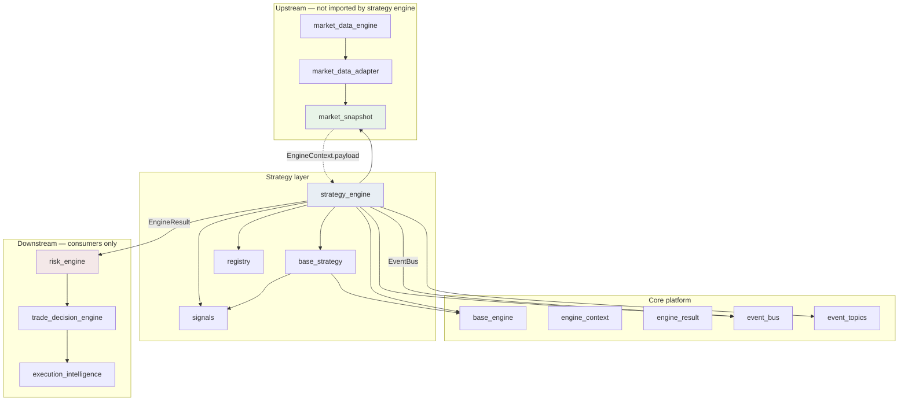

# Strategy Engine — Software Engineering Specification

| Field | Value |
|---|---|
| **Module** | `engines/strategy_engine.py` |
| **Supporting modules** | `engines/strategy/base_strategy.py`, `engines/strategy/signals.py`, `engines/strategy/registry.py` |
| **Document version** | 1.0.0 |
| **Status** | Draft — ready for implementation |
| **Owner** | THETA AI TRADER Core Platform |
| **Last updated** | 2026-08-03 |

---

## 1. Purpose

`engines/strategy_engine.py` is the **institutional strategy intelligence and signal production engine** for THETA AI TRADER.

The engine sits in the analytical pipeline **after** market data normalization and **before** risk management, trade decision, and execution layers. Its sole mission is to:

1. **Evaluate** one or more registered trading strategies against an immutable `MarketSnapshot`.
2. **Produce** standardized, explainable **trading signals** — never orders.
3. **Coordinate** multi-strategy execution with configurable priority, parallelism, and conflict resolution.
4. **Publish** structured outcomes through `EngineResult` and the platform `EventBus`.

The Strategy Engine is a **signal factory**, not a trader. It answers: *“Given this market snapshot, which strategy families are suitable, with what confidence, and what structured intent should downstream engines consider?”*

### Pipeline placement

```text
[Market Data Engine]
    publish → MarketSnapshot
              ↓
[Orchestrator]
    builds EngineContext(payload=MarketSnapshot)
              ↓
[engines/strategy_engine.py]
    run registered BaseStrategy plugins (parallel / prioritized)
    validate → aggregate → resolve conflicts → confidence score
              ↓
    EngineResult(payload=StrategyEngineResult)
    EventBus → strategy.signal.*
              ↓
[Risk Engine] → [Trade Decision Engine] → [Execution Intelligence]
    (downstream — out of scope for this module)
```

### Goals

1. Replace legacy root-level `strategy_engine.py` (regime-coupled dict I/O, mutable state, single-strategy selection) with a production-grade, plugin-based engine under `engines/`.
2. Enforce **strategy independence** — each strategy is a hot-pluggable `BaseStrategy` with deterministic evaluation.
3. Standardize **signal shape** so risk, decision, and execution engines consume one contract.
4. Support **multi-strategy** live evaluation with explicit conflict resolution — never rely on a single strategy in production.
5. Integrate cleanly with `BaseEngine.run`, `EngineResult`, `MarketSnapshot`, and `EventBus` without broker or order dependencies.

### Success criteria

- Orchestrator invokes `StrategyEngine.run(context)` with `MarketSnapshot` payload and receives immutable `StrategyEngineResult`.
- Adding a new strategy requires implementing `BaseStrategy` and registering it — no edits to core engine logic.
- Identical `EngineContext` + configuration produces bit-for-bit equivalent signals (modulo explicit timestamps in metadata).
- No module under `engines/strategy_engine.py` imports broker SDKs, broker clients, or execution APIs.
- Downstream risk engine can reject signals without the strategy engine performing risk logic.

### Relationship to other modules

| Module | Relationship |
|---|---|
| `market_data/market_snapshot.py` | **Primary input.** Every strategy evaluates an immutable `MarketSnapshot`. |
| `core/base_engine.py` | **Foundation.** `StrategyEngine` and `BaseStrategy` extend `BaseEngine` lifecycle. |
| `core/event_bus.py` | **Publisher.** Strategy outcomes emitted on canonical topics. |
| `core/event_topics.py` | **Topic constants.** New `strategy.*` topics defined here at implementation time. |
| `strategy_engine.py` (legacy root) | **Migration source.** Regime-coupled selection logic deprecated; behaviour moves to plugins + orchestrator context assembly. |
| `strategy.py` / `strategy_library.py` (legacy root) | **Knowledge base reference.** Static strategy definitions may inform plugin metadata; not imported at runtime by v1 engine core. |
| Risk / Trade Decision / Execution engines | **Downstream consumers.** Receive signals; strategy engine exposes interface contract only. |

---

## 2. Responsibilities

`engines/strategy_engine.py` and its supporting strategy packages **are responsible for**:

| # | Responsibility | Description |
|---|---|---|
| R1 | **Strategy plugin contract** | Define `BaseStrategy` extending `BaseEngine` for single-strategy evaluation. |
| R2 | **Multi-strategy orchestration** | Define `StrategyEngine` extending `BaseEngine` to run registered strategies per policy. |
| R3 | **Strategy registration** | Maintain a thread-safe registry of enabled strategies with metadata and priority. |
| R4 | **Strategy discovery** | Support explicit registration and optional discovery hooks for hot-plug. |
| R5 | **Context assembly** | Define `StrategyContext` wrapping `MarketSnapshot` and pipeline metadata for strategy runs. |
| R6 | **Signal model** | Define immutable `TradingSignal`, `SignalBundle`, and related enumerations. |
| R7 | **Signal validation** | Validate every strategy output before aggregation; reject malformed signals. |
| R8 | **Priority scheduling** | Order strategy execution and conflict resolution by configurable priority. |
| R9 | **Parallel execution** | Run independent strategies concurrently within policy bounds. |
| R10 | **Conflict detection** | Detect opposing or incompatible signals from multiple strategies. |
| R11 | **Conflict resolution** | Apply configured resolution policy to produce a single coherent signal set or explicit abstain. |
| R12 | **Signal aggregation** | Merge compatible signals into `AggregatedSignalResult`. |
| R13 | **Confidence scoring** | Compute per-signal and aggregate confidence with explainable factors. |
| R14 | **EngineResult production** | Return `EngineResult` with `StrategyEngineResult` payload and structured errors/warnings. |
| R15 | **EventBus publication** | Publish signal lifecycle events with correlation propagation. |
| R16 | **Determinism guarantees** | Ensure reproducible outputs for identical inputs and configuration. |
| R17 | **Structured diagnostics** | Expose registry snapshot, last run stats, conflict records. |
| R18 | **Error taxonomy** | Stable codes under `STRATEGY_ENGINE.*`. |
| R19 | **Logging and metrics hooks** | Standard event names for registration, execution, conflict, publish. |

---

## 3. Non-Responsibilities

The Strategy Engine **must not**:

| # | Non-responsibility | Rationale |
|---|---|---|
| NR1 | **Place, modify, or cancel orders** | Execution belongs in execution intelligence and broker layers. |
| NR2 | **Perform risk management** | Position limits, margin checks, and capital protection belong in Risk Engine. |
| NR3 | **Size positions** | Position Sizing Engine consumes signals after risk approval. |
| NR4 | **Fetch market data or call brokers** | Input is always an upstream `MarketSnapshot`. |
| NR5 | **Import broker SDKs or broker clients** | No Zerodha, Kite, or vendor-specific types. |
| NR6 | **Normalize raw broker payloads** | Adapter responsibility. |
| NR7 | **Detect market regime directly in v1 core** | Regime labels may be supplied as optional orchestrator hints; regime detection belongs in Market Regime Engine. |
| NR8 | **Calculate Greeks or IV surfaces** | Greeks Engine produces inputs; strategies may consume Greeks only via snapshot attachments added by orchestrator in future versions — not in v1 core dependencies. |
| NR9 | **Persist signals to disk or database** | Persistence is an external concern. |
| NR10 | **Mutate `MarketSnapshot`** | Snapshots are read-only inputs. |
| NR11 | **Call other analytical engines directly** | No imports of peer engines; orchestrator assembles context. |
| NR12 | **Load environment variables or config files** | Accept injected `StrategyEngineConfig` at construction. |
| NR13 | **Authorize live trading** | Final trade permission is downstream; engine may emit `NO_TRADE` signals but does not gate capital. |
| NR14 | **Implement UI or dashboard rendering** | Consumers subscribe to events or read `EngineResult`. |

---

## 4. Architecture

### 4.1 Layered design

```text
┌─────────────────────────────────────────────────────────────────────┐
│                         StrategyEngine                               │
│  (extends BaseEngine — multi-strategy orchestrator)                  │
│  ┌──────────────┐ ┌─────────────────┐ ┌──────────────────────────┐  │
│  │ Strategy     │ │ Execution       │ │ Aggregation & Conflict   │  │
│  │ Registry     │ │ Scheduler       │ │ Resolver                 │  │
│  └──────┬───────┘ └────────┬────────┘ └────────────┬─────────────┘  │
│         │                  │                       │                 │
│         │    ┌─────────────▼───────────────────────▼─────────────┐   │
│         │    │           StrategyRunner (parallel pool)           │   │
│         │    └─────────────┬─────────────────────────────────────┘   │
│         │                  │ per plugin                              │
│         ▼                  ▼                                         │
│  ┌──────────────────────────────────────────────────────────────┐   │
│  │ BaseStrategy implementations (hot-pluggable plugins)          │   │
│  │  ShortStrangleStrategy | IronCondorStrategy | ...             │   │
│  └──────────────────────────────────────────────────────────────┘   │
└──────────────────────────────┬──────────────────────────────────────┘
                               │ TradingSignal / SignalBundle
                               ▼
                    EngineResult(StrategyEngineResult)
                               │
                               ▼
                          EventBus publish
```

### 4.2 Component responsibilities

| Component | Role |
|---|---|
| `StrategyEngine` | Top-level `BaseEngine` subclass; validates context, schedules strategies, aggregates output. |
| `BaseStrategy` | Abstract single-strategy plugin; implements `_execute` → one `TradingSignal` or abstain. |
| `StrategyRegistry` | Thread-safe register/unregister/lookup; stores metadata and priority. |
| `StrategyDiscovery` | Optional provider loading registered plugins from explicit list or discovery entry points. |
| `StrategyRunner` | Executes strategies sequentially or in parallel per policy; collects raw signals. |
| `SignalValidator` | Schema and semantic validation of each `TradingSignal`. |
| `ConflictDetector` | Identifies incompatible signal pairs/groups. |
| `ConflictResolver` | Applies resolution policy to conflicting signals. |
| `SignalAggregator` | Merges compatible signals into final bundle. |
| `ConfidenceScorer` | Computes normalized confidence scores with factor breakdown. |
| `StrategyEventPublisher` | Wraps `EventBus` publish calls for strategy lifecycle events. |

### 4.3 Design principles

- **Dependency injection** — registry, policies, event bus, and executor injected at construction.
- **Immutability at boundaries** — `MarketSnapshot`, `TradingSignal`, and result payloads are frozen.
- **Fail closed** — invalid snapshot or signal → `REJECTED` / `NO_TRADE`; never emit ambiguous actionable signals.
- **Determinism** — no randomness, no wall-clock dependence inside strategy logic (use `context.as_of`).
- **Single responsibility** — each `BaseStrategy` encodes one strategy family decision.
- **No engine-to-engine calls** — strategies do not invoke peer engines.
- **Explainability** — every signal carries reasons, factors, and source strategy identity.

### 4.4 Allowed module dependencies

| Dependency | Usage |
|---|---|
| `core.base_engine` | `BaseEngine`, `EngineContext`, `EngineResult`, status/errors |
| `market_data.market_snapshot` | `MarketSnapshot`, validation helpers (`validate_market_snapshot`, `is_live_trade_ready`) |
| `core.event_bus` | Publish strategy events (injected) |
| `core.event_topics` | Canonical topic constants |
| Standard library | `abc`, `dataclasses`, `datetime`, `enum`, `logging`, `threading`, `concurrent.futures` |

### 4.5 Forbidden dependencies

- `broker/*`, `kiteconnect`, any vendor SDK
- `market_data/market_data_engine.py`, `market_data/market_data_adapter.py` (snapshot already supplied)
- Risk, execution, or order modules
- `config_manager`, environment loaders, UI modules

---

## 5. Dependency Diagram

### 5.1 Module dependency graph



### 5.2 Data dependency graph (runtime)

```text
MarketSnapshot (immutable)
    → StrategyContext
        → BaseStrategy.run (× N plugins)
            → TradingSignal (× N)
                → SignalValidator
                → ConflictDetector
                → ConflictResolver
                → SignalAggregator
                → ConfidenceScorer
                    → StrategyEngineResult
                        → EngineResult
                        → EventBus (strategy.signal.*)
```

### 5.3 Dependency rules

| Rule ID | Rule |
|---|---|
| D-001 | `StrategyEngine` may import `MarketSnapshot` types and validation helpers only from `market_data.market_snapshot`. |
| D-002 | `BaseStrategy` plugins may not import `StrategyEngine` (avoid circular dependency). |
| D-003 | Plugins receive inputs only through `StrategyContext` — no global singletons for market state. |
| D-004 | EventBus is injected; plugins do not publish directly unless explicitly granted via optional callback (default: engine publishes). |
| D-005 | Orchestrator may pass optional read-only hints in `StrategyContext.tags`; plugins must not require hints for core logic in v1. |

---

## 6. Strategy Lifecycle

### 6.1 Plugin lifecycle

```text
[Construction]
    → validate StrategyPluginConfig / static metadata
    → strategy instance ready (stateless across runs)

[Registration]
    → StrategyRegistry.register(plugin, metadata, priority)
    → state = REGISTERED

[Enable / Disable]
    → enabled flag toggled without unregistration (hot config)

[Evaluation — per pipeline run]
    → StrategyEngine invokes plugin.run(strategy_context)
    → plugin returns TradingSignal or abstain
    → SignalValidator validates output

[Unregistration — hot-plug removal]
    → StrategyRegistry.unregister(strategy_id)
    → in-flight runs complete; future runs exclude plugin
```

### 6.2 Strategy state machine

| State | Description | Transitions |
|---|---|---|
| `UNREGISTERED` | Not known to registry | → `REGISTERED` via register |
| `REGISTERED` | Known but may be disabled | → `ENABLED` / `DISABLED` |
| `ENABLED` | Eligible for execution | → `DISABLED` |
| `DISABLED` | Skipped during runs | → `ENABLED` |
| `FAILED_INIT` | Construction/validation failed | terminal until fixed |

### 6.3 Idempotency

- `register()` with same `strategy_id` and compatible metadata is idempotent (no-op with debug log) or explicit replace policy — default: reject duplicate IDs.
- `unregister()` on unknown ID is no-op with warning.
- Strategy `run()` is pure relative to inputs: same context → same signal.

---

## 7. Engine Lifecycle

### 7.1 StrategyEngine instance lifecycle

```text
[Construction]
    → validate StrategyEngineConfig
    → inject EventBus, registry, policies
    → optionally auto-discover and register plugins
    → state = READY

[run(context) — via BaseEngine template]
    → validate EngineContext / StrategyContext
    → reject if MarketSnapshot invalid for mode
    → build execution plan from registry (enabled, sorted by priority)
    → StrategyRunner executes plan (parallel or sequential)
    → validate each TradingSignal
    → detect conflicts → resolve → aggregate → score confidence
    → build StrategyEngineResult
    → publish EventBus events
    → return EngineResult

[Shutdown — optional explicit]
    → cancel in-flight parallel tasks (timeout bounded)
    → registry persists until process exit
```

### 7.2 Engine run state overlay

| Overlay | Meaning |
|---|---|
| `SINGLE_STRATEGY_MODE` | Only highest-priority enabled strategy runs (analysis/debug). |
| `MULTI_STRATEGY_MODE` | All enabled strategies run (production default). |
| `ABSTAIN` | No strategy produced actionable signal; explicit `NO_TRADE` outcome. |

### 7.3 Idempotency

- Repeated `run()` with identical context and registry state yields equivalent `StrategyEngineResult` (deterministic ordering).
- Engine instance is reusable across pipeline ticks.

---

## 8. Strategy Registration

### 8.1 Registration API

| Method | Description |
|---|---|
| `register(strategy: BaseStrategy, *, metadata: StrategyMetadata, priority: int, enabled: bool = True) -> None` | Add plugin to registry. |
| `unregister(strategy_id: str) -> bool` | Remove plugin; returns whether ID existed. |
| `enable(strategy_id: str) -> None` | Mark plugin eligible without re-instantiation. |
| `disable(strategy_id: str) -> None` | Exclude plugin from runs. |
| `replace(strategy_id: str, strategy: BaseStrategy, ...) -> None` | Atomic swap for hot-plug upgrade. |
| `list_registered() -> tuple[StrategyRegistrationRecord, ...]` | Immutable snapshot of registry. |

### 8.2 Registration rules

| Rule ID | Condition | Action |
|---|---|---|
| REG-001 | Duplicate `strategy_id` on register (default policy) | Raise `StrategyEngineConfigurationError` |
| REG-002 | `priority` not in `0..1000` | Raise `StrategyEngineConfigurationError` |
| REG-003 | Plugin fails metadata validation | Raise `StrategyEngineConfigurationError`; do not register |
| REG-004 | Unregister during active run | Defer removal until run completes |
| REG-005 | Zero enabled strategies at run time | Return `ABSTAIN` / `NO_TRADE` with warning |

### 8.3 Registration record

| Field | Type | Description |
|---|---|---|
| `strategy_id` | `str` | Stable unique identifier |
| `strategy_name` | `str` | Human-readable name |
| `strategy_version` | `str` | Semantic version of plugin |
| `priority` | `int` | Higher runs first; used in conflict resolution |
| `enabled` | `bool` | Whether eligible for execution |
| `registered_at` | timezone-aware datetime | Registration timestamp |
| `metadata` | `StrategyMetadata` | Capabilities and constraints |

---

## 9. Strategy Discovery

### 9.1 Discovery modes (v1)

| Mode | Description | Use case |
|---|---|---|
| **Explicit** | Orchestrator/bootstrap calls `register()` for each plugin | Production default — fully deterministic |
| **Configured list** | `StrategyEngineConfig.strategy_entrypoints: tuple[str, ...]` resolved at init | Deploy-time plugin list |
| **Package scan (extension)** | Optional future entry-point group `theta_ai_trader.strategies` | Plugin ecosystem |

v1 **must** support explicit registration without dynamic import side effects in core tests.

### 9.2 Discovery workflow

```text
[Configured entrypoints or explicit list]
    → import plugin class (external to core engine in production)
    → validate issubclass(plugin, BaseStrategy)
    → instantiate with injected StrategyPluginConfig
    → register with metadata and priority
```

### 9.3 Discovery rules

| Rule ID | Rule |
|---|---|
| DIS-001 | Discovery failures for one plugin must not prevent registration of others (collect errors). |
| DIS-002 | Discovered plugins must not mutate global state at import time. |
| DIS-003 | Duplicate IDs across discovery sources → fail registration with structured error. |
| DIS-004 | Discovery is optional; engine runs with zero plugins → abstain outcome. |

---

## 10. Strategy Metadata

### 10.1 `StrategyMetadata` (immutable)

| Field | Required | Description |
|---|---|---|
| `strategy_id` | Yes | Stable identifier, e.g. `"short_strangle"`. |
| `display_name` | Yes | Human-readable label. |
| `version` | Yes | Semantic version of implementation. |
| `strategy_family` | Yes | `StrategyFamily` enum value. |
| `category` | No | e.g. income, directional, volatility. |
| `supported_underlyings` | No | Tuple of underlying symbols; empty = all. |
| `requires_volatility_snapshot` | No | Default `False`. |
| `min_contracts_required` | No | Minimum option contracts in snapshot. |
| `risk_profile_hint` | No | `DEFINED` / `UNDEFINED` — informational only, not risk enforcement. |
| `tags` | No | Immutable labels for filtering. |

### 10.2 `StrategyFamily` enumeration (v1)

| Value | Description |
|---|---|
| `SHORT_STRANGLE` | Short strangle premium selling |
| `IRON_CONDOR` | Defined-risk range structure |
| `BULL_PUT_SPREAD` | Bullish defined-risk spread |
| `BEAR_CALL_SPREAD` | Bearish defined-risk spread |
| `BROKEN_WING_BUTTERFLY` | Broken wing butterfly |
| `JADE_LIZARD` | Jade lizard structure |
| `LONG_VOLATILITY` | Long vol structures |
| `CUSTOM` | Extension bucket with mandatory `custom_family_name` tag |
| `NO_STRATEGY` | Explicit abstain / no trade |

### 10.3 Metadata in results

Every `TradingSignal` must copy `strategy_id`, `strategy_version`, and `strategy_family` from plugin metadata for audit trails.

---

## 11. Strategy Context

### 11.1 Purpose

`StrategyContext` is the **immutable input** to each `BaseStrategy.run()` invocation. It wraps the pipeline `EngineContext` fields required for strategy evaluation.

### 11.2 `StrategyContext` fields

| Field | Type | Required | Description |
|---|---|---|---|
| `correlation_id` | `str` | Yes | Pipeline correlation identifier. |
| `as_of` | timezone-aware datetime | Yes | Decision timestamp (from snapshot provenance). |
| `snapshot` | `MarketSnapshot` | Yes | Canonical market observation. |
| `execution_mode` | `StrategyExecutionMode` | No | `LIVE`, `ANALYSIS`, `BACKTEST`. Default `LIVE`. |
| `tags` | immutable mapping | No | Orchestrator-supplied hints (e.g. regime label) — optional, never required v1. |
| `prior_signals` | `tuple[TradingSignal, ...]` | No | Empty in v1 single-pass; reserved for multi-pass pipelines. |

### 11.3 Construction from `EngineContext`

The orchestrator (or `StrategyEngine` internally) builds `StrategyContext` when:

1. `EngineContext.payload` is a `MarketSnapshot`.
2. `correlation_id` and `as_of` align with `EngineContext` fields.
3. Snapshot validation status is checked before strategy execution.

### 11.4 Context validation rules

| Rule ID | Condition | Action |
|---|---|---|
| CTX-001 | `snapshot` is `None` | `EngineStatus.REJECTED` |
| CTX-002 | `snapshot.provenance.as_of` naive | `REJECTED` |
| CTX-003 | `execution_mode=LIVE` and `not is_live_trade_ready(snapshot)` | Run strategies but force final outcome toward `NO_TRADE` unless analysis override |
| CTX-004 | `snapshot.quality.validation_status == INVALID` | `REJECTED` |
| CTX-005 | Underlying mismatch across snapshot components | `REJECTED` |

### 11.5 Context invariants

- Strategies must treat `snapshot` as read-only.
- Strategies must not fetch supplemental data; all inputs come from context.
- `as_of` in context must equal or be derived from snapshot provenance for determinism tests.

---

## 12. Signal Model

### 12.1 Purpose

Standardized **trading signals** express strategy intent in a broker-neutral, order-neutral form consumable by Risk and Trade Decision engines.

A signal is **not** an order. It does not contain broker tokens, order types, or quantities destined for placement.

### 12.2 Core types

| Type | Description |
|---|---|
| `TradingSignal` | Immutable primary output of one strategy evaluation. |
| `SignalBundle` | Ordered tuple of signals from one engine run before aggregation. |
| `AggregatedSignalResult` | Post-conflict-resolution, post-aggregation output. |
| `StrategyEngineResult` | Top-level payload inside `EngineResult`. |

### 12.3 `TradingSignal` fields

| Field | Type | Required | Description |
|---|---|---|---|
| `signal_id` | `str` | Yes | UUID or deterministic hash for this evaluation. |
| `strategy_id` | `str` | Yes | Originating plugin identifier. |
| `strategy_family` | `StrategyFamily` | Yes | Strategy family enum. |
| `action` | `SignalAction` | Yes | High-level intent (see §12.4). |
| `direction` | `SignalDirection` | Yes | Market bias implied by structure. |
| `confidence` | `SignalConfidence` | Yes | Scored confidence object (0–100). |
| `underlying` | `str` | Yes | e.g. `"NIFTY"`. |
| `expiry` | `str` | No | ISO date string from snapshot chain metadata. |
| `structure_hint` | `StructureHint` | No | Abstract leg layout — not executable orders. |
| `reasons` | `tuple[str, ...]` | Yes | Human-readable explainability bullets. |
| `factors` | `tuple[SignalFactor, ...]` | No | Machine-readable scoring factors. |
| `snapshot_id` | `str` | Yes | `MarketSnapshot.provenance.snapshot_id` |
| `as_of` | timezone-aware datetime | Yes | Decision timestamp. |
| `valid_until` | timezone-aware datetime | No | Optional staleness horizon for downstream. |
| `metadata` | immutable mapping | No | Extension labels. |

### 12.4 Enumerations

**`SignalAction` (v1)**

| Value | Meaning |
|---|---|
| `EVALUATE` | Strategy suitable; downstream should evaluate strikes/structure |
| `WAIT` | No actionable setup; monitor |
| `NO_TRADE` | Explicit abstain for this strategy |
| `ABSTAIN` | Insufficient data or policy skip |

**`SignalDirection` (v1)**

| Value | Meaning |
|---|---|
| `NEUTRAL` | Non-directional premium structures |
| `BULLISH` | Bullish bias |
| `BEARISH` | Bearish bias |
| `LONG_VOL` | Long volatility bias |
| `SHORT_VOL` | Short volatility bias |
| `UNKNOWN` | Undetermined |

### 12.5 `StructureHint` (abstract — not an order)

| Field | Description |
|---|---|
| `leg_count` | Expected number of legs |
| `structure_type` | e.g. `"STRANGLE"`, `"IRON_CONDOR"` |
| `strike_selection_policy` | e.g. `"DELTA_TARGET"`, `"ATM_OFFSET"` |
| `target_delta` | Optional numeric hint |
| `strikes_each_side` | Optional width hint |
| `option_types` | Tuple of `OptionType` from snapshot module |

Structure hints guide downstream strike selection engines — they do not specify tradingsymbols or order parameters.

### 12.6 `SignalConfidence`

| Field | Type | Description |
|---|---|---|
| `score` | `float` | 0.0–100.0 inclusive |
| `band` | `ConfidenceBand` | `LOW`, `MEDIUM`, `HIGH`, `VERY_HIGH` |
| `method` | `str` | Scoring method identifier |
| `components` | `tuple[ConfidenceComponent, ...]` | Weighted breakdown |

### 12.7 Default abstain signal

When a strategy cannot evaluate, it returns a `TradingSignal` with:

- `action = ABSTAIN` or `NO_TRADE`
- `confidence.score = 0`
- non-empty `reasons` explaining abstain

Never return `None` from `BaseStrategy._execute`.

---

## 13. Signal Validation

### 13.1 Validation layers

| Layer | Owner | When |
|---|---|---|
| **Plugin self-check** | `BaseStrategy` | Inside `_execute` before return |
| **Signal schema validation** | `SignalValidator` | Immediately after each plugin returns |
| **Semantic validation** | `SignalValidator` | Cross-check against snapshot metadata |
| **Aggregation validation** | `SignalAggregator` | Before final result sealed |

### 13.2 Schema rules

| Rule ID | Condition | Action |
|---|---|---|
| SIG-001 | Missing required field | Reject signal; record `STRATEGY_ENGINE.SIGNAL.INVALID` |
| SIG-002 | `confidence.score` outside 0–100 | Reject or clamp with warning (default: reject) |
| SIG-003 | `action=EVALUATE` with `strategy_family=NO_STRATEGY` | Reject |
| SIG-004 | Empty `reasons` | Reject |
| SIG-005 | `snapshot_id` mismatch with input snapshot | Reject |
| SIG-006 | `underlying` not matching snapshot | Reject |
| SIG-007 | `valid_until` before `as_of` | Reject |

### 13.3 Semantic rules

| Rule ID | Condition | Action |
|---|---|---|
| SEM-001 | `action=EVALUATE` but snapshot freshness not usable (LIVE mode) | Downgrade to `NO_TRADE` with reason |
| SEM-002 | `structure_hint.leg_count` inconsistent with `strategy_family` | Warning + downgrade confidence |
| SEM-003 | Strategy requires VIX but snapshot.volatility is None | `ABSTAIN` for that plugin only |

### 13.4 Validation outcome

Invalid plugin signals are excluded from aggregation; errors attached to `EngineResult.errors` without failing entire engine unless all plugins fail.

---

## 14. Strategy Priority

### 14.1 Priority model

| Concept | Description |
|---|---|
| **Priority value** | Integer `0–1000`; higher = more authoritative in scheduling and conflict resolution. |
| **Execution order** | Enabled strategies sorted by priority descending, then `strategy_id` ascending (deterministic tie-break). |
| **Conflict weight** | Higher-priority signal wins default conflict resolution. |

### 14.2 Default priorities (illustrative — configurable)

| Strategy family | Default priority |
|---|---|
| `IRON_CONDOR` | 700 |
| `SHORT_STRANGLE` | 650 |
| `BULL_PUT_SPREAD` / `BEAR_CALL_SPREAD` | 600 |
| `JADE_LIZARD` | 550 |
| `BROKEN_WING_BUTTERFLY` | 500 |
| `LONG_VOLATILITY` | 400 |
| `CUSTOM` | 300 |

### 14.3 Priority configuration

`StrategyEngineConfig.default_priorities: Mapping[StrategyFamily, int]` supplies defaults; per-registration `priority` overrides.

### 14.4 Priority rules

| Rule ID | Rule |
|---|---|
| PRI-001 | Priority ties broken lexically by `strategy_id` for determinism. |
| PRI-002 | Disabled strategies excluded regardless of priority. |
| PRI-003 | Priority does not bypass snapshot validation failures. |

---

## 15. Multi-Strategy Execution

### 15.1 Execution modes

| Mode | Description |
|---|---|
| `SEQUENTIAL` | Run plugins one-by-one in priority order (debug / reproducibility). |
| `PARALLEL` | Run plugins concurrently via bounded thread pool (production default). |
| `SINGLE` | Run only highest-priority enabled plugin. |

Configured via `StrategyEngineConfig.execution_mode`.

### 15.2 Parallel execution workflow

```text
[Build enabled plugin list sorted by priority]
    → submit each BaseStrategy.run(context) to executor
    → collect futures in completion order
    → reorder results by priority + strategy_id (deterministic merge)
    → pass ordered signals to validation / conflict / aggregation
```

### 15.3 Isolation requirements

| Requirement | Description |
|---|---|
| Plugin statelessness | No shared mutable state between parallel runs |
| Snapshot immutability | All plugins read same `MarketSnapshot` reference |
| Error isolation | One plugin exception → failed signal for that plugin only |
| Timeout | Per-plugin timeout (`StrategyEngineConfig.plugin_timeout_ms`); timeout → plugin abstain + error record |

### 15.4 Execution limits

| Parameter | Default | Description |
|---|---|---|
| `max_parallel_strategies` | `8` | Thread pool size cap |
| `plugin_timeout_ms` | `500` | Per-plugin wall timeout |
| `max_signals_per_run` | `32` | Guard against runaway registration |

---

## 16. Conflict Resolution

### 16.1 Conflict types

| Type | Example | Detection |
|---|---|---|
| `DIRECTIONAL_OPPOSITION` | BULLISH vs BEARISH both `EVALUATE` | Compare `SignalDirection` |
| `FAMILY_MUTEX` | SHORT_STRANGLE vs LONG_VOLATILITY both active | Configured mutex groups |
| `ACTION_CONTRADICTION` | `EVALUATE` vs explicit `NO_TRADE` on same underlying | Action comparison |
| `CONFIDENCE_DEADLOCK` | Equal priority and confidence, opposing directions | Tie detection |

### 16.2 Conflict record

| Field | Description |
|---|---|
| `conflict_id` | Unique identifier |
| `conflict_type` | From table above |
| `signal_ids` | Involved signals |
| `resolution` | Applied policy outcome |
| `winner_strategy_id` | Nullable winning plugin |

### 16.3 Resolution policies

| Policy | Behavior |
|---|---|
| `PRIORITY_WINS` | Highest priority signal survives; others downgraded to `NO_TRADE` |
| `CONFIDENCE_WINS` | Highest `confidence.score` wins |
| `COMBINED_SCORE` | `priority * weight + confidence` composite score |
| `VETO` | Any `NO_TRADE` from priority ≥ threshold vetoes `EVALUATE` |
| `ABSTAIN_ON_CONFLICT` | Emit aggregate `NO_TRADE` if unresolved conflict |
| `ALLOW_MULTIPLE` | Keep non-mutex compatible signals (default for orthogonal families) |

Default: `COMBINED_SCORE` with `ABSTAIN_ON_CONFLICT` fallback for directional opposition.

### 16.4 Mutex groups (configurable)

```text
SHORT_VOL_GROUP = {SHORT_STRANGLE, IRON_CONDOR, JADE_LIZARD}
DIRECTIONAL_GROUP = {BULL_PUT_SPREAD, BEAR_CALL_SPREAD}
LONG_VOL_GROUP = {LONG_VOLATILITY}
```

Only one `EVALUATE` signal per mutex group may survive unless `ALLOW_MULTIPLE` explicitly configured for that group.

---

## 17. Signal Aggregation

### 17.1 Purpose

Combine validated, conflict-resolved signals into a single **`AggregatedSignalResult`** for downstream engines.

### 17.2 Aggregation modes

| Mode | Output |
|---|---|
| `PRIMARY_SECONDARY` | One primary `EVALUATE` signal + secondary hints |
| `MULTI_SIGNAL` | All surviving `EVALUATE` signals (orthogonal families) |
| `SINGLE_WINNER` | Exactly one winning signal |
| `NO_TRADE_DEFAULT` | Empty evaluate set → explicit aggregate abstain |

Default production mode: `PRIMARY_SECONDARY`.

### 17.3 `AggregatedSignalResult` fields

| Field | Type | Description |
|---|---|---|
| `primary_signal` | `TradingSignal | None` | Top-ranked actionable signal |
| `secondary_signals` | `tuple[TradingSignal, ...]` | Additional compatible signals |
| `abstain_signals` | `tuple[TradingSignal, ...]` | Explicit no-trade signals preserved for audit |
| `conflicts` | `tuple[ConflictRecord, ...]` | Detected and resolved conflicts |
| `aggregation_mode` | `AggregationMode` | Mode used |
| `aggregate_confidence` | `SignalConfidence` | Combined confidence score |

### 17.4 Aggregation rules

| Rule ID | Rule |
|---|---|
| AGG-001 | At most one primary `EVALUATE` for mutually exclusive mutex groups |
| AGG-002 | Aggregate `NO_TRADE` if no `EVALUATE` survives validation |
| AGG-003 | Preserve all abstain reasons in `EngineResult.warnings` summary |
| AGG-004 | Deterministic ordering of secondary signals by priority then strategy_id |

---

## 18. Confidence Scoring

### 18.1 Purpose

Provide **explainable, comparable confidence** across strategies for downstream gating (without performing risk checks).

### 18.2 Scoring pipeline

```text
[Plugin emits raw confidence]
    → ConfidenceScorer.normalize (clamp, band mapping)
    → optional snapshot quality adjustment
    → optional factor weighting from StrategyEngineConfig
    → aggregate confidence for AggregatedSignalResult
```

### 18.3 Confidence bands

| Band | Score range |
|---|---|
| `LOW` | 0.0 – 39.9 |
| `MEDIUM` | 40.0 – 59.9 |
| `HIGH` | 60.0 – 79.9 |
| `VERY_HIGH` | 80.0 – 100.0 |

### 18.4 Adjustment factors (engine-level)

| Factor | Effect |
|---|---|
| Snapshot completeness | Scale down if `quality.completeness_score` below threshold |
| Freshness | Scale down if snapshot stale (non-analysis mode) |
| Contract count | Scale down if near minimum contracts |
| Plugin historical reliability | Extension hook — not computed in v1 core |

### 18.5 Confidence rules

| Rule ID | Rule |
|---|---|
| CON-001 | Final aggregate confidence must not exceed max plugin confidence without explicit bonus config |
| CON-002 | `NO_TRADE` signals may carry high confidence (confident abstain) |
| CON-003 | Confidence scoring must be deterministic given same inputs |

---

## 19. EventBus Integration

### 19.1 Publishing policy

`StrategyEngine` publishes events **after** successful aggregation via injected `EventBus`. Individual plugins do not publish by default.

### 19.2 Canonical topics (v1 — add to `core/event_topics.py` at implementation)

| Topic | When | Payload |
|---|---|---|
| `strategy.signal.generated` | Actionable aggregate signal produced | `AggregatedSignalResult` |
| `strategy.signal.abstain` | Aggregate outcome is NO_TRADE / ABSTAIN | `StrategyEngineResult` |
| `strategy.signal.rejected` | Engine run REJECTED | `EngineResult` |
| `strategy.execution.started` | Engine run begins | `{correlation_id, strategy_ids}` |
| `strategy.execution.completed` | Engine run completes | `EngineResult` |
| `strategy.conflict.detected` | Conflict detected and resolved | `ConflictRecord` |
| `strategy.plugin.failed` | Single plugin exception/timeout | `EngineErrorRecord` |

### 19.3 Envelope requirements

Every publish must include:

- `correlation_id` from `EngineContext`
- `producer = "strategy_engine"`
- `producer_version = STRATEGY_ENGINE_VERSION`
- `occurred_at = context.as_of`
- `payload_type` fully-qualified type name

### 19.4 Subscriber isolation

EventBus handler failures must not affect engine result return — consistent with platform EventBus policy.

---

## 20. MarketSnapshot Integration

### 20.1 Input contract

| Requirement | Description |
|---|---|
| Payload type | `EngineContext.payload` must be `MarketSnapshot` |
| Validation | Engine calls `validate_market_snapshot(snapshot)` before plugin execution |
| Live gating | LIVE mode consults `is_live_trade_ready(snapshot)` |
| Identity | All signals copy `snapshot.provenance.snapshot_id` |
| Timestamps | `as_of` derived from `snapshot.provenance.as_of` unless orchestrator overrides with justification in tags |

### 20.2 Fields commonly used by strategies

| Snapshot component | Strategy usage |
|---|---|
| `underlying.spot_price` | Direction, range, strike selection hints |
| `volatility.vix` | Vol regime suitability |
| `option_chain.metadata` | Expiry, ATM, strike step |
| `option_chain.contracts` | OI, LTP, spread quality hints |
| `freshness` | Usability for LIVE evaluation |
| `quality` | Completeness weighting for confidence |

### 20.3 Snapshot failure behaviour

| Snapshot condition | Engine behaviour |
|---|---|
| `VALID` + fresh | Normal execution |
| `PARTIAL` | Execute with warnings; reduce confidence |
| `INVALID` | `EngineStatus.REJECTED` — no signals |
| Stale (LIVE) | Plugins may run; aggregate forced toward `NO_TRADE` |

### 20.4 No snapshot mutation

Engine and plugins must not call mutating helpers on snapshot types. Derived views are local immutable copies if needed.

---

## 21. EngineResult Integration

### 21.1 `StrategyEngine` as `BaseEngine`

`StrategyEngine` extends `BaseEngine`:

| Method | Behaviour |
|---|---|
| `engine_name` | Returns `"strategy_engine"` |
| `engine_version` | Returns `STRATEGY_ENGINE_VERSION` |
| `validate_context` | Ensures `MarketSnapshot` payload + base context rules |
| `_execute` | Runs multi-strategy pipeline; returns `EngineResult` |

### 21.2 `StrategyEngineResult` payload

| Field | Type | Description |
|---|---|---|
| `aggregated` | `AggregatedSignalResult` | Final aggregated signals |
| `raw_signals` | `tuple[TradingSignal, ...]` | Pre-aggregation validated signals |
| `plugins_executed` | `int` | Count of plugins run |
| `plugins_abstained` | `int` | Count abstained |
| `plugins_failed` | `int` | Count failed validation/exception |
| `execution_mode` | `StrategyExecutionMode` | Mode used |
| `registry_snapshot_id` | `str` | Hash of registry state for reproducibility |

### 21.3 Status mapping

| Condition | `EngineStatus` |
|---|---|
| Aggregate primary `EVALUATE` produced | `SUCCESS` |
| All abstain, no errors | `SUCCESS` with `NO_TRADE` aggregate |
| Some plugins failed, aggregate still valid | `PARTIAL` |
| Invalid context / snapshot | `REJECTED` |
| Unhandled engine failure | `FAILED` |

### 21.4 Error and warning propagation

- Plugin-level issues → `EngineWarningRecord` or `EngineErrorRecord` with plugin namespace.
- Conflict resolutions → `warnings` with conflict summary.
- Orchestrator reads `status` before invoking Risk Engine.

---

## 22. Risk Engine Interface

### 22.1 Boundary definition

The Strategy Engine **defines outputs** consumed by the Risk Engine. It does **not** import or call the Risk Engine.

### 22.2 Downstream contract (logical interface)

| Input to Risk Engine | Source field |
|---|---|
| Primary signal | `StrategyEngineResult.aggregated.primary_signal` |
| Secondary signals | `StrategyEngineResult.aggregated.secondary_signals` |
| Aggregate confidence | `StrategyEngineResult.aggregated.aggregate_confidence` |
| Snapshot reference | `TradingSignal.snapshot_id` |
| Correlation | `EngineResult.metadata.correlation_id` |

### 22.3 Risk Engine expectations (documented for integrators)

| Expectation | Description |
|---|---|
| Risk Engine treats missing primary `EVALUATE` as no trade | Capital protection default |
| Risk Engine validates margin, exposure, limits | Outside strategy engine |
| Risk Engine may veto regardless of confidence | Strategy engine confidence ≠ approval |
| Risk Engine must not mutate signals | Read-only consumption |

### 22.4 Anti-patterns (forbidden)

- Strategy Engine calling `RiskEngine.run()` internally
- Embedding margin checks inside `BaseStrategy`
- Emitting order-ready payloads from strategy layer

### 22.5 Future typed handshake (extension)

Optional shared immutable `StrategyToRiskHandoff` dataclass in a neutral `contracts/` module — not required for v1 implementation.

---

## 23. Performance Requirements

| Requirement | Target | Notes |
|---|---|---|
| Single plugin evaluation | < 5 ms median | Excludes orchestrator overhead |
| Full engine run (8 plugins, parallel) | < 15 ms median p50 | Snapshot already in memory |
| Full engine run p95 | < 40 ms | Includes validation + aggregation |
| Parallel speedup | ≥ 3× vs sequential for 8 CPU-bound plugins | Reference hardware |
| Registry lookup | O(1) by strategy_id | Hash map |
| Conflict detection | O(n²) worst case acceptable for n ≤ 32 plugins | Small n in practice |
| Memory per run | ≤ 2 MB transient allocations | No snapshot copy |
| EventBus publish overhead | < 0.5 ms | Excluding subscriber work |

Benchmarks in `tests/test_strategy_engine_performance.py` (optional smoke).

---

## 24. Thread Safety

| Component | Requirement |
|---|---|
| `StrategyRegistry` | Thread-safe register/unregister/list; copy-on-read snapshot for runs |
| `StrategyEngine.run` | Safe concurrent runs on same instance if registry unchanged |
| `StrategyEngine.run` + registry mutation | Registry writes block until in-flight run completes (RW lock) |
| `BaseStrategy` plugins | Must be stateless; concurrent `run` safe |
| `MarketSnapshot` | Immutable — safe across threads |
| `TradingSignal` results | Immutable after creation |
| Parallel executor | Bounded pool; no unbounded thread spawn per tick |
| EventBus publish | Delegates to thread-safe bus implementation |

Prohibited: global mutable strategy state, module-level caches keyed by market without TTL/eviction.

---

## 25. Metrics

### 25.1 Metric hooks (v1)

Injectable `StrategyMetricsRecorder` protocol — default no-op.

| Metric | Type | Labels | Description |
|---|---|---|---|
| `strategy_engine_run_total` | counter | `status` | Engine runs by outcome |
| `strategy_engine_run_duration_seconds` | histogram | — | Total run duration |
| `strategy_plugin_run_total` | counter | `strategy_id`, `outcome` | Per-plugin runs |
| `strategy_plugin_run_duration_seconds` | histogram | `strategy_id` | Per-plugin duration |
| `strategy_signals_generated_total` | counter | `action`, `family` | Signals by action/family |
| `strategy_conflicts_total` | counter | `conflict_type`, `resolution` | Conflicts detected |
| `strategy_registry_size` | gauge | — | Registered plugins |
| `strategy_plugins_enabled` | gauge | — | Enabled plugins |
| `strategy_aggregate_confidence` | gauge | — | Last aggregate score |
| `strategy_plugin_timeouts_total` | counter | `strategy_id` | Plugin timeouts |

### 25.2 Tracing (extension)

OpenTelemetry span: `strategy_engine.run` with attributes `correlation_id`, `snapshot_id`, `plugin_count`.

---

## 26. Logging

### 26.1 Logger

- Module logger: `engines.strategy_engine`
- Structured `extra`: `engine_name`, `correlation_id`, `strategy_id`, `signal_action`, `status`

### 26.2 Required log events

| Event | Level | When |
|---|---|---|
| `strategy_engine.run.start` | INFO | `run()` begins |
| `strategy_engine.run.success` | INFO | Successful completion |
| `strategy_engine.run.rejected` | INFO | Context/snapshot rejected |
| `strategy_engine.run.failed` | ERROR | Unhandled failure |
| `strategy_engine.plugin.start` | DEBUG | Plugin execution begins |
| `strategy_engine.plugin.completed` | DEBUG | Plugin finished |
| `strategy_engine.plugin.failed` | WARNING | Plugin exception/timeout |
| `strategy_engine.signal.generated` | INFO | Primary signal produced |
| `strategy_engine.signal.abstain` | INFO | Aggregate abstain |
| `strategy_engine.conflict.detected` | INFO | Conflict resolved |
| `strategy_engine.registry.register` | INFO | Plugin registered |
| `strategy_engine.registry.unregister` | INFO | Plugin removed |

### 26.3 Content rules

- **Do log:** strategy IDs, actions, confidence scores, conflict types, durations, error codes.
- **Do not log:** full option chains at INFO, broker tokens, API keys, order parameters.
- **PII/market data:** truncate chain details to counts/summary at INFO.

---

## 27. Testing Strategy

Tests live in `tests/test_strategy_engine.py` and `tests/strategy/test_*.py`.

### 27.1 Test doubles

| Double | Description |
|---|---|
| `FixedMarketSnapshot` | Deterministic snapshot fixture from adapter tests |
| `EchoStrategy` | Returns configured `TradingSignal` unchanged |
| `AbstainStrategy` | Always abstains |
| `OpposingStrategyA/B` | Conflicting directions for resolution tests |
| `SlowStrategy` | Configurable delay for timeout tests |
| `ExplodingStrategy` | Raises exception for isolation tests |
| `CapturingEventBus` | Records published envelopes |
| `InMemoryRegistry` | Registry wrapper for unit isolation |

No broker, network, or credentials in unit tests.

### 27.2 Required test cases

| Category | Cases |
|---|---|
| **Construction** | Valid/invalid config; empty registry |
| **Registration** | register/unregister/enable/disable/replace; duplicate ID |
| **Discovery** | Explicit list; invalid plugin skipped |
| **Context validation** | Missing snapshot, invalid snapshot, naive timestamp |
| **Single plugin** | EVALUATE, ABSTAIN, plugin exception isolation |
| **Multi-strategy sequential** | Deterministic ordering |
| **Multi-strategy parallel** | Same result as sequential for deterministic plugins |
| **Signal validation** | Schema failures rejected |
| **Conflict resolution** | Each policy; directional opposition |
| **Aggregation** | PRIMARY_SECONDARY, SINGLE_WINNER, NO_TRADE default |
| **Confidence** | Normalization, band mapping, quality adjustment |
| **MarketSnapshot** | PARTIAL snapshot warnings; INVALID rejected |
| **EngineResult** | SUCCESS/PARTIAL/REJECTED/FAILED mapping |
| **EventBus** | Topics published with correlation_id |
| **Thread safety** | Concurrent register + run stress |
| **Determinism** | Identical context → equivalent signals |
| **Performance smoke** | 8 plugins under target duration |

### 27.3 Coverage target

≥ 95% line coverage on `engines/strategy_engine.py` and `engines/strategy/*`.

### 27.4 Integration tests

Optional: `tests/test_strategy_engine_integration.py` with orchestrator + real `MarketSnapshot` from adapter fixtures.

---

## 28. Future Extension Points

| Extension | Description |
|---|---|
| **Regime-aware context** | Typed `RegimeHint` attachment in `StrategyContext.tags` without coupling plugins to regime engine imports |
| **Greeks-enriched snapshot attachments** | Optional immutable Greeks map produced upstream |
| **Async plugin execution** | `async def run_async` protocol v2 |
| **Strategy backtesting hook** | `execution_mode=BACKTEST` with historical snapshot stream |
| **Machine-learned confidence calibration** | Pluggable calibrator in `ConfidenceScorer` |
| **Dynamic priority rules** | Priority adjustment based on market volatility regime |
| **Signal persistence bus** | Kafka/Redis publisher adapter |
| **Plugin marketplace** | Entry-point discovery with signed plugin manifests |
| **Multi-underlying strategies** | Cross-underlying signals with explicit underlying map |
| **Strategy composition** | Meta-strategy combining sub-strategies |

Extensions must preserve: no broker imports, no order placement, immutable signals, determinism.

---

## 29. Definition of Done

The Strategy Engine module and this specification are **done** when:

### 29.1 Implementation

- [ ] All public API symbols defined across §4–§22 implemented.
- [ ] `StrategyEngine` and `BaseStrategy` extend `BaseEngine` per `core/base_engine.py`.
- [ ] Dependencies limited to `MarketSnapshot`, `BaseEngine`, `EventBus`, stdlib (§4.4–§4.5).
- [ ] No broker SDK, broker client, or order execution code in strategy modules.
- [ ] No risk management logic in strategy modules.
- [ ] Hot-pluggable registration and discovery (explicit minimum) implemented.
- [ ] Parallel and sequential multi-strategy execution implemented.
- [ ] Conflict resolution and aggregation policies implemented.
- [ ] Confidence scoring with explainable factors implemented.
- [ ] Immutable `TradingSignal` and result types (`frozen=True`).
- [ ] Stable error codes under `STRATEGY_ENGINE.*` implemented.
- [ ] Google-style docstrings on all public surfaces.
- [ ] Python 3.12 type hints throughout.

### 29.2 Testing

- [ ] `tests/test_strategy_engine.py` covers §27.2 cases.
- [ ] Line coverage ≥ 95% on strategy engine modules.
- [ ] Tests run without network, broker, or credentials.
- [ ] Determinism tests pass for identical fixtures.
- [ ] At least three reference plugins (`EchoStrategy`, `ShortStrangleStrategy`, `IronCondorStrategy` or equivalent) demonstrate real snapshot evaluation.

### 29.3 Integration

- [ ] Orchestrator (or interim pipeline) invokes `StrategyEngine.run` on `market.snapshot.published`.
- [ ] `core/event_topics.py` extended with `strategy.*` topics.
- [ ] Legacy root `strategy_engine.py` marked deprecated with migration note in docstring.
- [ ] `CHANGELOG.md` updated.

### 29.4 Documentation

- [ ] This specification matches implemented behaviour.
- [ ] Cross-links updated in `market_snapshot.md`, `base_engine.md`, and `event_bus.md`.

### 29.5 Review checklist

- [ ] Correctness — multi-strategy, conflict, validation verified.
- [ ] Architecture — signal-only output; no broker/risk/execution coupling.
- [ ] Capital protection — abstain paths preferred over ambiguous signals.
- [ ] Determinism — parallel vs sequential equivalence for deterministic plugins.
- [ ] Performance — smoke targets met.

### 29.6 Sign-off

- [ ] Peer review approved.
- [ ] Specification version bumped if API changed post-review.

---

## Appendix A — Public API summary

### A.1 Constants

| Symbol | Value | Description |
|---|---|---|
| `STRATEGY_ENGINE_VERSION` | `"1.0.0"` | Engine semantic version |
| `ENGINE_NAME` | `"strategy_engine"` | Stable identifier for logs/metrics |
| `DEFAULT_MAX_PARALLEL_STRATEGIES` | `8` | Default thread pool size |
| `DEFAULT_PLUGIN_TIMEOUT_MS` | `500` | Default per-plugin timeout |

### A.2 Primary classes

| Class | Extends | Description |
|---|---|---|
| `BaseStrategy` | `BaseEngine` | Single-strategy plugin contract |
| `StrategyEngine` | `BaseEngine` | Multi-strategy orchestrator |
| `StrategyRegistry` | — | Registration and lookup |
| `TradingSignal` | frozen dataclass | Standardized signal output |
| `StrategyEngineResult` | frozen dataclass | Engine result payload |
| `StrategyContext` | frozen dataclass | Per-plugin input |
| `StrategyEngineConfig` | frozen dataclass | Engine configuration |

---

## Appendix B — Error code taxonomy

Namespace: `STRATEGY_ENGINE.<CATEGORY>.<DETAIL>`

| Code | Description |
|---|---|
| `STRATEGY_ENGINE.CONFIG.INVALID` | Invalid engine configuration |
| `STRATEGY_ENGINE.REGISTRY.DUPLICATE_ID` | Duplicate strategy registration |
| `STRATEGY_ENGINE.REGISTRY.NOT_FOUND` | Strategy ID not registered |
| `STRATEGY_ENGINE.CONTEXT.INVALID` | Invalid engine context |
| `STRATEGY_ENGINE.CONTEXT.SNAPSHOT_MISSING` | Missing MarketSnapshot payload |
| `STRATEGY_ENGINE.CONTEXT.SNAPSHOT_INVALID` | Snapshot validation failed |
| `STRATEGY_ENGINE.SIGNAL.INVALID` | Signal schema validation failed |
| `STRATEGY_ENGINE.SIGNAL.SEMANTIC_REJECT` | Semantic validation failed |
| `STRATEGY_ENGINE.PLUGIN.TIMEOUT` | Plugin execution timeout |
| `STRATEGY_ENGINE.PLUGIN.FAILED` | Plugin unhandled exception |
| `STRATEGY_ENGINE.CONFLICT.UNRESOLVED` | Conflict could not be resolved |
| `STRATEGY_ENGINE.EXECUTION.NO_PLUGINS` | No enabled plugins |
| `STRATEGY_ENGINE.EXECUTION.LIMIT_EXCEEDED` | Signal or plugin limit exceeded |
| `STRATEGY_ENGINE.AGGREGATION.EMPTY` | No signals survived aggregation |

---

## Appendix C — Legacy migration mapping

| Legacy `strategy_engine.py` | New location |
|---|---|
| Regime dict input | Orchestrator supplies optional hints in `StrategyContext.tags` |
| `handle_range_bound` / trend handlers | `ShortStrangleStrategy`, `IronCondorStrategy`, etc. plugins |
| Mutable `self.strategy/action/confidence` | Immutable `TradingSignal` |
| `build_result()` dict | `TradingSignal` + `EngineResult` |
| Single monolithic class | `StrategyEngine` + `BaseStrategy` plugins |
| `strategy.py` delta selection | Downstream strike selection engine (future) — not strategy engine v1 |

---

## Appendix D — Example operational flow

1. Market Data Engine publishes `MarketSnapshot` on `market.snapshot.published`.
2. Orchestrator receives event; validates snapshot freshness for LIVE mode.
3. Orchestrator builds `EngineContext(correlation_id, as_of, payload=snapshot)`.
4. Orchestrator calls `strategy_engine.run(context)`.
5. Strategy Engine runs enabled plugins in parallel, validates signals, resolves conflicts.
6. Engine returns `EngineResult` with `StrategyEngineResult` payload.
7. Engine publishes `strategy.signal.generated` or `strategy.signal.abstain`.
8. Risk Engine consumes aggregate signal — strategy engine does not participate further.

---

## Appendix E — Related documents

- `docs/specifications/base_engine.md`
- `docs/specifications/market_snapshot.md`
- `docs/specifications/market_data_engine.md`
- `docs/specifications/market_data_adapter.md`
- `docs/specifications/event_bus.md`
- `docs/specifications/broker_client.md`
- `.cursor/rules/theta-ai-trader-trading-architecture.mdc`
- `.cursor/rules/theta-ai-trader-engineering-standards.mdc`
- `docs/foundation/THETA_AI_TRADER_ARCHITECTURE.md`

---

## Appendix F — Revision history

| Version | Date | Author | Changes |
|---|---|---|---|
| 1.0.0 | 2026-08-03 | THETA AI TRADER | Initial specification |
