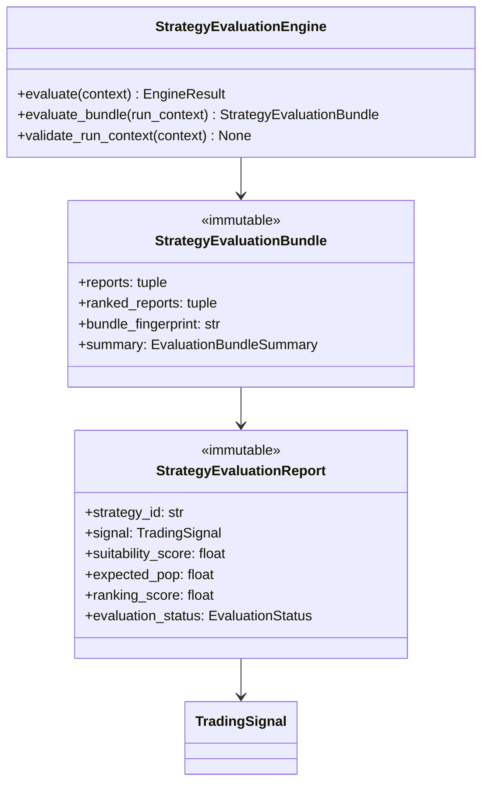

# Strategy Evaluation Engine — Software Engineering Specification

| Field | Value |
|---|---|
| **Module** | `strategy/strategy_evaluation_engine.py` |
| **Document version** | 1.0.0 |
| **Status** | Draft — ready for implementation |
| **Owner** | THETA AI TRADER Core Platform |
| **Last updated** | 2026-08-03 |

---

## 1. Purpose

`strategy/strategy_evaluation_engine.py` defines the **institutional multi-strategy evaluation engine** for THETA AI TRADER.

The engine evaluates **every enabled strategy plugin** registered in the `StrategyRegistry` against a single immutable `MarketSnapshot` and produces immutable, ranked **Strategy Evaluation Reports**. Each report captures strategy intent (`TradingSignal`), quantitative suitability metrics, informational risk/reward estimates, capital allocation hints, explainability artifacts, and non-fatal warnings.

The engine answers: *“Given this market snapshot and this registry snapshot, which strategies are suitable, how do they rank, and what structured evidence should the Trade Decision Engine use to choose among them?”*

It is **not** a trader. It does not place orders, enforce risk limits, size positions, or communicate with brokers.

### Pipeline placement

```text
[Market Data Engine]
    → MarketSnapshot (immutable)
              ↓
[Orchestrator / Bootstrap]
    StrategyRegistry.freeze() → RegistrySnapshot
              ↓
[strategy/strategy_evaluation_engine.py]
    load enabled plugins from RegistrySnapshot
    evaluate each BaseStrategy.run(StrategyContext)
    enrich signal → StrategyEvaluationReport
    rank reports deterministically
              ↓
    StrategyEvaluationBundle (immutable)
              ↓
[Trade Decision Engine]        ← primary downstream consumer (future)
    selects among ranked reports
              ↓
[Risk Engine]                  ← enforces capital protection (separate)
              ↓
[Position Sizing Engine]       ← authoritative sizing (separate)
              ↓
[Execution Intelligence]       ← broker-agnostic execution planning
```

### Goals

1. Provide a **dedicated evaluation layer** between strategy plugins and trade decision — separate from registry bookkeeping and separate from signal aggregation/conflict resolution in `StrategyEngine`.
2. Evaluate **all enabled strategies** against every eligible snapshot in a deterministic, reproducible manner.
3. Produce **immutable Strategy Evaluation Reports** with suitability scoring, expected POP, expected risk/reward categories, and capital estimates — all informational, never enforcement.
4. Support **deterministic ranking** so Trade Decision Engine receives a stable ordering for identical inputs.
5. Preserve **full explainability** — reasons, factors, warnings, and scoring component breakdown on every report.
6. Integrate cleanly with `BaseEngine`, `EngineContext`, `EngineResult`, `StrategyRegistry`, `BaseStrategy`, and `TradingSignal` without broker or execution dependencies.
7. Remain **thread-safe** for concurrent read/evaluate paths suitable for live analytical pipelines.

### Success criteria

- Orchestrator invokes `StrategyEvaluationEngine.evaluate(context)` with `MarketSnapshot` + `RegistrySnapshot` and receives immutable `StrategyEvaluationBundle`.
- Every enabled plugin in the registry snapshot is evaluated exactly once per run (unless skipped by policy).
- Identical inputs (snapshot, registry fingerprint, configuration, reference time) produce semantically equal ranked reports and identical bundle fingerprint.
- Trade Decision Engine consumes reports without importing broker SDKs or strategy plugin implementations.
- Failed individual strategy evaluations do not crash the entire bundle unless configured `fail_fast=True` or zero successful evaluations remain.
- No module under `strategy/strategy_evaluation_engine.py` imports broker clients, execution APIs, or Risk Engine types.

### Relationship to other modules

| Module | Relationship |
|---|---|
| `strategy/registry.py` | **Plugin source.** Engine reads `RegistrySnapshot.enabled_records` and resolves live `BaseStrategy` instances via injected registry or instance map. |
| `strategy/base_strategy.py` | **Evaluation contract.** Each plugin invoked via `BaseStrategy.run(StrategyContext)`. |
| `strategy/signals.py` | **Signal model.** Reports embed validated `TradingSignal` outputs. |
| `market_data/market_snapshot.py` | **Primary market input.** Every evaluation uses one immutable snapshot. |
| `core/base_engine.py` | **Foundation.** `StrategyEvaluationEngine` extends `BaseEngine`. |
| `core/engine_context.py` | **Input wrapper.** Orchestrator passes snapshot + metadata via `EngineContext`. |
| `core/engine_result.py` | **Output wrapper.** Evaluation bundle returned inside `EngineResult.payload`. |
| `core/event_bus.py` | **Optional publisher.** May emit `strategy.evaluation.*` events (extension). |
| `docs/specifications/strategy_engine.md` | **Sibling orchestrator spec.** Strategy Engine handles aggregation/conflict resolution; Evaluation Engine handles per-strategy ranked reports for trade decision. |
| `docs/specifications/trading_signal.md` | **Signal contract.** Reports reference signals; do not redefine signal schema. |
| Trade Decision Engine (future) | **Primary consumer.** Reads ranked `StrategyEvaluationBundle`. |
| Risk Engine (future) | **Downstream.** Performs authoritative risk enforcement; evaluation estimates are hints only. |
| Legacy root `strategy_engine.py` | **Migration source.** Monolithic evaluation logic migrates to plugins + this engine. |

### Distinction from Strategy Engine

| Concern | `strategy/strategy_evaluation_engine.py` | `engines/strategy_engine.py` (spec) |
|---|---|---|
| Primary output | Ranked per-strategy **evaluation reports** | Aggregated **trading signals** |
| Conflict resolution | **Out of scope** — reports preserve all strategies | In scope — produces single coherent aggregate |
| Suitability / POP / capital estimate | **In scope** — computed per report | Out of scope in v1 spec |
| Trade Decision input | **Direct consumer target** | Indirect via aggregated signals |
| Ranking | **Deterministic composite ranking** | Priority scheduling only |

Both modules may coexist: Evaluation Engine produces ranked reports; Strategy Engine may aggregate signals for event bus publication. Orchestrator chooses one or both paths based on pipeline configuration.

---

## 2. Responsibilities

`strategy/strategy_evaluation_engine.py` **is responsible for**:

| # | Responsibility | Description |
|---|---|---|
| R1 | **Registry snapshot consumption** | Load enabled strategy records from immutable `RegistrySnapshot`. |
| R2 | **Plugin instance resolution** | Resolve live `BaseStrategy` instances for each enabled record via injected registry. |
| R3 | **Context assembly** | Build immutable `StrategyContext` per evaluation from `MarketSnapshot` and pipeline metadata. |
| R4 | **Per-strategy execution** | Invoke `BaseStrategy.run()` for every eligible enabled plugin. |
| R5 | **Signal capture** | Capture and validate each plugin's `TradingSignal` output. |
| R6 | **Evaluation report production** | Materialize immutable `StrategyEvaluationReport` per strategy with enriched metrics. |
| R7 | **Suitability scoring** | Compute deterministic `suitability_score` in `0.0..100.0` combining signal confidence, snapshot quality, and family-specific heuristics. |
| R8 | **Expected POP estimation** | Compute informational `expected_pop` (probability of profit) in `0.0..1.0` from signal + snapshot heuristics — not broker margin math. |
| R9 | **Expected risk estimation** | Compute informational `expected_risk` category and optional normalized score from signal risk hints + structure family. |
| R10 | **Expected reward estimation** | Compute informational `expected_reward` category and optional normalized score from signal target hints + premium context. |
| R11 | **Capital estimate** | Produce informational `capital_estimate` hint (category + optional notional band) — not authoritative position sizing. |
| R12 | **Confidence enrichment** | Extend plugin confidence with engine-level `EvaluationConfidence` including component breakdown. |
| R13 | **Explainability preservation** | Copy signal `reasons` and `factors`; append engine-level `EvaluationFactor` entries. |
| R14 | **Warning collection** | Attach non-fatal `EvaluationWarningRecord` entries per strategy and bundle-level warnings. |
| R15 | **Deterministic ranking** | Rank reports by composite `ranking_score` with stable tie-breakers. |
| R16 | **Bundle assembly** | Produce immutable `StrategyEvaluationBundle` containing all reports and summary metadata. |
| R17 | **Evaluation validation** | Validate inputs, outputs, and cross-field consistency before sealing bundle. |
| R18 | **Partial failure handling** | Continue evaluation when individual plugins fail; record failures in reports. |
| R19 | **EngineResult integration** | Return `EngineResult` with structured status, errors, warnings, and payload. |
| R20 | **Error taxonomy** | Stable codes under `STRATEGY_EVALUATION.*`. |
| R21 | **Fingerprint / audit ID** | Compute deterministic bundle fingerprint for replay verification. |
| R22 | **Logging conventions** | Standard log events for evaluate start, per-strategy success/failure, bundle sealed. |
| R23 | **Thread-safe execution** | Safe concurrent `evaluate()` invocations on separate contexts; serialized access to shared config only. |
| R24 | **Documentation contract** | Google-style docstrings on all public types and methods. |

---

## 3. Non-Responsibilities

`strategy/strategy_evaluation_engine.py` **must not**:

| # | Non-responsibility | Rationale |
|---|---|---|
| NR1 | **Place, modify, or cancel orders** | Execution belongs in execution intelligence and broker layers. |
| NR2 | **Perform risk management or margin enforcement** | Risk Engine owns capital protection; evaluation estimates are informational. |
| NR3 | **Authorize live trading** | Trade Decision Engine and Risk Engine gate capital deployment. |
| NR4 | **Size positions authoritatively** | Position Sizing Engine consumes decisions after risk approval. |
| NR5 | **Fetch market data or call brokers** | Input is always upstream `MarketSnapshot`. |
| NR6 | **Import broker SDKs or broker clients** | No Zerodha, Kite, or vendor-specific types. |
| NR7 | **Mutate `MarketSnapshot` or `RegistrySnapshot`** | All inputs are read-only. |
| NR8 | **Mutate `StrategyRegistry` during evaluation** | Registry changes occur outside evaluation runs. |
| NR9 | **Register or unregister strategy plugins** | Registry module responsibility. |
| NR10 | **Aggregate conflicting signals into one trade intent** | Strategy Engine or Trade Decision Engine responsibility. |
| NR11 | **Resolve signal conflicts between strategies** | Reports preserve independent strategy outcomes. |
| NR12 | **Compute broker margin or exact P&L** | Requires broker APIs; out of scope. |
| NR13 | **Calculate Greeks or IV surfaces** | Greeks Engine produces inputs; strategies may consume via snapshot attachments in future — not v1 dependency. |
| NR14 | **Detect market regime directly** | Regime labels may appear as optional orchestrator hints in context tags. |
| NR15 | **Persist evaluation results to disk or database** | External persistence concern. |
| NR16 | **Load environment variables or config files** | Accept injected `StrategyEvaluationEngineConfig` at construction. |
| NR17 | **Call other analytical engines directly** | Orchestrator assembles inputs; no peer engine imports. |
| NR18 | **Implement UI or dashboard rendering** | Consumers read `EngineResult` or subscribe to events. |

---

## 4. Architecture

### 4.1 Layered design

```text
┌─────────────────────────────────────────────────────────────────────────┐
│              strategy/strategy_evaluation_engine.py                      │
│  (multi-strategy evaluator — no broker, no risk enforcement)           │
│                                                                          │
│  ┌────────────────────┐  ┌────────────────────┐  ┌──────────────────┐  │
│  │ StrategyEvaluation │  │ EvaluationRunner   │  │ Scoring &        │  │
│  │ Engine             │→ │ (sequential/       │→ │ Ranking Layer    │  │
│  │ (extends BaseEngine│  │  parallel policy)  │  │                  │  │
│  └─────────┬──────────┘  └─────────┬──────────┘  └────────┬─────────┘  │
│            │                       │                        │            │
│  ┌─────────▼───────────────────────▼────────────────────────▼─────────┐  │
│  │ Input Validator · Context Builder · Report Builder · Bundle Sealer  │  │
│  └────────────────────────────────────────────────────────────────────┘  │
└──────────────────────────────┬──────────────────────────────────────────┘
                               │
         RegistrySnapshot + MarketSnapshot + StrategyRegistry (instance lookup)
                               │
                               ▼
              StrategyEvaluationBundle (immutable, ranked reports)
                               │
                               ▼
                    Trade Decision Engine (future)
```

### 4.2 Design principles

- **Single responsibility** — evaluate enabled strategies and produce ranked reports; nothing else.
- **Immutable I/O** — all inputs and outputs are frozen dataclasses.
- **Deterministic ranking** — identical inputs produce identical report order and scores.
- **Fail partial, not silent** — individual plugin failures become failed reports with error records; bundle still produced.
- **Informational quant metrics** — POP, risk, reward, capital are estimates/hints, never enforcement.
- **Explainability first** — every score decomposes into named components with weights.
- **Thread-safe service** — engine instance safe for concurrent evaluations on independent contexts.
- **No hidden globals** — registry and config injected at construction.
- **Audit-grade fingerprints** — bundle fingerprint covers snapshot IDs, registry fingerprint, reports content.

### 4.3 Component responsibilities

| Component | Role |
|---|---|
| `StrategyEvaluationEngine` | Public `BaseEngine` implementation; orchestrates full evaluation run. |
| `StrategyEvaluationEngineConfig` | Frozen policy: parallelism, failure mode, scoring weights, skip rules. |
| `EvaluationRunContext` | Immutable per-run inputs: snapshot, registry snapshot, mode, tags. |
| `EvaluationRunner` | Executes plugins sequentially or in parallel pool per config. |
| `StrategyEvaluationReport` | Immutable per-strategy evaluation outcome with metrics. |
| `StrategyEvaluationBundle` | Immutable collection of ranked reports + summary. |
| `EvaluationScorer` | Stateless scorer computing suitability, POP, risk, reward, capital, ranking. |
| `EvaluationValidator` | Validates run inputs and sealed reports. |
| `EvaluationReportBuilder` | Assembles report from signal + scorer outputs + warnings. |

### 4.4 Dependency direction

```text
orchestrator           →  strategy/strategy_evaluation_engine.py
Trade Decision Engine  →  strategy/strategy_evaluation_engine.py (reads bundle types)
strategy_evaluation_engine.py  →  strategy/registry.py
strategy_evaluation_engine.py  →  strategy/base_strategy.py
strategy_evaluation_engine.py  →  strategy/signals.py
strategy_evaluation_engine.py  →  market_data/market_snapshot.py
strategy_evaluation_engine.py  →  core/base_engine.py
strategy_evaluation_engine.py  →  stdlib
```

**Forbidden imports:** broker clients, execution modules, risk manager modules, legacy root `strategy_engine.py`.

### 4.5 Relationship diagram



---

## 5. Data Model

All public outward-facing types are **immutable dataclasses** (`frozen=True`) unless noted.

### 5.1 Type hierarchy

```text
StrategyEvaluationEngine (mutable service, extends BaseEngine)
├── config: StrategyEvaluationEngineConfig
├── registry: StrategyRegistry (injected, read-only during evaluate)
└── scorer: EvaluationScorer (stateless)

EvaluationRunContext (immutable)
StrategyEvaluationReport (immutable)
StrategyEvaluationBundle (immutable)
EvaluationBundleSummary (immutable)
EvaluationConfidence (immutable)
ExpectedRiskEstimate (immutable)
ExpectedRewardEstimate (immutable)
CapitalEstimate (immutable)
EvaluationFactor (immutable)
EvaluationWarningRecord (immutable)
EvaluationErrorRecord (immutable)
StrategyEvaluationEngineConfig (immutable)
EvaluationScoringPolicy (immutable)
EvaluationSkipPolicy (immutable)
```

### 5.2 Enumerations

#### `EvaluationStatus`

| Value | Description |
|---|---|
| `SUCCESS` | Strategy evaluated; signal captured and enriched. |
| `ABSTAIN` | Strategy returned abstain/no-trade signal; report still produced. |
| `FAILED` | Strategy execution or signal validation failed. |
| `SKIPPED` | Strategy not evaluated due to skip policy (e.g. unsupported underlying). |
| `TIMEOUT` | Strategy execution exceeded configured timeout (optional v1). |

#### `EvaluationOutcomeClass`

| Value | Description |
|---|---|
| `ACTIONABLE` | Signal action suitable for downstream decision (`EVALUATE`). |
| `MONITOR` | Wait/monitor action — included in bundle but lower rank tier. |
| `NO_TRADE` | Explicit no-trade or abstain — included with zero suitability tier. |
| `ERROR` | Evaluation failed — ranking score zero. |

#### `RiskEstimateCategory`

| Value | Description |
|---|---|
| `VERY_LOW` | Minimal structural risk hint. |
| `LOW` | Low informational risk. |
| `MODERATE` | Moderate informational risk. |
| `ELEVATED` | Elevated informational risk. |
| `HIGH` | High informational risk. |
| `UNDEFINED` | Undefined / unlimited risk structure hint. |
| `UNKNOWN` | Insufficient data to classify. |

#### `RewardEstimateCategory`

| Value | Description |
|---|---|
| `VERY_LOW` | Minimal reward potential hint. |
| `LOW` | Low reward potential. |
| `MODERATE` | Moderate reward potential. |
| `HIGH` | High reward potential. |
| `VERY_HIGH` | Very high reward potential (relative to risk hint). |
| `UNKNOWN` | Insufficient data. |

#### `CapitalEstimateCategory`

| Value | Description |
|---|---|
| `MINIMAL` | Minimal capital allocation hint. |
| `SMALL` | Small allocation band. |
| `MODERATE` | Moderate allocation band. |
| `LARGE` | Large allocation band. |
| `VERY_LARGE` | Very large allocation band. |
| `UNKNOWN` | Insufficient data. |

#### `EvaluationParallelismMode`

| Value | Description |
|---|---|
| `SEQUENTIAL` | Evaluate plugins one at a time (default, deterministic). |
| `PARALLEL` | Evaluate plugins concurrently up to `max_parallelism`. |

#### `EvaluationFailureMode`

| Value | Description |
|---|---|
| `CONTINUE` | Record failure; continue remaining plugins (default). |
| `FAIL_FAST` | Abort remaining plugins on first failure. |

### 5.3 `EvaluationRunContext` fields

| Field | Type | Required | Description |
|---|---|---|---|
| `correlation_id` | `str` | Yes | Pipeline correlation identifier. |
| `as_of` | timezone-aware datetime | Yes | Decision timestamp; typically snapshot provenance. |
| `snapshot` | `MarketSnapshot` | Yes | Canonical market observation. |
| `registry_snapshot` | `RegistrySnapshot` | Yes | Frozen registry state for this run. |
| `execution_mode` | `StrategyExecutionMode` | No | Default `LIVE`. |
| `reference_time` | timezone-aware datetime | No | Wall-clock for staleness; defaults to `as_of`. |
| `tags` | immutable mapping | No | Orchestrator hints (regime label, session tag). |

### 5.4 `StrategyEvaluationReport` fields

| Field | Type | Required | Description |
|---|---|---|---|
| `report_id` | `str` | Yes | Deterministic report identifier. |
| `strategy_id` | `str` | Yes | Plugin identifier. |
| `strategy_version` | `str` | Yes | Plugin version at evaluation time. |
| `strategy_family` | `StrategyFamily` | Yes | Canonical family. |
| `display_name` | `str` | Yes | Human-readable name from registry record. |
| `plugin_priority` | `int` | Yes | Registry priority at evaluation time. |
| `evaluation_status` | `EvaluationStatus` | Yes | Per-strategy evaluation outcome. |
| `outcome_class` | `EvaluationOutcomeClass` | Yes | High-level classification for ranking tiers. |
| `signal` | `TradingSignal | None` | No | Captured signal; `None` only when `FAILED` or `SKIPPED`. |
| `suitability_score` | `float` | Yes | Composite suitability in `0.0..100.0`. |
| `ranking_score` | `float` | Yes | Composite ranking key in `0.0..100.0`. |
| `confidence` | `EvaluationConfidence` | Yes | Enriched confidence with engine components. |
| `expected_pop` | `float` | Yes | Informational probability of profit in `0.0..1.0`. |
| `expected_risk` | `ExpectedRiskEstimate` | Yes | Informational risk estimate. |
| `expected_reward` | `ExpectedRewardEstimate` | Yes | Informational reward estimate. |
| `capital_estimate` | `CapitalEstimate` | Yes | Informational capital allocation hint. |
| `reasons` | `tuple[str, ...]` | Yes | Explainability bullets (signal + engine). |
| `factors` | `tuple[EvaluationFactor, ...]` | Yes | Machine-readable scoring factors. |
| `warnings` | `tuple[EvaluationWarningRecord, ...]` | Yes | Non-fatal warnings for this report. |
| `errors` | `tuple[EvaluationErrorRecord, ...]` | Yes | Errors when status is `FAILED`. |
| `evaluated_at` | timezone-aware datetime | Yes | Timestamp when evaluation completed. |
| `duration_ms` | `float` | Yes | Plugin evaluation duration in milliseconds. |
| `registry_record_fingerprint` | `str` | Yes | Metadata fingerprint from registration record. |
| `metadata` | immutable mapping | No | Extension labels. |

### 5.5 `StrategyEvaluationBundle` fields

| Field | Type | Required | Description |
|---|---|---|---|
| `bundle_id` | `str` | Yes | Deterministic bundle identifier. |
| `correlation_id` | `str` | Yes | Pipeline correlation identifier. |
| `snapshot_id` | `str` | Yes | Input market snapshot ID. |
| `registry_fingerprint` | `str` | Yes | Input registry snapshot fingerprint. |
| `execution_mode` | `StrategyExecutionMode` | Yes | Mode used for evaluation. |
| `evaluated_at` | timezone-aware datetime | Yes | Bundle seal timestamp. |
| `reports` | `tuple[StrategyEvaluationReport, ...]` | Yes | All reports in registry priority order. |
| `ranked_reports` | `tuple[StrategyEvaluationReport, ...]` | Yes | Reports sorted by ranking policy. |
| `summary` | `EvaluationBundleSummary` | Yes | Denormalized aggregate statistics. |
| `bundle_fingerprint` | `str` | Yes | Deterministic content hash. |
| `warnings` | `tuple[EvaluationWarningRecord, ...]` | Yes | Bundle-level warnings. |
| `metadata` | immutable mapping | No | Extension labels. |

### 5.6 `EvaluationBundleSummary` fields

| Field | Type | Description |
|---|---|---|
| `total_registered` | `int` | Count of records in registry snapshot. |
| `total_enabled` | `int` | Count of enabled records at evaluation time. |
| `total_evaluated` | `int` | Plugins actually invoked. |
| `total_success` | `int` | Reports with `EvaluationStatus.SUCCESS`. |
| `total_abstain` | `int` | Reports with abstain/no-trade outcome. |
| `total_failed` | `int` | Reports with `EvaluationStatus.FAILED`. |
| `total_skipped` | `int` | Reports with `EvaluationStatus.SKIPPED`. |
| `total_actionable` | `int` | Reports with `outcome_class=ACTIONABLE`. |
| `top_strategy_id` | `str | None` | Highest-ranked strategy ID; `None` if none actionable. |
| `top_suitability_score` | `float | None` | Top suitability score. |
| `top_ranking_score` | `float | None` | Top ranking score. |

### 5.7 Global invariants

1. `StrategyEvaluationReport.strategy_id` is unique within a bundle.
2. `ranked_reports` is a permutation of `reports` — same elements, different sort order.
3. `suitability_score`, `ranking_score`, `confidence.overall_score`, and `expected_pop` are always finite and within documented bounds.
4. `signal` is non-null when `evaluation_status` is `SUCCESS` or `ABSTAIN`.
5. `signal` is null when `evaluation_status` is `FAILED` or `SKIPPED`.
6. `FAILED` reports have non-empty `errors`.
7. `bundle_fingerprint` changes iff semantic report content changes.
8. Engine never mutates input snapshots or registry during evaluation.

---

## 6. Evaluation Lifecycle

### 6.1 Run lifecycle

```text
[Construction]
    → validate StrategyEvaluationEngineConfig
    → inject StrategyRegistry reference

[evaluate(run_context)]
    → validate EvaluationRunContext
    → validate registry_snapshot matches live registry fingerprint (optional strict mode)
    → build StrategyContext template from snapshot
    → iterate enabled_records from registry_snapshot
    → for each record: resolve plugin → run → score → build report
    → rank reports
    → seal StrategyEvaluationBundle
    → wrap in EngineResult
    → log strategy.evaluation.complete

[Shutdown]
    → discard engine instance
```

### 6.2 Per-strategy evaluation state machine

```text
            start evaluation
                  │
                  ▼
         ┌────────────────┐
         │ skip policy?   │──yes──► SKIPPED report
         └───────┬────────┘
                 │ no
                 ▼
         ┌────────────────┐
         │ run plugin     │
         └───────┬────────┘
                 │
        ┌────────┴────────┐
        │                 │
     success           exception/invalid signal
        │                 │
        ▼                 ▼
  classify signal    FAILED report
  action
        │
   ┌────┴────┬──────────┐
   │         │          │
EVALUATE  WAIT/     NO_TRADE/
          ABSTAIN   ABSTAIN
   │         │          │
   ▼         ▼          ▼
SUCCESS   ABSTAIN   ABSTAIN
ACTIONABLE MONITOR   NO_TRADE
```

### 6.3 Idempotency rules

| Operation | Idempotent when |
|---|---|
| `evaluate()` same context twice | Produces semantically equal bundle (timestamps may differ unless clock injected) |
| Scoring functions | Pure functions of signal + snapshot + config |
| Ranking | Pure function of report scores |

### 6.4 Zero enabled strategies

When `registry_snapshot.enabled_count == 0`:

- Engine returns valid empty bundle.
- `EngineStatus.SUCCESS` with warning `STRATEGY_EVALUATION.EMPTY_ENABLED_SET`.
- Trade Decision Engine treats as explicit abstain path.

### 6.5 Clock injection

All timestamps timezone-aware. Engine accepts injected `clock: Callable[[], datetime]` for test determinism (default: UTC now).

---

## 7. Registry Integration

### 7.1 Loading enabled strategies

The engine **does not** call mutable registry listing methods during evaluation. It reads from the immutable `RegistrySnapshot` passed in `EvaluationRunContext`:

```text
for record in registry_snapshot.enabled_records:
    strategy = registry.get(record.strategy_id)
    evaluate(strategy, record)
```

### 7.2 Registry instance requirement

Construction requires injected `StrategyRegistry`:

| Rule ID | Rule |
|---|---|
| REG-001 | Registry must contain all `strategy_id` values referenced in `registry_snapshot.enabled_records`. |
| REG-002 | Missing plugin instance → `FAILED` report with `STRATEGY_EVALUATION.REGISTRY.PLUGIN_MISSING`. |
| REG-003 | Plugin metadata fingerprint mismatch vs record → warning `STRATEGY_EVALUATION.REGISTRY.METADATA_DRIFT`. |
| REG-004 | Engine must not call `register`, `unregister`, `freeze` during evaluation. |
| REG-005 | `registry_snapshot.freeze_state` is informational only — engine does not mutate registry freeze state. |

### 7.3 Strict registry consistency mode

When `StrategyEvaluationEngineConfig.strict_registry_match=True`:

- Engine verifies `registry.snapshot().registry_fingerprint == registry_snapshot.registry_fingerprint` before evaluation.
- Mismatch → `EngineStatus.REJECTED` with `STRATEGY_EVALUATION.REGISTRY.FINGERPRINT_MISMATCH`.

Default: `strict_registry_match=False` (trust orchestrator-supplied snapshot).

### 7.4 Evaluation ordering vs ranking

| Ordering | Purpose | Sort key |
|---|---|---|
| **Execution order** | Deterministic plugin invocation sequence | Registry priority desc, `strategy_id` asc (same as registry) |
| **Ranked output** | Trade Decision consumption | `ranking_score` desc, `suitability_score` desc, `plugin_priority` desc, `strategy_id` asc |

Execution order and ranked output order **may differ**.

---

## 8. Strategy Execution Workflow

### 8.1 `evaluate()` sequence

```text
evaluate(run_context: EvaluationRunContext) -> EngineResult

1. Acquire run lock (if parallelism config requires)
2. validate_run_context(run_context)
3. Optionally verify registry fingerprint (strict mode)
4. Initialize empty report list, warnings, errors
5. For each record in registry_snapshot.enabled_records (execution order):
   a. Apply EvaluationSkipPolicy
   b. Resolve BaseStrategy via registry.get(strategy_id)
   c. Build StrategyContext from run_context + record
   d. Start timer
   e. Invoke strategy.run(context) inside try/except
   f. Validate returned TradingSignal
   g. Classify outcome (SUCCESS/ABSTAIN/FAILED)
   h. Invoke EvaluationScorer.score(report_inputs)
   i. Build StrategyEvaluationReport via EvaluationReportBuilder
   j. Append report; handle FAIL_FAST if configured
6. Rank all reports → ranked_reports
7. Build EvaluationBundleSummary
8. Compute bundle_fingerprint
9. Seal StrategyEvaluationBundle
10. Map to EngineStatus
11. Log strategy.evaluation.complete
12. Return EngineResult
```

### 8.2 `StrategyContext` construction

Built per plugin from `EvaluationRunContext`:

| Field | Source |
|---|---|
| `correlation_id` | `run_context.correlation_id` |
| `as_of` | `run_context.as_of` |
| `snapshot` | `run_context.snapshot` |
| `execution_mode` | `run_context.execution_mode` |
| `tags` | merge `run_context.tags` + optional record tags |
| `prior_signals` | empty tuple in v1 |

### 8.3 Skip policy

`EvaluationSkipPolicy` (frozen config) defines skip conditions:

| Skip condition | Result |
|---|---|
| Underlying not in `metadata.supported_underlyings` (when non-empty) | `SKIPPED` + warning |
| Snapshot contract count below `min_contracts_required` | `SKIPPED` + warning |
| `requires_volatility_snapshot=True` and `snapshot.volatility is None` | `SKIPPED` + warning |
| Record state not `REGISTERED` in snapshot | `SKIPPED` (should not appear in enabled_records) |

Skipped strategies produce reports with zero scores — they appear in bundle for audit transparency.

### 8.4 Signal validation after plugin run

After `BaseStrategy.run()` returns:

1. Assert non-null `TradingSignal`.
2. Delegate to `validate_trading_signal` from `strategy/signals.py` with `SignalValidationContext`.
3. Cross-check `signal.strategy_id == record.strategy_id`.
4. On validation failure → `FAILED` report; signal not embedded.

### 8.5 Exception handling

| Exception type | Report status | Error code |
|---|---|---|
| `StrategyContextError` | `FAILED` | `STRATEGY_EVALUATION.PLUGIN.CONTEXT_INVALID` |
| `StrategySignalError` | `FAILED` | `STRATEGY_EVALUATION.PLUGIN.SIGNAL_INVALID` |
| `EngineExecutionError` | `FAILED` | `STRATEGY_EVALUATION.PLUGIN.EXECUTION_FAILED` |
| `StrategyRegistryNotFoundError` | `FAILED` | `STRATEGY_EVALUATION.REGISTRY.PLUGIN_MISSING` |
| Unexpected `Exception` | `FAILED` | `STRATEGY_EVALUATION.PLUGIN.UNEXPECTED` |

Never swallow failures silently.

---

## 9. Scoring and Ranking

### 9.1 Scoring pipeline

```text
TradingSignal + MarketSnapshot + StrategyRegistrationRecord + Config
              ↓
    EvaluationScorer (stateless)
              ↓
    ┌─────────┼─────────┬─────────────┬──────────────┐
    ▼         ▼         ▼             ▼              ▼
suitability  expected   expected      expected      capital
  _score       _pop      _risk         _reward      _estimate
              ↓
         ranking_score (composite)
```

### 9.2 `EvaluationScorer` contract

Stateless class or module functions:

```python
def score(
    *,
    signal: TradingSignal,
    snapshot: MarketSnapshot,
    record: StrategyRegistrationRecord,
    policy: EvaluationScoringPolicy,
) -> EvaluationScoreResult: ...
```

Returns immutable `EvaluationScoreResult` containing all metric fields and factor breakdown.

### 9.3 Ranking policy

Default composite `ranking_score`:

```text
ranking_score = (
    w_suitability * suitability_score +
    w_confidence  * confidence.overall_score +
    w_pop         * (expected_pop * 100.0) +
    w_priority    * normalize(record.priority, 0, 1000)
) / (w_suitability + w_confidence + w_pop + w_priority)
```

Default weights from `EvaluationScoringPolicy`:

| Component | Default weight |
|---|---|
| suitability | 0.40 |
| confidence | 0.30 |
| expected_pop | 0.20 |
| registry priority | 0.10 |

### 9.4 Ranking tie-breakers

When `ranking_score` equal within epsilon (`1e-9`):

1. Higher `suitability_score`
2. Higher `confidence.overall_score`
3. Higher `expected_pop`
4. Higher `plugin_priority`
5. Lexicographic `strategy_id` ascending

### 9.5 Outcome class tier caps

| Outcome class | Max ranking_score |
|---|---|
| `ACTIONABLE` | 100.0 (uncapped by tier) |
| `MONITOR` | min(computed, 60.0) |
| `NO_TRADE` | min(computed, 20.0) |
| `ERROR` | 0.0 |

Tier caps ensure Trade Decision Engine can filter by `outcome_class` without re-scoring.

### 9.6 Determinism requirements

- All scoring functions must be pure — no randomness, no wall-clock side effects.
- Floating-point results rounded to **4 decimal places** at seal time for fingerprint stability.
- Identical inputs → identical scores after rounding.

---

## 10. Suitability Score

### 10.1 Purpose

`suitability_score` expresses **how well the current market snapshot matches the strategy family's ideal conditions**, combining plugin confidence with snapshot-quality and family-specific heuristics.

Range: `0.0..100.0` inclusive.

### 10.2 Suitability components (default policy)

| Component | Weight | Description |
|---|---|---|
| `signal_confidence` | 0.35 | Normalized `signal.confidence.score`. |
| `snapshot_quality` | 0.20 | From `snapshot.quality.validation_status` mapping. |
| `freshness` | 0.15 | From `snapshot.freshness` usability for execution mode. |
| `family_fit` | 0.20 | Heuristic fit of vol/chain context to strategy family. |
| `liquidity_hint` | 0.10 | Bid-ask spread quality proxy from ATM contracts. |

### 10.3 Snapshot quality mapping

| `SnapshotValidationStatus` | Multiplier |
|---|---|
| `VALID` | 1.00 |
| `PARTIAL` | 0.70 |
| `INVALID` | 0.00 |

When multiplier is 0.00 and mode is `LIVE`, suitability capped at 10.0 with warning.

### 10.4 Family fit heuristics (v1)

Informational heuristics only — not regime detection:

| Strategy family | Elevated suitability when |
|---|---|
| `SHORT_STRANGLE` | VIX elevated vs snapshot historical placeholder; neutral direction signal |
| `IRON_CONDOR` | Range-bound direction; sufficient strikes each side |
| `BULL_PUT_SPREAD` | Bullish direction signal; put chain liquidity |
| `BEAR_CALL_SPREAD` | Bearish direction signal; call chain liquidity |
| `LONG_VOLATILITY` | Low VIX percentile hint; long vol direction |
| `NO_STRATEGY` | Always 0.0 |

Heuristics read only from `MarketSnapshot` and `TradingSignal` — no external data fetch.

### 10.5 Suitability rules

| Rule ID | Rule |
|---|---|
| SUIT-001 | `suitability_score` must be finite and in `[0.0, 100.0]`. |
| SUIT-002 | `ABSTAIN`/`NO_TRADE` signals cap suitability at 25.0 unless configured otherwise. |
| SUIT-003 | Each component recorded as `EvaluationFactor` with weight and raw value. |
| SUIT-004 | Suitability must not incorporate broker margin or account balance. |

---

## 11. Expected POP (Probability of Profit)

### 11.1 Purpose

`expected_pop` provides an **informational estimate** of probability of profit for the suggested structure — derived from signal confidence, strategy family priors, and snapshot volatility context.

Range: `0.0..1.0` inclusive.

**This is not** a broker-computed probability, Monte Carlo simulation, or guaranteed statistical forecast. It is a **deterministic heuristic score** for ranking and explainability.

### 11.2 POP estimation model (v1 heuristic)

```text
base_pop = signal.confidence.score / 100.0

family_prior = EVALUATION_FAMILY_POP_PRIORS[strategy_family]
  # e.g. SHORT_STRANGLE: 0.62, IRON_CONDOR: 0.58, LONG_VOLATILITY: 0.45

vol_adjustment = f(snapshot.volatility.vix_percentile_hint)
  # if volatility unavailable → 0.0 adjustment

action_adjustment:
  EVALUATE  → +0.05
  WAIT      → -0.10
  NO_TRADE  → 0.0 (report still produced)
  ABSTAIN   → 0.0

expected_pop = clamp(base_pop * 0.5 + family_prior * 0.3 + vol_adjustment + action_adjustment, 0.0, 1.0)
```

### 11.3 Default family priors (configurable)

| Strategy family | Default prior |
|---|---|
| `SHORT_STRANGLE` | 0.62 |
| `IRON_CONDOR` | 0.58 |
| `BULL_PUT_SPREAD` | 0.55 |
| `BEAR_CALL_SPREAD` | 0.55 |
| `BROKEN_WING_BUTTERFLY` | 0.52 |
| `JADE_LIZARD` | 0.60 |
| `LONG_VOLATILITY` | 0.42 |
| `CUSTOM` | 0.50 |
| `NO_STRATEGY` | 0.0 |

Stored in `EvaluationScoringPolicy.family_pop_priors` immutable mapping.

### 11.4 POP rules

| Rule ID | Rule |
|---|---|
| POP-001 | `expected_pop` must be finite and in `[0.0, 1.0]`. |
| POP-002 | POP must not be labeled as guaranteed or broker-verified in metadata. |
| POP-003 | POP computation recorded as `EvaluationFactor` entries. |
| POP-004 | When signal action is `NO_TRADE`/`ABSTAIN`, POP still computed but capped at 0.25. |

---

## 12. Expected Risk

### 12.1 Purpose

`ExpectedRiskEstimate` captures **informational risk characteristics** of the evaluated setup — supporting Trade Decision Engine filtering before authoritative Risk Engine analysis.

**Does not** compute currency loss amounts, margin requirements, or enforce limits.

### 12.2 `ExpectedRiskEstimate` fields

| Field | Type | Required | Description |
|---|---|---|---|
| `category` | `RiskEstimateCategory` | Yes | Ordinal risk category. |
| `normalized_score` | `float` | Yes | `0.0..100.0` where higher = more risk. |
| `profile_hint` | `RiskProfileHint | None` | No | From signal risk metadata or strategy metadata. |
| `max_loss_category` | `str | None` | No | Ordinal hint, e.g. `"MEDIUM"`. |
| `tail_risk_hint` | `RiskLevelHint | None` | No | From signal risk metadata. |
| `gamma_risk_hint` | `RiskLevelHint | None` | No | From signal risk metadata. |
| `vega_risk_hint` | `RiskLevelHint | None` | No | From signal risk metadata. |
| `method` | `str` | Yes | Scoring method identifier, e.g. `"heuristic_v1"`. |
| `factors` | `tuple[EvaluationFactor, ...]` | Yes | Component breakdown. |
| `notes` | `str | None` | No | Short human-readable summary. |

### 12.3 Risk category derivation (v1)

Priority order:

1. If `signal.risk.profile == UNDEFINED` → category `UNDEFINED`, normalized_score ≥ 75.
2. Else map `signal.risk.max_loss_category` if present.
3. Else family defaults:
   - Spreads / condors → `MODERATE`
   - Short strangle → `ELEVATED`
   - Long volatility → `MODERATE`
4. Adjust upward for `tail_risk`, `gamma_risk`, `vega_risk` hints == `HIGH`.

### 12.4 Expected risk rules

| Rule ID | Rule |
|---|---|
| RISK-001 | Must not contain currency amounts or lot counts. |
| RISK-002 | Must not contain `approved=False/True`. |
| RISK-003 | `normalized_score` in `[0.0, 100.0]`. |
| RISK-004 | Undefined-risk structures must never receive category `VERY_LOW`. |

---

## 13. Expected Reward

### 13.1 Purpose

`ExpectedRewardEstimate` captures **informational reward potential** of the evaluated setup relative to its risk hint — supporting reward/risk ratio filtering in Trade Decision Engine.

### 13.2 `ExpectedRewardEstimate` fields

| Field | Type | Required | Description |
|---|---|---|---|
| `category` | `RewardEstimateCategory` | Yes | Ordinal reward category. |
| `normalized_score` | `float` | Yes | `0.0..100.0` where higher = more reward potential. |
| `target_hint_type` | `TargetHintType | None` | No | From signal target hint. |
| `risk_reward_hint` | `float | None` | No | Informational R:R ratio hint if derivable. |
| `method` | `str` | Yes | Scoring method identifier. |
| `factors` | `tuple[EvaluationFactor, ...]` | Yes | Component breakdown. |
| `notes` | `str | None` | No | Short summary. |

### 13.3 Reward category derivation (v1)

Sources:

- `signal.target` hint type and value
- Premium decay targets → higher reward for short premium families
- `signal.confidence.score` as secondary input
- Family defaults for income strategies vs long vol

### 13.4 Reward/risk ratio hint

When both risk and reward normalized scores available:

```text
risk_reward_hint = expected_reward.normalized_score / max(expected_risk.normalized_score, 1.0)
```

Informational only — not used for position sizing.

### 13.5 Expected reward rules

| Rule ID | Rule |
|---|---|
| RW-001 | Must not contain currency profit amounts. |
| RW-002 | Must not contain broker target prices. |
| RW-003 | `normalized_score` in `[0.0, 100.0]`. |

---

## 14. Capital Estimate

### 14.1 Purpose

`CapitalEstimate` provides an **informational capital allocation band hint** for Trade Decision Engine pre-filtering — **not** authoritative position sizing.

### 14.2 `CapitalEstimate` fields

| Field | Type | Required | Description |
|---|---|---|---|
| `category` | `CapitalEstimateCategory` | Yes | Ordinal capital band. |
| `normalized_score` | `float` | Yes | `0.0..100.0` relative capital intensity hint. |
| `allocation_percent_hint` | `float | None` | No | Suggested % of evaluation capital pool (informational). |
| `margin_intensity` | `MarginIntensityHint | None` | No | From signal risk metadata. |
| `method` | `str` | Yes | Estimation method identifier. |
| `factors` | `tuple[EvaluationFactor, ...]` | Yes | Component breakdown. |
| `notes` | `str | None` | No | Short summary. |

### 14.3 Capital estimation model (v1)

Derived from:

| Input | Effect |
|---|---|
| `margin_intensity` hint | Primary band mapping |
| Strategy family | Short strangle → higher intensity than defined-risk spreads |
| Structure leg count from `signal.structure` | More legs → higher intensity |
| `EvaluationScoringPolicy.default_capital_pool_hint` | Optional pool for percent hint |

**Never reads account balance.** `allocation_percent_hint` is relative to configured evaluation pool only.

### 14.4 Category mapping (default)

| Margin intensity | Category |
|---|---|
| `LOW` | `SMALL` |
| `MODERATE` | `MODERATE` |
| `HIGH` | `LARGE` |
| `UNKNOWN` | `UNKNOWN` |

### 14.5 Capital estimate rules

| Rule ID | Rule |
|---|---|
| CAP-001 | Must not contain absolute currency amounts tied to live account. |
| CAP-002 | Must not contain lot counts or order quantities. |
| CAP-003 | Position Sizing Engine may ignore capital estimate entirely. |

---

## 15. Confidence and Explainability

### 15.1 `EvaluationConfidence` fields

| Field | Type | Required | Description |
|---|---|---|---|
| `overall_score` | `float` | Yes | `0.0..100.0` composite confidence. |
| `band` | `ConfidenceBand` | Yes | Derived from overall_score. |
| `signal_confidence` | `SignalConfidence` | Yes | Original plugin confidence snapshot. |
| `engine_adjustment` | `float` | Yes | Delta applied by engine (-100..+100 clamped net effect). |
| `method` | `str` | Yes | e.g. `"evaluation_engine_v1"`. |
| `components` | `tuple[EvaluationFactor, ...]` | Yes | Weighted breakdown. |

### 15.2 Confidence enrichment

```text
overall_score = clamp(
    signal.confidence.score + engine_adjustment,
    0.0, 100.0
)

engine_adjustment = sum of:
  snapshot_quality_bonus   (-10..+5)
  freshness_bonus          (-15..+5)
  validation_penalty       (0 or -20 for partial snapshot in LIVE)
```

### 15.3 `EvaluationFactor` fields

| Field | Type | Required | Description |
|---|---|---|---|
| `factor_id` | `str` | Yes | Stable identifier, e.g. `"snapshot_quality"`. |
| `label` | `str` | Yes | Human-readable label. |
| `weight` | `float` | Yes | Weight in parent composite. |
| `raw_value` | `float` | Yes | Unnormalized input value. |
| `normalized_value` | `float` | Yes | Normalized contribution. |
| `direction` | `str` | Yes | `"POSITIVE"`, `"NEGATIVE"`, or `"NEUTRAL"`. |
| `notes` | `str | None` | No | Optional detail. |

### 15.4 Explainability rules

| Rule ID | Rule |
|---|---|
| EXP-001 | Every report must have non-empty `reasons`. |
| EXP-002 | `FAILED` reports must include error message in reasons. |
| EXP-003 | `factors` must contain at least one entry for `SUCCESS` reports. |
| EXP-004 | Signal `reasons` preserved in order before engine reasons appended. |
| EXP-005 | No factor may reference broker order parameters. |

---

## 16. Warnings

### 16.1 `EvaluationWarningRecord` fields

| Field | Type | Required | Description |
|---|---|---|---|
| `code` | `str` | Yes | Stable warning code under `STRATEGY_EVALUATION.*`. |
| `message` | `str` | Yes | Human-readable description. |
| `strategy_id` | `str | None` | No | Related strategy; `None` for bundle-level. |
| `field` | `str | None` | No | Related field path. |
| `severity` | `str` | Yes | `"INFO"`, `"WARNING"`, or `"CRITICAL"`. |

### 16.2 Per-strategy warning examples

| Code | When |
|---|---|
| `STRATEGY_EVALUATION.SNAPSHOT.PARTIAL_QUALITY` | Partial snapshot quality in LIVE mode |
| `STRATEGY_EVALUATION.SNAPSHOT.STALE` | Freshness below threshold |
| `STRATEGY_EVALUATION.REGISTRY.METADATA_DRIFT` | Live plugin fingerprint differs from record |
| `STRATEGY_EVALUATION.SCORE.LOW_SUITABILITY` | suitability_score below policy threshold |
| `STRATEGY_EVALUATION.SIGNAL.DOWNGRADED` | Signal action downgraded by semantic rules |

### 16.3 Bundle-level warning examples

| Code | When |
|---|---|
| `STRATEGY_EVALUATION.EMPTY_ENABLED_SET` | Zero enabled strategies |
| `STRATEGY_EVALUATION.ALL_ABSTAIN` | All reports abstained |
| `STRATEGY_EVALUATION.PARTIAL_FAILURE` | Some plugins failed |
| `STRATEGY_EVALUATION.NO_ACTIONABLE` | Zero actionable reports |
| `STRATEGY_EVALUATION.REGISTRY.FINGERPRINT_MISMATCH` | Non-strict drift detected |

### 16.4 Warning rules

| Rule ID | Rule |
|---|---|
| WARN-001 | Warnings never change immutable input data. |
| WARN-002 | CRITICAL warnings attached to `EngineResult.warnings` AND report/bundle. |
| WARN-003 | Duplicate warning codes for same strategy deduplicated in report. |

---

## 17. Validation

### 17.1 Input validation (`validate_run_context`)

| Rule ID | Condition | Action |
|---|---|---|
| IN-001 | `snapshot` is None | raise `StrategyEvaluationValidationError` |
| IN-002 | `registry_snapshot` is None | raise |
| IN-003 | `correlation_id` empty | raise |
| IN-004 | `as_of` naive datetime | raise |
| IN-005 | `snapshot.provenance.as_of` naive | raise |
| IN-006 | `snapshot.quality.validation_status == INVALID` | `REJECTED` (configurable override for ANALYSIS) |
| IN-007 | Underlying mismatch in snapshot | raise |
| IN-008 | `registry_snapshot.enabled_count == 0` | warning, continue |

### 17.2 Output validation (`validate_bundle`)

| Rule ID | Condition | Action |
|---|---|---|
| OUT-001 | Duplicate `strategy_id` in reports | error |
| OUT-002 | Score out of bounds | error |
| OUT-003 | `ranked_reports` not permutation of `reports` | error |
| OUT-004 | `SUCCESS` report missing signal | error |
| OUT-005 | `FAILED` report missing errors | error |
| OUT-006 | `bundle_fingerprint` mismatch on recompute | error |

### 17.3 Validation API

```python
def validate_run_context(self, context: EvaluationRunContext) -> None: ...
def validate_bundle(self, bundle: StrategyEvaluationBundle) -> EvaluationValidationResult: ...
def assert_valid_bundle(self, bundle: StrategyEvaluationBundle) -> None: ...
```

### 17.4 `EvaluationValidationResult` (immutable)

| Field | Type | Description |
|---|---|---|
| `errors` | `tuple[EvaluationErrorRecord, ...]` | Validation errors |
| `warnings` | `tuple[EvaluationWarningRecord, ...]` | Validation warnings |
| `is_valid` | property | `not errors` |

---

## 18. Thread Safety

| Aspect | Requirement |
|---|---|
| Engine instance config | Immutable after construction |
| Registry reference | Read-only during evaluate; external registry lock handles mutation |
| Concurrent `evaluate()` | Safe on same engine instance with independent `EvaluationRunContext` |
| Internal run state | No shared mutable run state between concurrent evaluations |
| Parallel plugin execution | Thread pool isolated per run; no shared report list mutation without sync |
| Scorer | Stateless — thread-safe |
| Clock injection | Must be thread-safe if shared |

### 18.1 Parallelism rules

When `parallelism_mode=PARALLEL`:

- Max workers = `config.max_parallelism` (default: 4).
- Each worker builds independent report; main thread merges in execution order for `reports` list.
- Ranking performed after all reports collected — single-threaded.
- Deterministic ranking unaffected by parallel execution completion order.

### 18.2 Stress test requirements

- 4 concurrent `evaluate()` calls with distinct contexts on shared engine instance.
- Parallel mode with 8 plugins completes without report corruption.
- 16 threads calling stateless scorer functions concurrently.

---

## 19. Performance Requirements

| Requirement | Target | Notes |
|---|---|---|
| Full bundle evaluation (8 plugins) | < 50 ms median | Excludes plugin heavy computation |
| Full bundle evaluation (32 plugins) | < 200 ms median | Sequential mode |
| Single report scoring | < 1 ms median | Scorer only |
| Bundle fingerprint | < 2 ms for 32 reports | SHA-256 canonical JSON |
| Memory per report overhead | ≤ 8 KB | Excluding signal and snapshot references |
| Parallel speedup (8 plugins, 4 workers) | ≥ 2.5× | Best-effort |

### 19.1 Complexity

| Operation | Complexity |
|---|---|
| evaluate (sequential) | O(n × p) where n = enabled plugins, p = plugin runtime |
| rank reports | O(n log n) |
| score single report | O(1) relative to chain size for v1 heuristics |
| validate bundle | O(n) |

### 19.2 Allocation discipline

- Reuse immutable tuples; avoid intermediate mutable lists in outward API.
- Do not deep-copy entire `MarketSnapshot` per plugin — share reference.

---

## 20. Error Taxonomy

Namespace: `STRATEGY_EVALUATION.<CATEGORY>.<DETAIL>`

### 20.1 Exceptions

| Exception | When |
|---|---|
| `StrategyEvaluationError` | Base evaluation exception |
| `StrategyEvaluationConfigurationError` | Invalid engine config at construction |
| `StrategyEvaluationValidationError` | Input or output validation failure |
| `StrategyEvaluationContextError` | Invalid `EvaluationRunContext` |
| `StrategyEvaluationRegistryError` | Registry resolution or fingerprint mismatch |

All exceptions carry `code`, `message`, optional `strategy_id`, optional `field`.

### 20.2 Error codes

| Code | Description |
|---|---|
| `STRATEGY_EVALUATION.CONFIG.INVALID` | Invalid engine configuration |
| `STRATEGY_EVALUATION.CONTEXT.INVALID` | Invalid run context |
| `STRATEGY_EVALUATION.CONTEXT.SNAPSHOT_MISSING` | Missing market snapshot |
| `STRATEGY_EVALUATION.CONTEXT.SNAPSHOT_INVALID` | Invalid snapshot quality |
| `STRATEGY_EVALUATION.REGISTRY.PLUGIN_MISSING` | Plugin not in live registry |
| `STRATEGY_EVALUATION.REGISTRY.FINGERPRINT_MISMATCH` | Registry drift in strict mode |
| `STRATEGY_EVALUATION.PLUGIN.CONTEXT_INVALID` | Plugin context validation failed |
| `STRATEGY_EVALUATION.PLUGIN.SIGNAL_INVALID` | Plugin signal validation failed |
| `STRATEGY_EVALUATION.PLUGIN.EXECUTION_FAILED` | Plugin execution error |
| `STRATEGY_EVALUATION.PLUGIN.UNEXPECTED` | Unexpected plugin exception |
| `STRATEGY_EVALUATION.PLUGIN.TIMEOUT` | Plugin exceeded timeout |
| `STRATEGY_EVALUATION.BUNDLE.INVALID` | Output bundle validation failed |
| `STRATEGY_EVALUATION.EMPTY_ENABLED_SET` | Zero enabled strategies (warning) |
| `STRATEGY_EVALUATION.NO_ACTIONABLE` | No actionable reports (warning) |
| `STRATEGY_EVALUATION.SERIALIZATION.UNSUPPORTED_VERSION` | Unsupported schema version |
| `STRATEGY_EVALUATION.SERIALIZATION.MALFORMED` | Malformed JSON |

### 20.3 EngineResult status mapping

| Condition | `EngineStatus` |
|---|---|
| At least one actionable report, no reject-level input errors | `SUCCESS` |
| All abstain/monitor, no failures | `SUCCESS` with warnings |
| Some plugin failures, some successes | `PARTIAL` |
| Invalid context / snapshot (reject policy) | `REJECTED` |
| All plugins failed | `FAILED` |
| Unhandled engine exception | `FAILED` |

---

## 21. Serialization

Serialization supports audit trails and Trade Decision Engine transport. Live `BaseStrategy` instances and full `MarketSnapshot` payloads are **not** embedded in bundle JSON — references only.

### 21.1 Schema version

```python
STRATEGY_EVALUATION_SCHEMA_VERSION = "1.0.0"
```

### 21.2 Serializable types

| Type | Serialized |
|---|---|
| `StrategyEvaluationReport` | Yes |
| `StrategyEvaluationBundle` | Yes |
| `EvaluationBundleSummary` | Yes |
| `EvaluationValidationResult` | Yes |
| `TradingSignal` | Via `strategy.signals` helpers |
| `MarketSnapshot` | Reference by `snapshot_id` only |
| `BaseStrategy` | No |

### 21.3 API

| Function | Description |
|---|---|
| `report_to_dict` / `report_from_dict` | Single report round-trip |
| `bundle_to_dict` / `bundle_from_dict` | Bundle round-trip |
| `bundle_to_json` / `bundle_from_json` | JSON round-trip |
| `evaluation_fingerprint` | Deterministic bundle hash |

### 21.4 JSON root schema — `StrategyEvaluationBundle`

```json
{
  "schema_version": "1.0.0",
  "bundle_id": "eval-bnd-20260803-101500-a1b2",
  "correlation_id": "corr-20260803-001",
  "snapshot_id": "snap-20260803-101500",
  "registry_fingerprint": "abc123...",
  "execution_mode": "live",
  "evaluated_at": "2026-08-03T10:15:00+05:30",
  "bundle_fingerprint": "def456...",
  "summary": {
    "total_enabled": 3,
    "total_actionable": 2,
    "top_strategy_id": "iron_condor"
  },
  "ranked_reports": [
    {
      "report_id": "eval-rpt-iron_condor-001",
      "strategy_id": "iron_condor",
      "evaluation_status": "success",
      "outcome_class": "actionable",
      "suitability_score": 78.5,
      "ranking_score": 82.125,
      "expected_pop": 0.58,
      "expected_risk": {
        "category": "moderate",
        "normalized_score": 45.0
      },
      "expected_reward": {
        "category": "moderate",
        "normalized_score": 55.0
      },
      "capital_estimate": {
        "category": "moderate",
        "allocation_percent_hint": 2.5
      },
      "signal": {}
    }
  ]
}
```

### 21.5 Fingerprint algorithm

SHA-256 over canonical JSON of ranked reports sorted by `strategy_id`, including scores rounded to 4 decimal places, excluding `evaluated_at` and `duration_ms` when `deterministic_fingerprint=True` in config.

### 21.6 Serialization rules

1. Timestamps as ISO 8601 with timezone.
2. Enums as lowercase string values.
3. Deserialization validates schema version.
4. Bundle import is audit/replay oriented — does not reconstruct live plugins.

---

## 22. Testing Strategy

Tests live in `tests/test_strategy_evaluation_engine.py`.

### 22.1 Test doubles

| Double | Description |
|---|---|
| `EchoEvaluateStrategy` | Returns valid EVALUATE signal |
| `AbstainStrategy` | Returns abstain signal |
| `FailingStrategy` | Raises on run |
| `BadSignalStrategy` | Returns invalid signal |
| `FixedClock` | Deterministic timestamps |
| `FixedScoringPolicy` | Known weights for score assertions |
| `make_evaluation_run_context()` | Factory for valid run context |
| `make_registry_with_plugins()` | Registry + snapshot helper |

### 22.2 Required test cases

| Category | Cases |
|---|---|
| **Construction** | Valid/invalid config |
| **Context validation** | Missing snapshot, invalid snapshot, naive datetime |
| **Empty enabled set** | Warning + empty bundle |
| **Single strategy success** | Full report fields populated |
| **Multi-strategy evaluation** | All enabled plugins evaluated |
| **Abstain handling** | ABSTAIN report with capped scores |
| **Plugin failure** | FAILED report; CONTINUE mode continues |
| **Fail fast** | FAIL_FAST aborts remaining |
| **Skip policy** | Unsupported underlying → SKIPPED |
| **Scoring** | Suitability, POP, risk, reward, capital bounds |
| **Ranking** | Deterministic order + tie-breakers |
| **Outcome class caps** | MONITOR/NO_TRADE tier limits |
| **Registry strict mode** | Fingerprint mismatch rejected |
| **Registry missing plugin** | FAILED report |
| **Parallel mode** | Same results as sequential (semantic equality) |
| **Bundle validation** | Invalid bundle detected |
| **Fingerprint stability** | Identical inputs → identical fingerprint |
| **Serialization** | JSON round-trip |
| **EngineResult mapping** | SUCCESS/PARTIAL/FAILED/REJECTED |
| **Thread safety** | Concurrent evaluate stress |
| **Performance smoke** | 32 plugins under threshold |
| **Explainability** | Non-empty reasons and factors |

### 22.3 Coverage target

≥ 95% line coverage on `strategy/strategy_evaluation_engine.py`.

---

## 23. Risks

| Risk | Impact | Mitigation |
|---|---|---|
| **Heuristic POP/risk/reward misinterpreted as guarantees** | Unsafe trading decisions | Clear naming, docs, metadata flags; Trade Decision Engine treats as hints |
| **Registry snapshot / live registry drift** | Wrong plugin version evaluated | Strict fingerprint mode; metadata drift warnings |
| **Parallel non-deterministic plugin side effects** | Nondeterministic signals | Plugins must be stateless per BaseStrategy contract |
| **Score double-counting signal confidence** | Overconfident rankings | Document component weights; test score breakdown |
| **Evaluation Engine vs Strategy Engine overlap** | Developer confusion | Explicit distinction table in spec; separate modules |
| **Capital estimate used as order size** | Oversized positions | Explicit non-responsibility; no currency amounts |
| **Large plugin count latency** | Pipeline timeout | Parallel mode + performance tests |
| **Partial snapshot in LIVE** | Low-quality decisions | Freshness/quality warnings; suitability caps |

---

## 24. Definition of Done

### 24.1 Implementation

- [ ] All public API symbols in §25 implemented in `strategy/strategy_evaluation_engine.py`.
- [ ] `StrategyEvaluationEngine` extends `BaseEngine` and implements `evaluate` / `evaluate_bundle`.
- [ ] Enabled strategies loaded from `RegistrySnapshot.enabled_records`.
- [ ] Every enabled plugin evaluated via `BaseStrategy.run(StrategyContext)`.
- [ ] Immutable `StrategyEvaluationReport` and `StrategyEvaluationBundle` (`frozen=True`).
- [ ] Suitability, POP, risk, reward, capital, ranking implemented per §9–§14.
- [ ] Deterministic ranking with documented tie-breakers.
- [ ] Thread-safe concurrent evaluation paths.
- [ ] Stable error codes under `STRATEGY_EVALUATION.*`.
- [ ] Bundle serialization helpers implemented.
- [ ] No broker, execution, or risk enforcement logic.
- [ ] Google-style docstrings; Python 3.12 type hints throughout.

### 24.2 Testing

- [ ] `tests/test_strategy_evaluation_engine.py` covers §22.2.
- [ ] Line coverage ≥ 95%.
- [ ] Parallel vs sequential semantic equivalence test passes.
- [ ] Performance smoke targets met.

### 24.3 Integration

- [ ] Trade Decision Engine spec references evaluation bundle contract.
- [ ] Orchestrator example evaluates ≥2 plugins and prints ranked summary.
- [ ] `CHANGELOG.md` updated.

### 24.4 Documentation

- [ ] Cross-links in `strategy_registry.md`, `strategy_engine.md`, `trading_signal.md`.
- [ ] This specification matches implemented behaviour.

### 24.5 Review checklist

- [ ] Correctness, readability, maintainability, architecture alignment, security.

---

## 25. Public API Summary

### 25.1 Constants

| Symbol | Value | Description |
|---|---|---|
| `STRATEGY_EVALUATION_ENGINE_VERSION` | `"1.0.0"` | Module semantic version |
| `STRATEGY_EVALUATION_SCHEMA_VERSION` | `"1.0.0"` | Serialization schema version |
| `DEFAULT_MAX_PARALLELISM` | `4` | Default parallel workers |
| `DEFAULT_PLUGIN_TIMEOUT_MS` | `5000` | Default plugin timeout (optional enforcement) |
| `SCORE_MIN` | `0.0` | Minimum score bound |
| `SCORE_MAX` | `100.0` | Maximum score bound |
| `POP_MIN` | `0.0` | Minimum POP bound |
| `POP_MAX` | `1.0` | Maximum POP bound |
| `RANKING_SCORE_EPSILON` | `1e-9` | Tie-break threshold |

### 25.2 Primary class — `StrategyEvaluationEngine`

| Method | Description |
|---|---|
| `__init__(config, registry, *, clock, scorer)` | Construct engine with injected registry |
| `evaluate(run_context) -> EngineResult` | Full evaluation run returning engine result |
| `evaluate_bundle(run_context) -> StrategyEvaluationBundle` | Core evaluation returning bundle directly |
| `validate_run_context(run_context) -> None` | Validate inputs |
| `validate_bundle(bundle) -> EvaluationValidationResult` | Validate sealed bundle |
| `assert_valid_bundle(bundle) -> None` | Raise on invalid bundle |
| `engine_name` | Returns `"strategy_evaluation_engine"` |
| `engine_version` | Returns module version |

### 25.3 Immutable dataclasses

`StrategyEvaluationEngineConfig`, `EvaluationScoringPolicy`, `EvaluationSkipPolicy`, `EvaluationRunContext`, `StrategyEvaluationReport`, `StrategyEvaluationBundle`, `EvaluationBundleSummary`, `EvaluationConfidence`, `ExpectedRiskEstimate`, `ExpectedRewardEstimate`, `CapitalEstimate`, `EvaluationFactor`, `EvaluationWarningRecord`, `EvaluationErrorRecord`, `EvaluationScoreResult`, `EvaluationValidationResult`.

### 25.4 Enumerations

`EvaluationStatus`, `EvaluationOutcomeClass`, `RiskEstimateCategory`, `RewardEstimateCategory`, `CapitalEstimateCategory`, `EvaluationParallelismMode`, `EvaluationFailureMode`.

### 25.5 Exceptions

`StrategyEvaluationError`, `StrategyEvaluationConfigurationError`, `StrategyEvaluationValidationError`, `StrategyEvaluationContextError`, `StrategyEvaluationRegistryError`.

### 25.6 Stateless helpers

`EvaluationScorer`, `EvaluationReportBuilder`, `rank_reports`, `evaluation_fingerprint`, `classify_outcome`, `report_to_dict`, `report_from_dict`, `bundle_to_dict`, `bundle_from_dict`, `bundle_to_json`, `bundle_from_json`.

---

## Appendix A — Ranking walkthrough example

Given three enabled strategies after evaluation:

| strategy_id | outcome_class | suitability | confidence | expected_pop | priority | ranking_score |
|---|---|---|---|---|---|---|
| `iron_condor` | ACTIONABLE | 78.5 | 72.0 | 0.58 | 700 | **82.125** |
| `short_strangle` | ACTIONABLE | 74.0 | 68.0 | 0.62 | 650 | **78.450** |
| `long_volatility` | MONITOR | 45.0 | 40.0 | 0.42 | 400 | **20.000** (capped) |

Ranked order: `iron_condor`, `short_strangle`, `long_volatility`.

Trade Decision Engine receives full reports — it may select top rank or apply additional policy filters.

---

## Appendix B — Trade Decision Engine consumption contract

Logical interface (implemented in future module):

```python
def select_strategy(
    bundle: StrategyEvaluationBundle,
    *,
    min_suitability: float = 0.0,
    min_ranking_score: float = 0.0,
    allowed_families: frozenset[StrategyFamily] | None = None,
    exclude_high_undefined_risk: bool = True,
) -> StrategyEvaluationReport | None: ...
```

Evaluation Engine **does not** implement this selector — documented for downstream alignment only.

---

## Appendix C — Operational bootstrap example

```text
registry = StrategyRegistry()
registry.register(ShortStrangleStrategy(config))
registry.register(IronCondorStrategy(config))
snapshot = registry.freeze()

run_context = EvaluationRunContext(
    correlation_id="corr-001",
    as_of=market_snapshot.provenance.as_of,
    snapshot=market_snapshot,
    registry_snapshot=snapshot,
)

engine = StrategyEvaluationEngine(config, registry)
result = engine.evaluate(run_context)

bundle = result.payload
top = bundle.ranked_reports[0] if bundle.ranked_reports else None
```

---

## Appendix D — Logging events

| Event | Level |
|---|---|
| `strategy.evaluation.start` | INFO |
| `strategy.evaluation.plugin.start` | DEBUG |
| `strategy.evaluation.plugin.success` | INFO |
| `strategy.evaluation.plugin.failed` | WARNING |
| `strategy.evaluation.plugin.skipped` | INFO |
| `strategy.evaluation.rank.complete` | DEBUG |
| `strategy.evaluation.complete` | INFO |
| `strategy.evaluation.rejected` | ERROR |

Required structured fields: `correlation_id`, `snapshot_id`, `registry_fingerprint`, `strategy_id` (per-plugin events), `duration_ms`.

---

## Appendix E — Glossary

| Term | Definition |
|---|---|
| **Evaluation report** | Immutable per-strategy outcome with signal and enriched metrics. |
| **Evaluation bundle** | Complete ranked collection of reports for one run. |
| **Suitability score** | Heuristic fit of strategy to current snapshot conditions. |
| **Expected POP** | Informational probability-of-profit estimate — not guaranteed. |
| **Expected risk / reward** | Informational ordinal estimates — not Risk Engine output. |
| **Capital estimate** | Informational allocation band — not position size. |
| **Ranking score** | Composite key for deterministic ordering. |
| **Outcome class** | High-level actionability tier for downstream filtering. |
| **Actionable** | Signal action indicates setup worth downstream decision consideration. |

---

## Appendix F — Related documents

- `docs/specifications/strategy_registry.md`
- `docs/specifications/strategy_engine.md`
- `docs/specifications/trading_signal.md`
- `docs/specifications/market_snapshot.md`
- `docs/specifications/base_engine.md`
- `docs/specifications/event_bus.md`
- `.cursor/rules/theta-ai-trader-trading-architecture.mdc`
- `.cursor/rules/theta-ai-trader-engineering-standards.mdc`

---

## Appendix G — Revision history

| Version | Date | Author | Changes |
|---|---|---|---|
| 1.0.0 | 2026-08-03 | THETA AI TRADER | Initial specification |
