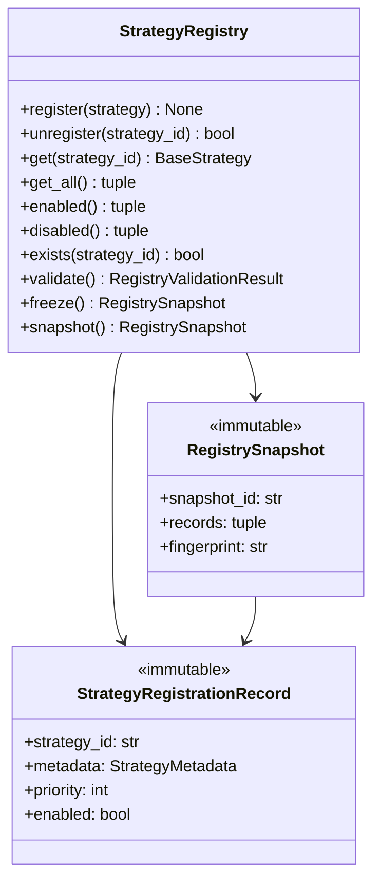

# Strategy Registry — Software Engineering Specification

| Field | Value |
|---|---|
| **Module** | `strategy/registry.py` |
| **Document version** | 1.0.0 |
| **Status** | Draft — ready for implementation |
| **Owner** | THETA AI TRADER Core Platform |
| **Last updated** | 2026-08-03 |

---

## 1. Purpose

`strategy/registry.py` defines the **thread-safe, deterministic strategy plugin registry** for THETA AI TRADER.

The registry is the authoritative in-process catalog of hot-pluggable `BaseStrategy` plugins. It answers operational questions that the Strategy Engine and orchestrator depend on:

- Which strategy plugins exist?
- Which are enabled for execution?
- In what **priority order** should they be scheduled?
- What immutable **metadata snapshot** describes each plugin at registration time?
- Has the registry state changed since the last engine run?

Today, strategy selection logic is embedded in legacy root-level modules (`strategy_engine.py`, `strategy.py`) as mutable fields and imperative branching. That design prevents safe multi-strategy execution, blocks audit-grade reproducibility, and makes hot-plug upgrades risky. The registry extracts **plugin bookkeeping** into a dedicated, testable module that owns registration state — and nothing else.

This module resolves that by providing:

1. A **production-grade registration API** (`register`, `unregister`, `enable`, `disable`, `replace`).
2. **Immutable registry snapshots** for deterministic Strategy Engine runs.
3. **Duplicate detection** and configurable conflict policies for safe plugin management.
4. **Priority-ordered views** of enabled plugins without embedding scheduling logic.
5. A **freeze/thaw boundary** that supports future hot reload while protecting in-flight engine runs.

### Pipeline placement

```text
[Bootstrap / Orchestrator]
    instantiate BaseStrategy plugins
    validate StrategyMetadata
              ↓
[strategy/registry.py]
    StrategyRegistry.register(...)
    StrategyRegistry.freeze() → RegistrySnapshot (optional per run)
              ↓
[Strategy Engine — future]
    reads RegistrySnapshot
    schedules enabled plugins by priority
    never mutates registry during run
              ↓
[TradingSignal aggregation]
    (downstream — out of registry scope)
```

### Goals

1. Centralize **plugin lifecycle bookkeeping** — registration, enablement, lookup, listing — in one module.
2. Guarantee **thread-safe** concurrent registration and read paths suitable for live pipelines.
3. Produce **immutable, deterministic registry snapshots** attachable to `StrategyEngineResult.registry_snapshot_id`.
4. Enforce **duplicate ID rejection** by default with explicit replace policy for controlled hot reload.
5. Remain **pure infrastructure** — no market data fetch, no signal generation, no risk checks, no broker calls.
6. Align with existing contracts in `strategy/base_strategy.py`, `strategy/signals.py`, and `docs/specifications/strategy_engine.md`.

### Success criteria

- Strategy Engine (or test harness) obtains an immutable `RegistrySnapshot` and iterates enabled plugins in deterministic priority order without additional sorting glue code.
- Duplicate `strategy_id` registration fails closed under default policy with stable error code `STRATEGY_REGISTRY.DUPLICATE_ID`.
- Concurrent `register()` + `get_all()` from multiple threads produces no corruption, lost updates, or inconsistent snapshots.
- Registry fingerprint is stable for identical plugin sets and metadata — supports replay verification.
- Adding a new strategy requires `register()` only — no edits to registry internals.

### Relationship to other modules

| Module | Relationship |
|---|---|
| `strategy/base_strategy.py` | **Registered type.** Registry stores `BaseStrategy` instances and validates against `StrategyPluginConfig` / `StrategyMetadata`. |
| `strategy/signals.py` | **Indirect.** Registry does not produce signals; metadata references `StrategyFamily`. |
| `engines/strategy_engine.py` (future) | **Primary consumer.** Engine reads frozen registry snapshot per run. |
| `core/base_engine.py` | **Foundation.** Registered plugins extend `BaseEngine` via `BaseStrategy`. |
| `core/event_bus.py` | **Optional publisher.** Registry may emit `strategy.registry.*` events (extension). |
| `docs/specifications/strategy_engine.md` | **Orchestrator spec.** Defines how engine consumes registry. |
| `docs/specifications/trading_signal.md` | **Downstream output.** Signals reference strategy provenance from plugin metadata. |
| Legacy root `strategy_engine.py` | **Migration source.** Monolithic strategy selection replaced by registry + plugins. |

---

## 2. Responsibilities

`strategy/registry.py` **is responsible for**:

| # | Responsibility | Description |
|---|---|---|
| R1 | **Plugin registration** | Accept `BaseStrategy` instances with validated configuration; index by stable `strategy_id`. |
| R2 | **Plugin unregistration** | Remove plugins by ID; support deferred removal for in-flight runs. |
| R3 | **Lookup API** | Provide `get`, `exists`, and filtered listing methods. |
| R4 | **Enable/disable toggles** | Toggle eligibility without re-instantiating plugins. |
| R5 | **Replace / hot-swap** | Atomic replace of plugin instance under same `strategy_id` when policy allows. |
| R6 | **Duplicate detection** | Detect duplicate IDs, duplicate fingerprints (optional), and conflicting metadata. |
| R7 | **Priority ordering** | Expose deterministic priority-sorted views (higher priority first; tie-break by `strategy_id`). |
| R8 | **Immutable snapshots** | Materialize `RegistrySnapshot` — frozen read-only view for engine runs. |
| R9 | **Registry freeze** | Transition registry to frozen state blocking structural mutations during sensitive windows. |
| R10 | **Registry validation** | Validate all registered plugins' static metadata and configuration consistency. |
| R11 | **Registration records** | Maintain `StrategyRegistrationRecord` with provenance timestamps and state. |
| R12 | **Discovery integration** | Provide `register_batch()` / `register_from_discovery()` for explicit plugin lists (v1). |
| R13 | **Error taxonomy** | Stable codes under `STRATEGY_REGISTRY.*`. |
| R14 | **Logging conventions** | Standard log events for register, unregister, enable, disable, freeze, duplicate reject. |
| R15 | **Fingerprint / snapshot ID** | Compute deterministic registry content hash for reproducibility metadata. |
| R16 | **Documentation contract** | Google-style docstrings on all public types and methods. |

---

## 3. Non-Responsibilities

`strategy/registry.py` **must not**:

| # | Non-responsibility | Rationale |
|---|---|---|
| NR1 | **Evaluate strategies** | Plugin execution belongs in `BaseStrategy.run()` invoked by Strategy Engine. |
| NR2 | **Produce trading signals** | Signal model lives in `strategy/signals.py`. |
| NR3 | **Aggregate or resolve signal conflicts** | Strategy Engine responsibility. |
| NR4 | **Fetch market data** | Upstream market data engine responsibility. |
| NR5 | **Place or simulate orders** | Execution intelligence and broker layers. |
| NR6 | **Perform risk management** | Risk Engine responsibility. |
| NR7 | **Import broker SDKs or broker clients** | No Zerodha, Kite, or vendor-specific types. |
| NR8 | **Load environment variables or config files** | Accept injected `StrategyRegistryConfig` at construction. |
| NR9 | **Dynamic import side effects in core tests** | Discovery may exist but default test path uses explicit registration. |
| NR10 | **Persist registry state to disk or database** | Persistence is external (optional future adapter). |
| NR11 | **Instantiate plugins without caller-supplied instances** | v1 registry receives constructed `BaseStrategy` objects. |
| NR12 | **Mutate `StrategyMetadata` after registration** | Metadata snapshots are immutable; changes require replace/re-register. |
| NR13 | **Schedule parallel execution** | Engine runner responsibility. |
| NR14 | **Authorize live trading** | Downstream gates only. |

---

## 4. Architecture

### 4.1 Layered design

```text
┌─────────────────────────────────────────────────────────────────────┐
│                     strategy/registry.py                             │
│  (plugin catalog — no evaluation, no broker, no signals)            │
│                                                                      │
│  ┌──────────────────┐  ┌──────────────────┐  ┌──────────────────┐  │
│  │ StrategyRegistry │  │ Validation layer │  │ Snapshot builder │  │
│  │ (mutable store)  │→ │ metadata/config  │→ │ RegistrySnapshot │  │
│  └────────┬─────────┘  └──────────────────┘  └──────────────────┘  │
│           │                                                          │
│  ┌────────▼──────────────────────────────────────────────────────┐  │
│  │ Internal index: strategy_id → StrategyRegistrationEntry       │  │
│  │ RW lock · duplicate policy · freeze gate                       │  │
│  └───────────────────────────────────────────────────────────────┘  │
└──────────────────────────────┬──────────────────────────────────────┘
                               │ RegistrySnapshot (immutable)
                               ▼
                    Strategy Engine / Orchestrator
```

### 4.2 Design principles

- **Single responsibility** — registry manages plugin catalog state only.
- **Immutable outward views** — callers receive frozen dataclasses; internal mutable store is encapsulated.
- **Deterministic ordering** — priority descending, then `strategy_id` ascending lexicographic tie-break.
- **Fail closed on duplicates** — default policy rejects duplicate `strategy_id`; replace requires explicit policy.
- **Thread-safe by design** — concurrent reads and controlled writes via re-entrant RW lock.
- **Freeze boundary** — structural mutations blocked when frozen; enable/disable configurable separately.
- **No hidden global singleton** — registry instance is injected into Strategy Engine and tests.
- **Auditability** — every registration carries `registered_at`, metadata snapshot, and content fingerprint.

### 4.3 Component responsibilities

| Component | Role |
|---|---|
| `StrategyRegistry` | Mutable authoritative store; public registration API. |
| `StrategyRegistrationEntry` | Internal mutable wrapper (not public API). |
| `StrategyRegistrationRecord` | Immutable outward-facing registration descriptor. |
| `RegistrySnapshot` | Immutable point-in-time catalog view for engine runs. |
| `StrategyRegistryConfig` | Frozen policy: duplicate handling, max plugins, freeze behavior. |
| `RegistryValidationResult` | Structured outcome of `validate()`. |
| `StrategyDiscoveryDescriptor` | Immutable descriptor for batch registration (v1). |

### 4.4 Dependency direction

```text
orchestrator / bootstrap  →  strategy/registry.py
strategy_engine (future)  →  strategy/registry.py
strategy/registry.py      →  strategy/base_strategy.py
strategy/registry.py      →  strategy/signals.py (StrategyFamily enum only)
strategy/registry.py      →  stdlib
```

**Forbidden reverse imports:** `base_strategy.py` must not import `StrategyRegistry`.

### 4.5 Relationship diagram



---

## 5. Data Model

All public outward-facing types are **immutable dataclasses** (`frozen=True`).

### 5.1 Type hierarchy

```text
StrategyRegistry (mutable service)
└── _entries: dict[str, StrategyRegistrationEntry]  (internal)

StrategyRegistrationEntry (internal)
├── strategy: BaseStrategy
├── record: StrategyRegistrationRecord
└── pending_removal: bool

StrategyRegistrationRecord (immutable, public)
RegistrySnapshot (immutable, public)
StrategyRegistryConfig (immutable, public)
RegistryValidationResult (immutable, public)
StrategyDiscoveryDescriptor (immutable, public)
```

### 5.2 Enumerations

#### `RegistrationState`

| Value | Description |
|---|---|
| `REGISTERED` | Known to registry; may be enabled or disabled. |
| `PENDING_REMOVAL` | Marked for removal after in-flight run completes. |
| `FAILED_INIT` | Reserved — plugin failed construction before registration completed. |

#### `RegistryFreezeState`

| Value | Description |
|---|---|
| `MUTABLE` | Structural mutations allowed. |
| `FROZEN` | Structural mutations rejected. |

#### `DuplicateRegistrationPolicy`

| Value | Description |
|---|---|
| `REJECT` | Raise on duplicate `strategy_id` (production default). |
| `REPLACE` | Atomically replace existing entry (hot reload). |
| `IGNORE` | No-op with debug log if identical fingerprint; reject if metadata differs. |

### 5.3 `StrategyRegistrationRecord` fields

| Field | Type | Required | Description |
|---|---|---|---|
| `strategy_id` | `str` | Yes | Stable unique identifier. |
| `display_name` | `str` | Yes | Human-readable name from metadata. |
| `strategy_version` | `str` | Yes | Semantic version from plugin metadata. |
| `strategy_family` | `StrategyFamily` | Yes | Canonical family enum. |
| `priority` | `int` | Yes | Scheduling priority in `0..1000`. |
| `enabled` | `bool` | Yes | Whether eligible for engine scheduling. |
| `registered_at` | timezone-aware datetime | Yes | First registration timestamp. |
| `updated_at` | timezone-aware datetime | Yes | Last metadata/state mutation timestamp. |
| `state` | `RegistrationState` | Yes | Lifecycle state. |
| `metadata` | `StrategyMetadata` | Yes | Immutable metadata snapshot at registration. |
| `metadata_fingerprint` | `str` | Yes | SHA-256 hex from plugin `metadata_fingerprint()`. |
| `tags` | immutable mapping | No | Copy of metadata tags for fast filtering. |

### 5.4 `RegistrySnapshot` fields

| Field | Type | Required | Description |
|---|---|---|---|
| `snapshot_id` | `str` | Yes | UUID v4 or deterministic hash identifier. |
| `created_at` | timezone-aware datetime | Yes | Snapshot materialization time. |
| `registry_fingerprint` | `str` | Yes | Deterministic hash over sorted registration records. |
| `freeze_state` | `RegistryFreezeState` | Yes | Whether source registry was frozen when snapshot taken. |
| `records` | `tuple[StrategyRegistrationRecord, ...]` | Yes | All records sorted by priority desc, strategy_id asc. |
| `enabled_records` | `tuple[StrategyRegistrationRecord, ...]` | Yes | Enabled subset, same sort order. |
| `plugin_count` | `int` | Yes | Denormalized `len(records)`. |
| `enabled_count` | `int` | Yes | Denormalized `len(enabled_records)`. |

### 5.5 Global invariants

1. `strategy_id` keys are unique within a registry instance under `REJECT` policy.
2. `StrategyRegistrationRecord.strategy_id` equals `metadata.strategy_id` equals `strategy.engine_name`.
3. `priority` is always within `[0, 1000]`.
4. `registered_at <= updated_at` always.
5. `RegistrySnapshot.records` and `enabled_records` are sorted deterministically.
6. Registry never exposes mutable references to internal `_entries` dict.
7. `PENDING_REMOVAL` entries appear in snapshots but are excluded from `enabled_records`.
8. Frozen registry rejects `register`, `unregister`, `replace` with `STRATEGY_REGISTRY.FROZEN`.

---

## 6. Registry Lifecycle

### 6.1 Instance lifecycle

```text
[Construction]
    → validate StrategyRegistryConfig
    → empty index, state = MUTABLE

[Population]
    → register() / register_batch()
    → validate each plugin metadata

[Optional freeze]
    → freeze() → RegistrySnapshot returned, state = FROZEN

[Engine run — external]
    → Strategy Engine reads snapshot()
    → schedules enabled plugins

[Mutation while MUTABLE]
    → enable/disable/unregister/replace

[Shutdown]
    → clear() (test helper) or discard instance
```

### 6.2 Registration entry state machine

```text
                  register()
                      │
                      ▼
                ┌───────────┐
       ┌───────│ REGISTERED │◄────── enable()
       │       └─────┬─────┘
       │             │ disable() → still REGISTERED, enabled=false
       │
unregister()         │ defer_unregistration + active run
       │             ▼
       │       ┌────────────────┐
       └──────►│ PENDING_REMOVAL│─── commit ──► removed
               └────────────────┘
```

### 6.3 Freeze lifecycle

| Phase | Structural mutations | Enable/disable | Reads / snapshot |
|---|---|---|---|
| `MUTABLE` | Allowed | Allowed | Allowed |
| `FROZEN` | **Rejected** | Configurable (default: allowed) | Allowed |

### 6.4 Idempotency rules

| Operation | Idempotent when |
|---|---|
| `register()` under `IGNORE` | Same `strategy_id` + identical metadata fingerprint |
| `unregister()` | Unknown ID → returns `False`, logs warning |
| `enable()` / `disable()` | Already in target state → no-op, debug log |
| `snapshot()` | New object each call; fingerprint equal if registry unchanged |

### 6.5 Zero-plugin registry

An empty registry is **valid**. Strategy Engine treats zero enabled plugins as abstain path with warning `STRATEGY_REGISTRY.EMPTY_ENABLED_SET`.

---

## 7. Strategy Discovery

### 7.1 Purpose

Discovery assembles a list of plugins for registration. The registry provides helpers but does **not** perform dynamic package scanning in v1 core tests.

### 7.2 Discovery modes

| Mode | v1 support | Description |
|---|---|---|
| **Explicit instance registration** | Required | Caller constructs `BaseStrategy` and calls `register(strategy)`. |
| **Batch descriptor registration** | Required | `register_batch(tuple[StrategyDiscoveryDescriptor, ...])`. |
| **Configured entrypoint list** | Optional helper | Orchestrator supplies factory; registry validates results. |
| **Package entry-point scan** | Future extension | `importlib.metadata` entry group `theta_ai_trader.strategies`. |

### 7.3 Discovery rules

| Rule ID | Rule |
|---|---|
| DIS-001 | One discovery failure must not prevent other plugins registering unless `strict_batch=True`. |
| DIS-002 | Discovered plugins must not mutate registry global state at import time. |
| DIS-003 | Duplicate IDs across batch → second item fails per duplicate policy. |
| DIS-004 | Empty discovery input is valid no-op. |
| DIS-005 | Discovery helpers must not import broker modules. |

### 7.4 `StrategyDiscoveryDescriptor` fields

| Field | Type | Required | Description |
|---|---|---|---|
| `strategy` | `BaseStrategy` | Yes | Pre-constructed plugin instance. |
| `enabled` | `bool` | No | Default `True`. |
| `priority_override` | `int | None` | No | Overrides `plugin_config.priority` when set. |

### 7.5 `RegistryBatchResult` (immutable)

| Field | Type | Description |
|---|---|---|
| `registered_ids` | `tuple[str, ...]` | Successfully registered strategy IDs. |
| `failed` | `tuple[RegistryValidationRecord, ...]` | Failures with strategy_id context. |
| `skipped` | `tuple[str, ...]` | IDs skipped due to IGNORE policy idempotency. |

---

## 8. Registration Workflow

### 8.1 `register()` sequence

```text
register(strategy: BaseStrategy) -> None

1. Acquire write lock
2. If registry FROZEN → raise StrategyRegistryFrozenError
3. Validate isinstance(strategy, BaseStrategy)
4. Read plugin_config = strategy.plugin_config
5. validate_strategy_plugin_config(plugin_config)
6. validate_strategy_metadata(plugin_config.metadata)
7. strategy_id = plugin_config.metadata.strategy_id
8. If strategy_id in index → apply DuplicateRegistrationPolicy
9. If len(index) >= max_plugins → raise StrategyRegistryLimitError
10. Build StrategyRegistrationRecord (registered_at = now)
11. Store StrategyRegistrationEntry in index
12. Log strategy.registry.register
13. Release write lock
```

### 8.2 `unregister()` sequence

```text
unregister(strategy_id: str) -> bool

1. Acquire write lock
2. If registry FROZEN → raise StrategyRegistryFrozenError
3. If strategy_id not in index → log warning; return False
4. If defer_unregistration and engine_run_active → mark PENDING_REMOVAL
5. Delete entry from index (or defer)
6. Log strategy.registry.unregister
7. Release write lock; return True
```

### 8.3 `replace()` sequence

```text
replace(strategy_id: str, strategy: BaseStrategy) -> None

1. Validate strategy_id matches new strategy metadata
2. Validate new plugin configuration
3. Swap instance under write lock
4. Update record.updated_at, metadata, metadata_fingerprint
5. Preserve registered_at
6. Log strategy.registry.replace
```

### 8.4 Optional registration overrides

When `enabled` or `priority` overrides are supplied, registry builds updated immutable `StrategyPluginConfig` via `dataclasses.replace` — does not mutate plugin's existing config in place.

### 8.5 Clock injection

All timestamps must be timezone-aware. Registry uses injected `clock: Callable[[], datetime]` for test determinism (default: UTC now).

---

## 9. Validation

### 9.1 Validation layers

| Layer | When | Function |
|---|---|---|
| **Config validation** | Each `register()` / `replace()` | Delegates to base_strategy validators |
| **Registry consistency** | `validate()` explicit call | Cross-entry checks |
| **Snapshot validation** | On `snapshot()` / `freeze()` | Denormalized fields match index |

### 9.2 Per-plugin validation (at registration)

| Check | Source |
|---|---|
| `strategy_id` pattern | `validate_strategy_metadata` |
| Semver version | `validate_strategy_metadata` |
| Priority range | `validate_strategy_plugin_config` |
| CUSTOM family tag | `validate_strategy_metadata` |
| Plugin is `BaseStrategy` | `isinstance` check |

Failures raise `StrategyRegistryConfigurationError` with code `STRATEGY_REGISTRY.CONFIG.INVALID`.

### 9.3 Registry-level validation (`validate()`)

| Rule ID | Condition | Severity |
|---|---|---|
| VAL-001 | Duplicate `strategy_id` in index | Error |
| VAL-002 | Duplicate `metadata_fingerprint` across different IDs | Warning |
| VAL-003 | Two enabled plugins same `strategy_family` | Warning |
| VAL-004 | Enabled plugin count == 0 | Warning |
| VAL-005 | Priority outside `0..1000` | Error |
| VAL-006 | `record.strategy_id != metadata.strategy_id` | Error |
| VAL-007 | `PENDING_REMOVAL` entry still enabled | Error |
| VAL-008 | Plugin `engine_name` mismatch | Error |
| VAL-009 | Naive datetime on record | Error |
| VAL-010 | Count > `max_plugins` | Error |

### 9.4 `validate()` API

```python
def validate(self) -> RegistryValidationResult: ...
def assert_valid(self) -> None: ...  # raises StrategyRegistryValidationError
```

Does not mutate registry. Thread-safe (read lock). `is_valid = not errors`.

### 9.5 `RegistryValidationRecord` (immutable)

| Field | Type | Description |
|---|---|---|
| `code` | `str` | Stable error code |
| `message` | `str` | Human-readable description |
| `strategy_id` | `str | None` | Related plugin ID |
| `field` | `str | None` | Field path |

---

## 10. Duplicate Detection

### 10.1 Duplicate classes

| Class | Detection key | Default policy |
|---|---|---|
| **ID duplicate** | `strategy_id` | REJECT |
| **Fingerprint duplicate** | `metadata_fingerprint` | WARN on `validate()` |
| **Display name collision** | `display_name` case-insensitive | WARN only |
| **Priority tie** | Same priority value | Allowed; tie-break by `strategy_id` |

### 10.2 ID duplicate handling

```text
REJECT   → StrategyRegistryDuplicateError(STRATEGY_REGISTRY.DUPLICATE_ID)
REPLACE  → swap instance, update record
IGNORE   → if fingerprint equal: no-op; else REJECT
```

### 10.3 Diagnostic API

| Method | Description |
|---|---|
| `exists(strategy_id) -> bool` | ID membership test |
| `find_by_fingerprint(fingerprint) -> tuple[str, ...]` | Reverse lookup |
| `detect_duplicates() -> RegistryDuplicateReport` | Full scan |

---

## 11. Plugin Metadata

### 11.1 Metadata ownership

- **Authoritative source:** `strategy.plugin_config.metadata`.
- **Registry snapshot:** copies metadata into `StrategyRegistrationRecord` at registration.
- **Immutability:** subsequent metadata changes on plugin object must not affect record.

### 11.2 Metadata fingerprint

```text
metadata_fingerprint = strategy.metadata_fingerprint()
```

Used for IGNORE policy, registry fingerprint, and audit trails.

### 11.3 Metadata on replace

New metadata must maintain same `strategy_id`. Version and fingerprint may change — `updated_at` refreshed.

If `strategy_id` changes, caller must `unregister` old ID and `register` new ID.

---

## 12. Enable/Disable Workflow

### 12.1 API

```python
def enable(self, strategy_id: str) -> None: ...
def disable(self, strategy_id: str) -> None: ...
def enabled(self) -> tuple[StrategyRegistrationRecord, ...]: ...
def disabled(self) -> tuple[StrategyRegistrationRecord, ...]: ...
```

### 12.2 Enable/disable rules

- Unknown ID → `StrategyRegistryNotFoundError`.
- `PENDING_REMOVAL` → `StrategyRegistryInvalidStateError`.
- Updates `updated_at` on record.

### 12.3 Interaction with freeze

| `allow_enable_disable_while_frozen` | Behavior |
|---|---|
| `True` (default) | `enable`/`disable` permitted when FROZEN |
| `False` | raises `StrategyRegistryFrozenError` |

Structural operations always rejected when FROZEN.

### 12.4 Enabled view semantics

`enabled()` returns records where `enabled is True` and `state == REGISTERED`, sorted by priority desc, strategy_id asc.

### 12.5 Bulk operations (optional v1)

`enable_all()`, `disable_all()`, `disable_by_family(family)` — atomic under write lock.

---

## 13. Thread Safety

| Aspect | Requirement |
|---|---|
| Internal lock | `threading.RLock` (re-entrant) |
| Concurrent reads | `get`, `exists`, `get_all`, `enabled`, `disabled`, `snapshot`, `validate` — safe parallel |
| Concurrent writes | Serialized under write lock |
| Copy-on-read snapshots | Deep-copy records into immutable tuples under read lock |
| Global singleton | **Forbidden** |
| Plugin instances | Must be stateless per `BaseStrategy` contract |

### 13.1 Deferred unregistration

When `defer_unregistration=True`:

- `unregister()` during active run marks `PENDING_REMOVAL`
- `enabled()` excludes `PENDING_REMOVAL`
- `commit_pending_removals()` finalizes removal (called by Strategy Engine)

### 13.2 Stress test requirements

- 8 threads × 100 register/unregister cycles on distinct IDs
- Concurrent `snapshot()` during `enable`/`disable`
- 16 threads × 1000 `get`/`exists`

---

## 14. Performance Requirements

| Requirement | Target | Notes |
|---|---|---|
| `register()` | < 0.5 ms median | Excludes plugin construction |
| `unregister()` | < 0.2 ms median | Hash map delete |
| `get()` / `exists()` | < 0.05 ms median | O(1) |
| `get_all()` / `enabled()` | < 1 ms for 32 plugins | Includes sort |
| `snapshot()` / `freeze()` | < 2 ms for 32 plugins | Copy + fingerprint |
| `validate()` | < 3 ms for 32 plugins | Full scan |
| Memory per plugin entry | ≤ 4 KB overhead | Excluding plugin instance |
| Max supported plugins | 256 default cap | Configurable |

### 14.1 Complexity

| Operation | Complexity |
|---|---|
| register / unregister / get / exists | O(1) average |
| get_all / enabled / disabled | O(n log n) |
| validate | O(n) |

---

## 15. Error Taxonomy

Namespace: `STRATEGY_REGISTRY.<CATEGORY>.<DETAIL>`

### 15.1 Exceptions

| Exception | When |
|---|---|
| `StrategyRegistryError` | Base registry exception |
| `StrategyRegistryConfigurationError` | Invalid config/metadata |
| `StrategyRegistryDuplicateError` | Duplicate ID under REJECT |
| `StrategyRegistryNotFoundError` | ID not found |
| `StrategyRegistryFrozenError` | Mutation rejected while frozen |
| `StrategyRegistryLimitError` | `max_plugins` exceeded |
| `StrategyRegistryValidationError` | `assert_valid()` failure |
| `StrategyRegistryInvalidStateError` | Illegal state transition |

All exceptions carry `code`, `message`, optional `strategy_id`, optional `field`.

### 15.2 Error codes

| Code | Description |
|---|---|
| `STRATEGY_REGISTRY.CONFIG.INVALID` | Plugin config/metadata invalid |
| `STRATEGY_REGISTRY.DUPLICATE_ID` | Duplicate strategy_id |
| `STRATEGY_REGISTRY.DUPLICATE_FINGERPRINT` | Warning — same fingerprint, different IDs |
| `STRATEGY_REGISTRY.NOT_FOUND` | strategy_id not registered |
| `STRATEGY_REGISTRY.FROZEN` | Registry frozen; operation rejected |
| `STRATEGY_REGISTRY.LIMIT_EXCEEDED` | Max plugin count exceeded |
| `STRATEGY_REGISTRY.INVALID_STATE` | Invalid state transition |
| `STRATEGY_REGISTRY.VALIDATION.FAILED` | validate() found errors |
| `STRATEGY_REGISTRY.TYPE.INVALID` | Not a BaseStrategy |
| `STRATEGY_REGISTRY.BATCH.PARTIAL_FAILURE` | Batch registration failures |
| `STRATEGY_REGISTRY.EMPTY_ENABLED_SET` | Informational — zero enabled plugins |

### 15.3 Strategy Engine mapping

| Registry code | Engine code |
|---|---|
| `STRATEGY_REGISTRY.DUPLICATE_ID` | `STRATEGY_ENGINE.REGISTRY.DUPLICATE_ID` |
| `STRATEGY_REGISTRY.NOT_FOUND` | `STRATEGY_ENGINE.REGISTRY.NOT_FOUND` |

---

## 16. Serialization

Serialization is **recommended** for audit snapshots. Registry does **not** serialize live `BaseStrategy` instances.

### 16.1 Serializable types

| Type | Serialized |
|---|---|
| `StrategyRegistrationRecord` | Yes |
| `RegistrySnapshot` | Yes |
| `RegistryValidationResult` | Yes |
| `BaseStrategy` instance | **No** |

### 16.2 API

| Function | Description |
|---|---|
| `snapshot_to_dict` / `snapshot_from_dict` | Dict round-trip |
| `snapshot_to_json` / `snapshot_from_json` | JSON round-trip |
| `record_to_dict` / `record_from_dict` | Single record |

Schema version: `STRATEGY_REGISTRY_SCHEMA_VERSION = "1.0.0"`.

### 16.3 JSON root schema — `RegistrySnapshot`

```json
{
  "schema_version": "1.0.0",
  "snapshot_id": "reg-snap-20260803-101500-001",
  "created_at": "2026-08-03T10:15:00+00:00",
  "registry_fingerprint": "abc123...",
  "freeze_state": "mutable",
  "plugin_count": 2,
  "enabled_count": 2,
  "records": [
    {
      "strategy_id": "short_strangle",
      "display_name": "Short Strangle",
      "strategy_version": "1.0.0",
      "strategy_family": "short_strangle",
      "priority": 650,
      "enabled": true,
      "registered_at": "2026-08-03T09:00:00+00:00",
      "updated_at": "2026-08-03T09:00:00+00:00",
      "state": "registered",
      "metadata_fingerprint": "def456...",
      "metadata": {}
    }
  ]
}
```

### 16.4 Serialization rules

1. Timestamps as ISO 8601 with timezone.
2. Enums as lowercase string values.
3. Omit null optional fields when `omit_nulls=True`.
4. Deserialization validates schema version.
5. Snapshot import is **audit-only** in v1 — does not reconstruct live plugins.

### 16.5 Registry fingerprint algorithm

SHA-256 over canonical JSON of records sorted by `strategy_id` (independent of priority sort used for execution).

---

## 17. Testing Strategy

Tests live in `tests/test_strategy_registry.py`.

### 17.1 Test doubles

| Double | Description |
|---|---|
| `EchoStrategy` | Minimal valid `BaseStrategy` |
| `BadConfigStrategy` | Invalid metadata |
| `FixedClock` | Deterministic timestamps |
| `AlwaysActiveRunCallback` | Simulates in-flight engine run |

### 17.2 Required test cases

| Category | Cases |
|---|---|
| **Construction** | Valid/invalid `StrategyRegistryConfig` |
| **Registration** | Happy path; invalid metadata; not BaseStrategy |
| **Duplicate detection** | REJECT, REPLACE, IGNORE policies |
| **Unregister** | Existing ID; unknown ID returns False |
| **Deferred removal** | PENDING_REMOVAL + commit |
| **Get/Lookup** | get, exists, not found errors |
| **Listing** | get_all, enabled, disabled ordering |
| **Priority ordering** | Tie-break by strategy_id |
| **Enable/disable** | Toggle; enable unknown raises |
| **Freeze** | Structural ops rejected; snapshot returned |
| **Validate** | Empty registry warning; duplicate fingerprint warning |
| **Snapshot immutability** | Prior snapshot unchanged after mutation |
| **Fingerprint stability** | Identical registry → identical fingerprint |
| **Serialization** | Snapshot JSON round-trip |
| **Batch registration** | Partial failures collected |
| **Thread safety** | Concurrent register/snapshot stress |
| **Performance smoke** | 32 plugins under threshold |
| **Max plugins limit** | LIMIT_EXCEEDED error |

### 17.3 Coverage target

≥ 95% line coverage on `strategy/registry.py`.

---

## 18. Risks

| Risk | Impact | Mitigation |
|---|---|---|
| **Registry/strategy circular import** | Import failure | Registry imports base_strategy only |
| **Hot reload race with engine run** | Undefined plugin set mid-run | freeze() + snapshot per run |
| **Mutable plugin metadata drift** | Record diverges from live plugin | Snapshot metadata at registration |
| **Global singleton registry** | Test pollution | Inject registry instance |
| **Over-large plugin count** | Latency | `max_plugins` cap default 256 |
| **Enable/disable during freeze confusion** | Operator error | Document policy clearly |
| **Serialization without instances** | Cannot rebuild live registry from JSON | Document audit-only bootstrap path |
| **Legacy migration** | Old monolithic selection persists | Migration ticket |

---

## 19. Definition of Done

### 19.1 Implementation

- [ ] All public API symbols in §20 implemented in `strategy/registry.py`.
- [ ] `StrategyRegistry` provides `register`, `unregister`, `get`, `get_all`, `enabled`, `disabled`, `exists`, `validate`, `freeze`, `snapshot`.
- [ ] Duplicate detection with `DuplicateRegistrationPolicy` implemented.
- [ ] Immutable `StrategyRegistrationRecord` and `RegistrySnapshot` (`frozen=True`).
- [ ] Thread-safe read/write paths with `RLock`.
- [ ] Deterministic priority ordering with strategy_id tie-break.
- [ ] Stable error codes under `STRATEGY_REGISTRY.*`.
- [ ] Optional snapshot serialization.
- [ ] No broker, execution, risk, or strategy evaluation logic.
- [ ] Google-style docstrings; Python 3.12 type hints.

### 19.2 Testing

- [ ] `tests/test_strategy_registry.py` covers §17.2.
- [ ] Line coverage ≥ 95%.
- [ ] Thread safety stress test passes.
- [ ] Performance smoke targets met.

### 19.3 Integration

- [ ] Strategy Engine spec references `strategy/registry.py`.
- [ ] Bootstrap example registers ≥2 fake plugins.
- [ ] `CHANGELOG.md` updated.

### 19.4 Documentation

- [ ] This specification matches implemented behaviour.
- [ ] Cross-links in `strategy_engine.md`.

### 19.5 Review checklist

- [ ] Correctness, readability, maintainability, architecture alignment, security.

---

## 20. Public API Summary

### 20.1 Constants

| Symbol | Value | Description |
|---|---|---|
| `STRATEGY_REGISTRY_VERSION` | `"1.0.0"` | Module semantic version |
| `STRATEGY_REGISTRY_SCHEMA_VERSION` | `"1.0.0"` | Snapshot serialization schema |
| `DEFAULT_MAX_PLUGINS` | `256` | Default plugin cap |
| `MIN_PRIORITY` | `0` | Minimum scheduling priority |
| `MAX_PRIORITY` | `1000` | Maximum scheduling priority |

### 20.2 Primary class — `StrategyRegistry`

| Method | Description |
|---|---|
| `__init__(config, *, clock, engine_run_active)` | Construct empty registry |
| `register(strategy, *, enabled, priority)` | Register plugin |
| `unregister(strategy_id) -> bool` | Remove plugin |
| `replace(strategy_id, strategy)` | Hot-swap plugin |
| `get(strategy_id) -> BaseStrategy` | Lookup plugin instance |
| `get_record(strategy_id)` | Lookup immutable record |
| `exists(strategy_id) -> bool` | ID membership |
| `get_all()` | All records sorted |
| `enabled()` | Enabled records sorted |
| `disabled()` | Disabled records sorted |
| `enable(strategy_id)` | Enable plugin |
| `disable(strategy_id)` | Disable plugin |
| `validate()` | Validate catalog |
| `assert_valid()` | Raise on validation failure |
| `snapshot()` | Immutable snapshot without freezing |
| `freeze()` | Freeze registry; return snapshot |
| `clear()` | Test helper — remove all |
| `count()` / `enabled_count()` | Counts |
| `is_frozen()` | Freeze state query |
| `register_batch(descriptors)` | Batch register |
| `commit_pending_removals()` | Finalize deferred removals |
| `detect_duplicates()` | Duplicate scan |
| `find_by_fingerprint(fingerprint)` | Reverse lookup |

### 20.3 Immutable dataclasses

`StrategyRegistrationRecord`, `RegistrySnapshot`, `StrategyRegistryConfig`, `StrategyDiscoveryDescriptor`, `RegistryValidationResult`, `RegistryValidationRecord`, `RegistryBatchResult`, `RegistryDuplicateReport`.

### 20.4 Enumerations

`RegistrationState`, `RegistryFreezeState`, `DuplicateRegistrationPolicy`.

### 20.5 Exceptions

`StrategyRegistryError`, `StrategyRegistryConfigurationError`, `StrategyRegistryDuplicateError`, `StrategyRegistryNotFoundError`, `StrategyRegistryFrozenError`, `StrategyRegistryLimitError`, `StrategyRegistryValidationError`, `StrategyRegistryInvalidStateError`.

### 20.6 Serialization helpers

`snapshot_to_dict`, `snapshot_from_dict`, `snapshot_to_json`, `snapshot_from_json`, `record_to_dict`, `record_from_dict`, `registry_fingerprint`.

---

## Appendix A — Priority ordering

Sort key: `(-priority, strategy_id)` — higher priority first; lexicographic tie-break.

| strategy_id | priority | Order |
|---|---|---|
| `iron_condor` | 700 | 1 |
| `short_strangle` | 650 | 2 |
| `bull_put_spread` | 650 | 3 |
| `long_volatility` | 400 | 4 |

Strategy Engine **must not** re-sort differently.

---

## Appendix B — Hot reload workflow

```text
1. registry.freeze() → snap_old
2. engine completes run bound to snap_old
3. registry.thaw()                     # extension v1.1
4. registry.replace(id, new_plugin)
5. registry.validate()
6. registry.freeze() → snap_new
7. next engine run uses snap_new
```

v1 foundation: `REPLACE` policy, `freeze()`, `snapshot()`, `replace()`.

---

## Appendix C — Operational examples

**Bootstrap:**

```text
registry = StrategyRegistry()
registry.register(ShortStrangleStrategy(config))
registry.register(IronCondorStrategy(config))
registry.validate().is_valid → True
snapshot = registry.freeze()
```

**Duplicate rejection:**

```text
registry.register(plugin_a)  # strategy_id="short_strangle"
registry.register(plugin_b)  # same id
→ StrategyRegistryDuplicateError
```

---

## Appendix D — Logging events

| Event | Level |
|---|---|
| `strategy.registry.register` | INFO |
| `strategy.registry.register.rejected` | WARNING |
| `strategy.registry.unregister` | INFO |
| `strategy.registry.replace` | INFO |
| `strategy.registry.enable` / `disable` | INFO |
| `strategy.registry.freeze` | INFO |
| `strategy.registry.validate.failed` | ERROR |

---

## Appendix E — Glossary

| Term | Definition |
|---|---|
| **Registry** | In-process catalog of strategy plugins. |
| **Plugin** | Instance of `BaseStrategy`. |
| **Registration record** | Immutable metadata snapshot for one plugin. |
| **Registry snapshot** | Immutable point-in-time view of all records. |
| **Freeze** | Block structural mutations to registry. |
| **Priority** | Scheduling hint; higher runs first. |
| **Hot reload** | Replace plugin instance without process restart. |
| **Fingerprint** | Deterministic hash of registry or metadata content. |

---

## Appendix F — Related documents

- `docs/specifications/strategy_engine.md`
- `docs/specifications/trading_signal.md`
- `docs/specifications/base_engine.md`
- `docs/specifications/event_bus.md`
- `docs/specifications/market_snapshot.md`
- `.cursor/rules/theta-ai-trader-trading-architecture.mdc`
- `.cursor/rules/theta-ai-trader-engineering-standards.mdc`

---

## Appendix G — Revision history

| Version | Date | Author | Changes |
|---|---|---|---|
| 1.0.0 | 2026-08-03 | THETA AI TRADER | Initial specification |
