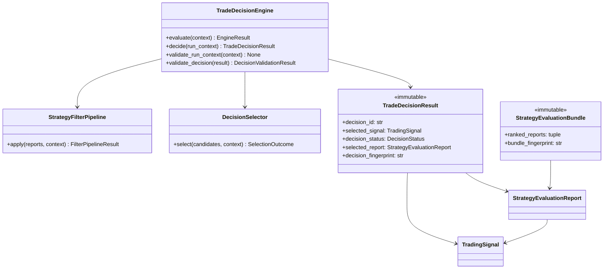

# Trade Decision Engine — Software Engineering Specification

| Field | Value |
|---|---|
| **Module** | `decision/trade_decision_engine.py` |
| **Document version** | 1.0.0 |
| **Status** | Draft — ready for implementation |
| **Owner** | THETA AI TRADER Core Platform |
| **Last updated** | 2026-08-03 |

---

## 1. Purpose

`decision/trade_decision_engine.py` defines the **institutional trade decision engine** for THETA AI TRADER v1.0.

The engine consumes an immutable `StrategyEvaluationBundle` produced by the Strategy Evaluation Engine and produces a **single authoritative trade decision** expressed as a selected `TradingSignal` (or an explicit abstain/no-trade outcome). It applies user preferences, trading-window gates, informational capital pre-checks, and deterministic strategy selection — but **never** places orders, communicates with brokers, enforces margin, or manages positions.

The engine answers: *"Given these ranked strategy evaluation reports, user preferences, and session context, which strategy signal (if any) should proceed to the Risk Engine for capital-protection review?"*

It is **not** a risk manager. It is **not** an execution layer. It is the **decision gate** between multi-strategy evaluation and authoritative risk enforcement.

### Pipeline placement

```text
[Market Data Engine]
    → MarketSnapshot (immutable)
              ↓
[Strategy Registry]
    → RegistrySnapshot
              ↓
[strategy/strategy_evaluation_engine.py]
    evaluate enabled plugins
    rank StrategyEvaluationReport instances
              ↓
    StrategyEvaluationBundle (immutable)
              ↓
[decision/trade_decision_engine.py]    ← THIS MODULE
    filter reports by policy + preferences
    validate trading window + capital hints
    select strategy (autonomous or manual)
    propagate confidence + build explanation
              ↓
    TradeDecisionResult (immutable)
    primary payload: selected TradingSignal | None
              ↓
[Risk Engine]                          ← authoritative capital protection
    margin, exposure, limits enforcement
              ↓
[Position Sizing Engine]
              ↓
[Execution Intelligence]
              ↓
[Broker Execution]
```

### Goals

1. Provide a **dedicated decision layer** between strategy evaluation and risk enforcement — separate from plugin evaluation and separate from order construction.
2. Support **Autonomous Mode** (engine selects best eligible strategy) and **Manual Mode** (user specifies strategy with validation and override rules).
3. Apply **multi-stage strategy filtering** before selection — outcome class, suitability thresholds, family allowlists, risk/reward bands, capital hints.
4. Validate **user preferences** deterministically — allowed families, blocked strategies, min confidence, direction filters.
5. Perform **informational capital pre-checks** against configured bounds — never authoritative margin enforcement (Risk Engine owns that).
6. Enforce **trading window validation** for NSE session rules, blackout windows, and LIVE vs ANALYSIS mode differences.
7. Produce **deterministic strategy selection** with documented tie-breakers aligned with Strategy Evaluation Engine ranking keys plus decision-specific keys.
8. **Propagate confidence** from evaluation reports into the output `TradingSignal` with decision-level adjustments and audit trail.
9. Provide **full explainability** via `DecisionFactor`, `DecisionReason`, and structured abstain explanations.
10. Integrate cleanly with `BaseEngine`, `EngineContext`, `EngineResult`, `StrategyEvaluationBundle`, and `TradingSignal` without broker or execution dependencies.
11. Remain **thread-safe** for concurrent decision runs on independent contexts.

### Success criteria

- Orchestrator invokes `TradeDecisionEngine.evaluate(context)` with `StrategyEvaluationBundle` + decision context and receives immutable `TradeDecisionResult`.
- Autonomous mode selects the highest-ranked eligible report deterministically for identical inputs.
- Manual mode validates user-selected `strategy_id` against bundle and preferences; rejects invalid selections with structured errors.
- Output `TradingSignal` is either a **copy/enrichment** of the selected report's signal or an explicit **abstain signal** — never `None` without accompanying abstain metadata when status is SUCCESS.
- Identical inputs (bundle fingerprint, config, preferences, reference time, mode) produce semantically equal decisions and identical `decision_fingerprint`.
- Risk Engine consumes `TradeDecisionResult` without importing strategy plugins or broker SDKs.
- No module under `decision/trade_decision_engine.py` imports broker clients, execution APIs, or Risk Engine implementation types.

### Relationship to other modules

| Module | Relationship |
|---|---|
| `strategy/strategy_evaluation_engine.py` | **Primary upstream input.** Engine consumes `StrategyEvaluationBundle` and `StrategyEvaluationReport`. |
| `strategy/signals.py` | **Output contract.** Selected signal is canonical `TradingSignal`; abstain signals built via signal factories. |
| `market_data/market_snapshot.py` | **Context reference.** Snapshot ID from bundle; optional snapshot attachment for window validation. |
| `core/base_engine.py` | **Foundation.** `TradeDecisionEngine` extends `BaseEngine`. |
| `core/engine_context.py` | **Input wrapper.** Orchestrator passes bundle + metadata via `EngineContext`. |
| `core/engine_result.py` | **Output wrapper.** Decision result returned inside `EngineResult.payload`. |
| `docs/specifications/strategy_evaluation_engine.md` | **Upstream contract.** Appendix B consumption contract; ranking tie-breakers must align. |
| `docs/specifications/trading_signal.md` | **Signal contract.** Output signals conform to validation rules; no schema redefinition. |
| Risk Engine (future) | **Primary downstream consumer.** Reads `TradeDecisionResult.selected_signal` after decision. |
| Position Sizing Engine (future) | **Downstream.** Sizes after risk approval — not consulted by Trade Decision Engine. |
| Execution Intelligence (future) | **Downstream.** Order planning — out of scope. |
| Legacy root `strategy_engine.py` | **Not a dependency.** Decision logic must not import legacy monolith. |

### Distinction from Strategy Evaluation Engine

| Concern | Strategy Evaluation Engine | Trade Decision Engine |
|---|---|---|
| Primary output | Ranked **evaluation reports** (all strategies) | Single **selected signal** (or abstain) |
| Plugin execution | **In scope** — runs `BaseStrategy.run()` | **Out of scope** — reads pre-computed reports |
| User preferences | **Out of scope** | **In scope** — family allowlists, manual selection |
| Trading window | Informational snapshot quality only | **In scope** — session/blackout enforcement |
| Capital enforcement | Informational `CapitalEstimate` hints | Informational pre-check only; Risk Engine enforces |
| Conflict resolution | Preserves all strategy outcomes | Selects one strategy or abstains |
| Ranking | Computes `ranking_score` per report | Consumes ranking; applies filters + tie-breakers |

Both modules coexist in sequence: Evaluation Engine produces ranked reports; Trade Decision Engine chooses among them.

---

## 2. Responsibilities

`decision/trade_decision_engine.py` **is responsible for**:

| # | Responsibility | Description |
|---|---|---|
| R1 | **Evaluation bundle consumption** | Accept immutable `StrategyEvaluationBundle` as primary input. |
| R2 | **Autonomous mode selection** | Select highest-ranked eligible strategy when `DecisionMode.AUTONOMOUS`. |
| R3 | **Manual mode selection** | Validate and accept user-specified `strategy_id` when `DecisionMode.MANUAL`. |
| R4 | **Strategy filtering pipeline** | Apply ordered multi-stage filters to ranked reports before selection. |
| R5 | **User preference validation** | Enforce `UserPreferences` — allowed families, blocked IDs, min scores, direction filters. |
| R6 | **Capital pre-validation** | Informational bounds check against `CapitalPolicy` — not margin enforcement. |
| R7 | **Trading window validation** | Validate NSE session, blackout windows, LIVE vs ANALYSIS rules. |
| R8 | **Deterministic selection** | Pure selection algorithm; identical inputs → identical choice. |
| R9 | **Tie-breaking** | Apply evaluation-engine-aligned tie-breakers plus decision-specific keys. |
| R10 | **Confidence propagation** | Merge evaluation confidence into output signal confidence with decision adjustments. |
| R11 | **Decision explanation** | Produce `DecisionReason` bullets and `DecisionFactor` audit trail. |
| R12 | **Abstain signal production** | Materialize explicit abstain `TradingSignal` when no trade selected. |
| R13 | **TradeDecisionResult assembly** | Immutable result wrapping selected signal, source report, filter stats. |
| R14 | **Input validation** | Validate `DecisionRunContext`, bundle integrity, preferences consistency. |
| R15 | **Output validation** | Validate sealed `TradeDecisionResult` before return. |
| R16 | **EngineResult integration** | Return `EngineResult` with structured status, errors, warnings, payload. |
| R17 | **Error taxonomy** | Stable codes under `TRADE_DECISION.*`. |
| R18 | **Decision fingerprint** | Compute deterministic `decision_fingerprint` for replay verification. |
| R19 | **Serialization** | JSON round-trip for `TradeDecisionResult` schema version 1.0.0. |
| R20 | **Logging conventions** | Standard log events for decision start, filter stages, selection, abstain. |
| R21 | **Thread-safe execution** | Safe concurrent `evaluate()` on independent contexts. |
| R22 | **Filter audit trail** | Record per-stage elimination counts and reasons. |
| R23 | **Manual override rules** | Apply override policy when manual selection conflicts with filters (configurable). |
| R24 | **Signal freshness check** | Reject expired signals via `is_signal_expired` at reference time. |
| R25 | **Documentation contract** | Google-style docstrings on all public types and methods. |
| R26 | **Mode transition safety** | Reject ambiguous mode/payload combinations at validation. |
| R27 | **Downstream contract documentation** | Document logical Risk Engine handoff without importing risk types. |

---

## 3. Non-Responsibilities

`decision/trade_decision_engine.py` **must not**:

| # | Non-responsibility | Rationale |
|---|---|---|
| NR1 | **Place, modify, or cancel orders** | Execution belongs in execution intelligence and broker layers. |
| NR2 | **Perform authoritative risk management or margin enforcement** | Risk Engine owns capital protection. |
| NR3 | **Size positions or compute lot quantities** | Position Sizing Engine responsibility. |
| NR4 | **Fetch market data or call brokers** | Input is upstream bundle; optional snapshot is read-only reference. |
| NR5 | **Import broker SDKs or broker clients** | No Zerodha, Kite, or vendor-specific types. |
| NR6 | **Run strategy plugins or invoke `BaseStrategy.run()`** | Strategy Evaluation Engine responsibility. |
| NR7 | **Mutate `StrategyEvaluationBundle` or `TradingSignal` inputs** | All inputs read-only; output signals are new immutable instances. |
| NR8 | **Re-score or re-rank evaluation reports** | Consumes upstream `ranking_score`; may filter but not recompute scoring. |
| NR9 | **Aggregate conflicting signals into composite structures** | Selects one strategy signal or abstains. |
| NR10 | **Manage open positions or APME logic** | Adaptive Position Management Engine is separate. |
| NR11 | **Persist decisions to disk or database** | External persistence concern. |
| NR12 | **Load environment variables or config files** | Accept injected `TradeDecisionEngineConfig` at construction. |
| NR13 | **Call other analytical engines directly** | Orchestrator assembles inputs; no peer engine imports. |
| NR14 | **Import Risk Engine types or modules** | Logical handoff contract only — no compile-time dependency. |
| NR15 | **Compute broker margin or exact P&L** | Requires broker APIs; out of scope. |
| NR16 | **Implement UI or dashboard rendering** | Consumers read `EngineResult` or subscribe to events. |
| NR17 | **Modify registry or register strategies** | Registry module responsibility. |
| NR18 | **Override Risk Engine rejection** | Decision output is input to risk; decision engine cannot force approval. |
| NR19 | **Perform strike selection or leg construction** | Execution intelligence / strike engines responsibility. |
| NR20 | **Detect market regime independently** | May consume regime labels from context tags only. |

---

## 4. Architecture

### 4.1 Layered design

```text
┌─────────────────────────────────────────────────────────────────────────┐
│              decision/trade_decision_engine.py                           │
│  (trade decision gate — no broker, no risk enforcement, no execution)   │
│                                                                          │
│  ┌────────────────────┐  ┌────────────────────┐  ┌──────────────────┐  │
│  │ TradeDecisionEngine│  │ StrategyFilter     │  │ DecisionSelector │  │
│  │ (extends BaseEngine│→ │ Pipeline           │→ │ (autonomous /    │  │
│  │                    │  │ (ordered stages)   │  │  manual modes)   │  │
│  └─────────┬──────────┘  └─────────┬──────────┘  └────────┬─────────┘  │
│            │                       │                        │            │
│  ┌─────────▼───────────────────────▼────────────────────────▼─────────┐  │
│  │ Validators · PreferenceChecker · WindowValidator · CapitalPrecheck  │  │
│  │ ConfidencePropagator · ExplanationBuilder · ResultSealer            │  │
│  └────────────────────────────────────────────────────────────────────┘  │
└──────────────────────────────┬──────────────────────────────────────────┘
                               │
         StrategyEvaluationBundle + UserPreferences + DecisionRunContext
                               │
                               ▼
              TradeDecisionResult (immutable, selected TradingSignal)
                               │
                               ▼
                         Risk Engine (future)
```

### 4.2 Design principles

- **Single responsibility** — choose among evaluated strategies or abstain; nothing else.
- **Immutable I/O** — all inputs and outputs are frozen dataclasses.
- **Deterministic selection** — identical inputs produce identical strategy choice and fingerprint.
- **Fail closed on ambiguity** — prefer abstain over forced trade when validation fails.
- **Informational capital checks** — pre-filter only; never authoritative allocation.
- **Explainability first** — every decision (including abstain) has reasons and factors.
- **Thread-safe service** — engine instance safe for concurrent decisions on independent contexts.
- **No hidden globals** — config and policies injected at construction.
- **Audit-grade fingerprints** — decision fingerprint covers bundle fingerprint, config hash, selection outcome.
- **Mode explicitness** — autonomous vs manual mode always explicit in context; no implicit defaults in production.

### 4.3 Component responsibilities

| Component | Role |
|---|---|
| `TradeDecisionEngine` | Public `BaseEngine` implementation; orchestrates full decision run. |
| `TradeDecisionEngineConfig` | Frozen policy: filter policy, window policy, capital policy, override rules. |
| `DecisionRunContext` | Immutable per-run inputs: bundle, mode, preferences, reference time. |
| `StrategyFilterPipeline` | Ordered multi-stage filter applying elimination rules to candidate reports. |
| `DecisionSelector` | Autonomous or manual selection from filtered candidates. |
| `UserPreferenceValidator` | Validates and applies user preference constraints. |
| `TradingWindowValidator` | NSE session and blackout window checks. |
| `CapitalPrecheckValidator` | Informational capital band bounds — not margin math. |
| `ConfidencePropagator` | Merges evaluation confidence into output signal confidence. |
| `DecisionExplanationBuilder` | Assembles reasons, factors, filter audit trail. |
| `TradeDecisionResult` | Immutable decision outcome with selected signal and metadata. |
| `DecisionValidator` | Validates run inputs and sealed results. |

### 4.4 Dependency direction

```text
orchestrator                    →  decision/trade_decision_engine.py
Risk Engine (future)            →  decision/trade_decision_engine.py (reads result types)
trade_decision_engine.py        →  strategy/strategy_evaluation_engine.py (bundle types)
trade_decision_engine.py        →  strategy/signals.py
trade_decision_engine.py        →  market_data/market_snapshot.py (optional, read-only)
trade_decision_engine.py        →  core/base_engine.py
trade_decision_engine.py        →  stdlib
```

**Forbidden imports:** broker clients, execution modules, risk manager modules, `strategy/registry.py` (live registry), `BaseStrategy` plugins.

### 4.5 Relationship diagram



---

## 5. Data Model

All public outward-facing types are **immutable dataclasses** (`frozen=True`) unless noted.

### 5.1 Type hierarchy

```text
TradeDecisionEngine (mutable service, extends BaseEngine)
├── config: TradeDecisionEngineConfig
├── filter_pipeline: StrategyFilterPipeline (stateless)
├── selector: DecisionSelector (stateless)
└── validators: injected policy objects (immutable)

DecisionRunContext (immutable)
TradeDecisionResult (immutable)
DecisionSummary (immutable)
FilterPipelineResult (immutable)
FilterStageResult (immutable)
SelectionOutcome (immutable)
DecisionConfidence (immutable)
DecisionFactor (immutable)
DecisionReason (immutable)
DecisionWarningRecord (immutable)
DecisionErrorRecord (immutable)
TradeDecisionEngineConfig (immutable)
DecisionFilterPolicy (immutable)
UserPreferences (immutable)
TradingWindowPolicy (immutable)
CapitalPolicy (immutable)
DecisionValidationResult (immutable)
```

### 5.2 Enumerations

#### `DecisionMode`

| Value | Description |
|---|---|
| `AUTONOMOUS` | Engine selects best eligible strategy from filtered candidates. |
| `MANUAL` | User specifies `manual_strategy_id`; engine validates and selects if eligible. |

#### `DecisionStatus`

| Value | Description |
|---|---|
| `SELECTED` | A strategy signal was selected for downstream risk review. |
| `ABSTAIN` | Explicit no-trade decision with abstain signal. |
| `REJECTED` | Input validation failed; no decision computed. |
| `MANUAL_INVALID` | Manual mode: requested strategy not eligible. |
| `WINDOW_CLOSED` | Trading window closed; abstain regardless of candidates. |
| `NO_CANDIDATES` | All strategies filtered out; abstain. |

#### `DecisionOutcomeClass`

| Value | Description |
|---|---|
| `TRADE_CANDIDATE` | Selected signal with `action=EVALUATE` suitable for risk review. |
| `MONITOR_ONLY` | Selected or default monitor path — no new trade initiation in LIVE. |
| `NO_TRADE` | Explicit abstain — no strategy selected. |
| `ERROR` | Decision failed due to validation or internal error. |

#### `FilterStageId`

| Value | Order | Description |
|---|---|---|
| `OUTCOME_CLASS` | 1 | Filter by `EvaluationOutcomeClass`. |
| `EVALUATION_STATUS` | 2 | Remove FAILED/SKIPPED/TIMEOUT reports. |
| `SIGNAL_ACTION` | 3 | Require actionable signal actions. |
| `SIGNAL_FRESHNESS` | 4 | Reject expired signals. |
| `USER_PREFERENCES` | 5 | Apply family/ID/score preferences. |
| `SUITABILITY_THRESHOLD` | 6 | Min suitability and ranking scores. |
| `RISK_REWARD_BAND` | 7 | Informational risk/reward filters. |
| `CAPITAL_PRECHECK` | 8 | Informational capital band bounds. |
| `TRADING_WINDOW` | 9 | Session and blackout validation. |
| `MANUAL_TARGET` | 10 | Manual mode: validate requested strategy (manual only). |

#### `ManualOverridePolicy`

| Value | Description |
|---|---|
| `STRICT` | Manual selection must pass all filters; else `MANUAL_INVALID`. |
| `ALLOW_WITH_WARNING` | Allow manual override of soft filters with warnings attached. |
| `ALLOW_WINDOW_OVERRIDE` | Allow manual override of trading window in ANALYSIS only. |

#### `AbstainReasonCode`

| Value | Description |
|---|---|
| `NO_ACTIONABLE_REPORTS` | Bundle had zero actionable reports. |
| `ALL_FILTERED` | Reports existed but all eliminated by pipeline. |
| `BELOW_MIN_CONFIDENCE` | Top candidate below min confidence threshold. |
| `CAPITAL_PRECHECK_FAILED` | Informational capital bounds exceeded. |
| `TRADING_WINDOW_CLOSED` | Outside allowed trading window in LIVE mode. |
| `MANUAL_STRATEGY_INELIGIBLE` | Manual strategy failed validation. |
| `USER_BLOCKED` | Strategy blocked by user preferences. |
| `SIGNAL_EXPIRED` | Selected candidate signal expired at reference time. |
| `EMPTY_BUNDLE` | Upstream bundle empty or invalid. |
| `POLICY_ABSTAIN` | Explicit orchestrator abstain flag in context. |

### 5.3 `DecisionRunContext` fields

| Field | Type | Required | Description |
|---|---|---|---|
| `correlation_id` | `str` | Yes | Pipeline correlation identifier; must match bundle. |
| `as_of` | timezone-aware datetime | Yes | Decision timestamp. |
| `bundle` | `StrategyEvaluationBundle` | Yes | Upstream evaluation bundle. |
| `mode` | `DecisionMode` | Yes | Autonomous or manual selection mode. |
| `preferences` | `UserPreferences` | Yes | User preference constraints (may be default-empty). |
| `execution_mode` | `StrategyExecutionMode` | No | Default from bundle.execution_mode. |
| `reference_time` | timezone-aware datetime | No | Wall-clock for staleness/window; defaults to `as_of`. |
| `manual_strategy_id` | `str | None` | No | Required when `mode=MANUAL`. |
| `force_abstain` | `bool` | No | Orchestrator hard abstain flag; default `False`. |
| `snapshot` | `MarketSnapshot | None` | No | Optional snapshot for enhanced window validation. |
| `available_capital_hint` | `float | None` | No | Informational capital pool for pre-check — not account balance from broker. |
| `tags` | immutable mapping | No | Orchestrator hints (regime label, session tag). |

### 5.4 `UserPreferences` fields

| Field | Type | Required | Description |
|---|---|---|---|
| `allowed_families` | `frozenset[StrategyFamily] | None` | No | `None` = all families allowed. |
| `blocked_strategy_ids` | `frozenset[str]` | No | Explicit strategy ID blocklist. |
| `preferred_strategy_ids` | `frozenset[str]` | No | Soft preference — tie-breaker boost only, not filter bypass. |
| `min_confidence_score` | `float` | No | Minimum `EvaluationConfidence.overall_score`; default from config. |
| `min_suitability_score` | `float` | No | Minimum report suitability; default from config. |
| `min_ranking_score` | `float` | No | Minimum report ranking score; default from config. |
| `min_expected_pop` | `float | None` | No | Optional minimum expected POP filter. |
| `allowed_directions` | `frozenset[SignalDirection] | None` | No | Direction filter; `None` = all. |
| `exclude_undefined_risk` | `bool` | No | Default `True` — filter undefined-risk structures. |
| `max_risk_normalized_score` | `float | None` | No | Informational risk ceiling filter. |
| `min_reward_normalized_score` | `float | None` | No | Informational reward floor filter. |
| `metadata` | immutable mapping | No | Extension labels for audit. |

### 5.5 `TradeDecisionResult` fields

| Field | Type | Required | Description |
|---|---|---|---|
| `decision_id` | `str` | Yes | Deterministic decision identifier. |
| `correlation_id` | `str` | Yes | Pipeline correlation identifier. |
| `bundle_id` | `str` | Yes | Source evaluation bundle ID. |
| `bundle_fingerprint` | `str` | Yes | Source bundle fingerprint for replay. |
| `decision_status` | `DecisionStatus` | Yes | High-level decision outcome. |
| `outcome_class` | `DecisionOutcomeClass` | Yes | Downstream actionability classification. |
| `mode` | `DecisionMode` | Yes | Mode used for this decision. |
| `execution_mode` | `StrategyExecutionMode` | Yes | LIVE, ANALYSIS, or BACKTEST. |
| `selected_signal` | `TradingSignal` | Yes | **Primary output** — selected or abstain signal. |
| `selected_report` | `StrategyEvaluationReport | None` | No | Source report when strategy selected; `None` on pure abstain. |
| `selected_strategy_id` | `str | None` | No | Convenience denormalization of selected strategy. |
| `confidence` | `DecisionConfidence` | Yes | Propagated decision confidence. |
| `reasons` | `tuple[DecisionReason, ...]` | Yes | Human-readable explainability bullets. |
| `factors` | `tuple[DecisionFactor, ...]` | Yes | Machine-readable decision factors. |
| `filter_summary` | `FilterPipelineResult` | Yes | Per-stage filter audit trail. |
| `abstain_reason_code` | `AbstainReasonCode | None` | No | Set when decision is abstain. |
| `decided_at` | timezone-aware datetime | Yes | Decision seal timestamp. |
| `duration_ms` | `float` | Yes | Decision computation duration. |
| `decision_fingerprint` | `str` | Yes | Deterministic content hash. |
| `warnings` | `tuple[DecisionWarningRecord, ...]` | Yes | Non-fatal warnings. |
| `errors` | `tuple[DecisionErrorRecord, ...]` | Yes | Errors when status implies failure. |
| `metadata` | immutable mapping | No | Extension labels. |

### 5.6 `DecisionConfidence` fields

| Field | Type | Required | Description |
|---|---|---|---|
| `overall_score` | `float` | Yes | Final propagated confidence in `0.0..100.0`. |
| `band` | `ConfidenceBand` | Yes | Derived from overall_score. |
| `evaluation_confidence` | `float | None` | No | Source report confidence when selected. |
| `signal_confidence` | `float | None` | No | Original plugin signal confidence. |
| `decision_adjustment` | `float` | Yes | Net adjustment applied by decision engine. |
| `method` | `str` | Yes | e.g. `"trade_decision_v1"`. |
| `components` | `tuple[DecisionFactor, ...]` | Yes | Weighted breakdown. |

### 5.7 `DecisionFactor` fields

| Field | Type | Required | Description |
|---|---|---|---|
| `factor_id` | `str` | Yes | Stable identifier, e.g. `"ranking_score"`, `"preference_match"`. |
| `label` | `str` | Yes | Human-readable label. |
| `weight` | `float` | Yes | Weight in parent composite. |
| `raw_value` | `float` | Yes | Unnormalized input value. |
| `normalized_value` | `float` | Yes | Normalized contribution. |
| `direction` | `str` | Yes | `"POSITIVE"`, `"NEGATIVE"`, or `"NEUTRAL"`. |
| `stage_id` | `FilterStageId | None` | No | Related filter stage when applicable. |
| `notes` | `str | None` | No | Optional detail. |

### 5.8 `DecisionReason` fields

| Field | Type | Required | Description |
|---|---|---|---|
| `code` | `str` | Yes | Stable reason code, e.g. `"TRADE_DECISION.SELECT.AUTONOMOUS_TOP_RANK"`. |
| `message` | `str` | Yes | Human-readable explanation. |
| `strategy_id` | `str | None` | No | Related strategy when applicable. |
| `severity` | `str` | Yes | `"INFO"`, `"WARNING"`, or `"CRITICAL"`. |

### 5.9 `FilterPipelineResult` fields

| Field | Type | Description |
|---|---|---|
| `initial_count` | `int` | Candidates entering pipeline (from ranked_reports). |
| `final_count` | `int` | Candidates remaining after all stages. |
| `stages` | `tuple[FilterStageResult, ...]` | Ordered per-stage results. |
| `eliminated_strategy_ids` | `frozenset[str]` | All strategy IDs eliminated. |
| `remaining_strategy_ids` | `tuple[str, ...]` | Ordered remaining candidates after final stage. |

### 5.10 `FilterStageResult` fields

| Field | Type | Description |
|---|---|---|
| `stage_id` | `FilterStageId` | Stage identifier. |
| `input_count` | `int` | Reports entering stage. |
| `output_count` | `int` | Reports surviving stage. |
| `eliminated` | `tuple[str, ...]` | Strategy IDs eliminated at this stage. |
| `elimination_reasons` | `Mapping[str, str]` | strategy_id → reason code. |
| `duration_ms` | `float` | Stage duration. |

### 5.11 Global invariants

1. `TradeDecisionResult.selected_signal` is **never null** — abstain paths produce explicit abstain `TradingSignal`.
2. When `decision_status=SELECTED`, `selected_report` and `selected_strategy_id` are non-null.
3. When `decision_status=SELECTED`, `selected_signal.strategy_id == selected_report.strategy_id`.
4. `decision_fingerprint` changes iff semantic decision content changes.
5. `confidence.overall_score` is finite and in `[0.0, 100.0]`.
6. Filter pipeline stages execute in fixed `FilterStageId` order — never reordered at runtime.
7. Engine never mutates input bundle, reports, or signals during decision.
8. `reasons` is non-empty for every sealed result including abstain.
9. Manual mode without `manual_strategy_id` fails validation before selection.
10. `bundle.correlation_id` must match `DecisionRunContext.correlation_id` when strict correlation mode enabled.

---

## 6. Decision Lifecycle

### 6.1 Run lifecycle

```text
[Construction]
    → validate TradeDecisionEngineConfig
    → inject filter pipeline + selector (stateless)

[evaluate(run_context) via BaseEngine.run]
    → validate DecisionRunContext (validate_run_context)
    → validate bundle integrity (optional strict fingerprint)
    → check force_abstain flag → short-circuit abstain if set
    → StrategyFilterPipeline.apply(ranked_reports)
    → DecisionSelector.select(filtered_candidates)
    → ConfidencePropagator.propagate(selected_report)
    → build output TradingSignal (enriched copy or abstain factory)
    → DecisionExplanationBuilder.build(...)
    → seal TradeDecisionResult
    → validate_decision(result)
    → wrap in EngineResult
    → log trade.decision.complete

[Shutdown]
    → discard engine instance
```

### 6.2 Autonomous mode state machine

```text
                    start autonomous decision
                              │
                              ▼
                    ┌─────────────────┐
                    │ validate context │
                    └────────┬────────┘
                             │
                    ┌────────▼────────┐
                    │ force_abstain?  │──yes──► ABSTAIN (POLICY_ABSTAIN)
                    └────────┬────────┘
                             │ no
                             ▼
                    ┌─────────────────┐
                    │ filter pipeline  │
                    └────────┬────────┘
                             │
              ┌──────────────┼──────────────┐
              │              │              │
         zero candidates   one+ candidates   window closed
              │              │              │
              ▼              ▼              ▼
           ABSTAIN      select top by    ABSTAIN
        (ALL_FILTERED)  tie-breakers    (WINDOW_CLOSED)
                             │
                             ▼
                         SELECTED
```

### 6.3 Manual mode state machine

```text
                    start manual decision
                              │
                              ▼
                    ┌─────────────────┐
                    │ manual_strategy  │
                    │ _id present?     │──no──► REJECTED (validation)
                    └────────┬────────┘
                             │ yes
                             ▼
                    ┌─────────────────┐
                    │ find report in   │
                    │ bundle by ID     │──missing──► MANUAL_INVALID
                    └────────┬────────┘
                             │ found
                             ▼
                    ┌─────────────────┐
                    │ apply filters +  │
                    │ override policy  │
                    └────────┬────────┘
                             │
              ┌──────────────┼──────────────┐
              │              │              │
           passes       fails STRICT    fails ALLOW_WITH_WARNING
              │              │              │
              ▼              ▼              ▼
          SELECTED    MANUAL_INVALID    SELECTED + warnings
```

### 6.4 Idempotency rules

| Operation | Idempotent when |
|---|---|
| `evaluate()` same context twice | Produces semantically equal result (timestamps may differ unless clock injected) |
| Filter pipeline | Pure function of reports + policies + reference time |
| Selection | Pure function of filtered candidates + mode + preferences |
| Confidence propagation | Pure function of selected report + config weights |
| Fingerprint | Pure function of semantic content with rounding rules |

### 6.5 Empty bundle handling

When `bundle.summary.total_enabled == 0` or `len(bundle.ranked_reports) == 0`:

- Engine returns valid abstain `TradeDecisionResult`.
- `decision_status=ABSTAIN`, `abstain_reason_code=EMPTY_BUNDLE`.
- `EngineStatus.SUCCESS` with warning `TRADE_DECISION.BUNDLE.EMPTY`.
- Explicit abstain `TradingSignal` with `action=ABSTAIN`.

### 6.6 Clock injection

All timestamps timezone-aware. Engine accepts injected `clock: Callable[[], datetime]` for test determinism (default: UTC now).

---

## 7. Upstream Integration

### 7.1 StrategyEvaluationBundle consumption contract

The engine **does not** re-run strategy evaluation. It consumes the sealed bundle from Strategy Evaluation Engine per `docs/specifications/strategy_evaluation_engine.md` Appendix B alignment:

```python
def consume_evaluation_bundle(
    bundle: StrategyEvaluationBundle,
    *,
    min_suitability: float = 0.0,
    min_ranking_score: float = 0.0,
    allowed_families: frozenset[StrategyFamily] | None = None,
    exclude_high_undefined_risk: bool = True,
) -> tuple[StrategyEvaluationReport, ...]:
    """Logical pre-filter — implemented as StrategyFilterPipeline stages."""
    ...
```

### 7.2 Bundle field usage

| Bundle field | Usage |
|---|---|
| `ranked_reports` | **Primary candidate ordering** for autonomous selection. |
| `reports` | Audit reference only; selection uses ranked order. |
| `bundle_fingerprint` | Embedded in decision result for replay verification. |
| `bundle_id` | Referenced in `TradeDecisionResult.bundle_id`. |
| `snapshot_id` | Signal market context cross-check. |
| `execution_mode` | Default execution mode when context omits override. |
| `summary.total_actionable` | Early abstain hint when zero actionable. |
| `warnings` | Propagated as decision warnings when relevant. |

### 7.3 Bundle validation rules

| Rule ID | Rule |
|---|---|
| BND-001 | `bundle` must not be `None`. |
| BND-002 | `bundle.ranked_reports` must be permutation of `bundle.reports`. |
| BND-003 | `correlation_id` must match context when `strict_correlation=True`. |
| BND-004 | `bundle_fingerprint` mismatch on recompute → warning `TRADE_DECISION.BUNDLE.FINGERPRINT_DRIFT`. |
| BND-005 | Stale bundle (evaluated_at too old vs reference_time) → warning or reject per config. |
| BND-006 | Engine must not call Strategy Evaluation Engine during decision. |

### 7.4 Report eligibility preconditions

A `StrategyEvaluationReport` is a **candidate** for selection only when:

1. `evaluation_status` in `{SUCCESS, ABSTAIN}` — never `FAILED`, `SKIPPED`, `TIMEOUT`.
2. `outcome_class` in `{ACTIONABLE, MONITOR}` — configurable whether MONITOR selectable in LIVE.
3. `signal` is non-null.
4. `signal.action` in `{EVALUATE}` for trade candidate selection (configurable inclusion of `WAIT` in ANALYSIS).
5. Signal not expired at `reference_time`.

### 7.5 Strict bundle freshness mode

When `TradeDecisionEngineConfig.strict_bundle_freshness=True`:

- Reject if `reference_time - bundle.evaluated_at > max_bundle_age_seconds`.
- Returns `EngineStatus.REJECTED` with `TRADE_DECISION.BUNDLE.STALE`.

Default: `strict_bundle_freshness=False` with warning only.

---

## 8. Strategy Filtering Pipeline

### 8.1 Pipeline overview

The `StrategyFilterPipeline` applies **ordered, deterministic stages**. Each stage receives the output of the previous stage. Stages never add reports — only filter.

```text
ranked_reports (from bundle)
        ↓
[Stage 1: OUTCOME_CLASS]
        ↓
[Stage 2: EVALUATION_STATUS]
        ↓
[Stage 3: SIGNAL_ACTION]
        ↓
[Stage 4: SIGNAL_FRESHNESS]
        ↓
[Stage 5: USER_PREFERENCES]
        ↓
[Stage 6: SUITABILITY_THRESHOLD]
        ↓
[Stage 7: RISK_REWARD_BAND]
        ↓
[Stage 8: CAPITAL_PRECHECK]
        ↓
[Stage 9: TRADING_WINDOW]
        ↓
[Stage 10: MANUAL_TARGET]  (manual mode only)
        ↓
filtered candidates → DecisionSelector
```

### 8.2 `StrategyFilterPipeline.apply()` signature

```python
class StrategyFilterPipeline:
    """Stateless ordered filter pipeline for evaluation reports."""

    def apply(
        self,
        reports: tuple[StrategyEvaluationReport, ...],
        *,
        context: DecisionRunContext,
        policy: DecisionFilterPolicy,
    ) -> FilterPipelineResult:
        """Apply all filter stages in order; return audit trail + remaining IDs."""
        ...
```

### 8.3 Stage specifications

#### Stage 1 — OUTCOME_CLASS

| Config | Default |
|---|---|
| `allowed_outcome_classes` | `{ACTIONABLE}` for LIVE; `{ACTIONABLE, MONITOR}` for ANALYSIS |

Eliminates reports whose `outcome_class` not in allowed set.

Elimination code: `TRADE_DECISION.FILTER.OUTCOME_CLASS`.

#### Stage 2 — EVALUATION_STATUS

Eliminates `FAILED`, `SKIPPED`, `TIMEOUT`.

Elimination code: `TRADE_DECISION.FILTER.EVALUATION_STATUS`.

#### Stage 3 — SIGNAL_ACTION

| Mode | Allowed actions |
|---|---|
| LIVE | `{EVALUATE}` only |
| ANALYSIS | `{EVALUATE, WAIT}` configurable |

Elimination code: `TRADE_DECISION.FILTER.SIGNAL_ACTION`.

#### Stage 4 — SIGNAL_FRESHNESS

Calls `is_signal_expired(signal, reference_time=context.reference_time)`.

Elimination code: `TRADE_DECISION.FILTER.SIGNAL_EXPIRED`.

#### Stage 5 — USER_PREFERENCES

Applies `UserPreferences`:

- Blocked strategy IDs → eliminate.
- Allowed families → eliminate non-members.
- Allowed directions → eliminate mismatched `signal.direction`.
- `exclude_undefined_risk=True` → eliminate when `signal.risk.profile=UNDEFINED` or `expected_risk.category=UNDEFINED`.

Elimination codes under `TRADE_DECISION.FILTER.PREFERENCE.*`.

#### Stage 6 — SUITABILITY_THRESHOLD

Eliminates when:

- `suitability_score < preferences.min_suitability_score` (or config default)
- `ranking_score < preferences.min_ranking_score`
- `confidence.overall_score < preferences.min_confidence_score`
- `expected_pop < preferences.min_expected_pop` when set

Elimination code: `TRADE_DECISION.FILTER.THRESHOLD.*`.

#### Stage 7 — RISK_REWARD_BAND

Informational filters:

- `expected_risk.normalized_score > max_risk_normalized_score` → eliminate
- `expected_reward.normalized_score < min_reward_normalized_score` → eliminate

Elimination code: `TRADE_DECISION.FILTER.RISK_REWARD.*`.

#### Stage 8 — CAPITAL_PRECHECK

See §12 — informational bounds only.

Elimination code: `TRADE_DECISION.FILTER.CAPITAL.*`.

#### Stage 9 — TRADING_WINDOW

See §13 — session and blackout validation.

Elimination code: `TRADE_DECISION.FILTER.WINDOW.*`.

#### Stage 10 — MANUAL_TARGET (manual mode only)

When `context.mode=MANUAL`:

- Reduce candidates to report matching `manual_strategy_id` if present in remaining set.
- If not in remaining set after prior stages, outcome depends on `ManualOverridePolicy`.

Elimination code: `TRADE_DECISION.FILTER.MANUAL.*`.

### 8.4 Pipeline rules

| Rule ID | Rule |
|---|---|
| FLT-001 | Stages execute in fixed `FilterStageId` order. |
| FLT-002 | Each stage records elimination reasons per strategy_id. |
| FLT-003 | Empty input to pipeline returns empty output without error. |
| FLT-004 | Pipeline is pure — no I/O, no mutation of input reports. |
| FLT-005 | Manual stage skipped entirely in AUTONOMOUS mode. |
| FLT-006 | Stage failures (exception) abort decision with `FAILED` status. |

### 8.5 Performance note

Filtering 32 reports across 9 stages must complete in < 5 ms median — all checks are O(1) per report per stage.

---

## 9. Autonomous Mode

### 9.1 Purpose

In **Autonomous Mode** (`DecisionMode.AUTONOMOUS`), the engine selects the **best eligible strategy** from the filtered candidate set without user-specified strategy ID. Selection follows upstream ranking order modified only by documented tie-breakers and soft preference boosts.

### 9.2 Autonomous algorithm

```text
decide_autonomous(context, filtered_reports) -> SelectionOutcome

1. If context.force_abstain → return ABSTAIN(POLICY_ABSTAIN)
2. If filtered_reports is empty → return ABSTAIN(ALL_FILTERED)
3. Sort filtered_reports by decision selection key (§14) — stable sort
4. top = sorted_reports[0]
5. Validate top signal still fresh at reference_time
6. If expired → eliminate and recurse with remaining (or ABSTAIN if none)
7. Return SELECTED(top)
```

### 9.3 Soft preference boost (autonomous only)

When `UserPreferences.preferred_strategy_ids` is non-empty:

- Reports whose `strategy_id` is in preferred set receive `preference_boost` added to selection key.
- Default boost: `+0.5` ranking score equivalent (configurable via `DecisionFilterPolicy.preference_boost_score`).
- Boost **does not** bypass hard filters — preferred strategy must survive pipeline.

### 9.4 Autonomous abstain conditions

| Condition | Abstain code |
|---|---|
| Empty bundle | `EMPTY_BUNDLE` |
| Zero actionable in bundle summary and strict mode | `NO_ACTIONABLE_REPORTS` |
| All reports filtered out | `ALL_FILTERED` |
| Trading window closed (pre-filter) | `WINDOW_CLOSED` |
| `force_abstain=True` | `POLICY_ABSTAIN` |
| Top candidate signal expired after sort | `SIGNAL_EXPIRED` |

### 9.5 Autonomous mode rules

| Rule ID | Rule |
|---|---|
| AUT-001 | Must not prompt for user input or read interactive UI state. |
| AUT-002 | Must select at most one strategy per decision run. |
| AUT-003 | When multiple candidates tie on all keys, lexicographic `strategy_id` ascending wins. |
| AUT-004 | Autonomous mode ignores `manual_strategy_id` even if present — warning `TRADE_DECISION.MODE.IGNORED_MANUAL_ID`. |
| AUT-005 | Selected strategy must be highest selection-key among filtered set — test enforced. |

### 9.6 Pseudocode — autonomous selection path

```python
def _decide_autonomous(
    self,
    context: DecisionRunContext,
    filtered: tuple[StrategyEvaluationReport, ...],
) -> SelectionOutcome:
    if context.force_abstain:
        return SelectionOutcome.abstain(AbstainReasonCode.POLICY_ABSTAIN)

    if not filtered:
        return SelectionOutcome.abstain(AbstainReasonCode.ALL_FILTERED)

    ranked = self._selector.sort_candidates(
        filtered,
        preferences=context.preferences,
        policy=self._config.filter_policy,
    )
    top = ranked[0]
    ref = context.reference_time or context.as_of
    assert top.signal is not None
    if is_signal_expired(top.signal, reference_time=ref):
        return SelectionOutcome.abstain(AbstainReasonCode.SIGNAL_EXPIRED)

    return SelectionOutcome.selected(top)
```

---

## 10. Manual Mode

### 10.1 Purpose

In **Manual Mode** (`DecisionMode.MANUAL`), the user (or orchestrator acting on user intent) specifies `manual_strategy_id`. The engine **validates** the requested strategy against the bundle and filter policies, then selects it if eligible — or rejects with structured errors.

### 10.2 Manual mode requirements

| Requirement | Detail |
|---|---|
| `manual_strategy_id` | Required non-empty string matching `^[a-z][a-z0-9_]{1,63}$`. |
| Bundle membership | Report with matching `strategy_id` must exist in bundle. |
| Filter compliance | Subject to `ManualOverridePolicy`. |
| Output | Same `TradeDecisionResult` shape as autonomous — selected or abstain/reject. |

### 10.3 Manual validation sequence

```text
validate_manual_selection(context) -> ManualValidationResult

1. Assert context.mode == MANUAL
2. Assert manual_strategy_id non-empty
3. Find report in bundle.reports by strategy_id
   → not found: MANUAL_INVALID (TRADE_DECISION.MANUAL.NOT_IN_BUNDLE)
4. Run full filter pipeline (stages 1-9)
5. If report eliminated:
   a. STRICT → MANUAL_INVALID with elimination reason
   b. ALLOW_WITH_WARNING → proceed with warnings
6. Stage 10 MANUAL_TARGET confirms single candidate
7. Validate signal freshness
8. Return eligible report
```

### 10.4 Manual override rules

| Policy | Behavior when manual strategy fails soft filter |
|---|---|
| `STRICT` | `decision_status=MANUAL_INVALID`; no selection. |
| `ALLOW_WITH_WARNING` | Select with `DecisionWarningRecord` per overridden stage. |
| `ALLOW_WINDOW_OVERRIDE` | In ANALYSIS only: ignore TRADING_WINDOW stage failure with warning. |

Hard filters (always enforced even with override):

- `FAILED` / `SKIPPED` evaluation status
- Signal schema invalid
- Blocked by explicit `blocked_strategy_ids`
- Signal expired (unless `allow_expired_in_analysis=True` in ANALYSIS mode)

### 10.5 Manual mode rules

| Rule ID | Rule |
|---|---|
| MAN-001 | Missing `manual_strategy_id` in MANUAL mode → validation error at context validation. |
| MAN-002 | Manual selection of non-enabled strategy (not in bundle) → `MANUAL_INVALID`. |
| MAN-003 | Manual mode must not run autonomous top-rank fallback silently. |
| MAN-004 | Override warnings must cite overridden stage_id and original elimination reason. |
| MAN-005 | Audit trail must record `mode=MANUAL` and requested strategy_id in metadata. |

### 10.6 Pseudocode — manual selection path

```python
def _decide_manual(
    self,
    context: DecisionRunContext,
    pipeline_result: FilterPipelineResult,
    all_reports: tuple[StrategyEvaluationReport, ...],
) -> SelectionOutcome:
    strategy_id = context.manual_strategy_id
    assert strategy_id is not None

    report = next((r for r in all_reports if r.strategy_id == strategy_id), None)
    if report is None:
        return SelectionOutcome.manual_invalid(
            code="TRADE_DECISION.MANUAL.NOT_IN_BUNDLE",
            strategy_id=strategy_id,
        )

    if strategy_id not in pipeline_result.remaining_strategy_ids:
        if self._config.manual_override_policy is ManualOverridePolicy.STRICT:
            return SelectionOutcome.manual_invalid(
                code="TRADE_DECISION.MANUAL.FILTER_REJECTED",
                strategy_id=strategy_id,
            )
        # ALLOW_WITH_WARNING path attaches warnings and proceeds

    assert report.signal is not None
    return SelectionOutcome.selected(report)
```

---

## 11. User Preference Validation

### 11.1 Purpose

`UserPreferenceValidator` ensures preference objects are **internally consistent** and **applicable** before filtering begins. Validation occurs in `validate_run_context` — not lazily during filtering.

### 11.2 Validation rules

| Rule ID | Condition | Action |
|---|---|---|
| PRF-001 | `min_confidence_score` not in `[0, 100]` | raise validation error |
| PRF-002 | `min_suitability_score` not in `[0, 100]` | raise validation error |
| PRF-003 | `min_ranking_score` not in `[0, 100]` | raise validation error |
| PRF-004 | `min_expected_pop` not in `[0, 1]` when set | raise validation error |
| PRF-005 | `blocked_strategy_ids` ∩ `preferred_strategy_ids` non-empty | raise validation error |
| PRF-006 | `allowed_families` empty frozenset | raise validation error (use None for all) |
| PRF-007 | `allowed_directions` empty frozenset | raise validation error (use None for all) |
| PRF-008 | Invalid strategy_id format in blocked/preferred sets | raise validation error |

### 11.3 Default preferences factory

```python
def default_user_preferences() -> UserPreferences:
    """Return conservative default preferences for v1."""
    return UserPreferences(
        allowed_families=None,
        blocked_strategy_ids=frozenset(),
        preferred_strategy_ids=frozenset(),
        min_confidence_score=40.0,
        min_suitability_score=50.0,
        min_ranking_score=50.0,
        min_expected_pop=None,
        allowed_directions=None,
        exclude_undefined_risk=True,
        max_risk_normalized_score=None,
        min_reward_normalized_score=None,
    )
```

### 11.4 Preference application order

Within USER_PREFERENCES filter stage:

1. Blocked strategy IDs (hard eliminate)
2. Allowed families (hard eliminate)
3. Allowed directions (hard eliminate)
4. Undefined risk exclusion (hard eliminate when enabled)
5. Threshold checks deferred to SUITABILITY_THRESHOLD stage

### 11.5 Preference explainability

When a strategy is eliminated by preferences, `FilterStageResult.elimination_reasons` must include specific code:

| Elimination | Code |
|---|---|
| Blocked ID | `TRADE_DECISION.FILTER.PREFERENCE.BLOCKED` |
| Family not allowed | `TRADE_DECISION.FILTER.PREFERENCE.FAMILY` |
| Direction not allowed | `TRADE_DECISION.FILTER.PREFERENCE.DIRECTION` |
| Undefined risk | `TRADE_DECISION.FILTER.PREFERENCE.UNDEFINED_RISK` |

---

## 12. Capital Validation

### 12.1 Purpose

Capital validation in Trade Decision Engine is an **informational pre-check only**. It compares evaluation `CapitalEstimate` hints and optional orchestrator-supplied `available_capital_hint` against configured bounds — **never** broker margin, account balance APIs, or authoritative allocation.

Risk Engine performs all capital protection enforcement downstream.

### 12.2 `CapitalPolicy` fields

| Field | Type | Default | Description |
|---|---|---|---|
| `enabled` | `bool` | `True` | Enable capital pre-check stage. |
| `max_capital_normalized_score` | `float` | `85.0` | Reject candidates above intensity score. |
| `max_allocation_percent_hint` | `float | None` | `10.0` | Max `CapitalEstimate.allocation_percent_hint`. |
| `min_available_capital_hint` | `float | None` | `None` | Optional floor on orchestrator hint — not broker balance. |
| `reject_unknown_capital` | `bool` | `False` | Eliminate `CapitalEstimateCategory.UNKNOWN` when True. |
| `evaluation_capital_pool_hint` | `float | None` | `1_000_000.0` | Reference pool for percent hint comparison — informational. |

### 12.3 Pre-check algorithm

```text
capital_precheck(report, context, policy) -> bool  # True = pass

1. If not policy.enabled → pass
2. If report.capital_estimate.category == UNKNOWN and policy.reject_unknown_capital → fail
3. If report.capital_estimate.normalized_score > policy.max_capital_normalized_score → fail
4. If allocation_percent_hint > policy.max_allocation_percent_hint → fail
5. If context.available_capital_hint is not None
   and context.available_capital_hint < policy.min_available_capital_hint → fail
6. pass
```

**Note:** Step 5 uses orchestrator-provided hints only — engine never queries broker for balance.

### 12.4 Capital validation rules

| Rule ID | Rule |
|---|---|
| CAP-001 | Must not import broker account APIs or read live balance. |
| CAP-002 | Must not compute currency margin requirements. |
| CAP-003 | Must not emit `approved=True/False` for capital — only filter elimination. |
| CAP-004 | Capital pre-check failure adds warning `TRADE_DECISION.CAPITAL.PRECHECK_FAILED` at report level. |
| CAP-005 | Risk Engine may override all capital hints — document in handoff appendix. |
| CAP-006 | `available_capital_hint` is optional — absence skips hint-based checks. |

### 12.5 Relationship to Risk Engine

```text
Trade Decision Engine     →  informational band filter (optional elimination)
Risk Engine               →  authoritative margin, exposure, limits
Position Sizing Engine    →  lot counts after risk approval
```

---

## 13. Trading Window Validation

### 13.1 Purpose

Trading window validation ensures decisions respect **NSE session boundaries**, **intraday blackout windows**, and **mode-specific rules** (LIVE vs ANALYSIS vs BACKTEST).

### 13.2 `TradingWindowPolicy` fields

| Field | Type | Default | Description |
|---|---|---|---|
| `timezone` | `str` | `"Asia/Kolkata"` | IANA timezone for session rules. |
| `regular_session_open` | `time` | `09:15` | NSE regular session open. |
| `regular_session_close` | `time` | `15:30` | NSE regular session close. |
| `live_entry_cutoff` | `time` | `15:15` | Latest LIVE new-entry time. |
| `live_force_exit` | `time` | `15:20` | Warning threshold for late entries. |
| `blackout_windows` | `tuple[BlackoutWindow, ...]` | `()` | Named blackout intervals. |
| `allow_analysis_outside_session` | `bool` | `True` | ANALYSIS mode bypasses session gate. |
| `allow_backtest_any_time` | `bool` | `True` | BACKTEST bypasses session gate. |
| `reject_partial_snapshot_outside_session` | `bool` | `False` | Extra guard for partial snapshots. |

### 13.3 `BlackoutWindow` fields

| Field | Type | Description |
|---|---|---|
| `window_id` | `str` | Stable identifier, e.g. `"expiry_day_last_hour"`. |
| `start_time` | `time` | Inclusive start (local timezone). |
| `end_time` | `time` | Exclusive end. |
| `days_of_week` | `frozenset[int] | None` | ISO weekday set; None = all days. |
| `underlying_scope` | `frozenset[str] | None` | None = all underlyings. |
| `reason` | `str` | Human-readable explanation. |

### 13.4 Default blackout windows (v1)

| window_id | Window | Reason |
|---|---|---|
| `opening_volatility` | 09:15–09:30 | Opening volatility blackout for short premium |
| `expiry_day_last_hour` | 14:30–15:30 on expiry days | Expiry day gamma risk blackout |
| `pre_holiday` | Configurable via tags | Orchestrator may inject via policy extension |

### 13.5 Window validation algorithm

```text
validate_trading_window(context, report) -> WindowValidationResult

1. Determine execution_mode from context or bundle
2. If BACKTEST and policy.allow_backtest_any_time → PASS
3. If ANALYSIS and policy.allow_analysis_outside_session → PASS (with optional warning)
4. Convert reference_time to policy.timezone
5. If outside regular_session_open..regular_session_close → FAIL (LIVE)
6. If time >= live_entry_cutoff → FAIL for new entries (LIVE)
7. For each blackout_window matching current time/day/underlying → FAIL
8. PASS
```

### 13.6 LIVE vs ANALYSIS behavior

| Check | LIVE | ANALYSIS | BACKTEST |
|---|---|---|---|
| Regular session | Enforced | Bypassed (default) | Bypassed |
| Entry cutoff 15:15 | Enforced | Bypassed | Bypassed |
| Blackout windows | Enforced | Configurable | Bypassed |
| Window failure | Eliminate candidate / abstain | Warning only (default) | Ignored |

### 13.7 Trading window rules

| Rule ID | Rule |
|---|---|
| WIN-001 | Window validation uses `reference_time`, not wall clock directly (supports injection). |
| WIN-002 | Timezone-naive reference_time rejected at context validation. |
| WIN-003 | When all candidates eliminated by window in LIVE → `decision_status=WINDOW_CLOSED`. |
| WIN-004 | Window validation must not call external calendar APIs in v1 — expiry day from snapshot/tags. |
| WIN-005 | `signal.time_validity.expiry_session_cutoff` respected when stricter than policy. |

---

## 14. Deterministic Selection Algorithm

### 14.1 Purpose

The selection algorithm chooses **exactly one** report from filtered candidates (or abstains). It must be **pure**, **deterministic**, and **stable** across runs and platforms.

### 14.2 `DecisionSelector.select()` signature

```python
class DecisionSelector:
    """Stateless strategy selector for autonomous and manual modes."""

    def select(
        self,
        candidates: tuple[StrategyEvaluationReport, ...],
        *,
        context: DecisionRunContext,
        policy: DecisionFilterPolicy,
    ) -> SelectionOutcome:
        """Select strategy from pre-filtered candidates."""
        ...

    def sort_candidates(
        self,
        candidates: tuple[StrategyEvaluationReport, ...],
        *,
        preferences: UserPreferences,
        policy: DecisionFilterPolicy,
    ) -> tuple[StrategyEvaluationReport, ...]:
        """Return candidates sorted by selection key descending."""
        ...
```

### 14.3 Selection key composition (autonomous)

Primary sort key (descending unless noted):

```text
selection_key = (
    effective_ranking_score,      # ranking_score + preference_boost
    suitability_score,
    confidence.overall_score,
    expected_pop,
    expected_reward.normalized_score,  # ascending risk handled via filter
    -expected_risk.normalized_score,   # lower risk preferred at equal rank
    plugin_priority,
    # tie-break: strategy_id ascending lex
)
```

Where:

```text
effective_ranking_score = report.ranking_score + preference_boost(report, preferences)
preference_boost = policy.preference_boost_score if strategy_id in preferred_strategy_ids else 0.0
```

### 14.4 Selection algorithm steps

```text
select(candidates, context, policy):

1. If context.mode == MANUAL → delegate manual path (§10)
2. If not candidates → abstain ALL_FILTERED
3. sorted = sort_candidates(candidates, preferences, policy)
4. chosen = sorted[0]
5. Return SelectionOutcome(selected=chosen, alternatives=sorted[1:5])
```

### 14.5 Determinism requirements

- No randomness in any selection path.
- Floating-point keys rounded to **4 decimal places** before comparison (matches evaluation engine).
- Tie comparison uses epsilon `DECISION_SCORE_EPSILON = 1e-9` (same as `RANKING_SCORE_EPSILON`).
- Stable sort required — Python `sorted` with explicit key tuple.
- Identical bundle fingerprint + config + preferences + reference_time → identical `selected_strategy_id`.

### 14.6 Selection rules

| Rule ID | Rule |
|---|---|
| SEL-001 | At most one strategy selected per run. |
| SEL-002 | Selection must not modify candidate reports. |
| SEL-003 | `sort_candidates` output order must match autonomous choice logic. |
| SEL-004 | Manual mode bypasses sort — uses requested ID only. |
| SEL-005 | Selection records runner-up IDs in metadata for audit (up to 4). |

---

## 15. Tie-Breaking Rules

### 15.1 Alignment with Strategy Evaluation Engine

Trade Decision Engine tie-breakers **extend** Strategy Evaluation Engine ranking tie-breakers (§9.4 of `strategy_evaluation_engine.md`). Evaluation engine primary ordering:

1. Higher `ranking_score`
2. Higher `suitability_score`
3. Higher `confidence.overall_score`
4. Higher `expected_pop`
5. Higher `plugin_priority`
6. Lexicographic `strategy_id` ascending

Trade Decision Engine **preserves** this ordering as the base and adds decision-specific keys **only after** evaluation keys exhaust.

### 15.2 Decision-specific tie-breaker keys

When evaluation-aligned keys tie within epsilon:

| Order | Key | Direction | Description |
|---|---|---|---|
| 7 | `expected_reward.normalized_score` | Higher wins | Informational reward preference. |
| 8 | `expected_risk.normalized_score` | Lower wins | Prefer lower informational risk. |
| 9 | `capital_estimate.normalized_score` | Lower wins | Prefer lower capital intensity when otherwise equal. |
| 10 | `preference_match` | Preferred wins | `1` if in `preferred_strategy_ids`, else `0`. |
| 11 | `signal.strength` ordinal | Higher wins | `EXCEPTIONAL` > `STRONG` > ... |
| 12 | `strategy_id` | Lex ascending | Final deterministic tie-break (same as evaluation engine). |

### 15.3 Tie-break pseudocode

```python
DECISION_SCORE_EPSILON: Final[float] = 1e-9

def _selection_sort_key(
    report: StrategyEvaluationReport,
    preferences: UserPreferences,
    policy: DecisionFilterPolicy,
) -> tuple[float, ...]:
    boost = (
        policy.preference_boost_score
        if report.strategy_id in preferences.preferred_strategy_ids
        else 0.0
    )
    pref_match = 1.0 if report.strategy_id in preferences.preferred_strategy_ids else 0.0
    strength_ord = _strength_ordinal(report.signal.strength if report.signal else SignalStrength.NONE)
    return (
        -round(report.ranking_score + boost, 4),          # descending
        -round(report.suitability_score, 4),
        -round(report.confidence.overall_score, 4),
        -round(report.expected_pop, 4),
        -round(report.plugin_priority, 4),
        -round(report.expected_reward.normalized_score, 4),
        round(report.expected_risk.normalized_score, 4),   # ascending risk
        round(report.capital_estimate.normalized_score, 4),
        -pref_match,
        -strength_ord,
        report.strategy_id,                                # ascending lexical
    )
```

### 15.4 Tie-breaking rules

| Rule ID | Rule |
|---|---|
| TIE-001 | Must use same epsilon as evaluation engine for score comparisons. |
| TIE-002 | Must not use random tie-break. |
| TIE-003 | Final tie-break is always `strategy_id` lexicographic ascending. |
| TIE-004 | Tie-breaking must be unit-tested with constructed equal-score reports. |
| TIE-005 | Preference boost cannot cause lower base ranking_score to beat higher unless within epsilon. |

---

## 16. Confidence Propagation

### 16.1 Purpose

Confidence propagation merges **evaluation-layer confidence** (`EvaluationConfidence`) with **decision-layer adjustments** to produce the final `DecisionConfidence` embedded in the output signal's `SignalConfidence`.

The output `TradingSignal.confidence` reflects decision-time confidence — not a raw copy of the plugin signal alone.

### 16.2 Propagation model (v1)

```text
base = selected_report.confidence.overall_score   # evaluation-enriched score

decision_adjustment = sum of:
  preference_match_bonus        (+0..+3 when preferred_strategy_id)
  window_penalty                (-0..-5 LIVE near cutoff)
  manual_override_penalty       (-0..-10 when overrides used)
  capital_precheck_warning      (-0..-3 when near limit)
  stale_signal_penalty          (-0..-15 when near expiry)

overall_score = clamp(base + decision_adjustment, 0.0, 100.0)
band = confidence_band_for_score(overall_score)
```

When abstain:

```text
overall_score = 0.0
band = LOW
method = "trade_decision_abstain_v1"
decision_adjustment = 0.0
```

### 16.3 Output signal confidence mapping

The engine produces a **new** `TradingSignal` via immutable copy/enrichment:

```python
def _build_output_signal(
    report: StrategyEvaluationReport,
    decision_confidence: DecisionConfidence,
) -> TradingSignal:
    assert report.signal is not None
    new_confidence = SignalConfidence(
        score=decision_confidence.overall_score,
        band=decision_confidence.band,
        method=f"trade_decision_v1:{report.signal.confidence.method}",
        components=report.signal.confidence.components,  # preserve plugin components
    )
    return replace(report.signal, confidence=new_confidence)
```

Abstain signals use `build_abstain_signal()` factory with decision reasons appended.

### 16.4 `DecisionConfidence` component recording

Each adjustment must produce a `DecisionFactor`:

| factor_id | When |
|---|---|
| `evaluation_base` | Always — records evaluation overall_score |
| `preference_boost` | Preferred strategy selected |
| `window_penalty` | Near entry cutoff |
| `manual_override` | Manual override policy used |
| `capital_warning` | Capital pre-check warning path |
| `signal_freshness` | Short remaining validity |

### 16.5 Confidence propagation rules

| Rule ID | Rule |
|---|---|
| CON-001 | Output confidence score must be in `[0.0, 100.0]`. |
| CON-002 | Output band must match `confidence_band_for_score(score)`. |
| CON-003 | Abstain decisions use zero confidence unless confident abstain policy enabled. |
| CON-004 | Confidence propagation must not incorporate broker data. |
| CON-005 | Original signal confidence preserved in `DecisionConfidence.signal_confidence`. |
| CON-006 | Decision adjustment recorded explicitly — never silent modification. |

---

## 17. Decision Explanation

### 17.1 Purpose

Every `TradeDecisionResult` includes human-readable **reasons** and machine-readable **factors** forming an audit-grade explanation suitable for dashboards, event bus publication, and regulatory review.

### 17.2 Explanation components

| Component | Type | Audience |
|---|---|---|
| `reasons` | `tuple[DecisionReason, ...]` | Human operators |
| `factors` | `tuple[DecisionFactor, ...]` | Analytics / ML pipelines |
| `filter_summary` | `FilterPipelineResult` | Engineering audit |
| `metadata.runner_up_strategy_ids` | `tuple[str, ...]` | Selection transparency |

### 17.3 Required reasons by outcome

#### SELECTED (autonomous)

Minimum reasons:

1. `TRADE_DECISION.SELECT.AUTONOMOUS_TOP_RANK` — "Selected highest-ranked eligible strategy `{strategy_id}`."
2. `TRADE_DECISION.SELECT.SCORES` — suitability/ranking/confidence summary.
3. One reason per non-trivial filter stage that eliminated candidates (aggregate count).

#### SELECTED (manual)

1. `TRADE_DECISION.SELECT.MANUAL` — "Manual selection of `{strategy_id}` accepted."
2. Override warnings when applicable.

#### ABSTAIN

1. Primary abstain reason mapped from `AbstainReasonCode`.
2. `TRADE_DECISION.ABSTAIN.FILTER_SUMMARY` — "{n} of {m} strategies eliminated by filters."
3. Top elimination reasons when fewer than 5 candidates.

### 17.4 `DecisionExplanationBuilder` contract

```python
class DecisionExplanationBuilder:
    """Assembles explainability artifacts for a trade decision."""

    def build(
        self,
        *,
        outcome: SelectionOutcome,
        context: DecisionRunContext,
        filter_result: FilterPipelineResult,
        confidence: DecisionConfidence,
    ) -> tuple[tuple[DecisionReason, ...], tuple[DecisionFactor, ...]]:
        ...
```

### 17.5 Explainability rules

| Rule ID | Rule |
|---|---|
| EXP-001 | Every sealed result has non-empty `reasons`. |
| EXP-002 | SELECTED results cite selected `strategy_id` in at least one reason. |
| EXP-003 | ABSTAIN results cite primary `AbstainReasonCode` in reasons. |
| EXP-004 | Filter eliminations summarized when initial_count > final_count. |
| EXP-005 | No reason may reference broker order parameters. |
| EXP-006 | Manual override reasons must cite stage_id and policy used. |

---

## 18. Output Model

### 18.1 TradeDecisionResult as primary payload

`TradeDecisionEngine.evaluate()` returns `EngineResult` where `payload` is `TradeDecisionResult`.

The **primary downstream field** is:

```python
result.selected_signal: TradingSignal
```

Risk Engine reads `selected_signal` when `decision_status=SELECTED` and `outcome_class=TRADE_CANDIDATE`.

### 18.2 Abstain signal construction

When no strategy selected, engine builds explicit abstain signal:

```python
def build_decision_abstain_signal(
    *,
    context: DecisionRunContext,
    abstain_code: AbstainReasonCode,
    reasons: tuple[str, ...],
) -> TradingSignal:
    """Factory for decision-layer abstain signals."""
    ...
```

Abstain signal properties:

- `action = ABSTAIN` or `NO_TRADE` per config (`abstain_action` policy)
- `strategy_family = NO_STRATEGY`
- `strategy_id = "trade_decision_engine"`
- `confidence.score = 0.0` (default)
- `reasons` = decision explanation messages
- `market.snapshot_id` from bundle

### 18.3 EngineResult status mapping

| Condition | `EngineStatus` |
|---|---|
| Strategy selected successfully | `SUCCESS` |
| Abstain (policy/no candidates/window) | `SUCCESS` with warnings |
| Manual invalid | `REJECTED` or `PARTIAL` per config |
| Input validation failure | `REJECTED` |
| Internal exception | `FAILED` |

Default: abstain paths return `SUCCESS` — abstain is a valid business outcome, not an engine failure.

### 18.4 Output invariants (enforced by validate_decision)

| Rule ID | Rule |
|---|---|
| OUT-001 | `selected_signal` never null. |
| OUT-002 | SELECTED implies non-null `selected_report`. |
| OUT-003 | `decision_fingerprint` matches recompute. |
| OUT-004 | `bundle_fingerprint` matches input bundle. |
| OUT-005 | Confidence band/score consistency enforced. |
| OUT-006 | `filter_summary.final_count` consistent with selection. |

---

## 19. Risk Engine Interface

### 19.1 Purpose

This section documents the **logical downstream contract** with Risk Engine. Trade Decision Engine **must not import** Risk Engine types — orchestrator passes `TradeDecisionResult` across the boundary.

### 19.2 Handoff flow

```text
TradeDecisionEngine.evaluate(context)
    → EngineResult(payload=TradeDecisionResult)
              ↓
Orchestrator inspects decision_status
    → if SELECTED and outcome_class=TRADE_CANDIDATE:
          assemble RiskEngineContext(
              signal=result.selected_signal,
              decision_fingerprint=result.decision_fingerprint,
              evaluation_report=result.selected_report,
              ...
          )
              ↓
RiskEngine.evaluate(risk_context)
    → RiskDecision (APPROVE | REJECT | REDUCE)
```

### 19.3 Fields consumed by Risk Engine (logical)

| Field | Usage |
|---|---|
| `selected_signal` | Primary trade intent for exposure analysis |
| `selected_report.expected_risk` | Informational risk hints — not authoritative |
| `selected_report.capital_estimate` | Informational capital hints |
| `decision_fingerprint` | Audit correlation |
| `bundle_fingerprint` | Upstream evaluation replay |
| `confidence.overall_score` | Optional gating input |
| `filter_summary` | Explainability for rejected alternatives |
| `warnings` | Non-fatal issues risk may consider |

### 19.4 Risk Engine must NOT assume

- Decision engine performed margin checks — it did not.
- `selected_signal` is approved for trading — risk must evaluate independently.
- Capital pre-check elimination means zero risk — undefined-risk structures may still pass filters in edge cases.

### 19.5 Orchestrator branching rules

| decision_status | Default orchestrator action |
|---|---|
| `SELECTED` | Invoke Risk Engine |
| `ABSTAIN` | Skip Risk Engine; log abstain |
| `WINDOW_CLOSED` | Skip Risk Engine; log window |
| `MANUAL_INVALID` | Skip Risk Engine; surface error to user |
| `REJECTED` | Skip pipeline; alert operations |

### 19.6 Logical Risk Engine context (no imports)

```python
# Documented in risk engine spec — NOT imported by trade_decision_engine.py
@dataclass(frozen=True)
class RiskEngineContextPayload:
    correlation_id: str
    as_of: datetime
    trading_signal: TradingSignal
    decision_fingerprint: str
    evaluation_report: StrategyEvaluationReport | None
    execution_mode: StrategyExecutionMode
    tags: Mapping[str, str]
```

---

## 20. Error Taxonomy

Namespace: `TRADE_DECISION.<CATEGORY>.<DETAIL>`

### 20.1 Exceptions

| Exception | When |
|---|---|
| `TradeDecisionError` | Base decision exception |
| `TradeDecisionConfigurationError` | Invalid engine config at construction |
| `TradeDecisionValidationError` | Input or output validation failure |
| `TradeDecisionContextError` | Invalid `DecisionRunContext` |
| `TradeDecisionBundleError` | Bundle integrity or consumption failure |

All exceptions carry `code`, `message`, optional `strategy_id`, optional `field`.

### 20.2 Error codes

| Code | Description |
|---|---|
| `TRADE_DECISION.CONFIG.INVALID` | Invalid engine configuration |
| `TRADE_DECISION.CONTEXT.INVALID` | Invalid run context |
| `TRADE_DECISION.CONTEXT.BUNDLE_MISSING` | Missing evaluation bundle |
| `TRADE_DECISION.CONTEXT.CORRELATION_MISMATCH` | correlation_id mismatch |
| `TRADE_DECISION.CONTEXT.MODE_INVALID` | Invalid mode/payload combination |
| `TRADE_DECISION.CONTEXT.MANUAL_ID_MISSING` | Manual mode without strategy_id |
| `TRADE_DECISION.CONTEXT.NAIVE_TIMESTAMP` | Timezone-naive datetime |
| `TRADE_DECISION.BUNDLE.EMPTY` | Empty bundle (warning) |
| `TRADE_DECISION.BUNDLE.STALE` | Bundle too old for strict freshness |
| `TRADE_DECISION.BUNDLE.FINGERPRINT_DRIFT` | Fingerprint recomputation mismatch |
| `TRADE_DECISION.BUNDLE.INVALID` | Bundle failed integrity validation |
| `TRADE_DECISION.MANUAL.NOT_IN_BUNDLE` | Manual strategy not in bundle |
| `TRADE_DECISION.MANUAL.FILTER_REJECTED` | Manual strategy failed filters (strict) |
| `TRADE_DECISION.FILTER.OUTCOME_CLASS` | Eliminated by outcome class stage |
| `TRADE_DECISION.FILTER.EVALUATION_STATUS` | Eliminated by status stage |
| `TRADE_DECISION.FILTER.SIGNAL_ACTION` | Eliminated by signal action stage |
| `TRADE_DECISION.FILTER.SIGNAL_EXPIRED` | Signal expired |
| `TRADE_DECISION.FILTER.PREFERENCE.BLOCKED` | Blocked by user preference |
| `TRADE_DECISION.FILTER.PREFERENCE.FAMILY` | Family not allowed |
| `TRADE_DECISION.FILTER.PREFERENCE.DIRECTION` | Direction not allowed |
| `TRADE_DECISION.FILTER.PREFERENCE.UNDEFINED_RISK` | Undefined risk excluded |
| `TRADE_DECISION.FILTER.THRESHOLD.SUITABILITY` | Below min suitability |
| `TRADE_DECISION.FILTER.THRESHOLD.RANKING` | Below min ranking |
| `TRADE_DECISION.FILTER.THRESHOLD.CONFIDENCE` | Below min confidence |
| `TRADE_DECISION.FILTER.RISK_REWARD.RISK` | Risk score too high |
| `TRADE_DECISION.FILTER.RISK_REWARD.REWARD` | Reward score too low |
| `TRADE_DECISION.FILTER.CAPITAL.SCORE` | Capital normalized score too high |
| `TRADE_DECISION.FILTER.CAPITAL.ALLOCATION` | Allocation percent too high |
| `TRADE_DECISION.FILTER.WINDOW.SESSION` | Outside regular session |
| `TRADE_DECISION.FILTER.WINDOW.CUTOFF` | Past entry cutoff |
| `TRADE_DECISION.FILTER.WINDOW.BLACKOUT` | In blackout window |
| `TRADE_DECISION.FILTER.MANUAL.NOT_FOUND` | Manual target not in candidates |
| `TRADE_DECISION.SELECT.NO_CANDIDATES` | No candidates after filtering |
| `TRADE_DECISION.RESULT.INVALID` | Output validation failed |
| `TRADE_DECISION.SERIALIZATION.UNSUPPORTED_VERSION` | Unsupported schema version |
| `TRADE_DECISION.SERIALIZATION.MALFORMED` | Malformed JSON |
| `TRADE_DECISION.MODE.IGNORED_MANUAL_ID` | Manual ID ignored in autonomous mode (warning) |
| `TRADE_DECISION.CAPITAL.PRECHECK_FAILED` | Capital pre-check warning |

### 20.3 EngineResult status mapping (detailed)

| Condition | `EngineStatus` | Notes |
|---|---|---|
| SELECTED, valid output | `SUCCESS` | Primary happy path |
| ABSTAIN with valid abstain signal | `SUCCESS` | Business no-trade |
| MANUAL_INVALID | `REJECTED` | User correction required |
| Context/bundle validation failure | `REJECTED` | No payload |
| Unexpected exception | `FAILED` | Logged with stack trace |
| SELECTED with override warnings | `SUCCESS` | Warnings attached |

---

## 21. Warnings

### 21.1 `DecisionWarningRecord` fields

| Field | Type | Required | Description |
|---|---|---|---|
| `code` | `str` | Yes | Stable warning code under `TRADE_DECISION.*`. |
| `message` | `str` | Yes | Human-readable description. |
| `strategy_id` | `str | None` | No | Related strategy; `None` for decision-level. |
| `field` | `str | None` | No | Related field path. |
| `severity` | `str` | Yes | `"INFO"`, `"WARNING"`, or `"CRITICAL"`. |

### 21.2 Decision-level warning examples

| Code | When |
|---|---|
| `TRADE_DECISION.BUNDLE.EMPTY` | Empty evaluation bundle |
| `TRADE_DECISION.BUNDLE.STALE` | Bundle age exceeds threshold (non-strict) |
| `TRADE_DECISION.BUNDLE.FINGERPRINT_DRIFT` | Fingerprint mismatch detected |
| `TRADE_DECISION.SELECT.NO_CANDIDATES` | All strategies filtered — abstain |
| `TRADE_DECISION.WINDOW.NEAR_CUTOFF` | Selected near 15:15 entry cutoff |
| `TRADE_DECISION.MANUAL.OVERRIDE_APPLIED` | Manual override policy used |
| `TRADE_DECISION.CAPITAL.NEAR_LIMIT` | Capital pre-check near limit |
| `TRADE_DECISION.MODE.IGNORED_MANUAL_ID` | Autonomous mode ignored manual_strategy_id |
| `TRADE_DECISION.CONFIDENCE.DOWNGRADED` | Decision confidence reduced by penalties |

### 21.3 Warning rules

| Rule ID | Rule |
|---|---|
| WARN-001 | Warnings never mutate immutable input data. |
| WARN-002 | CRITICAL warnings attached to `EngineResult.warnings` AND result. |
| WARN-003 | Duplicate warning codes for same strategy deduplicated. |
| WARN-004 | Abstain outcomes may still carry INFO warnings — not errors. |

---

## 22. Validation

### 22.1 Input validation (`validate_run_context`)

| Rule ID | Condition | Action |
|---|---|---|
| IN-001 | `bundle` is None | raise `TradeDecisionValidationError` |
| IN-002 | `correlation_id` empty | raise |
| IN-003 | `as_of` naive datetime | raise |
| IN-004 | `mode=MANUAL` and `manual_strategy_id` empty | raise |
| IN-005 | `reference_time` naive when provided | raise |
| IN-006 | `preferences` fails PRF rules | raise |
| IN-007 | `bundle.correlation_id != context.correlation_id` when strict | raise |
| IN-008 | `force_abstain=True` with `mode=MANUAL` | warning, abstain takes precedence |

### 22.2 Output validation (`validate_decision`)

| Rule ID | Condition | Action |
|---|---|---|
| OUT-001 | `selected_signal` is None | error |
| OUT-002 | SELECTED without selected_report | error |
| OUT-003 | Confidence out of bounds | error |
| OUT-004 | Empty reasons | error |
| OUT-005 | `decision_fingerprint` mismatch on recompute | error |
| OUT-006 | SELECTED signal strategy_id mismatch | error |
| OUT-007 | Abstain without abstain_reason_code | warning |

### 22.3 Validation API

```python
def validate_run_context(self, context: DecisionRunContext) -> None:
    """Validate decision run inputs; raise on fatal issues."""

def validate_decision(self, result: TradeDecisionResult) -> DecisionValidationResult:
    """Validate sealed decision result."""

def assert_valid_decision(self, result: TradeDecisionResult) -> None:
    """Raise TradeDecisionValidationError when invalid."""
```

### 22.4 `DecisionValidationResult` (immutable)

| Field | Type | Description |
|---|---|---|
| `errors` | `tuple[DecisionErrorRecord, ...]` | Validation errors |
| `warnings` | `tuple[DecisionWarningRecord, ...]` | Validation warnings |
| `is_valid` | property | `not errors` |

---

## 23. Thread Safety

| Aspect | Requirement |
|---|---|
| Engine instance config | Immutable after construction |
| Concurrent `evaluate()` | Safe on same engine instance with independent `DecisionRunContext` |
| Internal run state | No shared mutable run state between concurrent evaluations |
| Filter pipeline | Stateless — thread-safe |
| Decision selector | Stateless — thread-safe |
| Clock injection | Must be thread-safe if shared |

### 23.1 Concurrency rules

- Multiple orchestrator threads may call `evaluate()` concurrently on one `TradeDecisionEngine` instance.
- Each call operates on independent immutable context and bundle references.
- No locking required for v1 unless shared mutable config introduced (forbidden).

### 23.2 Stress test requirements

- 8 concurrent `evaluate()` calls with distinct contexts on shared engine instance.
- No cross-contamination of filter results or selected strategy IDs.
- Identical contexts run concurrently produce semantically equal results.

---

## 24. Serialization

Serialization supports audit trails, event bus transport, and decision replay. Full `StrategyEvaluationBundle` is referenced by fingerprint — not re-embedded in decision JSON.

### 24.1 Schema version

```python
TRADE_DECISION_SCHEMA_VERSION = "1.0.0"
```

### 24.2 Serializable types

| Type | Serialized |
|---|---|
| `TradeDecisionResult` | Yes |
| `DecisionSummary` | Yes |
| `FilterPipelineResult` | Yes |
| `DecisionValidationResult` | Yes |
| `TradingSignal` | Via `strategy.signals` helpers |
| `StrategyEvaluationReport` | Reference by report_id only in v1 JSON |
| `StrategyEvaluationBundle` | Reference by bundle_id + fingerprint only |

### 24.3 API

| Function | Description |
|---|---|
| `decision_to_dict` / `decision_from_dict` | Single result round-trip |
| `decision_to_json` / `decision_from_json` | JSON round-trip |
| `decision_fingerprint` | Deterministic decision hash |

### 24.4 `decision_fingerprint()` algorithm

```python
def decision_fingerprint(
    result: TradeDecisionResult,
    *,
    deterministic: bool = True,
) -> str:
    """SHA-256 over canonical JSON of semantic fields."""
    payload = {
        "bundle_fingerprint": result.bundle_fingerprint,
        "decision_status": result.decision_status.value,
        "selected_strategy_id": result.selected_strategy_id,
        "signal_fingerprint": signal_fingerprint(result.selected_signal),
        "confidence": round(result.confidence.overall_score, 4),
        "mode": result.mode.value,
        "abstain_reason_code": (
            result.abstain_reason_code.value if result.abstain_reason_code else None
        ),
        "remaining_strategy_ids": list(result.filter_summary.remaining_strategy_ids),
    }
    if not deterministic:
        payload["decided_at"] = result.decided_at.isoformat()
    canonical = json.dumps(payload, sort_keys=True, separators=(",", ":"))
    return hashlib.sha256(canonical.encode("utf-8")).hexdigest()
```

Excludes `decided_at`, `duration_ms` when `deterministic=True`.

### 24.5 JSON root schema — `TradeDecisionResult` (v1)

```json
{
  "schema_version": "1.0.0",
  "decision_id": "dec-20260803-101530-a1b2",
  "correlation_id": "corr-20260803-001",
  "bundle_id": "eval-bnd-20260803-101500-a1b2",
  "bundle_fingerprint": "abc123def456",
  "decision_status": "selected",
  "outcome_class": "trade_candidate",
  "mode": "autonomous",
  "execution_mode": "live",
  "selected_strategy_id": "iron_condor",
  "decision_fingerprint": "789xyz",
  "decided_at": "2026-08-03T10:15:30+05:30",
  "confidence": {
    "overall_score": 74.5,
    "band": "high",
    "decision_adjustment": -2.0,
    "method": "trade_decision_v1"
  },
  "abstain_reason_code": null,
  "selected_signal": {},
  "filter_summary": {
    "initial_count": 5,
    "final_count": 2,
    "remaining_strategy_ids": ["iron_condor", "short_strangle"]
  },
  "reasons": [
    {
      "code": "TRADE_DECISION.SELECT.AUTONOMOUS_TOP_RANK",
      "message": "Selected highest-ranked eligible strategy iron_condor.",
      "severity": "INFO"
    }
  ],
  "warnings": []
}
```

### 24.6 Serialization rules

1. Timestamps as ISO 8601 with timezone.
2. Enums as lowercase string values.
3. Deserialization validates schema version.
4. Decision import is audit/replay oriented — does not re-run evaluation.
5. `selected_signal` deserialized via `strategy.signals.from_dict` with full validation.

---

## 25. Public API

### 25.1 Constants

| Symbol | Value | Description |
|---|---|---|
| `TRADE_DECISION_ENGINE_VERSION` | `"1.0.0"` | Module semantic version |
| `TRADE_DECISION_SCHEMA_VERSION` | `"1.0.0"` | Serialization schema version |
| `DECISION_SCORE_EPSILON` | `1e-9` | Tie-break threshold (matches evaluation engine) |
| `DEFAULT_MIN_CONFIDENCE` | `40.0` | Default min confidence when preferences omit |
| `DEFAULT_MIN_SUITABILITY` | `50.0` | Default min suitability |
| `DEFAULT_MIN_RANKING` | `50.0` | Default min ranking score |
| `DEFAULT_PREFERENCE_BOOST` | `0.5` | Ranking score boost for preferred strategies |
| `DEFAULT_MAX_BUNDLE_AGE_SECONDS` | `300` | Default bundle staleness warning threshold |

### 25.2 Primary class — `TradeDecisionEngine`

```python
class TradeDecisionEngine(BaseEngine):
    """Institutional trade decision engine for THETA AI TRADER v1.0."""

    def __init__(
        self,
        config: TradeDecisionEngineConfig,
        *,
        clock: Callable[[], datetime] | None = None,
        filter_pipeline: StrategyFilterPipeline | None = None,
        selector: DecisionSelector | None = None,
    ) -> None: ...

    def evaluate(self, context: EngineContext) -> EngineResult:
        """Execute trade decision via BaseEngine.run lifecycle."""

    def decide(self, run_context: DecisionRunContext) -> TradeDecisionResult:
        """Core decision logic returning result directly."""

    def validate_run_context(self, context: DecisionRunContext) -> None:
        """Validate decision run inputs."""

    def validate_decision(self, result: TradeDecisionResult) -> DecisionValidationResult:
        """Validate sealed decision output."""

    def assert_valid_decision(self, result: TradeDecisionResult) -> None:
        """Raise when decision output invalid."""

    @property
    def engine_name(self) -> str:
        """Return ``trade_decision_engine``."""

    @property
    def engine_version(self) -> str:
        """Return module version string."""
```

### 25.3 `TradeDecisionEngine.evaluate()` orchestration

```python
def evaluate(self, context: EngineContext) -> EngineResult:
    """Full decision run returning engine result.

    Expected payload type: DecisionRunContext (or wrapper containing it).
    """
    run_context = self._extract_run_context(context)
    self.validate_run_context(run_context)
    started = time.perf_counter()
    try:
        result = self.decide(run_context)
        validation = self.validate_decision(result)
        if not validation.is_valid:
            return self._rejected_result(context, validation.errors)
        duration_ms = (time.perf_counter() - started) * 1000.0
        return self._success_result(context, result, duration_ms, validation.warnings)
    except TradeDecisionValidationError as exc:
        return self._rejected_result(context, (self._error_record(exc),))
    except Exception as exc:
        return self._failed_result(context, exc)
```

### 25.4 `TradeDecisionEngine.decide()` core sequence

```python
def decide(self, run_context: DecisionRunContext) -> TradeDecisionResult:
    """Execute filter → select → propagate → seal pipeline."""
    if run_context.force_abstain:
        return self._seal_abstain(run_context, AbstainReasonCode.POLICY_ABSTAIN)

    candidates = run_context.bundle.ranked_reports
    filter_result = self._filter_pipeline.apply(
        candidates,
        context=run_context,
        policy=self._config.filter_policy,
    )
    remaining = tuple(
        r for r in candidates if r.strategy_id in filter_result.remaining_strategy_ids
    )

    if run_context.mode is DecisionMode.MANUAL:
        outcome = self._decide_manual(run_context, filter_result, candidates)
    else:
        outcome = self._decide_autonomous(run_context, remaining)

    return self._seal_result(run_context, outcome, filter_result)
```

### 25.5 Immutable dataclasses (public)

`TradeDecisionEngineConfig`, `DecisionFilterPolicy`, `UserPreferences`, `TradingWindowPolicy`, `CapitalPolicy`, `BlackoutWindow`, `DecisionRunContext`, `TradeDecisionResult`, `DecisionSummary`, `DecisionConfidence`, `DecisionFactor`, `DecisionReason`, `FilterPipelineResult`, `FilterStageResult`, `SelectionOutcome`, `DecisionWarningRecord`, `DecisionErrorRecord`, `DecisionValidationResult`.

### 25.6 Enumerations (public)

`DecisionMode`, `DecisionStatus`, `DecisionOutcomeClass`, `FilterStageId`, `ManualOverridePolicy`, `AbstainReasonCode`.

### 25.7 Exceptions (public)

`TradeDecisionError`, `TradeDecisionConfigurationError`, `TradeDecisionValidationError`, `TradeDecisionContextError`, `TradeDecisionBundleError`.

### 25.8 Stateless helpers (public)

`StrategyFilterPipeline`, `DecisionSelector`, `DecisionExplanationBuilder`, `ConfidencePropagator`, `decision_fingerprint`, `decision_to_dict`, `decision_from_dict`, `decision_to_json`, `decision_from_json`, `build_decision_abstain_signal`, `default_user_preferences`.

---

## 26. Configuration

### 26.1 `TradeDecisionEngineConfig`

| Field | Type | Default | Description |
|---|---|---|---|
| `filter_policy` | `DecisionFilterPolicy` | factory | Filter stage thresholds and behavior. |
| `window_policy` | `TradingWindowPolicy` | NSE defaults | Session and blackout rules. |
| `capital_policy` | `CapitalPolicy` | conservative | Informational capital pre-check. |
| `manual_override_policy` | `ManualOverridePolicy` | `STRICT` | Manual mode override behavior. |
| `strict_correlation` | `bool` | `True` | Enforce correlation_id match with bundle. |
| `strict_bundle_freshness` | `bool` | `False` | Reject stale bundles when True. |
| `max_bundle_age_seconds` | `int` | `300` | Staleness threshold. |
| `abstain_action` | `SignalAction` | `ABSTAIN` | Action for abstain signals. |
| `allow_monitor_in_live` | `bool` | `False` | Allow MONITOR outcome class in LIVE. |
| `allow_expired_in_analysis` | `bool` | `True` | Skip freshness filter in ANALYSIS. |
| `deterministic_fingerprint` | `bool` | `True` | Exclude timestamps from fingerprint. |

### 26.2 `DecisionFilterPolicy`

| Field | Type | Default | Description |
|---|---|---|---|
| `allowed_outcome_classes_live` | `frozenset[EvaluationOutcomeClass]` | `{ACTIONABLE}` | LIVE outcome filter. |
| `allowed_outcome_classes_analysis` | `frozenset[EvaluationOutcomeClass]` | `{ACTIONABLE, MONITOR}` | ANALYSIS outcome filter. |
| `allowed_signal_actions_live` | `frozenset[SignalAction]` | `{EVALUATE}` | LIVE action filter. |
| `allowed_signal_actions_analysis` | `frozenset[SignalAction]` | `{EVALUATE, WAIT}` | ANALYSIS action filter. |
| `preference_boost_score` | `float` | `0.5` | Soft preference boost magnitude. |
| `default_min_confidence` | `float` | `40.0` | Fallback min confidence. |
| `default_min_suitability` | `float` | `50.0` | Fallback min suitability. |
| `default_min_ranking` | `float` | `50.0` | Fallback min ranking. |

### 26.3 Configuration validation

Construction raises `TradeDecisionConfigurationError` when:

- Thresholds outside `[0, 100]` for score fields
- `max_bundle_age_seconds <= 0`
- Empty allowed outcome classes for any mode
- Invalid `abstain_action` (must be ABSTAIN or NO_TRADE)

### 26.4 Configuration rules

| Rule ID | Rule |
|---|---|
| CFG-001 | Config objects are frozen at construction. |
| CFG-002 | No environment variable loading inside engine module. |
| CFG-003 | Orchestrator may compose config from external config manager. |
| CFG-004 | Policy changes require new engine instance or explicit config replace. |

---

## 27. Logging Events

| Event | Level | When |
|---|---|---|
| `trade.decision.start` | INFO | Decision run begins |
| `trade.decision.filter.stage` | DEBUG | Each filter stage completes |
| `trade.decision.filter.complete` | DEBUG | Full pipeline complete |
| `trade.decision.select.autonomous` | INFO | Autonomous selection made |
| `trade.decision.select.manual` | INFO | Manual selection made |
| `trade.decision.abstain` | INFO | Abstain decision sealed |
| `trade.decision.manual.invalid` | WARNING | Manual selection rejected |
| `trade.decision.complete` | INFO | Decision run succeeds |
| `trade.decision.rejected` | ERROR | Input validation rejected |
| `trade.decision.failed` | ERROR | Unhandled exception |

Required structured fields: `correlation_id`, `bundle_id`, `bundle_fingerprint`, `mode`, `decision_status`, `selected_strategy_id`, `duration_ms`, `filter_initial_count`, `filter_final_count`.

---

## 28. Testing Strategy

Tests live in `tests/test_trade_decision_engine.py`.

### 28.1 Test doubles

| Double | Description |
|---|---|
| `make_evaluation_bundle()` | Factory for bundle with ranked reports |
| `make_evaluation_report()` | Factory for single report with signal |
| `make_decision_run_context()` | Factory for valid decision context |
| `FixedClock` | Deterministic timestamps for window tests |
| `EmptyBundle` | Zero-report bundle |
| `AllAbstainBundle` | All reports abstain/no-trade |
| `TieScoreBundle` | Multiple reports with equal ranking scores |

### 28.2 Required test cases

| Category | Cases |
|---|---|
| **Construction** | Valid/invalid config |
| **Context validation** | Missing bundle, naive datetime, manual without ID |
| **Empty bundle** | Abstain with EMPTY_BUNDLE |
| **Autonomous selection** | Top ranked selected |
| **Autonomous abstain** | All filtered → abstain |
| **Manual success** | Valid manual strategy selected |
| **Manual invalid** | Strategy not in bundle |
| **Manual strict override** | Filter failure → MANUAL_INVALID |
| **Manual allow warning** | Override with warnings |
| **Filter stages** | Each stage eliminates expected reports |
| **User preferences** | Blocked ID, family filter, direction filter |
| **Capital precheck** | Elimination when over limit |
| **Trading window LIVE** | Outside session → abstain |
| **Trading window ANALYSIS** | Bypass session |
| **Tie-breaking** | Deterministic order with equal scores |
| **Confidence propagation** | Adjustments reflected in output signal |
| **Explanation** | Non-empty reasons for all outcomes |
| **Fingerprint stability** | Identical inputs → identical fingerprint |
| **Serialization** | JSON round-trip |
| **EngineResult mapping** | SUCCESS/REJECTED/FAILED |
| **Thread safety** | Concurrent evaluate stress |
| **Performance smoke** | 32-report bundle under threshold |
| **force_abstain** | Short-circuit abstain |
| **Correlation strict mode** | Mismatch rejected |

### 28.3 Coverage target

≥ 95% line coverage on `decision/trade_decision_engine.py`.

### 28.4 Performance smoke

- Full decision with 32 ranked reports: < 10 ms median.
- Filter pipeline alone: < 5 ms median.
- Fingerprint: < 2 ms.

---

## 29. Performance Requirements

| Requirement | Target | Notes |
|---|---|---|
| Full decision run (32 reports) | < 10 ms median | Excludes upstream evaluation |
| Filter pipeline (32 reports, 9 stages) | < 5 ms median | Pure in-memory |
| Selection sort (32 candidates) | < 1 ms median | O(n log n) |
| Confidence propagation | < 0.5 ms | O(1) per selected report |
| Decision fingerprint | < 2 ms | SHA-256 canonical JSON |
| Memory per decision overhead | ≤ 12 KB | Excluding signal/bundle references |
| BaseEngine overhead | < 1 ms | Per base_engine spec |

### 29.1 Complexity

| Operation | Complexity |
|---|---|
| decide (filter + select) | O(n × s) where n = reports, s = stages |
| sort candidates | O(n log n) |
| validate decision | O(n) over filter stages |
| fingerprint | O(n) over remaining IDs |

### 29.2 Allocation discipline

- Reuse immutable tuples; avoid intermediate mutable lists in outward API.
- Do not deep-copy entire bundle — share reference.
- Shallow-copy `TradingSignal` via `dataclasses.replace` for confidence update only.

---

## 30. Security Considerations

| Concern | Mitigation |
|---|---|
| **Untrusted bundle JSON** | Validate bundle schema on import; reject malformed fingerprints |
| **Broker field injection via signals** | Delegate to `validate_trading_signal` on output |
| **Secrets in preferences metadata** | Document forbidden keys; validation rejects known patterns |
| **Manual strategy ID injection** | Regex validate strategy_id format; must exist in bundle |
| **Log leakage** | Do not log full signal payloads at INFO in production |
| **Denial via oversized bundle** | Orchestrator limits report count; engine O(n) documented |
| **Decision replay tampering** | Fingerprint covers bundle + selection + signal content |

---

## 31. Definition of Done

### 31.1 Implementation

- [ ] All public API symbols in §25 implemented in `decision/trade_decision_engine.py`.
- [ ] `TradeDecisionEngine` extends `BaseEngine` and implements `evaluate` / `decide`.
- [ ] Consumes `StrategyEvaluationBundle` without re-running evaluation.
- [ ] Autonomous and manual modes implemented per §9–§10.
- [ ] Multi-stage `StrategyFilterPipeline` with ordered stages per §8.
- [ ] User preference validation per §11.
- [ ] Informational capital pre-check per §12 — no broker imports.
- [ ] Trading window validation per §13.
- [ ] Deterministic selection and tie-breakers per §14–§15.
- [ ] Confidence propagation per §16.
- [ ] Decision explanation per §17.
- [ ] Immutable `TradeDecisionResult` (`frozen=True`).
- [ ] Primary output `selected_signal: TradingSignal` always populated.
- [ ] Thread-safe concurrent decision paths.
- [ ] Stable error codes under `TRADE_DECISION.*`.
- [ ] Serialization helpers implemented per §24.
- [ ] No broker, execution, risk enforcement, or position management logic.
- [ ] No imports of Risk Engine modules.
- [ ] Google-style docstrings; Python 3.12 type hints throughout.

### 31.2 Testing

- [ ] `tests/test_trade_decision_engine.py` covers §28.2.
- [ ] Line coverage ≥ 95%.
- [ ] Tie-breaker determinism tests pass.
- [ ] Performance smoke targets met.

### 31.3 Integration

- [ ] Orchestrator example: evaluation bundle → decision → risk handoff payload.
- [ ] Cross-reference in `strategy_evaluation_engine.md` Appendix B updated.
- [ ] `CHANGELOG.md` updated.

### 31.4 Documentation

- [ ] Cross-links in `trading_signal.md`, `base_engine.md`, `strategy_evaluation_engine.md`.
- [ ] This specification matches implemented behaviour.

### 31.5 Review checklist

- [ ] Correctness, readability, maintainability, architecture alignment, security.

---

## Appendix A — Worked Examples

### A.1 Autonomous mode — strategy selected

**Input:** Bundle with 3 ranked reports after evaluation:

| strategy_id | outcome_class | ranking_score | suitability | status |
|---|---|---|---|---|
| `iron_condor` | ACTIONABLE | 82.125 | 78.5 | SUCCESS |
| `short_strangle` | ACTIONABLE | 78.450 | 74.0 | SUCCESS |
| `long_volatility` | MONITOR | 20.000 | 45.0 | ABSTAIN |

**Preferences:** default (`min_suitability=50`, `exclude_undefined_risk=True`)

**Mode:** AUTONOMOUS, LIVE, reference_time within session

**Filter pipeline:**

1. OUTCOME_CLASS: eliminates `long_volatility` (MONITOR not allowed in LIVE)
2. Remaining: `iron_condor`, `short_strangle`
3. All subsequent stages pass

**Selection:** `iron_condor` (highest ranking_score)

**Output:**

- `decision_status=SELECTED`
- `selected_strategy_id=iron_condor`
- `selected_signal` = iron_condor signal with propagated confidence
- `decision_fingerprint` stable across replays

### A.2 Autonomous mode — all filtered abstain

**Input:** 2 actionable reports, both short strangles with `signal.risk.profile=UNDEFINED`

**Preferences:** `exclude_undefined_risk=True`

**Filter pipeline:** USER_PREFERENCES eliminates both

**Output:**

- `decision_status=ABSTAIN`
- `abstain_reason_code=ALL_FILTERED`
- `selected_signal.action=ABSTAIN`
- Reasons cite filter elimination counts

### A.3 Manual mode — valid selection

**Input:** User selects `short_strangle` present in bundle with ACTIONABLE status

**Mode:** MANUAL, `manual_strategy_id=short_strangle`, `ManualOverridePolicy.STRICT`

**Filter pipeline:** short_strangle passes all stages

**Output:**

- `decision_status=SELECTED`
- Reason: `TRADE_DECISION.SELECT.MANUAL`

### A.4 Manual mode — strict rejection

**Input:** User selects `short_strangle` but `blocked_strategy_ids={"short_strangle"}`

**Output:**

- `decision_status=MANUAL_INVALID`
- Error: `TRADE_DECISION.MANUAL.FILTER_REJECTED`
- `EngineStatus=REJECTED`

### A.5 Trading window closed

**Input:** Valid candidates exist; `reference_time=15:20 IST` LIVE mode

**Filter pipeline:** TRADING_WINDOW eliminates all (past 15:15 cutoff)

**Output:**

- `decision_status=WINDOW_CLOSED`
- `abstain_reason_code=TRADING_WINDOW_CLOSED`

---

## Appendix B — Risk Engine Handoff

### B.1 Orchestrator pseudocode

```python
eval_result = strategy_evaluation_engine.evaluate(eval_context)
bundle = eval_result.payload

decision_context = DecisionRunContext(
    correlation_id=correlation_id,
    as_of=as_of,
    bundle=bundle,
    mode=DecisionMode.AUTONOMOUS,
    preferences=user_preferences,
    reference_time=reference_time,
)
decision_result = trade_decision_engine.decide(decision_context)

if decision_result.decision_status is DecisionStatus.SELECTED:
    risk_context = EngineContext(
        correlation_id=correlation_id,
        as_of=as_of,
        payload=RiskEngineContextPayload(
            correlation_id=correlation_id,
            as_of=as_of,
            trading_signal=decision_result.selected_signal,
            decision_fingerprint=decision_result.decision_fingerprint,
            evaluation_report=decision_result.selected_report,
            execution_mode=decision_result.execution_mode,
            tags=tags,
        ),
    )
    risk_result = risk_engine.evaluate(risk_context)
else:
    log_abstain(decision_result)
```

### B.2 Fields Risk Engine must not trust as enforcement

| Field | Trust level |
|---|---|
| `selected_signal.risk` | Informational only |
| `capital_estimate` on report | Informational only |
| `confidence.overall_score` | Hint only — not approval |
| `decision_status=SELECTED` | Triggers review — not approval |

---

## Appendix C — Comparison with Strategy Evaluation Engine

| Dimension | Strategy Evaluation Engine | Trade Decision Engine |
|---|---|---|
| Module | `strategy/strategy_evaluation_engine.py` | `decision/trade_decision_engine.py` |
| Input | MarketSnapshot + RegistrySnapshot | StrategyEvaluationBundle |
| Runs plugins | Yes | No |
| Output count | N reports | 1 signal |
| Ranking | Computes ranking_score | Consumes ranking |
| User preferences | No | Yes |
| Trading window | Snapshot quality only | Full session/blackout |
| Capital | Estimates per report | Pre-check filter only |
| Primary consumer | Trade Decision Engine | Risk Engine |
| Abstain | Per-strategy abstain signals | Decision-level abstain |

---

## Appendix D — Glossary

| Term | Definition |
|---|---|
| **Trade decision** | Selection of one strategy signal or explicit abstain for a pipeline tick. |
| **Autonomous mode** | Engine selects best eligible strategy without user ID. |
| **Manual mode** | User specifies strategy_id; engine validates and selects. |
| **Filter pipeline** | Ordered elimination stages applied before selection. |
| **Capital pre-check** | Informational bounds filter — not margin enforcement. |
| **Trading window** | NSE session and blackout time rules. |
| **Decision fingerprint** | Deterministic hash for replay verification. |
| **Abstain signal** | Explicit no-trade TradingSignal from decision engine. |
| **Selection key** | Composite sort key for deterministic strategy choice. |
| **Preference boost** | Soft tie-breaker bonus for preferred strategy IDs. |
| **Informational hint** | Metric that must not be treated as enforcement. |

---

## Appendix E — Related Documents

- `docs/specifications/strategy_evaluation_engine.md`
- `docs/specifications/trading_signal.md`
- `docs/specifications/base_engine.md`
- `docs/specifications/strategy_registry.md`
- `docs/specifications/market_snapshot.md`
- `docs/specifications/event_bus.md`
- `.cursor/rules/theta-ai-trader-trading-architecture.mdc`
- `.cursor/rules/theta-ai-trader-engineering-standards.mdc`
- `.cursor/rules/theta-ai-trader-development-workflow.mdc`

---

## Appendix F — Revision History

| Version | Date | Author | Changes |
|---|---|---|---|
| 1.0.0 | 2026-08-03 | THETA AI TRADER | Initial specification |

---
