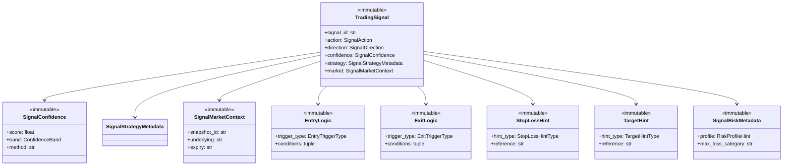

# Trading Signal — Software Engineering Specification

| Field | Value |
|---|---|
| **Module** | `strategy/signals.py` |
| **Document version** | 1.0.0 |
| **Status** | Draft — ready for implementation |
| **Owner** | THETA AI TRADER Core Platform |
| **Last updated** | 2026-08-03 |

---

## 1. Purpose

`strategy/signals.py` defines the **canonical, immutable trading signal contract** for THETA AI TRADER.

A trading signal is the standardized unit of **strategy intent** passed from the Strategy Engine layer to downstream analytical and decision layers (Risk Engine, Trade Decision Engine, Position Sizing Engine, Execution Intelligence). It expresses *what kind of trade setup is suggested, with what confidence, under what conditions, and within what time horizon* — without placing orders, without broker tokens, and without performing risk enforcement.

Today, signal-shaped data appears in multiple forms: minimal inline types in `strategy/base_strategy.py`, legacy dict outputs from root-level `strategy_engine.py`, and ad-hoc result payloads across pipeline scripts. Each representation uses different field names, omits explainability metadata, or conflates strategy intent with execution parameters. That fragmentation prevents safe multi-strategy aggregation, blocks audit-grade replay, and makes capital-protection gates unreliable.

This module resolves that by providing:

1. A **frozen, typed signal model** (`TradingSignal`) that strategy plugins produce and downstream engines consume.
2. **Explicit signal taxonomy** — actions, directions, types, strength, entry/exit semantics — so orchestrators branch deterministically.
3. **Informational risk and structure metadata** separated from enforcement (Risk Engine owns enforcement).
4. **Deterministic serialization** for audit trails, event bus transport, and test fixtures.
5. **Validation API** with stable error codes under `TRADING_SIGNAL.*`.

### Pipeline placement

```text
[Market Data Engine]
    → MarketSnapshot (immutable)
              ↓
[Strategy Engine / BaseStrategy plugins]
    → TradingSignal (× N per run)
              ↓
[Signal validation & aggregation]  (strategy_engine layer)
    → AggregatedSignalResult
              ↓
[Risk Engine]           ← consumes signals; does NOT mutate them
    → RiskDecision
              ↓
[Trade Decision Engine] → [Position Sizing] → [Execution Intelligence]
    (downstream — out of scope for this module)
```

### Goals

1. Replace ad-hoc signal dicts and duplicated inline types with one production-grade immutable model.
2. Enable **strategy independence** — the signal schema does not import strategy plugins or strategy engine orchestration.
3. Enable **broker independence** — no tradingsymbols as order instructions, no quantities, no order types, no broker IDs.
4. Enable **risk independence** — risk metadata on signals is informational; Risk Engine performs all capital-protection checks.
5. Support **multi-strategy aggregation** with deterministic ordering, conflict detection, and explainability preservation.
6. Align with `MarketSnapshot` provenance and `BaseEngine` traceability conventions.

### Success criteria

- Any `BaseStrategy` plugin returns a validated `TradingSignal` — never `None`, never a raw dict.
- Risk and Trade Decision engines consume `TradingSignal` without strategy-engine or broker imports.
- Identical inputs produce semantically equal signals (deterministic IDs where configured).
- JSON round-trip preserves semantic equality.
- Signal validation fails closed on malformed or semantically inconsistent signals.

### Relationship to other modules

| Module | Relationship |
|---|---|
| `strategy/base_strategy.py` | **Primary producer contract.** `BaseStrategy._execute` returns `TradingSignal`; inline types migrate here. |
| `engines/strategy_engine.py` (future) | **Orchestrator.** Validates, aggregates, and publishes signals; imports this module. |
| `market_data/market_snapshot.py` | **Upstream context.** Signals reference `snapshot_id`, underlying, expiry from snapshot — never embed full chains. |
| `core/base_engine.py` | **Foundation.** Signal producers extend `BaseEngine`; signals are not `EngineResult` payloads themselves but may appear inside them. |
| `core/event_bus.py` | **Transport.** Aggregated signals published on `strategy.signal.*` topics via event envelopes. |
| Risk / Trade Decision / Execution engines | **Downstream consumers.** Read-only consumption of validated signals. |

---

## 2. Responsibilities

`strategy/signals.py` **is responsible for**:

| # | Responsibility | Description |
|---|---|---|
| R1 | **Canonical signal model** | Define `TradingSignal` as the immutable root type for strategy intent. |
| R2 | **Signal taxonomy** | Define enumerations for action, direction, type, strength, and lifecycle phase. |
| R3 | **Confidence model** | Define `SignalConfidence`, `ConfidenceBand`, and optional factor breakdown types. |
| R4 | **Entry semantics** | Define `EntryLogic` — descriptive conditions under which entry is suggested. |
| R5 | **Exit semantics** | Define `ExitLogic` — descriptive conditions under which exit or adjustment is suggested. |
| R6 | **Stop-loss hints** | Define `StopLossHint` — abstract protective level descriptors, not broker stop orders. |
| R7 | **Target hints** | Define `TargetHint` — abstract profit objective descriptors, not limit orders. |
| R8 | **Time validity** | Define `SignalTimeValidity` — actionable window and session constraints. |
| R9 | **Signal expiration** | Define expiration rules via `valid_until` and staleness evaluation helpers. |
| R10 | **Risk metadata (informational)** | Define `SignalRiskMetadata` — hints only; no margin or exposure enforcement. |
| R11 | **Strategy provenance** | Define embedded strategy identity fields and `SignalStrategyMetadata`. |
| R12 | **Market context references** | Define `SignalMarketContext` — lightweight references to snapshot fields, not full market data. |
| R13 | **Structure hints** | Define `StructureHint` — abstract multi-leg layout guidance without executable legs. |
| R14 | **Aggregation types** | Define `SignalBundle`, `AggregatedSignalResult` for multi-signal engine output. |
| R15 | **Validation API** | Provide `validate_trading_signal`, `validate_signal_bundle`, and semantic check helpers. |
| R16 | **Serialization** | Provide `to_dict`, `from_dict`, `to_json`, `from_json` with schema version handling. |
| R17 | **Staleness evaluation** | Provide `is_signal_expired`, `remaining_validity_seconds` for downstream gating. |
| R18 | **Error taxonomy** | Stable codes under `TRADING_SIGNAL.*`. |
| R19 | **Documentation contract** | Google-style docstrings on all public types and functions. |
| R20 | **Schema version constant** | Export `TRADING_SIGNAL_SCHEMA_VERSION`. |

---

## 3. Non-Responsibilities

`strategy/signals.py` **must not**:

| # | Non-responsibility | Rationale |
|---|---|---|
| NR1 | **Place, modify, or cancel orders** | Execution belongs in execution intelligence and broker layers. |
| NR2 | **Perform risk management or margin checks** | Risk Engine enforces capital protection; signal risk fields are hints only. |
| NR3 | **Size positions or compute quantities** | Position Sizing Engine consumes signals after risk approval. |
| NR4 | **Fetch market data or call brokers** | Signals reference snapshot identity; they do not acquire data. |
| NR5 | **Import broker SDKs or broker clients** | No Zerodha, Kite, or vendor-specific types. |
| NR6 | **Import strategy plugins or StrategyEngine** | Signal model is consumed by strategies; it must not depend on orchestration. |
| NR7 | **Implement strategy evaluation logic** | Strategies produce signals; this module defines the shape only. |
| NR8 | **Mutate signals after construction** | All types are immutable; corrections require new instances. |
| NR9 | **Persist signals to disk or database** | Persistence is an external concern (event bus subscribers, analytics). |
| NR10 | **Load configuration files or environment variables** | Accept policy objects via function parameters at call sites. |
| NR11 | **Resolve multi-strategy conflicts** | Conflict resolution belongs in Strategy Engine aggregation layer. |
| NR12 | **Calculate Greeks, IV, or regime labels** | Analytical derivation belongs in dedicated engines; optional references only. |
| NR13 | **Authorize live trading** | Final trade permission is downstream; signals express intent only. |

---

## 4. Architecture

### 4.1 Layered design

```text
┌─────────────────────────────────────────────────────────────────────┐
│                     strategy/signals.py                              │
│  (pure domain model — no I/O, no orchestration)                      │
│                                                                      │
│  ┌─────────────┐  ┌──────────────┐  ┌────────────────────────────┐  │
│  │ Enumerations│  │ Core signal  │  │ Semantic sub-records       │  │
│  │ Action      │  │ TradingSignal│  │ EntryLogic, ExitLogic      │  │
│  │ Direction   │  │ SignalBundle │  │ StopLossHint, TargetHint   │  │
│  │ Type/Strength│ │ Aggregated.. │  │ SignalRiskMetadata         │  │
│  └─────────────┘  └──────────────┘  │ SignalMarketContext        │  │
│                                      └────────────────────────────┘  │
│  ┌─────────────────────────────────────────────────────────────────┐  │
│  │ Validation · Serialization · Staleness · Factory helpers       │  │
│  └─────────────────────────────────────────────────────────────────┘  │
└──────────────────────────────┬──────────────────────────────────────┘
                               │
         ┌─────────────────────┼─────────────────────┐
         ▼                     ▼                     ▼
  BaseStrategy           StrategyEngine          Risk Engine
  (produces)             (validates/aggregates)  (consumes read-only)
```

### 4.2 Design principles

- **Immutable boundaries** — all public types use `frozen=True` dataclasses; collections are `tuple` or `MappingProxyType`.
- **Intent, not instruction** — signals describe *what* and *why*; downstream engines decide *how much* and *whether*.
- **Broker neutrality** — no `tradingsymbol`, `instrument_token`, `order_type`, `quantity`, or `product` fields on core signal types.
- **Strategy neutrality** — schema does not import strategy implementations; strategy identity is embedded data.
- **Risk neutrality** — `SignalRiskMetadata` is informational; Risk Engine may ignore or override.
- **Determinism** — no randomness in validation or serialization; deterministic ID generation is optional and explicit.
- **Fail closed** — invalid signals are rejected, never coerced into actionable states silently.
- **Explainability** — every non-abstain signal carries non-empty `reasons`; optional machine-readable `factors`.

### 4.3 Type hierarchy

```text
TradingSignal
├── identity: signal_id, as_of, valid_until
├── strategy: SignalStrategyMetadata
├── intent: action, direction, signal_type, strength
├── confidence: SignalConfidence
├── market: SignalMarketContext
├── structure: StructureHint | None
├── entry: EntryLogic | None
├── exit: ExitLogic | None
├── stop_loss: StopLossHint | None
├── target: TargetHint | None
├── risk: SignalRiskMetadata | None
├── time_validity: SignalTimeValidity | None
├── reasons: tuple[str, ...]
├── factors: tuple[SignalFactor, ...]
└── metadata: immutable mapping (extension labels)

SignalBundle
└── signals: tuple[TradingSignal, ...]

AggregatedSignalResult
├── primary_signal: TradingSignal | None
├── secondary_signals: tuple[TradingSignal, ...]
├── abstain_signals: tuple[TradingSignal, ...]
├── aggregate_confidence: SignalConfidence
└── aggregation_metadata: AggregationMetadata
```

### 4.4 Relationship diagram



### 4.5 Allowed dependencies

| Dependency | Usage |
|---|---|
| Python standard library | `dataclasses`, `datetime`, `enum`, `json`, `hashlib`, `re`, `types.MappingProxyType`, `typing` |
| `market_data.market_snapshot` | **Optional type-only imports** for `OptionType` in `StructureHint` — no snapshot fetching |

### 4.6 Forbidden dependencies

- `broker/*`, `kiteconnect`, any vendor SDK
- `strategy/base_strategy.py`, `strategy_engine.py` (orchestration)
- Risk, execution, or order modules
- `config_manager`, environment loaders
- `pandas`, `numpy` inside this module

### 4.7 Dependency direction

```text
strategy/base_strategy.py  →  strategy/signals.py  →  stdlib (+ optional OptionType enum)
strategy_engine            →  strategy/signals.py
risk_engine                  →  strategy/signals.py  (read-only)
```

No reverse imports from `strategy/signals.py` into strategy plugins or engines.

---

## 5. Signal Lifecycle

### 5.1 End-to-end lifecycle

```text
[MarketSnapshot available]
    → BaseStrategy._execute(context)
        → build TradingSignal (immutable)
    → BaseStrategy.validate_trading_signal (plugin boundary)
    → StrategyEngine SignalValidator (orchestrator boundary)
    → ConflictDetector / ConflictResolver (optional)
    → SignalAggregator → AggregatedSignalResult
    → EventBus publish (strategy.signal.generated | abstain)
    → Risk Engine reads signal (read-only)
    → Trade Decision Engine (if risk approved)
    → Execution Intelligence (order construction — outside signal module)
```

### 5.2 Signal instance lifecycle

```text
[Construction]
    → validate required fields at factory/builder boundary
    → TradingSignal frozen instance created
    → state = CREATED

[Validation]
    → validate_trading_signal(signal, context?)
    → state = VALID or REJECTED (validation result, not mutable signal state)

[Aggregation]
    → included in SignalBundle / AggregatedSignalResult
    → state = AGGREGATED (logical; instance unchanged)

[Downstream consumption]
    → Risk Engine evaluates (external)
    → is_signal_expired checked before trade decision
    → state = CONSUMED (logical audit flag external to signal)

[Expiration]
    → wall clock exceeds valid_until
    → is_signal_expired returns True
    → downstream must treat as stale — no mutation of original signal
```

### 5.3 Lifecycle states (logical)

| State | Description | Downstream behaviour |
|---|---|---|
| `CREATED` | Signal constructed and passed plugin validation | Eligible for engine aggregation |
| `VALIDATED` | Passed orchestrator-level validation | Eligible for risk evaluation |
| `AGGREGATED` | Included in aggregate result | Primary or secondary candidate |
| `STALE` | `is_signal_expired(signal, now) == True` | Must not initiate new trades |
| `SUPERSEDED` | Newer signal with same strategy_id + underlying | Older signal ignored (orchestrator policy) |
| `REJECTED` | Failed validation | Excluded from aggregation; error recorded |

Signals do not embed mutable lifecycle state. Lifecycle is tracked externally (engine results, event bus, audit log).

### 5.4 Idempotency and supersession

- Given identical strategy inputs and deterministic ID policy, signal construction produces equal `TradingSignal` instances.
- Supersession is an orchestrator concern: a new pipeline tick produces a new signal; downstream compares `as_of` and `signal_id`.
- Expired signals are never updated — a fresh evaluation produces a new immutable instance.

### 5.5 Abstain lifecycle

When a strategy cannot act:

1. Plugin returns `TradingSignal` with `action = ABSTAIN` or `NO_TRADE`.
2. `confidence.score` may be `0.0` (default) or high (confident abstain).
3. `reasons` must explain abstention.
4. Signal still flows through validation and aggregation for audit completeness.

**Never return `None` from strategy execution.**

---

## 6. Signal Types

### 6.1 Purpose

`SignalType` classifies the **role** of a signal in the trade lifecycle — distinct from `SignalAction` (intent severity) and `SignalDirection` (market bias).

### 6.2 `SignalType` enumeration (v1)

| Value | Description | Typical `SignalAction` pairing |
|---|---|---|
| `SETUP` | Initial strategy setup identified; not yet entry-ready | `WAIT`, `EVALUATE` |
| `ENTRY` | Entry conditions met or entry window open | `EVALUATE` |
| `ADJUSTMENT` | Roll, widen, or restructure suggestion | `EVALUATE`, `WAIT` |
| `EXIT` | Close or reduce recommendation | `EVALUATE`, `NO_TRADE` |
| `HEDGE` | Protective overlay suggestion | `EVALUATE` |
| `MONITOR` | Continue monitoring; no structure change | `WAIT` |
| `ABSTAIN` | Explicit non-action classification | `ABSTAIN`, `NO_TRADE` |
| `INFORMATIONAL` | Analytics-only signal for logging/dashboards | `WAIT` |

Subclass `str, Enum` for JSON compatibility.

### 6.3 `SignalAction` enumeration (v1)

| Value | Meaning | Downstream interpretation |
|---|---|---|
| `EVALUATE` | Actionable setup — downstream should evaluate structure and strikes | May proceed to risk if other gates pass |
| `WAIT` | Not actionable now — monitor for condition changes | No new trades |
| `NO_TRADE` | Explicit abstain for this evaluation tick | No new trades |
| `ABSTAIN` | Insufficient data, policy skip, or plugin decline | No new trades |

**Invariant:** `action=EVALUATE` requires non-empty `reasons`, valid `confidence`, and compatible `signal_type` (not `ABSTAIN`).

### 6.4 Action vs type matrix (compatibility)

| SignalType | Allowed SignalAction values | Forbidden |
|---|---|---|
| `ENTRY` | `EVALUATE`, `WAIT` | `ABSTAIN` as sole action without reasons |
| `EXIT` | `EVALUATE`, `NO_TRADE` | — |
| `ABSTAIN` | `ABSTAIN`, `NO_TRADE` | `EVALUATE` |
| `SETUP` | `WAIT`, `EVALUATE` | — |
| `INFORMATIONAL` | `WAIT` | `EVALUATE` |

Validation rule **ST-001**: `signal_type=ABSTAIN` implies `action` in `{ABSTAIN, NO_TRADE}`.

Validation rule **ST-002**: `action=EVALUATE` implies `signal_type != ABSTAIN`.

### 6.5 Default signal type inference (factory helper)

When plugins omit explicit `signal_type`, factory helper `infer_signal_type(action, direction)` applies:

| Condition | Inferred `SignalType` |
|---|---|
| `action in {ABSTAIN, NO_TRADE}` | `ABSTAIN` |
| `action = WAIT` | `MONITOR` |
| `action = EVALUATE` and exit fields populated | `EXIT` |
| `action = EVALUATE` and entry fields populated | `ENTRY` |
| `action = EVALUATE` otherwise | `SETUP` |

Explicit `signal_type` from plugin always overrides inference.

---

## 7. Direction Enum

### 7.1 Purpose

`SignalDirection` expresses the **market bias** implied by the suggested structure — not a forecast, not an order side.

### 7.2 `SignalDirection` enumeration (v1)

| Value | Meaning | Example structures |
|---|---|---|
| `NEUTRAL` | Non-directional premium selling/buying | Short strangle, iron condor |
| `BULLISH` | Upside bias | Bull put spread, jade lizard (bullish variant) |
| `BEARISH` | Downside bias | Bear call spread |
| `LONG_VOL` | Long volatility bias | Long straddle, long strangle |
| `SHORT_VOL` | Short volatility bias | Short strangle, iron condor |
| `UNKNOWN` | Undetermined or abstain | Abstain signals, incomplete setup |

Subclass `str, Enum` for JSON serialization.

### 7.3 Direction compatibility with strategy family

Informational matrix for validation warnings (not hard errors in v1):

| StrategyFamily (hint) | Expected direction set |
|---|---|
| `SHORT_STRANGLE` | `{NEUTRAL, SHORT_VOL}` |
| `IRON_CONDOR` | `{NEUTRAL, SHORT_VOL}` |
| `BULL_PUT_SPREAD` | `{BULLISH}` |
| `BEAR_CALL_SPREAD` | `{BEARISH}` |
| `LONG_VOLATILITY` | `{LONG_VOL}` |
| `NO_STRATEGY` | `{UNKNOWN}` |

Mismatch produces validation **warning** `TRADING_SIGNAL.DIRECTION.FAMILY_MISMATCH` unless `strict_direction_check=True` in validation policy.

### 7.4 Direction in conflict detection

Strategy Engine uses direction for conflict detection (external to this module):

- `BULLISH` vs `BEARISH` both with `action=EVALUATE` → directional opposition conflict.
- `NEUTRAL` vs `LONG_VOL` in same mutex group → family conflict.

Signal module exports `are_directions_opposed(a, b) -> bool` as a pure helper.

---

## 8. Confidence Model

### 8.1 Purpose

Confidence quantifies **how strongly the strategy supports its stated intent** on a normalized 0–100 scale. Confidence is **not** approval to trade, **not** win probability, and **not** position size.

### 8.2 `SignalConfidence` (immutable)

| Field | Type | Required | Description |
|---|---|---|---|
| `score` | `float` | Yes | Normalized score in `[0.0, 100.0]` inclusive. |
| `band` | `ConfidenceBand` | Yes | Derived band — must match score (see §8.3). |
| `method` | `str` | Yes | Scoring method identifier, e.g. `"short_strangle_v1"`, `"abstain"`. |
| `components` | `tuple[ConfidenceComponent, ...]` | No | Weighted factor breakdown. |

### 8.3 `ConfidenceBand` enumeration

| Band | Score range (inclusive lower, exclusive upper) |
|---|---|
| `LOW` | `[0.0, 40.0)` |
| `MEDIUM` | `[40.0, 60.0)` |
| `HIGH` | `[60.0, 80.0)` |
| `VERY_HIGH` | `[80.0, 100.0]` |

Mapping function: `confidence_band_for_score(score: float) -> ConfidenceBand` — deterministic, shared with strategy layer.

### 8.4 `ConfidenceComponent` (immutable)

| Field | Type | Description |
|---|---|---|
| `name` | `str` | Factor identifier, e.g. `"iv_rank"`, `"spread_quality"`. |
| `weight` | `float` | Weight in `[0.0, 1.0]`; components should sum to ~1.0 when complete. |
| `score` | `float` | Factor score in `[0.0, 100.0]`. |
| `contribution` | `float` | `weight * score`; precomputed for explainability. |
| `description` | `str` | Human-readable factor explanation. |

### 8.5 Confidence rules

| Rule ID | Rule |
|---|---|
| CON-001 | `score` must be finite and within `[0.0, 100.0]`. |
| CON-002 | `band` must equal `confidence_band_for_score(score)`. |
| CON-003 | `action=ABSTAIN` may use `score=0.0`; reasons must still be non-empty. |
| CON-004 | Confident abstain allowed: `action=NO_TRADE` with `score >= 80` and reasons explaining high-confidence skip. |
| CON-005 | Aggregate confidence (in `AggregatedSignalResult`) must not exceed max plugin score unless explicit bonus config in Strategy Engine. |

### 8.6 Confidence vs signal strength

| Dimension | Confidence | Signal strength (§9) |
|---|---|---|
| Question answered | "How sure is the strategy about this intent?" | "How strong is the setup edge?" |
| Scale | 0–100 normalized | `SignalStrength` enum |
| Used for | Downstream gating hints, aggregation ranking | UI emphasis, optional tie-breaking |
| Enforced by | Validation (band/score consistency) | Semantic warnings only in v1 |

Both may appear on the same signal; they must not be conflated in field naming.

---

## 9. Signal Strength

### 9.1 Purpose

`SignalStrength` provides a **coarse ordinal classification** of setup quality or edge magnitude — complementary to numeric confidence. Useful for dashboards, conflict tie-breaking, and human scanning.

### 9.2 `SignalStrength` enumeration (v1)

| Value | Ordinal | Description |
|---|---|---|
| `NONE` | 0 | No meaningful setup (typical abstain) |
| `WEAK` | 1 | Marginal setup; low priority |
| `MODERATE` | 2 | Acceptable setup |
| `STRONG` | 3 | High-quality setup |
| `EXCEPTIONAL` | 4 | Rare high-conviction setup |

### 9.3 Strength inference guidelines (informational)

| Condition | Suggested strength |
|---|---|
| `action in {ABSTAIN, NO_TRADE}` | `NONE` |
| `confidence.score < 40` | `WEAK` |
| `40 <= confidence.score < 60` | `MODERATE` |
| `60 <= confidence.score < 80` | `STRONG` |
| `confidence.score >= 80` | `EXCEPTIONAL` |

Plugins may set strength explicitly; factory helper `infer_signal_strength(confidence, action)` available.

### 9.4 Strength validation rules

| Rule ID | Rule |
|---|---|
| STR-001 | `strength=NONE` implies `action in {ABSTAIN, NO_TRADE, WAIT}`. |
| STR-002 | `strength=EXCEPTIONAL` implies `confidence.score >= 75` (warning if violated). |
| STR-003 | Strength is optional on `TradingSignal`; default `NONE` for abstain, `MODERATE` for `EVALUATE` when omitted. |

---

## 10. Entry Logic

### 10.1 Purpose

`EntryLogic` describes **under what conditions entry should be considered** — a structured, explainable intent record. It is not an order trigger and not executed by this module.

### 10.2 `EntryLogic` (immutable)

| Field | Type | Required | Description |
|---|---|---|---|
| `trigger_type` | `EntryTriggerType` | Yes | Primary entry trigger classification. |
| `conditions` | `tuple[EntryCondition, ...]` | Yes | Ordered list of conditions (may be empty for unconditional evaluate). |
| `preferred_session_window` | `SessionWindow | None` | No | Preferred session segment, e.g. morning decay. |
| `reentry_allowed` | `bool` | No | Default `False` — whether re-entry after exit is intended. |
| `notes` | `str | None` | No | Free-form institutional notes (short, log-safe). |

### 10.3 `EntryTriggerType` enumeration

| Value | Description |
|---|---|
| `IMMEDIATE` | Conditions met at signal `as_of` — evaluate now |
| `LIMIT_TOUCH` | Enter when underlying reaches reference level |
| `TIME_WINDOW` | Enter within specified time window |
| `VOLATILITY_REGIME` | Enter when vol regime matches (descriptive label) |
| `CONFIRMATION` | Requires secondary confirmation (e.g., OI shift) |
| `MANUAL_REVIEW` | Human review required before entry |
| `NOT_APPLICABLE` | Non-entry signals (exit, abstain) |

### 10.4 `EntryCondition` (immutable)

| Field | Type | Description |
|---|---|---|
| `condition_id` | `str` | Stable identifier, e.g. `"spot_above_vwap"`. |
| `operator` | `ConditionOperator` | `EQ`, `GT`, `LT`, `GTE`, `LTE`, `IN`, `BETWEEN`. |
| `reference` | `str` | Reference label — not a broker token, e.g. `"atm_strike"`, `"vix_20"`. |
| `value` | `float | str | tuple[float, float] | None` | Comparison value(s). |
| `met` | `bool | None` | Whether condition evaluated true at signal time; `None` if not evaluated. |
| `description` | `str` | Human-readable explanation. |

### 10.5 Entry logic rules

| Rule ID | Rule |
|---|---|
| ENT-001 | `action=EVALUATE` with `signal_type=ENTRY` should include `entry` block (warning if missing). |
| ENT-002 | `trigger_type=IMMEDIATE` requires at least one condition with `met=True` OR empty conditions with explicit `notes`. |
| ENT-003 | Entry logic must not contain broker order types, quantities, or tradingsymbols. |
| ENT-004 | Reference labels must match `[a-z][a-z0-9_]{0,63}` pattern. |

---

## 11. Exit Logic

### 11.1 Purpose

`ExitLogic` describes **under what conditions a position should be closed, reduced, or rolled** — descriptive metadata for downstream trade management engines (APME), not executed exits.

### 11.2 `ExitLogic` (immutable)

| Field | Type | Required | Description |
|---|---|---|---|
| `trigger_type` | `ExitTriggerType` | Yes | Primary exit trigger classification. |
| `conditions` | `tuple[ExitCondition, ...]` | Yes | Ordered exit conditions. |
| `exit_fraction` | `float | None` | No | Fraction of position to exit `[0.0, 1.0]` when hint applies; not an order size. |
| `roll_to_expiry` | `str | None` | No | ISO date hint for roll target expiry. |
| `notes` | `str | None` | No | Short institutional notes. |

### 11.3 `ExitTriggerType` enumeration

| Value | Description |
|---|---|
| `PROFIT_TARGET` | Exit on profit objective reached |
| `STOP_LOSS` | Exit on protective level breached |
| `TIME_DECAY` | Exit based on theta/time milestone |
| `EXPIRY_APPROACH` | Exit or roll near expiry |
| `VOLATILITY_SHIFT` | Exit on vol regime change |
| `DELTA_BREACH` | Exit on delta threshold |
| `MANUAL` | Discretionary exit recommendation |
| `NOT_APPLICABLE` | Non-exit signals |

### 11.4 `ExitCondition` (immutable)

Same shape as `EntryCondition` with exit-specific `condition_id` namespace (`exit.*` prefix recommended).

### 11.5 Exit logic rules

| Rule ID | Rule |
|---|---|
| EXT-001 | `signal_type=EXIT` should include `exit` block. |
| EXT-002 | `exit_fraction` if present must be in `[0.0, 1.0]`. |
| EXT-003 | Exit logic must not specify broker order parameters. |

---

## 12. Stop Loss

### 12.1 Purpose

`StopLossHint` expresses an **abstract protective level** or **loss limit category** for downstream translation by Risk Engine and APME — never a broker stop-loss order.

### 12.2 `StopLossHint` (immutable)

| Field | Type | Required | Description |
|---|---|---|---|
| `hint_type` | `StopLossHintType` | Yes | Classification of stop representation. |
| `reference` | `str` | Yes | Semantic reference label, e.g. `"short_strike"`, `"premium_multiple"`. |
| `value` | `float | None` | No | Numeric hint (points, percent, or multiple) — interpretation is type-dependent. |
| `value_unit` | `ValueUnit | None` | No | `POINTS`, `PERCENT`, `MULTIPLE`, `ABSOLUTE_PREMIUM`. |
| `basis` | `str | None` | No | Basis description, e.g. `"underlying_close"`, `"net_credit"`. |
| `description` | `str` | No | Human-readable explanation. |

### 12.3 `StopLossHintType` enumeration

| Value | Description |
|---|---|
| `UNDERLYING_LEVEL` | Stop referenced to underlying price level |
| `PREMIUM_MULTIPLE` | Stop as multiple of collected/paid premium |
| `PERCENT_OF_CAPITAL` | Category hint as percent of allocated capital (not computed here) |
| `STRUCTURE_BREACH` | Structure invalidation, e.g. short strike touched |
| `TIME_STOP` | Exit if not profitable by time threshold |
| `NONE` | No stop hint |

### 12.4 Stop loss rules

| Rule ID | Rule |
|---|---|
| SL-001 | Stop hints must not include broker `trigger_price` or order IDs. |
| SL-002 | `hint_type=NONE` should not appear with populated `value` (warning). |
| SL-003 | `value` if present must be finite and > 0. |
| SL-004 | For defined-risk structures, prefer `STRUCTURE_BREACH` or `UNDERLYING_LEVEL` over `PERCENT_OF_CAPITAL`. |

### 12.5 Relationship to risk engine

Risk Engine may:

- Translate hints into maximum loss estimates.
- Reject signals whose implied loss exceeds policy (external computation).
- Ignore hints entirely if insufficient data.

Signal module **does not** compute loss amounts or enforce limits.

---

## 13. Target

### 13.1 Purpose

`TargetHint` expresses an **abstract profit objective** — not a limit order price or guaranteed exit.

### 13.2 `TargetHint` (immutable)

| Field | Type | Required | Description |
|---|---|---|---|
| `hint_type` | `TargetHintType` | Yes | Classification of target representation. |
| `reference` | `str` | Yes | Semantic reference, e.g. `"net_credit"`, `"premium_decay_50pct"`. |
| `value` | `float | None` | No | Numeric hint (percent of credit, points, etc.). |
| `value_unit` | `ValueUnit | None` | No | Unit of `value`. |
| `basis` | `str | None` | No | Basis description. |
| `description` | `str | None` | No | Human-readable explanation. |

### 13.3 `TargetHintType` enumeration

| Value | Description |
|---|---|
| `PREMIUM_DECAY_PERCENT` | Target fraction of premium decay |
| `PREMIUM_MULTIPLE` | Target as multiple of credit/debit |
| `UNDERLYING_LEVEL` | Target underlying price zone |
| `RISK_REWARD_RATIO` | Target R:R category hint |
| `TIME_TARGET` | Hold until time milestone |
| `NONE` | No target hint |

### 13.4 Target rules

| Rule ID | Rule |
|---|---|
| TG-001 | Target hints must not include broker limit prices or order quantities. |
| TG-002 | `value` if present must be finite and > 0. |
| TG-003 | Paired stop/target hints should use consistent `basis` (warning if inconsistent). |

---

## 14. Time Validity

### 14.1 Purpose

`SignalTimeValidity` defines the **window during which a signal's intent should be acted upon** — distinct from signal expiration (§15).

### 14.2 `SignalTimeValidity` (immutable)

| Field | Type | Required | Description |
|---|---|---|---|
| `valid_from` | timezone-aware datetime | No | Start of validity window; defaults to `signal.as_of`. |
| `valid_until` | timezone-aware datetime | No | End of validity window; may mirror top-level `TradingSignal.valid_until`. |
| `session_scope` | `SessionScope | None` | No | Session binding, e.g. `REGULAR`, `FULL_DAY`. |
| `intraday_only` | `bool` | No | Default `True` for index options intraday signals. |
| `expiry_session_cutoff` | `time | None` | No | Latest time-of-day for action, e.g. `15:15` IST. |
| `timezone` | `str` | No | IANA timezone, default `"Asia/Kolkata"`. |

### 14.3 `SessionScope` enumeration

| Value | Description |
|---|---|
| `REGULAR` | Regular market session only |
| `PRE_OPEN` | Pre-open session |
| `POST_CLOSE` | After regular close (analysis) |
| `FULL_DAY` | Any time on trading day |
| `MULTI_DAY` | Valid across multiple sessions until `valid_until` |

### 14.4 Time validity rules

| Rule ID | Rule |
|---|---|
| TV-001 | `valid_from` and `valid_until` must be timezone-aware when provided. |
| TV-002 | `valid_until >= valid_from` when both provided. |
| TV-003 | Top-level `TradingSignal.valid_until` if set must agree with `time_validity.valid_until` when both present. |
| TV-004 | LIVE mode downstream must reject signals outside session scope (orchestrator/risk policy). |

### 14.5 `SessionWindow` (supporting type)

| Field | Type | Description |
|---|---|---|
| `start_time` | `time` | Window start (local session timezone). |
| `end_time` | `time` | Window end. |
| `timezone` | `str` | IANA timezone. |
| `label` | `str` | e.g. `"morning_decay"`. |

---

## 15. Signal Expiration

### 15.1 Purpose

Signal expiration determines when a signal becomes **stale** and must not drive new trade decisions. Expiration is evaluated against wall-clock or pipeline `reference_time` — signals are never mutated when expired.

### 15.2 Expiration fields

| Field | Location | Description |
|---|---|---|
| `valid_until` | `TradingSignal` | Primary expiration timestamp (timezone-aware). |
| `time_validity.valid_until` | `SignalTimeValidity` | Optional duplicate; must be consistent. |
| `as_of` | `TradingSignal` | Decision timestamp; expiration must not precede. |

### 15.3 Default expiration policy

When plugins omit `valid_until`, factory applies defaults by `execution_mode` hint in metadata:

| Mode | Default `valid_until` |
|---|---|
| `LIVE` | `as_of + 120 seconds` |
| `ANALYSIS` | `as_of + 24 hours` |
| `BACKTEST` | `as_of + 1 tick` (simulation step) |

Defaults are configurable via `SignalExpirationPolicy` frozen dataclass passed to factory helpers — not loaded from environment inside this module.

### 15.4 Staleness API

| Function | Signature | Behaviour |
|---|---|---|
| `is_signal_expired` | `(signal, *, reference_time: datetime) -> bool` | `True` if `reference_time > valid_until`. |
| `remaining_validity_seconds` | `(signal, *, reference_time: datetime) -> float` | Seconds until expiration; negative if expired. |
| `assert_signal_fresh` | `(signal, *, reference_time) -> None` | Raises `TradingSignalExpiredError` if expired. |

### 15.5 Expiration rules

| Rule ID | Rule |
|---|---|
| EXP-001 | `valid_until` must be timezone-aware when provided. |
| EXP-002 | `valid_until >= as_of`. |
| EXP-003 | Expired signals remain valid as audit artifacts — never deleted or mutated. |
| EXP-004 | Downstream must not initiate new trades on expired signals (Risk Engine enforcement). |

### 15.6 Expiration error

| Exception | Code | When |
|---|---|---|
| `TradingSignalExpiredError` | `TRADING_SIGNAL.EXPIRED` | `assert_signal_fresh` failure |

---

## 16. Risk Metadata

### 16.1 Purpose

`SignalRiskMetadata` carries **informational risk characteristics** of the suggested structure. It supports downstream Risk Engine analysis but **does not enforce** limits, margin checks, or capital allocation.

### 16.2 `SignalRiskMetadata` (immutable)

| Field | Type | Required | Description |
|---|---|---|---|
| `profile` | `RiskProfileHint` | Yes | `DEFINED` or `UNDEFINED` risk structure hint. |
| `max_loss_category` | `str | None` | No | Ordinal category, e.g. `"LOW"`, `"MEDIUM"`, `"HIGH"` — not a currency amount. |
| `max_profit_category` | `str | None` | No | Profit potential category hint. |
| `margin_intensity` | `MarginIntensityHint | None` | No | Qualitative margin demand hint. |
| `gamma_risk` | `RiskLevelHint | None` | No | Qualitative gamma exposure hint. |
| `vega_risk` | `RiskLevelHint | None` | No | Qualitative vega exposure hint. |
| `tail_risk` | `RiskLevelHint | None` | No | Qualitative tail risk hint. |
| `notes` | `str | None` | No | Short explanation. |

### 16.3 Supporting enumerations

**`RiskProfileHint`:** `DEFINED`, `UNDEFINED`

**`MarginIntensityHint`:** `LOW`, `MODERATE`, `HIGH`, `UNKNOWN`

**`RiskLevelHint`:** `LOW`, `MODERATE`, `ELEVATED`, `HIGH`, `UNKNOWN`

### 16.4 Risk metadata rules

| Rule ID | Rule |
|---|---|
| RSK-001 | Risk metadata must not contain currency amounts, lot counts, or margin numbers computed by broker. |
| RSK-002 | Risk metadata must not contain `approved=True/False` — approval is Risk Engine output. |
| RSK-003 | `profile=DEFINED` recommended for spread/condor families (warning if `UNDEFINED`). |
| RSK-004 | Absence of `SignalRiskMetadata` is valid — Risk Engine performs independent analysis. |

### 16.5 Boundary with Risk Engine

```text
TradingSignal.risk  →  informational hints (optional)
                         ↓
Risk Engine           →  computes actual exposure, margin, limits
                         ↓
RiskDecision          →  APPROVE | REJECT | REDUCE (separate module)
```

Signal module never imports Risk Engine types.

---

## 17. Strategy Metadata

### 17.1 Purpose

`SignalStrategyMetadata` embeds **provenance and identity** of the originating strategy plugin into every signal for audit, aggregation, and conflict resolution.

### 17.2 `SignalStrategyMetadata` (immutable)

| Field | Type | Required | Description |
|---|---|---|---|
| `strategy_id` | `str` | Yes | Stable plugin identifier, e.g. `"short_strangle"`. |
| `strategy_version` | `str` | Yes | Semantic version of plugin implementation. |
| `strategy_family` | `StrategyFamily` | Yes | Canonical family enum (shared with strategy layer). |
| `display_name` | `str | None` | No | Human-readable plugin name. |
| `plugin_priority` | `int | None` | No | Registry priority at signal time (informational snapshot). |
| `execution_mode` | `StrategyExecutionMode | None` | No | `LIVE`, `ANALYSIS`, `BACKTEST` at evaluation time. |

### 17.3 `StrategyFamily` enumeration (reference)

Imported or duplicated as stable enum aligned with `strategy/base_strategy.py`:

| Value | Description |
|---|---|
| `SHORT_STRANGLE` | Short strangle |
| `IRON_CONDOR` | Iron condor |
| `BULL_PUT_SPREAD` | Bull put spread |
| `BEAR_CALL_SPREAD` | Bear call spread |
| `BROKEN_WING_BUTTERFLY` | Broken wing butterfly |
| `JADE_LIZARD` | Jade lizard |
| `LONG_VOLATILITY` | Long volatility |
| `CUSTOM` | Custom family (requires extension tag) |
| `NO_STRATEGY` | Explicit no-strategy / abstain |

### 17.4 Strategy metadata rules

| Rule ID | Rule |
|---|---|
| SM-001 | `strategy_id` must match `^[a-z][a-z0-9_]{1,63}$`. |
| SM-002 | `strategy_version` must be valid semver string. |
| SM-003 | `action=EVALUATE` incompatible with `strategy_family=NO_STRATEGY` (error). |
| SM-004 | Metadata is a **snapshot** at signal time — not live registry state. |

### 17.5 Duplication on `TradingSignal`

Top-level `TradingSignal` duplicates key fields for ergonomics and JSON flatness:

- `strategy_id`, `strategy_version`, `strategy_family` mirror `SignalStrategyMetadata` fields.
- Validation requires consistency between top-level and nested `strategy` block when both present.

---

## 18. Market Context

### 18.1 Purpose

`SignalMarketContext` provides **lightweight, immutable references** to the market observation that produced the signal — without embedding full `MarketSnapshot` payloads.

### 18.2 `SignalMarketContext` (immutable)

| Field | Type | Required | Description |
|---|---|---|---|
| `snapshot_id` | `str` | Yes | `MarketSnapshot.provenance.snapshot_id`. |
| `underlying` | `str` | Yes | Canonical underlying symbol, e.g. `"NIFTY"`. |
| `expiry` | `str | None` | No | ISO date from option chain metadata. |
| `spot_at_signal` | `float | None` | No | Underlying last price at signal time (informational). |
| `vix_at_signal` | `float | None` | No | Volatility index at signal time if available. |
| `atm_strike` | `float | None` | No | ATM strike at signal time. |
| `snapshot_as_of` | timezone-aware datetime | No | Snapshot provenance `as_of`. |
| `snapshot_validation_status` | `str | None` | No | e.g. `"VALID"`, `"PARTIAL"` — informational copy. |
| `freshness_status` | `str | None` | No | e.g. `"FRESH"`, `"STALE"` — informational copy. |

### 18.3 Market context construction

Factory helper `market_context_from_snapshot(snapshot: MarketSnapshot) -> SignalMarketContext`:

1. Copies identity and summary fields only.
2. Does not copy option chain contracts.
3. Normalizes underlying to uppercase canonical form.

### 18.4 Market context rules

| Rule ID | Rule |
|---|---|
| MC-001 | `snapshot_id` must be non-empty. |
| MC-002 | `underlying` must match snapshot chain metadata underlying (semantic validation). |
| MC-003 | `spot_at_signal` if present must be finite and > 0. |
| MC-004 | Market context is a **reference**, not an authoritative market data source — consumers fetch snapshot by ID from orchestrator cache if needed. |

### 18.5 `StructureHint` (abstract leg layout)

| Field | Type | Description |
|---|---|---|
| `structure_type` | `str` | e.g. `"STRANGLE"`, `"IRON_CONDOR"`. |
| `leg_count` | `int` | Expected legs (≥ 1). |
| `strike_selection_policy` | `str | None` | e.g. `"DELTA_TARGET"`, `"ATM_OFFSET"`. |
| `target_delta` | `float | None` | Optional delta hint for short legs. |
| `strikes_each_side` | `int | None` | Width hint in strike increments. |
| `option_types` | `tuple[OptionType, ...] | None` | From market_snapshot module. |

Structure hints guide strike selection engines — no tradingsymbols.

---

## 19. Serialization

### 19.1 Formats

| Format | Functions | Use case |
|---|---|---|
| Dictionary | `to_dict(signal) -> dict[str, Any]` | Logging, event payloads |
| JSON | `to_json(signal) -> str` | Persistence, API transport |
| Deserialization | `from_dict(data) -> TradingSignal` | Load from dict |
| JSON parse | `from_json(text) -> TradingSignal` | Load from file/stream |

Same functions exist for `SignalBundle` and `AggregatedSignalResult`.

### 19.2 Schema version

- Constant: `TRADING_SIGNAL_SCHEMA_VERSION = "1.0.0"`.
- Root JSON object includes `"schema_version"`.
- `from_dict` rejects unsupported major versions.
- Minor version additions must be backward compatible with defaults.

### 19.3 JSON root schema (v1) — `TradingSignal`

```json
{
  "schema_version": "1.0.0",
  "signal_id": "550e8400-e29b-41d4-a716-446655440000",
  "as_of": "2026-08-03T10:15:00+05:30",
  "valid_until": "2026-08-03T10:17:00+05:30",
  "action": "evaluate",
  "direction": "neutral",
  "signal_type": "entry",
  "strength": "strong",
  "strategy_id": "short_strangle",
  "strategy_version": "1.0.0",
  "strategy_family": "short_strangle",
  "confidence": {
    "score": 72.5,
    "band": "high",
    "method": "short_strangle_v1",
    "components": []
  },
  "market": {
    "snapshot_id": "a1b2c3d4-e5f6-7890-abcd-ef1234567890",
    "underlying": "NIFTY",
    "expiry": "2026-08-07",
    "spot_at_signal": 24296.75,
    "vix_at_signal": 13.24,
    "atm_strike": 24300.0
  },
  "structure_hint": {
    "structure_type": "STRANGLE",
    "leg_count": 2,
    "strike_selection_policy": "DELTA_TARGET",
    "target_delta": 0.16
  },
  "entry": null,
  "exit": null,
  "stop_loss": null,
  "target": null,
  "risk": {
    "profile": "undefined",
    "max_loss_category": "HIGH",
    "gamma_risk": "moderate"
  },
  "time_validity": null,
  "reasons": [
    "IV rank elevated in range-bound regime",
    "Spot centered inside expected move"
  ],
  "factors": [],
  "metadata": {}
}
```

### 19.4 Serialization rules

1. Timestamps serialize as ISO 8601 with timezone offset.
2. Enums serialize as lowercase string values.
3. Omit `None` optional fields when `omit_nulls=True` (default).
4. `from_dict` / `from_json` must validate after deserialization — never trust external input.
5. Unknown fields in input dicts are ignored with debug-level log recommendation.
6. Dict keys sorted in canonical hash computation for fingerprinting.
7. `metadata` mapping keys sorted lexically in fingerprint.

### 19.5 Deterministic fingerprint

`signal_fingerprint(signal: TradingSignal) -> str`:

- SHA-256 hex digest of canonical JSON (sorted keys, no whitespace).
- Excludes `signal_id` when computing content hash for deduplication option.
- Used for registry snapshots and replay verification.

### 19.6 Event bus payload

When published via EventBus, signal payloads are wrapped in standard envelopes (see `event_bus.md`) with:

- `payload_type = "strategy.signals.TradingSignal"`
- `correlation_id` propagated from pipeline
- `occurred_at = signal.as_of`

---

## 20. Validation

### 20.1 Validation layers

| Layer | Function | When |
|---|---|---|
| **Schema validation** | `validate_trading_signal_schema` | Construction and deserialization |
| **Semantic validation** | `validate_trading_signal_semantics` | Against optional context (snapshot summary) |
| **Bundle validation** | `validate_signal_bundle` | Ordered uniqueness and count limits |
| **Aggregate validation** | `validate_aggregated_result` | Primary/secondary consistency |

Public entry point: `validate_trading_signal(signal, *, context: SignalValidationContext | None = None) -> SignalValidationResult`

### 20.2 `SignalValidationContext` (immutable)

| Field | Type | Description |
|---|---|---|
| `snapshot_id` | `str | None` | Expected snapshot ID for semantic checks. |
| `underlying` | `str | None` | Expected underlying symbol. |
| `execution_mode` | `str | None` | `LIVE`, `ANALYSIS`, `BACKTEST`. |
| `reference_time` | datetime | For expiration checks. |
| `strict` | `bool` | Treat warnings as errors when `True`. |

### 20.3 Schema validation rules

| Rule ID | Condition | Error code |
|---|---|---|
| VAL-001 | Missing required field | `TRADING_SIGNAL.SCHEMA.MISSING_FIELD` |
| VAL-002 | Empty `signal_id` | `TRADING_SIGNAL.SCHEMA.INVALID_ID` |
| VAL-003 | Naive `as_of` or `valid_until` | `TRADING_SIGNAL.SCHEMA.NAIVE_TIMESTAMP` |
| VAL-004 | `confidence.score` outside `[0, 100]` | `TRADING_SIGNAL.SCHEMA.INVALID_SCORE` |
| VAL-005 | `confidence.band` mismatch with score | `TRADING_SIGNAL.SCHEMA.BAND_MISMATCH` |
| VAL-006 | Empty `reasons` | `TRADING_SIGNAL.SCHEMA.EMPTY_REASONS` |
| VAL-007 | Invalid enum value | `TRADING_SIGNAL.SCHEMA.INVALID_ENUM` |
| VAL-008 | `valid_until < as_of` | `TRADING_SIGNAL.SCHEMA.INVALID_EXPIRY` |

### 20.4 Semantic validation rules

| Rule ID | Condition | Error code |
|---|---|---|
| SEM-001 | `snapshot_id` mismatch with context | `TRADING_SIGNAL.SEMANTIC.SNAPSHOT_MISMATCH` |
| SEM-002 | `underlying` mismatch with context | `TRADING_SIGNAL.SEMANTIC.UNDERLYING_MISMATCH` |
| SEM-003 | `action=EVALUATE` with `strategy_family=NO_STRATEGY` | `TRADING_SIGNAL.SEMANTIC.FAMILY_CONFLICT` |
| SEM-004 | Signal expired at `reference_time` | `TRADING_SIGNAL.EXPIRED` |
| SEM-005 | LIVE mode with `freshness_status=STALE` in market context | `TRADING_SIGNAL.SEMANTIC.STALE_CONTEXT` (warning or error per policy) |
| SEM-006 | Broker-specific fields detected in metadata keys | `TRADING_SIGNAL.SEMANTIC.FORBIDDEN_FIELD` |

### 20.5 Forbidden metadata keys (broker leakage detection)

Validation rejects `metadata` keys matching (case-insensitive):

- `tradingsymbol`, `instrument_token`, `order_id`, `quantity`, `product`, `exchange_order_id`, `variety`

### 20.6 Validation outcome

`SignalValidationResult` (immutable):

| Field | Type | Description |
|---|---|---|
| `is_valid` | `bool` | Overall validity |
| `errors` | `tuple[SignalValidationRecord, ...]` | Fatal issues |
| `warnings` | `tuple[SignalValidationRecord, ...]` | Non-fatal issues |

### 20.7 Exception types

| Exception | When |
|---|---|
| `TradingSignalValidationError` | Schema/semantic validation failure (raised by strict helpers) |
| `TradingSignalExpiredError` | Expiration assertion failure |
| `TradingSignalSerializationError` | Invalid JSON or schema version |

All exceptions carry stable `code` and optional `field` path.

---

## 21. Thread Safety

| Aspect | Requirement |
|---|---|
| `TradingSignal` instances | Immutable — safe to share across threads without locking |
| Validation functions | Pure functions of inputs — reentrant and thread-safe |
| Serialization functions | Operate on immutable inputs — thread-safe |
| Factory helpers | Must not use module-level mutable state |
| Global mutable caches | Forbidden in this module |
| Policy objects | `SignalExpirationPolicy`, `ValidationPolicy` must be frozen when shared |

Concurrent validation or serialization of the same signal instance from multiple threads is safe. Callers requiring deduplication caches must implement them externally with appropriate synchronization.

---

## 22. Performance

| Requirement | Target | Notes |
|---|---|---|
| Schema validation per signal | < 0.5 ms median | Pure Python, no I/O |
| Semantic validation per signal | < 1 ms median | With context checks |
| Serialization to JSON | < 2 ms median | Typical signal with full metadata |
| Deserialization from JSON | < 3 ms median | Includes validation |
| Fingerprint computation | < 1 ms median | SHA-256 over canonical JSON |
| Memory per signal instance | ≤ 8 KB | Excluding external snapshot |
| Bundle validation (32 signals) | < 10 ms median | Linear in count |
| Allocation discipline | Use tuples; avoid deep copies | Shallow immutable sharing |

Benchmarks live in `tests/test_trading_signal.py` (performance smoke section).

---

## 23. Future Extensions

Designed for extension without breaking v1 consumers:

| Extension | Description |
|---|---|
| **Multi-underlying signals** | `market.underlyings: tuple[SignalMarketContext, ...]` for pairs/ratio structures |
| **Typed structure legs** | `StructureLegHint` with delta/strike offset without tradingsymbols |
| **Signal lineage** | `parent_signal_id` for adjustment/roll chains |
| **Probabilistic confidence** | Optional `confidence_interval` on `SignalConfidence` |
| **Regime attachment** | `RegimeHint` record from orchestrator — no regime engine import |
| **Greeks snapshot summary** | Optional aggregate greeks hint post-Greeks Engine |
| **Protobuf/Avro serialization** | Alternative formats for high-throughput backtests |
| **Content-addressed signal IDs** | Deterministic IDs from canonical payload hash |
| **Versioned migration adapters** | `migrate_signal_v1_to_v2` for schema evolution |
| **Signal compression** | gzip wrapper for bulk persistence |
| **Cross-strategy correlation ID** | Link related signals from same tick |

Extensions must preserve: immutability, broker independence, no order fields, determinism of validation.

---

## 24. Definition of Done

The `strategy/signals.py` module and this specification are **done** when all of the following are true:

### 24.1 Implementation

- [ ] All public types and functions defined in §2 and §19 are implemented in `strategy/signals.py`.
- [ ] All dataclasses are immutable (`frozen=True`).
- [ ] `TRADING_SIGNAL_SCHEMA_VERSION = "1.0.0"` exported.
- [ ] Stable error codes under `TRADING_SIGNAL.*` implemented.
- [ ] No broker SDK, broker client, risk engine, or strategy engine orchestration imports.
- [ ] Inline signal types removed from `strategy/base_strategy.py` — imports from `strategy.signals` only.
- [ ] Google-style docstrings on all public classes, methods, and module exports.
- [ ] Python 3.12 type hints on all public surfaces; mypy-clean or project-standard equivalent.

### 24.2 Testing

- [ ] `tests/test_trading_signal.py` covers schema validation, semantic validation, serialization round-trip, expiration, immutability, forbidden field detection, and fingerprint stability.
- [ ] Line coverage on `strategy/signals.py` ≥ 95%.
- [ ] Tests run deterministically in CI with no external services, brokers, or network.
- [ ] Thread safety smoke test — concurrent validation/serialization without errors.

### 24.3 Integration

- [ ] `strategy/base_strategy.py` refactored to use canonical `TradingSignal` from this module.
- [ ] `tests/test_base_strategy.py` updated and passing.
- [ ] Strategy Engine aggregation layer consumes canonical types (when implemented).
- [ ] `CHANGELOG.md` updated with "Add trading signal canonical model".

### 24.4 Documentation

- [ ] This specification matches implemented behaviour.
- [ ] Cross-links added in `strategy_engine.md`, `base_engine.md`, and `market_snapshot.md` appendices.
- [ ] Example JSON in §19.3 verified against `to_json` output.

### 24.5 Review checklist

- [ ] Correctness — validation invariants enforced by tests.
- [ ] Readability — new contributor can implement from this spec alone.
- [ ] Maintainability — no trading execution logic in signal module.
- [ ] Architecture alignment — broker/strategy/risk independent; immutable; deterministic.
- [ ] Capital protection — abstain and expiration paths fail closed downstream.
- [ ] Security — no secrets in signals; safe deserialization; forbidden broker field detection.

### 24.6 Sign-off

- [ ] Peer review approved.
- [ ] Specification version bumped if API changed post-review.

---

## Appendix A — Public API summary

| Symbol | Kind | Description |
|---|---|---|
| `TRADING_SIGNAL_SCHEMA_VERSION` | Constant | Current schema semver |
| `TradingSignal` | Dataclass | Canonical immutable signal |
| `SignalBundle` | Dataclass | Ordered collection of signals |
| `AggregatedSignalResult` | Dataclass | Post-aggregation output |
| `SignalConfidence` | Dataclass | Confidence score object |
| `ConfidenceComponent` | Dataclass | Factor breakdown entry |
| `SignalStrategyMetadata` | Dataclass | Embedded strategy provenance |
| `SignalMarketContext` | Dataclass | Lightweight market references |
| `SignalRiskMetadata` | Dataclass | Informational risk hints |
| `EntryLogic` | Dataclass | Entry condition descriptor |
| `ExitLogic` | Dataclass | Exit condition descriptor |
| `StopLossHint` | Dataclass | Abstract stop hint |
| `TargetHint` | Dataclass | Abstract target hint |
| `SignalTimeValidity` | Dataclass | Validity window descriptor |
| `StructureHint` | Dataclass | Abstract structure layout |
| `SignalFactor` | Dataclass | Machine-readable scoring factor |
| `SignalValidationResult` | Dataclass | Validation output |
| `SignalAction` | Enum | High-level intent |
| `SignalDirection` | Enum | Directional bias |
| `SignalType` | Enum | Lifecycle type classification |
| `SignalStrength` | Enum | Ordinal setup strength |
| `ConfidenceBand` | Enum | Confidence band |
| `EntryTriggerType` | Enum | Entry trigger classification |
| `ExitTriggerType` | Enum | Exit trigger classification |
| `StopLossHintType` | Enum | Stop hint classification |
| `TargetHintType` | Enum | Target hint classification |
| `RiskProfileHint` | Enum | Defined/undefined risk hint |
| `validate_trading_signal` | Function | Full validation entry point |
| `is_signal_expired` | Function | Expiration check |
| `signal_fingerprint` | Function | Deterministic content hash |
| `market_context_from_snapshot` | Function | Build market context from snapshot |
| `to_dict` / `from_dict` | Functions | Dict serialization |
| `to_json` / `from_json` | Functions | JSON serialization |
| `TradingSignalValidationError` | Exception | Validation failure |
| `TradingSignalExpiredError` | Exception | Expiration failure |

---

## Appendix B — Error code taxonomy

Namespace: `TRADING_SIGNAL.<CATEGORY>.<DETAIL>`

| Code | Description |
|---|---|
| `TRADING_SIGNAL.SCHEMA.MISSING_FIELD` | Required field absent |
| `TRADING_SIGNAL.SCHEMA.INVALID_ID` | Empty or malformed signal_id |
| `TRADING_SIGNAL.SCHEMA.NAIVE_TIMESTAMP` | Timezone-naive datetime |
| `TRADING_SIGNAL.SCHEMA.INVALID_SCORE` | Confidence score out of range |
| `TRADING_SIGNAL.SCHEMA.BAND_MISMATCH` | Band does not match score |
| `TRADING_SIGNAL.SCHEMA.EMPTY_REASONS` | No explainability reasons |
| `TRADING_SIGNAL.SCHEMA.INVALID_ENUM` | Unknown enum value |
| `TRADING_SIGNAL.SCHEMA.INVALID_EXPIRY` | valid_until before as_of |
| `TRADING_SIGNAL.SEMANTIC.SNAPSHOT_MISMATCH` | snapshot_id mismatch |
| `TRADING_SIGNAL.SEMANTIC.UNDERLYING_MISMATCH` | underlying mismatch |
| `TRADING_SIGNAL.SEMANTIC.FAMILY_CONFLICT` | EVALUATE with NO_STRATEGY |
| `TRADING_SIGNAL.SEMANTIC.STALE_CONTEXT` | Stale market context in LIVE mode |
| `TRADING_SIGNAL.SEMANTIC.FORBIDDEN_FIELD` | Broker field detected in metadata |
| `TRADING_SIGNAL.DIRECTION.FAMILY_MISMATCH` | Direction vs family warning |
| `TRADING_SIGNAL.EXPIRED` | Signal past valid_until |
| `TRADING_SIGNAL.SERIALIZATION.UNSUPPORTED_VERSION` | Unknown schema major version |
| `TRADING_SIGNAL.SERIALIZATION.MALFORMED` | JSON/dict parse failure |
| `TRADING_SIGNAL.BUNDLE.DUPLICATE_ID` | Duplicate signal_id in bundle |
| `TRADING_SIGNAL.BUNDLE.LIMIT_EXCEEDED` | Too many signals in bundle |

---

## Appendix C — `TradingSignal` complete field reference (v1)

| Field | Type | Required | Description |
|---|---|---|---|
| `signal_id` | `str` | Yes | Unique signal identifier (UUID v4 or deterministic hash). |
| `as_of` | timezone-aware datetime | Yes | Decision timestamp. |
| `valid_until` | timezone-aware datetime | No | Expiration timestamp (see §15). |
| `action` | `SignalAction` | Yes | High-level intent. |
| `direction` | `SignalDirection` | Yes | Directional bias. |
| `signal_type` | `SignalType` | No | Lifecycle type; inferred if omitted. |
| `strength` | `SignalStrength` | No | Setup strength ordinal. |
| `strategy_id` | `str` | Yes | Originating plugin ID (flat field). |
| `strategy_version` | `str` | Yes | Plugin semver (flat field). |
| `strategy_family` | `StrategyFamily` | Yes | Strategy family (flat field). |
| `strategy` | `SignalStrategyMetadata` | No | Nested strategy provenance (recommended). |
| `confidence` | `SignalConfidence` | Yes | Confidence object. |
| `market` | `SignalMarketContext` | Yes | Market references. |
| `structure_hint` | `StructureHint` | No | Abstract leg layout. |
| `entry` | `EntryLogic` | No | Entry conditions. |
| `exit` | `ExitLogic` | No | Exit conditions. |
| `stop_loss` | `StopLossHint` | No | Protective hint. |
| `target` | `TargetHint` | No | Profit objective hint. |
| `risk` | `SignalRiskMetadata` | No | Informational risk hints. |
| `time_validity` | `SignalTimeValidity` | No | Validity window. |
| `reasons` | `tuple[str, ...]` | Yes | Non-empty explainability strings. |
| `factors` | `tuple[SignalFactor, ...]` | No | Machine-readable factors. |
| `metadata` | immutable mapping | No | Extension labels (no broker keys). |

---

## Appendix D — Example operational flow

1. `BaseStrategy._execute` evaluates `MarketSnapshot` via `StrategyContext`.
2. Plugin constructs `TradingSignal` with `action=EVALUATE`, `direction=NEUTRAL`, entry/stop/target hints.
3. Plugin calls `validate_trading_signal` before return.
4. Strategy Engine collects signals, validates again with `SignalValidationContext`.
5. Aggregator selects primary signal; publishes on `strategy.signal.generated`.
6. Risk Engine reads `TradingSignal` — checks `is_signal_expired`, translates `SignalRiskMetadata` hints into exposure analysis.
7. Trade Decision Engine proceeds only if risk approves — signal module not involved further.

---

## Appendix E — Glossary

| Term | Definition |
|---|---|
| **Trading signal** | Immutable expression of strategy intent — not an order. |
| **Signal action** | High-level intent severity (`EVALUATE`, `WAIT`, `NO_TRADE`, `ABSTAIN`). |
| **Signal type** | Lifecycle classification (`ENTRY`, `EXIT`, `SETUP`, etc.). |
| **Confidence** | Normalized 0–100 score with band — not trade approval. |
| **Signal strength** | Ordinal setup quality classification. |
| **Structure hint** | Abstract multi-leg layout guidance without tradingsymbols. |
| **Stop/target hint** | Abstract protective/profit descriptors — not broker orders. |
| **Risk metadata** | Informational risk characteristics — not enforcement. |
| **Expiration** | Point after which signal must not drive new trades. |
| **Abstain** | Explicit non-action with explainability. |

---

## Appendix F — Related documents

- `docs/specifications/strategy_engine.md`
- `docs/specifications/base_engine.md`
- `docs/specifications/market_snapshot.md`
- `docs/specifications/event_bus.md`
- `.cursor/rules/theta-ai-trader-trading-architecture.mdc`
- `.cursor/rules/theta-ai-trader-engineering-standards.mdc`
- `.cursor/rules/theta-ai-trader-development-workflow.mdc`
- `docs/foundation/THETA_AI_TRADER_ARCHITECTURE.md`

---

## Appendix G — Revision history

| Version | Date | Author | Changes |
|---|---|---|---|
| 1.0.0 | 2026-08-03 | THETA AI TRADER | Initial specification |
